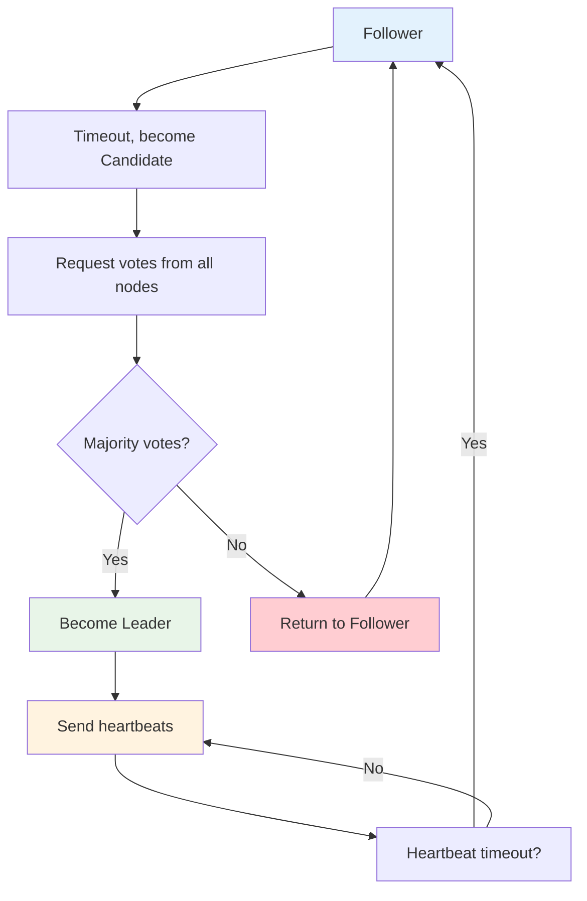
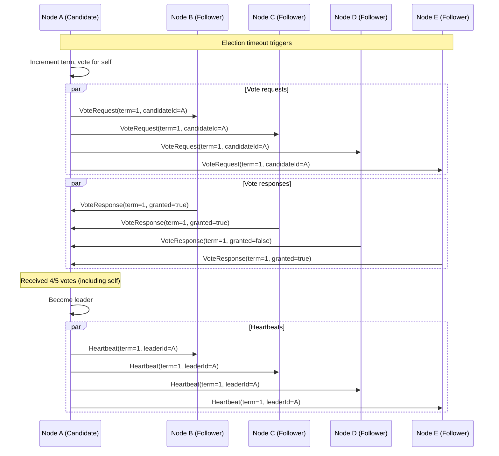
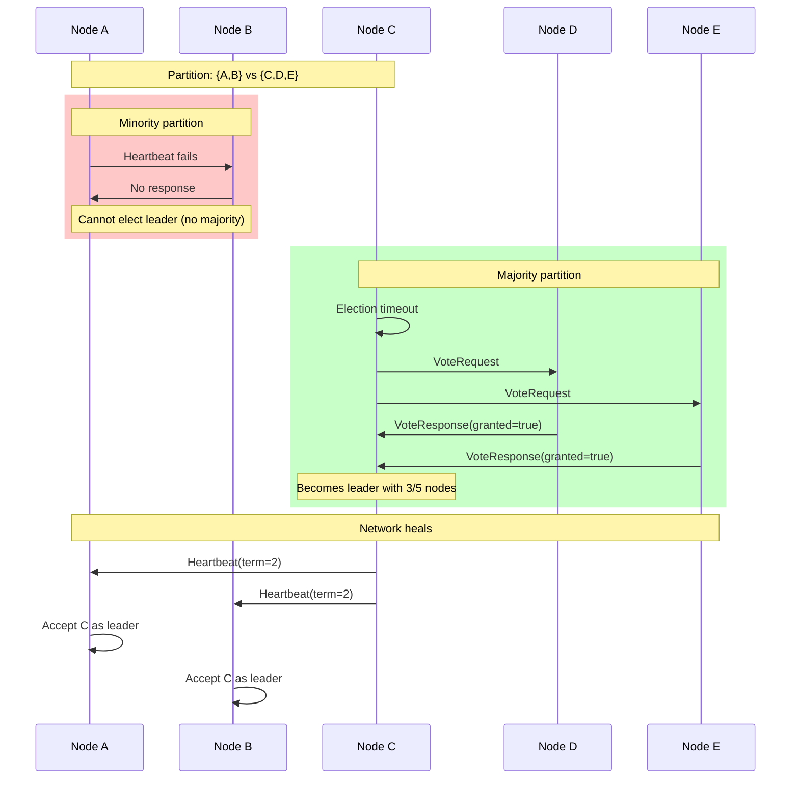
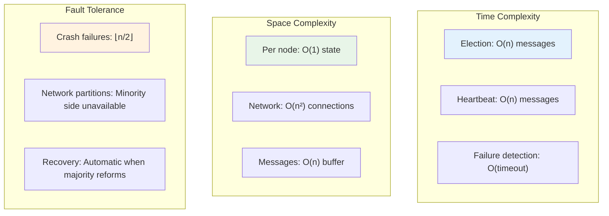
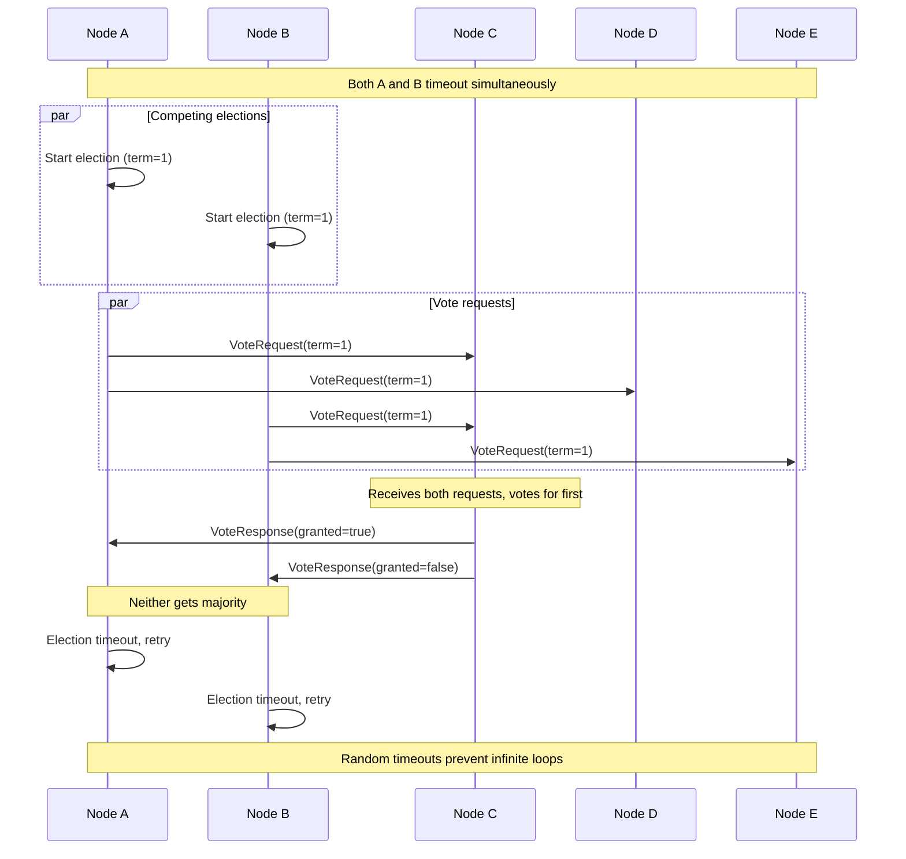

# Implementing Basic Raft: Democracy in Action

## What We're Building

We'll implement a simplified version of Raft leader election—the process by which a group of nodes agrees on who should be the leader. This is the foundation of the Raft consensus algorithm.

**Goal**: Build a system where 5 nodes can reliably elect a leader, even when some nodes fail.

## The Raft Leader Election Protocol

### States
Every node can be in one of three states:
- **Follower**: Default state, follows the leader
- **Candidate**: Competing to become leader
- **Leader**: Coordinates the cluster

### The Election Process



## Detailed Message Flow



## Core Data Structures

```go
type Node struct {
    ID          string
    State       NodeState
    CurrentTerm int
    VotedFor    string
    Peers       []string
    
    // Timers
    ElectionTimeout  time.Duration
    HeartbeatTimeout time.Duration
    LastHeartbeat    time.Time
}

type NodeState int
const (
    Follower NodeState = iota
    Candidate
    Leader
)

type VoteRequest struct {
    Term        int
    CandidateID string
}

type VoteResponse struct {
    Term        int
    VoteGranted bool
}
```

## Step-by-Step Implementation

### Step 1: Initialize the Node

```go
func NewNode(id string, peers []string) *Node {
    return &Node{
        ID:               id,
        State:            Follower,
        CurrentTerm:      0,
        VotedFor:         "",
        Peers:            peers,
        ElectionTimeout:  randomTimeout(150, 300), // 150-300ms
        HeartbeatTimeout: 50 * time.Millisecond,
        LastHeartbeat:    time.Now(),
    }
}

func randomTimeout(min, max int) time.Duration {
    return time.Duration(rand.Intn(max-min)+min) * time.Millisecond
}
```

**Why random timeouts?** If all nodes had the same timeout, they'd all start elections simultaneously, creating chaos. Random timeouts ensure elections happen one at a time.

### Step 2: Handle Election Timeout

```go
func (n *Node) checkElectionTimeout() {
    if n.State == Leader {
        return // Leaders don't participate in elections
    }
    
    if time.Since(n.LastHeartbeat) > n.ElectionTimeout {
        n.startElection()
    }
}

func (n *Node) startElection() {
    n.State = Candidate
    n.CurrentTerm++
    n.VotedFor = n.ID
    n.LastHeartbeat = time.Now()
    
    fmt.Printf("Node %s starting election for term %d\n", n.ID, n.CurrentTerm)
    
    // Vote for ourselves
    votes := 1
    
    // Request votes from all peers
    for _, peer := range n.Peers {
        if peer != n.ID {
            if n.requestVote(peer) {
                votes++
            }
        }
    }
    
    // Check if we won
    majority := len(n.Peers)/2 + 1
    if votes >= majority {
        n.becomeLeader()
    } else {
        n.becomeFollower()
    }
}
```

### Step 3: Handle Vote Requests

```go
func (n *Node) handleVoteRequest(req VoteRequest) VoteResponse {
    response := VoteResponse{
        Term:        n.CurrentTerm,
        VoteGranted: false,
    }
    
    // If candidate's term is older, reject
    if req.Term < n.CurrentTerm {
        return response
    }
    
    // If candidate's term is newer, update our term
    if req.Term > n.CurrentTerm {
        n.CurrentTerm = req.Term
        n.VotedFor = ""
        n.becomeFollower()
    }
    
    // Grant vote if we haven't voted or voted for this candidate
    if n.VotedFor == "" || n.VotedFor == req.CandidateID {
        n.VotedFor = req.CandidateID
        n.LastHeartbeat = time.Now()
        response.VoteGranted = true
        response.Term = n.CurrentTerm
        
        fmt.Printf("Node %s granted vote to %s for term %d\n", 
                   n.ID, req.CandidateID, n.CurrentTerm)
    }
    
    return response
}
```

### Step 4: State Transitions

```go
func (n *Node) becomeLeader() {
    n.State = Leader
    fmt.Printf("Node %s became leader for term %d\n", n.ID, n.CurrentTerm)
    
    // Start sending heartbeats
    go n.sendHeartbeats()
}

func (n *Node) becomeFollower() {
    n.State = Follower
    n.ElectionTimeout = randomTimeout(150, 300)
    n.LastHeartbeat = time.Now()
}

func (n *Node) sendHeartbeats() {
    for n.State == Leader {
        for _, peer := range n.Peers {
            if peer != n.ID {
                n.sendHeartbeat(peer)
            }
        }
        time.Sleep(n.HeartbeatTimeout)
    }
}
```

### Step 5: Handle Heartbeats

```go
type HeartbeatRequest struct {
    Term     int
    LeaderID string
}

func (n *Node) handleHeartbeat(req HeartbeatRequest) {
    // If heartbeat is from older term, ignore
    if req.Term < n.CurrentTerm {
        return
    }
    
    // If heartbeat is from newer term, update and become follower
    if req.Term > n.CurrentTerm {
        n.CurrentTerm = req.Term
        n.VotedFor = ""
    }
    
    // Valid heartbeat - reset election timeout
    n.becomeFollower()
    fmt.Printf("Node %s received heartbeat from leader %s (term %d)\n", 
               n.ID, req.LeaderID, req.Term)
}
```

## Running the Election

```go
func main() {
    // Create a 5-node cluster
    nodeIDs := []string{"A", "B", "C", "D", "E"}
    nodes := make([]*Node, len(nodeIDs))
    
    for i, id := range nodeIDs {
        nodes[i] = NewNode(id, nodeIDs)
    }
    
    // Start all nodes
    for _, node := range nodes {
        go node.run()
    }
    
    // Let them run for 5 seconds
    time.Sleep(5 * time.Second)
    
    // Check who's the leader
    for _, node := range nodes {
        if node.State == Leader {
            fmt.Printf("Final leader: %s (term %d)\n", node.ID, node.CurrentTerm)
        }
    }
}

func (n *Node) run() {
    ticker := time.NewTicker(10 * time.Millisecond)
    defer ticker.Stop()
    
    for {
        select {
        case <-ticker.C:
            n.checkElectionTimeout()
        }
    }
}
```

## Key Insights from This Implementation

### 1. **Split Vote Prevention**
Random timeouts ensure that elections happen sequentially, not simultaneously. This prevents split votes where multiple candidates compete.

### 2. **Term Monotonicity**
Terms only increase, never decrease. This ensures that old messages from crashed leaders don't cause confusion.

### 3. **Majority Rule**
A candidate needs votes from a majority of nodes (including itself) to become leader. This ensures at most one leader per term.

### 4. **Heartbeat Suppression**
Regular heartbeats from the leader prevent followers from starting unnecessary elections.

## Testing Failure Scenarios

### Simulate Leader Failure
```go
// Kill the leader after 2 seconds
time.Sleep(2 * time.Second)
for _, node := range nodes {
    if node.State == Leader {
        node.State = Follower // Simulate crash
        fmt.Printf("Leader %s crashed!\n", node.ID)
        break
    }
}
```

### Simulate Network Partition
```go
// Isolate node A from others
nodeA.Peers = []string{"A"} // Only sees itself
```

## Advanced Scenarios

### Network Partition Recovery



### Performance Characteristics



## What We've Accomplished

This basic implementation demonstrates:
- ✅ **Leader election** with majority voting
- ✅ **Failure detection** via heartbeat timeouts
- ✅ **Term-based ordering** to prevent confusion
- ✅ **Split vote prevention** via random timeouts

## System Behavior Analysis

### Normal Operation Timeline

```mermaid
gantt
    title Raft Leader Election Timeline
    dateFormat X
    axisFormat %Ls
    
    section Node A
    Follower    :a1, 0, 150
    Candidate   :a2, 150, 200
    Leader      :a3, 200, 1000
    
    section Node B
    Follower    :b1, 0, 1000
    
    section Node C
    Follower    :c1, 0, 1000
    
    section Node D
    Follower    :d1, 0, 1000
    
    section Node E
    Follower    :e1, 0, 1000
```



### Split Vote Scenario



## Next Steps

This is just leader election. A full Raft implementation would also include:
- **Log replication**: Distributing commands to followers
- **Safety guarantees**: Ensuring committed entries are never lost
- **Membership changes**: Adding/removing nodes safely
- **Log compaction**: Cleaning up old entries

But you now understand the democratic foundation that makes it all possible!