# Safety vs Liveness: The Fundamental Tension

## The Core Dilemma

Every consensus algorithm faces a fundamental tension between two competing goals:

**Safety**: "Never make a wrong decision"
**Liveness**: "Always make progress"

This isn't just a theoretical curiosity—it's the central engineering challenge that determines how your distributed system behaves under stress.

## Understanding Safety

**Safety** means the system never violates its correctness guarantees, even under the worst conditions.

### Safety Properties in Consensus:
1. **Agreement**: All nodes decide on the same value
2. **Validity**: The decided value was actually proposed by someone
3. **Integrity**: Each node decides at most once

### Safety in Action:
```
Scenario: Two nodes trying to commit different values

Unsafe system:
Node A: "I commit value X"
Node B: "I commit value Y"  
Result: Split brain! System violated agreement.

Safe system:
Node A: "I want to commit X, but I need majority approval"
Node B: "I want to commit Y, but I need majority approval"
Result: At most one gets majority. Safety preserved.
```

**The Safety Mindset**: "Better to be stuck than wrong."

## Understanding Liveness

**Liveness** means the system eventually makes progress and doesn't get stuck forever.

### Liveness Properties in Consensus:
1. **Termination**: All non-faulty nodes eventually decide
2. **Progress**: The system doesn't deadlock
3. **Responsiveness**: Decisions happen in reasonable time

### Liveness in Action:
```
Scenario: Network partition healing

System without liveness:
Network splits → No majority → System stuck forever
Even when network heals → Still stuck (bad algorithm)

System with liveness:
Network splits → No majority → System stuck temporarily
Network heals → Majority reforms → Progress resumes
```

**The Liveness Mindset**: "We must eventually succeed."

## The FLP Impossibility Result

The **Fischer-Lynch-Paterson theorem** (1985) proves that in an asynchronous distributed system, you cannot guarantee both safety and liveness in the presence of even one node failure.

### The Proof Intuition:
```
Consider 3 nodes: A, B, C
Proposal: "Commit value X"

Scenario 1: A crashes early
- B and C must decide based on their communication
- But they can't tell if A crashed or is just slow

Scenario 2: A is just slow
- B and C wait for A's response
- But waiting forever violates liveness

The dilemma: 
- If they decide without A → might violate safety
- If they wait for A → might violate liveness
```

### Visual Proof of FLP Impossibility


This isn't a limitation of specific algorithms—it's mathematically fundamental.

## How Real Algorithms Handle The Trade-off

### 1. **Paxos: Safety First**

**Philosophy**: Prioritize safety, accept that liveness isn't guaranteed.

```
Paxos approach:
- Will never make wrong decisions (perfect safety)
- Might get stuck in some scenarios (compromised liveness)
- Requires additional mechanisms (like failure detectors) for liveness
```

**When it gets stuck**:
- Competing proposers can cause infinite loops
- Network partitions can halt progress indefinitely
- Requires external intervention or timeouts

**Trade-off**: Rock-solid correctness, but might need manual intervention.

### 2. **Raft: Liveness Through Leadership**

**Philosophy**: Strong leadership ensures liveness, careful design preserves safety.

```
Raft approach:
- Elect a strong leader who makes all decisions
- Leader ensures liveness (makes progress)
- Election protocol ensures safety (at most one leader per term)
```

**How it ensures liveness**:
- Heartbeat timeouts detect leader failures
- Randomized timeouts prevent election conflicts
- New leader election restores progress

**Trade-off**: Simpler liveness, but temporary unavailability during leader changes.

### 3. **PBFT: Liveness Through Rounds**

**Philosophy**: Use multiple rounds to ensure both safety and liveness.

```
PBFT approach:
- Three-phase protocol: Pre-prepare, Prepare, Commit
- If any phase fails, restart with new view
- View changes ensure liveness despite failures
```

**How it balances both**:
- Multiple rounds ensure safety (no conflicting commits)
- View changes ensure liveness (progress despite failures)
- Timeout mechanisms detect and handle failures

**Trade-off**: Higher message complexity, but predictable progress.

## Practical Implications

### For System Design:

**Choose safety-first when**:
- Financial systems (better stuck than wrong)
- Critical infrastructure (safety over speed)
- Configuration management (consistency crucial)

**Choose liveness-first when**:
- Monitoring systems (better approximate than absent)
- Caching layers (stale data better than no data)
- Real-time systems (deadlines matter more than perfection)

### For Operations:

**Safety-first systems require**:
- Monitoring for liveness violations
- Manual intervention procedures
- Clear escalation paths

**Liveness-first systems require**:
- Monitoring for safety violations
- Automatic reconciliation
- Data consistency checks

## The Partial Synchrony Escape Hatch

Most practical systems assume **partial synchrony**:
- Networks have unpredictable delays, but not infinite delays
- Processes can be slow, but not stopped forever
- Eventually, timing assumptions hold

This allows algorithms to provide:
- **Safety always**: Never violate correctness
- **Liveness eventually**: Make progress when network stabilizes

```
Partial synchrony model:
Time 0-100: Network chaos (only safety guaranteed)
Time 100+: Network stable (both safety and liveness)
```

## Mental Models for Each Approach

### **Safety-First (Paxos)**
Think of it as a **supreme court**: 
- Never makes wrong decisions
- Might deadlock on contentious issues
- Requires external intervention sometimes

### **Liveness-First (Raft)**
Think of it as a **corporate hierarchy**:
- CEO makes decisions (leader ensures progress)
- If CEO leaves, elect new one (leader election)
- Temporary chaos during transitions

### **Balanced (PBFT)**
Think of it as a **jury system**:
- Multiple rounds ensure thorough deliberation
- Hung juries trigger retrials
- Eventually reaches verdict

## Real-World Impact Timeline


## Advanced Considerations

### **Epoch-based Solutions**
Modern systems use epochs to provide both:
```
Epoch N: Safety-first mode (careful consensus)
Epoch N+1: Liveness-first mode (aggressive progress)
```

### **Application-level Trade-offs**
Some systems push the trade-off to the application:
```
Database: "Do you want consistent reads or available writes?"
Message Queue: "Do you want exactly-once or at-least-once delivery?"
```

### **Geographic Distribution**
Distance amplifies the trade-off:
- Single datacenter: Both safety and liveness achievable
- Cross-region: Must choose one to prioritize
- Global scale: Trade-offs become extreme

## The CAP Theorem Connection


## The Bottom Line

The safety vs liveness tension isn't a bug—it's a fundamental feature of distributed systems. The best systems:

1. **Choose explicitly**: Know which property you're prioritizing
2. **Design for trade-offs**: Build mechanisms to handle violations
3. **Monitor both**: Watch for when the trade-off activates
4. **Fail gracefully**: Degrade service rather than corrupt data

Understanding this tension is what separates good distributed systems engineers from great ones. It's not about avoiding the trade-off—it's about making it consciously and handling it gracefully.

## The Engineering Decision Matrix


## Trade-off Visualization by Use Case

```mermaid
flowchart TB
    subgraph "Safety-Critical Systems"
        A1["💰 Financial Systems"]
        A2["🏥 Medical Devices"]
        A3["✈️ Air Traffic Control"]
        A4["Strategy: Paxos-based"]
    end
    
    subgraph "Balanced Systems"
        B1["🗄️ Distributed Databases"]
        B2["🔧 Configuration Management"]
        B3["📊 Analytics Platforms"]
        B4["Strategy: Raft-based"]
    end
    
    subgraph "Performance-Critical Systems"
        C1["🎮 Online Gaming"]
        C2["📺 Live Streaming"]
        C3["📱 Social Media"]
        C4["Strategy: Eventually Consistent"]
    end
    
    A1 --> A4
    A2 --> A4
    A3 --> A4
    
    B1 --> B4
    B2 --> B4
    B3 --> B4
    
    C1 --> C4
    C2 --> C4
    C3 --> C4
    
    style A4 fill:#ffcdd2
    style B4 fill:#fff3e0
    style C4 fill:#e8f5e8
```

