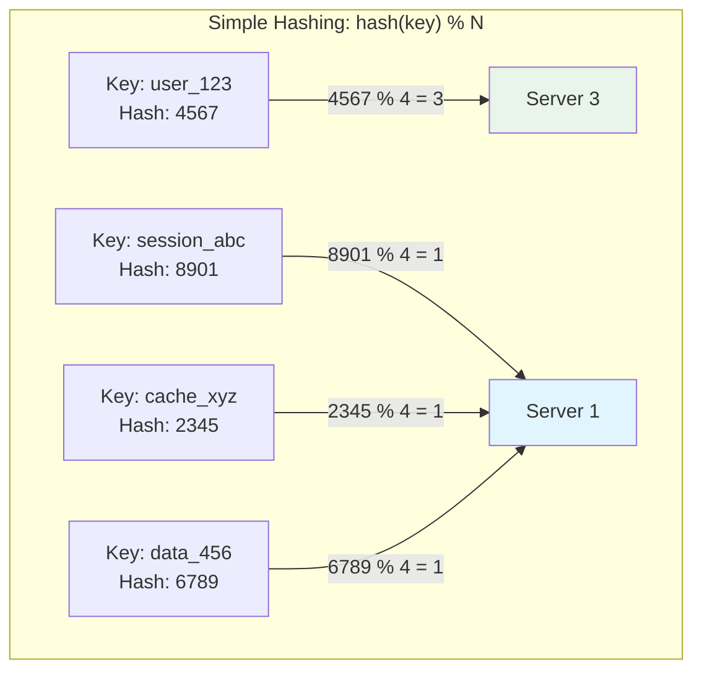
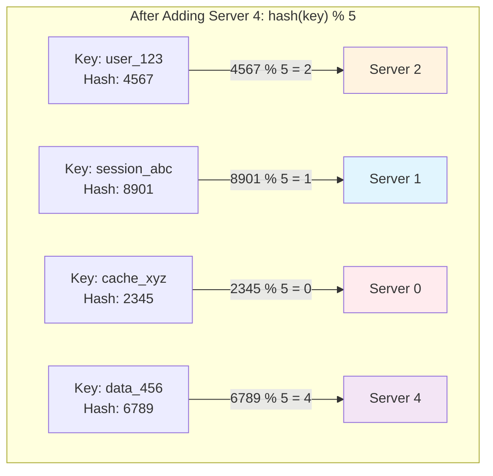
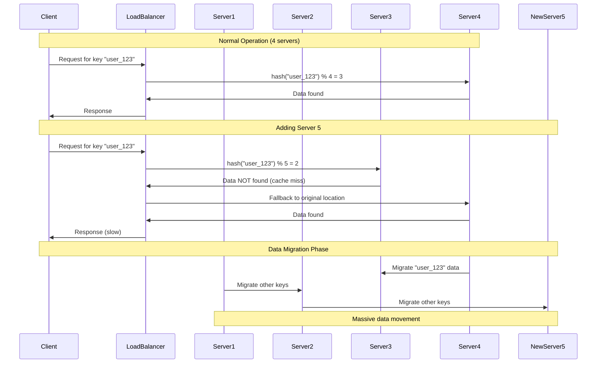
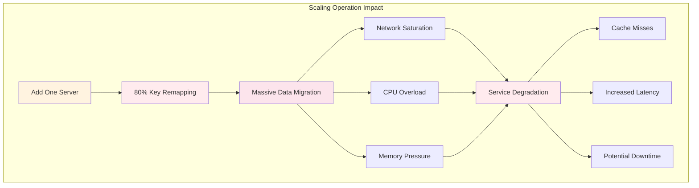
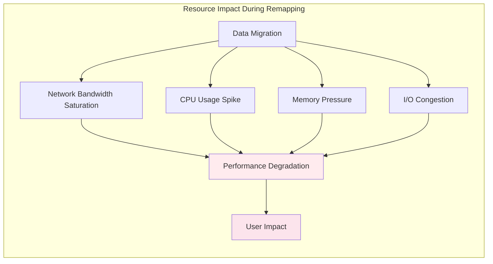
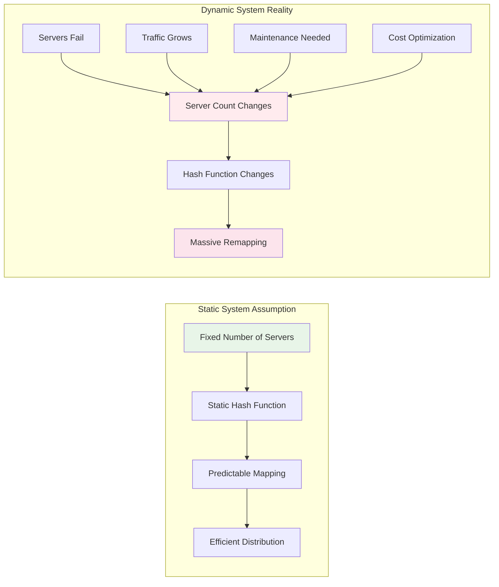
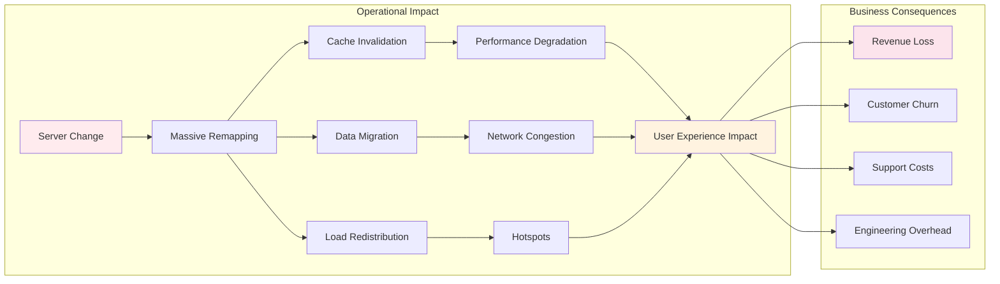
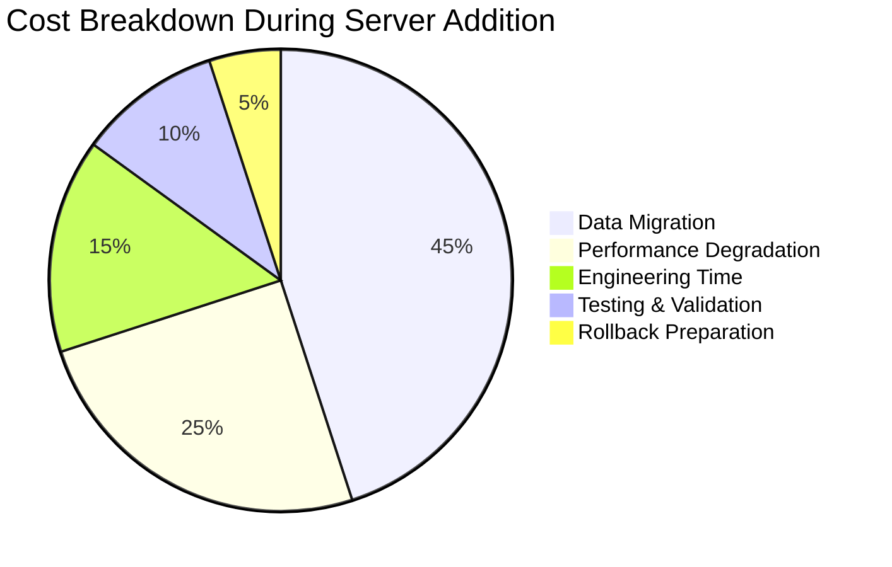
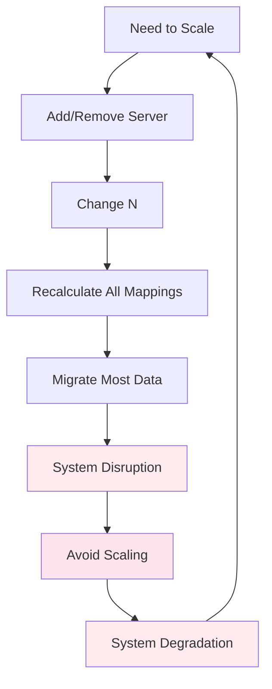
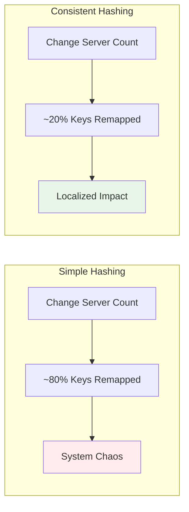

# The Core Problem: The Chaos of Changing Server Count

## The Classical Hashing Disaster

Imagine you're running a library with multiple storage rooms, and you have a simple system: use the first letter of each book's title to decide which room it goes in. Room 1 gets A-F, Room 2 gets G-L, and so on. This works perfectly—until you need to add a new room.

Suddenly, to keep things balanced, you need to redistribute: Room 1 gets A-E, Room 2 gets F-J, Room 3 gets K-O, and so on. **Every single book needs to move to a different room.** This is exactly what happens with traditional hash-based distribution in distributed systems.

When you distribute data across servers using the intuitive modulo operation, adding or removing even a single server forces nearly **every piece of data to relocate**, creating a system-wide catastrophe.

### Visualizing the Problem

Let's see how simple hashing works and why it fails:



Now watch what happens when we add just one server:



**Notice**: Only `session_abc` stayed on the same server! All other keys moved to completely different servers.

### The Cascade Effect

This isn't just a theoretical problem. Here's what happens in a real distributed system:



**The Insight**: What seems like a simple change (adding one server) creates a system-wide catastrophe.

## The Mathematics of Mayhem

### The Simple Hash Distribution Problem

Traditional hashing creates a mathematical trap: it tightly couples your data distribution with your server count. Think of it like a mathematical gear system where changing one gear (server count) forces every other gear (data location) to change position.

**The Mathematical Reality:**
The modulo operation transforms any change in server count into a global reshuffling event. When you change from 4 to 5 servers, the mathematical relationship shifts for nearly every piece of data. What was previously a predictable assignment becomes chaos.

**Key Insight**: The modulo operation creates global dependencies—every piece of data depends on the total server count, so changing that count affects virtually everything.

### The Remapping Catastrophe

Here's the cruel irony: the larger and more successful your system becomes, the more painful it is to scale. When you add one server to a small cluster, maybe 80% of your data needs to move. But when you add one server to a large cluster, 99% of your data needs to relocate.

**The Scaling Paradox**: 
- **Small systems**: Adding a server causes 80% data movement
- **Large systems**: Adding a server causes 99% data movement

This creates a vicious cycle where success makes scaling progressively more expensive and risky. The very growth that necessitates more servers makes adding those servers increasingly painful.

### The Domino Effect



## The Real-World Impact

### Database Sharding Nightmare

Consider a distributed database storing user data across multiple shards. With simple hashing:

**Before Adding Server:**
- 1 million user records distributed across 4 servers
- Each server handles ~250,000 records
- System running smoothly

**After Adding 5th Server:**
- ~800,000 records need to move to different servers
- Each record migration requires: read from old server → network transfer → write to new server
- **Estimated downtime**: 2-4 hours for large datasets

**Business Impact:**
- **E-commerce platform**: Lost sales during migration
- **Social media**: User experience degradation
- **Financial services**: Regulatory compliance issues
- **Gaming**: Player data unavailability

### Network and System Impact

The remapping creates a perfect storm of resource consumption:



**Quantified Impact Examples:**
- **Small System (10K records)**: 8K migrations, ~minutes of degradation
- **Medium System (1M records)**: 800K migrations, ~hours of degradation  
- **Large System (100M records)**: 80M migrations, potential day-long impact

## The Theoretical Foundation

### Why Simple Hashing Fails

The fundamental problem with `hash(key) % N` is that it creates a **tight coupling** between the hash space and the number of servers. When `N` changes:

1. **Mathematical Chaos**: The modulo operation means that `hash(key) % N` and `hash(key) % (N+1)` have completely different results for most keys
2. **Avalanche Effect**: A small change in `N` causes a massive change in key distribution
3. **No Locality**: Keys that were previously on the same server get scattered across all servers
4. **Predictable Disaster**: The remapping percentage is approximately `(N-1)/N` for adding one server

### The Mathematical Truth

The mathematical foundation reveals why this problem is so severe: when you change the total number of servers, you're essentially changing the "rules of the game" for every piece of data simultaneously.

Think of it like changing the number of lanes on a highway while cars are driving. Most cars need to change lanes, creating massive disruption. The more cars (data) you have, the more chaotic the lane changes become.

**The Pattern**: As systems grow larger, adding one server forces almost everything to move, making scaling increasingly painful and expensive.

### The Deeper Issue

The root cause is that simple hashing treats the distributed system as a **static entity** rather than a **dynamic, evolving system**.



**In the real world:**
- Servers fail and need replacement
- Traffic patterns change requiring different capacity
- New servers are added to handle growth
- Maintenance requires temporary server removal
- Cost optimization drives server consolidation

**Simple hashing is fundamentally incompatible with the dynamic nature of distributed systems.**

## The Business Impact

The remapping problem has real business consequences:



**Key Business Impacts:**
- **Downtime**: Hours of service interruption during scaling
- **Resource waste**: Massive bandwidth and CPU usage during rebalancing
- **Complexity**: Need for sophisticated migration tools and procedures
- **Risk**: High probability of data loss or corruption during migration

### The Hidden Costs



**Real-World Examples:**
- **E-commerce during Black Friday**: Adding cache servers causes 2-hour outage
- **Social media platform**: Database resharding takes 12 hours, affecting 100M users
- **Gaming service**: Server addition causes 6-hour maintenance window
- **Financial system**: Cannot add capacity during trading hours due to risk

## The Architectural Anti-Pattern

Simple hashing creates what we call the **"Reshuffling Anti-Pattern"**:



**The Vicious Cycle:**
1. System needs to scale
2. Scaling causes massive disruption
3. Teams avoid scaling
4. System performance degrades
5. More urgent need to scale
6. Repeat...

## Key Insights

### The Fundamental Problem

Simple hashing creates a **fragile system** where:

1. **Scaling is expensive**: Adding capacity requires massive data movement
2. **Failures are catastrophic**: Losing a server forces system-wide reorganization
3. **Load balancing is crude**: No consideration for actual server capacity or load
4. **Recovery is slow**: Rebalancing takes time proportional to total data size

### The Mathematical Foundation of Failure

The fundamental issue is **tight coupling** between hash space and server count:

```mermaid
graph TD
    subgraph "Why Simple Hashing Fails"
        A[Hash Function] --> B[hash(key)]
        B --> C[Modulo Operation]
        C --> D[hash(key) % N]
        D --> E[Server Assignment]
        
        F[Server Count N] --> C
        G[Change in N] --> H[Different Modulo Result]
        H --> I[Different Server Assignment]
        I --> J[Massive Remapping]
    end
    
    style G fill:#ffebee
    style J fill:#fce4ec
```

### The Solution Preview

The solution requires a different approach—one that minimizes the impact of changes and treats system evolution as a normal, expected occurrence rather than a catastrophic event.



**The Promise**: Consistent hashing reduces key remapping from 80% to 20%, transforming scaling from a system-wide catastrophe into a localized adjustment.

## The Core Insight

The breakthrough realization is that **the problem isn't with hashing itself, but with the tight coupling between hash results and server count**. 

Simple hashing asks: "Given N servers, where should this key go?"
Consistent hashing asks: "Given this key's hash, which server is closest to it in hash space?"

This subtle shift in perspective—from modulo arithmetic to geometric proximity—is what makes consistent hashing revolutionary. Instead of recalculating everything when server count changes, we simply find the new closest neighbor.

This is where consistent hashing comes in, providing a stable foundation for distributed systems that need to grow, shrink, and adapt over time without the chaos of massive data reshuffling.