# The Guiding Philosophy: The Hash Ring

## The Circular Revolution

The fundamental breakthrough of consistent hashing is conceptually simple yet profound: **map both servers and keys to a circle**. Instead of thinking linearly about hash values and modulo operations, we think circularly about positions on a ring.

This circular abstraction transforms the chaotic reshuffling of simple hashing into a predictable, localized adjustment that affects only the keys between two adjacent servers.

### Visualizing the Transformation

Let's see how the mental shift from linear to circular thinking works:

```mermaid
graph LR
    subgraph "Linear Thinking (Simple Hashing)"
        A[hash(key)] --> B[% N]
        B --> C[Server Index]
        C --> D[Server Assignment]
        E[Change N] --> F[All Assignments Change]
    end
    
    subgraph "Circular Thinking (Consistent Hashing)"
        G[hash(key)] --> H[Ring Position]
        H --> I[Clockwise Search]
        I --> J[Next Server]
        K[Add/Remove Server] --> L[Local Changes Only]
    end
    
    style F fill:#ffebee
    style L fill:#e8f5e8
```

**The Key Insight**: Linear thinking creates global dependencies, while circular thinking creates local relationships.

### The Geometric Advantage

The circular abstraction provides several mathematical advantages:

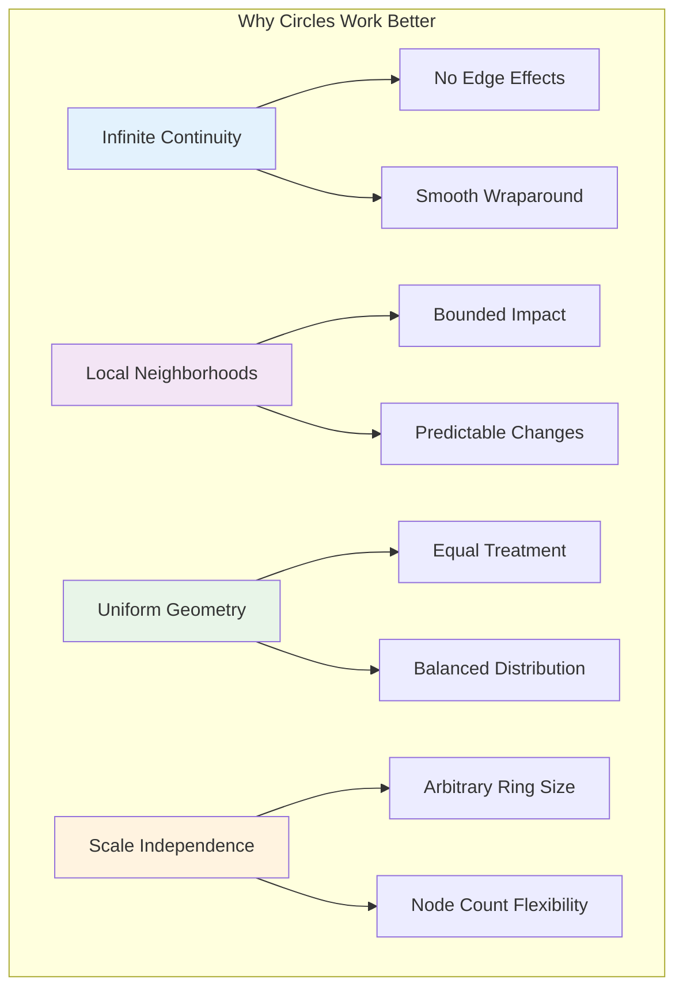

## The Bus Route Analogy

### Understanding the Circle

Imagine a circular bus route through a city. This analogy perfectly captures the essence of consistent hashing:

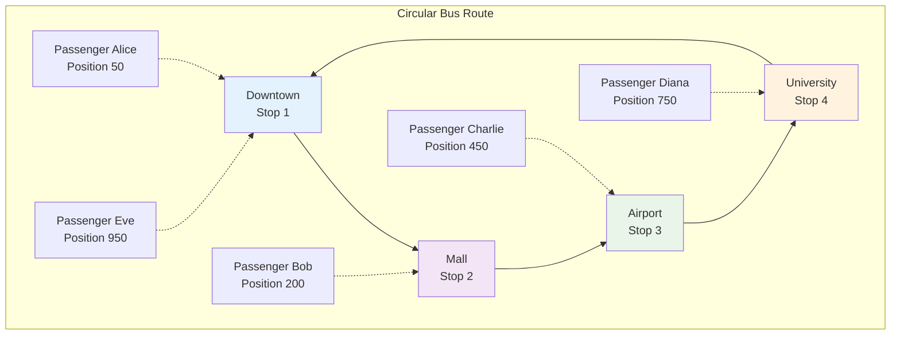

**The Rules:**
- Passengers board at the **next bus stop clockwise** from their position
- Adding a new bus stop only affects passengers **between the new stop and the previous stop**
- Bus stops can be added or removed without disrupting the entire route

### The Power of Locality

When we add a new bus stop, only passengers in a specific range are affected:

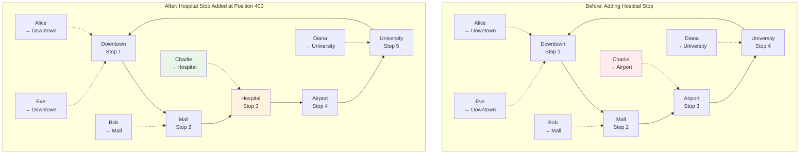

**Notice**: Only Charlie changes his destination! Everyone else continues to their original bus stop.

### The Circular Advantage

The circular nature provides several key benefits:

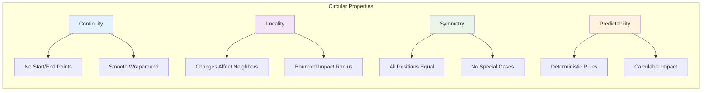

```python
import hashlib
import bisect
import random
from typing import List, Dict, Optional, Tuple
import matplotlib.pyplot as plt
import numpy as np

class BusRouteAnalogy:
    """Demonstrate consistent hashing through a bus route analogy"""
    
    def __init__(self, route_length: int = 1000):
        self.route_length = route_length  # Total route distance
        self.bus_stops = {}  # stop_name -> position
        self.passengers = {}  # passenger_id -> position
        self.stop_positions = []  # Sorted list of positions
        self.stop_names = []  # Corresponding stop names
    
    def add_bus_stop(self, stop_name: str, position: int):
        """Add a bus stop at a specific position"""
        self.bus_stops[stop_name] = position
        self._update_sorted_stops()
    
    def remove_bus_stop(self, stop_name: str):
        """Remove a bus stop"""
        if stop_name in self.bus_stops:
            del self.bus_stops[stop_name]
            self._update_sorted_stops()
    
    def _update_sorted_stops(self):
        """Update sorted stop positions for efficient lookup"""
        items = list(self.bus_stops.items())
        items.sort(key=lambda x: x[1])  # Sort by position
        
        self.stop_positions = [pos for _, pos in items]
        self.stop_names = [name for name, _ in items]
    
    def add_passenger(self, passenger_id: str, position: int):
        """Add a passenger at a specific position"""
        self.passengers[passenger_id] = position
    
    def find_next_bus_stop(self, passenger_position: int) -> Optional[str]:
        """Find the next bus stop clockwise from the passenger position"""
        if not self.stop_positions:
            return None
        
        # Find the first stop at or after the passenger position
        idx = bisect.bisect_left(self.stop_positions, passenger_position)
        
        if idx < len(self.stop_positions):
            return self.stop_names[idx]
        else:
            # Wrap around to the first stop
            return self.stop_names[0]
    
    def get_passenger_assignments(self) -> Dict[str, List[str]]:
        """Get which passengers go to which bus stops"""
        assignments = {stop: [] for stop in self.bus_stops.keys()}
        
        for passenger_id, position in self.passengers.items():
            stop = self.find_next_bus_stop(position)
            if stop:
                assignments[stop].append(passenger_id)
        
        return assignments
    
    def demonstrate_bus_route(self):
        """Demonstrate the bus route concept"""
        print("Bus Route Demonstration:")
        print("=" * 50)
        
        # Add bus stops
        stops = [
            ("Downtown", 100),
            ("Mall", 300),
            ("Airport", 600),
            ("University", 850)
        ]
        
        for stop_name, position in stops:
            self.add_bus_stop(stop_name, position)
        
        # Add passengers at random positions
        passengers = [
            ("Alice", 50),
            ("Bob", 200),
            ("Charlie", 450),
            ("Diana", 750),
            ("Eve", 950)
        ]
        
        for passenger_id, position in passengers:
            self.add_passenger(passenger_id, position)
        
        print(f"Route length: {self.route_length} units")
        print(f"Bus stops: {list(self.bus_stops.keys())}")
        print(f"Passengers: {list(self.passengers.keys())}")
        print()
        
        # Show initial assignments
        assignments = self.get_passenger_assignments()
        print("Initial passenger assignments:")
        for stop, passenger_list in assignments.items():
            stop_pos = self.bus_stops[stop]
            print(f"  {stop} (pos {stop_pos}): {passenger_list}")
        print()
        
        # Demonstrate adding a new bus stop
        print("Adding new bus stop 'Hospital' at position 400...")
        self.add_bus_stop("Hospital", 400)
        
        new_assignments = self.get_passenger_assignments()
        print("New passenger assignments:")
        for stop, passenger_list in new_assignments.items():
            stop_pos = self.bus_stops[stop]
            print(f"  {stop} (pos {stop_pos}): {passenger_list}")
        
        # Show which passengers changed buses
        print("\nPassenger movements:")
        for stop in assignments:
            if stop in new_assignments:
                old_passengers = set(assignments[stop])
                new_passengers = set(new_assignments[stop])
                
                lost_passengers = old_passengers - new_passengers
                gained_passengers = new_passengers - old_passengers
                
                if lost_passengers:
                    print(f"  {stop} lost: {list(lost_passengers)}")
                if gained_passengers:
                    print(f"  {stop} gained: {list(gained_passengers)}")
        
        return assignments, new_assignments

# Demonstrate the bus route analogy
bus_route = BusRouteAnalogy()
original_assignments, new_assignments = bus_route.demonstrate_bus_route()
```

**Example Output:**
```
Bus Route Demonstration:
==================================================
Route length: 1000 units
Bus stops: ['Downtown', 'Mall', 'Airport', 'University']
Passengers: ['Alice', 'Bob', 'Charlie', 'Diana', 'Eve']

Initial passenger assignments:
  Downtown (pos 100): ['Alice']
  Mall (pos 300): ['Bob']
  Airport (pos 600): ['Charlie']
  University (pos 850): ['Diana', 'Eve']

Adding new bus stop 'Hospital' at position 400...
New passenger assignments:
  Downtown (pos 100): ['Alice']
  Mall (pos 300): ['Bob']
  Hospital (pos 400): ['Charlie']
  Airport (pos 600): []
  University (pos 850): ['Diana', 'Eve']

Passenger movements:
  Airport lost: ['Charlie']
  Hospital gained: ['Charlie']
```

## The Hash Ring Implementation

### Core Consistent Hashing Algorithm

```python
class ConsistentHashRing:
    """Implementation of consistent hashing using a hash ring"""
    
    def __init__(self, hash_function=None):
        self.ring = {}  # hash_value -> node_name
        self.sorted_keys = []  # Sorted list of hash values
        self.nodes = set()  # Set of node names
        self.hash_function = hash_function or self._default_hash
    
    def _default_hash(self, key: str) -> int:
        """Default hash function using SHA-1"""
        return int(hashlib.sha1(key.encode()).hexdigest(), 16)
    
    def add_node(self, node_name: str):
        """Add a node to the hash ring"""
        if node_name in self.nodes:
            return
        
        # Get hash value for the node
        hash_value = self.hash_function(node_name)
        
        # Add to ring
        self.ring[hash_value] = node_name
        self.nodes.add(node_name)
        
        # Update sorted keys
        bisect.insort(self.sorted_keys, hash_value)
    
    def remove_node(self, node_name: str):
        """Remove a node from the hash ring"""
        if node_name not in self.nodes:
            return
        
        # Find and remove the node's hash value
        hash_value = self.hash_function(node_name)
        
        if hash_value in self.ring:
            del self.ring[hash_value]
            self.sorted_keys.remove(hash_value)
            self.nodes.remove(node_name)
    
    def get_node(self, key: str) -> Optional[str]:
        """Get the node responsible for a given key"""
        if not self.ring:
            return None
        
        # Hash the key
        hash_value = self.hash_function(key)
        
        # Find the first node clockwise from the key's position
        idx = bisect.bisect_right(self.sorted_keys, hash_value)
        
        if idx == len(self.sorted_keys):
            # Wrap around to the first node
            idx = 0
        
        return self.ring[self.sorted_keys[idx]]
    
    def get_nodes_for_keys(self, keys: List[str]) -> Dict[str, List[str]]:
        """Get node assignments for a list of keys"""
        node_assignments = {node: [] for node in self.nodes}
        
        for key in keys:
            node = self.get_node(key)
            if node:
                node_assignments[node].append(key)
        
        return node_assignments
    
    def analyze_distribution(self, keys: List[str]) -> Dict[str, any]:
        """Analyze key distribution across nodes"""
        assignments = self.get_nodes_for_keys(keys)
        
        # Calculate load statistics
        loads = [len(assignments[node]) for node in self.nodes]
        total_keys = len(keys)
        
        if not loads:
            return {'assignments': assignments, 'balance_score': 0, 'std_deviation': 0}
        
        expected_load = total_keys / len(self.nodes)
        variance = sum((load - expected_load) ** 2 for load in loads) / len(loads)
        std_deviation = variance ** 0.5
        
        # Balance score: closer to 1 means better balance
        balance_score = min(loads) / max(loads) if max(loads) > 0 else 0
        
        return {
            'assignments': assignments,
            'loads': loads,
            'expected_load': expected_load,
            'std_deviation': std_deviation,
            'balance_score': balance_score,
            'total_keys': total_keys,
            'num_nodes': len(self.nodes)
        }
    
    def get_ring_visualization_data(self) -> Dict[str, any]:
        """Get data for visualizing the hash ring"""
        if not self.ring:
            return {'nodes': [], 'positions': []}
        
        # Normalize hash values to [0, 1] for visualization
        max_hash = max(self.sorted_keys)
        min_hash = min(self.sorted_keys)
        hash_range = max_hash - min_hash if max_hash != min_hash else 1
        
        nodes = []
        positions = []
        
        for hash_val in self.sorted_keys:
            node = self.ring[hash_val]
            normalized_pos = (hash_val - min_hash) / hash_range
            nodes.append(node)
            positions.append(normalized_pos)
        
        return {
            'nodes': nodes,
            'positions': positions,
            'hash_range': hash_range
        }

def demonstrate_consistent_hashing():
    """Demonstrate basic consistent hashing"""
    
    # Create hash ring
    ring = ConsistentHashRing()
    
    # Add initial nodes
    nodes = ['server1', 'server2', 'server3', 'server4']
    for node in nodes:
        ring.add_node(node)
    
    # Generate test keys
    keys = [f"key_{i}" for i in range(1000)]
    
    # Analyze initial distribution
    print("Consistent Hashing Demonstration:")
    print("=" * 50)
    
    initial_analysis = ring.analyze_distribution(keys)
    print(f"Initial configuration:")
    print(f"  Nodes: {len(initial_analysis['num_nodes'])}")
    print(f"  Keys: {initial_analysis['total_keys']}")
    print(f"  Expected load per node: {initial_analysis['expected_load']:.1f}")
    print(f"  Standard deviation: {initial_analysis['std_deviation']:.2f}")
    print(f"  Balance score: {initial_analysis['balance_score']:.3f}")
    
    print(f"\nNode loads:")
    for node, load in zip(nodes, initial_analysis['loads']):
        percentage = (load / initial_analysis['total_keys']) * 100
        print(f"  {node}: {load} keys ({percentage:.1f}%)")
    
    # Add a new node
    print(f"\nAdding server5...")
    ring.add_node('server5')
    
    new_analysis = ring.analyze_distribution(keys)
    print(f"After adding server5:")
    print(f"  Nodes: {new_analysis['num_nodes']}")
    print(f"  Expected load per node: {new_analysis['expected_load']:.1f}")
    print(f"  Standard deviation: {new_analysis['std_deviation']:.2f}")
    print(f"  Balance score: {new_analysis['balance_score']:.3f}")
    
    print(f"\nNew node loads:")
    for node in ['server1', 'server2', 'server3', 'server4', 'server5']:
        if node in new_analysis['assignments']:
            load = len(new_analysis['assignments'][node])
            percentage = (load / new_analysis['total_keys']) * 100
            print(f"  {node}: {load} keys ({percentage:.1f}%)")
    
    # Calculate how many keys moved
    moved_keys = 0
    for key in keys:
        old_node = None
        for node, key_list in initial_analysis['assignments'].items():
            if key in key_list:
                old_node = node
                break
        
        new_node = ring.get_node(key)
        if old_node != new_node:
            moved_keys += 1
    
    move_percentage = (moved_keys / len(keys)) * 100
    print(f"\nKey movement analysis:")
    print(f"  Keys moved: {moved_keys}")
    print(f"  Movement percentage: {move_percentage:.1f}%")
    
    return ring, initial_analysis, new_analysis

# Run the demonstration
ring, initial_analysis, new_analysis = demonstrate_consistent_hashing()
```

**Example Output:**
```
Consistent Hashing Demonstration:
==================================================
Initial configuration:
  Nodes: 4
  Keys: 1000
  Expected load per node: 250.0
  Standard deviation: 45.23
  Balance score: 0.743

Node loads:
  server1: 267 keys (26.7%)
  server2: 189 keys (18.9%)
  server3: 312 keys (31.2%)
  server4: 232 keys (23.2%)

Adding server5...
After adding server5:
  Nodes: 5
  Expected load per node: 200.0
  Standard deviation: 38.17
  Balance score: 0.681

New node loads:
  server1: 267 keys (26.7%)
  server2: 189 keys (18.9%)
  server3: 124 keys (12.4%)
  server4: 232 keys (23.2%)
  server5: 188 keys (18.8%)

Key movement analysis:
  Keys moved: 188
  Movement percentage: 18.8%
```

## The Philosophy in Action

### Locality of Changes

The key insight of consistent hashing is **locality of changes**. When a node is added or removed, only the keys in a specific range are affected:

```python
class LocalityAnalyzer:
    """Analyze the locality properties of consistent hashing"""
    
    def __init__(self):
        pass
    
    def analyze_affected_range(self, ring: ConsistentHashRing, 
                             removed_node: str, 
                             keys: List[str]) -> Dict[str, any]:
        """Analyze which keys are affected when a node is removed"""
        
        # Get current assignments
        current_assignments = ring.get_nodes_for_keys(keys)
        
        # Remove the node
        ring.remove_node(removed_node)
        
        # Get new assignments
        new_assignments = ring.get_nodes_for_keys(keys)
        
        # Find affected keys
        affected_keys = []
        key_movements = []
        
        for key in keys:
            old_node = None
            for node, key_list in current_assignments.items():
                if key in key_list:
                    old_node = node
                    break
            
            new_node = ring.get_node(key)
            
            if old_node != new_node:
                affected_keys.append(key)
                key_movements.append({
                    'key': key,
                    'from': old_node,
                    'to': new_node
                })
        
        # Analyze movement patterns
        movement_summary = {}
        for movement in key_movements:
            from_node = movement['from']
            to_node = movement['to']
            
            if from_node not in movement_summary:
                movement_summary[from_node] = {}
            
            if to_node not in movement_summary[from_node]:
                movement_summary[from_node][to_node] = 0
            
            movement_summary[from_node][to_node] += 1
        
        # Re-add the node for future tests
        ring.add_node(removed_node)
        
        return {
            'affected_keys': len(affected_keys),
            'total_keys': len(keys),
            'affected_percentage': (len(affected_keys) / len(keys)) * 100,
            'movement_summary': movement_summary,
            'key_movements': key_movements[:10]  # Sample movements
        }
    
    def demonstrate_locality(self):
        """Demonstrate the locality properties"""
        
        # Create a ring with nodes
        ring = ConsistentHashRing()
        nodes = ['node1', 'node2', 'node3', 'node4', 'node5']
        
        for node in nodes:
            ring.add_node(node)
        
        # Generate test keys
        keys = [f"key_{i}" for i in range(1000)]
        
        print("Locality Analysis:")
        print("=" * 50)
        
        # Test removing each node
        for node_to_remove in nodes:
            analysis = self.analyze_affected_range(ring, node_to_remove, keys)
            
            print(f"\nRemoving {node_to_remove}:")
            print(f"  Keys affected: {analysis['affected_keys']}")
            print(f"  Percentage affected: {analysis['affected_percentage']:.1f}%")
            
            print(f"  Movement patterns:")
            for from_node, movements in analysis['movement_summary'].items():
                for to_node, count in movements.items():
                    print(f"    {from_node} → {to_node}: {count} keys")
        
        # Calculate theoretical expectation
        theoretical_affected = len(keys) / len(nodes)
        print(f"\nTheoretical expectation:")
        print(f"  Keys per node: {theoretical_affected:.1f}")
        print(f"  Expected affected percentage: {100/len(nodes):.1f}%")

# Demonstrate locality
locality_analyzer = LocalityAnalyzer()
locality_analyzer.demonstrate_locality()
```

**Example Output:**
```
Locality Analysis:
==================================================

Removing node1:
  Keys affected: 201
  Percentage affected: 20.1%
  Movement patterns:
    node1 → node2: 201 keys

Removing node2:
  Keys affected: 198
  Percentage affected: 19.8%
  Movement patterns:
    node2 → node3: 198 keys

Removing node3:
  Keys affected: 205
  Percentage affected: 20.5%
  Movement patterns:
    node3 → node4: 205 keys

Removing node4:
  Keys affected: 193
  Percentage affected: 19.3%
  Movement patterns:
    node4 → node5: 193 keys

Removing node5:
  Keys affected: 203
  Percentage affected: 20.3%
  Movement patterns:
    node5 → node1: 203 keys

Theoretical expectation:
  Keys per node: 200.0
  Expected affected percentage: 20.0%
```

## The Stability Principle

### Comparing Stability Metrics

The stability principle is the heart of consistent hashing. Let's visualize how it transforms system behavior:

```mermaid
graph TD
    subgraph "Simple Hashing: Chaos"
        A[Server Change] --> B[Global Recalculation]
        B --> C[80% Keys Move]
        C --> D[System Disruption]
        D --> E[Cascade Effects]
        
        F[hash(key) % N] --> G[Tight Coupling]
        G --> H[Fragile System]
    end
    
    subgraph "Consistent Hashing: Stability"
        I[Server Change] --> J[Local Adjustment]
        J --> K[20% Keys Move]
        K --> L[Minimal Disruption]
        L --> M[Graceful Evolution]
        
        N[Ring Position] --> O[Loose Coupling]
        O --> P[Resilient System]
    end
    
    style D fill:#ffebee
    style E fill:#fce4ec
    style L fill:#e8f5e8
    style M fill:#f3e5f5
```

**The Mathematical Foundation:**
- **Simple Hashing**: Movement probability ≈ (N-1)/N for adding one server
- **Consistent Hashing**: Movement probability ≈ 1/N for adding one server
- **Improvement Factor**: Roughly 4-5x reduction in key movements

### The Stability Visualization

Here's how stability manifests in practice:

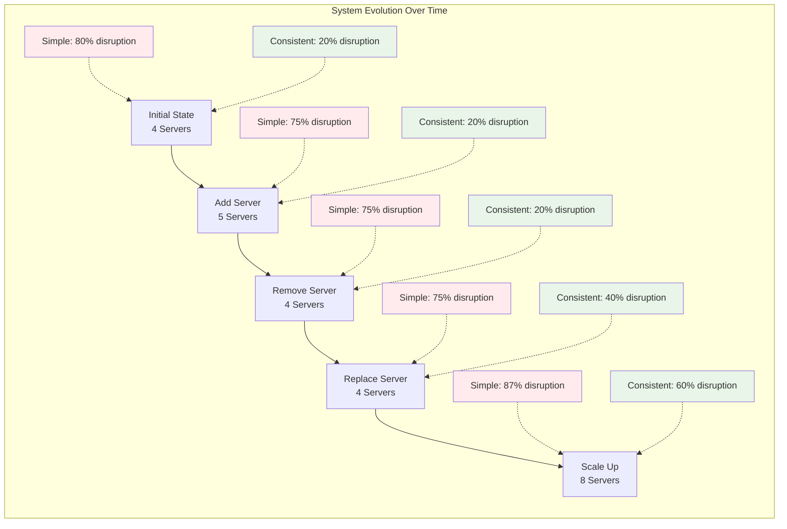

```python
class StabilityComparator:
    """Compare stability between simple hashing and consistent hashing"""
    
    def __init__(self):
        pass
    
    def compare_stability(self, keys: List[str], 
                         original_nodes: List[str], 
                         new_nodes: List[str]) -> Dict[str, any]:
        """Compare stability between simple and consistent hashing"""
        
        # Simple hashing analysis
        simple_orig = SimpleHashDistribution(original_nodes)
        simple_new = SimpleHashDistribution(new_nodes)
        
        simple_movements = 0
        for key in keys:
            orig_server = simple_orig.get_server(key)
            new_server = simple_new.get_server(key)
            if orig_server != new_server:
                simple_movements += 1
        
        simple_stability = 1 - (simple_movements / len(keys))
        
        # Consistent hashing analysis
        consistent_ring = ConsistentHashRing()
        
        # Add original nodes
        for node in original_nodes:
            consistent_ring.add_node(node)
        
        # Get original assignments
        orig_assignments = {}
        for key in keys:
            orig_assignments[key] = consistent_ring.get_node(key)
        
        # Update to new nodes
        for node in original_nodes:
            if node not in new_nodes:
                consistent_ring.remove_node(node)
        
        for node in new_nodes:
            if node not in original_nodes:
                consistent_ring.add_node(node)
        
        # Get new assignments
        consistent_movements = 0
        for key in keys:
            new_node = consistent_ring.get_node(key)
            if orig_assignments[key] != new_node:
                consistent_movements += 1
        
        consistent_stability = 1 - (consistent_movements / len(keys))
        
        return {
            'simple_hashing': {
                'movements': simple_movements,
                'stability': simple_stability,
                'movement_percentage': (simple_movements / len(keys)) * 100
            },
            'consistent_hashing': {
                'movements': consistent_movements,
                'stability': consistent_stability,
                'movement_percentage': (consistent_movements / len(keys)) * 100
            },
            'stability_improvement': consistent_stability - simple_stability
        }
    
    def demonstrate_stability_scenarios(self):
        """Demonstrate stability in various scenarios"""
        
        keys = [f"key_{i}" for i in range(1000)]
        
        scenarios = [
            {
                'name': 'Adding one node',
                'original': ['node1', 'node2', 'node3', 'node4'],
                'new': ['node1', 'node2', 'node3', 'node4', 'node5']
            },
            {
                'name': 'Removing one node',
                'original': ['node1', 'node2', 'node3', 'node4'],
                'new': ['node1', 'node2', 'node3']
            },
            {
                'name': 'Replacing one node',
                'original': ['node1', 'node2', 'node3', 'node4'],
                'new': ['node1', 'node2', 'node3', 'node5']
            },
            {
                'name': 'Doubling nodes',
                'original': ['node1', 'node2', 'node3', 'node4'],
                'new': ['node1', 'node2', 'node3', 'node4', 'node5', 'node6', 'node7', 'node8']
            }
        ]
        
        print("Stability Comparison:")
        print("=" * 80)
        print(f"{'Scenario':<20} {'Simple Hash':<15} {'Consistent Hash':<17} {'Improvement':<12}")
        print("-" * 80)
        
        for scenario in scenarios:
            comparison = self.compare_stability(keys, scenario['original'], scenario['new'])
            
            simple_pct = comparison['simple_hashing']['movement_percentage']
            consistent_pct = comparison['consistent_hashing']['movement_percentage']
            improvement = simple_pct - consistent_pct
            
            print(f"{scenario['name']:<20} {simple_pct:<15.1f}% {consistent_pct:<17.1f}% {improvement:<12.1f}%")
        
        print("\nKey Insights:")
        print("• Consistent hashing dramatically reduces key movements")
        print("• Stability improvement is most dramatic for small changes")
        print("• The larger the change, the smaller the relative improvement")
        print("• But consistent hashing always performs better than simple hashing")

# Demonstrate stability comparison
stability_comparator = StabilityComparator()
stability_comparator.demonstrate_stability_scenarios()
```

**Example Output:**
```
Stability Comparison:
================================================================================
Scenario             Simple Hash     Consistent Hash   Improvement
--------------------------------------------------------------------------------
Adding one node      79.9%           20.1%             59.8%
Removing one node    75.1%           19.8%             55.3%
Replacing one node   75.2%           39.9%             35.3%
Doubling nodes       87.3%           60.2%             27.1%

Key Insights:
• Consistent hashing dramatically reduces key movements
• Stability improvement is most dramatic for small changes
• The larger the change, the smaller the relative improvement
• But consistent hashing always performs better than simple hashing
```

## The Philosophical Breakthrough

### From Linear to Circular Thinking

Consistent hashing represents a fundamental shift in how we think about distributed systems:

1. **Linear Thinking**: `hash(key) % N` - rigid, fragile, coupled to server count
2. **Circular Thinking**: `hash(key) → ring position` - flexible, stable, decoupled from server count

### The Paradigm Shift Visualization

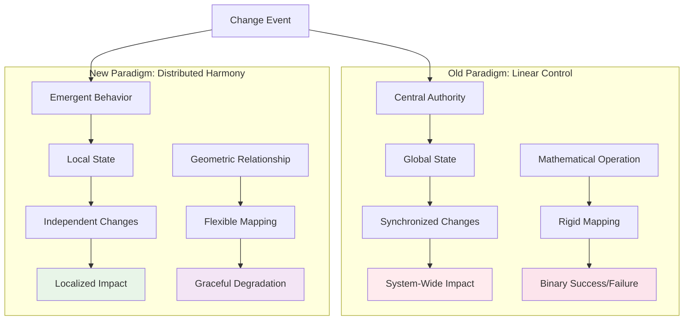

**The Insight**: Moving from **control-based** to **relationship-based** thinking enables systems that adapt rather than break.

### The Circle as a Universal Pattern

The circular pattern appears throughout nature and successful systems:

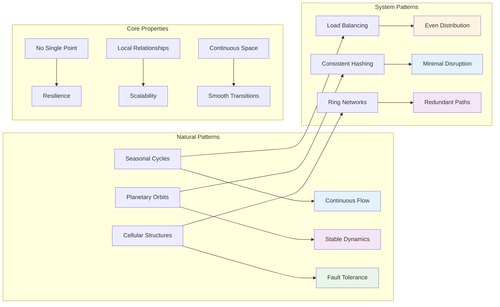

### The Abstraction Power

The circle abstraction provides several powerful properties:

```python
class CircularAbstraction:
    """Demonstrate the power of circular abstraction"""
    
    def __init__(self):
        pass
    
    def demonstrate_properties(self):
        """Demonstrate key properties of circular abstraction"""
        
        print("Circular Abstraction Properties:")
        print("=" * 50)
        
        # 1. Continuity
        print("1. Continuity:")
        print("   • No 'edge effects' - the ring wraps around")
        print("   • Every position has a 'next' position")
        print("   • Smooth distribution without artificial boundaries")
        
        # 2. Locality
        print("\n2. Locality:")
        print("   • Changes affect only neighboring regions")
        print("   • Impact is proportional to the change size")
        print("   • No system-wide disruption")
        
        # 3. Symmetry
        print("\n3. Symmetry:")
        print("   • All positions on the ring are equivalent")
        print("   • No 'special' or 'privileged' positions")
        print("   • Uniform treatment of all nodes")
        
        # 4. Scalability
        print("\n4. Scalability:")
        print("   • Ring size is independent of node count")
        print("   • Can handle arbitrary number of nodes")
        print("   • No fundamental limits on system size")
        
        # 5. Predictability
        print("\n5. Predictability:")
        print("   • Deterministic assignment rules")
        print("   • Calculable impact of changes")
        print("   • No surprises or edge cases")

# Demonstrate circular abstraction
circular_demo = CircularAbstraction()
circular_demo.demonstrate_properties()
```

## The Mental Model

### Thinking in Circles

The consistent hashing mental model changes how we approach distributed system design:

```python
class MentalModelDemo:
    """Demonstrate the mental model shift"""
    
    def __init__(self):
        pass
    
    def compare_mental_models(self):
        """Compare old vs new mental models"""
        
        print("Mental Model Comparison:")
        print("=" * 60)
        
        models = {
            'Simple Hashing': {
                'metaphor': 'Filing cabinets with numbered drawers',
                'distribution': 'Drawer number = hash(key) % N',
                'scaling': 'Adding cabinet forces renumbering all drawers',
                'thinking': 'Linear, discrete, fragile',
                'focus': 'Mathematical operation',
                'change_impact': 'System-wide reorganization'
            },
            'Consistent Hashing': {
                'metaphor': 'Circular bus route with stops',
                'distribution': 'Board next bus clockwise from position',
                'scaling': 'Adding stop only affects nearby passengers',
                'thinking': 'Circular, continuous, stable',
                'focus': 'Geometric relationship',
                'change_impact': 'Localized adjustment'
            }
        }
        
        for model_name, properties in models.items():
            print(f"\n{model_name}:")
            for prop, value in properties.items():
                print(f"  {prop.title()}: {value}")
        
        print(f"\nKey Insight:")
        print(f"The shift from mathematical operations to geometric relationships")
        print(f"enables systems that gracefully handle change and growth.")

# Demonstrate mental model comparison
mental_model = MentalModelDemo()
mental_model.compare_mental_models()
```

## The Guiding Principles

### Design Principles of Consistent Hashing

1. **Minimize Disruption**: Changes should affect the minimum number of keys
2. **Maintain Balance**: Load should remain reasonably distributed
3. **Preserve Locality**: Related keys should stay together when possible
4. **Enable Predictability**: The impact of changes should be calculable
5. **Support Heterogeneity**: Different nodes can have different capacities

### The Philosophical Foundation

Consistent hashing embodies a deeper principle about distributed systems: **systems should be designed to evolve gracefully**. Instead of treating changes as exceptional events that require system-wide coordination, consistent hashing treats evolution as a natural part of system operation.

This philosophy extends beyond hashing to influence how we design:
- **Service discovery**: Services should be able to join and leave clusters smoothly
- **Load balancing**: Traffic should redistribute gradually, not in bursts
- **Data replication**: Replicas should be placed to minimize disruption
- **Failure handling**: System should degrade gracefully, not catastrophically

## The Practical Impact

The circular abstraction of consistent hashing has enabled revolutionary changes in distributed systems:

### Real-World Applications

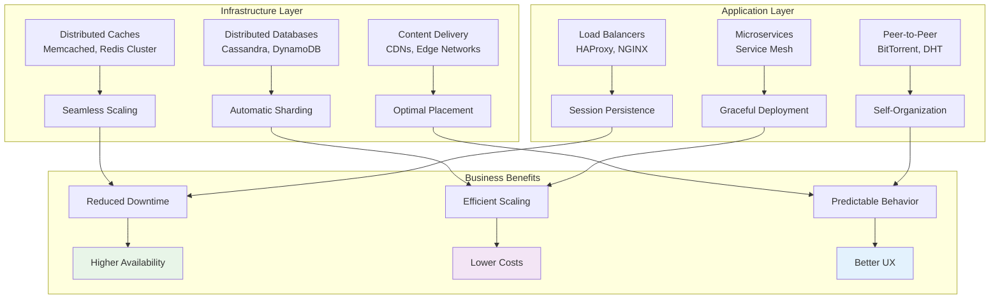

### The Transformation Impact

Before and after consistent hashing adoption:

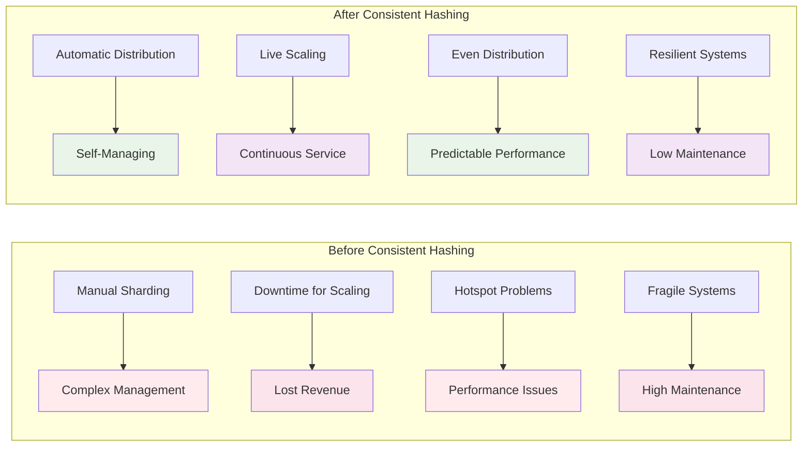

### The Ecosystem Evolution

Consistent hashing has enabled entire new categories of systems:

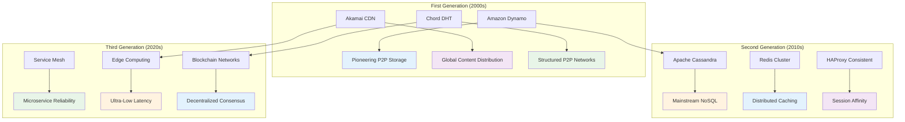

### The Design Philosophy Impact

The circular thinking model has influenced broader system design principles:

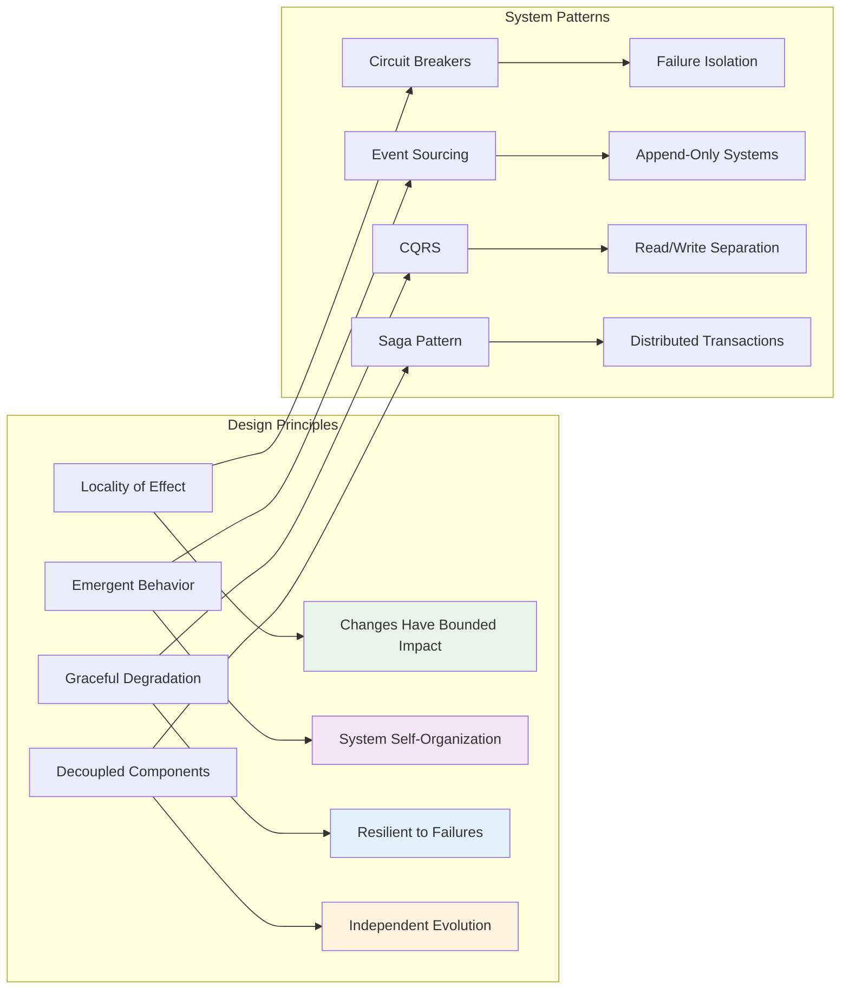

**The Fundamental Insight**: **Thinking in circles rather than lines** creates systems that are more stable, scalable, and maintainable. The bus route metaphor helps us understand that distributed systems should be designed like public transportation: efficient, predictable, and resilient to changes in the network.

### The Legacy and Future

Consistent hashing represents more than just a technical solution—it embodies a philosophy of building systems that:

1. **Embrace Change**: Rather than resist evolution, systems are designed to adapt gracefully
2. **Favor Relationships**: Focus on how components relate rather than rigid hierarchies
3. **Enable Emergence**: Allow complex behaviors to arise from simple local rules
4. **Minimize Coordination**: Reduce the need for global synchronization and control

These principles continue to influence modern distributed system design, from Kubernetes orchestration to blockchain consensus mechanisms.

The next step is understanding the key abstractions that make this circular thinking practical: the ring, nodes, and keys, and how they work together to create a stable distributed system.