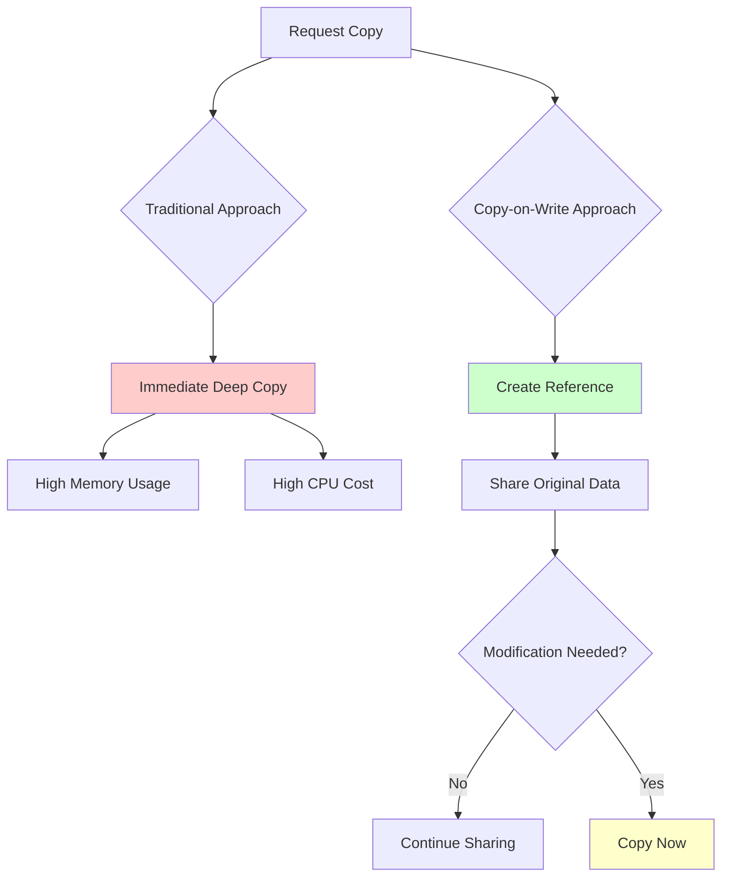
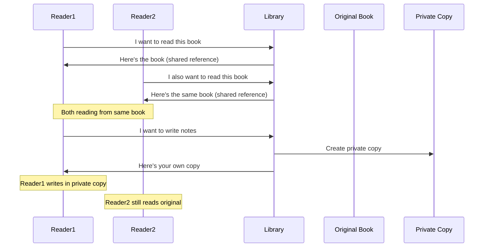

# The Guiding Philosophy: Share Until Modified

## The Core Insight

Copy-on-Write operates on a beautifully simple principle: **Why copy data that nobody is going to change?**

Instead of eagerly copying data when someone requests a "copy," CoW takes a lazy approach:
1. Give them a reference to the original data
2. Keep track that this data is now shared
3. Only perform the actual copy when someone tries to modify it

This philosophy transforms copying from an expensive upfront cost into a pay-as-you-go model.

## The Shared Understanding Analogy

Think of CoW like a library book:

**Traditional Copying**: When you want to read a book, the library photocopies the entire book for you. Even if you only read one chapter and never write in it, you get a full copy.

**Copy-on-Write**: The library gives you the actual book. Multiple people can read the same book simultaneously. Only when someone wants to write notes in the margins does the library make a photocopy for that person.

## The Three Philosophical Pillars

### 1. Optimistic Sharing
CoW assumes that most "copies" will be read-only. This isn't wishful thinking - it reflects real usage patterns where copies are often created for safety but rarely modified.

### 2. Lazy Materialization  
Don't do expensive work until you absolutely must. The act of copying is deferred until the moment of truth - when someone actually needs to modify the data.

### 3. Transparent Efficiency
From the user's perspective, they get a copy. They don't need to know or care that it's implemented using shared references until modification. The efficiency is invisible.

## Trade-offs and Philosophy

### What We Gain
- **Memory Efficiency**: Multiple copies share the same underlying data
- **Time Efficiency**: "Copying" becomes nearly instantaneous
- **Cache Friendliness**: Shared data means better cache utilization

### What We Accept
- **Complexity**: The implementation becomes more sophisticated
- **Write Penalty**: The first modification to shared data incurs the full copy cost
- **Reference Tracking**: We need bookkeeping to know when data is shared

## The Philosophical Question

CoW embodies a deeper principle in computer science: **When should we optimize for the common case versus the worst case?**

Traditional copying optimizes for simplicity and predictable performance. CoW optimizes for the common case where copies are read-only, accepting complexity to deliver superior average-case performance.

This philosophy appears throughout high-performance systems because it aligns with how data is actually used in practice.