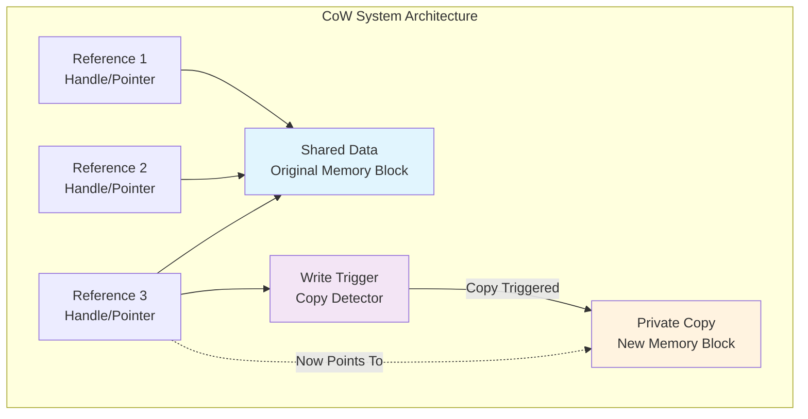
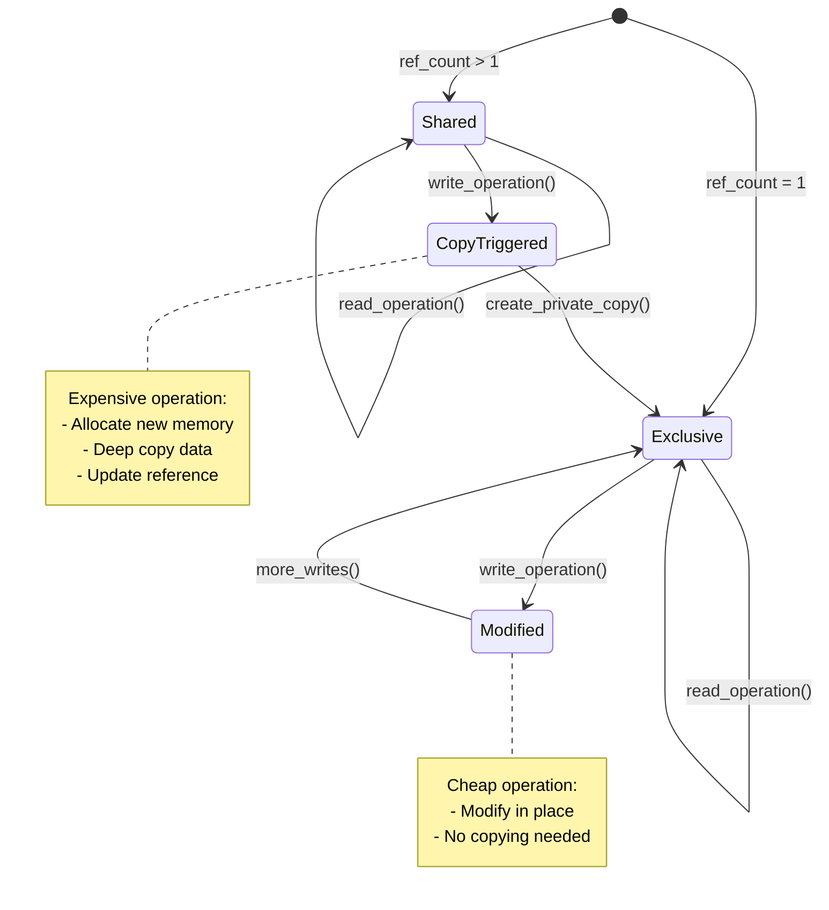

# Key Abstractions: The Building Blocks of CoW

## The Three Core Abstractions

Copy-on-Write systems are built around three fundamental concepts that work together to create the illusion of copying without the cost:



### 1. Shared Data
The actual data that multiple "copies" point to. This is the single source of truth that exists in memory.

**Mental Model**: Think of shared data as the original Google Doc that multiple people are viewing. There's only one document, but many viewers.

### 2. Reference/Handle
A lightweight pointer or reference that gives access to the shared data. Creating a "copy" means creating a new reference, not duplicating the data.

**Mental Model**: Think of references as browser tabs. Opening a new tab to the same Google Doc doesn't duplicate the document - it just gives you another way to view it.

### 3. Write Trigger
The mechanism that detects when shared data is about to be modified and triggers the actual copy operation.

**Mental Model**: Think of the write trigger as Google Docs automatically creating a private copy when someone starts typing. The moment you make an edit, you get your own version.

## The Reference Counting Pattern

Many CoW implementations use reference counting to track sharing:

```
Data: [1, 2, 3, 4, 5]
References pointing to it: 3
```

When a reference wants to modify the data:
1. Check reference count
2. If count > 1: make a private copy, decrement original count
3. If count = 1: modify in place (no one else is sharing)



## The Ownership States

CoW data can exist in two states:

### Shared State
- Reference count > 1
- Data is read-only from any reference's perspective
- Modifications trigger copy operations

### Exclusive State  
- Reference count = 1
- Data can be modified in place
- No copy overhead for modifications

## The Copy Semantics

CoW provides these semantic guarantees:

### Isolation Guarantee
Changes made through one reference don't affect what other references see. Each reference behaves as if it has its own private copy.

### Consistency Guarantee
Once a reference triggers a copy, it maintains its own version of the data that remains stable regardless of what happens to other references.

### Performance Guarantee
The cost of creating a "copy" is O(1) - constant time regardless of data size.

## Implementation Patterns

### Wrapper Pattern
Wrap the actual data in a container that tracks reference counts and handles copy-on-write logic:

```
CoWContainer {
    data: SharedData,
    ref_count: AtomicInteger
}
```

### Smart Pointer Pattern
Use language-level smart pointers (like Rust's `Rc` + `RefCell` or C++'s `shared_ptr`) to automatically handle reference counting.

### Version Chain Pattern
Keep multiple versions of data linked together, allowing different references to point to different versions in the chain.

## The Abstraction Hierarchy

```mermaid
graph TB
    subgraph "Abstraction Layers"
        A[User Code<br/>Application Logic]
        B[CoW Container<br/>Copy Logic & API]
        C[Reference Counter<br/>Sharing Tracker]
        D[Raw Data<br/>Actual Memory]
    end
    
    A --> B
    B --> C
    C --> D
    
    A2[User API Calls<br/>read(), write(), clone()] --> B2[Copy Decision<br/>Should we copy?]
    B2 --> C2[Ref Count Check<br/>How many owners?]
    C2 --> D2[Memory Operations<br/>Read/Write/Allocate]
    
    style A fill:#e8f5e8
    style B fill:#fff3e0
    style C fill:#e3f2fd
    style D fill:#fce4ec
```

Each layer has a specific responsibility, creating a clean separation of concerns that makes CoW systems both powerful and maintainable.

### Key Insights from the Hierarchy

**Separation of Concerns**: Each layer handles one aspect:
- **User Code**: Business logic without worrying about copy mechanics
- **CoW Container**: When to copy and how to manage the copy lifecycle
- **Reference Counter**: Who is sharing what and when sharing ends
- **Raw Data**: The actual storage and memory management

**Information Hiding**: Higher layers don't need to understand lower layer implementation details. The user never sees reference counts or copy triggers.

**Composability**: This layered approach allows different implementations at each level while maintaining the same interface.