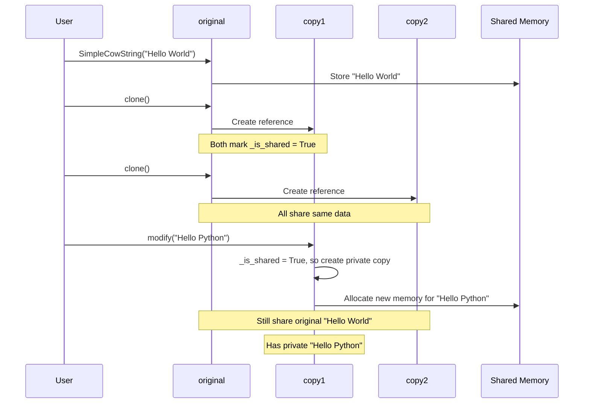
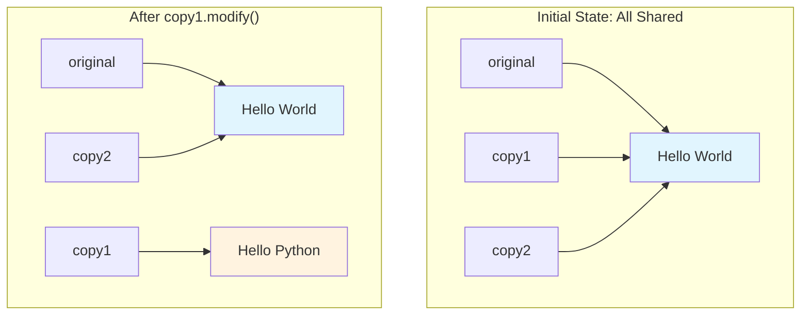

# Getting Started: Your First Copy-on-Write Implementation

## The Simplest Possible Example

Let's build a minimal Copy-on-Write container to understand the core mechanics. We'll start with Python for clarity:

```python
class SimpleCowString:
    def __init__(self, data):
        self._data = data
        self._is_shared = False
    
    def clone(self):
        # "Copying" just creates a new reference
        new_cow = SimpleCowString(self._data)
        
        # Mark both as shared
        self._is_shared = True
        new_cow._is_shared = True
        
        return new_cow
    
    def modify(self, new_data):
        # Copy only if data is shared
        if self._is_shared:
            self._data = new_data  # Make private copy
            self._is_shared = False
        else:
            self._data = new_data  # Modify in place
    
    def read(self):
        return self._data
```

## Walking Through the Behavior

Let's see this in action:



```python
# Start with original data
original = SimpleCowString("Hello World")
print(f"Original: {original.read()}")  # "Hello World"

# "Copy" the data (instant operation)
copy1 = original.clone()
copy2 = original.clone()

# All three share the same underlying string
print(f"Original: {original.read()}")  # "Hello World"
print(f"Copy1: {copy1.read()}")        # "Hello World"  
print(f"Copy2: {copy2.read()}")        # "Hello World"

# Modify copy1 - triggers private copy
copy1.modify("Hello Python")

# Now they have different data
print(f"Original: {original.read()}")  # "Hello World"
print(f"Copy1: {copy1.read()}")        # "Hello Python"
print(f"Copy2: {copy2.read()}")        # "Hello World"
```

## What Just Happened?

1. **Clone Operation**: Creating copies was instant - we just made new objects pointing to the same string
2. **Shared State**: All references initially see the same data
3. **Copy Trigger**: The first modification to `copy1` triggered the actual copy
4. **Isolation**: After the copy, `copy1` has its own private data



**Key Insight**: Copy-on-Write turns expensive O(n) copy operations into cheap O(1) reference operations, only paying the copy cost when absolutely necessary.

## A More Realistic Example

Here's a CoW implementation for a list that tracks reference counts properly:

```python
import copy

class CowList:
    def __init__(self, data=None):
        self._data = data or []
        self._ref_count = 1
    
    def clone(self):
        # Share the same data
        new_list = CowList.__new__(CowList)
        new_list._data = self._data
        new_list._ref_count = self._ref_count
        
        # Increment reference count
        self._ref_count += 1
        new_list._ref_count += 1
        
        return new_list
    
    def _ensure_private(self):
        if self._ref_count > 1:
            # We need a private copy
            old_data = self._data
            self._data = copy.deepcopy(old_data)
            
            # Decrement ref count for old data
            self._ref_count -= 1
            # Reset ref count for our private copy
            self._ref_count = 1
    
    def append(self, item):
        self._ensure_private()
        self._data.append(item)
    
    def __getitem__(self, index):
        return self._data[index]
    
    def __len__(self):
        return len(self._data)
    
    def __str__(self):
        return str(self._data)
```

## Testing the Realistic Implementation

```python
# Create original list
numbers = CowList([1, 2, 3])
print(f"Numbers: {numbers}")  # [1, 2, 3]

# Create copies
backup1 = numbers.clone()
backup2 = numbers.clone()

print(f"All share data: {numbers._ref_count}")  # 3

# Modify one copy
backup1.append(4)

print(f"Numbers: {numbers}")   # [1, 2, 3]
print(f"Backup1: {backup1}")   # [1, 2, 3, 4]  
print(f"Backup2: {backup2}")   # [1, 2, 3]

print(f"Numbers ref count: {numbers._ref_count}")   # 2
print(f"Backup1 ref count: {backup1._ref_count}")   # 1 (private)
```

## Key Takeaways

1. **Copy-on-Write makes copying cheap**: The `clone()` operation is O(1)
2. **Sharing is transparent**: References behave like independent copies
3. **Write operations trigger copying**: Only when needed
4. **Reference counting tracks sharing**: Enables efficient memory management

This foundation gives you the mental model for understanding how CoW works in production systems like databases, file systems, and language runtimes.