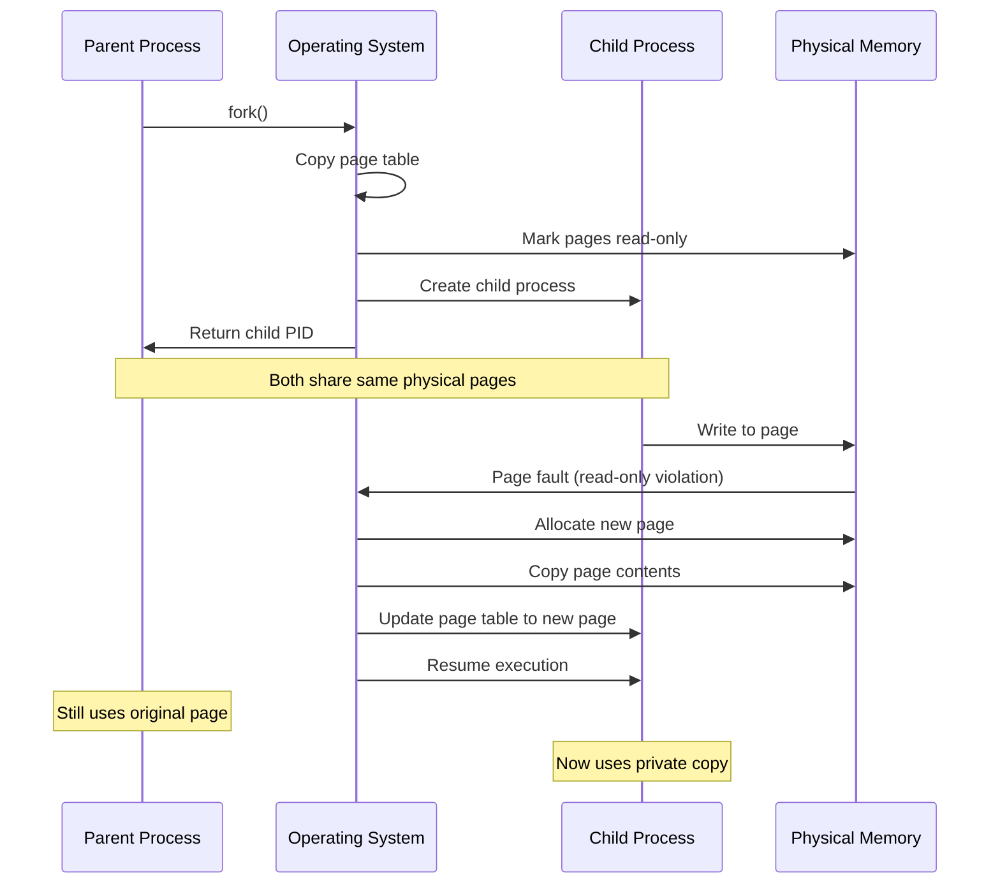
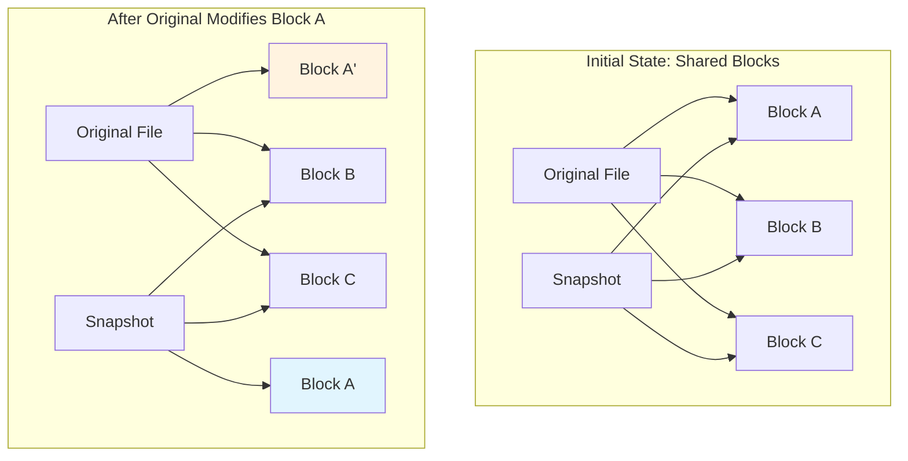
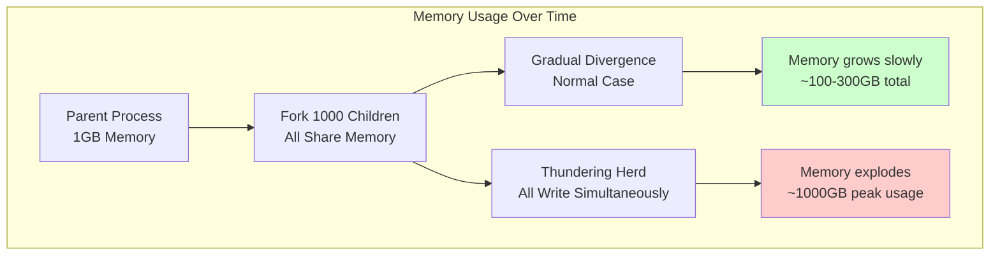
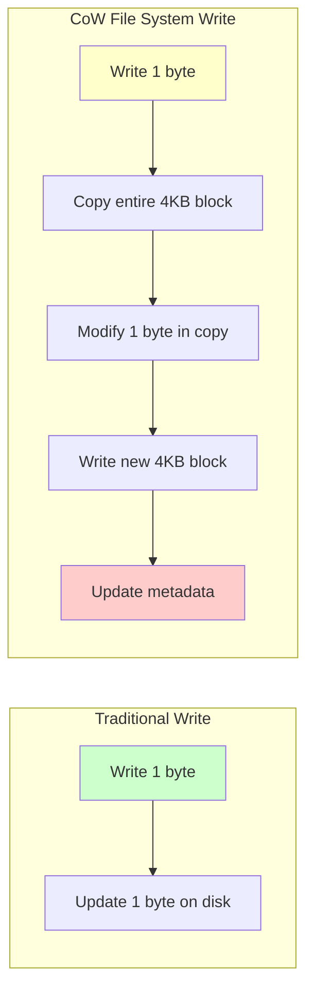

# CoW in the Wild: Real-World Implementations

Copy-on-Write isn't just an academic concept - it's a critical optimization used throughout modern computing systems. Understanding these real-world implementations reveals both the power and the subtle complexities of CoW.

## Operating Systems: The `fork()` System Call

The most famous CoW implementation is in Unix-like operating systems for process creation.

### The Traditional Problem
When a process calls `fork()` to create a child process, the naive approach would copy the entire memory space of the parent process. For a process using gigabytes of RAM, this would be prohibitively expensive.

### The CoW Solution
```c
// When fork() is called:
pid_t child_pid = fork();

if (child_pid == 0) {
    // Child process - sees "copy" of parent memory
    // But actually shares the same physical pages
} else {
    // Parent process continues normally
}
```

**What Really Happens:**
1. **Page Table Duplication**: The OS copies the page table (mapping virtual to physical addresses) but not the actual memory pages
2. **Mark Pages Read-Only**: All shared pages are marked read-only in both processes
3. **Copy-on-Write Trigger**: When either process tries to write to a page, the CPU triggers a page fault
4. **Page Fault Handler**: The OS allocates a new physical page, copies the content, and updates the page table



### Performance Impact
- **Fork Time**: O(page table size) instead of O(total memory)
- **Memory Usage**: Shared until divergence
- **Real Example**: A 1GB process can fork in milliseconds instead of seconds

## File Systems: ZFS and Btrfs Snapshots

Modern file systems use CoW for instant snapshots and efficient storage.

### ZFS Implementation
```bash
# Create a snapshot instantly
zfs snapshot pool/dataset@snapshot1

# The snapshot shares blocks with the original
# Only changed blocks consume additional space
```

**Block-Level CoW:**
1. **Shared Blocks**: Snapshot and original share the same disk blocks
2. **Copy-on-Write**: When original data is modified, only changed blocks are copied
3. **Space Efficiency**: Snapshots consume space only for differences

### Btrfs Example
```bash
# Create CoW snapshot
btrfs subvolume snapshot /source /destination

# Snapshots share data blocks until modification
# Each modified block triggers a copy
```

**The Tree Structure:**



**Key Insight**: File system CoW operates at the block level, creating a time-efficient snapshot mechanism where only changed blocks consume additional storage space.

## Database Systems: MVCC (Multi-Version Concurrency Control)

Databases use CoW-like techniques to provide transaction isolation without locking.

### PostgreSQL's Approach
```sql
-- Transaction 1 starts
BEGIN;
SELECT * FROM users WHERE id = 1;  -- Sees version 1

-- Transaction 2 modifies the same row
BEGIN;
UPDATE users SET name = 'Alice' WHERE id = 1;  -- Creates version 2
COMMIT;

-- Transaction 1 still sees version 1 (snapshot isolation)
SELECT * FROM users WHERE id = 1;  -- Still sees original data
COMMIT;
```

**How It Works:**
1. **Tuple Versioning**: Each row modification creates a new version
2. **Shared Storage**: Old versions remain until no transactions need them
3. **Copy Semantics**: Each transaction sees a consistent snapshot

### MongoDB's WiredTiger
```javascript
// Multiple readers can access the same data pages
db.users.find({status: "active"})  // Reader 1
db.users.find({status: "active"})  // Reader 2 (shares pages)

// Writer triggers copy-on-write
db.users.updateOne({id: 1}, {$set: {status: "inactive"}})  // Copies affected pages
```

## Programming Languages: String Implementations

Many programming languages use CoW for string handling.

### Python's String Interning (Partial CoW)
```python
# Small strings are interned (shared)
a = "hello"
b = "hello"
print(a is b)  # True - same object in memory

# Large strings may use CoW semantics in some implementations
large_string = "x" * 1000000
copy_string = large_string  # Shared until modification
```

### Rust's `Cow<str>` Type
```rust
use std::borrow::Cow;

fn process_string(input: &str) -> Cow<str> {
    if input.contains("bad_word") {
        // Only allocate new string if modification needed
        Cow::Owned(input.replace("bad_word", "***"))
    } else {
        // Return borrowed reference (no allocation)
        Cow::Borrowed(input)
    }
}

let clean = "Hello world";
let dirty = "Hello bad_word world";

let result1 = process_string(clean);  // Borrowed (no allocation)
let result2 = process_string(dirty);  // Owned (allocation only when needed)
```

## Container Technologies: Docker Images

Docker uses CoW at the file system layer for efficient image storage.

### Docker Layer Architecture
```dockerfile
FROM ubuntu:20.04           # Layer 1 (shared)
RUN apt-get update         # Layer 2 (shared)
COPY app.py /app/          # Layer 3 (per image)
RUN pip install flask     # Layer 4 (per image)
```

**Storage Efficiency:**
- **Base Layers**: Shared across all containers using the same base image
- **Copy-on-Write**: Container modifications create new layers
- **Union File System**: Layers are merged to present a unified view

### Real Impact
```bash
# 100 containers from the same image
docker run -d my-app  # Container 1
docker run -d my-app  # Container 2
# ... 98 more containers

# They share the same base image layers
# Only container-specific changes consume additional space
```

## Performance Characteristics in Production

### Memory Amplification
Real-world CoW systems must handle the "thundering herd" problem:



### Write Amplification in Storage



**Write Amplification Impact:**
- **Traditional**: 1 byte write = 1 byte I/O
- **CoW**: 1 byte write = 4KB+ I/O (potentially 4000x amplification)
- **Mitigation**: Larger block sizes, write batching, compression

## The Hidden Complexity

### Reference Counting Challenges
```rust
// Thread safety in reference counting
struct CowData<T> {
    data: Arc<T>,           // Atomic reference counting
    ref_count: AtomicUsize, // Thread-safe counter
}

// Race condition potential:
// Thread 1: Check ref_count (2) -> decide to copy
// Thread 2: Decrease ref_count (1) -> modify in place
// Result: Corruption without proper synchronization
```

### Memory Fragmentation
CoW can worsen memory fragmentation:
- Original data: One large contiguous block
- After multiple copies: Many smaller scattered blocks
- Cache performance may suffer

## When CoW Wins vs. Loses

### CoW Excels When:
- **Read-Heavy Workloads**: Most copies are never modified
- **Large Data**: Copy cost is high relative to management overhead
- **Sparse Modifications**: Only small portions of data change

### CoW Struggles When:
- **Write-Heavy Workloads**: Frequent modifications negate benefits
- **Small Data**: Management overhead exceeds copy costs
- **Dense Modifications**: Most of the data gets modified anyway

Understanding these real-world implementations shows that CoW isn't just an optimization - it's a fundamental technique that enables many of the performance characteristics we take for granted in modern systems.