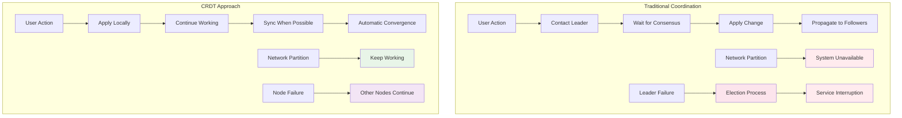
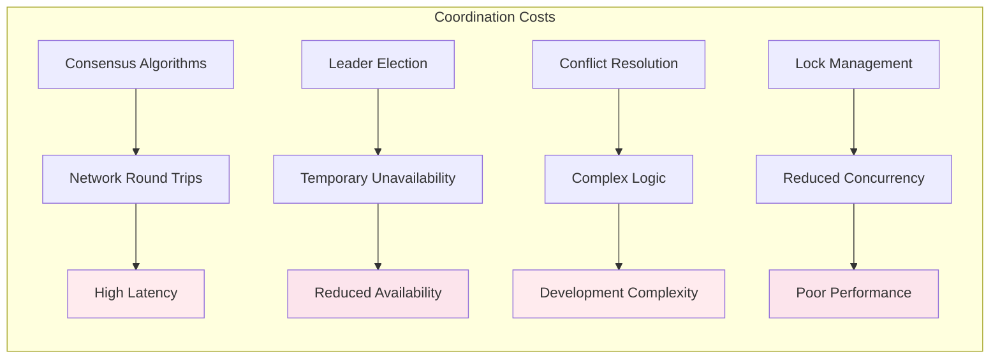
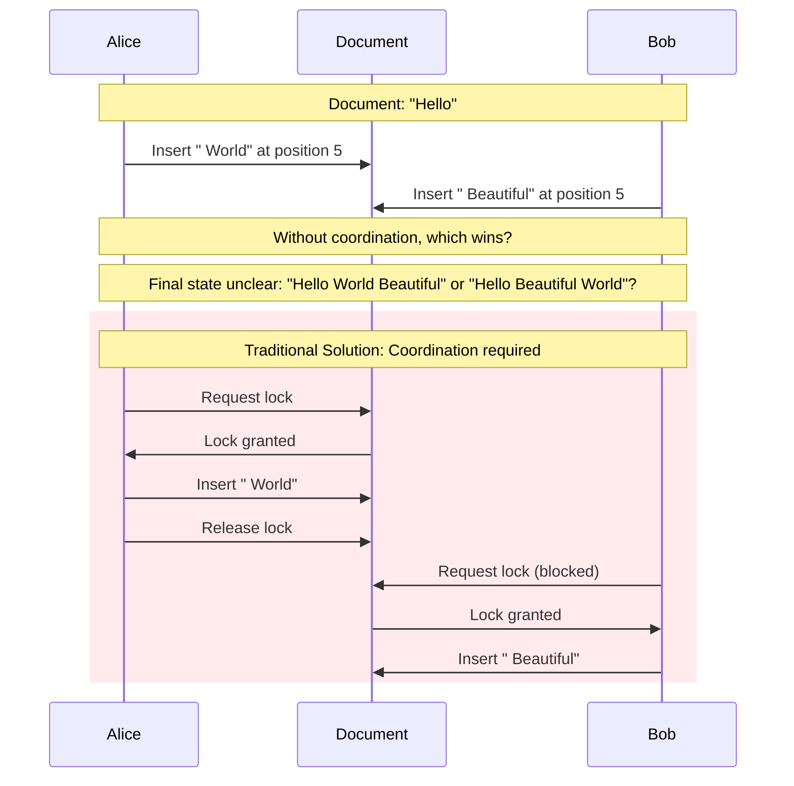
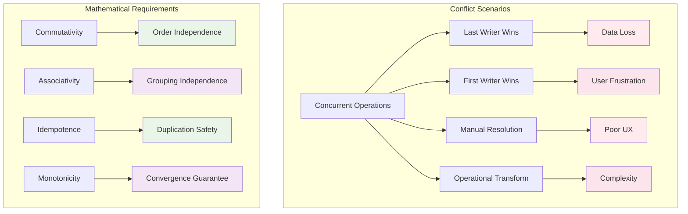
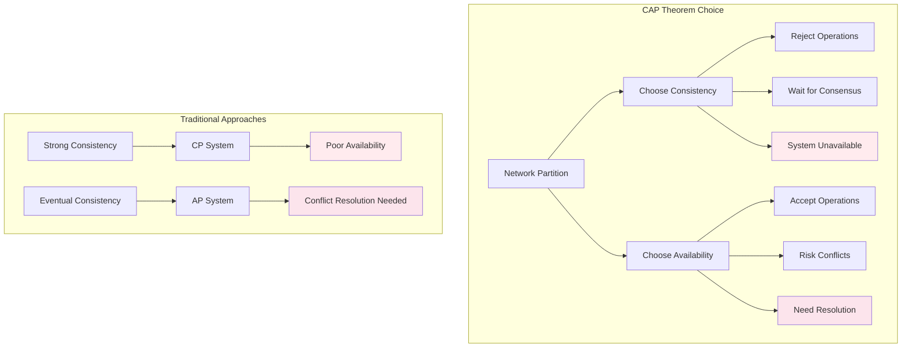
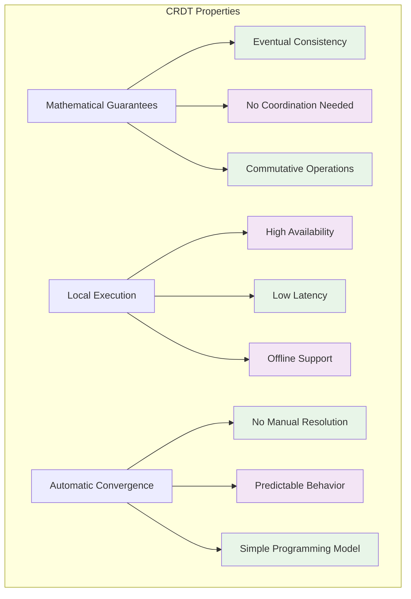
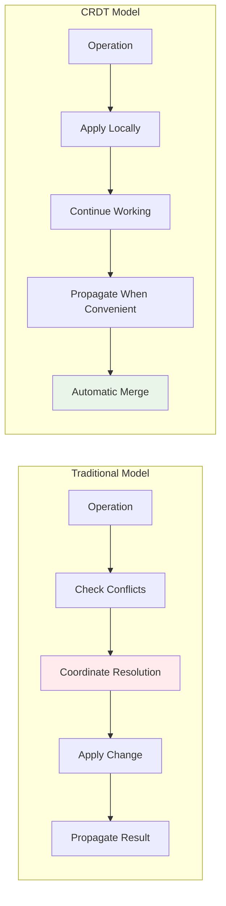

# The Core Problem: Coordination Without Conflict

## The Distributed Agreement Dilemma

In distributed systems, one of the most challenging problems is ensuring that multiple nodes can accept updates independently and concurrently while still guaranteeing eventual consistency. Consider these common scenarios:

- **Collaborative document editing**: Multiple users editing the same Google Doc simultaneously
- **Distributed databases**: Multi-leader replication where writes happen on different nodes
- **Mobile apps**: Offline-first applications that sync when connectivity returns
- **Multiplayer games**: Players making moves while experiencing network partitions

The fundamental challenge: **How can nodes agree on a final state without constant coordination?**

## The Traditional Approaches and Their Failures

### Visualizing the Problem

### The Coordination Tax

Traditional distributed systems pay a heavy "coordination tax":

## Real-World Examples of the Problem

### Collaborative Text Editing

Imagine two users editing a document simultaneously:

**The Problem**: Coordination kills user experience with delays and blocking.

### Distributed Shopping Cart

Consider an e-commerce cart synchronized across devices. You're shopping on your phone, add a laptop to your cart, then switch to your desktop. In a traditional system, your desktop needs to ask the server: "What's in this user's cart?" But what if your phone couldn't sync because of poor network connection? Your desktop might show an empty cart, even though you just added items on your phone.

**The Traditional Problem:**
1. **Phone adds laptop** → Must contact server → Network fails → Cart not synchronized
2. **Desktop opens cart** → Asks server for cart state → Gets outdated information
3. **User frustrated** → Items "disappeared" → Poor user experience

**The Coordination Dilemma:** Every cart operation requires checking with a central authority. If that authority is unreachable, the entire system breaks down. Users can't shop offline, items get lost during network issues, and switching devices becomes a complex synchronization dance.

## The Mathematical Nature of the Problem

### Conflict Resolution Complexity

The core issue is that traditional systems must decide between conflicting operations:

### The Order Problem

Consider a simple counter being incremented by two nodes. In a perfect world, both operations would succeed and the final count would be the sum of both increments. But in the real world, when two nodes try to increment simultaneously, the system must decide which operation "wins."

**The Scenarios:**
1. **Sequential operations**: Node1 increments by 5, then Node2 increments by 3 → Final: 8 ✅
2. **Reverse order**: Node2 increments by 3, then Node1 increments by 5 → Final: 8 ✅  
3. **Simultaneous operations**: Both nodes increment at exactly the same time → **Conflict!** ❌

**The Resolution Dilemma:**
- **Last Writer Wins**: Whoever's timestamp is later wins, the other increment is lost
- **First Writer Wins**: Whoever arrives first wins, the other increment is lost
- **Manual resolution**: Stop everything and ask a human what to do

**The Insight:** In traditional systems, simultaneous operations create conflicts that must be resolved by throwing away data or stopping the system. Both options are bad for users.

## The Availability vs Consistency Trade-off

### CAP Theorem in Practice

The CAP theorem forces us to choose between consistency and availability during network partitions:

### The Real-World Impact

The numbers tell a stark story about coordination overhead:

**Latency Impact:**
- **Coordinated operations**: 150+ milliseconds average (multiple network round trips)
- **Local operations**: 1-2 milliseconds average (in-memory processing)
- **Performance difference**: 100x+ faster with local operations

**Availability Impact:**
- **Coordinated systems**: 94-98% success rate (network failures cause operation failures)
- **Local systems**: 99.9%+ success rate (only local failures matter)
- **Reliability difference**: Significantly fewer failed operations

**Throughput Impact:**
- **Coordinated systems**: 6-10 operations per second (limited by consensus)
- **Local systems**: 500-1000+ operations per second (limited by CPU)
- **Capacity difference**: 100x+ more operations possible

**The User Experience Translation:**
Every coordination requirement adds 150ms of delay. In a mobile app, that's the difference between instant response and noticeable lag. For a collaborative document, it's the difference between smooth typing and stuttering text input.

## The CRDT Promise

### What CRDTs Offer

Conflict-free Replicated Data Types (CRDTs) promise to solve these fundamental problems:

**The Key Insight**: By designing data structures with mathematical properties that guarantee convergence, we can eliminate the need for coordination while maintaining consistency.

### The CRDT Mental Model

Instead of asking "How do we coordinate changes?", CRDTs ask "How do we design changes that don't need coordination?"

## The Mathematical Foundation

The magic of CRDTs lies in their mathematical properties:

1. **Commutativity**: `A ⊕ B = B ⊕ A` (order doesn't matter)
2. **Associativity**: `(A ⊕ B) ⊕ C = A ⊕ (B ⊕ C)` (grouping doesn't matter)
3. **Idempotence**: `A ⊕ A = A` (duplicates don't matter)

These properties ensure that no matter how operations are applied, all nodes converge to the same final state.

The next step is understanding the guiding philosophy behind CRDT design: how mathematical properties enable coordination-free distributed systems.