# The Guiding Philosophy: Mathematical Harmony Over Coordination

## The CRDT Revelation

The fundamental insight behind CRDTs is profound: **instead of coordinating to avoid conflicts, design operations that inherently cannot conflict**. This shifts the problem from runtime coordination to design-time mathematics.

Traditional distributed systems ask: "How do we coordinate changes to avoid conflicts?"
CRDTs ask: "How do we design changes that mathematically cannot conflict?"

### The Mathematical Foundation

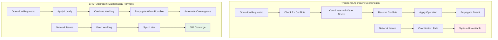

## The Three Mathematical Pillars

CRDTs are built on three fundamental mathematical properties that guarantee convergence:

### 1. Commutativity: Order Independence

**Definition**: `A ⊕ B = B ⊕ A` (operation order doesn't matter)

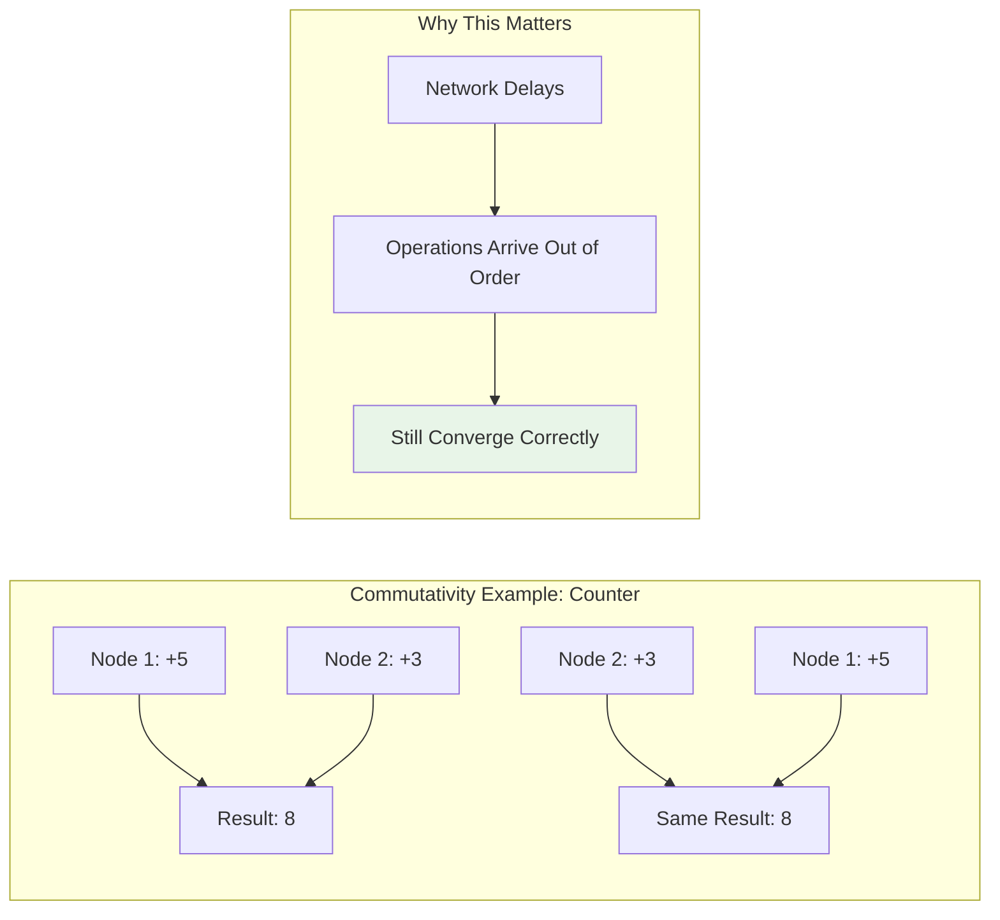

**Real-World Example**: Bank account updates
```python
# These operations commute - order doesn't matter for final balance
account.deposit(100)  # +100
account.deposit(50)   # +50
# Final balance: +150

# Same result regardless of order:
account.deposit(50)   # +50  
account.deposit(100)  # +100
# Final balance: +150
```

### 2. Associativity: Grouping Independence

**Definition**: `(A ⊕ B) ⊕ C = A ⊕ (B ⊕ C)` (grouping doesn't matter)

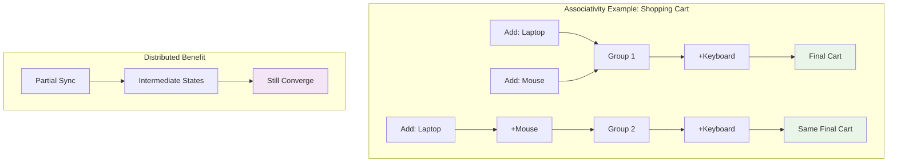

**Real-World Example**: Document collaboration
```python
# These groupings produce the same result:
doc = ((add_word("Hello") + add_word("World")) + add_word("!"))
# vs
doc = (add_word("Hello") + (add_word("World") + add_word("!")))
# Both result in: "Hello World !"
```

### 3. Idempotence: Duplication Safety

**Definition**: `A ⊕ A = A` (applying the same operation multiple times has no additional effect)

```mermaid
graph LR
    subgraph "Idempotence Example: Set Membership"
        A[Add 'Apple'] --> B[Set: {Apple}]
        B --> C[Add 'Apple' Again]
        C --> D[Still: {Apple}]
        
        E[Network Retry] --> F[Duplicate Message]
        F --> G[No Problem]
    end
    
    style G fill:#e8f5e8
```

**Real-World Example**: User preferences
```python
# Adding the same preference multiple times = adding it once
preferences.add("dark_mode")
preferences.add("dark_mode")  # No effect
preferences.add("dark_mode")  # No effect
# Result: {"dark_mode"}
```

## The Grocery List Analogy

Imagine you and your roommate are building a shared grocery list using text messages:

### Traditional Approach (Coordination Required)

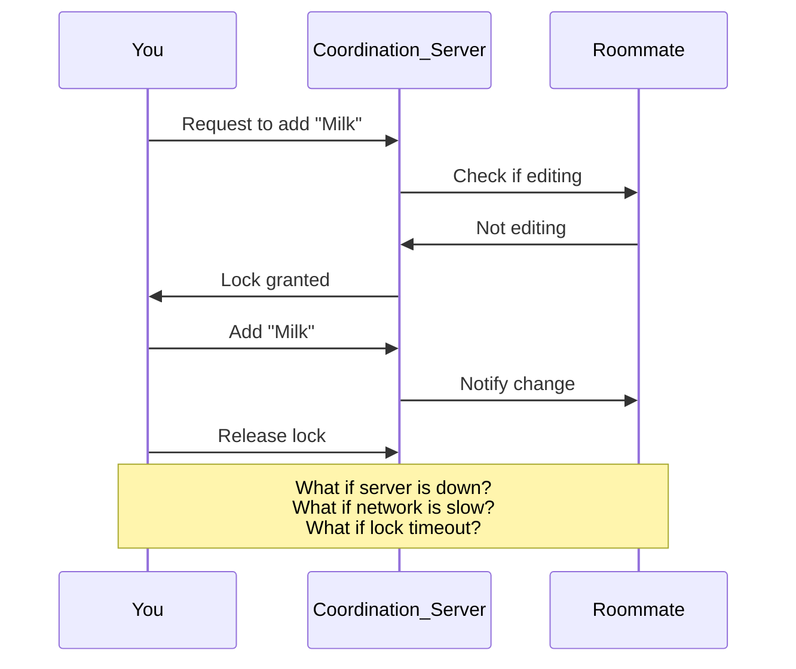

### CRDT Approach (Mathematical Harmony)

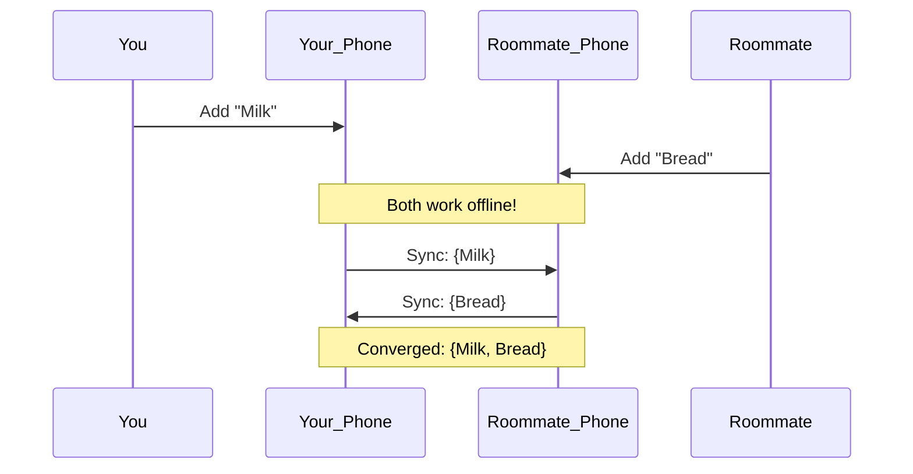

**Key Insight**: The set union operation (`∪`) is commutative, associative, and idempotent:
- **Commutative**: `{Milk} ∪ {Bread} = {Bread} ∪ {Milk}`
- **Associative**: `({Milk} ∪ {Bread}) ∪ {Eggs} = {Milk} ∪ ({Bread} ∪ {Eggs})`
- **Idempotent**: `{Milk} ∪ {Milk} = {Milk}`

## The Design Philosophy Shift

### From Pessimistic to Optimistic

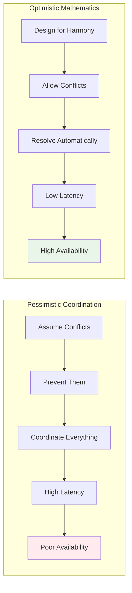

**Traditional Philosophy**: 
- "Conflicts are bad, prevent them"
- "Coordination is necessary"
- "Consistency requires consensus"

**CRDT Philosophy**:
- "Conflicts are inevitable, design around them"
- "Mathematics eliminates need for coordination"
- "Consistency emerges from proper design"

### The Emergence Principle

CRDTs embody the principle of **emergence**: complex global behavior (consistency) arising from simple local rules (mathematical properties).

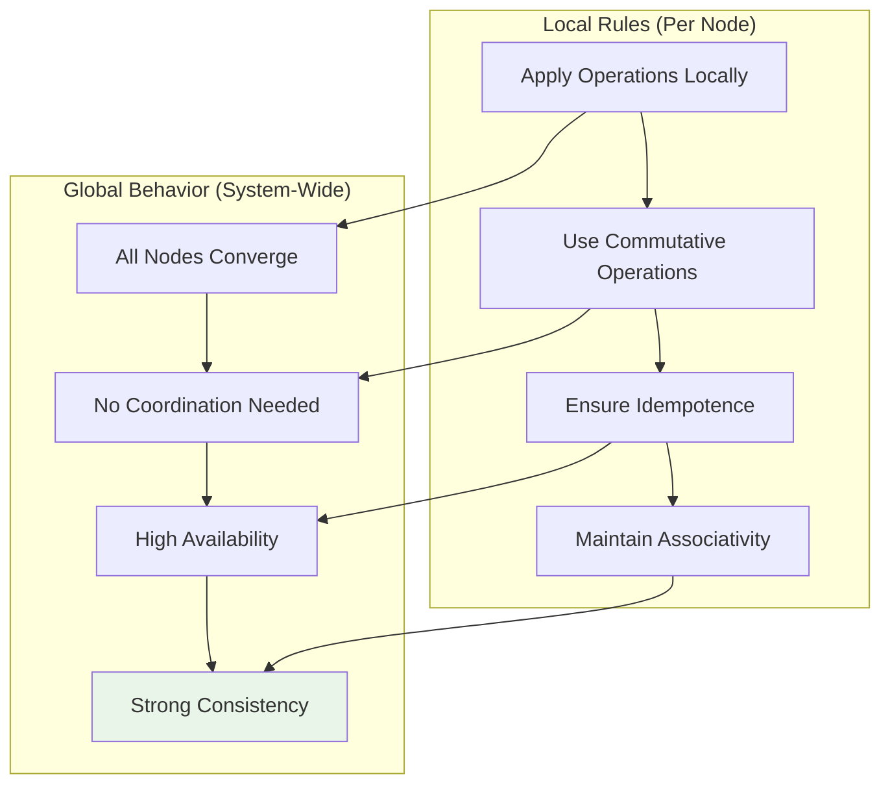

## CRDT Types: State-Based vs Operation-Based

### State-Based CRDTs (CvRDTs)

Nodes periodically exchange their entire state and merge them:

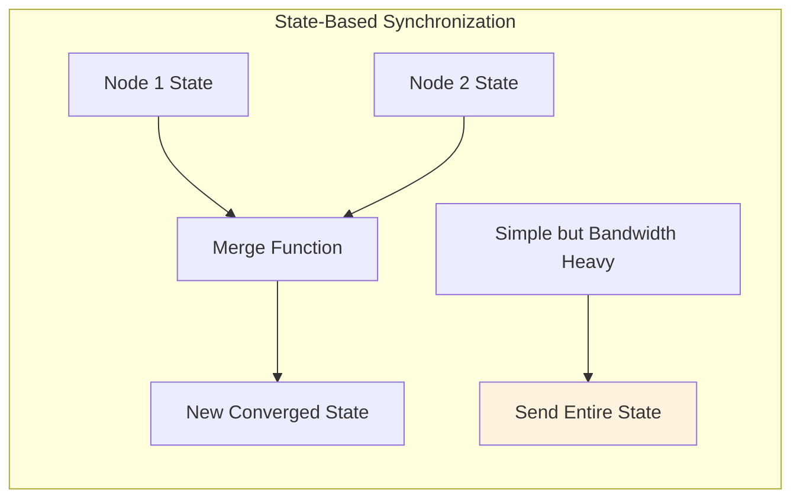

**Example**: G-Counter (grow-only counter)
```python
class GCounter:
    def __init__(self, node_id):
        self.node_id = node_id
        self.counts = {}  # node_id -> count
    
    def increment(self):
        self.counts[self.node_id] = self.counts.get(self.node_id, 0) + 1
    
    def merge(self, other):
        # Take maximum count for each node
        for node_id, count in other.counts.items():
            self.counts[node_id] = max(self.counts.get(node_id, 0), count)
    
    def value(self):
        return sum(self.counts.values())
```

### Operation-Based CRDTs (CmRDTs)

Nodes exchange operations, which must be applied exactly once:

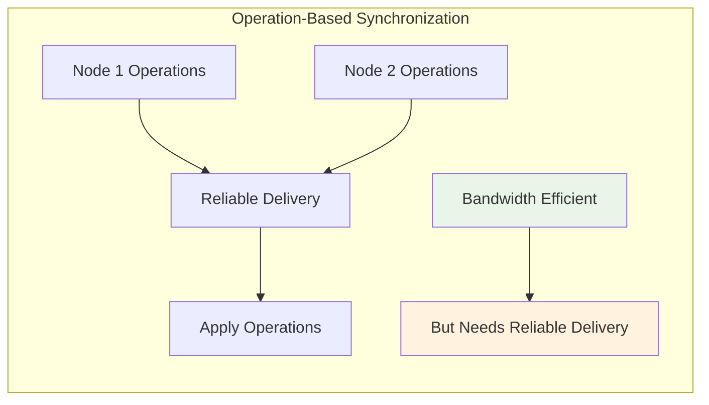

**Example**: OR-Set (observed-remove set)
```python
class ORSet:
    def __init__(self):
        self.added = {}      # element -> set of unique tags
        self.removed = set() # set of removed tags
    
    def add(self, element):
        tag = self.generate_unique_tag()
        if element not in self.added:
            self.added[element] = set()
        self.added[element].add(tag)
        return ('add', element, tag)
    
    def remove(self, element):
        if element in self.added:
            tags = self.added[element].copy()
            self.removed.update(tags)
            return ('remove', tags)
    
    def contains(self, element):
        if element not in self.added:
            return False
        return bool(self.added[element] - self.removed)
```

## The Conflict Resolution Philosophy

### Traditional: Conflict Avoidance

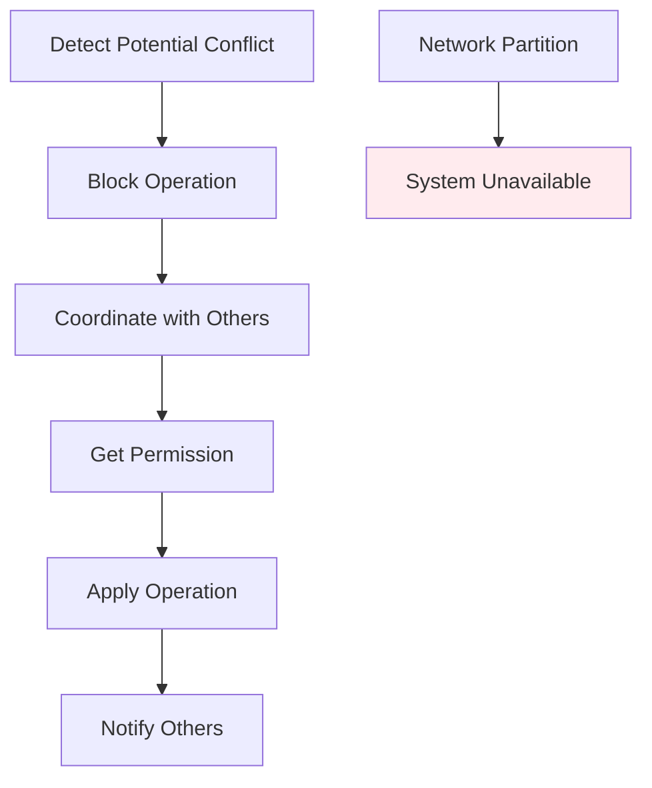

### CRDT: Conflict Embrace

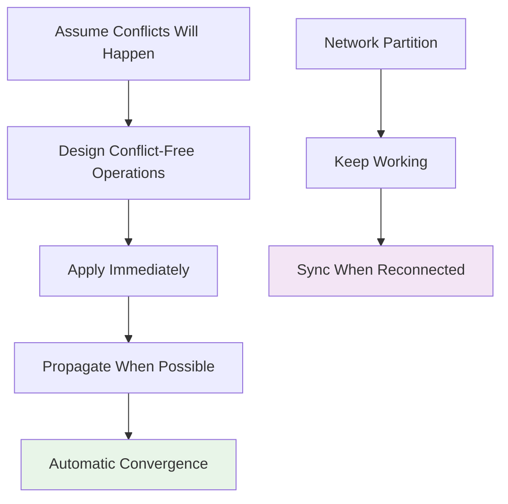

## The Trade-offs and Insights

### What CRDTs Give You

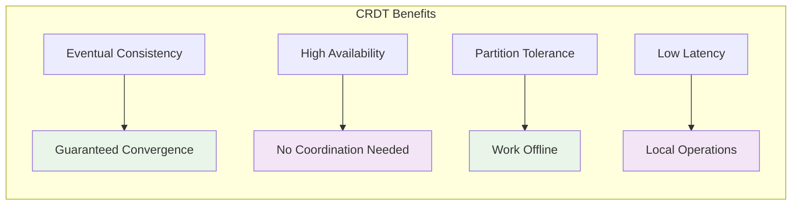

### What CRDTs Cost You

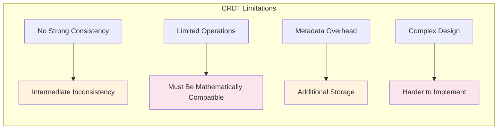

## Real-World Applications

### Collaborative Editing (Google Docs)

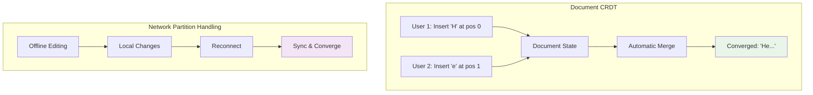

### Distributed Databases (Riak, Cassandra)

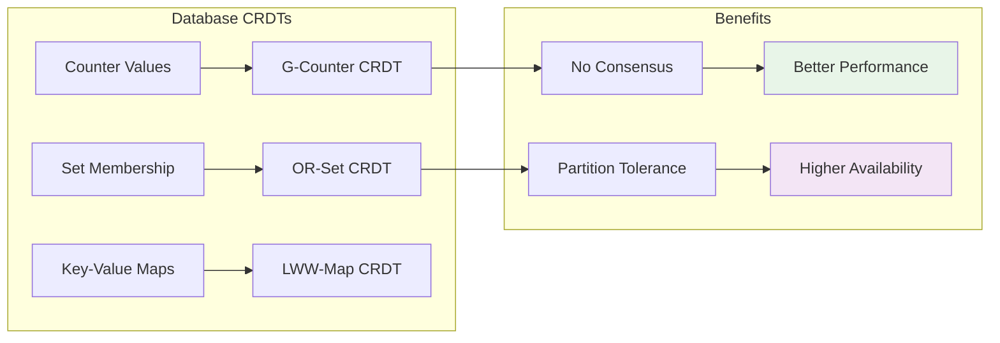

### Shopping Carts (E-commerce)

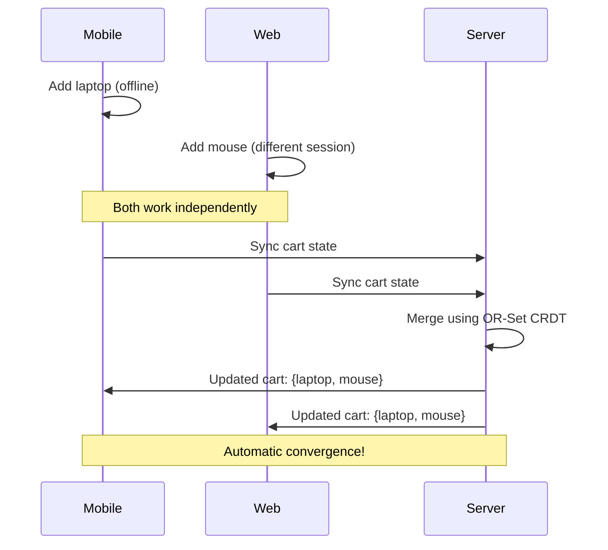

## The Philosophical Impact

CRDTs represent a fundamental shift in distributed systems thinking:

1. **From Control to Design**: Instead of controlling when operations happen, design operations that work regardless of when they happen

2. **From Coordination to Mathematics**: Replace runtime coordination with design-time mathematical proofs

3. **From Pessimistic to Optimistic**: Assume operations will conflict and design around it, rather than trying to prevent conflicts

4. **From Consistency Models to Convergence Guarantees**: Focus on eventual consistency through mathematical guarantees rather than strong consistency through coordination

This philosophy enables systems that are both highly available and eventually consistent, making them ideal for modern distributed applications where users expect to work offline and sync seamlessly when connected.

The next step is understanding the key abstractions that make CRDTs practical: G-Counters, PN-Counters, and G-Sets, and how they implement these mathematical properties in real code.