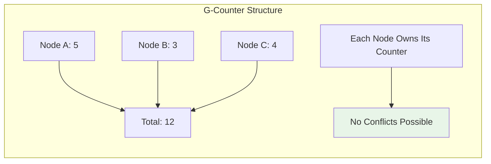
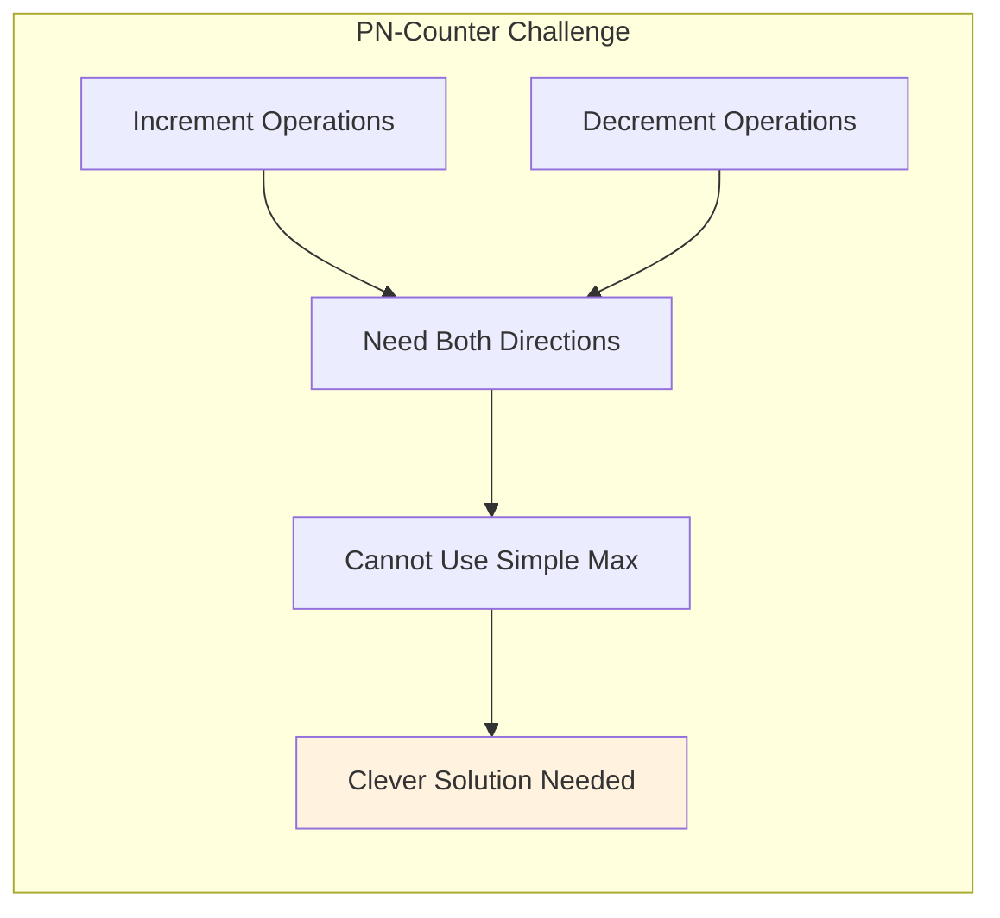
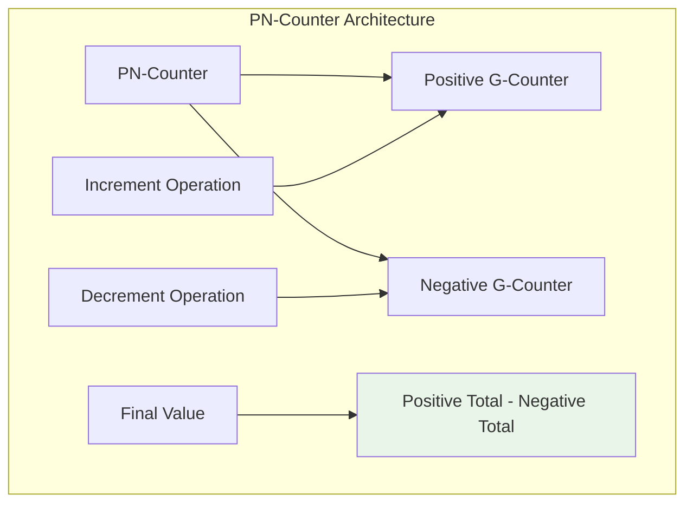
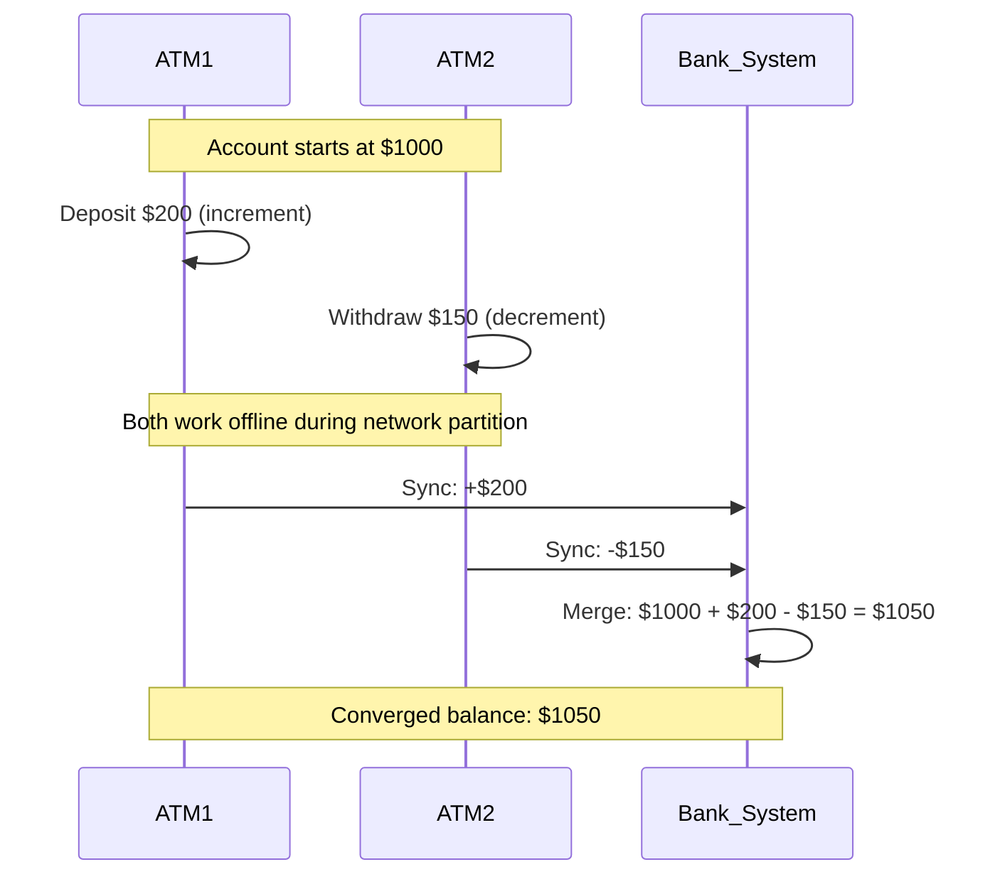
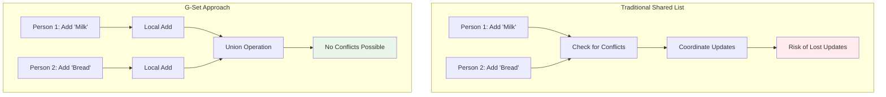
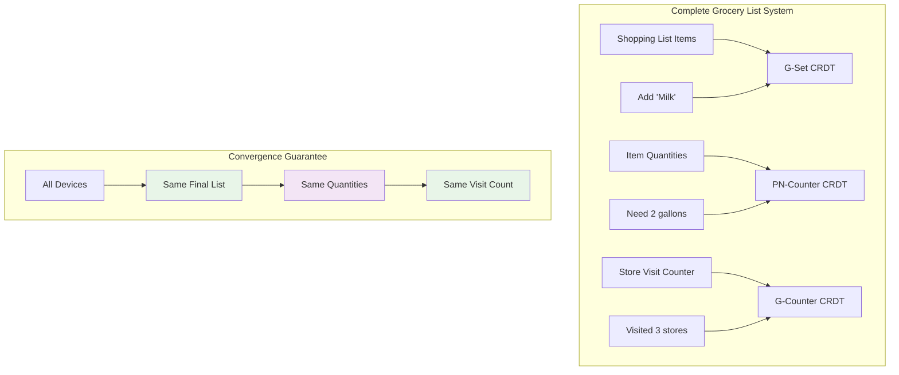
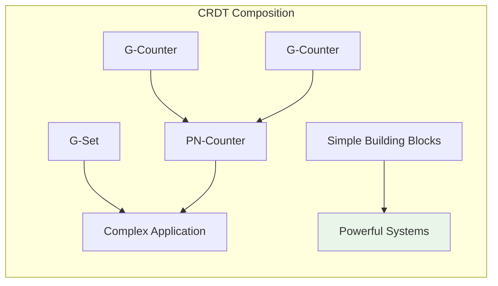
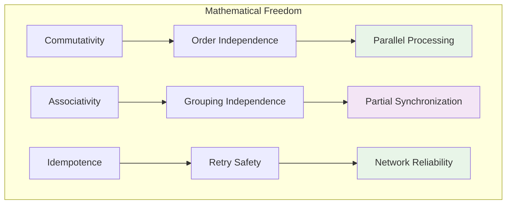
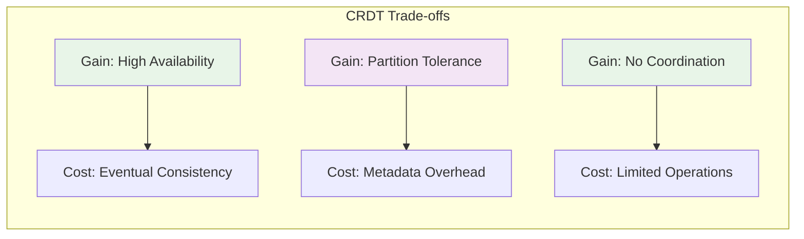

# Key Abstractions: The Building Blocks of Conflict-Free Systems

## The Three Fundamental CRDTs

CRDTs might seem complex, but they're built from surprisingly simple building blocks. Let's explore the three fundamental types that form the foundation of all CRDT systems:

1. **G-Counter**: Grow-only counter (only increases)
2. **PN-Counter**: Positive-negative counter (can increase and decrease)  
3. **G-Set**: Grow-only set (only adds elements)

These simple abstractions combine to create sophisticated distributed systems that never need coordination.

## G-Counter: The Grow-Only Counter

### The Problem It Solves

Imagine you're building a social media platform where you need to count "likes" across multiple data centers. Users can like posts from anywhere in the world, and the system must handle network partitions gracefully.

```mermaid
graph TD
    subgraph "Traditional Counter Problem"
        A[User Likes Post] --> B[Update Global Counter]
        B --> C[Coordinate with All Nodes]
        C --> D[Network Partition]
        D --> E[System Unavailable]
    end
    
    subgraph "G-Counter Solution"
        F[User Likes Post] --> G[Update Local Counter]
        G --> H[Continue Working]
        H --> I[Sync When Possible]
        I --> J[Automatic Convergence]
    end
    
    style E fill:#ffebee
    style J fill:#e8f5e8
```



### The G-Counter Design

The brilliant insight: instead of maintaining one global counter, maintain a separate counter for each node and sum them up.



### Implementation

```python
class GCounter:
    """Grow-only counter CRDT"""
    
    def __init__(self, node_id: str):
        self.node_id = node_id
        self.counts = {}  # node_id -> count
    
    def increment(self, amount: int = 1):
        """Increment this node's counter"""
        current = self.counts.get(self.node_id, 0)
        self.counts[self.node_id] = current + amount
        
        return self  # Enable method chaining
    
    def merge(self, other: 'GCounter') -> 'GCounter':
        """Merge with another G-Counter"""
        result = GCounter(self.node_id)
        
        # Take maximum count for each node (idempotent)
        all_nodes = set(self.counts.keys()) | set(other.counts.keys())
        
        for node_id in all_nodes:
            my_count = self.counts.get(node_id, 0)
            other_count = other.counts.get(node_id, 0)
            result.counts[node_id] = max(my_count, other_count)
        
        return result
    
    def value(self) -> int:
        """Get the current counter value"""
        return sum(self.counts.values())
    
    def __str__(self):
        return f"GCounter(node={self.node_id}, counts={self.counts}, value={self.value()})"

# Demonstration
def demonstrate_g_counter():
    print("G-Counter Demonstration")
    print("=" * 50)
    
    # Three nodes in different data centers
    counter_usa = GCounter("usa")
    counter_europe = GCounter("europe")
    counter_asia = GCounter("asia")
    
    # Simulate likes from different regions
    print("Initial state:")
    print(f"USA: {counter_usa}")
    print(f"Europe: {counter_europe}")
    print(f"Asia: {counter_asia}")
    print()
    
    # Each region gets some likes
    counter_usa.increment(10)  # 10 likes from USA
    counter_europe.increment(5)  # 5 likes from Europe
    counter_asia.increment(7)   # 7 likes from Asia
    
    print("After regional activity:")
    print(f"USA: {counter_usa}")
    print(f"Europe: {counter_europe}")
    print(f"Asia: {counter_asia}")
    print()
    
    # Merge USA and Europe first
    usa_europe = counter_usa.merge(counter_europe)
    print("USA + Europe merged:")
    print(f"Merged: {usa_europe}")
    print()
    
    # Now merge with Asia
    global_counter = usa_europe.merge(counter_asia)
    print("Final global state:")
    print(f"Global: {global_counter}")
    print(f"Total likes: {global_counter.value()}")
    print()
    
    # Demonstrate idempotence - merging again doesn't change result
    same_result = global_counter.merge(counter_usa)
    print("Idempotence test (merge with USA again):")
    print(f"Result: {same_result}")
    print(f"Same total: {same_result.value() == global_counter.value()}")

demonstrate_g_counter()
```

### Mathematical Properties

```mermaid
graph TD
    subgraph "G-Counter Properties"
        A[Commutativity] --> B[merge(A, B) = merge(B, A)]
        C[Associativity] --> D[merge(merge(A,B), C) = merge(A, merge(B,C))]
        E[Idempotence] --> F[merge(A, A) = A]
        
        G[Monotonicity] --> H[Values only increase]
        I[Convergence] --> J[All nodes reach same value]
    end
    
    style B fill:#e8f5e8
    style D fill:#f3e5f5
    style F fill:#e8f5e8
    style H fill:#f3e5f5
    style J fill:#e8f5e8
```

## PN-Counter: The Bidirectional Counter

### The Problem Extension

What if you need to support both increments AND decrements? Like a bank balance that can go up and down, or a voting system with upvotes and downvotes?



### The PN-Counter Solution

The insight: use TWO G-Counters - one for increments, one for decrements!



### Implementation

```python
class PNCounter:
    """Positive-Negative counter CRDT"""
    
    def __init__(self, node_id: str):
        self.node_id = node_id
        self.positive = GCounter(node_id)  # For increments
        self.negative = GCounter(node_id)  # For decrements
    
    def increment(self, amount: int = 1):
        """Increment the counter"""
        if amount < 0:
            raise ValueError("Use decrement() for negative amounts")
        self.positive.increment(amount)
        return self
    
    def decrement(self, amount: int = 1):
        """Decrement the counter"""
        if amount < 0:
            raise ValueError("Decrement amount should be positive")
        self.negative.increment(amount)  # Add to negative counter
        return self
    
    def merge(self, other: 'PNCounter') -> 'PNCounter':
        """Merge with another PN-Counter"""
        result = PNCounter(self.node_id)
        result.positive = self.positive.merge(other.positive)
        result.negative = self.negative.merge(other.negative)
        return result
    
    def value(self) -> int:
        """Get the current counter value"""
        return self.positive.value() - self.negative.value()
    
    def __str__(self):
        return f"PNCounter(node={self.node_id}, value={self.value()}, +{self.positive.value()}, -{self.negative.value()})"

# Demonstration  
def demonstrate_pn_counter():
    print("\nPN-Counter Demonstration")
    print("=" * 50)
    
    # Simulate a voting system across regions
    votes_usa = PNCounter("usa")
    votes_europe = PNCounter("europe")
    votes_asia = PNCounter("asia")
    
    print("Voting activity simulation:")
    
    # USA: 15 upvotes, 3 downvotes
    votes_usa.increment(15).decrement(3)
    print(f"USA votes: {votes_usa}")
    
    # Europe: 8 upvotes, 5 downvotes  
    votes_europe.increment(8).decrement(5)
    print(f"Europe votes: {votes_europe}")
    
    # Asia: 12 upvotes, 2 downvotes
    votes_asia.increment(12).decrement(2)
    print(f"Asia votes: {votes_asia}")
    print()
    
    # Merge all regions
    global_votes = votes_usa.merge(votes_europe).merge(votes_asia)
    print(f"Global votes: {global_votes}")
    print(f"Final score: {global_votes.value()}")
    
    # Show that merge order doesn't matter (commutativity)
    reverse_merge = votes_asia.merge(votes_europe).merge(votes_usa)
    print(f"Reverse merge: {reverse_merge}")
    print(f"Same result: {global_votes.value() == reverse_merge.value()}")

demonstrate_pn_counter()
```

### The Banking Example



## G-Set: The Grow-Only Set

### The Shared Shopping List Problem

Imagine you and your roommates are building a shared shopping list. People can add items from different devices, and the list should sync across all devices without conflicts.



### The G-Set Design

The insight: sets naturally support conflict-free operations through union (∪).

```mermaid
graph LR
    subgraph "Set Union Properties"
        A[Set A: {Milk, Eggs}] --> C[Union Result]
        B[Set B: {Bread, Milk}] --> C
        C --> D[{Milk, Eggs, Bread}]
        
        E[Commutative] --> F[A ∪ B = B ∪ A]
        G[Associative] --> H[(A ∪ B) ∪ C = A ∪ (B ∪ C)]
        I[Idempotent] --> J[A ∪ A = A]
    end
    
    style D fill:#e8f5e8
    style F fill:#f3e5f5
    style H fill:#e8f5e8
    style J fill:#f3e5f5
```

### Implementation

```python
class GSet:
    """Grow-only set CRDT"""
    
    def __init__(self, node_id: str):
        self.node_id = node_id
        self.elements = set()
    
    def add(self, element):
        """Add an element to the set"""
        self.elements.add(element)
        return self
    
    def merge(self, other: 'GSet') -> 'GSet':
        """Merge with another G-Set using union"""
        result = GSet(self.node_id)
        result.elements = self.elements | other.elements  # Set union
        return result
    
    def contains(self, element) -> bool:
        """Check if element is in the set"""
        return element in self.elements
    
    def size(self) -> int:
        """Get the number of elements"""
        return len(self.elements)
    
    def to_list(self) -> list:
        """Convert to sorted list for display"""
        return sorted(list(self.elements))
    
    def __str__(self):
        return f"GSet(node={self.node_id}, elements={self.to_list()})"

# Demonstration
def demonstrate_g_set():
    print("\nG-Set Demonstration")
    print("=" * 50)
    
    # Simulate shared shopping list across devices
    phone_list = GSet("phone")
    laptop_list = GSet("laptop")
    tablet_list = GSet("tablet")
    
    print("Building shopping list on different devices:")
    
    # Add items from phone
    phone_list.add("Milk").add("Bread").add("Eggs")
    print(f"Phone: {phone_list}")
    
    # Add items from laptop (some overlap)
    laptop_list.add("Bread").add("Cheese").add("Yogurt")
    print(f"Laptop: {laptop_list}")
    
    # Add items from tablet
    tablet_list.add("Apples").add("Milk").add("Bananas")
    print(f"Tablet: {tablet_list}")
    print()
    
    # Merge phone and laptop
    phone_laptop = phone_list.merge(laptop_list)
    print(f"Phone + Laptop: {phone_laptop}")
    
    # Merge with tablet
    final_list = phone_laptop.merge(tablet_list)
    print(f"Final list: {final_list}")
    print(f"Total items: {final_list.size()}")
    print()
    
    # Demonstrate that order doesn't matter
    reverse_merge = tablet_list.merge(laptop_list).merge(phone_list)
    print(f"Reverse merge: {reverse_merge}")
    print(f"Same result: {final_list.to_list() == reverse_merge.to_list()}")

demonstrate_g_set()
```

### Real-World Applications

```mermaid
graph TD
    subgraph "G-Set Use Cases"
        A[User Preferences] --> B[Settings that only get added]
        C[Feature Flags] --> D[Enabled features accumulate]
        E[Tags/Labels] --> F[Tags only added, never removed]
        G[Permissions] --> H[Granted permissions accumulate]
        I[Friend Lists] --> J[Friends only added (no unfriending)]
    end
    
    style B fill:#e8f5e8
    style D fill:#f3e5f5
    style F fill:#e8f5e8
    style H fill:#f3e5f5
    style J fill:#e8f5e8
```

## The Grocery List Analogy Expanded

Now we can complete our grocery list analogy with all three CRDT types:



### Complete Grocery List Implementation

```python
class GroceryList:
    """Complete grocery list using multiple CRDTs"""
    
    def __init__(self, node_id: str):
        self.node_id = node_id
        self.items = GSet(node_id)           # What to buy
        self.quantities = {}                 # item -> PN-Counter
        self.store_visits = GCounter(node_id) # How many stores visited
    
    def add_item(self, item: str, quantity: int = 1):
        """Add item with quantity to the list"""
        self.items.add(item)
        
        if item not in self.quantities:
            self.quantities[item] = PNCounter(self.node_id)
        
        if quantity > 0:
            self.quantities[item].increment(quantity)
        elif quantity < 0:
            self.quantities[item].decrement(abs(quantity))
        
        return self
    
    def adjust_quantity(self, item: str, change: int):
        """Adjust quantity of existing item"""
        if not self.items.contains(item):
            raise ValueError(f"Item '{item}' not in list")
        
        if change > 0:
            self.quantities[item].increment(change)
        else:
            self.quantities[item].decrement(abs(change))
        
        return self
    
    def visit_store(self):
        """Record that we visited a store"""
        self.store_visits.increment()
        return self
    
    def merge(self, other: 'GroceryList') -> 'GroceryList':
        """Merge with another grocery list"""
        result = GroceryList(self.node_id)
        
        # Merge items
        result.items = self.items.merge(other.items)
        
        # Merge quantities
        all_items = result.items.to_list()
        for item in all_items:
            my_qty = self.quantities.get(item, PNCounter(self.node_id))
            other_qty = other.quantities.get(item, PNCounter(self.node_id))
            result.quantities[item] = my_qty.merge(other_qty)
        
        # Merge store visits
        result.store_visits = self.store_visits.merge(other.store_visits)
        
        return result
    
    def get_summary(self):
        """Get a summary of the grocery list"""
        summary = {
            'items': {},
            'total_items': self.items.size(),
            'stores_visited': self.store_visits.value()
        }
        
        for item in self.items.to_list():
            qty = self.quantities.get(item, PNCounter(self.node_id)).value()
            summary['items'][item] = qty
        
        return summary
    
    def __str__(self):
        summary = self.get_summary()
        items_str = ', '.join([f"{item}({qty})" for item, qty in summary['items'].items()])
        return f"GroceryList({items_str}) - Stores visited: {summary['stores_visited']}"

# Complete demonstration
def demonstrate_complete_system():
    print("\nComplete Grocery List System")
    print("=" * 50)
    
    # Family members with different devices
    mom_list = GroceryList("mom_phone")
    dad_list = GroceryList("dad_phone")
    kids_list = GroceryList("kids_tablet")
    
    # Mom adds basic items
    mom_list.add_item("Milk", 2).add_item("Bread", 1).visit_store()
    print(f"Mom's list: {mom_list}")
    
    # Dad adds more items and adjusts quantities
    dad_list.add_item("Bread", 1).add_item("Cheese", 1).add_item("Milk", 1).visit_store()
    print(f"Dad's list: {dad_list}")
    
    # Kids add snacks
    kids_list.add_item("Cookies", 3).add_item("Juice", 2)
    print(f"Kids' list: {kids_list}")
    print()
    
    # Merge all lists
    family_list = mom_list.merge(dad_list).merge(kids_list)
    print(f"Final family list: {family_list}")
    
    summary = family_list.get_summary()
    print("\nDetailed summary:")
    for item, qty in summary['items'].items():
        print(f"  {item}: {qty}")
    print(f"Total stores visited by family: {summary['stores_visited']}")

demonstrate_complete_system()
```

## Key Insights and Principles

### 1. Composition is Key

Complex CRDTs are built by composing simple ones:



### 2. Mathematical Properties Enable Freedom



### 3. Trade-offs Are Explicit



These building blocks - G-Counter, PN-Counter, and G-Set - form the foundation for building sophisticated distributed systems that can handle network partitions, concurrent updates, and offline operation while guaranteeing eventual consistency without coordination.

The next step is seeing how to implement a practical PN-Counter from scratch and understanding the engineering decisions that make CRDTs work in production systems.