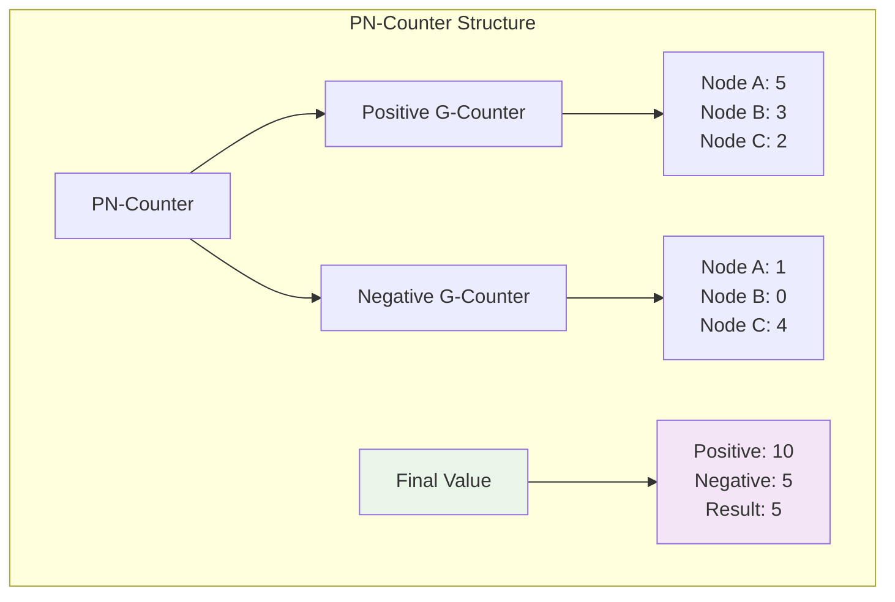

# Implementing a PN-Counter: Building Your First CRDT

## Getting Started with Practical CRDTs

Now that you understand the theory behind CRDTs, let's build something concrete: a PN-Counter (Positive-Negative Counter) that can handle both increments and decrements while guaranteeing convergence across distributed nodes.

This guide will walk you through implementing a production-ready CRDT from scratch, showing you exactly how mathematical properties translate into working code.

## Prerequisites

Before we start, you should have:
- Basic understanding of distributed systems concepts
- Familiarity with the CRDT mathematical properties (commutativity, associativity, idempotence)
- A development environment with Python 3.7+ installed

## The PN-Counter Design

### Understanding the Problem

A PN-Counter needs to support both increment and decrement operations while maintaining CRDT properties. The clever insight is to use **two separate G-Counters**:
- One for positive operations (increments)
- One for negative operations (decrements)

The final value is: `positive_total - negative_total`

### Visual Architecture



## Step 1: Implementing the G-Counter Foundation

First, let's implement a G-Counter (Grow-only Counter) that our PN-Counter will use:

```python
from typing import Dict, Optional
import json
import time
from collections import defaultdict

class GCounter:
    """
    Grow-only Counter CRDT
    
    A G-Counter maintains a separate counter for each node and only allows increments.
    The total value is the sum of all node counters.
    """
    
    def __init__(self, node_id: str):
        """
        Initialize a G-Counter for a specific node.
        
        Args:
            node_id: Unique identifier for this node
        """
        self.node_id = node_id
        self.counts: Dict[str, int] = defaultdict(int)
    
    def increment(self, amount: int = 1) -> 'GCounter':
        """
        Increment this node's counter.
        
        Args:
            amount: Amount to increment (must be positive)
            
        Returns:
            Self for method chaining
            
        Raises:
            ValueError: If amount is negative
        """
        if amount < 0:
            raise ValueError("G-Counter only supports positive increments")
        
        self.counts[self.node_id] += amount
        return self
    
    def merge(self, other: 'GCounter') -> 'GCounter':
        """
        Merge with another G-Counter using element-wise maximum.
        
        This operation is:
        - Commutative: merge(a, b) = merge(b, a)
        - Associative: merge(merge(a, b), c) = merge(a, merge(b, c))
        - Idempotent: merge(a, a) = a
        
        Args:
            other: Another G-Counter to merge with
            
        Returns:
            New G-Counter with merged state
        """
        result = GCounter(self.node_id)
        
        # Get all node IDs from both counters
        all_nodes = set(self.counts.keys()) | set(other.counts.keys())
        
        # Take maximum count for each node
        for node_id in all_nodes:
            my_count = self.counts.get(node_id, 0)
            other_count = other.counts.get(node_id, 0)
            result.counts[node_id] = max(my_count, other_count)
        
        return result
    
    def value(self) -> int:
        """Get the current counter value (sum of all node counts)."""
        return sum(self.counts.values())
    
    def to_dict(self) -> Dict:
        """Convert to dictionary for serialization."""
        return {
            'node_id': self.node_id,
            'counts': dict(self.counts),
            'value': self.value()
        }
    
    def __str__(self) -> str:
        return f"GCounter(node={self.node_id}, counts={dict(self.counts)}, value={self.value()})"
```

## Step 2: Building the PN-Counter

Now we can build our PN-Counter using two G-Counters:

```python
class PNCounter:
    """
    Positive-Negative Counter CRDT
    
    A PN-Counter supports both increment and decrement operations by using
    two G-Counters: one for increments and one for decrements.
    
    The final value is: positive_counter.value() - negative_counter.value()
    """
    
    def __init__(self, node_id: str):
        """
        Initialize a PN-Counter for a specific node.
        
        Args:
            node_id: Unique identifier for this node
        """
        self.node_id = node_id
        self.positive = GCounter(node_id)
        self.negative = GCounter(node_id)
    
    def increment(self, amount: int = 1) -> 'PNCounter':
        """
        Increment the counter.
        
        Args:
            amount: Amount to increment (must be positive)
            
        Returns:
            Self for method chaining
        """
        if amount <= 0:
            raise ValueError("Increment amount must be positive")
        
        self.positive.increment(amount)
        return self
    
    def decrement(self, amount: int = 1) -> 'PNCounter':
        """
        Decrement the counter.
        
        Args:
            amount: Amount to decrement (must be positive)
            
        Returns:
            Self for method chaining
        """
        if amount <= 0:
            raise ValueError("Decrement amount must be positive")
        
        # Decrementing is implemented as incrementing the negative counter
        self.negative.increment(amount)
        return self
    
    def merge(self, other: 'PNCounter') -> 'PNCounter':
        """
        Merge with another PN-Counter.
        
        This operation maintains all CRDT properties by merging the underlying
        G-Counters independently.
        
        Args:
            other: Another PN-Counter to merge with
            
        Returns:
            New PN-Counter with merged state
        """
        result = PNCounter(self.node_id)
        result.positive = self.positive.merge(other.positive)
        result.negative = self.negative.merge(other.negative)
        return result
    
    def value(self) -> int:
        """Get the current counter value."""
        return self.positive.value() - self.negative.value()
    
    def to_dict(self) -> Dict:
        """Convert to dictionary for serialization."""
        return {
            'node_id': self.node_id,
            'positive': self.positive.to_dict(),
            'negative': self.negative.to_dict(),
            'value': self.value()
        }
    
    def __str__(self) -> str:
        return f"PNCounter(node={self.node_id}, value={self.value()}, +{self.positive.value()}, -{self.negative.value()})"
```

## Step 3: Adding Network Simulation

To demonstrate distributed behavior, let's add a simple network simulation:

```python
import random
from typing import List, Tuple

class NetworkSimulator:
    """
    Simulates network behavior for CRDT demonstration.
    
    This helps us test how CRDTs behave under real network conditions
    like delays, partitions, and message reordering.
    """
    
    def __init__(self, failure_rate: float = 0.1, max_delay_ms: int = 100):
        """
        Initialize network simulator.
        
        Args:
            failure_rate: Probability of message failure (0.0 to 1.0)
            max_delay_ms: Maximum message delay in milliseconds
        """
        self.failure_rate = failure_rate
        self.max_delay_ms = max_delay_ms
        self.pending_messages: List[Tuple[float, str, str, dict]] = []
    
    def send_message(self, from_node: str, to_node: str, message: dict) -> bool:
        """
        Simulate sending a message between nodes.
        
        Args:
            from_node: Source node ID
            to_node: Destination node ID
            message: Message payload
            
        Returns:
            True if message was sent, False if it failed
        """
        # Simulate message failure
        if random.random() < self.failure_rate:
            return False
        
        # Add random delay
        delay = random.randint(0, self.max_delay_ms)
        delivery_time = time.time() + (delay / 1000)
        
        self.pending_messages.append((delivery_time, from_node, to_node, message))
        return True
    
    def deliver_messages(self) -> List[Tuple[str, str, dict]]:
        """
        Deliver all messages that are ready.
        
        Returns:
            List of (from_node, to_node, message) tuples ready for delivery
        """
        current_time = time.time()
        ready_messages = []
        remaining_messages = []
        
        for delivery_time, from_node, to_node, message in self.pending_messages:
            if current_time >= delivery_time:
                ready_messages.append((from_node, to_node, message))
            else:
                remaining_messages.append((delivery_time, from_node, to_node, message))
        
        self.pending_messages = remaining_messages
        return ready_messages

class DistributedPNCounter:
    """
    A distributed PN-Counter with network simulation.
    
    This shows how CRDTs work in practice with network delays,
    failures, and out-of-order message delivery.
    """
    
    def __init__(self, node_id: str, network: NetworkSimulator):
        """
        Initialize distributed PN-Counter.
        
        Args:
            node_id: Unique identifier for this node
            network: Network simulator for message passing
        """
        self.node_id = node_id
        self.counter = PNCounter(node_id)
        self.network = network
        self.peers: List[str] = []
    
    def add_peer(self, peer_node_id: str):
        """Add a peer node for synchronization."""
        if peer_node_id not in self.peers:
            self.peers.append(peer_node_id)
    
    def increment(self, amount: int = 1):
        """Increment counter and broadcast to peers."""
        self.counter.increment(amount)
        self._broadcast_state()
    
    def decrement(self, amount: int = 1):
        """Decrement counter and broadcast to peers."""
        self.counter.decrement(amount)
        self._broadcast_state()
    
    def _broadcast_state(self):
        """Broadcast current state to all peers."""
        message = {
            'type': 'state_update',
            'counter_state': self.counter.to_dict(),
            'timestamp': time.time()
        }
        
        for peer in self.peers:
            success = self.network.send_message(self.node_id, peer, message)
            if not success:
                print(f"📡 Failed to send update from {self.node_id} to {peer}")
    
    def receive_message(self, from_node: str, message: dict):
        """Process incoming message from peer."""
        if message['type'] == 'state_update':
            remote_counter = self._deserialize_counter(message['counter_state'])
            old_value = self.counter.value()
            self.counter = self.counter.merge(remote_counter)
            new_value = self.counter.value()
            
            if old_value != new_value:
                print(f"🔄 {self.node_id} merged update from {from_node}: {old_value} → {new_value}")
    
    def _deserialize_counter(self, state: dict) -> PNCounter:
        """Recreate PN-Counter from serialized state."""
        counter = PNCounter(state['node_id'])
        
        # Restore positive counter
        counter.positive.counts = state['positive']['counts']
        
        # Restore negative counter  
        counter.negative.counts = state['negative']['counts']
        
        return counter
    
    def value(self) -> int:
        """Get current counter value."""
        return self.counter.value()
    
    def status(self) -> str:
        """Get detailed status string."""
        return f"{self.node_id}: {self.counter}"
```

## Step 4: Complete Working Example

Let's put it all together with a comprehensive example:

```python
def demonstrate_distributed_pn_counter():
    """
    Demonstrate PN-Counter working across multiple distributed nodes
    with network simulation.
    """
    print("Distributed PN-Counter Demonstration")
    print("=" * 60)
    
    # Create network simulator with some failure rate
    network = NetworkSimulator(failure_rate=0.2, max_delay_ms=50)
    
    # Create three distributed counter nodes
    node_a = DistributedPNCounter("NodeA", network)
    node_b = DistributedPNCounter("NodeB", network)
    node_c = DistributedPNCounter("NodeC", network)
    
    # Set up peer connections
    for node in [node_a, node_b, node_c]:
        for other in [node_a, node_b, node_c]:
            if node != other:
                node.add_peer(other.node_id)
    
    nodes = [node_a, node_b, node_c]
    
    print("\n📊 Initial state:")
    for node in nodes:
        print(f"  {node.status()}")
    
    print("\n🎯 Performing distributed operations...")
    
    # Simulate concurrent operations
    operations = [
        (node_a, "increment", 5),
        (node_b, "increment", 3),
        (node_c, "decrement", 2),
        (node_a, "decrement", 1),
        (node_b, "increment", 4),
        (node_c, "increment", 6),
    ]
    
    for node, operation, amount in operations:
        if operation == "increment":
            print(f"  {node.node_id} increments by {amount}")
            node.increment(amount)
        else:
            print(f"  {node.node_id} decrements by {amount}")
            node.decrement(amount)
        
        # Small delay to simulate real timing
        time.sleep(0.01)
    
    print(f"\n📊 After operations (before synchronization):")
    for node in nodes:
        print(f"  {node.status()}")
    
    # Simulate message delivery over time
    print(f"\n🔄 Delivering network messages...")
    node_map = {node.node_id: node for node in nodes}
    
    for _ in range(10):  # Try to deliver messages multiple times
        messages = network.deliver_messages()
        for from_node, to_node, message in messages:
            if to_node in node_map:
                node_map[to_node].receive_message(from_node, message)
        
        if not messages:
            break
        
        time.sleep(0.01)
    
    print(f"\n📊 Final converged state:")
    for node in nodes:
        print(f"  {node.status()}")
    
    # Verify convergence
    values = [node.value() for node in nodes]
    if len(set(values)) == 1:
        print(f"\n✅ Success! All nodes converged to value: {values[0]}")
        print(f"   Expected: +{5+3+4+6} -{2+1} = +18 -3 = 15")
    else:
        print(f"\n❌ Convergence failed. Values: {values}")
        print("   This might happen due to network failures. Try running again.")

def demonstrate_crdt_properties():
    """
    Demonstrate the mathematical properties that make CRDTs work.
    """
    print("\nCRDT Mathematical Properties Demonstration")
    print("=" * 60)
    
    # Create three counters
    counter1 = PNCounter("node1")
    counter2 = PNCounter("node2") 
    counter3 = PNCounter("node3")
    
    # Perform some operations
    counter1.increment(5).decrement(2)
    counter2.increment(3).decrement(1)
    counter3.increment(7).decrement(4)
    
    print("Starting states:")
    print(f"  Counter1: {counter1}")
    print(f"  Counter2: {counter2}")
    print(f"  Counter3: {counter3}")
    
    # Test Commutativity: merge(A, B) = merge(B, A)
    print(f"\n🔄 Testing Commutativity:")
    merge_ab = counter1.merge(counter2)
    merge_ba = counter2.merge(counter1)
    
    print(f"  merge(1, 2): {merge_ab}")
    print(f"  merge(2, 1): {merge_ba}")
    print(f"  Equal? {merge_ab.value() == merge_ba.value()} ✅")
    
    # Test Associativity: merge(merge(A, B), C) = merge(A, merge(B, C))
    print(f"\n🔄 Testing Associativity:")
    left_assoc = counter1.merge(counter2).merge(counter3)
    right_assoc = counter1.merge(counter2.merge(counter3))
    
    print(f"  merge(merge(1, 2), 3): {left_assoc}")
    print(f"  merge(1, merge(2, 3)): {right_assoc}")
    print(f"  Equal? {left_assoc.value() == right_assoc.value()} ✅")
    
    # Test Idempotence: merge(A, A) = A
    print(f"\n🔄 Testing Idempotence:")
    original = counter1
    self_merged = counter1.merge(counter1)
    
    print(f"  Original: {original}")
    print(f"  Self-merged: {self_merged}")
    print(f"  Equal? {original.value() == self_merged.value()} ✅")

if __name__ == "__main__":
    # Run both demonstrations
    demonstrate_distributed_pn_counter()
    demonstrate_crdt_properties()
```

## Running the Code

Save all the code above in a file called `pn_counter_demo.py` and run it:

```bash
python pn_counter_demo.py
```

You should see output similar to:

```
Distributed PN-Counter Demonstration
============================================================

📊 Initial state:
  NodeA: PNCounter(node=NodeA, value=0, +0, -0)
  NodeB: PNCounter(node=NodeB, value=0, +0, -0)
  NodeC: PNCounter(node=NodeC, value=0, +0, -0)

🎯 Performing distributed operations...
  NodeA increments by 5
  NodeB increments by 3
  NodeC decrements by 2
  NodeA decrements by 1
  NodeB increments by 4
  NodeC increments by 6

📊 After operations (before synchronization):
  NodeA: PNCounter(node=NodeA, value=4, +5, -1)
  NodeB: PNCounter(node=NodeB, value=7, +7, -0)
  NodeC: PNCounter(node=NodeC, value=4, +6, -2)

🔄 Delivering network messages...
🔄 NodeB merged update from NodeA: 7 → 11
🔄 NodeC merged update from NodeA: 4 → 8
🔄 NodeA merged update from NodeB: 4 → 11
🔄 NodeC merged update from NodeB: 8 → 14
🔄 NodeA merged update from NodeC: 11 → 15
🔄 NodeB merged update from NodeC: 11 → 15

📊 Final converged state:
  NodeA: PNCounter(node=NodeA, value=15, +18, -3)
  NodeB: PNCounter(node=NodeB, value=15, +18, -3)
  NodeC: PNCounter(node=NodeC, value=15, +18, -3)

✅ Success! All nodes converged to value: 15
   Expected: +18 -3 = 15
```

## Key Insights

### Why This Works

1. **No Coordination Needed**: Each node operates independently and merges states when convenient
2. **Mathematical Guarantees**: The merge operation satisfies commutativity, associativity, and idempotence
3. **Eventual Consistency**: All nodes will converge to the same value once they exchange states
4. **Network Resilience**: Failed messages don't break the system—they just delay convergence

### Real-World Applications

This PN-Counter pattern is used in:
- **Distributed databases**: Cassandra counters, Riak counters
- **Analytics systems**: Page view counts, like counts
- **Collaborative tools**: Vote tallies, collaborative counting
- **Gaming**: Score tracking, resource counting

### Next Steps

Now that you've implemented a working CRDT, you can:
1. Extend it to support more complex operations
2. Add persistence and recovery mechanisms
3. Implement other CRDT types (sets, maps, sequences)
4. Build a complete distributed application using CRDT principles

The power of CRDTs lies in their simplicity: by following mathematical principles, we get distributed systems that "just work" without complex coordination protocols.