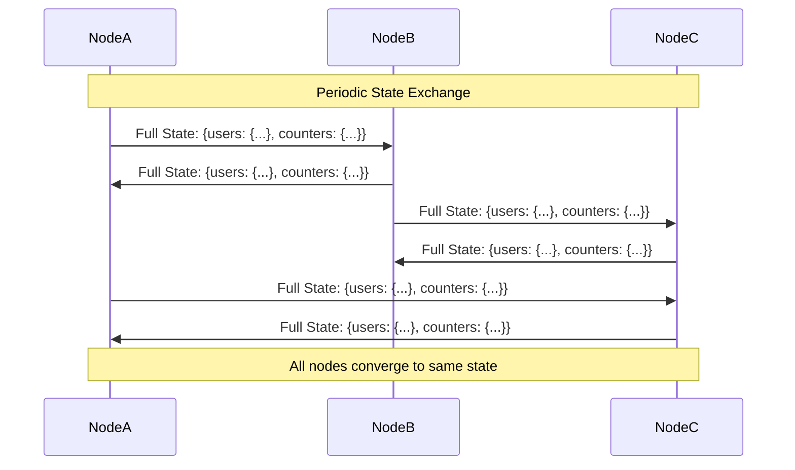
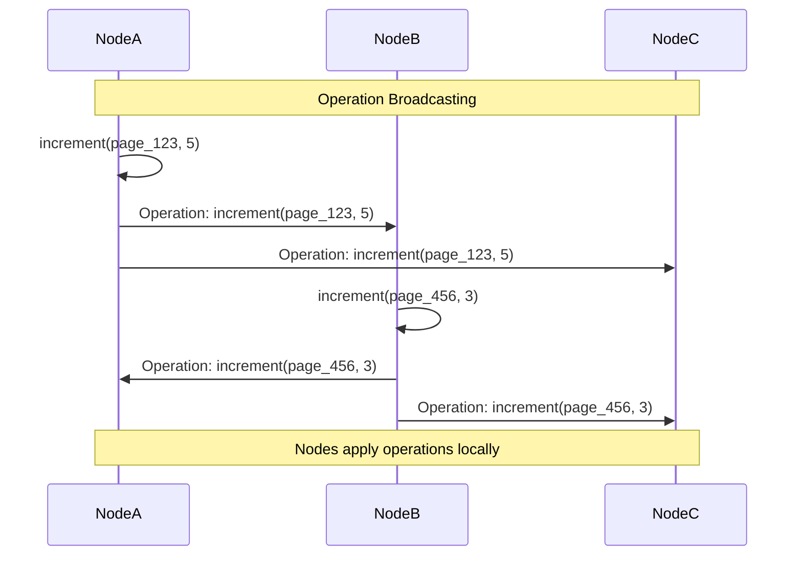
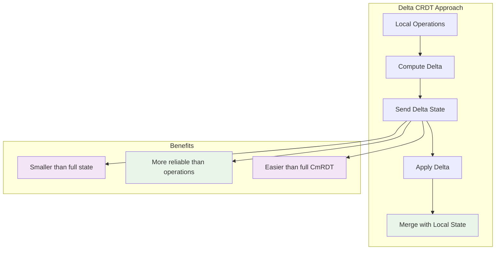

# State-Based vs Operation-Based CRDTs: The Two Paths to Convergence

## The Fundamental Design Choice

When implementing CRDTs, you face a crucial architectural decision: **how do you synchronize changes between nodes?** There are two fundamentally different approaches, each with distinct trade-offs that affect performance, network usage, and implementation complexity.

Think of it like two different ways to keep multiple notebooks in sync:

- **State-based CRDTs**: "Here's my entire notebook, merge it with yours"
- **Operation-based CRDTs**: "Here are the specific edits I made, apply them to your notebook"

This choice determines everything about how your distributed system behaves under network partitions, bandwidth constraints, and failure conditions.

## State-Based CRDTs (CvRDTs): The State Exchange Approach

### The Core Concept

State-based CRDTs synchronize by exchanging complete state snapshots. Each node periodically sends its entire current state to other nodes, which then merge these states using a mathematically sound merge function.

```mermaid
graph LR
    subgraph "Node A State"
        A1[Counter: {A:5, B:2, C:0}]
    end
    
    subgraph "Node B State"
        B1[Counter: {A:3, B:3, C:1}]
    end
    
    subgraph "Merge Process"
        M1[Take element-wise maximum]
        M2[Result: {A:5, B:3, C:1}]
    end
    
    A1 --> M1
    B1 --> M1
    M1 --> M2
    
    style M2 fill:#e8f5e8
```

### Mental Model: The Library Inventory System

Imagine managing book inventories across multiple library branches. With state-based synchronization:

1. **Each branch maintains a complete inventory list**
2. **Periodically, branches exchange their entire inventories**
3. **When receiving another inventory, they merge by taking the maximum count for each book**
4. **This works because books are only added, never removed (G-Counter semantics)**

The beauty is simplicity: no complex message ordering, no duplicate detection—just "here's my state, merge it with yours."

### Implementation Characteristics

**Merge Function Requirements:**
- **Commutative**: `merge(A, B) = merge(B, A)`
- **Associative**: `merge(merge(A, B), C) = merge(A, merge(B, C))`
- **Idempotent**: `merge(A, A) = A`

**Network Behavior:**


### Advantages of State-Based CRDTs

**1. Simplicity and Robustness**
- **No message ordering concerns**: States can arrive in any order
- **Automatic duplicate handling**: Merging the same state multiple times is safe
- **Network failure resilience**: Lost messages don't break synchronization

**2. Strong Convergence Guarantees**
- **Eventually consistent**: All nodes will converge if they can eventually communicate
- **Predictable behavior**: Merge semantics are mathematically guaranteed

**3. Implementation Ease**
- **Straightforward logic**: Just implement a merge function
- **No complex protocols**: No need for reliable message delivery or ordering

### Disadvantages of State-Based CRDTs

**1. Bandwidth Requirements**
- **Large state overhead**: Must transmit entire state, even for small changes
- **Scaling challenges**: Bandwidth usage grows with state size, not change size
- **Network efficiency**: Wastes bandwidth sending unchanged data

**2. Merge Complexity**
- **State size growth**: Metadata (like vector clocks) can grow indefinitely
- **Garbage collection**: Need mechanisms to clean up obsolete data

### Real-World Example: Distributed Counter Service

Consider a web analytics service tracking page views across multiple data centers:

```python
# State-based approach
class PageViewCounter:
    def __init__(self, datacenter_id):
        self.datacenter_id = datacenter_id
        self.counts = {}  # page_id -> {datacenter -> count}
    
    def record_view(self, page_id):
        if page_id not in self.counts:
            self.counts[page_id] = {}
        self.counts[page_id][self.datacenter_id] = \
            self.counts[page_id].get(self.datacenter_id, 0) + 1
    
    def merge(self, other_state):
        # Merge by taking element-wise maximum
        for page_id, other_counts in other_state.counts.items():
            if page_id not in self.counts:
                self.counts[page_id] = {}
            
            for datacenter, count in other_counts.items():
                current = self.counts[page_id].get(datacenter, 0)
                self.counts[page_id][datacenter] = max(current, count)
    
    def get_total_views(self, page_id):
        if page_id not in self.counts:
            return 0
        return sum(self.counts[page_id].values())
```

**Bandwidth Analysis:**
- **Small change**: 1 page view → Must send entire state (potentially megabytes)
- **Large systems**: 1 million pages tracked → Every sync sends 1 million counters
- **Network usage**: O(state_size) per synchronization

## Operation-Based CRDTs (CmRDTs): The Operation Exchange Approach

### The Core Concept

Operation-based CRDTs synchronize by exchanging the actual operations performed. When a node performs an operation, it broadcasts that operation to other nodes, which then apply it to their local state.

```mermaid
graph LR
    subgraph "Node A Operations"
        A1[increment(page_123, 5)]
        A2[increment(page_456, 2)]
    end
    
    subgraph "Node B"
        B1[Apply: increment(page_123, 5)]
        B2[Apply: increment(page_456, 2)]
        B3[Local State Updated]
    end
    
    A1 --> B1
    A2 --> B2
    B1 --> B3
    B2 --> B3
    
    style B3 fill:#e8f5e8
```

### Mental Model: The Collaborative Cookbook

Imagine chefs working on a shared cookbook across different kitchens. With operation-based synchronization:

1. **Each chef records their changes as specific operations**: "Add recipe for lasagna," "Update ingredients for bread"
2. **Operations are sent to other kitchens**: Not the entire cookbook, just the changes
3. **Each kitchen applies operations in order**: Operations must be designed to commute
4. **Result**: All kitchens have the same cookbook without sending the entire book

The key insight: send **intentions** (operations), not **state** (the full cookbook).

### Implementation Characteristics

**Operation Requirements:**
- **Commutative**: Operations can be applied in any order
- **Idempotent**: Applying the same operation twice has no additional effect

**Network Behavior:**


### Advantages of Operation-Based CRDTs

**1. Network Efficiency**
- **Minimal bandwidth**: Only send actual changes, not entire state
- **Proportional costs**: Network usage scales with operation rate, not state size
- **Real-time performance**: Small operations enable near-instant synchronization

**2. Scalability**
- **Large state support**: Can handle massive states efficiently
- **Incremental updates**: Perfect for high-frequency, small changes

**3. Fine-Grained Control**
- **Operation semantics**: Can optimize specific operation types
- **Compression opportunities**: Operations often compress well

### Disadvantages of Operation-Based CRDTs

**1. Delivery Requirements**
- **Exactly-once delivery**: Each operation must be delivered exactly once to each node
- **Reliable networking**: Need mechanisms to detect and handle lost operations
- **Duplicate detection**: Must identify and ignore duplicate operations

**2. Implementation Complexity**
- **Message ordering**: Must handle out-of-order operation delivery
- **Failure handling**: Complex recovery when operations are lost
- **Garbage collection**: Need to track which operations have been delivered

### Real-World Example: Collaborative Text Editor

Consider a Google Docs-style collaborative editor:

```python
# Operation-based approach
class CollaborativeDocument:
    def __init__(self, node_id):
        self.node_id = node_id
        self.content = []
        self.operations_log = []
        self.delivered_ops = set()  # Track delivered operations
    
    def insert_char(self, position, character):
        op_id = f"{self.node_id}_{len(self.operations_log)}"
        operation = {
            'type': 'insert',
            'id': op_id,
            'position': position,
            'character': character,
            'node_id': self.node_id
        }
        
        self.apply_operation(operation)
        self.broadcast_operation(operation)
    
    def apply_operation(self, operation):
        if operation['id'] in self.delivered_ops:
            return  # Already applied (idempotence)
        
        if operation['type'] == 'insert':
            pos = operation['position']
            char = operation['character']
            
            # Transform position based on concurrent operations
            adjusted_pos = self.transform_position(pos, operation)
            
            self.content.insert(adjusted_pos, char)
            self.delivered_ops.add(operation['id'])
    
    def transform_position(self, position, operation):
        # Operational Transform logic to handle concurrent edits
        # This is simplified - real OT is more complex
        concurrent_inserts = [
            op for op in self.operations_log 
            if op['position'] <= position and op['id'] < operation['id']
        ]
        return position + len(concurrent_inserts)
```

**Bandwidth Analysis:**
- **Small change**: Insert one character → Send ~50 bytes
- **Large documents**: 1MB document, insert 1 char → Still send ~50 bytes
- **Network usage**: O(operation_size) per operation

## The Hybrid Approach: Delta CRDTs

### Best of Both Worlds

Delta CRDTs represent a middle ground that addresses the key limitations of both approaches:



**Delta CRDT Characteristics:**
- **Send incremental state**: Only the changes since last synchronization
- **State-based guarantees**: Maintains merge semantics and reliability
- **Bandwidth efficiency**: Much smaller than full state
- **Simpler than operations**: No need for exactly-once delivery

## Decision Framework: Choosing the Right Approach

### Use State-Based CRDTs When:

**Network Characteristics:**
- **High-latency, low-bandwidth networks** where synchronization is infrequent
- **Unreliable networks** where message delivery guarantees are difficult
- **Simple network stacks** without reliable messaging infrastructure

**Application Requirements:**
- **Strong consistency requirements** where you can't afford lost operations
- **Infrequent updates** where bandwidth overhead is acceptable
- **Simple implementation** is more important than network efficiency

**System Characteristics:**
- **Small to medium state sizes** (< 1MB typical)
- **Low update frequency** (seconds to minutes between changes)
- **High reliability requirements**

### Use Operation-Based CRDTs When:

**Network Characteristics:**
- **Low-latency, high-bandwidth networks** with frequent synchronization
- **Reliable messaging infrastructure** (TCP, message queues, etc.)
- **Real-time applications** requiring immediate propagation

**Application Requirements:**
- **High-frequency updates** where bandwidth efficiency is critical
- **Large state sizes** where sending full state is prohibitive
- **Real-time collaboration** requiring immediate feedback

**System Characteristics:**
- **Large state sizes** (MB to GB)
- **High update frequency** (multiple updates per second)
- **Performance-critical applications**

### Real-World Application Examples

**State-Based CRDTs:**
- **Database replication**: Cassandra counters, Riak data types
- **Configuration management**: Distributed configuration stores
- **Offline-first mobile apps**: Periodic sync when connectivity returns

**Operation-Based CRDTs:**
- **Collaborative editors**: Google Docs, VS Code Live Share
- **Real-time games**: Multiplayer state synchronization
- **Live dashboards**: Real-time analytics displays

**Delta CRDTs:**
- **Version control systems**: Git-like distributed systems
- **Distributed databases**: Systems needing both efficiency and reliability
- **IoT systems**: Sensor networks with intermittent connectivity

## Performance Implications

### Bandwidth Usage Patterns

```mermaid
graph LR
    subgraph "Bandwidth vs State Size"
        A[State-Based: O(state_size)]
        B[Operation-Based: O(operation_size)]
        C[Delta-Based: O(changes_since_last_sync)]
    end
    
    subgraph "Bandwidth vs Update Frequency"
        D[State-Based: Constant]
        E[Operation-Based: Linear with updates]
        F[Delta-Based: Batched, efficient]
    end
    
    style B fill:#e8f5e8
    style C fill:#f3e5f5
    style F fill:#e8f5e8
```

### Latency Characteristics

**State-Based:**
- **Sync latency**: Depends on state size and network bandwidth
- **Convergence time**: Slower due to larger messages
- **Best for**: Periodic synchronization scenarios

**Operation-Based:**
- **Propagation latency**: Very low for small operations
- **Convergence time**: Near real-time
- **Best for**: Interactive, real-time applications

### Memory and Storage

**State-Based:**
- **Memory usage**: Current state + temporary merge states
- **Storage growth**: Metadata can accumulate over time
- **Garbage collection**: Periodic cleanup needed

**Operation-Based:**
- **Memory usage**: Current state + operation log
- **Storage growth**: Operation logs grow indefinitely
- **Garbage collection**: More complex, need to track delivery

## Implementation Best Practices

### For State-Based CRDTs

**1. Optimize Merge Functions**
```python
# Efficient merge for large states
def efficient_merge(self, other):
    # Use hash comparison to skip unchanged subtrees
    if self.content_hash == other.content_hash:
        return self
    
    # Only merge differing parts
    return self.selective_merge(other)
```

**2. Implement Delta Compression**
```python
# Send only changes since last sync
def get_delta_since(self, last_sync_version):
    return self.compute_incremental_state(last_sync_version)
```

**3. Add Metadata Pruning**
```python
# Regularly clean up old metadata
def prune_metadata(self, cutoff_time):
    self.remove_obsolete_vector_clock_entries(cutoff_time)
```

### For Operation-Based CRDTs

**1. Implement Reliable Delivery**
```python
# Ensure exactly-once delivery
class ReliableOperationDelivery:
    def __init__(self):
        self.pending_acks = {}
        self.delivered_ops = set()
    
    def send_operation(self, op, target_node):
        op_id = self.generate_unique_id()
        self.pending_acks[op_id] = (op, target_node)
        self.network.send_with_ack(op, target_node, op_id)
    
    def handle_ack(self, op_id):
        del self.pending_acks[op_id]
```

**2. Add Operation Transformation**
```python
# Handle concurrent operations
def transform_operation(self, op1, op2):
    if op1.conflicts_with(op2):
        return self.resolve_conflict(op1, op2)
    return op1
```

**3. Implement Operation Compression**
```python
# Batch and compress operations
def batch_operations(self, ops):
    return self.compress_operation_sequence(ops)
```

## The Future: Hybrid and Advanced Approaches

### Emerging Patterns

**1. Adaptive CRDTs**: Switch between state-based and operation-based depending on network conditions

**2. Compressed Delta CRDTs**: Use advanced compression algorithms on delta states

**3. Semantic CRDTs**: Leverage application semantics for more efficient synchronization

**4. Hierarchical CRDTs**: Use different approaches at different levels of the data structure

### Key Takeaways

The choice between state-based and operation-based CRDTs isn't just technical—it's architectural. It affects:

- **Network infrastructure requirements**
- **Application performance characteristics**  
- **Implementation complexity and maintainability**
- **Scalability and operational costs**

Understanding these trade-offs allows you to design distributed systems that match your specific requirements, whether that's real-time collaboration, offline-first mobile apps, or large-scale distributed databases.

The magic of CRDTs lies not in any single approach, but in having mathematically sound options that let you optimize for your specific constraints while maintaining the fundamental guarantee: **eventual consistency without coordination**.