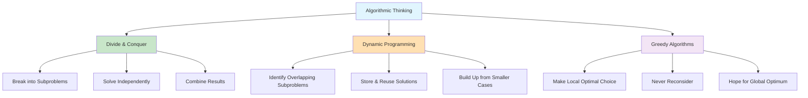
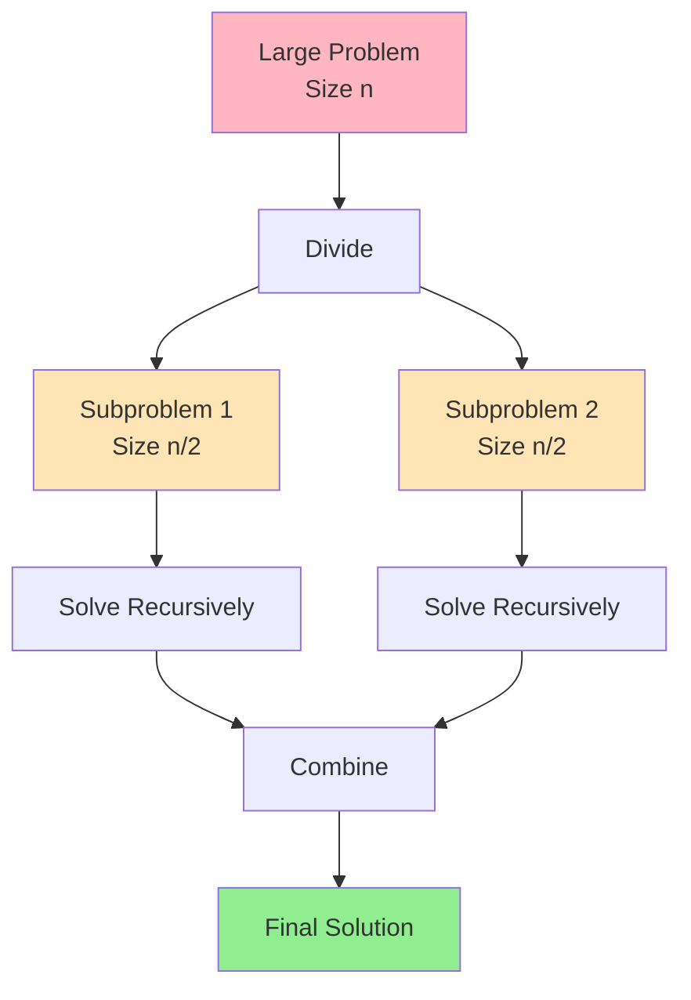
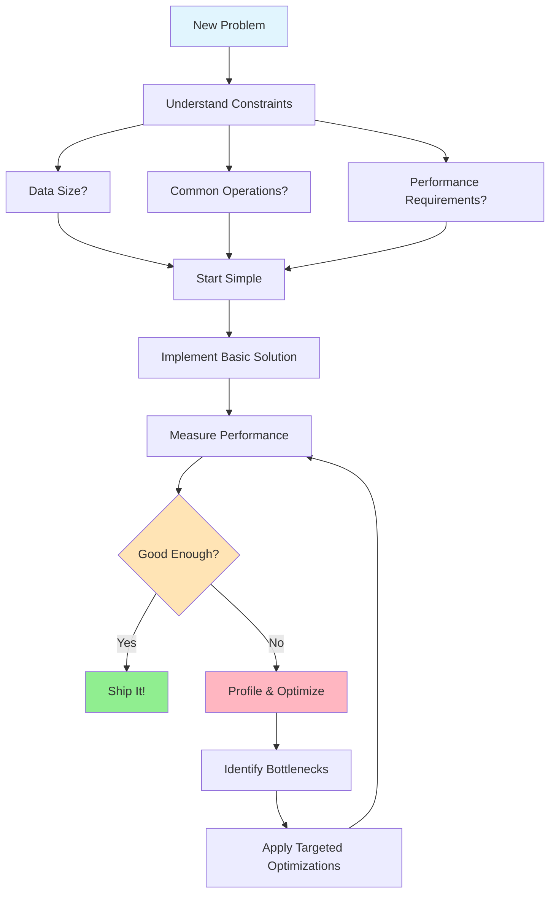
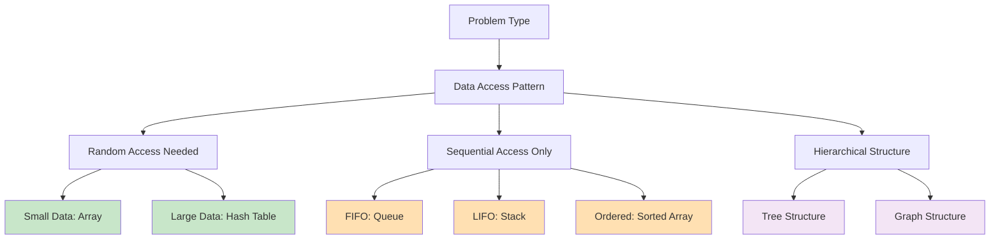

# The Guiding Philosophy: Thinking Like a Computer Scientist

## The Core Mindset: Efficiency Through Design

At its heart, computer science is about solving problems efficiently at scale. The guiding philosophy behind data structures and algorithms can be summed up in one principle:

**Design your solution to minimize the resources needed to solve the problem.**

This means thinking carefully about:
- **Time complexity**: How long does it take to solve the problem?
- **Space complexity**: How much memory does the solution require?
- **Scalability**: How does performance change as the problem size grows?

## The Universal Trade-offs

Every choice in computer science involves trade-offs. Understanding these fundamental tensions will guide your decision-making:

```mermaid
graph TD
    A[Problem to Solve] --> B{Trade-off Decision}
    B --> C[Optimize for Time]
    B --> D[Optimize for Space]
    B --> E[Balance Both]
    
    C --> C1[Hash Tables<br/>More Memory → Faster Lookup]
    C --> C2[Caching<br/>Store Results → Avoid Recomputation]
    
    D --> D1[Compression<br/>CPU Time → Less Storage]
    D --> D2[Streaming<br/>Process One at a Time]
    
    E --> E1[Smart Algorithms<br/>O(n log n) vs O(n²)]
    E --> E2[Lazy Loading<br/>Load When Needed]
    
    style A fill:#E1F5FE
    style C fill:#C8E6C9
    style D fill:#FFE0B2
    style E fill:#F3E5F5
```

### 1. Time vs. Space

**The Trade-off**: You can often make something faster by using more memory, or save memory by accepting slower performance.

**Example**: 
- **Hash Tables**: Use extra memory to store a lookup table, making searches nearly instant
- **Compressed Data**: Use less memory but require time to decompress when needed

**Mental Model**: Think of this like your kitchen. You could pre-cook and store many meals (more space, faster access) or cook fresh each time (less space, more time).

```mermaid
flowchart LR
    subgraph "Time-Optimized Approach"
        A[Hash Table] --> A1[O(1) Lookup]
        A --> A2[More Memory Used]
    end
    
    subgraph "Space-Optimized Approach"
        B[Linear Search] --> B1[O(n) Lookup]
        B --> B2[Minimal Memory]
    end
    
    style A fill:#C8E6C9
    style B fill:#FFE0B2
```

### 2. Simplicity vs. Optimization

**The Trade-off**: Simple solutions are easier to understand and maintain, but optimized solutions perform better.

**Example**:
- **Bubble Sort**: Simple to understand but slow (O(n²))
- **Quick Sort**: More complex but much faster (O(n log n))

**Mental Model**: Like the difference between a simple manual can opener (easy to understand, slow) and an electric can opener (more complex, faster).

### 3. Flexibility vs. Performance

**The Trade-off**: General-purpose solutions work in many situations but specialized solutions work better for specific problems.

**Example**:
- **Arrays**: Fast access but fixed size
- **Dynamic Arrays**: Flexible size but occasionally slow when resizing

**Mental Model**: A Swiss Army knife versus specialized tools. The knife is versatile but a screwdriver is better for screws.

## The Three Pillars of Algorithmic Thinking



### 1. Divide and Conquer

**Philosophy**: Break big problems into smaller, more manageable pieces.

**Examples**:
- **Merge Sort**: Split the array in half, sort each half, then merge
- **Binary Search**: Eliminate half the search space with each comparison
- **Quick Sort**: Pick a pivot and organize smaller/larger elements around it

**Mental Model**: Like organizing a massive pile of papers by first separating them into rough categories, then organizing within each category.



### 2. Dynamic Programming

**Philosophy**: Solve each subproblem once and remember the answer for later use.

**Examples**:
- **Fibonacci Sequence**: Instead of recalculating, store previous results
- **Shortest Path**: Build up the solution using previously calculated paths

**Mental Model**: Like taking notes during a lecture so you don't have to re-learn everything for the exam.

```mermaid
graph TD
    A[Problem F(n)] --> B{Already Solved?}
    B -->|Yes| C[Return Stored Result]
    B -->|No| D[Solve Subproblems]
    
    D --> E[F(n-1)]
    D --> F[F(n-2)]
    
    E --> G[Store Result]
    F --> G
    G --> H[Combine & Return]
    
    style B fill:#E1F5FE
    style C fill:#90EE90
    style G fill:#FFE4B5
```

### 3. Greedy Algorithms

**Philosophy**: Make the locally optimal choice at each step, hoping to reach a global optimum.

**Examples**:
- **Dijkstra's Algorithm**: Always explore the closest unvisited node
- **Huffman Coding**: Always combine the two least frequent characters

**Mental Model**: Like always taking the shortest available route at each intersection when driving, trusting it will lead to the overall shortest path.

## The Big O Philosophy: Thinking About Scale

### Why We Care About Asymptotic Behavior

When choosing between algorithms, we care most about how they behave as the problem size grows very large. This is called **asymptotic analysis**.

**The Philosophy**: An algorithm that works well for small inputs but degrades rapidly with size is often worse than one that's slower for small inputs but scales well.

### Common Growth Patterns

```mermaid
graph LR
    A[O(1)] --> B[O(log n)]
    B --> C[O(n)]
    C --> D[O(n log n)]
    D --> E[O(n²)]
    E --> F[O(2ⁿ)]
    
    style A fill:#90EE90
    style B fill:#90EE90
    style C fill:#FFE4B5
    style D fill:#FFE4B5
    style E fill:#FFB6C1
    style F fill:#FF6B6B
```

**Mental Models for Each**:
- **O(1)**: Like having a GPS that instantly knows your location
- **O(log n)**: Like finding a word in a dictionary by opening to the middle
- **O(n)**: Like reading every page of a book to find a quote
- **O(n log n)**: Like organizing a deck of cards using the "merge sort" method
- **O(n²)**: Like comparing every person in a room with every other person
- **O(2ⁿ)**: Like trying every possible combination of a password

## Design Principles That Guide Our Choices

### 1. Locality of Reference

**Philosophy**: Data that's accessed together should be stored together.

**Why**: Modern computers have memory hierarchies (cache, RAM, disk). Accessing nearby data is much faster than jumping around randomly.

**Applications**:
- **Arrays**: Store elements contiguously for cache-friendly access
- **B-Trees**: Pack many keys into each node to minimize disk reads

### 2. Amortized Analysis

**Philosophy**: An occasional expensive operation is acceptable if the average cost remains low.

**Why**: Sometimes it's worth paying a one-time cost to make future operations faster.

**Applications**:
- **Dynamic Arrays**: Occasionally double in size (expensive) to make most insertions fast
- **Hash Tables**: Occasionally rehash everything to maintain performance

### 3. Immutability When Possible

**Philosophy**: Data that cannot be changed is easier to reason about and share safely.

**Why**: Immutable data structures eliminate many classes of bugs and enable safe concurrent access.

**Applications**:
- **Functional Programming**: Create new versions instead of modifying existing data
- **Copy-on-Write**: Share data until someone needs to modify it

## The Pragmatic Balance

### When to Optimize vs. When to Keep It Simple

**The 80/20 Rule**: 80% of the time, a simple solution is perfectly fine. Focus optimization efforts on the 20% where it really matters.

**Premature Optimization**: Don't optimize until you've identified a real performance problem. Measure first, then optimize.

**The Three Questions**:
1. **Is this a bottleneck?** (Measure performance)
2. **How much complexity does optimization add?** (Consider maintainability)
3. **What's the actual benefit?** (Is the improvement meaningful?)

### Real-World Decision Framework

When choosing between algorithms or data structures:



1. **Understand the problem constraints**
   - How much data?
   - What operations are most common?
   - What are the performance requirements?

2. **Start simple**
   - Choose the simplest solution that might work
   - Measure its performance under realistic conditions

3. **Optimize strategically**
   - Profile to find actual bottlenecks
   - Choose optimizations that provide the biggest impact
   - Maintain simplicity where possible

## The Algorithm Selection Matrix

Different scenarios call for different approaches. Use this matrix to guide your decisions:



This philosophy isn't about memorizing the "best" algorithm for every situation. It's about developing the judgment to make good trade-offs based on your specific constraints and requirements. The goal is to become someone who thinks systematically about efficiency while maintaining the wisdom to know when "good enough" truly is good enough.