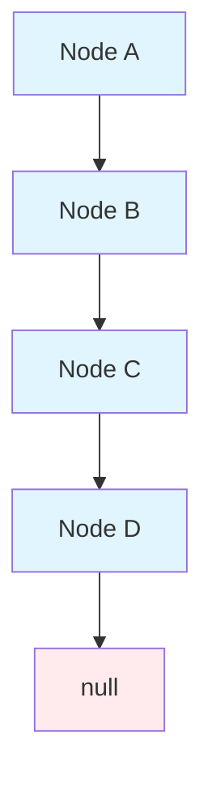

# Key Abstractions: The Building Blocks of Computational Thinking

## The Mental Models That Matter

Understanding data structures and algorithms requires mastering a set of fundamental abstractions—mental models that help you reason about how data flows, how operations compose, and how complexity emerges from simple building blocks.

## Core Data Abstractions

### 1. The Container Abstraction

**Concept**: All data structures are fundamentally containers that hold and organize data.

**Key Properties**:
- **Capacity**: How much data can it hold?
- **Access Pattern**: How do you put data in and get data out?
- **Ordering**: Does the structure maintain any particular arrangement?
- **Uniqueness**: Can the same data appear multiple times?

**Mental Model**: Think of different types of containers in the real world:
- **Array**: A numbered series of boxes on a shelf
- **Stack**: A pile of plates (last in, first out)
- **Queue**: A line at a coffee shop (first in, first out)
- **Set**: A collection of unique items with no duplicates

### 2. The Reference/Pointer Abstraction

**Concept**: Instead of storing data directly, store the "address" or "location" where the data can be found.

**Why This Matters**:
- Enables dynamic memory allocation
- Allows data structures to grow and shrink
- Makes it possible to have multiple references to the same data
- Forms the foundation of linked structures

**Mental Model**: Like having a business card instead of carrying the actual person around. The card tells you where to find them when needed.

### 3. The Tree Abstraction

**Concept**: A hierarchical structure where each element (node) has exactly one parent (except the root) and can have multiple children.

**Key Properties**:
- **Root**: The top-level node with no parent
- **Leaves**: Nodes with no children
- **Height**: The longest path from root to any leaf
- **Depth**: Distance from root to a specific node

**Mental Model**: Family trees, corporate org charts, or the folder structure on your computer.

**Common Tree Types**:
- **Binary Tree**: Each node has at most 2 children
- **Binary Search Tree**: Left child < parent < right child
- **Balanced Tree**: Heights of subtrees differ by at most 1

### 4. The Graph Abstraction

**Concept**: A collection of nodes (vertices) connected by edges, representing relationships between entities.

**Key Properties**:
- **Directed vs. Undirected**: Do connections have direction?
- **Weighted vs. Unweighted**: Do connections have costs/distances?
- **Connected vs. Disconnected**: Can you reach every node from every other node?
- **Cyclic vs. Acyclic**: Are there circular paths?

**Mental Model**: 
- **Social Networks**: People (nodes) connected by friendships (edges)
- **Road Maps**: Cities (nodes) connected by highways (edges)
- **Web Pages**: Pages (nodes) connected by links (edges)

## Algorithmic Abstractions

### 1. The Search Abstraction

**Concept**: Given a collection of data and a target, find whether the target exists and/or where it's located.

**Key Variations**:
- **Linear Search**: Check every element one by one
- **Binary Search**: Eliminate half the possibilities with each comparison
- **Hash-Based Search**: Use a mathematical function to compute the target's location

**Mental Model**: 
- **Linear**: Like looking for your keys by checking every pocket
- **Binary**: Like finding a word in a dictionary by opening to the middle
- **Hash**: Like knowing exactly which shelf holds the book you want

### 2. The Sort Abstraction

**Concept**: Arrange a collection of data in a specific order (typically ascending or descending).

**Key Strategies**:
- **Comparison-Based**: Compare elements and swap them (Bubble, Merge, Quick Sort)
- **Non-Comparison**: Use properties of the data itself (Counting, Radix Sort)

**Mental Model**: 
- **Bubble Sort**: Like slowly bubbling the largest element to the top
- **Merge Sort**: Like sorting two halves of a deck and then merging them
- **Quick Sort**: Like organizing around a "pivot" person in a group photo

### 3. The Traversal Abstraction

**Concept**: Visit every element in a data structure exactly once, in some systematic order.

**Tree Traversal Orders**:
- **Pre-order**: Visit node, then left subtree, then right subtree
- **In-order**: Visit left subtree, then node, then right subtree
- **Post-order**: Visit left subtree, then right subtree, then node
- **Level-order**: Visit all nodes at depth 0, then depth 1, then depth 2, etc.

**Mental Model**: Different ways to explore a building:
- **Pre-order**: Read the room name before entering
- **In-order**: Explore left side, read room name, explore right side
- **Post-order**: Explore everything inside before labeling the room
- **Level-order**: Visit all rooms on floor 1, then floor 2, then floor 3

### 4. The Divide and Conquer Abstraction

**Concept**: Break a large problem into smaller, similar subproblems, solve each recursively, then combine the results.

**Template**:
1. **Base Case**: If the problem is small enough, solve it directly
2. **Divide**: Split the problem into smaller subproblems
3. **Conquer**: Solve each subproblem recursively
4. **Combine**: Merge the subproblem solutions into a final solution

**Mental Model**: Like organizing a massive pile of papers by first sorting them into rough categories, then organizing within each category.

## Complexity Abstractions

### 1. The Big O Abstraction

**Concept**: A mathematical notation for describing how an algorithm's performance scales with input size, focusing on the dominant term.

**Why We Ignore Constants and Lower-Order Terms**:
- For large inputs, the highest-order term dominates everything else
- Constants depend on implementation details and hardware
- We care about the shape of the growth curve, not exact timings

**Mental Model**: Like asking "Is this algorithm fundamentally linear, logarithmic, or quadratic?" rather than "Does it take exactly 2.3 seconds?"

### 2. The Amortized Analysis Abstraction

**Concept**: Some operations might be occasionally expensive, but if the average cost over many operations is low, the data structure is still efficient.

**Example**: Dynamic arrays occasionally need to resize (expensive), but most insertions are fast, making the average cost low.

**Mental Model**: Like a restaurant that's usually fast but occasionally slow when they're training new staff. The average experience is still good.

### 3. The Space-Time Trade-off Abstraction

**Concept**: You can often trade memory for speed or speed for memory, but rarely get both optimally.

**Examples**:
- **Caching**: Use more memory to store computed results for faster access
- **Compression**: Use more CPU time to save memory space
- **Indexes**: Use more storage space to make queries faster

**Mental Model**: Like choosing between a bigger house (more space, higher cost) and a smaller house (less space, lower cost).

## Composition Abstractions

### 1. The Iterator Abstraction

**Concept**: A standardized way to traverse through a collection without exposing its internal structure.

**Key Operations**:
- **next()**: Move to the next element
- **hasNext()**: Check if more elements exist
- **current()**: Get the current element

**Mental Model**: Like having a bookmark that you can move through a book page by page without knowing how the book is bound.

### 2. The Interface Abstraction

**Concept**: Define what operations a data structure supports without specifying how those operations are implemented.

**Example**: A "List" interface might define:
- `add(item)`: Add an item
- `remove(index)`: Remove an item at a position
- `get(index)`: Retrieve an item at a position
- `size()`: Get the number of items

**Mental Model**: Like the controls of a car (steering wheel, pedals, shifter) that work the same way regardless of whether it's a Honda or a Tesla.

### 3. The Generic/Template Abstraction

**Concept**: Write code that works with any data type, not just specific ones.

**Why This Matters**:
- Write the sorting algorithm once, use it for integers, strings, or any comparable type
- Build a binary search tree that can hold any type of data
- Create a hash table that works with any hashable type

**Mental Model**: Like a universal remote control that can work with any TV brand by following the same basic principles.

## Putting It All Together

These abstractions aren't isolated concepts—they compose and interact in powerful ways:

- **A hash table** combines the container abstraction (to hold key-value pairs) with the hash function abstraction (to compute locations quickly)
- **A binary search tree** combines the tree abstraction with the ordering property to enable efficient search
- **Merge sort** combines the divide-and-conquer abstraction with the merge operation to achieve O(n log n) sorting

Understanding these fundamental abstractions gives you a vocabulary for thinking about computational problems and a toolkit for designing efficient solutions. When you encounter a new algorithm or data structure, you can quickly understand it by recognizing which of these abstractions it uses and how they combine.

The goal isn't to memorize these abstractions but to internalize them as natural ways of thinking about data and computation. With practice, you'll start to see these patterns everywhere and use them to reason about new problems and solutions.