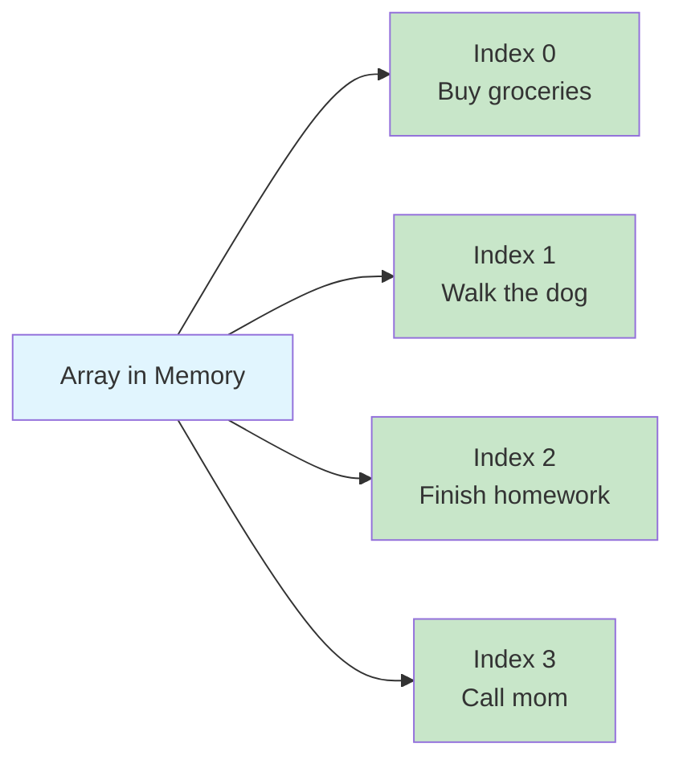
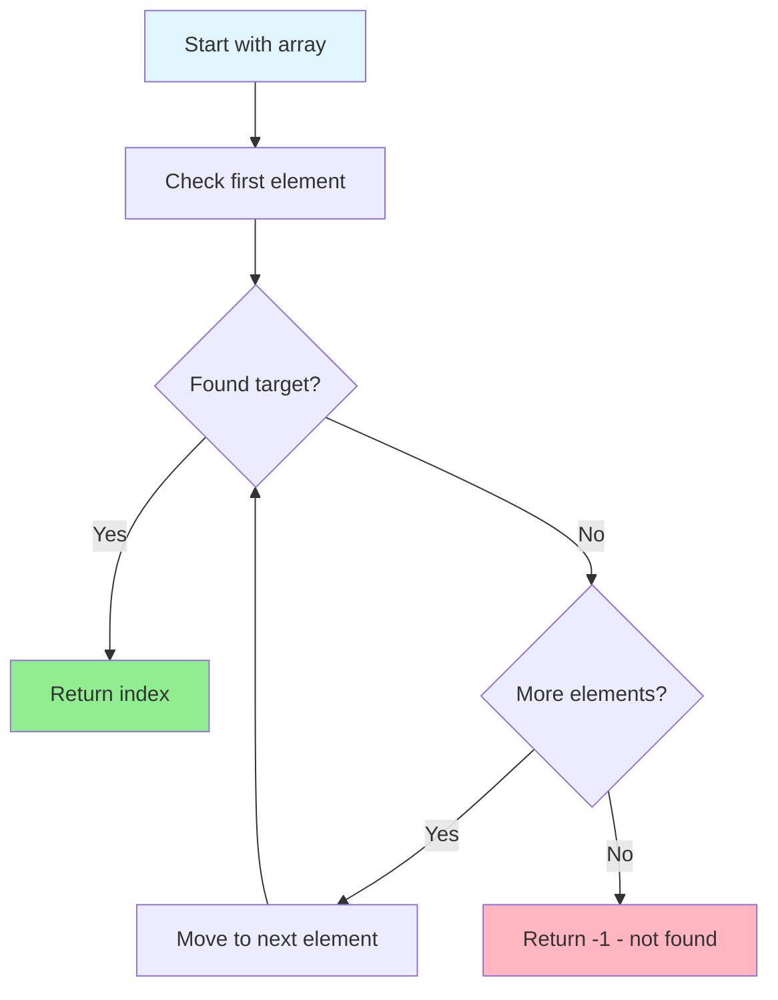
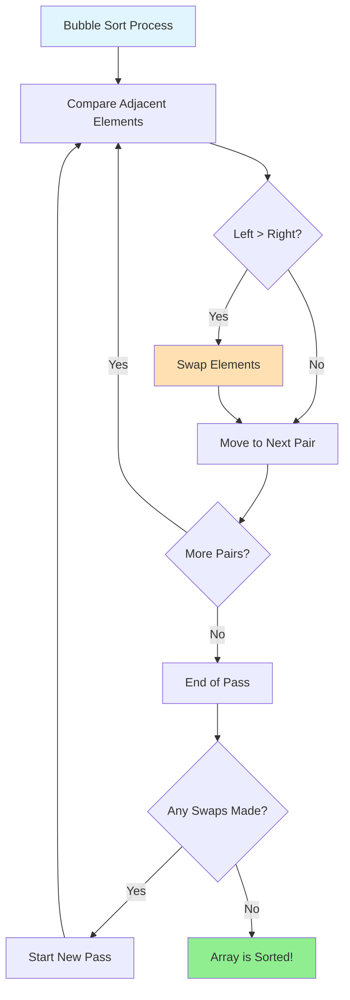
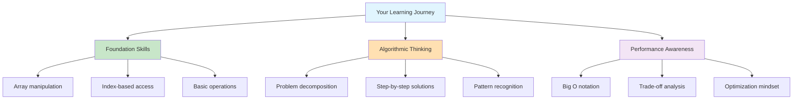

# Getting Started: Your First Data Structures and Algorithms

## Setting Up Your Learning Environment

Before diving into complex algorithms, let's set up a simple environment where you can experiment and learn. We'll use Python for most examples because of its clear syntax, but the concepts apply to any programming language.

### Prerequisites

- Basic programming knowledge in any language
- Understanding of variables, functions, and basic control structures
- A computer with Python installed (or access to an online Python environment)

### Online Environments (No Installation Required)

If you don't have Python installed locally, you can use these online environments:
- [Repl.it](https://replit.com/languages/python3)
- [Python.org Online Console](https://www.python.org/shell/)
- [CodePen](https://codepen.io/) (for JavaScript examples)

## Your First Data Structure: The Array

Let's start with the most fundamental data structure—the array (called a "list" in Python).

### Understanding Arrays Through a Real Example

Imagine you're building a simple to-do list application. You need to store multiple tasks and be able to:
1. Add new tasks
2. Remove completed tasks
3. Find a specific task
4. Show all tasks



**Mental Model**: Think of an array like a row of numbered mailboxes. Each mailbox has an address (index) and can hold one item (element). You can quickly go to any mailbox if you know its number.

```python
# Create an empty to-do list
todo_list = []

# Add some tasks
todo_list.append("Buy groceries")
todo_list.append("Walk the dog")
todo_list.append("Finish homework")
todo_list.append("Call mom")

print("My to-do list:")
for i, task in enumerate(todo_list):
    print(f"{i + 1}. {task}")
```

**Output:**
```
My to-do list:
1. Buy groceries
2. Walk the dog
3. Finish homework
4. Call mom
```

### Basic Array Operations

```python
# Access a specific task by index (0-based)
first_task = todo_list[0]  # "Buy groceries"
print(f"First task: {first_task}")

# Remove a completed task
completed_task = todo_list.pop(1)  # Removes "Walk the dog"
print(f"Completed: {completed_task}")

# Insert a new urgent task at the beginning
todo_list.insert(0, "Reply to urgent email")

# Check if a task exists
if "Call mom" in todo_list:
    print("Don't forget to call mom!")

# Get the number of tasks
print(f"Tasks remaining: {len(todo_list)}")
```

### Performance Characteristics

Understanding how long operations take is crucial:

```mermaid
graph TD
    A[Array Operations] --> B[Fast O(1)]
    A --> C[Slow O(n)]
    
    B --> B1[Access by index<br/>arr[i]]
    B --> B2[Append to end<br/>arr.append(x)]
    B --> B3[Remove from end<br/>arr.pop()]
    
    C --> C1[Insert at beginning<br/>arr.insert(0, x)]
    C --> C2[Remove from middle<br/>arr.pop(i)]
    C --> C3[Search for value<br/>x in arr]
    
    style B fill:#90EE90
    style C fill:#FFB6C1
    style B1 fill:#C8E6C9
    style B2 fill:#C8E6C9
    style B3 fill:#C8E6C9
    style C1 fill:#FFE0B2
    style C2 fill:#FFE0B2
    style C3 fill:#FFE0B2
```

**Why the difference?**
- **Fast operations** work directly with memory addresses
- **Slow operations** require shifting other elements around

```python
import time

def measure_time(operation_name, operation):
    start = time.time()
    operation()
    end = time.time()
    print(f"{operation_name}: {(end - start) * 1000:.4f} milliseconds")

# Create a large list to see performance differences
large_list = list(range(100000))

# Fast operations (O(1) - constant time)
measure_time("Access by index", lambda: large_list[50000])
measure_time("Append to end", lambda: large_list.append(100001))

# Slower operations (O(n) - linear time)
measure_time("Insert at beginning", lambda: large_list.insert(0, -1))
measure_time("Remove from middle", lambda: large_list.pop(50000))
```

## Your First Algorithm: Linear Search

Now let's implement your first algorithm—searching for an item in a list.

### The Problem

You have a list of student names and need to check if a particular student is in your class.



**Mental Model**: Linear search is like looking for a specific book on a shelf by checking each book one by one from left to right until you find it or reach the end.

```python
students = ["Alice", "Bob", "Charlie", "Diana", "Eve", "Frank", "Grace"]

def linear_search(arr, target):
    """
    Search for target in arr, return index if found, -1 if not found.
    This is called 'linear search' because we check each element linearly.
    """
    for i in range(len(arr)):
        if arr[i] == target:
            return i  # Found it! Return the index
    return -1  # Not found

# Test the search
student_to_find = "Diana"
result = linear_search(students, student_to_find)

if result != -1:
    print(f"{student_to_find} found at position {result}")
else:
    print(f"{student_to_find} not found in the class")
```

### Making It More Practical

Let's enhance our search to handle real-world scenarios:

```python
def find_student(students, name, case_sensitive=False):
    """
    Enhanced search with case-insensitive option and better feedback.
    """
    search_name = name if case_sensitive else name.lower()
    
    for i, student in enumerate(students):
        compare_name = student if case_sensitive else student.lower()
        if compare_name == search_name:
            return {
                'found': True,
                'index': i,
                'name': student,
                'message': f"Found {student} at position {i}"
            }
    
    return {
        'found': False,
        'index': -1,
        'name': None,
        'message': f"Student '{name}' not found in the class"
    }

# Test with different cases
test_cases = ["diana", "ALICE", "John", "eve"]

for test_name in test_cases:
    result = find_student(students, test_name, case_sensitive=False)
    print(result['message'])
```

## Your First Sorting Algorithm: Bubble Sort

Sorting is one of the most fundamental algorithmic problems. Let's start with bubble sort—not because it's efficient (it's not!), but because it's easy to understand.

### The Problem

You have a list of test scores and need to sort them from lowest to highest to understand the grade distribution.



**Mental Model**: Bubble sort is like bubbles in a fish tank - lighter bubbles (smaller numbers) gradually float to the top (beginning of array) while heavier bubbles (larger numbers) sink to the bottom (end of array).

```python
def bubble_sort(arr):
    """
    Bubble sort: repeatedly step through the list, compare adjacent elements
    and swap them if they're in the wrong order.
    """
    n = len(arr)
    
    # Make a copy so we don't modify the original
    sorted_arr = arr.copy()
    
    # Track swaps to show the algorithm working
    swaps_made = 0
    
    for i in range(n):
        # Flag to optimize: if no swaps in a pass, we're done
        swapped = False
        
        # Last i elements are already in place
        for j in range(0, n - i - 1):
            # Compare adjacent elements
            if sorted_arr[j] > sorted_arr[j + 1]:
                # Swap them
                sorted_arr[j], sorted_arr[j + 1] = sorted_arr[j + 1], sorted_arr[j]
                swapped = True
                swaps_made += 1
        
        # If no swapping happened, array is sorted
        if not swapped:
            break
    
    return sorted_arr, swaps_made

# Test with some test scores
test_scores = [85, 72, 96, 81, 73, 95, 68, 89, 92, 78]
print(f"Original scores: {test_scores}")

sorted_scores, swaps = bubble_sort(test_scores)
print(f"Sorted scores: {sorted_scores}")
print(f"Number of swaps needed: {swaps}")

# Calculate some statistics
print(f"Lowest score: {sorted_scores[0]}")
print(f"Highest score: {sorted_scores[-1]}")
print(f"Median score: {sorted_scores[len(sorted_scores) // 2]}")
```

### Visualizing the Algorithm

Let's create a simple visualization to see how bubble sort works:

```python
def bubble_sort_with_steps(arr):
    """
    Bubble sort that shows each step of the sorting process.
    """
    n = len(arr)
    working_array = arr.copy()
    
    print(f"Starting array: {working_array}")
    print("-" * 40)
    
    for i in range(n):
        print(f"Pass {i + 1}:")
        swapped = False
        
        for j in range(0, n - i - 1):
            print(f"  Comparing {working_array[j]} and {working_array[j + 1]}")
            
            if working_array[j] > working_array[j + 1]:
                working_array[j], working_array[j + 1] = working_array[j + 1], working_array[j]
                print(f"  → Swapped! Array now: {working_array}")
                swapped = True
            else:
                print(f"  → No swap needed")
        
        if not swapped:
            print(f"  No swaps in this pass - array is sorted!")
            break
        else:
            print(f"End of pass {i + 1}: {working_array}")
        print()
    
    return working_array

# Try it with a small array
small_array = [64, 34, 25, 12, 22, 11, 90]
bubble_sort_with_steps(small_array)
```

## Understanding Performance: Big O Notation in Practice

Let's measure how our algorithms perform with different input sizes:

```mermaid
graph LR
    A[Input Size Growth] --> B[Linear Search O(n)]
    A --> C[Bubble Sort O(n²)]
    A --> D[Built-in Sort O(n log n)]
    
    B --> B1[100 items → 100 steps]
    B --> B2[1000 items → 1000 steps]
    
    C --> C1[100 items → 10,000 steps]
    C --> C2[1000 items → 1,000,000 steps]
    
    D --> D1[100 items → ~664 steps]
    D --> D2[1000 items → ~9,966 steps]
    
    style B fill:#FFE0B2
    style C fill:#FFB6C1
    style D fill:#90EE90
```

**Why this matters**: As your data grows, algorithm choice becomes the difference between instant response and waiting minutes!

```python
import time
import random

def measure_algorithm_performance():
    """
    Compare linear search vs. Python's built-in search
    and bubble sort vs. Python's built-in sort
    """
    sizes = [100, 1000, 5000, 10000]
    
    print("Performance Comparison")
    print("=" * 50)
    
    for size in sizes:
        print(f"\nArray size: {size}")
        
        # Create random data
        data = [random.randint(1, 1000) for _ in range(size)]
        target = random.choice(data)  # Ensure target exists
        
        # Measure linear search
        start = time.time()
        linear_search(data, target)
        linear_time = time.time() - start
        
        # Measure Python's built-in search (optimized)
        start = time.time()
        data.index(target)
        builtin_time = time.time() - start
        
        print(f"Linear search: {linear_time * 1000:.4f} ms")
        print(f"Built-in search: {builtin_time * 1000:.4f} ms")
        
        # For smaller arrays, compare sorting algorithms
        if size <= 1000:  # Bubble sort is too slow for larger arrays
            unsorted_data = data.copy()
            
            # Measure bubble sort
            start = time.time()
            bubble_sort(unsorted_data)
            bubble_time = time.time() - start
            
            # Measure Python's built-in sort
            start = time.time()
            sorted(unsorted_data)
            builtin_sort_time = time.time() - start
            
            print(f"Bubble sort: {bubble_time * 1000:.4f} ms")
            print(f"Built-in sort: {builtin_sort_time * 1000:.4f} ms")

# Run the performance test
measure_algorithm_performance()
```

## Practical Exercise: Building a Simple Phone Book

Let's combine what we've learned to build something practical:

```mermaid
graph TD
    A[Phone Book Application] --> B[Add Contact]
    A --> C[Find Contact]
    A --> D[Remove Contact]
    A --> E[List All Contacts]
    A --> F[Search Contacts]
    
    B --> B1[Use: append() - O(1)]
    C --> C1[Use: linear search - O(n)]
    D --> D1[Use: linear search + pop() - O(n)]
    E --> E1[Use: sort() + iterate - O(n log n)]
    F --> F1[Use: linear search with substring - O(n*m)]
    
    style A fill:#E1F5FE
    style B1 fill:#90EE90
    style C1 fill:#FFE0B2
    style D1 fill:#FFE0B2
    style E1 fill:#FFE0B2
    style F1 fill:#FFB6C1
```

**Real-world insight**: Notice how different operations have different performance characteristics. This teaches us to optimize the most frequent operations first.

```python
class SimplePhoneBook:
    def __init__(self):
        self.contacts = []
    
    def add_contact(self, name, phone):
        """Add a new contact to the phone book."""
        contact = {'name': name, 'phone': phone}
        self.contacts.append(contact)
        print(f"Added {name}: {phone}")
    
    def find_contact(self, name):
        """Find a contact by name (case-insensitive)."""
        for contact in self.contacts:
            if contact['name'].lower() == name.lower():
                return contact
        return None
    
    def remove_contact(self, name):
        """Remove a contact by name."""
        for i, contact in enumerate(self.contacts):
            if contact['name'].lower() == name.lower():
                removed = self.contacts.pop(i)
                print(f"Removed {removed['name']}")
                return True
        print(f"Contact '{name}' not found")
        return False
    
    def list_all_contacts(self):
        """List all contacts in alphabetical order."""
        if not self.contacts:
            print("Phone book is empty")
            return
        
        # Sort contacts by name
        sorted_contacts = sorted(self.contacts, key=lambda x: x['name'].lower())
        
        print("\\nPhone Book:")
        print("-" * 30)
        for contact in sorted_contacts:
            print(f"{contact['name']}: {contact['phone']}")
    
    def search_contacts(self, query):
        """Search for contacts containing the query string."""
        matches = []
        query_lower = query.lower()
        
        for contact in self.contacts:
            if query_lower in contact['name'].lower():
                matches.append(contact)
        
        if matches:
            print(f"\\nFound {len(matches)} match(es) for '{query}':")
            for contact in matches:
                print(f"{contact['name']}: {contact['phone']}")
        else:
            print(f"No contacts found matching '{query}'")

# Test the phone book
phone_book = SimplePhoneBook()

# Add some contacts
phone_book.add_contact("Alice Johnson", "555-0101")
phone_book.add_contact("Bob Smith", "555-0102")
phone_book.add_contact("Charlie Brown", "555-0103")
phone_book.add_contact("Diana Prince", "555-0104")

# List all contacts
phone_book.list_all_contacts()

# Search for a contact
phone_book.search_contacts("alice")

# Find a specific contact
contact = phone_book.find_contact("Bob Smith")
if contact:
    print(f"\\nFound: {contact['name']} - {contact['phone']}")

# Remove a contact
phone_book.remove_contact("Charlie Brown")

# List contacts again to see the change
phone_book.list_all_contacts()
```

## What You've Learned

Congratulations! You've just implemented:

1. **Basic array operations** - the foundation of all data structures
2. **Linear search** - your first algorithm with O(n) time complexity
3. **Bubble sort** - understanding how sorting works (even if it's not efficient)
4. **Performance measurement** - seeing Big O notation in action
5. **A practical application** - combining multiple concepts into a useful program



## Next Steps

You now have the foundation to understand more advanced concepts:

```mermaid
graph TD
    A[Your Next Learning Path] --> B[Better Algorithms]
    A --> C[Better Data Structures]
    A --> D[Advanced Concepts]
    
    B --> B1[Binary Search<br/>O(log n) searching]
    B --> B2[Merge Sort<br/>O(n log n) sorting]
    B --> B3[Quick Sort<br/>O(n log n) sorting]
    
    C --> C1[Hash Tables<br/>O(1) lookup]
    C --> C2[Trees<br/>Hierarchical data]
    C --> C3[Graphs<br/>Complex relationships]
    
    D --> D1[Space-time trade-offs]
    D --> D2[Recursive thinking]
    D --> D3[Dynamic programming]
    
    style A fill:#E1F5FE
    style B fill:#C8E6C9
    style C fill:#FFE0B2
    style D fill:#F3E5F5
```

The key insight is that all complex algorithms and data structures build on these same basic principles:
- **Store data efficiently** 📦
- **Access data quickly** ⚡
- **Understand the trade-offs** ⚖️

**Practice Challenge**: Try modifying the phone book to use a hash table (Python dict) instead of a list. Notice how search becomes O(1) instead of O(n)!

Keep experimenting with these examples, try modifying them, and see what happens. The best way to learn algorithms is to implement them yourself and observe their behavior!