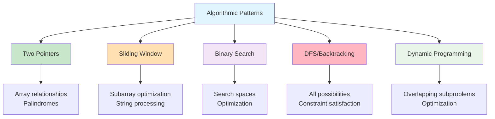
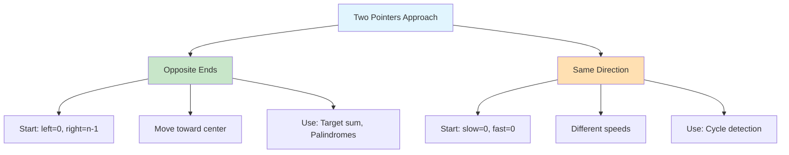
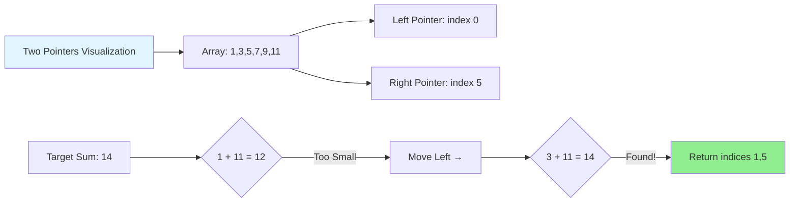
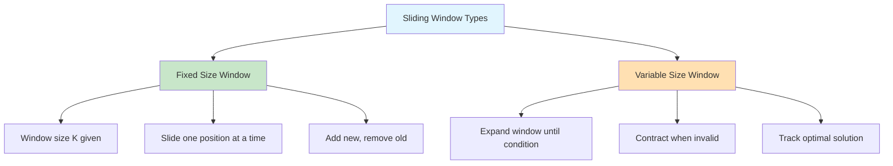
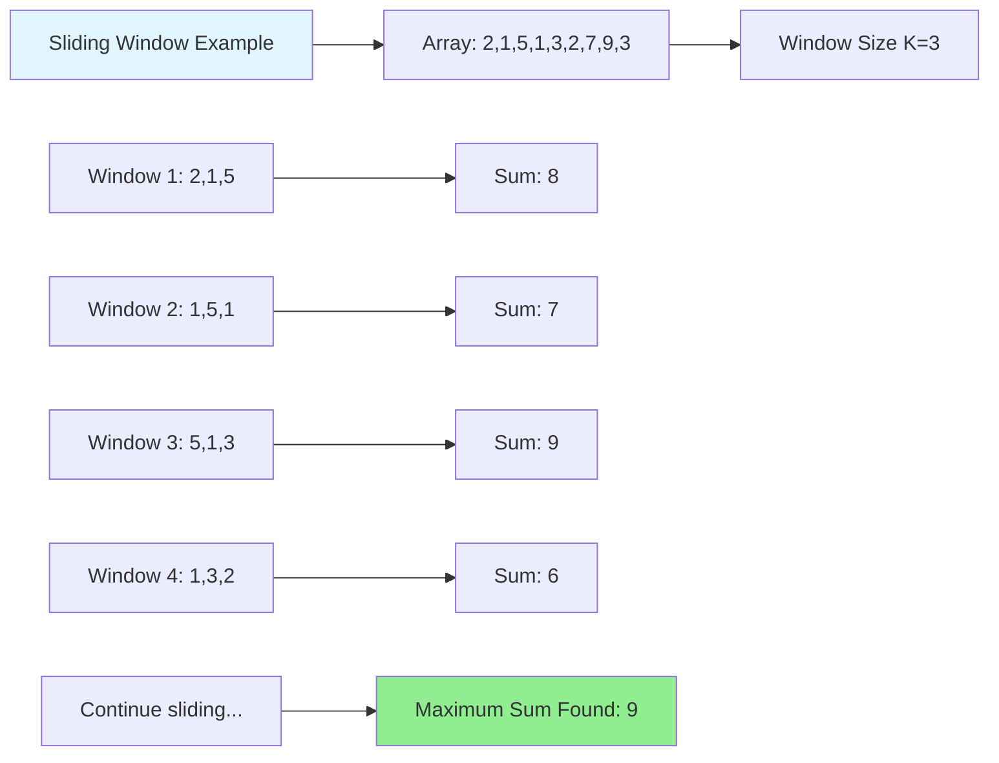
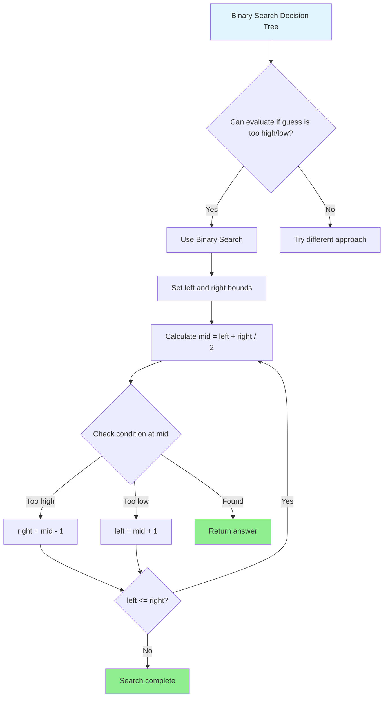
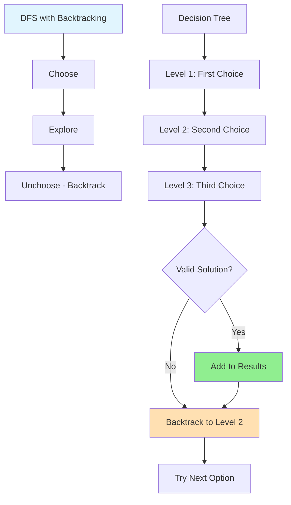
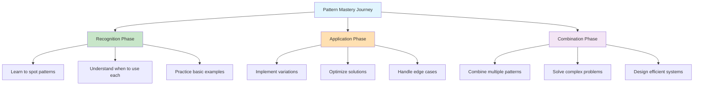
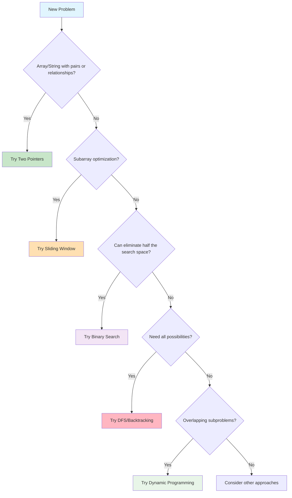

# Essential Patterns: The Fundamental Techniques Every Developer Should Know

## Introduction: Patterns as Problem-Solving Tools

Just as carpenters have essential techniques (measuring twice, cutting once; understanding grain direction), programmers have essential algorithmic patterns. These patterns are reusable solutions to common computational problems.



Master these patterns, and you'll recognize them everywhere—from simple scripts to complex distributed systems.

## Pattern 1: Two Pointers Technique

### The Problem it Solves
When you need to examine pairs of elements or find specific relationships within a sorted array, the two pointers technique is often the most elegant solution.

### How it Works
Use two pointers (indices) that start at different positions and move toward each other or in the same direction, depending on the problem.



**Mental Model**: Think of two pointers like a pair of scissors closing on a piece of paper - they start at opposite ends and work toward the middle, or like two runners on a track where one runs faster than the other.

### Example 1: Finding a Pair that Sums to a Target

```python
def find_pair_with_sum(arr, target):
    """
    Find two numbers in a sorted array that add up to target.
    Returns indices if found, None if not found.
    """
    left = 0
    right = len(arr) - 1
    
    while left < right:
        current_sum = arr[left] + arr[right]
        
        if current_sum == target:
            return (left, right)  # Found the pair!
        elif current_sum < target:
            left += 1  # Need a larger sum, move left pointer right
        else:
            right -= 1  # Need a smaller sum, move right pointer left
    
    return None  # No pair found

# Test it
numbers = [1, 3, 5, 7, 9, 11, 13, 15]
target = 14

result = find_pair_with_sum(numbers, target)
if result:
    left_idx, right_idx = result
    print(f"Found pair: {numbers[left_idx]} + {numbers[right_idx]} = {target}")
    print(f"At indices: {left_idx} and {right_idx}")
else:
    print(f"No pair found that sums to {target}")
```

### Example 2: Checking if a String is a Palindrome

```python
def is_palindrome(s):
    """
    Check if a string reads the same forwards and backwards.
    Ignores spaces and case.
    """
    # Clean the string: remove spaces and convert to lowercase
    cleaned = ''.join(char.lower() for char in s if char.isalnum())
    
    left = 0
    right = len(cleaned) - 1
    
    while left < right:
        if cleaned[left] != cleaned[right]:
            return False
        left += 1
        right -= 1
    
    return True

# Test with various strings
test_strings = [
    "racecar",
    "A man a plan a canal Panama",
    "race a car",
    "hello world",
    "Madam",
    "Was it a car or a cat I saw?"
]

for s in test_strings:
    result = is_palindrome(s)
    print(f"'{s}' is {'a palindrome' if result else 'not a palindrome'}")
```

### When to Use Two Pointers
- Sorted arrays where you need to find pairs or relationships
- Palindrome checking
- Removing duplicates from sorted arrays
- Merging two sorted arrays



## Pattern 2: Sliding Window

### The Problem it Solves
When you need to examine subarrays of a fixed size or find optimal subarrays with certain properties, the sliding window technique maintains a "window" of elements and efficiently slides it across the data.

### How it Works
Maintain a window of elements with two pointers (start and end). Expand or contract the window based on the problem requirements.



**Mental Model**: Think of sliding window like looking through a train window - you see a fixed view of the landscape that continuously changes as the train moves forward.

### Example 1: Maximum Sum of Subarray of Size K

```python
def max_sum_subarray(arr, k):
    """
    Find the maximum sum of any contiguous subarray of size k.
    """
    if len(arr) < k:
        return None
    
    # Calculate sum of first window
    window_sum = sum(arr[:k])
    max_sum = window_sum
    
    # Slide the window: add new element, remove old element
    for i in range(k, len(arr)):
        window_sum = window_sum - arr[i - k] + arr[i]
        max_sum = max(max_sum, window_sum)
    
    return max_sum

# Test it
numbers = [2, 1, 5, 1, 3, 2, 7, 9, 3]
k = 3

result = max_sum_subarray(numbers, k)
print(f"Array: {numbers}")
print(f"Maximum sum of {k} consecutive elements: {result}")

# Let's also show which subarray gives this maximum
def max_sum_subarray_with_indices(arr, k):
    """
    Find the maximum sum subarray and return sum and indices.
    """
    if len(arr) < k:
        return None, None, None
    
    window_sum = sum(arr[:k])
    max_sum = window_sum
    max_start = 0
    
    for i in range(k, len(arr)):
        window_sum = window_sum - arr[i - k] + arr[i]
        if window_sum > max_sum:
            max_sum = window_sum
            max_start = i - k + 1
    
    return max_sum, max_start, max_start + k - 1

max_sum, start_idx, end_idx = max_sum_subarray_with_indices(numbers, k)
if max_sum is not None:
    subarray = numbers[start_idx:end_idx + 1]
    print(f"Maximum subarray: {subarray} (indices {start_idx} to {end_idx})")
```

### Example 2: Longest Substring Without Repeating Characters

```python
def longest_unique_substring(s):
    """
    Find the length of the longest substring without repeating characters.
    """
    if not s:
        return 0
    
    char_index = {}  # Store the last seen index of each character
    left = 0  # Left boundary of current window
    max_length = 0
    
    for right in range(len(s)):
        char = s[right]
        
        # If character was seen before and is within current window
        if char in char_index and char_index[char] >= left:
            left = char_index[char] + 1  # Move left boundary
        
        char_index[char] = right  # Update last seen index
        max_length = max(max_length, right - left + 1)
    
    return max_length

def longest_unique_substring_with_details(s):
    """
    Return both length and the actual substring.
    """
    if not s:
        return 0, ""
    
    char_index = {}
    left = 0
    max_length = 0
    max_start = 0
    
    for right in range(len(s)):
        char = s[right]
        
        if char in char_index and char_index[char] >= left:
            left = char_index[char] + 1
        
        char_index[char] = right
        current_length = right - left + 1
        
        if current_length > max_length:
            max_length = current_length
            max_start = left
    
    return max_length, s[max_start:max_start + max_length]

# Test with various strings
test_strings = ["abcabcbb", "bbbbb", "pwwkew", "dvdf", ""]

for s in test_strings:
    length, substring = longest_unique_substring_with_details(s)
    print(f"String: '{s}'")
    print(f"Longest unique substring: '{substring}' (length: {length})")
    print()
```

### When to Use Sliding Window
- Finding optimal subarrays (maximum/minimum sum, specific properties)
- String problems with contiguous character requirements
- Fixed-size window problems
- Problems where expanding and contracting a range is needed



## Pattern 3: Binary Search Variations

### The Problem it Solves
Binary search isn't just for finding exact matches in sorted arrays. Many problems can be solved by "searching" for the right answer in a space of possibilities.

```mermaid
graph TD
    A[Binary Search Applications] --> B[Traditional Search]
    A --> C[Search for Answer]
    A --> D[Find Boundary]
    
    B --> B1[Exact match in sorted array]
    B --> B2[Time: O(log n)]
    
    C --> C1[Square root calculation]
    C --> C2[Optimization problems]
    
    D --> D1[First/last occurrence]
    D --> D2[Peak element]
    
    style A fill:#E1F5FE
    style B fill:#C8E6C9
    style C fill:#FFE0B2
    style D fill:#F3E5F5
```

**Mental Model**: Binary search is like playing "guess the number" optimally - always guess the middle value and eliminate half the possibilities with each guess.

### Example 1: Finding the Square Root

```python
def find_square_root(n, precision=6):
    """
    Find square root using binary search.
    Returns result with specified decimal precision.
    """
    if n < 0:
        return None
    if n == 0:
        return 0
    
    # For numbers >= 1, square root is between 1 and n
    # For numbers < 1, square root is between n and 1
    if n >= 1:
        left, right = 1, n
    else:
        left, right = n, 1
    
    epsilon = 10 ** (-precision)  # Precision threshold
    
    while right - left > epsilon:
        mid = (left + right) / 2
        square = mid * mid
        
        if square == n:
            return round(mid, precision)
        elif square < n:
            left = mid
        else:
            right = mid
    
    return round((left + right) / 2, precision)

# Test with various numbers
test_numbers = [4, 9, 16, 25, 2, 10, 0.25, 0.64, 100]

for num in test_numbers:
    result = find_square_root(num)
    actual = num ** 0.5
    print(f"√{num} = {result} (actual: {actual:.6f})")
```

### Example 2: Finding Peak Element

```python
def find_peak_element(arr):
    """
    Find a peak element in the array. A peak element is greater than its neighbors.
    If array[i] is a peak, then arr[i] >= arr[i-1] and arr[i] >= arr[i+1].
    """
    if not arr:
        return -1
    
    left, right = 0, len(arr) - 1
    
    while left < right:
        mid = (left + right) // 2
        
        # If mid element is smaller than its next element,
        # then there must be a peak on the right side
        if arr[mid] < arr[mid + 1]:
            left = mid + 1
        else:
            # There must be a peak on the left side (including mid)
            right = mid
    
    return left

# Test with different arrays
test_arrays = [
    [1, 2, 3, 1],
    [1, 2, 1, 3, 5, 6, 4],
    [1, 2, 3, 4, 5],
    [5, 4, 3, 2, 1],
    [1]
]

for arr in test_arrays:
    peak_index = find_peak_element(arr)
    if peak_index != -1:
        print(f"Array: {arr}")
        print(f"Peak element: {arr[peak_index]} at index {peak_index}")
    else:
        print(f"Array: {arr} - No peak found")
    print()
```

### When to Use Binary Search Variations
- Searching in rotated sorted arrays
- Finding minimum/maximum in constrained spaces
- Optimization problems where you can evaluate if a solution is "too high" or "too low"
- Finding boundaries (first/last occurrence of an element)



## Pattern 4: Depth-First Search (DFS) and Backtracking

### The Problem it Solves
When you need to explore all possible paths or combinations, DFS with backtracking systematically tries all possibilities and "backtracks" when a path doesn't work.



**Mental Model**: Think of backtracking like exploring a maze - you try each path, and when you hit a dead end, you return to the last decision point and try a different direction.

### Example 1: Generate All Subsets

```python
def generate_subsets(nums):
    """
    Generate all possible subsets of the given array.
    """
    result = []
    
    def backtrack(start, path):
        # Add current subset to result
        result.append(path[:])  # Make a copy of current path
        
        # Try adding each remaining element
        for i in range(start, len(nums)):
            path.append(nums[i])      # Choose
            backtrack(i + 1, path)    # Explore
            path.pop()                # Unchoose (backtrack)
    
    backtrack(0, [])
    return result

# Test it
numbers = [1, 2, 3]
subsets = generate_subsets(numbers)

print(f"All subsets of {numbers}:")
for i, subset in enumerate(subsets):
    print(f"{i + 1}: {subset}")
```

### Example 2: Solving N-Queens Problem

```python
def solve_n_queens(n):
    """
    Solve the N-Queens problem: place N queens on an NxN chessboard
    so that no two queens attack each other.
    """
    result = []
    board = ['.' * n for _ in range(n)]
    
    def is_safe(row, col):
        # Check if placing queen at (row, col) is safe
        
        # Check column
        for i in range(row):
            if board[i][col] == 'Q':
                return False
        
        # Check diagonal (top-left to bottom-right)
        i, j = row - 1, col - 1
        while i >= 0 and j >= 0:
            if board[i][j] == 'Q':
                return False
            i -= 1
            j -= 1
        
        # Check anti-diagonal (top-right to bottom-left)
        i, j = row - 1, col + 1
        while i >= 0 and j < n:
            if board[i][j] == 'Q':
                return False
            i -= 1
            j += 1
        
        return True
    
    def backtrack(row):
        if row == n:
            # All queens placed successfully
            result.append([''.join(row) for row in board])
            return
        
        for col in range(n):
            if is_safe(row, col):
                # Place queen
                board[row] = board[row][:col] + 'Q' + board[row][col + 1:]
                
                # Recurse to next row
                backtrack(row + 1)
                
                # Remove queen (backtrack)
                board[row] = board[row][:col] + '.' + board[row][col + 1:]
    
    backtrack(0)
    return result

# Solve for 4x4 board
solutions = solve_n_queens(4)
print(f"Number of solutions for 4-Queens: {len(solutions)}")
print("\\nFirst solution:")
for row in solutions[0]:
    print(row)
```

### When to Use DFS/Backtracking
- Generating all combinations/permutations
- Solving puzzles (Sudoku, N-Queens, maze solving)
- Tree/graph traversal
- Finding all paths in a graph

```mermaid
graph TD
    A[Subset Generation Tree for [1,2,3]] --> B[Root: []]
    B --> C[Include 1: [1]]
    B --> D[Exclude 1: []]
    
    C --> E[Include 2: [1,2]]
    C --> F[Exclude 2: [1]]
    D --> G[Include 2: [2]]
    D --> H[Exclude 2: []]
    
    E --> I[Include 3: [1,2,3]]
    E --> J[Exclude 3: [1,2]]
    F --> K[Include 3: [1,3]]
    F --> L[Exclude 3: [1]]
    
    style A fill:#E1F5FE
    style I fill:#90EE90
    style J fill:#90EE90
    style K fill:#90EE90
    style L fill:#90EE90
```

## Pattern 5: Dynamic Programming

### The Problem it Solves
When a problem can be broken down into overlapping subproblems, dynamic programming stores the results of subproblems to avoid redundant calculations.

```mermaid
graph TD
    A[Dynamic Programming] --> B[Top-Down - Memoization]
    A --> C[Bottom-Up - Tabulation]
    
    B --> B1[Recursive approach]
    B --> B2[Store results in cache]
    B --> B3[Check cache before computing]
    
    C --> C1[Iterative approach]
    C --> C2[Build table from small to large]
    C --> C3[Use previous results]
    
    D[Overlapping Subproblems] --> E[Fibonacci: F(n) = F(n-1) + F(n-2)]
    E --> F[F(5) needs F(4) and F(3)]
    E --> G[F(4) also needs F(3)]
    G --> H[F(3) computed twice without DP!]
    
    style A fill:#E1F5FE
    style B fill:#C8E6C9
    style C fill:#FFE0B2
    style H fill:#FFB6C1
```

**Mental Model**: Dynamic Programming is like taking comprehensive notes during class - instead of re-learning everything for each exam, you reference your notes to build on previous knowledge.

### Example 1: Fibonacci with Memoization

```python
def fibonacci_naive(n):
    """
    Naive recursive Fibonacci - very slow for large n due to redundant calculations.
    """
    if n <= 1:
        return n
    return fibonacci_naive(n - 1) + fibonacci_naive(n - 2)

def fibonacci_memoized(n, memo={}):
    """
    Fibonacci with memoization - much faster.
    """
    if n in memo:
        return memo[n]
    
    if n <= 1:
        return n
    
    memo[n] = fibonacci_memoized(n - 1, memo) + fibonacci_memoized(n - 2, memo)
    return memo[n]

def fibonacci_iterative(n):
    """
    Iterative Fibonacci - most efficient for this problem.
    """
    if n <= 1:
        return n
    
    a, b = 0, 1
    for _ in range(2, n + 1):
        a, b = b, a + b
    
    return b

# Compare performance
import time

def time_function(func, n, name):
    start = time.time()
    result = func(n)
    end = time.time()
    print(f"{name}: F({n}) = {result}, Time: {(end - start) * 1000:.2f} ms")
    return result

n = 35
print(f"Computing Fibonacci for n = {n}:")
time_function(fibonacci_iterative, n, "Iterative")
time_function(fibonacci_memoized, n, "Memoized")
# Skip naive version for large n as it's too slow
if n <= 10:
    time_function(fibonacci_naive, n, "Naive")
```

### Example 2: Coin Change Problem

```python
def coin_change(coins, amount):
    """
    Find the minimum number of coins needed to make the given amount.
    Returns -1 if it's impossible.
    """
    # dp[i] = minimum coins needed to make amount i
    dp = [float('inf')] * (amount + 1)
    dp[0] = 0  # 0 coins needed to make amount 0
    
    for i in range(1, amount + 1):
        for coin in coins:
            if coin <= i:
                dp[i] = min(dp[i], dp[i - coin] + 1)
    
    return dp[amount] if dp[amount] != float('inf') else -1

def coin_change_with_path(coins, amount):
    """
    Return both minimum coins and which coins to use.
    """
    dp = [float('inf')] * (amount + 1)
    parent = [-1] * (amount + 1)
    dp[0] = 0
    
    for i in range(1, amount + 1):
        for coin in coins:
            if coin <= i and dp[i - coin] + 1 < dp[i]:
                dp[i] = dp[i - coin] + 1
                parent[i] = coin
    
    if dp[amount] == float('inf'):
        return -1, []
    
    # Reconstruct the solution
    result_coins = []
    current = amount
    while current > 0:
        coin = parent[current]
        result_coins.append(coin)
        current -= coin
    
    return dp[amount], result_coins

# Test with different coin systems
test_cases = [
    ([1, 3, 4], 6),
    ([2], 3),
    ([1, 5, 10, 25], 67),
    ([1, 4, 5], 8)
]

for coins, amount in test_cases:
    min_coins, coin_list = coin_change_with_path(coins, amount)
    print(f"Coins: {coins}, Amount: {amount}")
    if min_coins != -1:
        print(f"Minimum coins: {min_coins}")
        print(f"Coins to use: {coin_list}")
    else:
        print("Impossible to make this amount")
    print()
```

### When to Use Dynamic Programming
- Problems with overlapping subproblems
- Optimization problems (minimum/maximum)
- Counting problems
- Decision problems that can be broken into smaller decisions

```mermaid
graph LR
    A[DP Performance Comparison] --> B[Naive Fibonacci O(2^n)]
    A --> C[Memoized Fibonacci O(n)]
    A --> D[Iterative Fibonacci O(n)]
    
    E[Input Size n=40] --> F[Naive: ~1.7 billion operations]
    E --> G[Optimized: ~40 operations]
    
    H[Time Difference] --> I[Seconds vs Nanoseconds!]
    
    style B fill:#FFB6C1
    style C fill:#90EE90
    style D fill:#90EE90
    style I fill:#FFD700
```

## Putting It All Together: A Practical Example

Let's solve a real-world problem using multiple patterns:

### Problem: Analyzing Web Server Logs

```python
from collections import defaultdict
import re
from datetime import datetime

class LogAnalyzer:
    def __init__(self):
        self.logs = []
        self.ip_counts = defaultdict(int)
        self.status_counts = defaultdict(int)
    
    def parse_log_line(self, line):
        """Parse a common web server log format."""
        # Example: 192.168.1.1 - - [25/Dec/2023:10:00:00 +0000] "GET /index.html HTTP/1.1" 200 1234
        pattern = r'(\\S+) .* \\[(.*?)\\] "(\\S+) (\\S+) .*?" (\\d+) (\\d+)'
        match = re.match(pattern, line)
        
        if match:
            ip, timestamp, method, url, status, size = match.groups()
            return {
                'ip': ip,
                'timestamp': timestamp,
                'method': method,
                'url': url,
                'status': int(status),
                'size': int(size)
            }
        return None
    
    def add_log_entry(self, log_line):
        """Add a log entry and update counters."""
        entry = self.parse_log_line(log_line)
        if entry:
            self.logs.append(entry)
            self.ip_counts[entry['ip']] += 1
            self.status_counts[entry['status']] += 1
    
    def find_top_ips(self, n=5):
        """Find top N IP addresses by request count (using sorting)."""
        # Convert to list and sort by count (descending)
        ip_list = [(ip, count) for ip, count in self.ip_counts.items()]
        ip_list.sort(key=lambda x: x[1], reverse=True)
        return ip_list[:n]
    
    def find_requests_in_time_window(self, start_time, end_time):
        """Find all requests in a time window (using binary search concept)."""
        # For simplicity, assume logs are chronologically ordered
        result = []
        for log in self.logs:
            # In practice, you'd parse the timestamp properly
            if start_time <= log['timestamp'] <= end_time:
                result.append(log)
        return result
    
    def analyze_request_patterns(self):
        """Analyze patterns in requests (using sliding window concept)."""
        url_sequences = defaultdict(int)
        
        # Look at sequences of 3 consecutive requests from same IP
        ip_requests = defaultdict(list)
        for log in self.logs:
            ip_requests[log['ip']].append(log['url'])
        
        for ip, urls in ip_requests.items():
            if len(urls) >= 3:
                for i in range(len(urls) - 2):
                    sequence = tuple(urls[i:i+3])
                    url_sequences[sequence] += 1
        
        return url_sequences
    
    def detect_suspicious_activity(self):
        """Detect potentially suspicious patterns."""
        suspicious = []
        
        # Pattern 1: High request rate from single IP
        for ip, count in self.ip_counts.items():
            if count > 100:  # Threshold
                suspicious.append(f"High request rate from IP {ip}: {count} requests")
        
        # Pattern 2: High error rate
        total_requests = len(self.logs)
        error_requests = sum(1 for log in self.logs if log['status'] >= 400)
        error_rate = error_requests / total_requests if total_requests > 0 else 0
        
        if error_rate > 0.1:  # 10% error rate threshold
            suspicious.append(f"High error rate: {error_rate:.2%}")
        
        return suspicious

# Test the log analyzer
analyzer = LogAnalyzer()

# Sample log entries
sample_logs = [
    '192.168.1.1 - - [25/Dec/2023:10:00:00 +0000] "GET /index.html HTTP/1.1" 200 1234',
    '192.168.1.2 - - [25/Dec/2023:10:00:01 +0000] "GET /about.html HTTP/1.1" 200 5678',
    '192.168.1.1 - - [25/Dec/2023:10:00:02 +0000] "GET /contact.html HTTP/1.1" 200 2345',
    '192.168.1.3 - - [25/Dec/2023:10:00:03 +0000] "GET /index.html HTTP/1.1" 404 0',
    '192.168.1.1 - - [25/Dec/2023:10:00:04 +0000] "GET /products.html HTTP/1.1" 200 3456',
    '192.168.1.2 - - [25/Dec/2023:10:00:05 +0000] "POST /login HTTP/1.1" 500 0',
]

# Add logs to analyzer
for log in sample_logs:
    analyzer.add_log_entry(log)

# Analyze the logs
print("Top IP addresses:")
for ip, count in analyzer.find_top_ips(3):
    print(f"  {ip}: {count} requests")

print("\\nStatus code distribution:")
for status, count in sorted(analyzer.status_counts.items()):
    print(f"  {status}: {count} requests")

print("\\nSuspicious activity:")
for alert in analyzer.detect_suspicious_activity():
    print(f"  {alert}")
```

## Key Takeaways

These patterns are your algorithmic toolkit:



### Pattern Summary:
1. **Two Pointers**: Elegant for array problems with relationships between elements
2. **Sliding Window**: Perfect for subarray problems and string processing
3. **Binary Search**: Not just for searching—think "eliminate half the possibilities"
4. **DFS/Backtracking**: Systematic exploration of all possibilities
5. **Dynamic Programming**: Optimize by remembering previous calculations

### Pattern Recognition Cheat Sheet:



**Practice Strategy:**
1. Start with simple examples of each pattern
2. Recognize when to apply which pattern
3. Combine patterns to solve complex problems
4. Focus on understanding the underlying logic, not memorizing code

The goal isn't to memorize these implementations but to recognize the patterns and adapt them to new problems. Each pattern represents a fundamental way of thinking about computational problems.