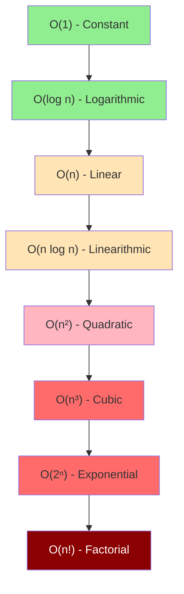
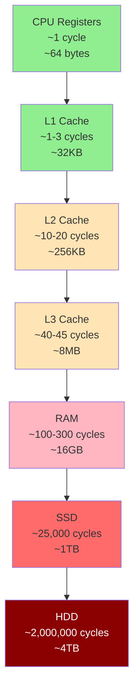
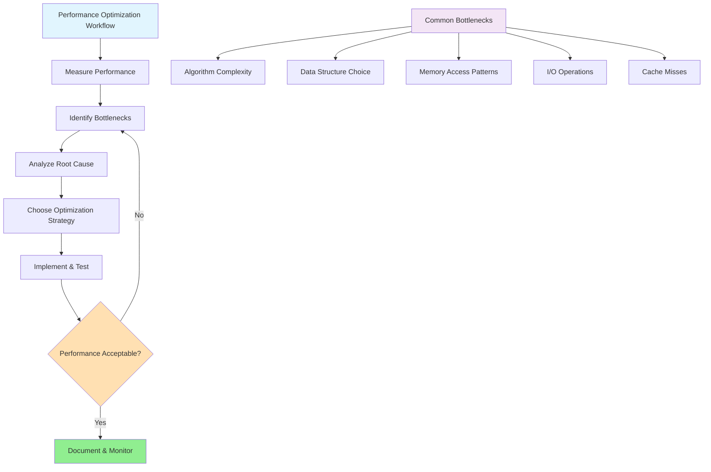
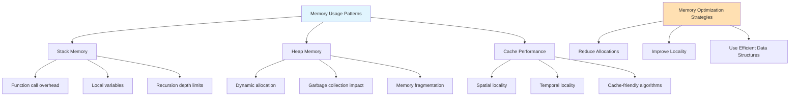
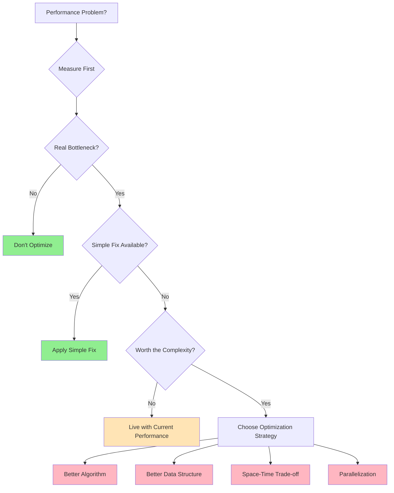

# Deep Dive: Complexity Analysis and Performance Trade-offs

## Introduction: Why Performance Analysis Matters

Imagine you're building a social media platform. Your sorting algorithm works perfectly for 100 users, but what happens when you reach 100 million users? The difference between an O(n²) algorithm and an O(n log n) algorithm isn't academic—it's the difference between a responsive platform and one that crashes under load.

```mermaid
graph LR
    A[100 Users] --> B[O(n²): 10,000 operations]
    A --> C[O(n log n): 664 operations]
    
    D[100 Million Users] --> E[O(n²): 10¹⁶ operations<br/>~316 years at 1GHz]
    D --> F[O(n log n): 2.66×10⁹ operations<br/>~2.66 seconds at 1GHz]
    
    style E fill:#FF6B6B
    style F fill:#90EE90
```

**Real-world impact**: The choice between O(n²) and O(n log n) sorting can mean the difference between 2.66 seconds and 316 years of processing time!

This deep dive explores how to analyze algorithm performance, understand trade-offs, and make informed decisions about optimization.

## Understanding Big O Notation: Beyond the Basics

### The Mathematical Foundation

Big O notation describes the **asymptotic upper bound** of an algorithm's growth rate. It answers the question: "In the worst case, how does performance scale as input size approaches infinity?"

```mermaid
graph TD
    A[Big O Analysis] --> B[Focus on Dominant Term]
    A --> C[Ignore Constants]
    A --> D[Consider Worst Case]
    
    B --> B1[3n² + 5n + 2 → O(n²)]
    B --> B2[n log n + 100n → O(n log n)]
    
    C --> C1[5n → O(n)]
    C --> C2[1000 → O(1)]
    
    D --> D1[Best case: Ω(g(n))]
    D --> D2[Average case: Θ(g(n))]
    D --> D3[Worst case: O(g(n))]
    
    style A fill:#E1F5FE
    style B fill:#C8E6C9
    style C fill:#FFE0B2
    style D fill:#F3E5F5
```

**Formal Definition**: f(n) = O(g(n)) if there exist positive constants c and n₀ such that f(n) ≤ c·g(n) for all n ≥ n₀.

**Practical Translation**: We ignore constants and lower-order terms because they become insignificant for large inputs.

### The Growth Rate Hierarchy



### Concrete Performance Implications

Let's see what these complexities mean in practice:

```mermaid
graph LR
    A[Input Size n] --> B[Performance Impact]
    
    C[n = 1,000] --> D[O(1): 1 operation]
    C --> E[O(log n): 10 operations]
    C --> F[O(n): 1,000 operations]
    C --> G[O(n log n): 10,000 operations]
    C --> H[O(n²): 1,000,000 operations]
    
    I[n = 1,000,000] --> J[O(1): 1 operation]
    I --> K[O(log n): 20 operations]
    I --> L[O(n): 1,000,000 operations]
    I --> M[O(n log n): 20,000,000 operations]
    I --> N[O(n²): 1,000,000,000,000 operations]
    
    style D fill:#90EE90
    style E fill:#90EE90
    style F fill:#FFE4B5
    style G fill:#FFE4B5
    style H fill:#FFB6C1
    style J fill:#90EE90
    style K fill:#90EE90
    style L fill:#FFE4B5
    style M fill:#FFE4B5
    style N fill:#FF6B6B
```

```python
import time
import math

def demonstrate_complexity_differences():
    """
    Show how different complexities perform with various input sizes.
    """
    sizes = [100, 1000, 10000, 100000]
    
    print("Performance comparison for different complexities:")
    print("=" * 60)
    print(f"{'Size':<10} {'O(1)':<10} {'O(log n)':<12} {'O(n)':<12} {'O(n²)':<15}")
    print("-" * 60)
    
    for n in sizes:
        # O(1) - constant time
        constant = 1
        
        # O(log n) - logarithmic time
        logarithmic = math.log2(n)
        
        # O(n) - linear time
        linear = n
        
        # O(n²) - quadratic time
        quadratic = n * n
        
        print(f"{n:<10} {constant:<10} {logarithmic:<12.2f} {linear:<12} {quadratic:<15,}")
    
    print("\\nNotice how quadratic time explodes as input size grows!")

demonstrate_complexity_differences()
```

### Real-World Performance Measurement

```python
import time
import random

class PerformanceMeasurement:
    def __init__(self):
        self.measurements = {}
    
    def time_algorithm(self, algorithm, data, name):
        """Measure execution time of an algorithm."""
        start = time.perf_counter()
        result = algorithm(data)
        end = time.perf_counter()
        
        execution_time = (end - start) * 1000  # Convert to milliseconds
        self.measurements[name] = execution_time
        
        return result, execution_time
    
    def compare_algorithms(self, algorithms, sizes):
        """Compare multiple algorithms across different input sizes."""
        results = {}
        
        for size in sizes:
            print(f"\\nTesting with input size: {size}")
            print("-" * 40)
            
            # Generate random data
            data = [random.randint(1, 1000) for _ in range(size)]
            
            results[size] = {}
            
            for name, algorithm in algorithms.items():
                try:
                    result, exec_time = self.time_algorithm(algorithm, data.copy(), name)
                    results[size][name] = exec_time
                    print(f"{name:<20}: {exec_time:.4f} ms")
                except Exception as e:
                    print(f"{name:<20}: Error - {e}")
                    results[size][name] = float('inf')
        
        return results

# Example sorting algorithms with different complexities
def bubble_sort(arr):
    """O(n²) sorting algorithm."""
    n = len(arr)
    for i in range(n):
        for j in range(0, n - i - 1):
            if arr[j] > arr[j + 1]:
                arr[j], arr[j + 1] = arr[j + 1], arr[j]
    return arr

def merge_sort(arr):
    """O(n log n) sorting algorithm."""
    if len(arr) <= 1:
        return arr
    
    mid = len(arr) // 2
    left = merge_sort(arr[:mid])
    right = merge_sort(arr[mid:])
    
    return merge(left, right)

def merge(left, right):
    """Merge two sorted arrays."""
    result = []
    i = j = 0
    
    while i < len(left) and j < len(right):
        if left[i] <= right[j]:
            result.append(left[i])
            i += 1
        else:
            result.append(right[j])
            j += 1
    
    result.extend(left[i:])
    result.extend(right[j:])
    return result

def builtin_sort(arr):
    """O(n log n) - Python's built-in Timsort."""
    return sorted(arr)

# Compare sorting algorithms
perf = PerformanceMeasurement()
algorithms = {
    "Bubble Sort": bubble_sort,
    "Merge Sort": merge_sort,
    "Built-in Sort": builtin_sort
}

# Test with increasing sizes (note: bubble sort becomes very slow)
sizes = [100, 500, 1000, 2000]
results = perf.compare_algorithms(algorithms, sizes)
```

## Space Complexity: The Often Forgotten Dimension

### Understanding Space-Time Trade-offs

Time complexity isn't the only concern. **Space complexity** measures how much memory an algorithm uses relative to its input size.

```mermaid
graph TD
    A[Space-Time Trade-off Spectrum] --> B[Time Optimized]
    A --> C[Balanced]
    A --> D[Space Optimized]
    
    B --> B1[Hash tables: O(n) space for O(1) lookup]
    B --> B2[Memoization: Store results for speed]
    B --> B3[Precomputed tables: More memory, faster access]
    
    C --> C1[Most practical algorithms]
    C --> C2[Reasonable compromise]
    C --> C3[O(n log n) time, O(log n) space]
    
    D --> D1[In-place algorithms: O(1) space]
    D --> D2[Streaming: Process one element at a time]
    D --> D3[Compression: Trade CPU for memory]
    
    style A fill:#E1F5FE
    style B fill:#FFB6C1
    style C fill:#90EE90
    style D fill:#C8E6C9
```

**Key Insight**: Often you can trade space for time or vice versa, but rarely optimize both simultaneously.

```python
def demonstrate_space_complexity():
    """Show different space complexity patterns."""
    
    # O(1) space - constant space usage
    def sum_array_constant_space(arr):
        """Sum array elements using O(1) extra space."""
        total = 0  # Only one extra variable
        for num in arr:
            total += num
        return total
    
    # O(n) space - linear space usage
    def sum_array_linear_space(arr):
        """Sum array using O(n) extra space (inefficient for demo)."""
        if len(arr) == 0:
            return 0
        if len(arr) == 1:
            return arr[0]
        
        # Create new arrays recursively (using O(n) space)
        return arr[0] + sum_array_linear_space(arr[1:])
    
    # O(log n) space - logarithmic space (typical for divide & conquer)
    def binary_search_recursive(arr, target, left=0, right=None):
        """Binary search using O(log n) space due to recursion stack."""
        if right is None:
            right = len(arr) - 1
        
        if left > right:
            return -1
        
        mid = (left + right) // 2
        if arr[mid] == target:
            return mid
        elif arr[mid] < target:
            return binary_search_recursive(arr, target, mid + 1, right)
        else:
            return binary_search_recursive(arr, target, left, mid - 1)
    
    # Test with sample data
    test_array = list(range(1, 101))
    print("Space Complexity Examples:")
    print(f"Array sum (O(1) space): {sum_array_constant_space(test_array)}")
    print(f"Array sum (O(n) space): {sum_array_linear_space(test_array)}")
    print(f"Binary search (O(log n) space): {binary_search_recursive(test_array, 50)}")

demonstrate_space_complexity()
```

### Memory Hierarchy and Cache Performance

Modern computers have a memory hierarchy that affects real-world performance:



## Amortized Analysis: When Average Case Matters

### Understanding Amortized Complexity

Some operations are occasionally expensive but cheap on average. **Amortized analysis** looks at the average cost over a sequence of operations.

```mermaid
graph TD
    A[Amortized Analysis Types] --> B[Aggregate Method]
    A --> C[Accounting Method]
    A --> D[Potential Method]
    
    B --> B1[Total cost / Number of operations]
    B --> B2[Simple but not always insightful]
    
    C --> C1[Assign charges to operations]
    C --> C2[Expensive operations paid by cheap ones]
    
    D --> D1[Define potential function]
    D --> D2[Mathematical framework]
    
    E[Dynamic Array Example] --> F[Insert: Usually O(1)]
    E --> G[Resize: Occasionally O(n)]
    E --> H[Amortized: O(1)]
    
    style A fill:#E1F5FE
    style E fill:#FFE0B2
    style H fill:#90EE90
```

**Real-world examples**: Dynamic arrays, hash table resizing, splay trees, and many cache implementations use amortized analysis.

```python
class DynamicArray:
    """
    Demonstrate amortized O(1) insertion despite occasional O(n) operations.
    """
    def __init__(self):
        self.capacity = 1
        self.size = 0
        self.data = [None] * self.capacity
        self.resize_count = 0
        self.total_operations = 0
    
    def append(self, item):
        """Add item to end of array."""
        self.total_operations += 1
        
        if self.size >= self.capacity:
            self._resize()
        
        self.data[self.size] = item
        self.size += 1
    
    def _resize(self):
        """Double the capacity (expensive operation)."""
        print(f"Resizing from {self.capacity} to {self.capacity * 2}")
        old_data = self.data
        self.capacity *= 2
        self.data = [None] * self.capacity
        
        # Copy old data (O(n) operation)
        for i in range(self.size):
            self.data[i] = old_data[i]
        
        self.resize_count += 1
    
    def analyze_performance(self):
        """Show amortized performance analysis."""
        print(f"Total operations: {self.total_operations}")
        print(f"Resize operations: {self.resize_count}")
        print(f"Average cost per operation: {self.resize_count / self.total_operations:.4f}")
        print(f"Theoretical amortized cost: O(1)")

# Demonstrate amortized analysis
arr = DynamicArray()
print("Adding 16 elements to dynamic array:")
print("-" * 40)

for i in range(16):
    arr.append(i)

print("\\nAmortized Analysis:")
arr.analyze_performance()
```

### Real-World Example: Hash Table Resizing

```python
class SimpleHashTable:
    """
    Hash table with dynamic resizing to maintain performance.
    """
    def __init__(self, initial_size=8):
        self.size = initial_size
        self.count = 0
        self.buckets = [[] for _ in range(self.size)]
        self.resize_threshold = 0.75  # Resize when 75% full
    
    def _hash(self, key):
        """Simple hash function."""
        return hash(key) % self.size
    
    def put(self, key, value):
        """Insert key-value pair."""
        bucket_index = self._hash(key)
        bucket = self.buckets[bucket_index]
        
        # Check if key already exists
        for i, (k, v) in enumerate(bucket):
            if k == key:
                bucket[i] = (key, value)  # Update existing
                return
        
        # Add new key-value pair
        bucket.append((key, value))
        self.count += 1
        
        # Check if resize is needed
        load_factor = self.count / self.size
        if load_factor > self.resize_threshold:
            self._resize()
    
    def _resize(self):
        """Resize hash table when load factor exceeds threshold."""
        print(f"Resizing hash table from {self.size} to {self.size * 2}")
        
        # Save old buckets
        old_buckets = self.buckets
        
        # Create new, larger table
        self.size *= 2
        self.buckets = [[] for _ in range(self.size)]
        old_count = self.count
        self.count = 0
        
        # Rehash all existing items
        for bucket in old_buckets:
            for key, value in bucket:
                self.put(key, value)
        
        print(f"Rehashed {old_count} items")
    
    def get(self, key):
        """Retrieve value by key."""
        bucket_index = self._hash(key)
        bucket = self.buckets[bucket_index]
        
        for k, v in bucket:
            if k == key:
                return v
        
        raise KeyError(key)
    
    def statistics(self):
        """Show hash table statistics."""
        max_bucket_size = max(len(bucket) for bucket in self.buckets)
        avg_bucket_size = self.count / self.size if self.size > 0 else 0
        
        print(f"Size: {self.size}, Count: {self.count}")
        print(f"Load factor: {self.count / self.size:.2f}")
        print(f"Max bucket size: {max_bucket_size}")
        print(f"Average bucket size: {avg_bucket_size:.2f}")

# Test hash table resizing
ht = SimpleHashTable(initial_size=4)
print("Inserting items into hash table:")
print("-" * 40)

for i in range(20):
    ht.put(f"key_{i}", f"value_{i}")

print("\\nFinal statistics:")
ht.statistics()
```

## Advanced Complexity Scenarios

### Best, Average, and Worst Case Analysis

```mermaid
graph TD
    A[Quicksort Analysis] --> B[Best Case O(n log n)]
    A --> C[Average Case O(n log n)]
    A --> D[Worst Case O(n²)]
    
    B --> B1[Perfect pivot selection]
    B --> B2[Balanced partitions]
    B --> B3[Each partition halves the problem]
    
    C --> C1[Random pivot selection]
    C --> C2[Usually good partitions]
    C --> C3[Mathematically expected behavior]
    
    D --> D1[Worst pivot selection]
    D --> D2[Unbalanced partitions (sorted input)]
    D --> D3[Degrades to O(n²)]
    
    style B fill:#90EE90
    style C fill:#FFE4B5
    style D fill:#FFB6C1
```

**Key Insight**: The same algorithm can have dramatically different performance depending on input characteristics. Understanding this helps you choose the right algorithm for your specific use case.

```python
def quicksort_with_analysis(arr, analysis=None):
    """
    Quicksort with complexity analysis for different cases.
    """
    if analysis is None:
        analysis = {'comparisons': 0, 'swaps': 0}
    
    if len(arr) <= 1:
        return arr, analysis
    
    # Choose pivot (different strategies affect complexity)
    pivot = arr[len(arr) // 2]  # Middle element
    
    left = []
    equal = []
    right = []
    
    for x in arr:
        analysis['comparisons'] += 1
        if x < pivot:
            left.append(x)
        elif x == pivot:
            equal.append(x)
        else:
            right.append(x)
    
    # Recursively sort left and right
    left_sorted, analysis = quicksort_with_analysis(left, analysis)
    right_sorted, analysis = quicksort_with_analysis(right, analysis)
    
    return left_sorted + equal + right_sorted, analysis

def analyze_quicksort_cases():
    """Analyze quicksort performance in different scenarios."""
    test_cases = {
        "Best case (balanced)": list(range(16)),
        "Worst case (sorted)": list(range(16)),
        "Average case (random)": [3, 1, 4, 1, 5, 9, 2, 6, 5, 3, 5, 8, 9, 7, 9, 3]
    }
    
    print("Quicksort Complexity Analysis:")
    print("=" * 50)
    
    for case_name, data in test_cases.items():
        sorted_data, analysis = quicksort_with_analysis(data.copy())
        n = len(data)
        
        print(f"\\n{case_name}:")
        print(f"  Input size (n): {n}")
        print(f"  Comparisons: {analysis['comparisons']}")
        print(f"  Theoretical best: O(n log n) ≈ {n * math.log2(n):.1f}")
        print(f"  Theoretical worst: O(n²) = {n * n}")

analyze_quicksort_cases()
```

### Complexity Classes and Problem Difficulty

```mermaid
graph TD
    A[Computational Complexity Classes] --> B[P - Polynomial Time]
    A --> C[NP - Nondeterministic Polynomial]
    A --> D[NP-Complete]
    A --> E[NP-Hard]
    
    B --> B1[Problems solvable in O(n^k)]
    B --> B2[Examples: Sorting, Searching, Graph traversal]
    B --> B3[Practical algorithms exist]
    
    C --> C1[Verifiable in polynomial time]
    C --> C2[May require exponential time to solve]
    C --> C3[Contains all P problems]
    
    D --> D1[Hardest problems in NP]
    D --> D2[Any NP problem reducible to these]
    D --> D3[Examples: TSP, SAT, Knapsack]
    
    E --> E1[At least as hard as NP-Complete]
    E --> E2[May not be in NP]
    E --> E3[Examples: Halting Problem]
    
    F[P vs NP Question] --> G[P = NP?]
    G --> H[If yes: Encryption breaks]
    G --> I[If no: Current crypto stays secure]
    
    style A fill:#E1F5FE
    style B fill:#90EE90
    style C fill:#FFE4B5
    style D fill:#FFB6C1
    style E fill:#FF6B6B
    style F fill:#FFD700
```

**Practical Implication**: When you encounter an NP-Complete problem, don't waste time looking for a polynomial-time solution—focus on approximation algorithms or heuristics.

## Practical Optimization Strategies

### 1. Algorithm Selection Based on Input Characteristics

```mermaid
flowchart TD
    A[Algorithm Selection Decision Tree] --> B{Input Size?}
    
    B -->|Small n<10| C[Use Simple Algorithm]
    B -->|Medium n<10k| D[Use Standard Algorithm]
    B -->|Large n>10k| E[Use Optimized Algorithm]
    
    C --> C1[Insertion Sort O(n²)]
    C --> C2[Linear Search O(n)]
    C --> C3[Bubble Sort for educational]
    
    D --> D1[Quick Sort O(n log n)]
    D --> D2[Binary Search O(log n)]
    D --> D3[Hash Table O(1) avg]
    
    E --> E1[Timsort O(n log n)]
    E --> E2[Radix Sort O(kn)]
    E --> E3[Specialized data structures]
    
    F{Input Properties?} --> G[Nearly Sorted]
    F --> H[Many Duplicates]
    F --> I[Random Distribution]
    
    G --> G1[Insertion Sort O(n)]
    H --> H1[3-way Quicksort]
    I --> I1[Standard algorithms]
    
    style A fill:#E1F5FE
    style C1 fill:#FFE0B2
    style D1 fill:#90EE90
    style E1 fill:#C8E6C9
```

```python
def smart_sort(arr, analysis=False):
    """
    Choose sorting algorithm based on input characteristics.
    """
    n = len(arr)
    
    if n <= 1:
        return arr
    
    # For very small arrays, insertion sort is fastest
    if n <= 10:
        if analysis:
            print(f"Using insertion sort for small array (n={n})")
        return insertion_sort(arr)
    
    # Check if array is nearly sorted
    inversions = count_inversions(arr)
    if inversions < n // 4:  # Less than 25% inversions
        if analysis:
            print(f"Using insertion sort for nearly sorted array (inversions={inversions})")
        return insertion_sort(arr)
    
    # For larger arrays, use merge sort
    if analysis:
        print(f"Using merge sort for large array (n={n})")
    return merge_sort(arr)

def insertion_sort(arr):
    """O(n²) worst case, O(n) best case for nearly sorted arrays."""
    result = arr.copy()
    for i in range(1, len(result)):
        key = result[i]
        j = i - 1
        while j >= 0 and result[j] > key:
            result[j + 1] = result[j]
            j -= 1
        result[j + 1] = key
    return result

def count_inversions(arr):
    """Count number of inversions (pairs that are out of order)."""
    inversions = 0
    for i in range(len(arr)):
        for j in range(i + 1, len(arr)):
            if arr[i] > arr[j]:
                inversions += 1
    return inversions

# Test smart sorting
test_cases = [
    ([3, 1, 4, 1, 5], "Small array"),
    ([1, 2, 3, 5, 4, 6, 7, 8], "Nearly sorted"),
    ([9, 8, 7, 6, 5, 4, 3, 2, 1, 0] * 10, "Large reverse sorted")
]

for arr, description in test_cases:
    print(f"\\n{description}: {arr[:10]}{'...' if len(arr) > 10 else ''}")
    sorted_arr = smart_sort(arr, analysis=True)
```

### 2. Space-Time Trade-offs in Practice

```mermaid
graph LR
    A[Fibonacci Implementation Spectrum] --> B[Time Priority]
    A --> C[Space Priority]
    
    B --> B1[Memoization<br/>Time: O(n)<br/>Space: O(n)]
    B --> B2[Matrix Exponentiation<br/>Time: O(log n)<br/>Space: O(1)]
    
    C --> C1[Iterative<br/>Time: O(n)<br/>Space: O(1)]
    C --> C2[Tail Recursion<br/>Time: O(n)<br/>Space: O(1)]
    
    D[Naive Recursive<br/>Time: O(2^n)<br/>Space: O(n)] --> E[❌ Poor Choice]
    
    style B1 fill:#FFB6C1
    style B2 fill:#FF6B6B
    style C1 fill:#90EE90
    style C2 fill:#C8E6C9
    style E fill:#FF6B6B
```

```python
class MemoizedFibonacci:
    """Demonstrate space-time trade-off with memoization."""
    
    def __init__(self):
        self.memo = {}
        self.call_count = 0
    
    def fibonacci_recursive(self, n):
        """Standard recursive approach - exponential time."""
        self.call_count += 1
        if n <= 1:
            return n
        return self.fibonacci_recursive(n - 1) + self.fibonacci_recursive(n - 2)
    
    def fibonacci_memoized(self, n):
        """Memoized approach - linear time, linear space."""
        self.call_count += 1
        if n in self.memo:
            return self.memo[n]
        
        if n <= 1:
            result = n
        else:
            result = self.fibonacci_memoized(n - 1) + self.fibonacci_memoized(n - 2)
        
        self.memo[n] = result
        return result
    
    def fibonacci_iterative(self, n):
        """Iterative approach - linear time, constant space."""
        self.call_count += 1
        if n <= 1:
            return n
        
        a, b = 0, 1
        for _ in range(2, n + 1):
            a, b = b, a + b
        
        return b

def compare_fibonacci_approaches():
    """Compare different fibonacci implementations."""
    n = 30
    
    approaches = [
        ("Iterative (O(n) time, O(1) space)", "fibonacci_iterative"),
        ("Memoized (O(n) time, O(n) space)", "fibonacci_memoized"),
        # Skip recursive for large n as it's too slow
    ]
    
    for name, method in approaches:
        fib = MemoizedFibonacci()
        start = time.time()
        result = getattr(fib, method)(n)
        end = time.time()
        
        print(f"{name}:")
        print(f"  Result: {result}")
        print(f"  Time: {(end - start) * 1000:.2f} ms")
        print(f"  Function calls: {fib.call_count}")
        print(f"  Memory used: {'O(n)' if hasattr(fib, 'memo') and fib.memo else 'O(1)'}")
        print()

compare_fibonacci_approaches()
```

## Performance Profiling and Optimization

### 1. Identifying Bottlenecks



**Profiling Tools**: Use language-specific profilers (cProfile for Python, perf for C++, etc.) to identify actual bottlenecks rather than guessing.

```python
import cProfile
import pstats
from functools import wraps

def profile_function(func):
    """Decorator to profile function performance."""
    @wraps(func)
    def wrapper(*args, **kwargs):
        pr = cProfile.Profile()
        pr.enable()
        result = func(*args, **kwargs)
        pr.disable()
        
        # Print profiling results
        stats = pstats.Stats(pr)
        stats.sort_stats('cumulative')
        stats.print_stats(10)  # Top 10 functions
        
        return result
    return wrapper

@profile_function
def inefficient_algorithm():
    """Intentionally inefficient algorithm for demonstration."""
    data = list(range(1000))
    
    # Inefficient: O(n²) when O(n) would suffice
    result = []
    for i in range(len(data)):
        count = 0
        for j in range(len(data)):
            if data[j] <= data[i]:
                count += 1
        result.append(count)
    
    return result

@profile_function
def efficient_algorithm():
    """Efficient version of the same algorithm."""
    data = list(range(1000))
    
    # Create mapping from value to rank
    sorted_unique = sorted(set(data))
    value_to_rank = {v: i + 1 for i, v in enumerate(sorted_unique)}
    
    # O(n) lookup instead of O(n²) counting
    result = [value_to_rank[x] for x in data]
    return result

print("Inefficient algorithm profile:")
inefficient_result = inefficient_algorithm()

print("\\nEfficient algorithm profile:")
efficient_result = efficient_algorithm()

print(f"\\nResults match: {inefficient_result == efficient_result}")
```

### 2. Memory Profiling



**Memory Hierarchy Impact**: Cache-friendly algorithms can be 10-100x faster than cache-unfriendly ones with the same Big O complexity.

```python
import sys

class MemoryProfiler:
    """Simple memory profiler for educational purposes."""
    
    @staticmethod
    def get_size(obj):
        """Get size of object in bytes."""
        size = sys.getsizeof(obj)
        
        # For containers, recursively calculate size
        if isinstance(obj, dict):
            size += sum(MemoryProfiler.get_size(k) + MemoryProfiler.get_size(v) 
                       for k, v in obj.items())
        elif hasattr(obj, '__iter__') and not isinstance(obj, (str, bytes)):
            size += sum(MemoryProfiler.get_size(item) for item in obj)
        
        return size
    
    @staticmethod
    def format_bytes(bytes_count):
        """Format bytes in human readable format."""
        for unit in ['B', 'KB', 'MB', 'GB']:
            if bytes_count < 1024:
                return f"{bytes_count:.2f} {unit}"
            bytes_count /= 1024
        return f"{bytes_count:.2f} TB"

def compare_data_structures():
    """Compare memory usage of different data structures."""
    n = 10000
    
    # List of integers
    int_list = list(range(n))
    
    # Set of integers
    int_set = set(range(n))
    
    # Dictionary with integer keys and values
    int_dict = {i: i for i in range(n)}
    
    # List of strings
    str_list = [str(i) for i in range(n)]
    
    profiler = MemoryProfiler()
    
    print("Memory usage comparison:")
    print("=" * 40)
    print(f"{'Data Structure':<20} {'Size':<15} {'Per Item':<15}")
    print("-" * 40)
    
    for name, obj in [
        ("List of ints", int_list),
        ("Set of ints", int_set),
        ("Dict of ints", int_dict),
        ("List of strings", str_list)
    ]:
        total_size = profiler.get_size(obj)
        per_item = total_size / len(obj)
        
        print(f"{name:<20} {profiler.format_bytes(total_size):<15} "
              f"{profiler.format_bytes(per_item):<15}")

compare_data_structures()
```

## Key Takeaways and Decision Framework

### 1. The Optimization Decision Tree



### 2. Quick Reference: Complexity Cheat Sheet

| Operation | Array | Linked List | Hash Table | Binary Tree | Balanced BST |
|-----------|-------|-------------|------------|-------------|--------------|
| Access    | O(1)  | O(n)       | O(1) avg   | O(n)        | O(log n)     |
| Search    | O(n)  | O(n)       | O(1) avg   | O(n)        | O(log n)     |
| Insert    | O(n)  | O(1)       | O(1) avg   | O(n)        | O(log n)     |
| Delete    | O(n)  | O(1)       | O(1) avg   | O(n)        | O(log n)     |

### 3. Practical Guidelines

```mermaid
flowchart TD
    A[Optimization Decision Framework] --> B{Measured Performance Problem?}
    B -->|No| C[Don't Optimize]
    B -->|Yes| D{Algorithmic Bottleneck?}
    D -->|No| E[Fix External Issues]
    D -->|Yes| F{Significant Benefit?}
    F -->|No| G[Live with Current Performance]
    F -->|Yes| H{Justified Complexity?}
    H -->|No| I[Find Simpler Solution]
    H -->|Yes| J[Implement Optimization]
    
    K[Red Flags to Watch For] --> L[Nested Loops O(n²)]
    K --> M[Linear Search in Hot Path]
    K --> N[Naive Recursion]
    K --> O[Unnecessary Copying]
    K --> P[Poor Cache Locality]
    
    style C fill:#90EE90
    style E fill:#FFE0B2
    style G fill:#FFE0B2
    style I fill:#FFE0B2
    style J fill:#C8E6C9
    style K fill:#FFB6C1
```

### The Performance Optimization Hierarchy

```mermaid
graph TD
    A[Performance Impact Hierarchy] --> B[Algorithm Choice - 1000x]
    A --> C[Data Structure Choice - 100x]
    A --> D[Implementation Details - 10x]
    A --> E[Micro-optimizations - 2x]
    
    B --> B1[O(n²) → O(n log n)]
    B --> B2[O(2ⁿ) → O(n)]
    
    C --> C1[Array → Hash Table]
    C --> C2[List → Set for membership]
    
    D --> D1[Cache-friendly access patterns]
    D --> D2[Reduce memory allocations]
    
    E --> E1[Loop unrolling]
    E --> E2[Compiler optimizations]
    
    style B fill:#FF6B6B
    style C fill:#FFB6C1
    style D fill:#FFE0B2
    style E fill:#90EE90
```

**When to Optimize:**
- ✅ Measured performance problem exists
- ✅ The bottleneck is algorithmically fundamental  
- ✅ The optimization provides significant benefit
- ✅ The complexity increase is justified

**When NOT to Optimize:**
- ❌ No measured performance problem
- ❌ Premature optimization
- ❌ Marginal gains for significant complexity
- ❌ External factors (network, disk) dominate

**Key Insight**: Focus optimization efforts on algorithm and data structure choices first—they provide the biggest impact with the least implementation complexity.

The goal isn't to optimize everything, but to understand when optimization matters and how to do it effectively. Master these concepts, and you'll make better architectural decisions that scale gracefully from prototype to production.