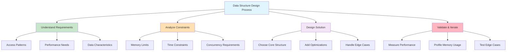
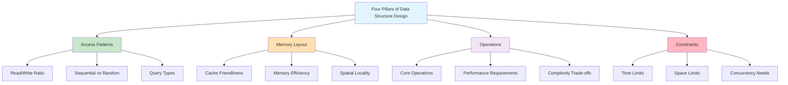
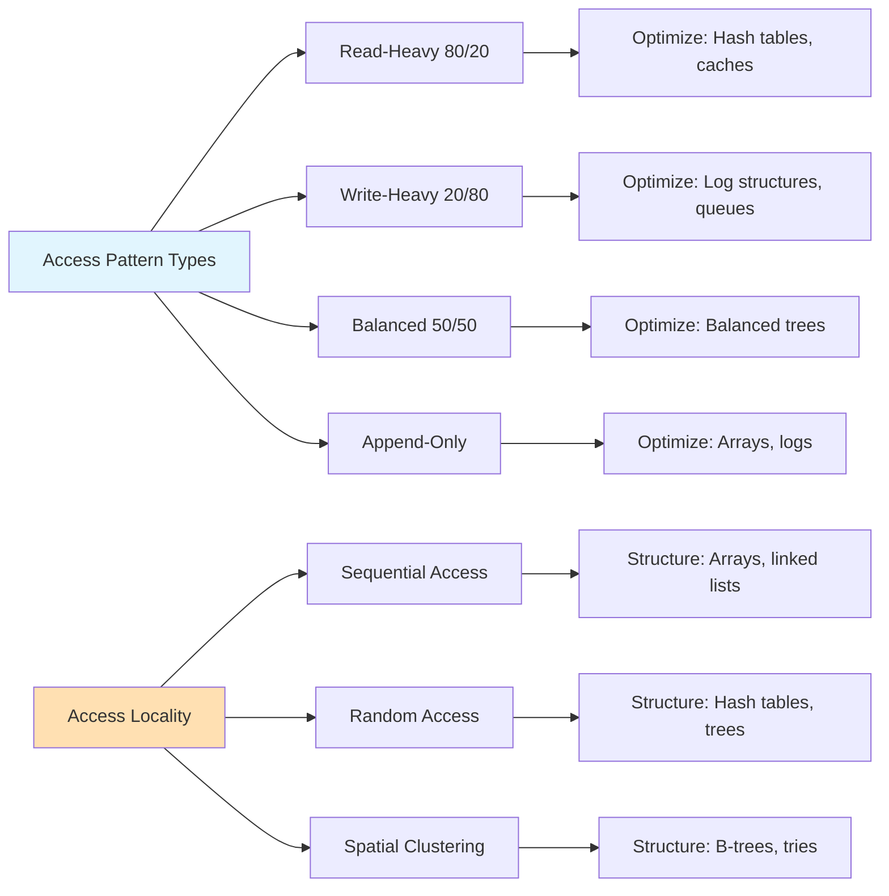
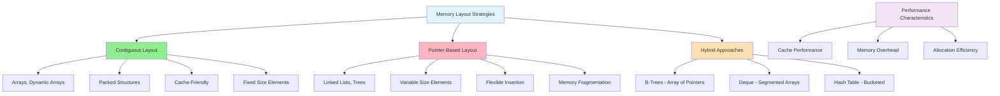
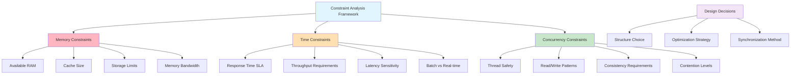

# Deep Dive: Data Structure Design Principles and Trade-offs

## Introduction: The Art of Data Structure Design

Designing data structures is like architecting a building. You need to understand the intended use patterns, performance requirements, and constraints before choosing your approach. A warehouse has different requirements than a skyscraper, just as a cache has different requirements than a database index.



**Key Insight**: The "best" data structure is always context-dependent. A solution optimized for one use case may be terrible for another.

This deep dive explores the fundamental principles behind data structure design and how to make informed trade-offs based on your specific requirements.

## The Four Pillars of Data Structure Design



### 1. Access Patterns: How Will Data Be Used?

The most critical factor in data structure design is understanding how your data will be accessed. Different patterns call for different optimizations.



```python
class AccessPatternAnalyzer:
    \"\"\"
    Analyze different access patterns and their implications.
    \"\"\"
    
    def __init__(self):
        self.operations = []
    
    def log_operation(self, operation, key=None, success=True):
        \"\"\"Log an operation for pattern analysis.\"\"\"
        self.operations.append({
            'operation': operation,
            'key': key,
            'success': success,
            'timestamp': len(self.operations)
        })
    
    def analyze_patterns(self):
        \"\"\"Analyze access patterns and suggest optimizations.\"\"\"
        if not self.operations:
            return \"No operations to analyze\"
        
        # Count operation types
        op_counts = {}
        for op in self.operations:
            op_counts[op['operation']] = op_counts.get(op['operation'], 0) + 1
        
        total_ops = len(self.operations)
        
        print(\"Access Pattern Analysis:\")
        print(\"=\" * 30)
        
        for op_type, count in sorted(op_counts.items()):
            percentage = (count / total_ops) * 100
            print(f\"{op_type:<10}: {count:>4} operations ({percentage:>5.1f}%)\")
        
        # Provide recommendations
        print(\"\\nRecommendations:\")
        
        if op_counts.get('read', 0) > op_counts.get('write', 0) * 3:
            print(\"- Read-heavy workload: Consider caching or read-optimized structures\")
        
        if op_counts.get('write', 0) > op_counts.get('read', 0) * 2:
            print(\"- Write-heavy workload: Consider write-optimized structures\")
        
        if op_counts.get('search', 0) > total_ops * 0.5:
            print(\"- Search-heavy workload: Consider hash tables or indexed structures\")
        
        if op_counts.get('range_query', 0) > 0:
            print(\"- Range queries present: Consider sorted structures (B-trees, sorted arrays)\")

# Simulate different workloads
def simulate_workload(name, operations):
    \"\"\"Simulate a workload and analyze its patterns.\"\"\"
    analyzer = AccessPatternAnalyzer()
    
    print(f\"\\nSimulating {name} workload:\")
    print(\"-\" * 40)
    
    for op in operations:
        analyzer.log_operation(op['type'], op.get('key'))
    
    analyzer.analyze_patterns()

# Different workload patterns
workloads = {
    \"Cache\": [
        {'type': 'read'} for _ in range(80)
    ] + [
        {'type': 'write'} for _ in range(20)
    ],
    
    \"Logger\": [
        {'type': 'write'} for _ in range(90)
    ] + [
        {'type': 'read'} for _ in range(10)
    ],
    
    \"Database Index\": [
        {'type': 'search'} for _ in range(60)
    ] + [
        {'type': 'range_query'} for _ in range(25)
    ] + [
        {'type': 'write'} for _ in range(15)
    ]
}

for workload_name, operations in workloads.items():
    simulate_workload(workload_name, operations)
```

### 2. Memory Layout: Cache-Friendly vs. Flexibility

Understanding how modern computer memory works is crucial for performance-critical data structures.



**Cache Performance Impact**: Array-based structures can be 10-100x faster than pointer-based structures for sequential access due to cache locality.

```python
import time
import random

class MemoryLayoutComparison:
    \"\"\"
    Compare array-based vs. pointer-based data structures.
    \"\"\"
    
    def __init__(self, size):
        self.size = size
        
        # Array-based: all data in contiguous memory
        self.array_data = list(range(size))
        
        # Linked structure: data scattered in memory
        self.linked_data = self._create_linked_structure(size)
    
    def _create_linked_structure(self, size):
        \"\"\"Create a linked list structure.\"\"\"
        class Node:
            def __init__(self, value):
                self.value = value
                self.next = None
        
        if size == 0:
            return None
        
        head = Node(0)
        current = head
        
        for i in range(1, size):
            current.next = Node(i)
            current = current.next
        
        return head
    
    def benchmark_sequential_access(self):
        \"\"\"Compare sequential access patterns.\"\"\"
        print(f\"Sequential access benchmark (n={self.size}):\")\n        \n        # Array access (cache-friendly)\n        start = time.perf_counter()\n        total = 0\n        for value in self.array_data:\n            total += value\n        array_time = time.perf_counter() - start\n        \n        # Linked list access (cache-unfriendly)\n        start = time.perf_counter()\n        total = 0\n        current = self.linked_data\n        while current:\n            total += current.value\n            current = current.next\n        linked_time = time.perf_counter() - start\n        \n        print(f\"Array access:      {array_time * 1000:.3f} ms\")\n        print(f\"Linked access:     {linked_time * 1000:.3f} ms\")\n        print(f\"Speedup factor:    {linked_time / array_time:.1f}x\")\n    \n    def benchmark_random_access(self):\n        \"\"\"Compare random access patterns.\"\"\"        \n        print(f\"\\nRandom access benchmark (n={self.size}):\")\n        \n        indices = [random.randint(0, self.size - 1) for _ in range(1000)]\n        \n        # Array random access (O(1))\n        start = time.perf_counter()\n        for idx in indices:\n            value = self.array_data[idx]\n        array_time = time.perf_counter() - start\n        \n        # Linked list random access (O(n))\n        start = time.perf_counter()\n        for idx in indices:\n            current = self.linked_data\n            for _ in range(idx):\n                current = current.next\n            value = current.value\n        linked_time = time.perf_counter() - start\n        \n        print(f\"Array access:      {array_time * 1000:.3f} ms\")\n        print(f\"Linked access:     {linked_time * 1000:.3f} ms\")\n        print(f\"Speedup factor:    {linked_time / array_time:.1f}x\")\n\n# Test with different sizes\nfor size in [1000, 10000]:\n    print(f\"\\n{'='*50}\")\n    print(f\"Testing with {size} elements\")\n    print(f\"{'='*50}\")\n    \n    comparison = MemoryLayoutComparison(size)\n    comparison.benchmark_sequential_access()\n    comparison.benchmark_random_access()\n```

### 3. Operations: The Core Functionality

Different data structures excel at different operations. Understanding this helps you choose the right tool for the job.

```mermaid
graph TD
    A[Operation Performance Matrix] --> B[Search Operations]
    A --> C[Insert Operations]
    A --> D[Delete Operations]
    A --> E[Update Operations]
    
    B --> B1[Hash Table: O(1) avg]
    B --> B2[Balanced Tree: O(log n)]
    B --> B3[Array: O(n)]
    B --> B4[Sorted Array: O(log n)]
    
    C --> C1[Array End: O(1)]
    C --> C2[Array Middle: O(n)]
    C --> C3[Linked List: O(1) at position]
    C --> C4[Hash Table: O(1) avg]
    
    D --> D1[Array End: O(1)]
    D --> D2[Array Middle: O(n)]
    D --> D3[Hash Table: O(1) avg]
    D --> D4[Tree: O(log n)]
    
    E --> E1[Array: O(1) by index]
    E --> E2[Hash Table: O(1) by key]
    E --> E3[Tree: O(log n) by key]
    
    style A fill:#E1F5FE
    style B1 fill:#90EE90
    style C1 fill:#90EE90
    style D1 fill:#90EE90
    style E1 fill:#90EE90
```

**Key Insight**: No single data structure is optimal for all operations. Choose based on your most frequent operations.

```python\nclass DataStructureOperations:\n    \"\"\"    Compare how different data structures handle various operations.\n    \"\"\"\n    \n    def __init__(self, data_size=1000):\n        self.data_size = data_size\n        self.setup_structures()\n    \n    def setup_structures(self):\n        \"\"\"Initialize different data structures with same data.\"\"\"        \n        import bisect\n        \n        # Sample data\n        data = list(range(self.data_size))\n        random.shuffle(data)\n        \n        # Different structures\n        self.structures = {\n            'list': data.copy(),\n            'set': set(data),\n            'dict': {v: v for v in data},\n            'sorted_list': sorted(data)\n        }\n    \n    def benchmark_operation(self, operation_name, operations):\n        \"\"\"Benchmark an operation across all structures.\"\"\"        \n        print(f\"\\n{operation_name} Performance:\")\n        print(\"-\" * 40)\n        \n        for struct_name, operation_func in operations.items():\n            if struct_name in self.structures:\n                start = time.perf_counter()\n                \n                try:\n                    result = operation_func(self.structures[struct_name])\n                    elapsed = time.perf_counter() - start\n                    print(f\"{struct_name:<12}: {elapsed * 1000:>8.3f} ms\")\n                except Exception as e:\n                    print(f\"{struct_name:<12}: {str(e):<20}\")\n    \n    def test_search_operations(self):\n        \"\"\"Test search performance across structures.\"\"\"        \n        target = self.data_size // 2\n        \n        search_operations = {\n            'list': lambda lst: target in lst,\n            'set': lambda s: target in s,\n            'dict': lambda d: target in d,\n            'sorted_list': lambda lst: self._binary_search(lst, target)\n        }\n        \n        self.benchmark_operation(\"Search\", search_operations)\n    \n    def test_insert_operations(self):\n        \"\"\"Test insertion performance.\"\"\"        \n        new_value = self.data_size + 1\n        \n        insert_operations = {\n            'list': lambda lst: lst.append(new_value),\n            'set': lambda s: s.add(new_value),\n            'dict': lambda d: d.update({new_value: new_value}),\n            'sorted_list': lambda lst: bisect.insort(lst, new_value)\n        }\n        \n        self.benchmark_operation(\"Insert\", insert_operations)\n    \n    def test_delete_operations(self):\n        \"\"\"Test deletion performance.\"\"\"        \n        target = next(iter(self.structures['list']))  # Get first element\n        \n        delete_operations = {\n            'list': lambda lst: lst.remove(target) if target in lst else None,\n            'set': lambda s: s.discard(target),\n            'dict': lambda d: d.pop(target, None),\n            'sorted_list': lambda lst: lst.remove(target) if target in lst else None\n        }\n        \n        self.benchmark_operation(\"Delete\", delete_operations)\n    \n    def _binary_search(self, lst, target):\n        \"\"\"Binary search implementation.\"\"\"        \n        left, right = 0, len(lst) - 1\n        \n        while left <= right:\n            mid = (left + right) // 2\n            if lst[mid] == target:\n                return True\n            elif lst[mid] < target:\n                left = mid + 1\n            else:\n                right = mid - 1\n        \n        return False\n\n# Run comprehensive benchmark\nprint(\"Data Structure Operations Benchmark\")\nprint(\"=\"*50)\n\nbenchmark = DataStructureOperations(10000)\nbenchmark.test_search_operations()\nbenchmark.test_insert_operations()\nbenchmark.test_delete_operations()\n```\n\n### 4. Constraints: Memory, Time, and Concurrency



**Real-world Constraint Examples:**
- **Mobile App**: Memory-constrained, battery-aware
- **High-Frequency Trading**: Ultra-low latency, high throughput
- **Web Server**: High concurrency, moderate memory
- **Embedded System**: Severe memory limits, real-time requirements\n\n```python\nclass ConstraintAnalysis:\n    \"\"\"    Analyze how different constraints affect data structure choice.\n    \"\"\"\n    \n    def memory_constrained_scenario(self):\n        \"\"\"Scenario: Limited memory, need space-efficient structure.\"\"\"        \n        print(\"Memory-Constrained Scenario:\")\n        print(\"- Available memory: Very limited\")\n        print(\"- Operations: Mostly reads, occasional writes\")\n        print(\"- Data: Sparse (many gaps in key space)\\n\")\n        \n        # Compare memory usage of different approaches\n        n = 1000000  # Large sparse key space\n        actual_data = {i * 100: f\"value_{i}\" for i in range(1000)}  # Only 1000 actual items\n        \n        # Approach 1: Dense array (memory inefficient for sparse data)\n        try:\n            dense_array = [None] * n\n            for key, value in actual_data.items():\n                if key < n:\n                    dense_array[key] = value\n            dense_memory = sys.getsizeof(dense_array)\n        except MemoryError:\n            dense_memory = float('inf')\n        \n        # Approach 2: Hash table (memory efficient for sparse data)\n        hash_table = actual_data.copy()\n        hash_memory = sum(sys.getsizeof(k) + sys.getsizeof(v) for k, v in hash_table.items())\n        hash_memory += sys.getsizeof(hash_table)\n        \n        # Approach 3: Sorted list of tuples (very memory efficient)\n        sorted_pairs = sorted(actual_data.items())\n        sorted_memory = sys.getsizeof(sorted_pairs) + sum(sys.getsizeof(pair) for pair in sorted_pairs)\n        \n        print(f\"Dense array memory:  {self._format_bytes(dense_memory) if dense_memory != float('inf') else 'Too large'}\")\n        print(f\"Hash table memory:   {self._format_bytes(hash_memory)}\")\n        print(f\"Sorted pairs memory: {self._format_bytes(sorted_memory)}\")\n        print(f\"\\nRecommendation: {'Hash table' if hash_memory < sorted_memory else 'Sorted pairs'} for sparse data\")\n    \n    def time_constrained_scenario(self):\n        \"\"\"Scenario: Need very fast operations, memory is abundant.\"\"\"        \n        print(\"\\n\\nTime-Constrained Scenario:\")\n        print(\"- Available memory: Abundant\")\n        print(\"- Requirement: Sub-millisecond response time\")\n        print(\"- Operations: Frequent lookups, rare updates\\n\")\n        \n        # Compare lookup times\n        data = {i: f\"value_{i}\" for i in range(10000)}\n        \n        structures = {\n            \"Hash Table\": data,\n            \"Sorted List\": sorted(data.items()),\n            \"Array (if keys are dense)\": [f\"value_{i}\" for i in range(10000)]\n        }\n        \n        # Simulate lookups\n        lookup_key = 5000\n        \n        for name, structure in structures.items():\n            if isinstance(structure, dict):\n                start = time.perf_counter()\n                result = structure.get(lookup_key)\n                elapsed = time.perf_counter() - start\n            elif isinstance(structure, list) and all(isinstance(x, tuple) for x in structure[:3]):\n                # Sorted list of tuples - binary search\n                start = time.perf_counter()\n                result = self._binary_search_tuples(structure, lookup_key)\n                elapsed = time.perf_counter() - start\n            else:\n                # Dense array\n                start = time.perf_counter()\n                result = structure[lookup_key] if lookup_key < len(structure) else None\n                elapsed = time.perf_counter() - start\n            \n            print(f\"{name:<25}: {elapsed * 1000000:>8.2f} μs\")\n        \n        print(\"\\nRecommendation: Hash table for fastest average-case lookups\")\n    \n    def concurrent_scenario(self):\n        \"\"\"Scenario: Multiple threads accessing data structure.\"\"\"        \n        print(\"\\n\\nConcurrent Access Scenario:\")\n        print(\"- Multiple threads: Yes\")\n        print(\"- Read/Write ratio: 80/20\")\n        print(\"- Consistency requirement: Eventually consistent\\n\")\n        \n        considerations = [\n            \"Thread-safety mechanisms:\",\n            \"  - Locks: Simple but can become bottleneck\",\n            \"  - Lock-free: Complex but higher performance\",\n            \"  - Copy-on-write: Good for read-heavy workloads\",\n            \"\\nRecommendation: Copy-on-write for read-heavy concurrent access\"\n        ]\n        \n        for consideration in considerations:\n            print(consideration)\n    \n    def _binary_search_tuples(self, sorted_pairs, target):\n        \"\"\"Binary search in sorted list of tuples.\"\"\"        \n        left, right = 0, len(sorted_pairs) - 1\n        \n        while left <= right:\n            mid = (left + right) // 2\n            key, value = sorted_pairs[mid]\n            \n            if key == target:\n                return value\n            elif key < target:\n                left = mid + 1\n            else:\n                right = mid - 1\n        \n        return None\n    \n    def _format_bytes(self, bytes_count):\n        \"\"\"Format bytes in human readable format.\"\"\"        \n        for unit in ['B', 'KB', 'MB', 'GB']:\n            if bytes_count < 1024:\n                return f\"{bytes_count:.2f} {unit}\"\n            bytes_count /= 1024\n        return f\"{bytes_count:.2f} TB\"\n\n# Analyze different constraint scenarios\nanalysis = ConstraintAnalysis()\nanalysis.memory_constrained_scenario()\nanalysis.time_constrained_scenario()\nanalysis.concurrent_scenario()\n```\n\n## Design Patterns in Data Structures\n\n### 1. The Caching Pattern\n\n```python\nclass LRUCache:\n    \"\"\"    Implement an LRU (Least Recently Used) cache using design principles.\n    \"\"\"\n    \n    def __init__(self, capacity):\n        self.capacity = capacity\n        self.cache = {}  # Hash table for O(1) access\n        \n        # Doubly linked list for O(1) insertion/deletion\n        self.head = self.Node(0, 0)\n        self.tail = self.Node(0, 0)\n        self.head.next = self.tail\n        self.tail.prev = self.head\n    \n    class Node:\n        def __init__(self, key, value):\n            self.key = key\n            self.value = value\n            self.prev = None\n            self.next = None\n    \n    def get(self, key):\n        \"\"\"Get value and mark as recently used.\"\"\"        \n        if key in self.cache:\n            node = self.cache[key]\n            # Move to front (mark as recently used)\n            self._remove_node(node)\n            self._add_to_front(node)\n            return node.value\n        return -1\n    \n    def put(self, key, value):\n        \"\"\"Put value and handle capacity.\"\"\"        \n        if key in self.cache:\n            # Update existing\n            node = self.cache[key]\n            node.value = value\n            self._remove_node(node)\n            self._add_to_front(node)\n        else:\n            # Add new\n            if len(self.cache) >= self.capacity:\n                # Remove least recently used (tail)\n                lru = self.tail.prev\n                self._remove_node(lru)\n                del self.cache[lru.key]\n            \n            # Add new node to front\n            new_node = self.Node(key, value)\n            self.cache[key] = new_node\n            self._add_to_front(new_node)\n    \n    def _remove_node(self, node):\n        \"\"\"Remove node from linked list.\"\"\"        \n        node.prev.next = node.next\n        node.next.prev = node.prev\n    \n    def _add_to_front(self, node):\n        \"\"\"Add node right after head.\"\"\"        \n        node.prev = self.head\n        node.next = self.head.next\n        self.head.next.prev = node\n        self.head.next = node\n    \n    def display_state(self):\n        \"\"\"Display current cache state for debugging.\"\"\"        \n        print(f\"Cache capacity: {self.capacity}, Current size: {len(self.cache)}\")\n        \n        # Show order from most to least recently used\n        current = self.head.next\n        order = []\n        while current != self.tail:\n            order.append(f\"{current.key}:{current.value}\")\n            current = current.next\n        \n        print(f\"Order (MRU -> LRU): {' -> '.join(order)}\")\n\n# Test LRU Cache\nprint(\"LRU Cache Example:\")\nprint(\"=\" * 30)\n\ncache = LRUCache(3)\n\n# Demonstrate cache behavior\noperations = [\n    ('put', 1, 'A'),\n    ('put', 2, 'B'),\n    ('put', 3, 'C'),\n    ('get', 2, None),     # Access B, making it most recent\n    ('put', 4, 'D'),     # Should evict A (least recent)\n    ('get', 1, None),    # Should return -1 (not found)\n    ('get', 3, None),    # Should return C\n    ('put', 5, 'E'),     # Should evict something\n]\n\nfor op in operations:\n    if op[0] == 'put':\n        cache.put(op[1], op[2])\n        print(f\"PUT {op[1]}:{op[2]}\")\n    else:\n        result = cache.get(op[1])\n        print(f\"GET {op[1]} -> {result}\")\n    \n    cache.display_state()\n    print()\n```\n\n### 2. The Composite Pattern: Trees\n\n```python\nclass TreeNode:\n    \"\"\"    Generic tree node that can represent various tree-based structures.\n    \"\"\"\n    \n    def __init__(self, value):\n        self.value = value\n        self.children = []\n        self.parent = None\n    \n    def add_child(self, child):\n        \"\"\"Add a child node.\"\"\"        \n        child.parent = self\n        self.children.append(child)\n    \n    def remove_child(self, child):\n        \"\"\"Remove a child node.\"\"\"        \n        if child in self.children:\n            child.parent = None\n            self.children.remove(child)\n    \n    def depth_first_traversal(self, visit_func):\n        \"\"\"Traverse tree in depth-first order.\"\"\"        \n        visit_func(self)\n        for child in self.children:\n            child.depth_first_traversal(visit_func)\n    \n    def breadth_first_traversal(self, visit_func):\n        \"\"\"Traverse tree in breadth-first order.\"\"\"        \n        from collections import deque\n        \n        queue = deque([self])\n        \n        while queue:\n            node = queue.popleft()\n            visit_func(node)\n            queue.extend(node.children)\n    \n    def find_path_to(self, target_value):\n        \"\"\"Find path from this node to target value.\"\"\"        \n        if self.value == target_value:\n            return [self.value]\n        \n        for child in self.children:\n            path = child.find_path_to(target_value)\n            if path:\n                return [self.value] + path\n        \n        return None\n    \n    def calculate_metrics(self):\n        \"\"\"Calculate tree metrics.\"\"\"        \n        def calculate_depth(node, current_depth=0):\n            if not node.children:\n                return current_depth\n            return max(calculate_depth(child, current_depth + 1) for child in node.children)\n        \n        def count_nodes(node):\n            return 1 + sum(count_nodes(child) for child in node.children)\n        \n        return {\n            'depth': calculate_depth(self),\n            'total_nodes': count_nodes(self),\n            'leaf_nodes': len([1 for child in self._get_all_nodes() if not child.children])\n        }\n    \n    def _get_all_nodes(self):\n        \"\"\"Get all nodes in subtree.\"\"\"        \n        nodes = [self]\n        for child in self.children:\n            nodes.extend(child._get_all_nodes())\n        return nodes\n\n# Build a sample tree\nprint(\"Tree Structure Example:\")\nprint(\"=\" * 30)\n\n# Create organizational hierarchy\nroot = TreeNode(\"CEO\")\n\n# Add departments\nvp_eng = TreeNode(\"VP Engineering\")\nvp_sales = TreeNode(\"VP Sales\")\nvp_marketing = TreeNode(\"VP Marketing\")\n\nroot.add_child(vp_eng)\nroot.add_child(vp_sales)\nroot.add_child(vp_marketing)\n\n# Add teams under engineering\nfrontend_lead = TreeNode(\"Frontend Lead\")\nbackend_lead = TreeNode(\"Backend Lead\")\ndevops_lead = TreeNode(\"DevOps Lead\")\n\nvp_eng.add_child(frontend_lead)\nvp_eng.add_child(backend_lead)\nvp_eng.add_child(devops_lead)\n\n# Add individual contributors\nfrontend_lead.add_child(TreeNode(\"Frontend Dev 1\"))\nfrontend_lead.add_child(TreeNode(\"Frontend Dev 2\"))\nbackend_lead.add_child(TreeNode(\"Backend Dev 1\"))\nbackend_lead.add_child(TreeNode(\"Backend Dev 2\"))\nbackend_lead.add_child(TreeNode(\"Backend Dev 3\"))\n\n# Demonstrate tree operations\nprint(\"Depth-First Traversal:\")\nroot.depth_first_traversal(lambda node: print(f\"  {node.value}\"))\n\nprint(\"\\nBreadth-First Traversal:\")\nroot.breadth_first_traversal(lambda node: print(f\"  {node.value}\"))\n\nprint(\"\\nPath to Backend Dev 2:\")\npath = root.find_path_to(\"Backend Dev 2\")\nprint(f\"  {' -> '.join(path)}\")\n\nprint(\"\\nTree Metrics:\")\nmetrics = root.calculate_metrics()\nfor metric, value in metrics.items():\n    print(f\"  {metric}: {value}\")\n```\n\n### 3. The Strategy Pattern: Pluggable Algorithms\n\n```python\nclass SortingStrategy:\n    \"\"\"    Demonstrate strategy pattern for different sorting algorithms.\n    \"\"\"\n    \n    def __init__(self):\n        self.strategies = {\n            'bubble': self._bubble_sort,\n            'merge': self._merge_sort,\n            'quick': self._quick_sort,\n            'insertion': self._insertion_sort\n        }\n    \n    def sort(self, data, strategy='merge', analyze=False):\n        \"\"\"Sort data using specified strategy.\"\"\"        \n        if strategy not in self.strategies:\n            raise ValueError(f\"Unknown strategy: {strategy}\")\n        \n        if analyze:\n            start = time.perf_counter()\n            result = self.strategies[strategy](data.copy())\n            elapsed = time.perf_counter() - start\n            return result, elapsed\n        else:\n            return self.strategies[strategy](data.copy())\n    \n    def _bubble_sort(self, arr):\n        \"\"\"O(n²) - Good for small arrays or nearly sorted data.\"\"\"        \n        n = len(arr)\n        for i in range(n):\n            swapped = False\n            for j in range(0, n - i - 1):\n                if arr[j] > arr[j + 1]:\n                    arr[j], arr[j + 1] = arr[j + 1], arr[j]\n                    swapped = True\n            if not swapped:\n                break\n        return arr\n    \n    def _insertion_sort(self, arr):\n        \"\"\"O(n²) - Excellent for small arrays and nearly sorted data.\"\"\"        \n        for i in range(1, len(arr)):\n            key = arr[i]\n            j = i - 1\n            while j >= 0 and arr[j] > key:\n                arr[j + 1] = arr[j]\n                j -= 1\n            arr[j + 1] = key\n        return arr\n    \n    def _merge_sort(self, arr):\n        \"\"\"O(n log n) - Stable, predictable performance.\"\"\"        \n        if len(arr) <= 1:\n            return arr\n        \n        mid = len(arr) // 2\n        left = self._merge_sort(arr[:mid])\n        right = self._merge_sort(arr[mid:])\n        \n        return self._merge(left, right)\n    \n    def _merge(self, left, right):\n        \"\"\"Merge two sorted arrays.\"\"\"        \n        result = []\n        i = j = 0\n        \n        while i < len(left) and j < len(right):\n            if left[i] <= right[j]:\n                result.append(left[i])\n                i += 1\n            else:\n                result.append(right[j])\n                j += 1\n        \n        result.extend(left[i:])\n        result.extend(right[j:])\n        return result\n    \n    def _quick_sort(self, arr):\n        \"\"\"O(n log n) average - Fast in practice, cache-friendly.\"\"\"        \n        if len(arr) <= 1:\n            return arr\n        \n        pivot = arr[len(arr) // 2]\n        left = [x for x in arr if x < pivot]\n        middle = [x for x in arr if x == pivot]\n        right = [x for x in arr if x > pivot]\n        \n        return self._quick_sort(left) + middle + self._quick_sort(right)\n    \n    def choose_best_strategy(self, data_characteristics):\n        \"\"\"Choose optimal sorting strategy based on data characteristics.\"\"\"        \n        size = data_characteristics.get('size', 0)\n        nearly_sorted = data_characteristics.get('nearly_sorted', False)\n        stability_required = data_characteristics.get('stability_required', False)\n        memory_constrained = data_characteristics.get('memory_constrained', False)\n        \n        if size <= 10:\n            return 'insertion'  # Best for very small arrays\n        elif nearly_sorted:\n            return 'insertion'  # Best for nearly sorted data\n        elif stability_required:\n            return 'merge'      # Stable sort\n        elif memory_constrained:\n            return 'quick'      # In-place sorting\n        else:\n            return 'merge'      # Generally reliable choice\n\n# Test sorting strategies\nsorter = SortingStrategy()\n\n# Test with different data patterns\ntest_data = {\n    'Random': [random.randint(1, 100) for _ in range(50)],\n    'Nearly Sorted': list(range(48)) + [25, 30],\n    'Reverse Sorted': list(range(50, 0, -1)),\n    'All Same': [42] * 50\n}\n\nprint(\"Sorting Strategy Performance:\")\nprint(\"=\" * 40)\n\nfor data_name, data in test_data.items():\n    print(f\"\\n{data_name} data ({len(data)} elements):\")\n    \n    # Test different strategies\n    for strategy in ['bubble', 'insertion', 'merge', 'quick']:\n        try:\n            result, elapsed = sorter.sort(data, strategy, analyze=True)\n            print(f\"  {strategy:<10}: {elapsed * 1000:>6.2f} ms\")\n        except Exception as e:\n            print(f\"  {strategy:<10}: Error - {e}\")\n    \n    # Get recommendation\n    characteristics = {\n        'size': len(data),\n        'nearly_sorted': data_name == 'Nearly Sorted',\n        'stability_required': False,\n        'memory_constrained': False\n    }\n    \n    recommended = sorter.choose_best_strategy(characteristics)\n    print(f\"  Recommended: {recommended}\")\n```\n\n## Advanced Design Considerations\n\n### 1. Designing for Scale\n\n```python\nclass ScalableDataStructure:\n    \"\"\"    Example of designing data structures that scale gracefully.\n    \"\"\"\n    \n    def __init__(self, initial_capacity=8, load_factor_threshold=0.75):\n        self.capacity = initial_capacity\n        self.size = 0\n        self.load_factor_threshold = load_factor_threshold\n        self.buckets = [[] for _ in range(self.capacity)]\n        self.resize_count = 0\n    \n    def _hash(self, key):\n        return hash(key) % self.capacity\n    \n    def _should_resize(self):\n        return (self.size / self.capacity) > self.load_factor_threshold\n    \n    def _resize(self):\n        \"\"\"Resize to maintain performance characteristics.\"\"\"        \n        print(f\"Resizing from {self.capacity} to {self.capacity * 2} (load factor: {self.size/self.capacity:.2f})\")\n        \n        old_buckets = self.buckets\n        old_capacity = self.capacity\n        \n        self.capacity *= 2\n        self.buckets = [[] for _ in range(self.capacity)]\n        old_size = self.size\n        self.size = 0\n        self.resize_count += 1\n        \n        # Rehash all existing items\n        for bucket in old_buckets:\n            for key, value in bucket:\n                self._insert_without_resize(key, value)\n        \n        print(f\"Rehashed {old_size} items into {self.capacity} buckets\")\n    \n    def _insert_without_resize(self, key, value):\n        \"\"\"Insert without triggering resize (used during resize).\"\"\"        \n        bucket_index = self._hash(key)\n        bucket = self.buckets[bucket_index]\n        \n        for i, (k, v) in enumerate(bucket):\n            if k == key:\n                bucket[i] = (key, value)\n                return\n        \n        bucket.append((key, value))\n        self.size += 1\n    \n    def put(self, key, value):\n        \"\"\"Insert key-value pair with automatic resizing.\"\"\"        \n        if self._should_resize():\n            self._resize()\n        \n        self._insert_without_resize(key, value)\n    \n    def get(self, key):\n        \"\"\"Retrieve value by key.\"\"\"        \n        bucket_index = self._hash(key)\n        bucket = self.buckets[bucket_index]\n        \n        for k, v in bucket:\n            if k == key:\n                return v\n        \n        raise KeyError(key)\n    \n    def performance_metrics(self):\n        \"\"\"Get performance metrics.\"\"\"        \n        bucket_sizes = [len(bucket) for bucket in self.buckets]\n        \n        return {\n            'size': self.size,\n            'capacity': self.capacity,\n            'load_factor': self.size / self.capacity,\n            'resize_count': self.resize_count,\n            'max_bucket_size': max(bucket_sizes),\n            'avg_bucket_size': sum(bucket_sizes) / len(bucket_sizes),\n            'empty_buckets': bucket_sizes.count(0)\n        }\n\n# Test scalable hash table\nprint(\"\\nScalable Hash Table Example:\")\nprint(\"=\" * 40)\n\nscalable_ht = ScalableDataStructure()\n\n# Insert many items to trigger resizing\nfor i in range(100):\n    scalable_ht.put(f\"key_{i}\", f\"value_{i}\")\n\nmetrics = scalable_ht.performance_metrics()\nprint(\"\\nFinal metrics:\")\nfor metric, value in metrics.items():\n    if isinstance(value, float):\n        print(f\"  {metric}: {value:.3f}\")\n    else:\n        print(f\"  {metric}: {value}\")\n```\n\n## Key Design Principles Summary\n\n### The Decision Matrix\n\n```mermaid\ngraph TD\n    A[Data Structure Need] --> B{Access Pattern?}\n    B -->|Random Access| C[Array/Hash Table]\n    B -->|Sequential| D[List/Array]\n    B -->|Hierarchical| E[Tree]\n    B -->|Relationships| F[Graph]\n    \n    C --> G{Memory Constraint?}\n    D --> G\n    E --> G\n    F --> G\n    \n    G -->|Yes| H[Compact Structures]\n    G -->|No| I[Fast Structures]\n    \n    H --> J[Bit Arrays, Packed Structures]\n    I --> K[Hash Tables, B-Trees]\n    \n    style A fill:#E1F5FE\n    style G fill:#FFF3E0\n    style H fill:#FFB6C1\n    style I fill:#90EE90\n```\n\n### Universal Design Guidelines\n\n1. **Measure First**: Don't optimize without real performance data\n2. **Start Simple**: Begin with the simplest structure that might work\n3. **Know Your Access Patterns**: This drives 80% of design decisions\n4. **Consider the Future**: Design for 10x growth, not just current needs\n5. **Document Trade-offs**: Make implicit decisions explicit for future maintainers\n\n### Common Anti-Patterns\n\n- **Premature Optimization**: Optimizing before understanding the problem\n- **Over-Engineering**: Building for theoretical rather than actual requirements\n- **Ignoring Cache Effects**: Focusing only on algorithmic complexity\n- **Single Metric Optimization**: Optimizing only for speed while ignoring memory\n- **Not Measuring**: Making optimization decisions without profiling\n\nThe art of data structure design lies in understanding these trade-offs and making conscious decisions based on your specific requirements. The \"best\" data structure is always the one that best fits your particular use case, constraints, and access patterns.