# Ace the Coding Interview: The Complete Strategic Guide

## Introduction: The Modern Coding Interview Landscape

Coding interviews have evolved far beyond simple "implement quicksort" questions. Today's interviews test not just your technical knowledge, but your problem-solving approach, communication skills, and ability to work under pressure.

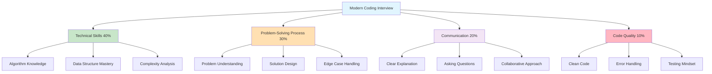

**Key Insight**: The best candidates don't just solve problems—they demonstrate how they think, communicate their reasoning, and show they can work effectively in a team environment.

## The STAR Method for Coding Interviews

### S.T.A.R. Framework

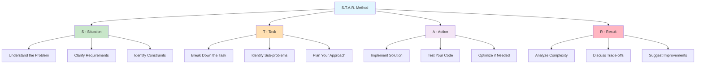

### Detailed Breakdown

#### Situation: Understanding the Problem (5-10 minutes)

**What to do:**
1. **Read the problem carefully** - Don't rush into coding
2. **Ask clarifying questions** - Show you think about edge cases
3. **Restate the problem** - Confirm your understanding
4. **Identify constraints** - Time, space, input size limitations

**Example Questions to Ask:**
```python
# For an array problem:
"Can the array be empty?"
"Are there duplicate elements?"
"What's the expected size of the input?"
"Should I handle negative numbers?"
"What should I return if no solution exists?"

# For a string problem:
"Are we case-sensitive?"
"Can the string contain special characters?"
"What about Unicode characters?"
"Should I handle null/empty strings?"
```

**Pro Tip**: The interviewer wants to see you think about edge cases, not just the happy path.

#### Task: Planning Your Solution (5-10 minutes)

**The Solution Design Process:**

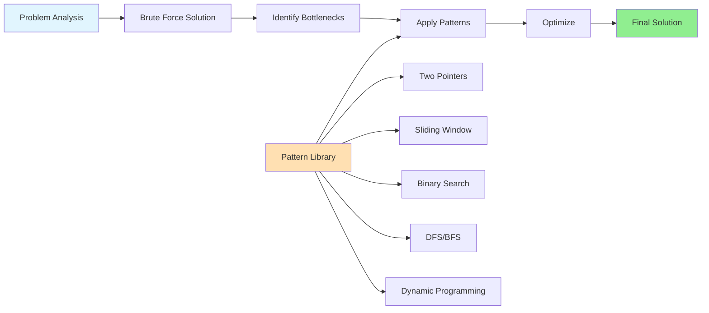

**Always start with brute force**, then optimize:

```python
def solve_problem_interview_style(input_data):
    """
    Step 1: Brute force approach (always start here)
    - Clearly explain the naive solution
    - Analyze its complexity
    - Then discuss optimizations
    """
    
    # Brute force: O(n²) time, O(1) space
    # "Let me start with the straightforward approach..."
    
    # Step 2: Identify patterns
    # "I notice this looks like a [pattern name] problem..."
    
    # Step 3: Optimize
    # "We can improve this by using [technique/data structure]..."
    
    pass
```

#### Action: Implementation (15-20 minutes)

**Code Like You're Pair Programming:**

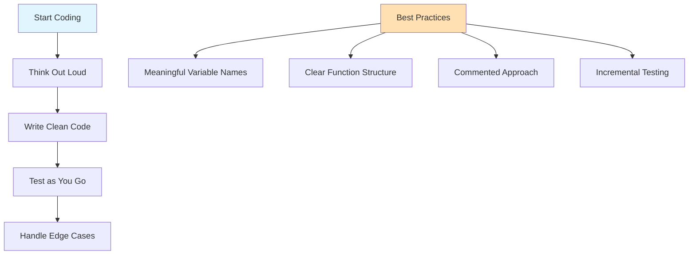

**Example of Good Interview Code:**

```python
def find_two_sum(nums, target):
    """
    Find two numbers in array that add up to target.
    
    Approach: Use hash map for O(1) lookup
    Time: O(n), Space: O(n)
    """
    # Edge case: need at least 2 numbers
    if len(nums) < 2:
        return []
    
    seen = {}  # num -> index mapping
    
    for i, num in enumerate(nums):
        complement = target - num
        
        # Check if we've seen the complement
        if complement in seen:
            return [seen[complement], i]
        
        # Store current number and its index
        seen[num] = i
    
    return []  # No solution found

# Test the function
def test_two_sum():
    # Test cases I'd run through in interview
    assert find_two_sum([2, 7, 11, 15], 9) == [0, 1]
    assert find_two_sum([3, 2, 4], 6) == [1, 2]
    assert find_two_sum([3, 3], 6) == [0, 1]
    assert find_two_sum([1], 2) == []
    print("All tests passed!")

# "Let me quickly test this with a few examples..."
test_two_sum()
```

**Communication Script During Coding:**
```
"I'm going to use a hash map here because..."
"Let me trace through this with an example..."
"I should handle this edge case where..."
"Actually, let me refactor this part to make it clearer..."
```

#### Result: Analysis and Optimization (5-10 minutes)

**The Final Analysis:**

```mermaid
graph TD
    A[Solution Complete] --> B[Complexity Analysis]
    A --> C[Trade-off Discussion]
    A --> D[Alternative Approaches]
    
    B --> B1[Time Complexity: O(?)]
    B --> B2[Space Complexity: O(?)]
    B --> B3[Best/Average/Worst Case]
    
    C --> C1[Time vs Space]
    C --> C2[Readability vs Performance]
    C --> C3[Scalability Considerations]
    
    D --> D1[Different Algorithms]
    D --> D2[Different Data Structures]
    D --> D3[System Design Implications]
    
    style A fill:#E1F5FE
    style B fill:#C8E6C9
    style C fill:#FFE0B2
    style D fill:#F3E5F5
```

## The Interview Problem Classification System

### Pattern Recognition Framework

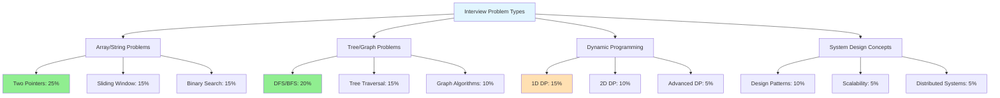

### The Most Important Interview Patterns

#### 1. Two Pointers - The Swiss Army Knife

**When to Recognize:**
- "Find pairs that sum to X"
- "Remove duplicates from sorted array"
- "Reverse/palindrome problems"
- "Merge two sorted arrays"

```python
def interview_two_pointers_template(arr, condition):
    """
    Universal two pointers template for interviews
    """
    left, right = 0, len(arr) - 1
    
    while left < right:
        if meets_condition(arr[left], arr[right]):
            # Found solution
            return [left, right]
        elif should_move_left(arr[left], arr[right]):
            left += 1
        else:
            right -= 1
    
    return []  # No solution

# Example: Two Sum in sorted array
def two_sum_sorted(nums, target):
    """Perfect interview answer with explanation"""
    left, right = 0, len(nums) - 1
    
    while left < right:
        current_sum = nums[left] + nums[right]
        
        if current_sum == target:
            return [left, right]
        elif current_sum < target:
            left += 1  # Need larger sum
        else:
            right -= 1  # Need smaller sum
    
    return []
```

#### 2. Sliding Window - Subarray Master

**Recognition Keywords:**
- "Maximum/minimum subarray"
- "Longest substring with property X"
- "Fixed window size K"

```python
def sliding_window_template(arr, condition):
    """
    Template for sliding window problems
    """
    left = 0
    result = 0  # or float('inf') for minimum problems
    
    for right in range(len(arr)):
        # Expand window
        window_state = update_window(arr[right])
        
        # Contract window if needed
        while not valid_window(window_state):
            window_state = remove_from_window(arr[left])
            left += 1
        
        # Update result
        result = max(result, right - left + 1)
    
    return result

# Classic example: Longest substring without repeating chars
def longest_unique_substring(s):
    """Interview-ready implementation"""
    if not s:
        return 0
    
    char_count = {}
    left = 0
    max_length = 0
    
    for right in range(len(s)):
        # Add current character
        char_count[s[right]] = char_count.get(s[right], 0) + 1
        
        # Contract window if we have duplicates
        while char_count[s[right]] > 1:
            char_count[s[left]] -= 1
            if char_count[s[left]] == 0:
                del char_count[s[left]]
            left += 1
        
        max_length = max(max_length, right - left + 1)
    
    return max_length
```

#### 3. Binary Search - Beyond Simple Searching

**Pattern Recognition:**
- "Find first/last occurrence"
- "Search in rotated array"
- "Find peak element"
- "Square root/optimization problems"

```python
def binary_search_template(arr, target):
    """
    Generic binary search for interviews
    """
    left, right = 0, len(arr) - 1
    
    while left <= right:
        mid = left + (right - left) // 2  # Avoid overflow
        
        if arr[mid] == target:
            return mid
        elif arr[mid] < target:
            left = mid + 1
        else:
            right = mid - 1
    
    return -1

# Advanced: Find first occurrence
def find_first_occurrence(arr, target):
    """Show understanding of variations"""
    left, right = 0, len(arr) - 1
    result = -1
    
    while left <= right:
        mid = left + (right - left) // 2
        
        if arr[mid] == target:
            result = mid
            right = mid - 1  # Continue searching left
        elif arr[mid] < target:
            left = mid + 1
        else:
            right = mid - 1
    
    return result
```

## Advanced Interview Strategies

### The "Levels of Optimization" Approach

```mermaid
graph TD
    A[Problem Given] --> B[Level 1: Brute Force]
    B --> C[Level 2: Optimize Time]
    C --> D[Level 3: Optimize Space]
    D --> E[Level 4: Handle Scale]
    
    B --> B1[O(n²) or O(2ⁿ)]
    B --> B2[Easy to understand]
    B --> B3[Always works]
    
    C --> C1[Use better algorithm]
    C --> C2[Better data structure]
    C --> C3[O(n log n) or O(n)]
    
    D --> D1[In-place algorithms]
    D --> D2[Streaming processing]
    D --> D3[Memory-efficient]
    
    E --> E1[Distributed processing]
    E --> E2[Caching strategies]
    E --> E3[Database considerations]
    
    style A fill:#E1F5FE
    style B fill:#FFB6C1
    style C fill:#FFE0B2
    style D fill:#C8E6C9
    style E fill:#90EE90
```

### Example: "Find Duplicate in Array" - All Levels

```python
def find_duplicate_level1_brute_force(nums):
    """
    Level 1: Brute Force O(n²)
    "Let me start with the obvious approach..."
    """
    n = len(nums)
    for i in range(n):
        for j in range(i + 1, n):
            if nums[i] == nums[j]:
                return nums[i]
    return -1

def find_duplicate_level2_sorting(nums):
    """
    Level 2: Sort first O(n log n)
    "We can improve by sorting first..."
    """
    nums.sort()
    for i in range(1, len(nums)):
        if nums[i] == nums[i-1]:
            return nums[i]
    return -1

def find_duplicate_level2_hashset(nums):
    """
    Level 2: Hash Set O(n) time, O(n) space
    "Or use a hash set for O(n) time..."
    """
    seen = set()
    for num in nums:
        if num in seen:
            return num
        seen.add(num)
    return -1

def find_duplicate_level3_floyd_cycle(nums):
    """
    Level 3: Floyd's Cycle Detection O(n) time, O(1) space
    "For the ultimate optimization, we can treat this as a cycle detection problem..."
    """
    # Phase 1: Find intersection point in cycle
    slow = fast = nums[0]
    
    while True:
        slow = nums[slow]
        fast = nums[nums[fast]]
        if slow == fast:
            break
    
    # Phase 2: Find entrance to cycle
    slow = nums[0]
    while slow != fast:
        slow = nums[slow]
        fast = nums[fast]
    
    return slow
```

**Interview Commentary:**
```
"I can solve this in several ways:
1. Brute force: Check every pair - O(n²) time
2. Sort first: Then find adjacent duplicates - O(n log n) time
3. Hash set: Trade space for speed - O(n) time, O(n) space
4. Floyd's algorithm: Treat as cycle detection - O(n) time, O(1) space

Which approach would you like me to implement first?"
```

## Communication Mastery

### The Perfect Interview Dialogue

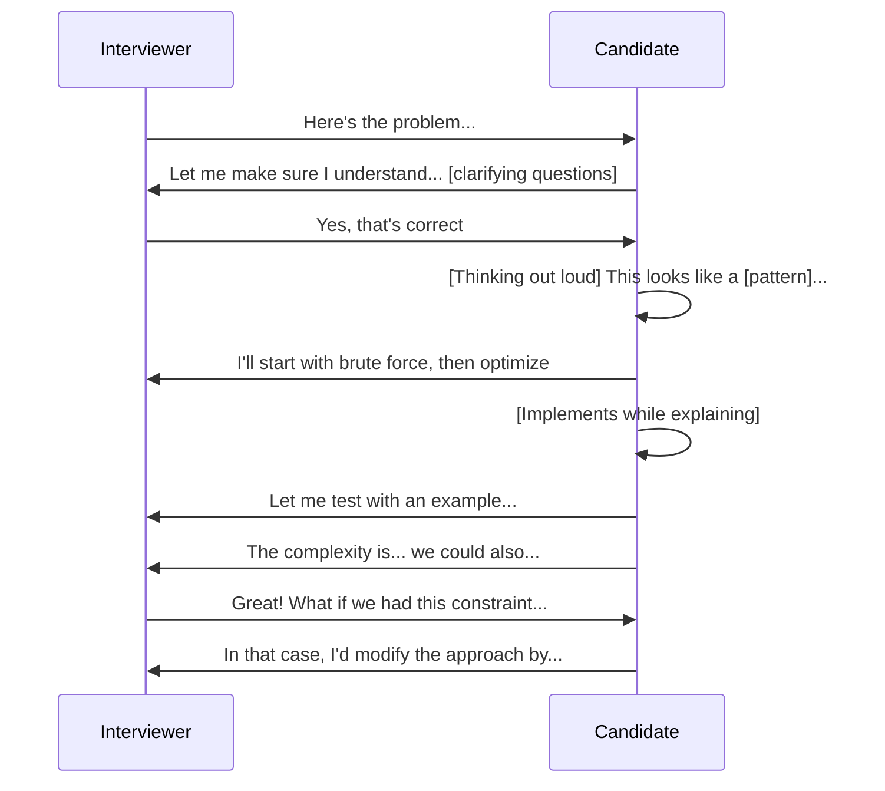

### Powerful Phrases for Interviews

**Problem Understanding:**
```
"Let me make sure I understand the problem correctly..."
"What should I do if [edge case]?"
"Are there any constraints I should be aware of?"
"Would you like me to handle [specific scenario]?"
```

**Solution Planning:**
```
"I see a few approaches here. Let me start with..."
"This reminds me of a [pattern name] problem..."
"The brute force would be... but we can do better by..."
"Let me think about the trade-offs..."
```

**During Implementation:**
```
"I'm using this data structure because..."
"Let me trace through with an example..."
"Actually, let me handle this edge case..."
"I realize I can simplify this part..."
```

**Testing and Analysis:**
```
"Let me test this with a few examples..."
"The time complexity is... because..."
"We're trading [X] for [Y] here..."
"In a production system, I'd also consider..."
```

## Company-Specific Strategies

### FAANG Interview Patterns

```mermaid
graph TD
    A[FAANG Companies] --> B[Google]
    A --> C[Amazon]
    A --> D[Facebook/Meta]
    A --> E[Apple]
    A --> F[Netflix]
    
    B --> B1[Complex algorithms]
    B --> B2[System design thinking]
    B --> B3[Code quality focus]
    
    C --> C1[Practical problems]
    C --> C2[Leadership principles]
    C --> C3[Customer obsession]
    
    D --> D1[Product thinking]
    D --> D2[Scale considerations]
    D --> D3[User experience impact]
    
    E --> E1[Performance optimization]
    E --> E2[Memory efficiency]
    E --> E3[Battery/power awareness]
    
    F --> F1[Streaming algorithms]
    F --> F2[Real-time processing]
    F --> F3[Data pipeline thinking]
    
    style A fill:#E1F5FE
    style B fill:#4285F4
    style C fill:#FF9900
    style D fill:#1877F2
    style E fill:#A2AAAD
    style F fill:#E50914
```

### Google Interview Strategy

**What they love to see:**
- Clean, well-structured code
- Multiple solutions with complexity analysis
- Edge case handling
- System design thinking

```python
def google_style_solution(problem_input):
    """
    Google appreciates this structure:
    1. Clear function signature with types
    2. Docstring with complexity
    3. Multiple approaches discussed
    4. Clean, readable implementation
    """
    # Approach 1: Brute force (always start here)
    # Time: O(n²), Space: O(1)
    
    # Approach 2: Optimized
    # Time: O(n), Space: O(n)
    # We can improve by using...
    
    pass
```

### Amazon Interview Strategy

**Connect to Leadership Principles:**
- Customer Obsession: "How does this impact the user?"
- Ownership: "How would I monitor this in production?"
- Invent and Simplify: "Is there a simpler approach?"

```python
def amazon_style_approach(problem):
    """
    Amazon loves practical thinking:
    - How would this scale?
    - What are the failure modes?
    - How would you monitor this?
    """
    
    # Always discuss:
    # 1. Edge cases that could break user experience
    # 2. How to handle errors gracefully
    # 3. Performance implications at scale
    # 4. Monitoring and alerting considerations
    
    pass
```

## The Interview Debugging Masterclass

### When Things Go Wrong

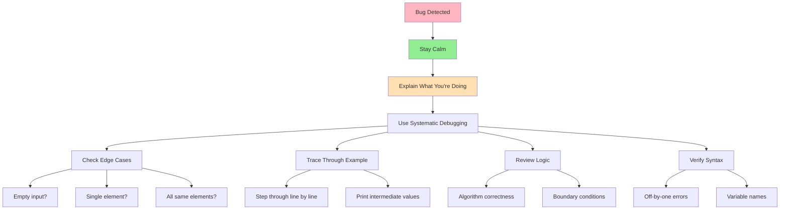

### Debugging Script for Interviews

```python
def debug_in_interview(your_function, test_input, expected_output):
    """
    How to debug gracefully in interviews
    """
    print(f"Testing with input: {test_input}")
    print(f"Expected output: {expected_output}")
    
    # Step 1: Run and see what happens
    actual_output = your_function(test_input)
    print(f"Actual output: {actual_output}")
    
    if actual_output != expected_output:
        print("Found a discrepancy. Let me trace through...")
        
        # Step 2: Add debug prints
        # "Let me add some print statements to see what's happening..."
        
        # Step 3: Check edge cases
        # "Let me verify my understanding of edge cases..."
        
        # Step 4: Review algorithm logic
        # "Actually, let me double-check my algorithm..."
    
    return actual_output == expected_output

# Example usage in interview:
# "Let me test this quickly..."
# "Hmm, that's not right. Let me see..."
# "Oh, I see the issue - I need to handle..."
```

## Time Management Strategies

### The 45-Minute Interview Breakdown

```mermaid
gantt
    title Interview Time Management
    dateFormat X
    axisFormat %M
    
    section Understanding (10 min)
    Read Problem    :0, 3
    Ask Questions   :3, 7
    Confirm Understanding :7, 10
    
    section Planning (8 min)
    Brute Force     :10, 13
    Optimize        :13, 16
    Choose Approach :16, 18
    
    section Implementation (20 min)
    Code Solution   :18, 35
    Test & Debug    :35, 38
    
    section Analysis (7 min)
    Complexity      :38, 41
    Trade-offs      :41, 43
    Follow-up       :43, 45
```

### Time-Saving Interview Hacks

```python
# Hack 1: Pre-written templates
def quick_binary_search_template():
    """Keep mental templates ready"""
    left, right = 0, len(arr) - 1
    while left <= right:
        mid = left + (right - left) // 2
        # Customize the condition here
    return -1

# Hack 2: Standard test cases
def get_standard_test_cases(problem_type):
    """Always test these"""
    return {
        'array': [[], [1], [1,1], [1,2,3]],
        'string': ['', 'a', 'aa', 'abc'],
        'number': [0, 1, -1, float('inf')]
    }

# Hack 3: Quick complexity analysis
complexity_cheatsheet = {
    'nested_loops': 'O(n²)',
    'divide_and_conquer': 'O(n log n)',
    'hash_lookup': 'O(1) average, O(n) worst',
    'tree_traversal': 'O(n)',
    'graph_dfs_bfs': 'O(V + E)'
}
```

## The Psychology of Interview Success

### Building Confidence

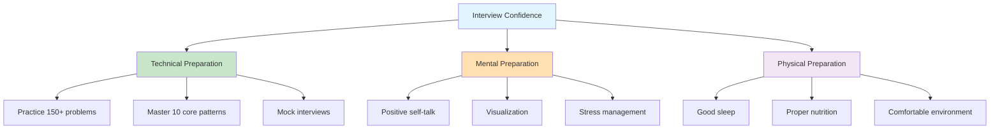

### Handling Interview Pressure

**The Pressure Release Valve:**

```python
def handle_interview_stress():
    """
    Mental strategies for staying calm
    """
    strategies = {
        'breathing': 'Deep breath before speaking',
        'positive_self_talk': 'I know this pattern',
        'reframe_mistakes': 'This shows I can debug',
        'interviewer_as_teammate': 'We are solving this together'
    }
    
    # Remember: The interviewer wants you to succeed!
    # They're not trying to trick you
    # They want to see how you think and work
    
    return "Stay calm and code on!"
```

## Red Flags to Avoid

### What NOT to Do in Interviews

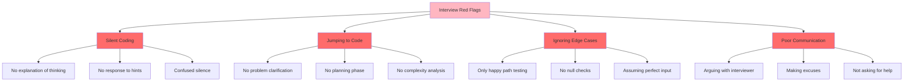

### The "Interview Death Spirals" to Avoid

**Death Spiral #1: Silent Struggle**
```
❌ Bad: *Types furiously in silence for 10 minutes*
✅ Good: "I'm thinking about using a hash map here because..."
```

**Death Spiral #2: Perfectionism Paralysis**
```
❌ Bad: "Let me think of the perfect solution first..."
✅ Good: "Let me start with brute force and then optimize..."
```

**Death Spiral #3: Defensive Coding**
```
❌ Bad: "This should work, but the test case might be wrong..."
✅ Good: "Let me trace through this example to see where I went wrong..."
```

## Final Interview Checklist

### Pre-Interview Preparation

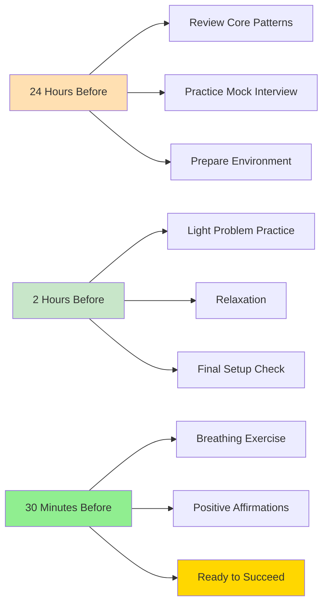

### The Ultimate Interview Cheat Sheet

```python
class InterviewSuccess:
    def __init__(self):
        self.patterns = [
            'Two Pointers', 'Sliding Window', 'Binary Search',
            'DFS/BFS', 'Dynamic Programming', 'Union Find',
            'Topological Sort', 'Backtracking'
        ]
        
        self.time_complexities = {
            'O(1)': 'Hash table lookup',
            'O(log n)': 'Binary search, balanced tree',
            'O(n)': 'Single pass through array',
            'O(n log n)': 'Efficient sorting, divide & conquer',
            'O(n²)': 'Nested loops, bubble sort',
            'O(2ⁿ)': 'Exponential, usually needs optimization'
        }
        
        self.communication_phrases = [
            "Let me make sure I understand...",
            "I see a few approaches here...",
            "This looks like a [pattern] problem...",
            "Let me start with brute force...",
            "Let me trace through an example...",
            "The time complexity is... because...",
            "We could optimize this by..."
        ]
    
    def execute_interview(self):
        """The winning formula"""
        steps = [
            "1. Clarify the problem (5-10 min)",
            "2. Design solution (5-8 min)",
            "3. Implement while explaining (15-20 min)",
            "4. Test and analyze (5-10 min)",
            "5. Discuss optimizations (remaining time)"
        ]
        return "Success through systematic approach!"

# Remember: Interviews are just conversations about problem-solving
# Stay calm, think out loud, and show your thought process
# The interviewer is rooting for you to succeed!
```

## Conclusion: Your Interview Success Blueprint

The coding interview is not just about solving problems—it's about demonstrating how you think, how you communicate, and how you handle challenges. The candidates who succeed are those who:

1. **Master the fundamentals** - Know your patterns cold
2. **Communicate clearly** - Think out loud and explain your reasoning  
3. **Stay systematic** - Follow the STAR method consistently
4. **Practice extensively** - Repetition builds confidence
5. **Learn from failures** - Each mistake is a learning opportunity

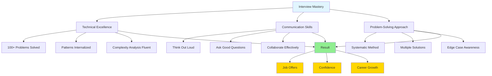

Remember: Every expert was once a beginner. Every successful interview candidate started exactly where you are now. The difference is consistent practice, learning from mistakes, and never giving up.

**Your next interview is not a test—it's an opportunity to showcase the amazing problem-solver you've become.**

Good luck! 🚀