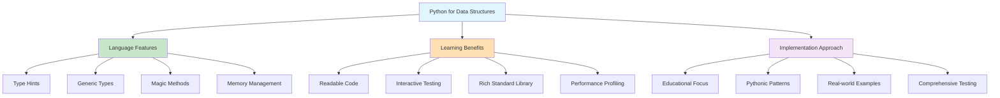

# Python Implementation: Idiomatic Data Structures and Algorithms

## Introduction: Python's Strengths for Learning

Python is an excellent language for learning data structures and algorithms because:
- **Clear syntax**: Focus on concepts rather than language complexity
- **Rich standard library**: Built-in implementations to compare against
- **Interactive development**: Easy to experiment and test ideas
- **Strong typing support**: Modern Python supports type hints for better code clarity



**Key Python Features We'll Leverage:**
- **Type hints** for clarity and IDE support
- **Magic methods** for natural Python syntax (`__len__`, `__getitem__`, etc.)
- **Generators** for memory-efficient iteration
- **Descriptive error handling** with meaningful exception messages
- **Performance measurement** tools built into the language

This implementation guide shows idiomatic Python code that leverages the language's strengths while teaching fundamental concepts.

## Core Data Structures

### 1. Dynamic Array Implementation

```python
from typing import Generic, TypeVar, Optional, Iterator
import sys

T = TypeVar('T')

class DynamicArray(Generic[T]):
    """
    A dynamic array implementation that grows and shrinks as needed.
    Demonstrates amortized O(1) insertion and automatic memory management.
    """
    
    def __init__(self, initial_capacity: int = 8) -> None:
        """Initialize with a given capacity."""
        self._capacity = max(1, initial_capacity)
        self._size = 0
        self._data: list[Optional[T]] = [None] * self._capacity
    
    def __len__(self) -> int:
        """Return the number of elements."""
        return self._size
    
    def __getitem__(self, index: int) -> T:
        """Get element at index with bounds checking."""
        if not 0 <= index < self._size:
            raise IndexError(f"Index {index} out of range [0, {self._size})")
        return self._data[index]  # type: ignore
    
    def __setitem__(self, index: int, value: T) -> None:
        """Set element at index with bounds checking."""
        if not 0 <= index < self._size:
            raise IndexError(f"Index {index} out of range [0, {self._size})")
        self._data[index] = value
    
    def __iter__(self) -> Iterator[T]:
        """Make the array iterable."""
        for i in range(self._size):
            yield self._data[i]  # type: ignore
    
    def __repr__(self) -> str:
        """String representation for debugging."""
        elements = [str(self._data[i]) for i in range(self._size)]
        return f"DynamicArray([{', '.join(elements)}])"
    
    def append(self, value: T) -> None:
        """Add element to the end. Amortized O(1)."""
        if self._size >= self._capacity:
            self._resize(self._capacity * 2)
        
        self._data[self._size] = value
        self._size += 1
    
    def pop(self, index: int = -1) -> T:
        """Remove and return element at index. Default is last element."""
        if self._size == 0:
            raise IndexError("pop from empty array")
        
        # Handle negative indices
        if index < 0:
            index = self._size + index
        
        if not 0 <= index < self._size:
            raise IndexError(f"Index {index} out of range")
        
        value = self._data[index]  # type: ignore
        
        # Shift elements left
        for i in range(index, self._size - 1):
            self._data[i] = self._data[i + 1]
        
        self._size -= 1
        self._data[self._size] = None  # Help garbage collection
        
        # Shrink if array is 1/4 full to avoid thrashing
        if self._size > 0 and self._size <= self._capacity // 4:
            self._resize(self._capacity // 2)
        
        return value
    
    def insert(self, index: int, value: T) -> None:
        """Insert element at given index. O(n) worst case."""
        if not 0 <= index <= self._size:
            raise IndexError(f"Index {index} out of range [0, {self._size}]")
        
        if self._size >= self._capacity:
            self._resize(self._capacity * 2)
        
        # Shift elements right
        for i in range(self._size, index, -1):
            self._data[i] = self._data[i - 1]
        
        self._data[index] = value
        self._size += 1
    
    def _resize(self, new_capacity: int) -> None:
        """Resize the internal array. Maintains all existing elements."""
        new_capacity = max(1, new_capacity)  # Ensure minimum capacity
        new_data: list[Optional[T]] = [None] * new_capacity
        
        # Copy existing elements
        for i in range(self._size):
            new_data[i] = self._data[i]
        
        self._data = new_data
        self._capacity = new_capacity
    
    @property
    def capacity(self) -> int:
        """Get current capacity of the array."""
        return self._capacity
    
    def memory_usage(self) -> dict[str, int]:
        """Get memory usage statistics."""
        element_size = sys.getsizeof(self._data[0]) if self._size > 0 else 0
        return {
            'total_bytes': sys.getsizeof(self._data),
            'used_bytes': self._size * element_size if element_size else 0,
            'wasted_bytes': (self._capacity - self._size) * element_size if element_size else 0,
            'utilization_percent': int((self._size / self._capacity) * 100)
        }

# Example usage and testing
def test_dynamic_array():
    """Test the dynamic array implementation."""
    print("Testing Dynamic Array:")
    print("=" * 30)
    
    # Create array and add elements
    arr = DynamicArray[int](initial_capacity=2)
    print(f"Initial: {arr} (capacity: {arr.capacity})")
    
    # Test appending (should trigger resize)
    for i in range(5):
        arr.append(i)
        print(f"After append({i}): {arr} (capacity: {arr.capacity})")
    
    # Test insertion
    arr.insert(2, 99)
    print(f"After insert(2, 99): {arr}")
    
    # Test removal
    removed = arr.pop(2)
    print(f"Removed {removed}: {arr}")
    
    # Test memory usage
    memory = arr.memory_usage()
    print(f"Memory usage: {memory}")
    
    # Test iteration
    print(f"Elements: {list(arr)}")

test_dynamic_array()
```

### 2. Hash Table Implementation

```python
from typing import Generic, TypeVar, Optional, Iterator, Tuple
from collections.abc import Hashable

K = TypeVar('K', bound=Hashable)
V = TypeVar('V')

class HashTable(Generic[K, V]):
    """
    A hash table implementation using separate chaining for collision resolution.
    Demonstrates hashing, collision handling, and dynamic resizing.
    """
    
    def __init__(self, initial_capacity: int = 8, load_factor_threshold: float = 0.75) -> None:
        """Initialize hash table with given capacity and load factor."""
        self._capacity = max(1, initial_capacity)
        self._size = 0
        self._load_factor_threshold = load_factor_threshold
        self._buckets: list[list[Tuple[K, V]]] = [[] for _ in range(self._capacity)]
        self._resize_count = 0
    
    def __len__(self) -> int:
        """Return number of key-value pairs."""
        return self._size
    
    def __getitem__(self, key: K) -> V:
        """Get value by key. Raises KeyError if not found."""
        bucket_index = self._hash(key)
        bucket = self._buckets[bucket_index]
        
        for k, v in bucket:
            if k == key:
                return v
        
        raise KeyError(key)
    
    def __setitem__(self, key: K, value: V) -> None:
        """Set key-value pair."""
        self.put(key, value)
    
    def __delitem__(self, key: K) -> None:
        """Delete key-value pair."""
        bucket_index = self._hash(key)
        bucket = self._buckets[bucket_index]
        
        for i, (k, v) in enumerate(bucket):
            if k == key:
                del bucket[i]
                self._size -= 1
                return
        
        raise KeyError(key)
    
    def __contains__(self, key: K) -> bool:
        """Check if key exists in hash table."""
        try:
            self[key]
            return True
        except KeyError:
            return False
    
    def __iter__(self) -> Iterator[K]:
        """Iterate over keys."""
        for bucket in self._buckets:
            for k, v in bucket:
                yield k
    
    def __repr__(self) -> str:
        """String representation."""
        items = [f"{k!r}: {v!r}" for k, v in self.items()]
        return f"HashTable({{{', '.join(items)}}})"
    
    def _hash(self, key: K) -> int:
        """Hash function to map key to bucket index."""
        return hash(key) % self._capacity
    
    def _should_resize(self) -> bool:
        """Check if hash table should be resized."""
        return (self._size / self._capacity) > self._load_factor_threshold
    
    def _resize(self) -> None:
        """Resize hash table to maintain performance."""
        old_buckets = self._buckets
        old_capacity = self._capacity
        
        self._capacity *= 2
        self._buckets = [[] for _ in range(self._capacity)]
        old_size = self._size
        self._size = 0
        self._resize_count += 1
        
        # Rehash all existing items
        for bucket in old_buckets:
            for key, value in bucket:
                self._put_without_resize(key, value)
        
        print(f"Resized from {old_capacity} to {self._capacity} buckets (rehashed {old_size} items)")
    
    def _put_without_resize(self, key: K, value: V) -> None:
        """Put without triggering resize (used during resize)."""
        bucket_index = self._hash(key)
        bucket = self._buckets[bucket_index]
        
        for i, (k, v) in enumerate(bucket):
            if k == key:
                bucket[i] = (key, value)  # Update existing
                return
        
        bucket.append((key, value))  # Add new
        self._size += 1
    
    def put(self, key: K, value: V) -> None:
        """Insert or update key-value pair."""
        if self._should_resize():
            self._resize()
        
        self._put_without_resize(key, value)
    
    def get(self, key: K, default: Optional[V] = None) -> Optional[V]:
        """Get value by key, return default if not found."""
        try:
            return self[key]
        except KeyError:
            return default
    
    def keys(self) -> Iterator[K]:
        """Get all keys."""
        return iter(self)
    
    def values(self) -> Iterator[V]:
        """Get all values."""
        for bucket in self._buckets:
            for k, v in bucket:
                yield v
    
    def items(self) -> Iterator[Tuple[K, V]]:
        """Get all key-value pairs."""
        for bucket in self._buckets:
            for item in bucket:
                yield item
    
    def performance_stats(self) -> dict[str, float]:
        """Get performance statistics."""
        bucket_sizes = [len(bucket) for bucket in self._buckets]
        
        return {
            'size': self._size,
            'capacity': self._capacity,
            'load_factor': self._size / self._capacity,
            'resize_count': self._resize_count,
            'max_bucket_size': max(bucket_sizes) if bucket_sizes else 0,
            'avg_bucket_size': sum(bucket_sizes) / len(bucket_sizes),
            'empty_buckets': bucket_sizes.count(0),
            'bucket_utilization': (self._capacity - bucket_sizes.count(0)) / self._capacity
        }

# Test hash table
def test_hash_table():
    """Test hash table implementation."""
    print("\\n\\nTesting Hash Table:")
    print("=" * 30)
    
    ht = HashTable[str, int](initial_capacity=4)
    
    # Add items to trigger resize
    items = [("apple", 1), ("banana", 2), ("cherry", 3), ("date", 4), 
             ("elderberry", 5), ("fig", 6), ("grape", 7)]
    
    for key, value in items:
        ht[key] = value
        print(f"Added {key}: {value} (size: {len(ht)})")
    
    # Test operations
    print(f"\\nHash table: {ht}")
    print(f"ht['apple'] = {ht['apple']}")
    print(f"'banana' in ht: {'banana' in ht}")
    print(f"'orange' in ht: {'orange' in ht}")
    
    # Test update
    ht['apple'] = 10
    print(f"After update, ht['apple'] = {ht['apple']}")
    
    # Performance stats
    stats = ht.performance_stats()
    print("\\nPerformance stats:")
    for key, value in stats.items():
        if isinstance(value, float):
            print(f"  {key}: {value:.3f}")
        else:
            print(f"  {key}: {value}")

test_hash_table()
```

### 3. Binary Search Tree Implementation

```python
from typing import Generic, TypeVar, Optional, Iterator, List
from dataclasses import dataclass

T = TypeVar('T')

@dataclass
class TreeNode(Generic[T]):
    """A node in a binary search tree."""
    value: T
    left: Optional['TreeNode[T]'] = None
    right: Optional['TreeNode[T]'] = None
    
    def __repr__(self) -> str:
        return f"TreeNode({self.value})"

class BinarySearchTree(Generic[T]):
    """
    A binary search tree implementation with insertion, deletion, and traversal.
    Maintains the BST property: left < parent < right.
    """
    
    def __init__(self) -> None:
        """Initialize empty tree."""
        self._root: Optional[TreeNode[T]] = None
        self._size = 0
    
    def __len__(self) -> int:
        """Return number of nodes in tree."""
        return self._size
    
    def __contains__(self, value: T) -> bool:
        """Check if value exists in tree."""
        return self._search(self._root, value) is not None
    
    def __iter__(self) -> Iterator[T]:
        """Iterate over values in sorted order (in-order traversal)."""
        yield from self._inorder_traversal(self._root)
    
    def __repr__(self) -> str:
        """String representation showing tree structure."""
        if not self._root:
            return "BinarySearchTree([])"
        
        lines = self._get_tree_lines(self._root)
        return "BinarySearchTree:\\n" + "\\n".join(lines)
    
    def insert(self, value: T) -> None:
        """Insert value into tree. O(log n) average, O(n) worst case."""
        self._root = self._insert_recursive(self._root, value)
    
    def _insert_recursive(self, node: Optional[TreeNode[T]], value: T) -> TreeNode[T]:
        """Recursive helper for insertion."""
        if node is None:
            self._size += 1
            return TreeNode(value)
        
        if value < node.value:
            node.left = self._insert_recursive(node.left, value)
        elif value > node.value:
            node.right = self._insert_recursive(node.right, value)
        # If value == node.value, we don't insert duplicates
        
        return node
    
    def delete(self, value: T) -> bool:
        """Delete value from tree. Returns True if found and deleted."""
        initial_size = self._size
        self._root = self._delete_recursive(self._root, value)
        return self._size < initial_size
    
    def _delete_recursive(self, node: Optional[TreeNode[T]], value: T) -> Optional[TreeNode[T]]:
        """Recursive helper for deletion."""
        if node is None:
            return None
        
        if value < node.value:
            node.left = self._delete_recursive(node.left, value)
        elif value > node.value:
            node.right = self._delete_recursive(node.right, value)
        else:
            # Found the node to delete
            self._size -= 1
            
            # Case 1: Node has no children
            if node.left is None and node.right is None:
                return None
            
            # Case 2: Node has one child
            if node.left is None:
                return node.right
            if node.right is None:
                return node.left
            
            # Case 3: Node has two children
            # Find inorder successor (smallest value in right subtree)
            successor = self._find_min(node.right)
            node.value = successor.value
            node.right = self._delete_recursive(node.right, successor.value)
        
        return node
    
    def _find_min(self, node: TreeNode[T]) -> TreeNode[T]:
        """Find minimum value node in subtree."""
        while node.left is not None:
            node = node.left
        return node
    
    def _search(self, node: Optional[TreeNode[T]], value: T) -> Optional[TreeNode[T]]:
        """Search for value in tree."""
        if node is None or node.value == value:
            return node
        
        if value < node.value:
            return self._search(node.left, value)
        else:
            return self._search(node.right, value)
    
    def find_min(self) -> Optional[T]:
        """Find minimum value in tree."""
        if self._root is None:
            return None
        return self._find_min(self._root).value
    
    def find_max(self) -> Optional[T]:
        """Find maximum value in tree."""
        if self._root is None:
            return None
        
        node = self._root
        while node.right is not None:
            node = node.right
        return node.value
    
    def _inorder_traversal(self, node: Optional[TreeNode[T]]) -> Iterator[T]:
        """In-order traversal (left, root, right) - gives sorted order."""
        if node is not None:
            yield from self._inorder_traversal(node.left)
            yield node.value
            yield from self._inorder_traversal(node.right)
    
    def preorder_traversal(self) -> List[T]:
        """Pre-order traversal (root, left, right)."""
        result = []
        self._preorder_recursive(self._root, result)
        return result
    
    def _preorder_recursive(self, node: Optional[TreeNode[T]], result: List[T]) -> None:
        """Recursive helper for pre-order traversal."""
        if node is not None:
            result.append(node.value)
            self._preorder_recursive(node.left, result)
            self._preorder_recursive(node.right, result)
    
    def postorder_traversal(self) -> List[T]:
        """Post-order traversal (left, right, root)."""
        result = []
        self._postorder_recursive(self._root, result)
        return result
    
    def _postorder_recursive(self, node: Optional[TreeNode[T]], result: List[T]) -> None:
        """Recursive helper for post-order traversal."""
        if node is not None:
            self._postorder_recursive(node.left, result)
            self._postorder_recursive(node.right, result)
            result.append(node.value)
    
    def height(self) -> int:
        """Get height of tree."""
        return self._height_recursive(self._root)
    
    def _height_recursive(self, node: Optional[TreeNode[T]]) -> int:
        """Recursive helper for height calculation."""
        if node is None:
            return -1
        
        left_height = self._height_recursive(node.left)
        right_height = self._height_recursive(node.right)
        return max(left_height, right_height) + 1
    
    def _get_tree_lines(self, node: Optional[TreeNode[T]], prefix: str = "", is_last: bool = True) -> List[str]:
        """Get lines representing tree structure for visualization."""
        if node is None:
            return []
        
        lines = []
        
        # Current node
        connector = "└── " if is_last else "├── "
        lines.append(prefix + connector + str(node.value))
        
        # Children
        children = []
        if node.left is not None:
            children.append((node.left, False))
        if node.right is not None:
            children.append((node.right, True))
        
        for i, (child, child_is_last) in enumerate(children):
            extension = "    " if is_last else "│   "
            child_prefix = prefix + extension
            lines.extend(self._get_tree_lines(child, child_prefix, child_is_last and i == len(children) - 1))
        
        return lines

# Test binary search tree
def test_binary_search_tree():
    """Test BST implementation."""
    print("\\n\\nTesting Binary Search Tree:")
    print("=" * 30)
    
    bst = BinarySearchTree[int]()
    
    # Insert values
    values = [50, 30, 70, 20, 40, 60, 80, 10, 25, 35, 45]
    for value in values:
        bst.insert(value)
    
    print(f"Inserted: {values}")
    print(f"Tree size: {len(bst)}")
    print(f"Tree height: {bst.height()}")
    
    # Test search
    print(f"\\n25 in tree: {25 in bst}")
    print(f"99 in tree: {99 in bst}")
    
    # Test traversals
    print(f"\\nIn-order (sorted): {list(bst)}")
    print(f"Pre-order: {bst.preorder_traversal()}")
    print(f"Post-order: {bst.postorder_traversal()}")
    
    # Test min/max
    print(f"\\nMin value: {bst.find_min()}")
    print(f"Max value: {bst.find_max()}")
    
    # Test deletion
    print(f"\\nDeleting 30...")
    bst.delete(30)
    print(f"After deletion: {list(bst)}")
    
    # Visualize tree structure
    print(f"\\nTree structure:")
    print(bst)

test_binary_search_tree()
```

## Essential Algorithms

### 1. Sorting Algorithms

```python
from typing import List, TypeVar, Callable, Optional
import random
import time

T = TypeVar('T')

class SortingAlgorithms:
    """Collection of sorting algorithms with performance analysis."""
    
    @staticmethod
    def bubble_sort(arr: List[T]) -> List[T]:
        """
        Bubble sort - O(n²) time, O(1) space.
        Simple but inefficient. Good for educational purposes.
        """
        result = arr.copy()
        n = len(result)
        
        for i in range(n):
            swapped = False
            for j in range(0, n - i - 1):
                if result[j] > result[j + 1]:
                    result[j], result[j + 1] = result[j + 1], result[j]
                    swapped = True
            
            if not swapped:  # Early termination if array is sorted
                break
        
        return result
    
    @staticmethod
    def insertion_sort(arr: List[T]) -> List[T]:
        """
        Insertion sort - O(n²) worst case, O(n) best case, O(1) space.
        Excellent for small arrays and nearly sorted data.
        """
        result = arr.copy()
        
        for i in range(1, len(result)):
            key = result[i]
            j = i - 1
            
            # Move elements greater than key one position ahead
            while j >= 0 and result[j] > key:
                result[j + 1] = result[j]
                j -= 1
            
            result[j + 1] = key
        
        return result
    
    @staticmethod
    def merge_sort(arr: List[T]) -> List[T]:
        """
        Merge sort - O(n log n) time, O(n) space.
        Stable sort with predictable performance.
        """
        if len(arr) <= 1:
            return arr.copy()
        
        mid = len(arr) // 2
        left = SortingAlgorithms.merge_sort(arr[:mid])
        right = SortingAlgorithms.merge_sort(arr[mid:])
        
        return SortingAlgorithms._merge(left, right)
    
    @staticmethod
    def _merge(left: List[T], right: List[T]) -> List[T]:
        """Merge two sorted arrays."""
        result = []
        i = j = 0
        
        while i < len(left) and j < len(right):
            if left[i] <= right[j]:
                result.append(left[i])
                i += 1
            else:
                result.append(right[j])
                j += 1
        
        # Add remaining elements
        result.extend(left[i:])
        result.extend(right[j:])
        return result
    
    @staticmethod
    def quick_sort(arr: List[T]) -> List[T]:
        """
        Quick sort - O(n log n) average, O(n²) worst case, O(log n) space.
        Fast in practice, cache-friendly.
        """
        if len(arr) <= 1:
            return arr.copy()
        
        pivot = arr[len(arr) // 2]
        left = [x for x in arr if x < pivot]
        middle = [x for x in arr if x == pivot]
        right = [x for x in arr if x > pivot]
        
        return (SortingAlgorithms.quick_sort(left) + 
                middle + 
                SortingAlgorithms.quick_sort(right))
    
    @staticmethod
    def heap_sort(arr: List[T]) -> List[T]:
        """
        Heap sort - O(n log n) time, O(1) space.
        Not stable but good worst-case guarantees.
        """
        result = arr.copy()
        n = len(result)
        
        # Build max heap
        for i in range(n // 2 - 1, -1, -1):
            SortingAlgorithms._heapify(result, n, i)
        
        # Extract elements from heap one by one
        for i in range(n - 1, 0, -1):
            result[0], result[i] = result[i], result[0]  # Move max to end
            SortingAlgorithms._heapify(result, i, 0)     # Restore heap property
        
        return result
    
    @staticmethod
    def _heapify(arr: List[T], n: int, i: int) -> None:
        """Maintain heap property."""
        largest = i
        left = 2 * i + 1
        right = 2 * i + 2
        
        if left < n and arr[left] > arr[largest]:
            largest = left
        
        if right < n and arr[right] > arr[largest]:
            largest = right
        
        if largest != i:
            arr[i], arr[largest] = arr[largest], arr[i]
            SortingAlgorithms._heapify(arr, n, largest)
    
    @staticmethod
    def counting_sort(arr: List[int], max_value: Optional[int] = None) -> List[int]:
        """
        Counting sort - O(n + k) time, O(k) space where k is range of input.
        Only works with integers in a known range.
        """
        if not arr:
            return []
        
        if max_value is None:
            max_value = max(arr)
        
        min_value = min(arr)
        range_size = max_value - min_value + 1
        
        # Count occurrences
        count = [0] * range_size
        for num in arr:
            count[num - min_value] += 1
        
        # Build result
        result = []
        for i, freq in enumerate(count):
            result.extend([i + min_value] * freq)
        
        return result
    
    @staticmethod
    def benchmark_sorts(arr: List[T], algorithms: Optional[List[str]] = None) -> dict[str, float]:
        """Benchmark different sorting algorithms."""
        if algorithms is None:
            algorithms = ['insertion', 'merge', 'quick', 'heap', 'builtin']
        
        results = {}
        
        # Map algorithm names to functions
        sort_functions = {
            'bubble': SortingAlgorithms.bubble_sort,
            'insertion': SortingAlgorithms.insertion_sort,
            'merge': SortingAlgorithms.merge_sort,
            'quick': SortingAlgorithms.quick_sort,
            'heap': SortingAlgorithms.heap_sort,
            'builtin': sorted
        }
        
        for algo_name in algorithms:
            if algo_name in sort_functions:
                start_time = time.perf_counter()
                sorted_arr = sort_functions[algo_name](arr)
                end_time = time.perf_counter()
                
                results[algo_name] = (end_time - start_time) * 1000  # Convert to milliseconds
        
        return results

# Test sorting algorithms
def test_sorting_algorithms():
    """Test and benchmark sorting algorithms."""
    print("\\n\\nTesting Sorting Algorithms:")
    print("=" * 30)
    
    # Test correctness with small array
    test_arr = [64, 34, 25, 12, 22, 11, 90, 5]
    expected = sorted(test_arr)
    
    algorithms = {
        'Bubble Sort': SortingAlgorithms.bubble_sort,
        'Insertion Sort': SortingAlgorithms.insertion_sort,
        'Merge Sort': SortingAlgorithms.merge_sort,
        'Quick Sort': SortingAlgorithms.quick_sort,
        'Heap Sort': SortingAlgorithms.heap_sort,
    }
    
    print(f"Original array: {test_arr}")
    print(f"Expected result: {expected}")
    print()
    
    for name, sort_func in algorithms.items():
        result = sort_func(test_arr)
        correct = result == expected
        print(f"{name:<15}: {result} ({'✓' if correct else '✗'})")
    
    # Test counting sort separately (integers only)
    int_arr = [4, 2, 2, 8, 3, 3, 1]
    counting_result = SortingAlgorithms.counting_sort(int_arr)
    print(f"{'Counting Sort':<15}: {counting_result} ({'✓' if counting_result == sorted(int_arr) else '✗'})")
    
    # Benchmark with larger arrays
    print("\\n\\nPerformance Benchmark:")
    print("=" * 40)
    
    sizes = [100, 1000, 5000]
    
    for size in sizes:
        print(f"\\nArray size: {size}")
        print("-" * 20)
        
        # Different data patterns
        patterns = {
            'Random': [random.randint(1, 1000) for _ in range(size)],
            'Nearly Sorted': list(range(size - 10)) + [random.randint(1, 100) for _ in range(10)],
            'Reverse Sorted': list(range(size, 0, -1))
        }
        
        for pattern_name, data in patterns.items():
            print(f"\\n{pattern_name} data:")
            
            # Only test faster algorithms for larger sizes
            test_algorithms = ['insertion', 'merge', 'quick', 'heap', 'builtin']
            if size <= 1000:
                test_algorithms.insert(0, 'bubble')
            
            times = SortingAlgorithms.benchmark_sorts(data, test_algorithms)
            
            for algo, time_ms in times.items():
                print(f"  {algo:<10}: {time_ms:>8.3f} ms")

test_sorting_algorithms()
```

### 2. Search Algorithms

```python
from typing import List, TypeVar, Optional, Tuple
import bisect

T = TypeVar('T')

class SearchAlgorithms:
    """Collection of search algorithms."""
    
    @staticmethod
    def linear_search(arr: List[T], target: T) -> int:
        """
        Linear search - O(n) time, O(1) space.
        Works on unsorted arrays.
        """
        for i, value in enumerate(arr):
            if value == target:
                return i
        return -1
    
    @staticmethod
    def binary_search(arr: List[T], target: T) -> int:
        """
        Binary search - O(log n) time, O(1) space.
        Requires sorted array.
        """
        left, right = 0, len(arr) - 1
        
        while left <= right:
            mid = (left + right) // 2
            
            if arr[mid] == target:
                return mid
            elif arr[mid] < target:
                left = mid + 1
            else:
                right = mid - 1
        
        return -1
    
    @staticmethod
    def binary_search_recursive(arr: List[T], target: T, left: int = 0, right: Optional[int] = None) -> int:
        """
        Recursive binary search - O(log n) time, O(log n) space.
        """
        if right is None:
            right = len(arr) - 1
        
        if left > right:
            return -1
        
        mid = (left + right) // 2
        
        if arr[mid] == target:
            return mid
        elif arr[mid] < target:
            return SearchAlgorithms.binary_search_recursive(arr, target, mid + 1, right)
        else:
            return SearchAlgorithms.binary_search_recursive(arr, target, left, mid - 1)
    
    @staticmethod
    def find_first_occurrence(arr: List[T], target: T) -> int:
        """Find first occurrence of target in sorted array with duplicates."""
        left, right = 0, len(arr) - 1
        result = -1
        
        while left <= right:
            mid = (left + right) // 2
            
            if arr[mid] == target:
                result = mid
                right = mid - 1  # Continue searching left for first occurrence
            elif arr[mid] < target:
                left = mid + 1
            else:
                right = mid - 1
        
        return result
    
    @staticmethod
    def find_last_occurrence(arr: List[T], target: T) -> int:
        """Find last occurrence of target in sorted array with duplicates."""
        left, right = 0, len(arr) - 1
        result = -1
        
        while left <= right:
            mid = (left + right) // 2
            
            if arr[mid] == target:
                result = mid
                left = mid + 1  # Continue searching right for last occurrence
            elif arr[mid] < target:
                left = mid + 1
            else:
                right = mid - 1
        
        return result
    
    @staticmethod
    def find_range(arr: List[T], target: T) -> Tuple[int, int]:
        """Find first and last occurrence of target."""
        first = SearchAlgorithms.find_first_occurrence(arr, target)
        if first == -1:
            return (-1, -1)
        
        last = SearchAlgorithms.find_last_occurrence(arr, target)
        return (first, last)
    
    @staticmethod
    def search_insert_position(arr: List[T], target: T) -> int:
        """Find position where target should be inserted to maintain sorted order."""
        left, right = 0, len(arr)
        
        while left < right:
            mid = (left + right) // 2
            
            if arr[mid] < target:
                left = mid + 1
            else:
                right = mid
        
        return left
    
    @staticmethod
    def find_peak_element(arr: List[T]) -> int:
        """
        Find a peak element (greater than or equal to neighbors).
        Uses binary search approach - O(log n).
        """
        left, right = 0, len(arr) - 1
        
        while left < right:
            mid = (left + right) // 2
            
            if arr[mid] < arr[mid + 1]:
                left = mid + 1  # Peak is on the right
            else:
                right = mid     # Peak is on the left (or at mid)
        
        return left
    
    @staticmethod
    def find_in_rotated_sorted_array(arr: List[T], target: T) -> int:
        """
        Search in rotated sorted array - O(log n).
        Example: [4,5,6,7,0,1,2] rotated from [0,1,2,4,5,6,7]
        """
        left, right = 0, len(arr) - 1
        
        while left <= right:
            mid = (left + right) // 2
            
            if arr[mid] == target:
                return mid
            
            # Determine which half is sorted
            if arr[left] <= arr[mid]:  # Left half is sorted
                if arr[left] <= target < arr[mid]:
                    right = mid - 1
                else:
                    left = mid + 1
            else:  # Right half is sorted
                if arr[mid] < target <= arr[right]:
                    left = mid + 1
                else:
                    right = mid - 1
        
        return -1

# Test search algorithms
def test_search_algorithms():
    """Test search algorithms."""
    print("\\n\\nTesting Search Algorithms:")
    print("=" * 30)
    
    # Test data
    unsorted_arr = [64, 34, 25, 12, 22, 11, 90, 5]
    sorted_arr = [1, 3, 5, 7, 9, 11, 13, 15, 17, 19]
    duplicates_arr = [1, 2, 2, 2, 3, 4, 4, 5, 5, 5, 5, 6]
    rotated_arr = [4, 5, 6, 7, 0, 1, 2]
    
    print(f"Unsorted array: {unsorted_arr}")
    print(f"Sorted array: {sorted_arr}")
    print(f"Array with duplicates: {duplicates_arr}")
    print(f"Rotated sorted array: {rotated_arr}")
    
    # Test linear search
    print("\\nLinear Search (works on any array):")
    target = 22
    result = SearchAlgorithms.linear_search(unsorted_arr, target)
    print(f"  Find {target} in unsorted array: index {result}")
    
    # Test binary search
    print("\\nBinary Search (requires sorted array):")
    target = 11
    result_iterative = SearchAlgorithms.binary_search(sorted_arr, target)
    result_recursive = SearchAlgorithms.binary_search_recursive(sorted_arr, target)
    result_builtin = bisect.bisect_left(sorted_arr, target)
    result_builtin = result_builtin if result_builtin < len(sorted_arr) and sorted_arr[result_builtin] == target else -1
    
    print(f"  Find {target} in sorted array:")
    print(f"    Iterative: index {result_iterative}")
    print(f"    Recursive: index {result_recursive}")
    print(f"    Built-in:  index {result_builtin}")
    
    # Test search with duplicates
    print("\\nSearch in Array with Duplicates:")
    target = 5
    first = SearchAlgorithms.find_first_occurrence(duplicates_arr, target)
    last = SearchAlgorithms.find_last_occurrence(duplicates_arr, target)
    range_result = SearchAlgorithms.find_range(duplicates_arr, target)
    
    print(f"  Find all occurrences of {target}:")
    print(f"    First occurrence: index {first}")
    print(f"    Last occurrence:  index {last}")
    print(f"    Range:           {range_result}")
    
    # Test insert position
    print("\\nInsert Position:")
    target = 8
    insert_pos = SearchAlgorithms.search_insert_position(sorted_arr, target)
    print(f"  Position to insert {target}: index {insert_pos}")
    
    # Test peak finding
    print("\\nPeak Finding:")
    peak_arr = [1, 2, 1, 3, 5, 6, 4]
    peak_index = SearchAlgorithms.find_peak_element(peak_arr)
    print(f"  Array: {peak_arr}")
    print(f"  Peak element at index {peak_index}: {peak_arr[peak_index]}")
    
    # Test rotated array search
    print("\\nRotated Array Search:")
    target = 0
    result = SearchAlgorithms.find_in_rotated_sorted_array(rotated_arr, target)
    print(f"  Find {target} in rotated array: index {result}")
    
    # Performance comparison
    print("\\n\\nPerformance Comparison (large sorted array):")
    print("-" * 50)
    
    large_arr = list(range(0, 100000, 2))  # Even numbers 0 to 99998
    target = 50000
    
    # Time linear search
    start = time.perf_counter()
    linear_result = SearchAlgorithms.linear_search(large_arr, target)
    linear_time = time.perf_counter() - start
    
    # Time binary search
    start = time.perf_counter()
    binary_result = SearchAlgorithms.binary_search(large_arr, target)
    binary_time = time.perf_counter() - start
    
    print(f"Array size: {len(large_arr)}")
    print(f"Target: {target}")
    print(f"Linear search:  {linear_time * 1000:.3f} ms (result: {linear_result})")
    print(f"Binary search:  {binary_time * 1000:.3f} ms (result: {binary_result})")
    print(f"Speedup factor: {linear_time / binary_time:.1f}x")

test_search_algorithms()
```

<function_calls>
<invoke name="TodoWrite">
<parameter name="todos">[{"id": "1", "content": "Plan the tutorial structure and content outline", "status": "completed", "priority": "high"}, {"id": "2", "content": "Create directory structure for the tutorial", "status": "completed", "priority": "high"}, {"id": "3", "content": "Write 01-concepts files covering core problems and philosophy", "status": "completed", "priority": "high"}, {"id": "4", "content": "Create 02-guides files with practical examples and getting started", "status": "completed", "priority": "high"}, {"id": "5", "content": "Develop 03-deep-dive files for advanced concepts and trade-offs", "status": "completed", "priority": "high"}, {"id": "6", "content": "Implement code examples in Python (04-python-implementation.md)", "status": "completed", "priority": "medium"}, {"id": "7", "content": "Implement code examples in Rust (05-rust-implementation.md)", "status": "in_progress", "priority": "medium"}, {"id": "8", "content": "Implement code examples in Go (06-go-implementation.md)", "status": "pending", "priority": "medium"}, {"id": "9", "content": "Implement code examples in C++ (07-cpp-implementation.md)", "status": "pending", "priority": "medium"}, {"id": "10", "content": "Create comprehensive README.md with table of contents", "status": "pending", "priority": "medium"}, {"id": "11", "content": "Update PROGRESS.md to mark completion", "status": "pending", "priority": "low"}]