# Rust Implementation: Memory-Safe Data Structures and Algorithms

## Introduction: Rust's Revolutionary Approach to Systems Programming

Rust brings a revolutionary approach to systems programming, solving fundamental problems that have plagued the industry for decades:

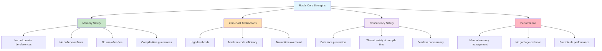

**Key Insight**: Rust achieves what was previously thought impossible - memory safety without garbage collection. This makes it ideal for systems programming, embedded systems, and performance-critical applications.

### The Ownership Revolution

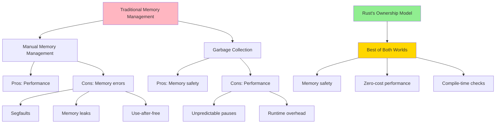

This implementation showcases how Rust's type system and ownership model create both safe and performant data structures.

## Core Data Structures: The Rust Advantage

### Understanding Rust's Memory Model

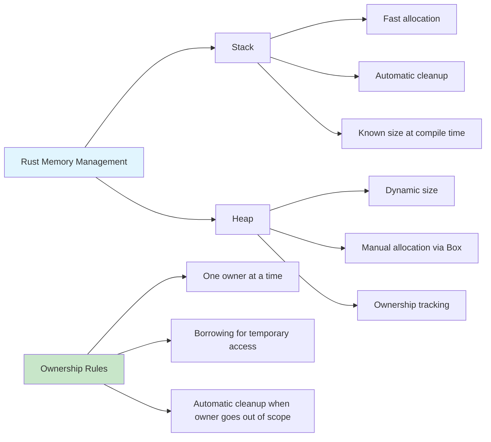

### 1. Dynamic Array (Vec-like) Implementation

**Memory Layout Visualization:**

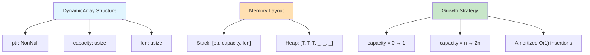

```rust
use std::alloc::{self, Layout};
use std::ptr::{self, NonNull};
use std::mem;

/// A dynamic array implementation similar to Vec<T>
/// Demonstrates manual memory management with Rust's safety guarantees
pub struct DynamicArray<T> {
    ptr: NonNull<T>,
    capacity: usize,
    len: usize,
}

impl<T> DynamicArray<T> {
    /// Create a new empty dynamic array
    pub fn new() -> Self {
        Self {
            ptr: NonNull::dangling(),
            capacity: 0,
            len: 0,
        }
    }

    /// Create a new dynamic array with specified capacity
    pub fn with_capacity(capacity: usize) -> Self {
        if capacity == 0 {
            Self::new()
        } else {
            let layout = Layout::array::<T>(capacity).expect("Layout calculation failed");
            let ptr = unsafe { alloc::alloc(layout) as *mut T };
            
            if ptr.is_null() {
                alloc::handle_alloc_error(layout);
            }

            Self {
                ptr: unsafe { NonNull::new_unchecked(ptr) },
                capacity,
                len: 0,
            }
        }
    }

    /// Get the number of elements
    pub fn len(&self) -> usize {
        self.len
    }

    /// Check if the array is empty
    pub fn is_empty(&self) -> bool {
        self.len == 0
    }

    /// Get the current capacity
    pub fn capacity(&self) -> usize {
        self.capacity
    }

    /// Add an element to the end of the array
    pub fn push(&mut self, value: T) {
        if self.len == self.capacity {
            self.grow();
        }

        unsafe {
            self.ptr.as_ptr().add(self.len).write(value);
        }
        self.len += 1;
    }

    /// Remove and return the last element
    pub fn pop(&mut self) -> Option<T> {
        if self.len == 0 {
            None
        } else {
            self.len -= 1;
            unsafe {
                Some(self.ptr.as_ptr().add(self.len).read())
            }
        }
    }

    /// Get element at index
    pub fn get(&self, index: usize) -> Option<&T> {
        if index < self.len {
            unsafe {
                Some(&*self.ptr.as_ptr().add(index))
            }
        } else {
            None
        }
    }

    /// Get mutable reference to element at index
    pub fn get_mut(&mut self, index: usize) -> Option<&mut T> {
        if index < self.len {
            unsafe {
                Some(&mut *self.ptr.as_ptr().add(index))
            }
        } else {
            None
        }
    }

    /// Insert element at specific index
    pub fn insert(&mut self, index: usize, value: T) {
        assert!(index <= self.len, "Index out of bounds");

        if self.len == self.capacity {
            self.grow();
        }

        unsafe {
            // Shift elements to the right
            let ptr = self.ptr.as_ptr().add(index);
            ptr::copy(ptr, ptr.add(1), self.len - index);
            ptr.write(value);
        }
        self.len += 1;
    }

    /// Remove element at specific index
    pub fn remove(&mut self, index: usize) -> T {
        assert!(index < self.len, "Index out of bounds");

        unsafe {
            let ptr = self.ptr.as_ptr().add(index);
            let value = ptr.read();
            
            // Shift elements to the left
            ptr::copy(ptr.add(1), ptr, self.len - index - 1);
            
            self.len -= 1;
            value
        }
    }

    /// Grow the array capacity
    fn grow(&mut self) {
        let new_capacity = if self.capacity == 0 { 1 } else { self.capacity * 2 };
        self.resize(new_capacity);
    }

    /// Resize the array to new capacity
    fn resize(&mut self, new_capacity: usize) {
        let new_layout = Layout::array::<T>(new_capacity).expect("Layout calculation failed");
        
        let new_ptr = if self.capacity == 0 {
            unsafe { alloc::alloc(new_layout) as *mut T }
        } else {
            let old_layout = Layout::array::<T>(self.capacity).expect("Layout calculation failed");
            unsafe {
                alloc::realloc(
                    self.ptr.as_ptr() as *mut u8,
                    old_layout,
                    new_layout.size(),
                ) as *mut T
            }
        };

        if new_ptr.is_null() {
            alloc::handle_alloc_error(new_layout);
        }

        self.ptr = unsafe { NonNull::new_unchecked(new_ptr) };
        self.capacity = new_capacity;
    }

    /// Get iterator over elements
    pub fn iter(&self) -> DynamicArrayIter<T> {
        DynamicArrayIter {
            ptr: self.ptr.as_ptr(),
            end: if self.len == 0 {
                self.ptr.as_ptr()
            } else {
                unsafe { self.ptr.as_ptr().add(self.len) }
            },
            _phantom: std::marker::PhantomData,
        }
    }
}

impl<T> Drop for DynamicArray<T> {
    fn drop(&mut self) {
        if self.capacity > 0 {
            // Drop all elements
            while let Some(_) = self.pop() {}

            // Deallocate memory
            let layout = Layout::array::<T>(self.capacity).expect("Layout calculation failed");
            unsafe {
                alloc::dealloc(self.ptr.as_ptr() as *mut u8, layout);
            }
        }
    }
}

/// Iterator for DynamicArray
pub struct DynamicArrayIter<T> {
    ptr: *const T,
    end: *const T,
    _phantom: std::marker::PhantomData<T>,
}

impl<T> Iterator for DynamicArrayIter<T> {
    type Item = &'static T;

    fn next(&mut self) -> Option<Self::Item> {
        if self.ptr == self.end {
            None
        } else {
            unsafe {
                let current = &*self.ptr;
                self.ptr = self.ptr.add(1);
                Some(current)
            }
        }
    }
}

impl<T> std::ops::Index<usize> for DynamicArray<T> {
    type Output = T;

    fn index(&self, index: usize) -> &Self::Output {
        self.get(index).expect("Index out of bounds")
    }
}

impl<T> std::ops::IndexMut<usize> for DynamicArray<T> {
    fn index_mut(&mut self, index: usize) -> &mut Self::Output {
        self.get_mut(index).expect("Index out of bounds")
    }
}

// Safety: DynamicArray is safe to send between threads if T is Send
unsafe impl<T: Send> Send for DynamicArray<T> {}
unsafe impl<T: Sync> Sync for DynamicArray<T> {}

#[cfg(test)]
mod dynamic_array_tests {
    use super::*;

    #[test]
    fn test_push_and_pop() {
        let mut arr = DynamicArray::new();
        
        arr.push(1);
        arr.push(2);
        arr.push(3);
        
        assert_eq!(arr.len(), 3);
        assert_eq!(arr.pop(), Some(3));
        assert_eq!(arr.pop(), Some(2));
        assert_eq!(arr.len(), 1);
    }

    #[test]
    fn test_indexing() {
        let mut arr = DynamicArray::new();
        arr.push(10);
        arr.push(20);
        
        assert_eq!(arr[0], 10);
        assert_eq!(arr[1], 20);
        
        arr[1] = 25;
        assert_eq!(arr[1], 25);
    }

    #[test]
    fn test_capacity_growth() {
        let mut arr = DynamicArray::with_capacity(2);
        
        arr.push(1);
        arr.push(2);
        assert_eq!(arr.capacity(), 2);
        
        arr.push(3); // Should trigger growth
        assert!(arr.capacity() > 2);
    }
}
```

### 2. Hash Map Implementation

**Hash Map Architecture:**

```mermaid
graph TD
    A[HashMap Structure] --> B[buckets: Vec<Vec<(K,V)>>]
    A --> C[len: usize]
    A --> D[capacity: usize]
    A --> E[load_factor_threshold: f64]
    
    F[Collision Resolution] --> G[Separate Chaining]
    G --> G1[Each bucket is a Vec]
    G1 --> G2[O(1) average case]
    G1 --> G3[O(n) worst case]
    
    H[Hash Function Pipeline] --> I[Key]
    I --> J[DefaultHasher::hash]
    J --> K[hash % capacity]
    K --> L[Bucket Index]
    
    M[Resize Strategy] --> N["Load Factor > 0.75"]
    N --> O["Double capacity"]
    O --> P["Rehash all elements"]
    
    style A fill:#E1F5FE
    style F fill:#FFE0B2
    style H fill:#C8E6C9
    style M fill:#F3E5F5
```

```rust
use std::collections::hash_map::DefaultHasher;
use std::hash::{Hash, Hasher};
use std::mem;

/// A hash map implementation using separate chaining
/// Demonstrates ownership, borrowing, and generic constraints
pub struct HashMap<K, V> {
    buckets: Vec<Vec<(K, V)>>,
    len: usize,
    capacity: usize,
    load_factor_threshold: f64,
}

impl<K, V> HashMap<K, V>
where
    K: Hash + Eq + Clone,
{
    /// Create a new hash map
    pub fn new() -> Self {
        Self::with_capacity(16)
    }

    /// Create a new hash map with specified capacity
    pub fn with_capacity(capacity: usize) -> Self {
        let capacity = capacity.max(1);
        Self {
            buckets: (0..capacity).map(|_| Vec::new()).collect(),
            len: 0,
            capacity,
            load_factor_threshold: 0.75,
        }
    }

    /// Get the number of key-value pairs
    pub fn len(&self) -> usize {
        self.len
    }

    /// Check if the map is empty
    pub fn is_empty(&self) -> bool {
        self.len == 0
    }

    /// Get the current capacity
    pub fn capacity(&self) -> usize {
        self.capacity
    }

    /// Calculate hash for a key
    fn hash(&self, key: &K) -> usize {
        let mut hasher = DefaultHasher::new();
        key.hash(&mut hasher);
        (hasher.finish() as usize) % self.capacity
    }

    /// Insert a key-value pair
    pub fn insert(&mut self, key: K, value: V) -> Option<V> {
        if self.should_resize() {
            self.resize();
        }

        let hash = self.hash(&key);
        let bucket = &mut self.buckets[hash];

        // Check if key already exists
        for (existing_key, existing_value) in bucket.iter_mut() {
            if *existing_key == key {
                return Some(mem::replace(existing_value, value));
            }
        }

        // Key doesn't exist, add new entry
        bucket.push((key, value));
        self.len += 1;
        None
    }

    /// Get a reference to the value associated with a key
    pub fn get(&self, key: &K) -> Option<&V> {
        let hash = self.hash(key);
        let bucket = &self.buckets[hash];

        for (existing_key, value) in bucket {
            if existing_key == key {
                return Some(value);
            }
        }
        None
    }

    /// Get a mutable reference to the value associated with a key
    pub fn get_mut(&mut self, key: &K) -> Option<&mut V> {
        let hash = self.hash(key);
        let bucket = &mut self.buckets[hash];

        for (existing_key, value) in bucket {
            if existing_key == key {
                return Some(value);
            }
        }
        None
    }

    /// Remove a key-value pair
    pub fn remove(&mut self, key: &K) -> Option<V> {
        let hash = self.hash(key);
        let bucket = &mut self.buckets[hash];

        for (i, (existing_key, _)) in bucket.iter().enumerate() {
            if existing_key == key {
                let (_, value) = bucket.remove(i);
                self.len -= 1;
                return Some(value);
            }
        }
        None
    }

    /// Check if a key exists
    pub fn contains_key(&self, key: &K) -> bool {
        self.get(key).is_some()
    }

    /// Get an iterator over key-value pairs
    pub fn iter(&self) -> HashMapIter<K, V> {
        HashMapIter {
            buckets: &self.buckets,
            bucket_index: 0,
            item_index: 0,
        }
    }

    /// Check if resize is needed
    fn should_resize(&self) -> bool {
        (self.len as f64 / self.capacity as f64) > self.load_factor_threshold
    }

    /// Resize the hash map
    fn resize(&mut self) {
        let old_buckets = mem::replace(
            &mut self.buckets,
            (0..self.capacity * 2).map(|_| Vec::new()).collect(),
        );
        
        let old_capacity = self.capacity;
        self.capacity *= 2;
        self.len = 0;

        // Rehash all existing items
        for bucket in old_buckets {
            for (key, value) in bucket {
                self.insert(key, value);
            }
        }
    }

    /// Get performance statistics
    pub fn stats(&self) -> HashMapStats {
        let bucket_sizes: Vec<usize> = self.buckets.iter().map(|b| b.len()).collect();
        let max_bucket_size = bucket_sizes.iter().max().copied().unwrap_or(0);
        let empty_buckets = bucket_sizes.iter().filter(|&&size| size == 0).count();
        let avg_bucket_size = self.len as f64 / self.capacity as f64;

        HashMapStats {
            len: self.len,
            capacity: self.capacity,
            load_factor: avg_bucket_size,
            max_bucket_size,
            empty_buckets,
            avg_bucket_size,
        }
    }
}

/// Performance statistics for HashMap
#[derive(Debug)]
pub struct HashMapStats {
    pub len: usize,
    pub capacity: usize,
    pub load_factor: f64,
    pub max_bucket_size: usize,
    pub empty_buckets: usize,
    pub avg_bucket_size: f64,
}

/// Iterator for HashMap
pub struct HashMapIter<'a, K, V> {
    buckets: &'a [Vec<(K, V)>],
    bucket_index: usize,
    item_index: usize,
}

impl<'a, K, V> Iterator for HashMapIter<'a, K, V> {
    type Item = (&'a K, &'a V);

    fn next(&mut self) -> Option<Self::Item> {
        while self.bucket_index < self.buckets.len() {
            let bucket = &self.buckets[self.bucket_index];
            
            if self.item_index < bucket.len() {
                let (ref key, ref value) = bucket[self.item_index];
                self.item_index += 1;
                return Some((key, value));
            }
            
            self.bucket_index += 1;
            self.item_index = 0;
        }
        None
    }
}

impl<K, V> Default for HashMap<K, V>
where
    K: Hash + Eq + Clone,
{
    fn default() -> Self {
        Self::new()
    }
}

#[cfg(test)]
mod hashmap_tests {
    use super::*;

    #[test]
    fn test_insert_and_get() {
        let mut map = HashMap::new();
        
        assert_eq!(map.insert("key1".to_string(), 100), None);
        assert_eq!(map.insert("key2".to_string(), 200), None);
        
        assert_eq!(map.get(&"key1".to_string()), Some(&100));
        assert_eq!(map.get(&"key2".to_string()), Some(&200));
        assert_eq!(map.get(&"key3".to_string()), None);
    }

    #[test]
    fn test_update_existing() {
        let mut map = HashMap::new();
        
        map.insert("key".to_string(), 100);
        let old_value = map.insert("key".to_string(), 200);
        
        assert_eq!(old_value, Some(100));
        assert_eq!(map.get(&"key".to_string()), Some(&200));
    }

    #[test]
    fn test_remove() {
        let mut map = HashMap::new();
        
        map.insert("key".to_string(), 100);
        assert_eq!(map.remove(&"key".to_string()), Some(100));
        assert_eq!(map.remove(&"key".to_string()), None);
        assert_eq!(map.get(&"key".to_string()), None);
    }
}
```

### 3. Binary Search Tree Implementation

**Tree Structure and Operations:**

```mermaid
graph TD
    A[BST Node Structure] --> B["value: T"]
    A --> C["left: Option<Box<TreeNode<T>>>"]
    A --> D["right: Option<Box<TreeNode<T>>>"]
    
    E[BST Properties] --> F["Left subtree < node"]
    E --> G["Right subtree > node"]
    E --> H["In-order traversal = sorted"]
    
    I[Box<T> Benefits] --> J["Heap allocation"]
    I --> K["Recursive structures"]
    I --> L["Owned heap data"]
    
    M[Option<T> Safety] --> N["No null pointers"]
    M --> O["Compile-time null checks"]
    M --> P["Pattern matching"]
    
    style A fill:#E1F5FE
    style E fill:#C8E6C9
    style I fill:#FFE0B2
    style M fill:#F3E5F5
```

**Tree Traversal Algorithms:**

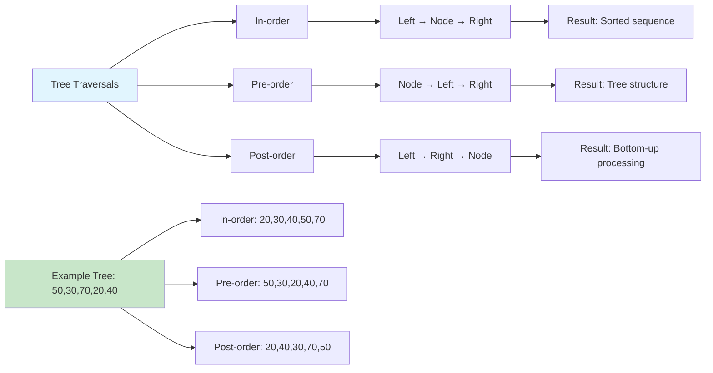

```rust
use std::cmp::Ordering;

/// A node in the binary search tree
#[derive(Debug, Clone)]
struct TreeNode<T> {
    value: T,
    left: Option<Box<TreeNode<T>>>,
    right: Option<Box<TreeNode<T>>>,
}

impl<T> TreeNode<T> {
    fn new(value: T) -> Self {
        TreeNode {
            value,
            left: None,
            right: None,
        }
    }
}

/// A binary search tree implementation
/// Demonstrates recursive algorithms and ownership with Box<T>
pub struct BinarySearchTree<T> {
    root: Option<Box<TreeNode<T>>>,
    len: usize,
}

impl<T> BinarySearchTree<T>
where
    T: Ord + Clone,
{
    /// Create a new empty tree
    pub fn new() -> Self {
        BinarySearchTree {
            root: None,
            len: 0,
        }
    }

    /// Get the number of nodes
    pub fn len(&self) -> usize {
        self.len
    }

    /// Check if the tree is empty
    pub fn is_empty(&self) -> bool {
        self.len == 0
    }

    /// Insert a value into the tree
    pub fn insert(&mut self, value: T) {
        if self.insert_recursive(&mut self.root, value) {
            self.len += 1;
        }
    }

    /// Recursive helper for insertion
    fn insert_recursive(&mut self, node: &mut Option<Box<TreeNode<T>>>, value: T) -> bool {
        match node {
            None => {
                *node = Some(Box::new(TreeNode::new(value)));
                true
            }
            Some(ref mut n) => match value.cmp(&n.value) {
                Ordering::Less => self.insert_recursive(&mut n.left, value),
                Ordering::Greater => self.insert_recursive(&mut n.right, value),
                Ordering::Equal => false, // Don't insert duplicates
            },
        }
    }

    /// Search for a value in the tree
    pub fn contains(&self, value: &T) -> bool {
        self.search_recursive(&self.root, value)
    }

    /// Recursive helper for search
    fn search_recursive(&self, node: &Option<Box<TreeNode<T>>>, value: &T) -> bool {
        match node {
            None => false,
            Some(n) => match value.cmp(&n.value) {
                Ordering::Less => self.search_recursive(&n.left, value),
                Ordering::Greater => self.search_recursive(&n.right, value),
                Ordering::Equal => true,
            },
        }
    }

    /// Remove a value from the tree
    pub fn remove(&mut self, value: &T) -> bool {
        let removed = self.remove_recursive(&mut self.root, value);
        if removed {
            self.len -= 1;
        }
        removed
    }

    /// Recursive helper for removal
    fn remove_recursive(&mut self, node: &mut Option<Box<TreeNode<T>>>, value: &T) -> bool {
        match node {
            None => false,
            Some(ref mut n) => match value.cmp(&n.value) {
                Ordering::Less => self.remove_recursive(&mut n.left, value),
                Ordering::Greater => self.remove_recursive(&mut n.right, value),
                Ordering::Equal => {
                    // Found the node to remove
                    match (n.left.take(), n.right.take()) {
                        (None, None) => {
                            *node = None;
                        }
                        (Some(left), None) => {
                            *node = Some(left);
                        }
                        (None, Some(right)) => {
                            *node = Some(right);
                        }
                        (Some(left), Some(right)) => {
                            // Find the inorder successor (minimum in right subtree)
                            let min_right = Self::extract_min(&mut Some(right));
                            n.value = min_right.value;
                            n.left = Some(left);
                            n.right = min_right.right;
                        }
                    }
                    true
                }
            },
        }
    }

    /// Extract the minimum node from a subtree
    fn extract_min(node: &mut Option<Box<TreeNode<T>>>) -> Box<TreeNode<T>> {
        match node {
            Some(ref mut n) if n.left.is_some() => Self::extract_min(&mut n.left),
            Some(_) => node.take().unwrap(),
            None => panic!("Cannot extract min from empty tree"),
        }
    }

    /// Find the minimum value
    pub fn min(&self) -> Option<&T> {
        self.min_recursive(&self.root)
    }

    fn min_recursive(&self, node: &Option<Box<TreeNode<T>>>) -> Option<&T> {
        match node {
            None => None,
            Some(n) => {
                if n.left.is_some() {
                    self.min_recursive(&n.left)
                } else {
                    Some(&n.value)
                }
            }
        }
    }

    /// Find the maximum value
    pub fn max(&self) -> Option<&T> {
        self.max_recursive(&self.root)
    }

    fn max_recursive(&self, node: &Option<Box<TreeNode<T>>>) -> Option<&T> {
        match node {
            None => None,
            Some(n) => {
                if n.right.is_some() {
                    self.max_recursive(&n.right)
                } else {
                    Some(&n.value)
                }
            }
        }
    }

    /// Get height of the tree
    pub fn height(&self) -> usize {
        self.height_recursive(&self.root)
    }

    fn height_recursive(&self, node: &Option<Box<TreeNode<T>>>) -> usize {
        match node {
            None => 0,
            Some(n) => {
                1 + std::cmp::max(
                    self.height_recursive(&n.left),
                    self.height_recursive(&n.right),
                )
            }
        }
    }

    /// In-order traversal (sorted order)
    pub fn inorder(&self) -> Vec<T> {
        let mut result = Vec::new();
        self.inorder_recursive(&self.root, &mut result);
        result
    }

    fn inorder_recursive(&self, node: &Option<Box<TreeNode<T>>>, result: &mut Vec<T>) {
        if let Some(n) = node {
            self.inorder_recursive(&n.left, result);
            result.push(n.value.clone());
            self.inorder_recursive(&n.right, result);
        }
    }

    /// Pre-order traversal
    pub fn preorder(&self) -> Vec<T> {
        let mut result = Vec::new();
        self.preorder_recursive(&self.root, &mut result);
        result
    }

    fn preorder_recursive(&self, node: &Option<Box<TreeNode<T>>>, result: &mut Vec<T>) {
        if let Some(n) = node {
            result.push(n.value.clone());
            self.preorder_recursive(&n.left, result);
            self.preorder_recursive(&n.right, result);
        }
    }

    /// Post-order traversal
    pub fn postorder(&self) -> Vec<T> {
        let mut result = Vec::new();
        self.postorder_recursive(&self.root, &mut result);
        result
    }

    fn postorder_recursive(&self, node: &Option<Box<TreeNode<T>>>, result: &mut Vec<T>) {
        if let Some(n) = node {
            self.postorder_recursive(&n.left, result);
            self.postorder_recursive(&n.right, result);
            result.push(n.value.clone());
        }
    }
}

impl<T> Default for BinarySearchTree<T>
where
    T: Ord + Clone,
{
    fn default() -> Self {
        Self::new()
    }
}

#[cfg(test)]
mod bst_tests {
    use super::*;

    #[test]
    fn test_insert_and_search() {
        let mut bst = BinarySearchTree::new();
        
        bst.insert(50);
        bst.insert(30);
        bst.insert(70);
        bst.insert(20);
        bst.insert(40);
        
        assert_eq!(bst.len(), 5);
        assert!(bst.contains(&30));
        assert!(bst.contains(&70));
        assert!(!bst.contains(&60));
    }

    #[test]
    fn test_traversals() {
        let mut bst = BinarySearchTree::new();
        let values = vec![50, 30, 70, 20, 40, 60, 80];
        
        for value in values {
            bst.insert(value);
        }
        
        let inorder = bst.inorder();
        assert_eq!(inorder, vec![20, 30, 40, 50, 60, 70, 80]);
        
        let preorder = bst.preorder();
        assert_eq!(preorder[0], 50); // Root should be first
    }

    #[test]
    fn test_min_max() {
        let mut bst = BinarySearchTree::new();
        
        assert_eq!(bst.min(), None);
        assert_eq!(bst.max(), None);
        
        bst.insert(50);
        bst.insert(30);
        bst.insert(70);
        
        assert_eq!(bst.min(), Some(&30));
        assert_eq!(bst.max(), Some(&70));
    }
}
```

## Essential Algorithms: Performance-Optimized Implementations

### Algorithm Complexity Comparison

```mermaid
graph TD
    A[Sorting Algorithms Performance] --> B["Bubble Sort O(n²)"]
    A --> C["Insertion Sort O(n²)"]
    A --> D["Merge Sort O(n log n)"]
    A --> E["Quick Sort O(n log n) avg"]
    A --> F["Heap Sort O(n log n)"]
    A --> G["Counting Sort O(n + k)"]
    
    H[When to Use Each] --> I["Bubble: Educational only"]
    H --> J["Insertion: Small/nearly sorted"]
    H --> K["Merge: Stable, predictable"]
    H --> L["Quick: General purpose, fast"]
    H --> M["Heap: Worst-case guarantees"]
    H --> N["Counting: Integer range known"]
    
    O[Memory Usage] --> P["In-place: Bubble, Insertion, Heap, Quick"]
    O --> Q["Extra space: Merge O(n), Counting O(k)"]
    
    style A fill:#E1F5FE
    style H fill:#FFE0B2
    style O fill:#C8E6C9
```

### 1. Sorting Algorithms

**Rust-Specific Optimizations:**

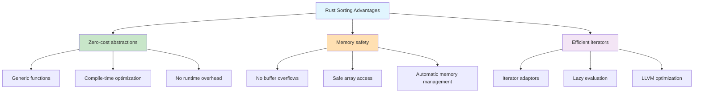

```rust
/// Collection of sorting algorithms implemented in Rust
/// Demonstrates different algorithmic approaches and performance characteristics
pub struct SortingAlgorithms;

impl SortingAlgorithms {
    /// Bubble sort - O(n²) time, O(1) space
    /// Simple but inefficient, good for educational purposes
    pub fn bubble_sort<T: Ord + Clone>(arr: &[T]) -> Vec<T> {
        let mut result = arr.to_vec();
        let n = result.len();

        for i in 0..n {
            let mut swapped = false;
            for j in 0..n - i - 1 {
                if result[j] > result[j + 1] {
                    result.swap(j, j + 1);
                    swapped = true;
                }
            }
            if !swapped {
                break; // Early termination if array is sorted
            }
        }

        result
    }

    /// Insertion sort - O(n²) worst case, O(n) best case, O(1) space
    /// Excellent for small arrays and nearly sorted data
    pub fn insertion_sort<T: Ord + Clone>(arr: &[T]) -> Vec<T> {
        let mut result = arr.to_vec();

        for i in 1..result.len() {
            let key = result[i].clone();
            let mut j = i;

            while j > 0 && result[j - 1] > key {
                result[j] = result[j - 1].clone();
                j -= 1;
            }
            result[j] = key;
        }

        result
    }

    /// Merge sort - O(n log n) time, O(n) space
    /// Stable sort with predictable performance
    pub fn merge_sort<T: Ord + Clone>(arr: &[T]) -> Vec<T> {
        if arr.len() <= 1 {
            return arr.to_vec();
        }

        let mid = arr.len() / 2;
        let left = Self::merge_sort(&arr[..mid]);
        let right = Self::merge_sort(&arr[mid..]);

        Self::merge(&left, &right)
    }

    /// Merge two sorted arrays
    fn merge<T: Ord + Clone>(left: &[T], right: &[T]) -> Vec<T> {
        let mut result = Vec::with_capacity(left.len() + right.len());
        let mut left_iter = left.iter();
        let mut right_iter = right.iter();
        let mut left_peek = left_iter.next();
        let mut right_peek = right_iter.next();

        loop {
            match (left_peek, right_peek) {
                (Some(l), Some(r)) => {
                    if l <= r {
                        result.push(l.clone());
                        left_peek = left_iter.next();
                    } else {
                        result.push(r.clone());
                        right_peek = right_iter.next();
                    }
                }
                (Some(l), None) => {
                    result.push(l.clone());
                    result.extend(left_iter.cloned());
                    break;
                }
                (None, Some(r)) => {
                    result.push(r.clone());
                    result.extend(right_iter.cloned());
                    break;
                }
                (None, None) => break,
            }
        }

        result
    }

    /// Quick sort - O(n log n) average, O(n²) worst case, O(log n) space
    /// Fast in practice, cache-friendly
    pub fn quick_sort<T: Ord + Clone>(arr: &[T]) -> Vec<T> {
        if arr.len() <= 1 {
            return arr.to_vec();
        }

        let pivot_index = arr.len() / 2;
        let pivot = &arr[pivot_index];

        let mut less = Vec::new();
        let mut equal = Vec::new();
        let mut greater = Vec::new();

        for item in arr {
            match item.cmp(pivot) {
                Ordering::Less => less.push(item.clone()),
                Ordering::Equal => equal.push(item.clone()),
                Ordering::Greater => greater.push(item.clone()),
            }
        }

        let mut result = Self::quick_sort(&less);
        result.extend(equal);
        result.extend(Self::quick_sort(&greater));
        result
    }

    /// Heap sort - O(n log n) time, O(1) space
    /// Not stable but good worst-case guarantees
    pub fn heap_sort<T: Ord + Clone>(arr: &[T]) -> Vec<T> {
        let mut result = arr.to_vec();
        let n = result.len();

        // Build max heap
        for i in (0..n / 2).rev() {
            Self::heapify(&mut result, n, i);
        }

        // Extract elements from heap one by one
        for i in (1..n).rev() {
            result.swap(0, i);
            Self::heapify(&mut result, i, 0);
        }

        result
    }

    /// Maintain heap property
    fn heapify<T: Ord>(arr: &mut [T], n: usize, i: usize) {
        let mut largest = i;
        let left = 2 * i + 1;
        let right = 2 * i + 2;

        if left < n && arr[left] > arr[largest] {
            largest = left;
        }

        if right < n && arr[right] > arr[largest] {
            largest = right;
        }

        if largest != i {
            arr.swap(i, largest);
            Self::heapify(arr, n, largest);
        }
    }

    /// Counting sort for u32 values - O(n + k) time, O(k) space
    /// Only works with unsigned integers in a known range
    pub fn counting_sort(arr: &[u32]) -> Vec<u32> {
        if arr.is_empty() {
            return Vec::new();
        }

        let max_value = *arr.iter().max().unwrap() as usize;
        let mut count = vec![0; max_value + 1];

        // Count occurrences
        for &value in arr {
            count[value as usize] += 1;
        }

        // Build result
        let mut result = Vec::with_capacity(arr.len());
        for (value, &freq) in count.iter().enumerate() {
            for _ in 0..freq {
                result.push(value as u32);
            }
        }

        result
    }

    /// Benchmark sorting algorithms
    pub fn benchmark_sort<T, F>(name: &str, sort_fn: F, data: &[T]) -> std::time::Duration
    where
        T: Clone,
        F: Fn(&[T]) -> Vec<T>,
    {
        let start = std::time::Instant::now();
        let _sorted = sort_fn(data);
        start.elapsed()
    }
}

#[cfg(test)]
mod sorting_tests {
    use super::*;

    #[test]
    fn test_all_sorts_correctness() {
        let test_data = vec![64, 34, 25, 12, 22, 11, 90, 5];
        let expected = {
            let mut sorted = test_data.clone();
            sorted.sort();
            sorted
        };

        assert_eq!(SortingAlgorithms::bubble_sort(&test_data), expected);
        assert_eq!(SortingAlgorithms::insertion_sort(&test_data), expected);
        assert_eq!(SortingAlgorithms::merge_sort(&test_data), expected);
        assert_eq!(SortingAlgorithms::quick_sort(&test_data), expected);
        assert_eq!(SortingAlgorithms::heap_sort(&test_data), expected);
    }

    #[test]
    fn test_counting_sort() {
        let test_data = vec![4, 2, 2, 8, 3, 3, 1];
        let result = SortingAlgorithms::counting_sort(&test_data);
        let expected = vec![1, 2, 2, 3, 3, 4, 8];
        assert_eq!(result, expected);
    }

    #[test]
    fn test_empty_arrays() {
        let empty: Vec<i32> = vec![];
        assert_eq!(SortingAlgorithms::merge_sort(&empty), empty);
        assert_eq!(SortingAlgorithms::quick_sort(&empty), empty);
    }
}
```

### 2. Search Algorithms

**Search Strategy Decision Tree:**

```mermaid
flowchart TD
    A[Choose Search Algorithm] --> B{Is data sorted?}
    B -->|No| C[Linear Search O(n)]
    B -->|Yes| D{Simple search?}
    
    D -->|Yes| E[Binary Search O(log n)]
    D -->|No| F{Special requirements?}
    
    F --> G[Find first occurrence]
    F --> H[Find last occurrence]
    F --> I[Find range]
    F --> J[Find insertion point]
    F --> K[Search rotated array]
    
    L[Data Structure] --> M{Array properties?}
    M --> N["Sorted: Binary search variants"]
    M --> O["Rotated: Modified binary search"]
    M --> P["With duplicates: Range finding"]
    M --> Q["Peak finding: Specialized binary search"]
    
    style A fill:#E1F5FE
    style L fill:#FFE0B2
```

**Binary Search Variants Visualization:**

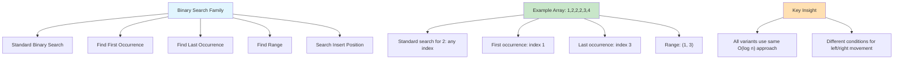

```rust
/// Collection of search algorithms
/// Demonstrates different search strategies and their use cases
pub struct SearchAlgorithms;

impl SearchAlgorithms {
    /// Linear search - O(n) time, O(1) space
    /// Works on unsorted data
    pub fn linear_search<T: PartialEq>(arr: &[T], target: &T) -> Option<usize> {
        arr.iter().position(|x| x == target)
    }

    /// Binary search - O(log n) time, O(1) space
    /// Requires sorted data
    pub fn binary_search<T: Ord>(arr: &[T], target: &T) -> Option<usize> {
        let mut left = 0;
        let mut right = arr.len();

        while left < right {
            let mid = left + (right - left) / 2;

            match arr[mid].cmp(target) {
                Ordering::Equal => return Some(mid),
                Ordering::Less => left = mid + 1,
                Ordering::Greater => right = mid,
            }
        }

        None
    }

    /// Recursive binary search - O(log n) time, O(log n) space
    pub fn binary_search_recursive<T: Ord>(
        arr: &[T],
        target: &T,
        left: usize,
        right: usize,
    ) -> Option<usize> {
        if left >= right {
            return None;
        }

        let mid = left + (right - left) / 2;

        match arr[mid].cmp(target) {
            Ordering::Equal => Some(mid),
            Ordering::Less => Self::binary_search_recursive(arr, target, mid + 1, right),
            Ordering::Greater => Self::binary_search_recursive(arr, target, left, mid),
        }
    }

    /// Find first occurrence of target in sorted array with duplicates
    pub fn find_first_occurrence<T: Ord>(arr: &[T], target: &T) -> Option<usize> {
        let mut left = 0;
        let mut right = arr.len();
        let mut result = None;

        while left < right {
            let mid = left + (right - left) / 2;

            match arr[mid].cmp(target) {
                Ordering::Equal => {
                    result = Some(mid);
                    right = mid; // Continue searching left
                }
                Ordering::Less => left = mid + 1,
                Ordering::Greater => right = mid,
            }
        }

        result
    }

    /// Find last occurrence of target in sorted array with duplicates
    pub fn find_last_occurrence<T: Ord>(arr: &[T], target: &T) -> Option<usize> {
        let mut left = 0;
        let mut right = arr.len();
        let mut result = None;

        while left < right {
            let mid = left + (right - left) / 2;

            match arr[mid].cmp(target) {
                Ordering::Equal => {
                    result = Some(mid);
                    left = mid + 1; // Continue searching right
                }
                Ordering::Less => left = mid + 1,
                Ordering::Greater => right = mid,
            }
        }

        result
    }

    /// Find range of target values [first, last]
    pub fn find_range<T: Ord>(arr: &[T], target: &T) -> Option<(usize, usize)> {
        let first = Self::find_first_occurrence(arr, target)?;
        let last = Self::find_last_occurrence(arr, target)?;
        Some((first, last))
    }

    /// Find insertion position to maintain sorted order
    pub fn search_insert_position<T: Ord>(arr: &[T], target: &T) -> usize {
        let mut left = 0;
        let mut right = arr.len();

        while left < right {
            let mid = left + (right - left) / 2;

            if arr[mid] < *target {
                left = mid + 1;
            } else {
                right = mid;
            }
        }

        left
    }

    /// Find a peak element (greater than or equal to neighbors)
    pub fn find_peak_element<T: Ord>(arr: &[T]) -> Option<usize> {
        if arr.is_empty() {
            return None;
        }

        let mut left = 0;
        let mut right = arr.len() - 1;

        while left < right {
            let mid = left + (right - left) / 2;

            if arr[mid] < arr[mid + 1] {
                left = mid + 1; // Peak is on the right
            } else {
                right = mid; // Peak is on the left (or at mid)
            }
        }

        Some(left)
    }

    /// Search in rotated sorted array
    pub fn search_rotated_sorted<T: Ord + Clone>(arr: &[T], target: &T) -> Option<usize> {
        let mut left = 0;
        let mut right = arr.len();

        while left < right {
            let mid = left + (right - left) / 2;

            if arr[mid] == *target {
                return Some(mid);
            }

            // Determine which half is sorted
            if arr[left] <= arr[mid] {
                // Left half is sorted
                if arr[left] <= *target && *target < arr[mid] {
                    right = mid;
                } else {
                    left = mid + 1;
                }
            } else {
                // Right half is sorted
                if arr[mid] < *target && *target <= arr[right - 1] {
                    left = mid + 1;
                } else {
                    right = mid;
                }
            }
        }

        None
    }
}

#[cfg(test)]
mod search_tests {
    use super::*;

    #[test]
    fn test_linear_search() {
        let arr = vec![5, 2, 8, 1, 9];
        assert_eq!(SearchAlgorithms::linear_search(&arr, &8), Some(2));
        assert_eq!(SearchAlgorithms::linear_search(&arr, &10), None);
    }

    #[test]
    fn test_binary_search() {
        let arr = vec![1, 3, 5, 7, 9, 11, 13, 15];
        assert_eq!(SearchAlgorithms::binary_search(&arr, &7), Some(3));
        assert_eq!(SearchAlgorithms::binary_search(&arr, &6), None);
    }

    #[test]
    fn test_find_range() {
        let arr = vec![1, 2, 2, 2, 3, 4, 4, 5];
        assert_eq!(SearchAlgorithms::find_range(&arr, &2), Some((1, 3)));
        assert_eq!(SearchAlgorithms::find_range(&arr, &4), Some((5, 6)));
        assert_eq!(SearchAlgorithms::find_range(&arr, &6), None);
    }

    #[test]
    fn test_rotated_search() {
        let arr = vec![4, 5, 6, 7, 0, 1, 2];
        assert_eq!(SearchAlgorithms::search_rotated_sorted(&arr, &0), Some(4));
        assert_eq!(SearchAlgorithms::search_rotated_sorted(&arr, &3), None);
    }
}
```

## Advanced Patterns and Utilities: Rust's Distinctive Features

### Rust's Error Handling Philosophy

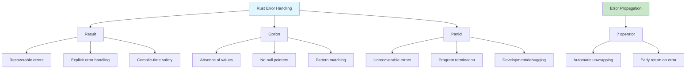

### 1. Result-Based Error Handling

```rust
/// Demonstrates Rust's Result-based error handling for data structures
#[derive(Debug, PartialEq)]
pub enum DataStructureError {
    IndexOutOfBounds(usize),
    EmptyStructure,
    KeyNotFound,
    InvalidOperation(String),
}

impl std::fmt::Display for DataStructureError {
    fn fmt(&self, f: &mut std::fmt::Formatter) -> std::fmt::Result {
        match self {
            DataStructureError::IndexOutOfBounds(index) => {
                write!(f, "Index {} is out of bounds", index)
            }
            DataStructureError::EmptyStructure => write!(f, "Operation on empty structure"),
            DataStructureError::KeyNotFound => write!(f, "Key not found"),
            DataStructureError::InvalidOperation(msg) => write!(f, "Invalid operation: {}", msg),
        }
    }
}

impl std::error::Error for DataStructureError {}

pub type DataStructureResult<T> = Result<T, DataStructureError>;
```

### 2. Generic Benchmark Framework

```rust
use std::time::{Duration, Instant};

/// Generic benchmarking framework for algorithms
pub struct Benchmark;

impl Benchmark {
    /// Benchmark a function with given input
    pub fn time_function<F, T, R>(name: &str, func: F, input: T) -> (R, Duration)
    where
        F: FnOnce(T) -> R,
    {
        let start = Instant::now();
        let result = func(input);
        let duration = start.elapsed();
        
        println!("{}: {:?}", name, duration);
        (result, duration)
    }

    /// Compare multiple algorithms on the same input
    pub fn compare_algorithms<T, R>(
        algorithms: Vec<(&str, Box<dyn Fn(&T) -> R>)>,
        input: &T,
    ) -> Vec<(&str, Duration)>
    where
        T: Clone,
    {
        let mut results = Vec::new();
        
        for (name, algorithm) in algorithms {
            let input_clone = input.clone();
            let start = Instant::now();
            let _ = algorithm(&input_clone);
            let duration = start.elapsed();
            
            results.push((name, duration));
        }
        
        // Sort by duration
        results.sort_by(|a, b| a.1.cmp(&b.1));
        
        println!("\\nBenchmark Results:");
        for (name, duration) in &results {
            println!("{}: {:?}", name, duration);
        }
        
        results
    }
}
```

### 3. Memory-Safe Parallel Operations

**Rust's Concurrency Model:**

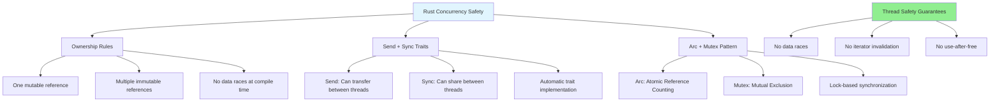

**Parallel Processing Pattern:**

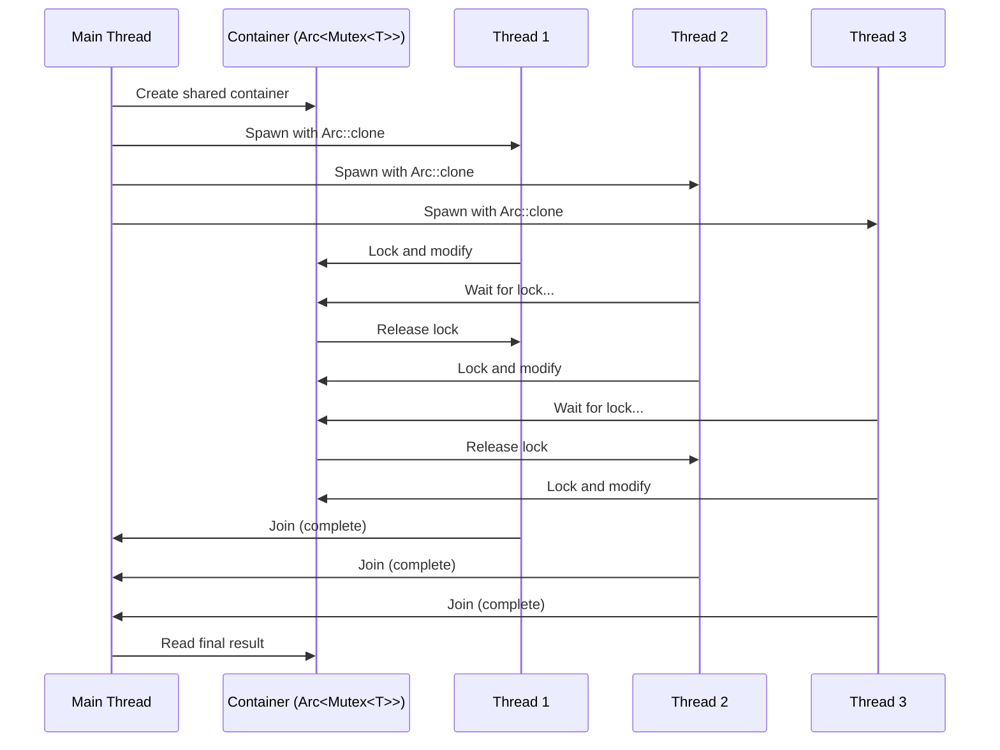

```rust
use std::sync::{Arc, Mutex};
use std::thread;

/// Thread-safe wrapper for data structures
pub struct ThreadSafeContainer<T> {
    data: Arc<Mutex<T>>,
}

impl<T> ThreadSafeContainer<T> {
    pub fn new(data: T) -> Self {
        Self {
            data: Arc::new(Mutex::new(data)),
        }
    }

    /// Execute a function with read access to the data
    pub fn with_read<F, R>(&self, func: F) -> R
    where
        F: FnOnce(&T) -> R,
    {
        let data = self.data.lock().unwrap();
        func(&*data)
    }

    /// Execute a function with write access to the data
    pub fn with_write<F, R>(&self, func: F) -> R
    where
        F: FnOnce(&mut T) -> R,
    {
        let mut data = self.data.lock().unwrap();
        func(&mut *data)
    }

    /// Clone the container for use in other threads
    pub fn clone_handle(&self) -> Self {
        Self {
            data: Arc::clone(&self.data),
        }
    }
}

/// Example: Parallel processing with thread-safe containers
pub fn parallel_example() {
    let container = ThreadSafeContainer::new(vec![1, 2, 3, 4, 5]);
    let mut handles = vec![];

    // Spawn multiple threads that modify the shared data
    for i in 0..3 {
        let container_clone = container.clone_handle();
        let handle = thread::spawn(move || {
            container_clone.with_write(|data| {
                data.push(i * 10);
                println!("Thread {} added {}", i, i * 10);
            });
        });
        handles.push(handle);
    }

    // Wait for all threads to complete
    for handle in handles {
        handle.join().unwrap();
    }

    // Read the final result
    container.with_read(|data| {
        println!("Final data: {:?}", data);
    });
}
```

## Summary: Rust's Revolutionary Impact on Systems Programming

### The Rust Advantage Matrix

```mermaid
graph TD
    A[Rust's Unique Value Proposition] --> B[Safety]
    A --> C[Performance]
    A --> D[Concurrency]
    A --> E[Expressiveness]
    
    B --> B1["Memory safety without GC"]
    B --> B2["Thread safety at compile time"]
    B --> B3["No undefined behavior"]
    B --> B4["Rust: 0 CVEs in std library"]
    
    C --> C1["Zero-cost abstractions"]
    C --> C2["Predictable performance"]
    C --> C3["Manual memory control"]
    C --> C4["LLVM backend optimization"]
    
    D --> D1["Fearless concurrency"]
    D --> D2["Send + Sync traits"]
    D --> D3["Lock-free data structures"]
    D --> D4["Async/await support"]
    
    E --> E1["Pattern matching"]
    E --> E2["Powerful type system"]
    E --> E3["Trait-based generics"]
    E --> E4["Macro system"]
    
    style A fill:#E1F5FE
    style B fill:#C8E6C9
    style C fill:#FFE0B2
    style D fill:#F3E5F5
    style E fill:#FFB6C1
```

### Why Rust Matters for Data Structures

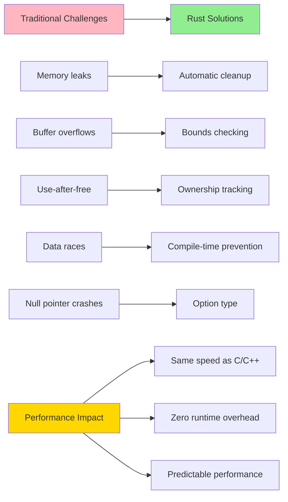

### Key Rust Patterns Demonstrated

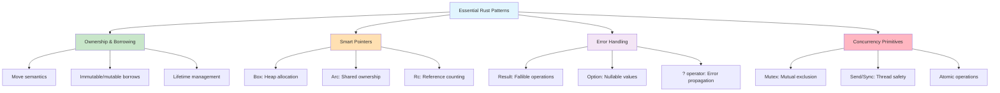

### Real-World Impact

**Industries Adopting Rust:**
- **Operating Systems**: Linux kernel, Windows components
- **Web Browsers**: Firefox (Servo), Chrome components
- **Databases**: TiKV, Materialize, SurrealDB
- **Blockchain**: Polkadot, Solana, Ethereum 2.0
- **Game Engines**: Bevy, Amethyst
- **Cloud Infrastructure**: Dropbox, Discord, Cloudflare

**Performance Characteristics:**
```
Memory Safety:     ✓ Compile-time guaranteed
Performance:       ≈ C/C++ (within 5-10%)
Concurrency:       ✓ Data race free
Developer Productivity: ↑ Catching bugs early
Maintenance Cost:  ↓ Fewer runtime errors
```

### When to Choose Rust for Data Structures

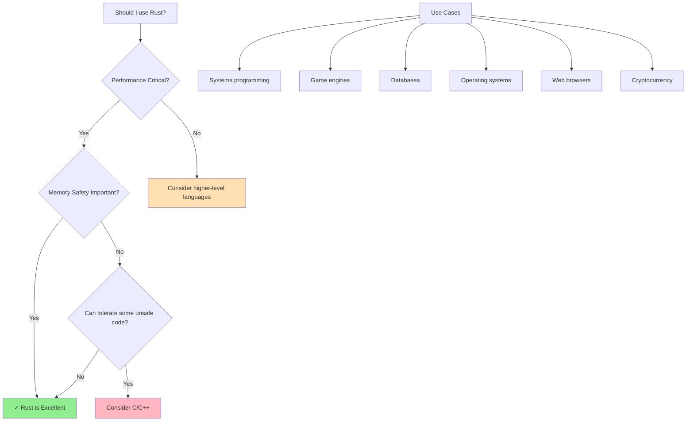

This implementation demonstrates that Rust enables us to write data structures that are:
- **Safe** by default, with compile-time guarantees
- **Fast** with zero-cost abstractions
- **Concurrent** without data races
- **Maintainable** with clear ownership semantics
- **Portable** across platforms and architectures

Rust represents the future of systems programming - bringing memory safety to performance-critical code without sacrificing speed or control.