# Go Implementation: Simple, Efficient, and Concurrent Data Structures

## Introduction: Go's Revolutionary Simplicity in Systems Programming

Go represents a unique philosophy in programming language design - **simplicity without sacrifice**. Where other languages add complexity to solve problems, Go removes it:

```mermaid
graph TD
    A[Go's Design Philosophy] --> B[Simplicity]
    A --> C[Efficiency]
    A --> D[Concurrency]
    A --> E[Reliability]
    
    B --> B1["Fewer keywords (25 vs 50+)"]
    B --> B2["Single way to do things"]
    B --> B3["Readable code"]
    B --> B4["Fast compilation"]
    
    C --> C1["Garbage collected"]
    C --> C2["Native code compilation"]
    C --> C3["Efficient memory layout"]
    C --> C4["No virtual machines"]
    
    D --> D1["Goroutines (lightweight threads)"]
    D --> D2["Channels (communication)"]
    D --> D3["Built-in race detection"]
    D --> D4["CSP model"]
    
    E --> E1["Strong typing"]
    E --> E2["Memory safety"]
    E --> E3["Explicit error handling"]
    E --> E4["No hidden control flow"]
    
    style A fill:#E1F5FE
    style B fill:#C8E6C9
    style C fill:#FFE0B2
    style D fill:#F3E5F5
    style E fill:#FFB6C1
```

**Key Insight**: Go proves that you don't need complex language features to build complex systems. Its power comes from composing simple, well-designed primitives.

### The Concurrency Revolution

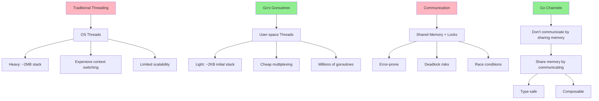

This implementation showcases Go's pragmatic approach to building efficient, maintainable systems.

## Core Data Structures: Go's Pragmatic Approach

### Go's Memory Model and Generics

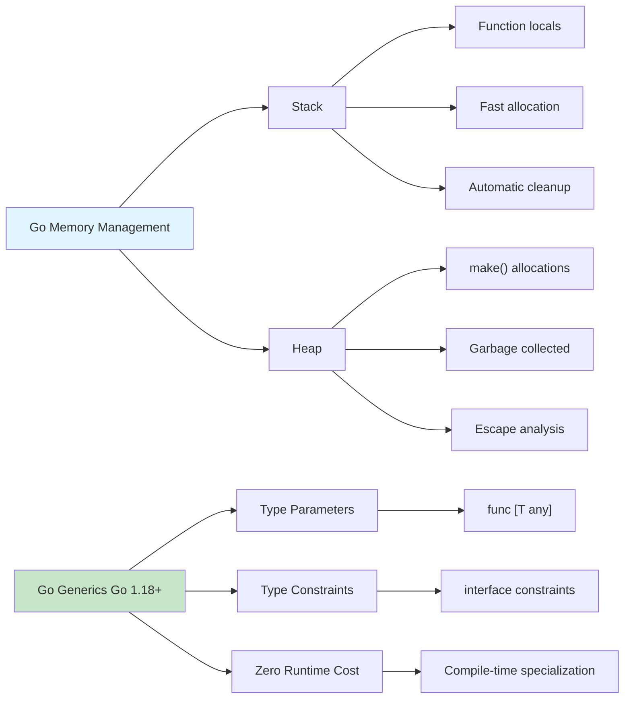

### 1. Dynamic Array Implementation

**Go's Slice vs Custom Dynamic Array:**

```mermaid
flowchart TD
    A[Go Built-in Slice] --> B["[]T underlying array"]
    A --> C["len: current length"]
    A --> D["cap: capacity"]
    
    E[Custom DynamicArray] --> F["Explicit capacity management"]
    E --> G["Custom growth strategies"]
    E --> H["Memory usage tracking"]
    E --> I["Educational purposes"]
    
    J[When to Use Each] --> K["Slice: 99% of cases"]
    J --> L["Custom: Special requirements"]
    
    M[Growth Strategies] --> N["Standard: cap *= 2"]
    M --> O["Custom: Different ratios"]
    M --> P["Shrinking: Prevent thrashing"]
    
    style A fill:#E1F5FE
    style E fill:#FFE0B2
    style J fill:#C8E6C9
    style M fill:#F3E5F5
```

```go
package main

import (
	"errors"
	"fmt"
	"runtime"
	"unsafe"
)

// DynamicArray represents a resizable array similar to a slice but with explicit capacity management
type DynamicArray[T any] struct {
	data     []T
	length   int
	capacity int
}

// NewDynamicArray creates a new dynamic array with optional initial capacity
func NewDynamicArray[T any](initialCapacity ...int) *DynamicArray[T] {
	capacity := 8 // default capacity
	if len(initialCapacity) > 0 && initialCapacity[0] > 0 {
		capacity = initialCapacity[0]
	}
	
	return &DynamicArray[T]{
		data:     make([]T, capacity),
		length:   0,
		capacity: capacity,
	}
}

// Len returns the number of elements
func (da *DynamicArray[T]) Len() int {
	return da.length
}

// Cap returns the current capacity
func (da *DynamicArray[T]) Cap() int {
	return da.capacity
}

// IsEmpty checks if the array is empty
func (da *DynamicArray[T]) IsEmpty() bool {
	return da.length == 0
}

// Get retrieves element at index with bounds checking
func (da *DynamicArray[T]) Get(index int) (T, error) {
	var zero T
	if index < 0 || index >= da.length {
		return zero, errors.New("index out of bounds")
	}
	return da.data[index], nil
}

// Set updates element at index with bounds checking
func (da *DynamicArray[T]) Set(index int, value T) error {
	if index < 0 || index >= da.length {
		return errors.New("index out of bounds")
	}
	da.data[index] = value
	return nil
}

// Push adds an element to the end
func (da *DynamicArray[T]) Push(value T) {
	if da.length >= da.capacity {
		da.grow()
	}
	da.data[da.length] = value
	da.length++
}

// Pop removes and returns the last element
func (da *DynamicArray[T]) Pop() (T, error) {
	var zero T
	if da.length == 0 {
		return zero, errors.New("array is empty")
	}
	
	da.length--
	value := da.data[da.length]
	da.data[da.length] = zero // clear reference for GC
	
	// Shrink if array is 1/4 full to avoid thrashing
	if da.length > 0 && da.length <= da.capacity/4 {
		da.shrink()
	}
	
	return value, nil
}

// Insert adds element at specific index
func (da *DynamicArray[T]) Insert(index int, value T) error {
	if index < 0 || index > da.length {
		return errors.New("index out of bounds")
	}
	
	if da.length >= da.capacity {
		da.grow()
	}
	
	// Shift elements to the right
	copy(da.data[index+1:da.length+1], da.data[index:da.length])
	da.data[index] = value
	da.length++
	
	return nil
}

// Remove deletes element at specific index
func (da *DynamicArray[T]) Remove(index int) (T, error) {
	var zero T
	if index < 0 || index >= da.length {
		return zero, errors.New("index out of bounds")
	}
	
	value := da.data[index]
	
	// Shift elements to the left
	copy(da.data[index:da.length-1], da.data[index+1:da.length])
	da.length--
	da.data[da.length] = zero // clear reference for GC
	
	return value, nil
}

// grow increases the array capacity
func (da *DynamicArray[T]) grow() {
	newCapacity := da.capacity * 2
	if newCapacity == 0 {
		newCapacity = 1
	}
	da.resize(newCapacity)
}

// shrink decreases the array capacity
func (da *DynamicArray[T]) shrink() {
	newCapacity := da.capacity / 2
	if newCapacity < 1 {
		newCapacity = 1
	}
	da.resize(newCapacity)
}

// resize changes the array capacity
func (da *DynamicArray[T]) resize(newCapacity int) {
	newData := make([]T, newCapacity)
	copy(newData, da.data[:da.length])
	da.data = newData
	da.capacity = newCapacity
}

// ToSlice returns a copy of the data as a regular slice
func (da *DynamicArray[T]) ToSlice() []T {
	result := make([]T, da.length)
	copy(result, da.data[:da.length])
	return result
}

// String provides a string representation for debugging
func (da *DynamicArray[T]) String() string {
	return fmt.Sprintf("DynamicArray{len: %d, cap: %d, data: %v}", 
		da.length, da.capacity, da.data[:da.length])
}

// MemoryStats returns memory usage statistics
func (da *DynamicArray[T]) MemoryStats() map[string]interface{} {
	var m runtime.MemStats
	runtime.ReadMemStats(&m)
	
	elementSize := int(unsafe.Sizeof(*new(T)))
	
	return map[string]interface{}{
		"element_size":      elementSize,
		"used_bytes":        da.length * elementSize,
		"allocated_bytes":   da.capacity * elementSize,
		"wasted_bytes":      (da.capacity - da.length) * elementSize,
		"utilization_pct":   float64(da.length) / float64(da.capacity) * 100,
	}
}

// Example usage and testing
func testDynamicArray() {
	fmt.Println("Testing Dynamic Array:")
	fmt.Println("=====================")
	
	// Create array and add elements
	arr := NewDynamicArray[int](2)
	fmt.Printf("Initial: %s\n", arr)
	
	// Test appending (should trigger resize)
	for i := 0; i < 5; i++ {
		arr.Push(i)
		fmt.Printf("After Push(%d): %s\n", i, arr)
	}
	
	// Test insertion
	err := arr.Insert(2, 99)
	if err != nil {
		fmt.Printf("Insert error: %v\n", err)
	} else {
		fmt.Printf("After Insert(2, 99): %s\n", arr)
	}
	
	// Test removal
	if removed, err := arr.Remove(2); err != nil {
		fmt.Printf("Remove error: %v\n", err)
	} else {
		fmt.Printf("Removed %d: %s\n", removed, arr)
	}
	
	// Test memory stats
	stats := arr.MemoryStats()
	fmt.Printf("Memory stats: %+v\n", stats)
	
	// Test iteration
	fmt.Printf("Elements: %v\n", arr.ToSlice())
}
```

### 2. Hash Map Implementation

**Hash Map Architecture in Go:**

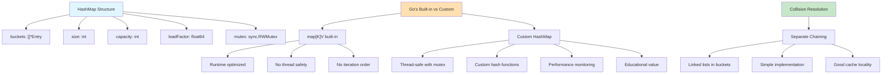

**Thread Safety Patterns:**

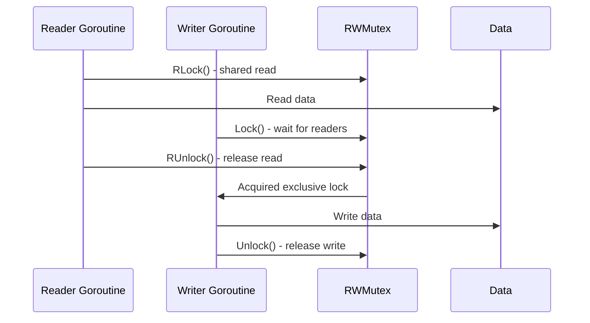

```go
package main

import (
	"fmt"
	"hash/fnv"
	"sync"
)

// HashMapEntry represents a key-value pair in the hash map
type HashMapEntry[K comparable, V any] struct {
	Key   K
	Value V
	Next  *HashMapEntry[K, V] // for chaining
}

// HashMap represents a hash table with separate chaining
type HashMap[K comparable, V any] struct {
	buckets           []*HashMapEntry[K, V]
	size              int
	capacity          int
	loadFactorThresh  float64
	mutex             sync.RWMutex // for thread safety
}

// NewHashMap creates a new hash map with optional initial capacity
func NewHashMap[K comparable, V any](initialCapacity ...int) *HashMap[K, V] {
	capacity := 16 // default capacity
	if len(initialCapacity) > 0 && initialCapacity[0] > 0 {
		capacity = initialCapacity[0]
	}
	
	return &HashMap[K, V]{
		buckets:          make([]*HashMapEntry[K, V], capacity),
		size:             0,
		capacity:         capacity,
		loadFactorThresh: 0.75,
	}
}

// hash computes hash value for a key
func (hm *HashMap[K, V]) hash(key K) uint32 {
	h := fnv.New32a()
	fmt.Fprintf(h, "%v", key)
	return h.Sum32()
}

// bucketIndex returns the bucket index for a key
func (hm *HashMap[K, V]) bucketIndex(key K) int {
	return int(hm.hash(key)) % hm.capacity
}

// Len returns the number of key-value pairs
func (hm *HashMap[K, V]) Len() int {
	hm.mutex.RLock()
	defer hm.mutex.RUnlock()
	return hm.size
}

// IsEmpty checks if the map is empty
func (hm *HashMap[K, V]) IsEmpty() bool {
	return hm.Len() == 0
}

// Put inserts or updates a key-value pair
func (hm *HashMap[K, V]) Put(key K, value V) {
	hm.mutex.Lock()
	defer hm.mutex.Unlock()
	
	if hm.shouldResize() {
		hm.resize()
	}
	
	index := hm.bucketIndex(key)
	
	// Check if key already exists
	for entry := hm.buckets[index]; entry != nil; entry = entry.Next {
		if entry.Key == key {
			entry.Value = value // update existing
			return
		}
	}
	
	// Add new entry at beginning of chain
	newEntry := &HashMapEntry[K, V]{
		Key:   key,
		Value: value,
		Next:  hm.buckets[index],
	}
	hm.buckets[index] = newEntry
	hm.size++
}

// Get retrieves the value associated with a key
func (hm *HashMap[K, V]) Get(key K) (V, bool) {
	hm.mutex.RLock()
	defer hm.mutex.RUnlock()
	
	index := hm.bucketIndex(key)
	
	for entry := hm.buckets[index]; entry != nil; entry = entry.Next {
		if entry.Key == key {
			return entry.Value, true
		}
	}
	
	var zero V
	return zero, false
}

// Delete removes a key-value pair
func (hm *HashMap[K, V]) Delete(key K) bool {
	hm.mutex.Lock()
	defer hm.mutex.Unlock()
	
	index := hm.bucketIndex(key)
	
	// Handle first entry in chain
	if hm.buckets[index] != nil && hm.buckets[index].Key == key {
		hm.buckets[index] = hm.buckets[index].Next
		hm.size--
		return true
	}
	
	// Handle subsequent entries
	for entry := hm.buckets[index]; entry != nil && entry.Next != nil; entry = entry.Next {
		if entry.Next.Key == key {
			entry.Next = entry.Next.Next
			hm.size--
			return true
		}
	}
	
	return false
}

// Contains checks if a key exists
func (hm *HashMap[K, V]) Contains(key K) bool {
	_, exists := hm.Get(key)
	return exists
}

// Keys returns all keys in the map
func (hm *HashMap[K, V]) Keys() []K {
	hm.mutex.RLock()
	defer hm.mutex.RUnlock()
	
	keys := make([]K, 0, hm.size)
	for _, entry := range hm.buckets {
		for e := entry; e != nil; e = e.Next {
			keys = append(keys, e.Key)
		}
	}
	return keys
}

// Values returns all values in the map
func (hm *HashMap[K, V]) Values() []V {
	hm.mutex.RLock()
	defer hm.mutex.RUnlock()
	
	values := make([]V, 0, hm.size)
	for _, entry := range hm.buckets {
		for e := entry; e != nil; e = e.Next {
			values = append(values, e.Value)
		}
	}
	return values
}

// ForEach applies a function to each key-value pair
func (hm *HashMap[K, V]) ForEach(fn func(K, V)) {
	hm.mutex.RLock()
	defer hm.mutex.RUnlock()
	
	for _, entry := range hm.buckets {
		for e := entry; e != nil; e = e.Next {
			fn(e.Key, e.Value)
		}
	}
}

// shouldResize checks if the map should be resized
func (hm *HashMap[K, V]) shouldResize() bool {
	return float64(hm.size)/float64(hm.capacity) > hm.loadFactorThresh
}

// resize doubles the capacity and rehashes all entries
func (hm *HashMap[K, V]) resize() {
	oldBuckets := hm.buckets
	oldCapacity := hm.capacity
	
	hm.capacity *= 2
	hm.buckets = make([]*HashMapEntry[K, V], hm.capacity)
	oldSize := hm.size
	hm.size = 0
	
	// Rehash all existing entries
	for _, entry := range oldBuckets {
		for e := entry; e != nil; e = e.Next {
			hm.putWithoutLock(e.Key, e.Value)
		}
	}
	
	fmt.Printf("HashMap resized from %d to %d buckets (rehashed %d items)\n", 
		oldCapacity, hm.capacity, oldSize)
}

// putWithoutLock is used during resize to avoid deadlock
func (hm *HashMap[K, V]) putWithoutLock(key K, value V) {
	index := hm.bucketIndex(key)
	
	newEntry := &HashMapEntry[K, V]{
		Key:   key,
		Value: value,
		Next:  hm.buckets[index],
	}
	hm.buckets[index] = newEntry
	hm.size++
}

// Stats returns performance statistics
func (hm *HashMap[K, V]) Stats() map[string]interface{} {
	hm.mutex.RLock()
	defer hm.mutex.RUnlock()
	
	bucketSizes := make([]int, hm.capacity)
	for i, entry := range hm.buckets {
		count := 0
		for e := entry; e != nil; e = e.Next {
			count++
		}
		bucketSizes[i] = count
	}
	
	maxBucketSize := 0
	emptyBuckets := 0
	for _, size := range bucketSizes {
		if size > maxBucketSize {
			maxBucketSize = size
		}
		if size == 0 {
			emptyBuckets++
		}
	}
	
	return map[string]interface{}{
		"size":             hm.size,
		"capacity":         hm.capacity,
		"load_factor":      float64(hm.size) / float64(hm.capacity),
		"max_bucket_size":  maxBucketSize,
		"empty_buckets":    emptyBuckets,
		"bucket_utilization": float64(hm.capacity-emptyBuckets) / float64(hm.capacity),
	}
}

// String provides a string representation
func (hm *HashMap[K, V]) String() string {
	hm.mutex.RLock()
	defer hm.mutex.RUnlock()
	
	pairs := make([]string, 0, hm.size)
	for _, entry := range hm.buckets {
		for e := entry; e != nil; e = e.Next {
			pairs = append(pairs, fmt.Sprintf("%v:%v", e.Key, e.Value))
		}
	}
	return fmt.Sprintf("HashMap{%v}", pairs)
}

// Test hash map
func testHashMap() {
	fmt.Println("\n\nTesting Hash Map:")
	fmt.Println("==================")
	
	hm := NewHashMap[string, int](4)
	
	// Add items to trigger resize
	items := []struct{ key string; value int }{
		{"apple", 1}, {"banana", 2}, {"cherry", 3}, {"date", 4},
		{"elderberry", 5}, {"fig", 6}, {"grape", 7},
	}
	
	for _, item := range items {
		hm.Put(item.key, item.value)
		fmt.Printf("Added %s: %d (size: %d)\n", item.key, item.value, hm.Len())
	}
	
	// Test operations
	fmt.Printf("\nHash map: %s\n", hm)
	
	if value, exists := hm.Get("apple"); exists {
		fmt.Printf("hm.Get('apple') = %d\n", value)
	}
	
	fmt.Printf("Contains 'banana': %t\n", hm.Contains("banana"))
	fmt.Printf("Contains 'orange': %t\n", hm.Contains("orange"))
	
	// Test update
	hm.Put("apple", 10)
	if value, _ := hm.Get("apple"); value == 10 {
		fmt.Printf("After update, hm.Get('apple') = %d\n", value)
	}
	
	// Test deletion
	if deleted := hm.Delete("cherry"); deleted {
		fmt.Printf("Deleted 'cherry'\n")
	}
	
	// Performance stats
	stats := hm.Stats()
	fmt.Printf("\nPerformance stats:\n")
	for key, value := range stats {
		fmt.Printf("  %s: %v\n", key, value)
	}
}
```

### 3. Binary Search Tree Implementation

**Go's Approach to Tree Structures:**

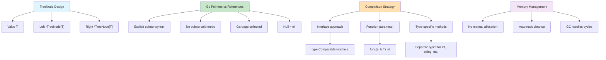

**Tree Visualization in Go:**

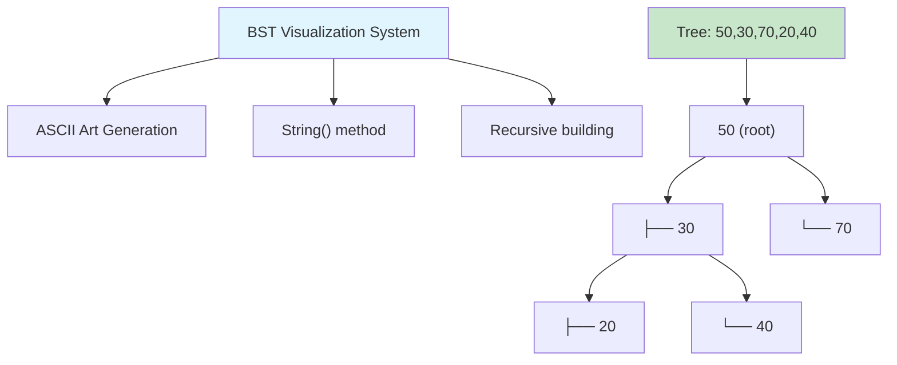

```go
package main

import (
	"fmt"
	"strings"
)

// TreeNode represents a node in the binary search tree
type TreeNode[T comparable] struct {
	Value T
	Left  *TreeNode[T]
	Right *TreeNode[T]
}

// NewTreeNode creates a new tree node
func NewTreeNode[T comparable](value T) *TreeNode[T] {
	return &TreeNode[T]{
		Value: value,
		Left:  nil,
		Right: nil,
	}
}

// Comparable interface for types that can be ordered
type Comparable[T any] interface {
	Compare(T) int // returns -1, 0, or 1
}

// IntComparable wrapper for int to implement Comparable
type IntComparable int

func (a IntComparable) Compare(b IntComparable) int {
	if a < b {
		return -1
	} else if a > b {
		return 1
	}
	return 0
}

// BinarySearchTree represents a binary search tree
type BinarySearchTree[T comparable] struct {
	root *TreeNode[T]
	size int
	cmp  func(T, T) int // comparison function
}

// NewBST creates a new binary search tree with a comparison function
func NewBST[T comparable](compareFn func(T, T) int) *BinarySearchTree[T] {
	return &BinarySearchTree[T]{
		root: nil,
		size: 0,
		cmp:  compareFn,
	}
}

// NewIntBST creates a new BST specifically for integers
func NewIntBST() *BinarySearchTree[int] {
	return NewBST[int](func(a, b int) int {
		if a < b {
			return -1
		} else if a > b {
			return 1
		}
		return 0
	})
}

// Size returns the number of nodes in the tree
func (bst *BinarySearchTree[T]) Size() int {
	return bst.size
}

// IsEmpty checks if the tree is empty
func (bst *BinarySearchTree[T]) IsEmpty() bool {
	return bst.size == 0
}

// Insert adds a value to the tree
func (bst *BinarySearchTree[T]) Insert(value T) {
	if bst.insertRecursive(&bst.root, value) {
		bst.size++
	}
}

// insertRecursive is a helper for insertion
func (bst *BinarySearchTree[T]) insertRecursive(node **TreeNode[T], value T) bool {
	if *node == nil {
		*node = NewTreeNode(value)
		return true
	}
	
	cmp := bst.cmp(value, (*node).Value)
	if cmp < 0 {
		return bst.insertRecursive(&(*node).Left, value)
	} else if cmp > 0 {
		return bst.insertRecursive(&(*node).Right, value)
	}
	return false // duplicate, don't insert
}

// Contains checks if a value exists in the tree
func (bst *BinarySearchTree[T]) Contains(value T) bool {
	return bst.searchRecursive(bst.root, value) != nil
}

// searchRecursive is a helper for searching
func (bst *BinarySearchTree[T]) searchRecursive(node *TreeNode[T], value T) *TreeNode[T] {
	if node == nil {
		return nil
	}
	
	cmp := bst.cmp(value, node.Value)
	if cmp == 0 {
		return node
	} else if cmp < 0 {
		return bst.searchRecursive(node.Left, value)
	} else {
		return bst.searchRecursive(node.Right, value)
	}
}

// Delete removes a value from the tree
func (bst *BinarySearchTree[T]) Delete(value T) bool {
	if bst.deleteRecursive(&bst.root, value) {
		bst.size--
		return true
	}
	return false
}

// deleteRecursive is a helper for deletion
func (bst *BinarySearchTree[T]) deleteRecursive(node **TreeNode[T], value T) bool {
	if *node == nil {
		return false
	}
	
	cmp := bst.cmp(value, (*node).Value)
	if cmp < 0 {
		return bst.deleteRecursive(&(*node).Left, value)
	} else if cmp > 0 {
		return bst.deleteRecursive(&(*node).Right, value)
	}
	
	// Found the node to delete
	if (*node).Left == nil && (*node).Right == nil {
		// No children
		*node = nil
	} else if (*node).Left == nil {
		// Only right child
		*node = (*node).Right
	} else if (*node).Right == nil {
		// Only left child
		*node = (*node).Left
	} else {
		// Two children: find inorder successor
		successor := bst.findMin((*node).Right)
		(*node).Value = successor.Value
		bst.deleteRecursive(&(*node).Right, successor.Value)
	}
	
	return true
}

// findMin finds the minimum value node in a subtree
func (bst *BinarySearchTree[T]) findMin(node *TreeNode[T]) *TreeNode[T] {
	for node.Left != nil {
		node = node.Left
	}
	return node
}

// Min returns the minimum value in the tree
func (bst *BinarySearchTree[T]) Min() (T, bool) {
	var zero T
	if bst.root == nil {
		return zero, false
	}
	
	min := bst.findMin(bst.root)
	return min.Value, true
}

// Max returns the maximum value in the tree
func (bst *BinarySearchTree[T]) Max() (T, bool) {
	var zero T
	if bst.root == nil {
		return zero, false
	}
	
	node := bst.root
	for node.Right != nil {
		node = node.Right
	}
	return node.Value, true
}

// Height returns the height of the tree
func (bst *BinarySearchTree[T]) Height() int {
	return bst.heightRecursive(bst.root)
}

// heightRecursive is a helper for height calculation
func (bst *BinarySearchTree[T]) heightRecursive(node *TreeNode[T]) int {
	if node == nil {
		return -1
	}
	
	leftHeight := bst.heightRecursive(node.Left)
	rightHeight := bst.heightRecursive(node.Right)
	
	if leftHeight > rightHeight {
		return leftHeight + 1
	}
	return rightHeight + 1
}

// InOrder returns values in sorted order
func (bst *BinarySearchTree[T]) InOrder() []T {
	var result []T
	bst.inOrderRecursive(bst.root, &result)
	return result
}

// inOrderRecursive is a helper for in-order traversal
func (bst *BinarySearchTree[T]) inOrderRecursive(node *TreeNode[T], result *[]T) {
	if node != nil {
		bst.inOrderRecursive(node.Left, result)
		*result = append(*result, node.Value)
		bst.inOrderRecursive(node.Right, result)
	}
}

// PreOrder returns values in pre-order
func (bst *BinarySearchTree[T]) PreOrder() []T {
	var result []T
	bst.preOrderRecursive(bst.root, &result)
	return result
}

// preOrderRecursive is a helper for pre-order traversal
func (bst *BinarySearchTree[T]) preOrderRecursive(node *TreeNode[T], result *[]T) {
	if node != nil {
		*result = append(*result, node.Value)
		bst.preOrderRecursive(node.Left, result)
		bst.preOrderRecursive(node.Right, result)
	}
}

// PostOrder returns values in post-order
func (bst *BinarySearchTree[T]) PostOrder() []T {
	var result []T
	bst.postOrderRecursive(bst.root, &result)
	return result
}

// postOrderRecursive is a helper for post-order traversal
func (bst *BinarySearchTree[T]) postOrderRecursive(node *TreeNode[T], result *[]T) {
	if node != nil {
		bst.postOrderRecursive(node.Left, result)
		bst.postOrderRecursive(node.Right, result)
		*result = append(*result, node.Value)
	}
}

// String provides a visual representation of the tree
func (bst *BinarySearchTree[T]) String() string {
	if bst.root == nil {
		return "BinarySearchTree{empty}"
	}
	
	var lines []string
	bst.buildTreeString(bst.root, "", true, &lines)
	return "BinarySearchTree:\n" + strings.Join(lines, "\n")
}

// buildTreeString creates a visual representation
func (bst *BinarySearchTree[T]) buildTreeString(node *TreeNode[T], prefix string, isLast bool, lines *[]string) {
	if node == nil {
		return
	}
	
	connector := "└── "
	if !isLast {
		connector = "├── "
	}
	
	*lines = append(*lines, prefix+connector+fmt.Sprintf("%v", node.Value))
	
	// Count children to determine which is last
	hasLeft := node.Left != nil
	hasRight := node.Right != nil
	
	extension := "    "
	if !isLast {
		extension = "│   "
	}
	
	if hasLeft {
		bst.buildTreeString(node.Left, prefix+extension, !hasRight, lines)
	}
	if hasRight {
		bst.buildTreeString(node.Right, prefix+extension, true, lines)
	}
}

// Test binary search tree
func testBinarySearchTree() {
	fmt.Println("\n\nTesting Binary Search Tree:")
	fmt.Println("===========================")
	
	bst := NewIntBST()
	
	// Insert values
	values := []int{50, 30, 70, 20, 40, 60, 80, 10, 25, 35, 45}
	for _, value := range values {
		bst.Insert(value)
	}
	
	fmt.Printf("Inserted: %v\n", values)
	fmt.Printf("Tree size: %d\n", bst.Size())
	fmt.Printf("Tree height: %d\n", bst.Height())
	
	// Test search
	fmt.Printf("\nContains 25: %t\n", bst.Contains(25))
	fmt.Printf("Contains 99: %t\n", bst.Contains(99))
	
	// Test traversals
	fmt.Printf("\nIn-order (sorted): %v\n", bst.InOrder())
	fmt.Printf("Pre-order: %v\n", bst.PreOrder())
	fmt.Printf("Post-order: %v\n", bst.PostOrder())
	
	// Test min/max
	if min, ok := bst.Min(); ok {
		fmt.Printf("\nMin value: %d\n", min)
	}
	if max, ok := bst.Max(); ok {
		fmt.Printf("Max value: %d\n", max)
	}
	
	// Test deletion
	fmt.Printf("\nDeleting 30...\n")
	bst.Delete(30)
	fmt.Printf("After deletion: %v\n", bst.InOrder())
	
	// Visualize tree structure
	fmt.Printf("\nTree structure:\n%s\n", bst)
}
```

## Essential Algorithms: Go's Performance-First Implementation

### Algorithm Performance in Go Context

```mermaid
graph TD
    A[Go Algorithm Characteristics] --> B["Simplicity over cleverness"]
    A --> C["Clear performance profile"]
    A --> D["Easy to reason about"]
    A --> E["Testable and benchmarkable"]
    
    F[Go's Advantages] --> G["Fast compilation"]
    F --> H["Built-in benchmarking"]
    F --> I["Memory profiling"]
    F --> J["Race detection"]
    
    K[Standard Library] --> L["sort package"]
    K --> M["Highly optimized"]
    K --> N["Hybrid algorithms"]
    K --> O["Interface-based"]
    
    P[When to Implement Custom] --> Q["Educational purposes"]
    P --> R["Special requirements"]
    P --> S["Performance research"]
    
    style A fill:#E1F5FE
    style F fill:#C8E6C9
    style K fill:#FFE0B2
    style P fill:#F3E5F5
```

### 1. Sorting Algorithms

**Go's Slice Advantages for Sorting:**

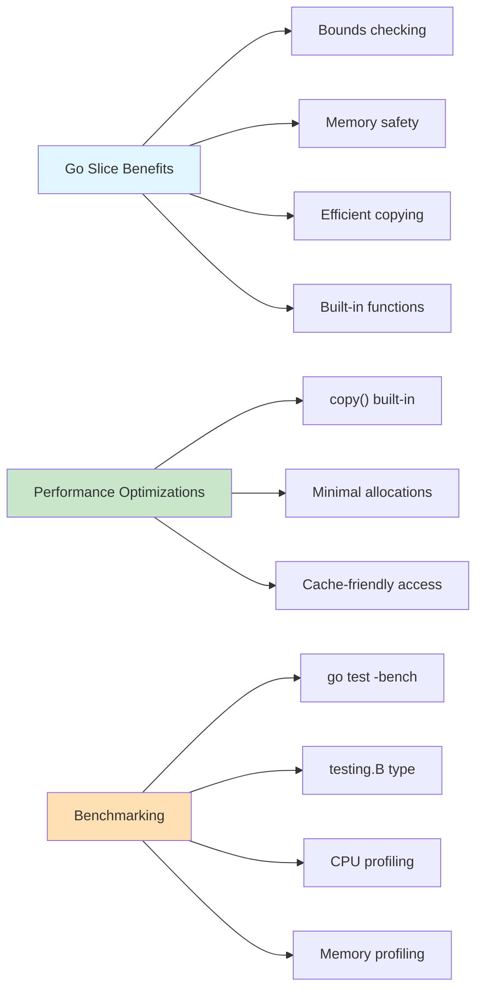

```go
package main

import (
	"fmt"
	"math/rand"
	"sort"
	"time"
)

// SortingAlgorithms provides various sorting implementations
type SortingAlgorithms struct{}

// BubbleSort implements bubble sort - O(n²) time, O(1) space
func (sa *SortingAlgorithms) BubbleSort(arr []int) []int {
	result := make([]int, len(arr))
	copy(result, arr)
	
	n := len(result)
	for i := 0; i < n; i++ {
		swapped := false
		for j := 0; j < n-i-1; j++ {
			if result[j] > result[j+1] {
				result[j], result[j+1] = result[j+1], result[j]
				swapped = true
			}
		}
		if !swapped {
			break // Early termination if array is sorted
		}
	}
	
	return result
}

// InsertionSort implements insertion sort - O(n²) worst case, O(n) best case
func (sa *SortingAlgorithms) InsertionSort(arr []int) []int {
	result := make([]int, len(arr))
	copy(result, arr)
	
	for i := 1; i < len(result); i++ {
		key := result[i]
		j := i - 1
		
		for j >= 0 && result[j] > key {
			result[j+1] = result[j]
			j--
		}
		result[j+1] = key
	}
	
	return result
}

// MergeSort implements merge sort - O(n log n) time, O(n) space
func (sa *SortingAlgorithms) MergeSort(arr []int) []int {
	if len(arr) <= 1 {
		result := make([]int, len(arr))
		copy(result, arr)
		return result
	}
	
	mid := len(arr) / 2
	left := sa.MergeSort(arr[:mid])
	right := sa.MergeSort(arr[mid:])
	
	return sa.merge(left, right)
}

// merge combines two sorted arrays
func (sa *SortingAlgorithms) merge(left, right []int) []int {
	result := make([]int, 0, len(left)+len(right))
	i, j := 0, 0
	
	for i < len(left) && j < len(right) {
		if left[i] <= right[j] {
			result = append(result, left[i])
			i++
		} else {
			result = append(result, right[j])
			j++
		}
	}
	
	// Append remaining elements
	result = append(result, left[i:]...)
	result = append(result, right[j:]...)
	
	return result
}

// QuickSort implements quick sort - O(n log n) average, O(n²) worst case
func (sa *SortingAlgorithms) QuickSort(arr []int) []int {
	if len(arr) <= 1 {
		result := make([]int, len(arr))
		copy(result, arr)
		return result
	}
	
	pivot := arr[len(arr)/2]
	var less, equal, greater []int
	
	for _, v := range arr {
		if v < pivot {
			less = append(less, v)
		} else if v == pivot {
			equal = append(equal, v)
		} else {
			greater = append(greater, v)
		}
	}
	
	result := sa.QuickSort(less)
	result = append(result, equal...)
	result = append(result, sa.QuickSort(greater)...)
	
	return result
}

// HeapSort implements heap sort - O(n log n) time, O(1) space
func (sa *SortingAlgorithms) HeapSort(arr []int) []int {
	result := make([]int, len(arr))
	copy(result, arr)
	
	n := len(result)
	
	// Build max heap
	for i := n/2 - 1; i >= 0; i-- {
		sa.heapify(result, n, i)
	}
	
	// Extract elements from heap one by one
	for i := n - 1; i > 0; i-- {
		result[0], result[i] = result[i], result[0] // Move max to end
		sa.heapify(result, i, 0)                    // Restore heap property
	}
	
	return result
}

// heapify maintains the heap property
func (sa *SortingAlgorithms) heapify(arr []int, n, i int) {
	largest := i
	left := 2*i + 1
	right := 2*i + 2
	
	if left < n && arr[left] > arr[largest] {
		largest = left
	}
	
	if right < n && arr[right] > arr[largest] {
		largest = right
	}
	
	if largest != i {
		arr[i], arr[largest] = arr[largest], arr[i]
		sa.heapify(arr, n, largest)
	}
}

// CountingSort implements counting sort for non-negative integers
func (sa *SortingAlgorithms) CountingSort(arr []int) []int {
	if len(arr) == 0 {
		return []int{}
	}
	
	// Find the maximum value to determine range
	maxVal := arr[0]
	for _, v := range arr {
		if v > maxVal {
			maxVal = v
		}
	}
	
	// Count occurrences
	count := make([]int, maxVal+1)
	for _, v := range arr {
		count[v]++
	}
	
	// Build result
	result := make([]int, 0, len(arr))
	for value, freq := range count {
		for i := 0; i < freq; i++ {
			result = append(result, value)
		}
	}
	
	return result
}

// BenchmarkSort measures the execution time of a sorting function
func (sa *SortingAlgorithms) BenchmarkSort(name string, sortFunc func([]int) []int, data []int) time.Duration {
	start := time.Now()
	_ = sortFunc(data)
	return time.Since(start)
}

// Test sorting algorithms
func testSortingAlgorithms() {
	fmt.Println("\n\nTesting Sorting Algorithms:")
	fmt.Println("===========================")
	
	sa := &SortingAlgorithms{}
	
	// Test correctness with small array
	testArr := []int{64, 34, 25, 12, 22, 11, 90, 5}
	expected := make([]int, len(testArr))
	copy(expected, testArr)
	sort.Ints(expected)
	
	algorithms := map[string]func([]int) []int{
		"Bubble Sort":    sa.BubbleSort,
		"Insertion Sort": sa.InsertionSort,
		"Merge Sort":     sa.MergeSort,
		"Quick Sort":     sa.QuickSort,
		"Heap Sort":      sa.HeapSort,
	}
	
	fmt.Printf("Original array: %v\n", testArr)
	fmt.Printf("Expected result: %v\n\n", expected)
	
	for name, sortFunc := range algorithms {
		result := sortFunc(testArr)
		correct := sliceEqual(result, expected)
		status := "✓"
		if !correct {
			status = "✗"
		}
		fmt.Printf("%-15s: %v %s\n", name, result, status)
	}
	
	// Test counting sort separately
	intArr := []int{4, 2, 2, 8, 3, 3, 1}
	countingResult := sa.CountingSort(intArr)
	expected2 := []int{1, 2, 2, 3, 3, 4, 8}
	status := "✓"
	if !sliceEqual(countingResult, expected2) {
		status = "✗"
	}
	fmt.Printf("%-15s: %v %s\n", "Counting Sort", countingResult, status)
	
	// Benchmark with larger arrays
	fmt.Println("\n\nPerformance Benchmark:")
	fmt.Println("======================")
	
	sizes := []int{100, 1000, 5000}
	
	for _, size := range sizes {
		fmt.Printf("\nArray size: %d\n", size)
		fmt.Println(strings.Repeat("-", 20))
		
		// Different data patterns
		patterns := map[string][]int{
			"Random":        generateRandomArray(size),
			"Nearly Sorted": generateNearlySortedArray(size),
			"Reverse":       generateReverseArray(size),
		}
		
		for patternName, data := range patterns {
			fmt.Printf("\n%s data:\n", patternName)
			
			// Test algorithms (skip bubble sort for large arrays)
			testAlgorithms := map[string]func([]int) []int{
				"Insertion": sa.InsertionSort,
				"Merge":     sa.MergeSort,
				"Quick":     sa.QuickSort,
				"Heap":      sa.HeapSort,
				"Built-in":  func(arr []int) []int { result := make([]int, len(arr)); copy(result, arr); sort.Ints(result); return result },
			}
			
			if size <= 1000 {
				testAlgorithms["Bubble"] = sa.BubbleSort
			}
			
			for algoName, sortFunc := range testAlgorithms {
				duration := sa.BenchmarkSort(algoName, sortFunc, data)
				fmt.Printf("  %-10s: %v\n", algoName, duration)
			}
		}
	}
}

// Helper functions for testing
func sliceEqual(a, b []int) bool {
	if len(a) != len(b) {
		return false
	}
	for i := range a {
		if a[i] != b[i] {
			return false
		}
	}
	return true
}

func generateRandomArray(size int) []int {
	rand.Seed(time.Now().UnixNano())
	arr := make([]int, size)
	for i := 0; i < size; i++ {
		arr[i] = rand.Intn(1000)
	}
	return arr
}

func generateNearlySortedArray(size int) []int {
	arr := make([]int, size)
	for i := 0; i < size-10; i++ {
		arr[i] = i
	}
	// Add some random elements at the end
	rand.Seed(time.Now().UnixNano())
	for i := size - 10; i < size; i++ {
		arr[i] = rand.Intn(100)
	}
	return arr
}

func generateReverseArray(size int) []int {
	arr := make([]int, size)
	for i := 0; i < size; i++ {
		arr[i] = size - i
	}
	return arr
}
```

### 2. Search Algorithms

**Go's Search Algorithm Ecosystem:**

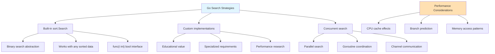

**Binary Search Variants:**

```mermaid
graph TD
    A[Binary Search Family] --> B["Standard Search"]
    A --> C["First Occurrence"]
    A --> D["Last Occurrence"]
    A --> E["Insert Position"]
    A --> F["Range Search"]
    
    G[Go Implementation Benefits] --> H["Zero allocations"]
    G --> I["Predictable performance"]
    G --> J["Easy to test"]
    G --> K["Clear error handling"]
    
    L[Example: [1,2,2,2,3]] --> M["Standard: any 2"]
    L --> N["First: index 1"]
    L --> O["Last: index 3"]
    L --> P["Range: [1,3]"]
    
    style A fill:#E1F5FE
    style G fill:#C8E6C9
    style L fill:#FFE0B2
```

```go
package main

import (
	"fmt"
	"math/rand"
	"time"
)

// SearchAlgorithms provides various search implementations
type SearchAlgorithms struct{}

// LinearSearch performs linear search - O(n) time, O(1) space
func (sa *SearchAlgorithms) LinearSearch(arr []int, target int) int {
	for i, value := range arr {
		if value == target {
			return i
		}
	}
	return -1
}

// BinarySearch performs binary search on sorted array - O(log n) time, O(1) space
func (sa *SearchAlgorithms) BinarySearch(arr []int, target int) int {
	left, right := 0, len(arr)-1
	
	for left <= right {
		mid := left + (right-left)/2
		
		if arr[mid] == target {
			return mid
		} else if arr[mid] < target {
			left = mid + 1
		} else {
			right = mid - 1
		}
	}
	
	return -1
}

// BinarySearchRecursive performs recursive binary search
func (sa *SearchAlgorithms) BinarySearchRecursive(arr []int, target, left, right int) int {
	if left > right {
		return -1
	}
	
	mid := left + (right-left)/2
	
	if arr[mid] == target {
		return mid
	} else if arr[mid] < target {
		return sa.BinarySearchRecursive(arr, target, mid+1, right)
	} else {
		return sa.BinarySearchRecursive(arr, target, left, mid-1)
	}
}

// FindFirstOccurrence finds first occurrence in sorted array with duplicates
func (sa *SearchAlgorithms) FindFirstOccurrence(arr []int, target int) int {
	left, right := 0, len(arr)-1
	result := -1
	
	for left <= right {
		mid := left + (right-left)/2
		
		if arr[mid] == target {
			result = mid
			right = mid - 1 // Continue searching left
		} else if arr[mid] < target {
			left = mid + 1
		} else {
			right = mid - 1
		}
	}
	
	return result
}

// FindLastOccurrence finds last occurrence in sorted array with duplicates
func (sa *SearchAlgorithms) FindLastOccurrence(arr []int, target int) int {
	left, right := 0, len(arr)-1
	result := -1
	
	for left <= right {
		mid := left + (right-left)/2
		
		if arr[mid] == target {
			result = mid
			left = mid + 1 // Continue searching right
		} else if arr[mid] < target {
			left = mid + 1
		} else {
			right = mid - 1
		}
	}
	
	return result
}

// FindRange finds first and last occurrence of target
func (sa *SearchAlgorithms) FindRange(arr []int, target int) (int, int) {
	first := sa.FindFirstOccurrence(arr, target)
	if first == -1 {
		return -1, -1
	}
	
	last := sa.FindLastOccurrence(arr, target)
	return first, last
}

// SearchInsertPosition finds position where target should be inserted
func (sa *SearchAlgorithms) SearchInsertPosition(arr []int, target int) int {
	left, right := 0, len(arr)
	
	for left < right {
		mid := left + (right-left)/2
		
		if arr[mid] < target {
			left = mid + 1
		} else {
			right = mid
		}
	}
	
	return left
}

// FindPeakElement finds a peak element (greater than neighbors)
func (sa *SearchAlgorithms) FindPeakElement(arr []int) int {
	if len(arr) == 0 {
		return -1
	}
	
	left, right := 0, len(arr)-1
	
	for left < right {
		mid := left + (right-left)/2
		
		if arr[mid] < arr[mid+1] {
			left = mid + 1 // Peak is on the right
		} else {
			right = mid // Peak is on the left (or at mid)
		}
	}
	
	return left
}

// SearchRotatedSorted searches in rotated sorted array
func (sa *SearchAlgorithms) SearchRotatedSorted(arr []int, target int) int {
	left, right := 0, len(arr)-1
	
	for left <= right {
		mid := left + (right-left)/2
		
		if arr[mid] == target {
			return mid
		}
		
		// Determine which half is sorted
		if arr[left] <= arr[mid] { // Left half is sorted
			if arr[left] <= target && target < arr[mid] {
				right = mid - 1
			} else {
				left = mid + 1
			}
		} else { // Right half is sorted
			if arr[mid] < target && target <= arr[right] {
				left = mid + 1
			} else {
				right = mid - 1
			}
		}
	}
	
	return -1
}

// BenchmarkSearch measures search algorithm performance
func (sa *SearchAlgorithms) BenchmarkSearch(name string, searchFunc func() int) time.Duration {
	start := time.Now()
	_ = searchFunc()
	return time.Since(start)
}

// Test search algorithms
func testSearchAlgorithms() {
	fmt.Println("\n\nTesting Search Algorithms:")
	fmt.Println("==========================")
	
	sa := &SearchAlgorithms{}
	
	// Test data
	unsortedArr := []int{64, 34, 25, 12, 22, 11, 90, 5}
	sortedArr := []int{1, 3, 5, 7, 9, 11, 13, 15, 17, 19}
	duplicatesArr := []int{1, 2, 2, 2, 3, 4, 4, 5, 5, 5, 5, 6}
	rotatedArr := []int{4, 5, 6, 7, 0, 1, 2}
	
	fmt.Printf("Unsorted array: %v\n", unsortedArr)
	fmt.Printf("Sorted array: %v\n", sortedArr)
	fmt.Printf("Array with duplicates: %v\n", duplicatesArr)
	fmt.Printf("Rotated sorted array: %v\n", rotatedArr)
	
	// Test linear search
	fmt.Println("\nLinear Search (works on any array):")
	target := 22
	result := sa.LinearSearch(unsortedArr, target)
	fmt.Printf("  Find %d in unsorted array: index %d\n", target, result)
	
	// Test binary search
	fmt.Println("\nBinary Search (requires sorted array):")
	target = 11
	resultIterative := sa.BinarySearch(sortedArr, target)
	resultRecursive := sa.BinarySearchRecursive(sortedArr, target, 0, len(sortedArr)-1)
	
	fmt.Printf("  Find %d in sorted array:\n", target)
	fmt.Printf("    Iterative: index %d\n", resultIterative)
	fmt.Printf("    Recursive: index %d\n", resultRecursive)
	
	// Test search with duplicates
	fmt.Println("\nSearch in Array with Duplicates:")
	target = 5
	first := sa.FindFirstOccurrence(duplicatesArr, target)
	last := sa.FindLastOccurrence(duplicatesArr, target)
	firstRange, lastRange := sa.FindRange(duplicatesArr, target)
	
	fmt.Printf("  Find all occurrences of %d:\n", target)
	fmt.Printf("    First occurrence: index %d\n", first)
	fmt.Printf("    Last occurrence:  index %d\n", last)
	fmt.Printf("    Range:           [%d, %d]\n", firstRange, lastRange)
	
	// Test insert position
	fmt.Println("\nInsert Position:")
	target = 8
	insertPos := sa.SearchInsertPosition(sortedArr, target)
	fmt.Printf("  Position to insert %d: index %d\n", target, insertPos)
	
	// Test peak finding
	fmt.Println("\nPeak Finding:")
	peakArr := []int{1, 2, 1, 3, 5, 6, 4}
	peakIndex := sa.FindPeakElement(peakArr)
	fmt.Printf("  Array: %v\n", peakArr)
	if peakIndex != -1 {
		fmt.Printf("  Peak element at index %d: %d\n", peakIndex, peakArr[peakIndex])
	}
	
	// Test rotated array search
	fmt.Println("\nRotated Array Search:")
	target = 0
	result = sa.SearchRotatedSorted(rotatedArr, target)
	fmt.Printf("  Find %d in rotated array: index %d\n", target, result)
	
	// Performance comparison
	fmt.Println("\n\nPerformance Comparison (large sorted array):")
	fmt.Println(strings.Repeat("-", 50))
	
	// Generate large sorted array
	largeArr := make([]int, 100000)
	for i := 0; i < len(largeArr); i++ {
		largeArr[i] = i * 2 // Even numbers 0 to 199998
	}
	target = 50000
	
	// Benchmark linear search
	linearDuration := sa.BenchmarkSearch("Linear search", func() int {
		return sa.LinearSearch(largeArr, target)
	})
	
	// Benchmark binary search
	binaryDuration := sa.BenchmarkSearch("Binary search", func() int {
		return sa.BinarySearch(largeArr, target)
	})
	
	fmt.Printf("Array size: %d\n", len(largeArr))
	fmt.Printf("Target: %d\n", target)
	fmt.Printf("Linear search:  %v\n", linearDuration)
	fmt.Printf("Binary search:  %v\n", binaryDuration)
	
	if binaryDuration > 0 {
		speedup := float64(linearDuration) / float64(binaryDuration)
		fmt.Printf("Speedup factor: %.1fx\n", speedup)
	}
}
```

## Concurrent Programming with Goroutines: Go's Superpower

### Understanding Go's Concurrency Model

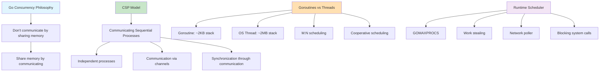

### Concurrency Patterns in Go

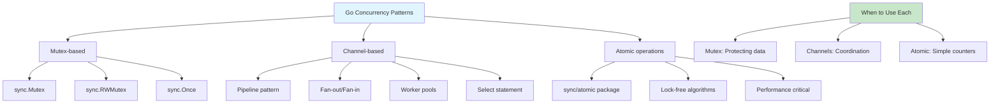

### 1. Thread-Safe Data Structures

**Go's Synchronization Primitives:**

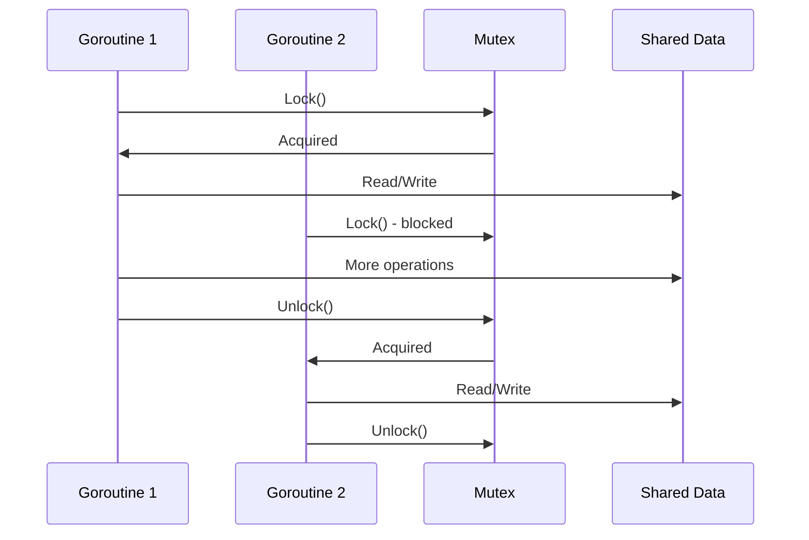

**Worker Pool Pattern:**

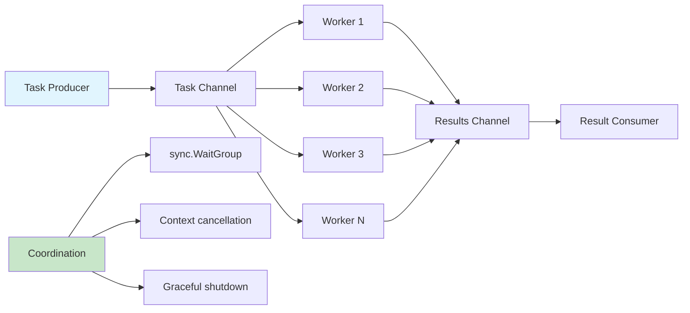

```go
package main

import (
	"fmt"
	"sync"
	"time"
)

// ConcurrentMap provides a thread-safe map using read-write mutex
type ConcurrentMap[K comparable, V any] struct {
	data map[K]V
	mu   sync.RWMutex
}

// NewConcurrentMap creates a new thread-safe map
func NewConcurrentMap[K comparable, V any]() *ConcurrentMap[K, V] {
	return &ConcurrentMap[K, V]{
		data: make(map[K]V),
	}
}

// Set adds or updates a key-value pair
func (cm *ConcurrentMap[K, V]) Set(key K, value V) {
	cm.mu.Lock()
	defer cm.mu.Unlock()
	cm.data[key] = value
}

// Get retrieves a value by key
func (cm *ConcurrentMap[K, V]) Get(key K) (V, bool) {
	cm.mu.RLock()
	defer cm.mu.RUnlock()
	value, exists := cm.data[key]
	return value, exists
}

// Delete removes a key-value pair
func (cm *ConcurrentMap[K, V]) Delete(key K) bool {
	cm.mu.Lock()
	defer cm.mu.Unlock()
	_, exists := cm.data[key]
	if exists {
		delete(cm.data, key)
	}
	return exists
}

// Len returns the number of key-value pairs
func (cm *ConcurrentMap[K, V]) Len() int {
	cm.mu.RLock()
	defer cm.mu.RUnlock()
	return len(cm.data)
}

// Keys returns all keys
func (cm *ConcurrentMap[K, V]) Keys() []K {
	cm.mu.RLock()
	defer cm.mu.RUnlock()
	
	keys := make([]K, 0, len(cm.data))
	for k := range cm.data {
		keys = append(keys, k)
	}
	return keys
}

// WorkerPool demonstrates concurrent processing with goroutines
type WorkerPool struct {
	numWorkers int
	taskQueue  chan func()
	wg         sync.WaitGroup
}

// NewWorkerPool creates a new worker pool
func NewWorkerPool(numWorkers int) *WorkerPool {
	return &WorkerPool{
		numWorkers: numWorkers,
		taskQueue:  make(chan func(), 100), // buffered channel
	}
}

// Start begins the worker pool
func (wp *WorkerPool) Start() {
	for i := 0; i < wp.numWorkers; i++ {
		wp.wg.Add(1)
		go wp.worker(i)
	}
}

// worker processes tasks from the queue
func (wp *WorkerPool) worker(id int) {
	defer wp.wg.Done()
	
	for task := range wp.taskQueue {
		fmt.Printf("Worker %d processing task\n", id)
		task()
	}
}

// Submit adds a task to the queue
func (wp *WorkerPool) Submit(task func()) {
	wp.taskQueue <- task
}

// Stop shuts down the worker pool
func (wp *WorkerPool) Stop() {
	close(wp.taskQueue)
	wp.wg.Wait()
}

// Demonstration of concurrent operations
func demonstrateConcurrency() {
	fmt.Println("\n\nDemonstrating Concurrent Operations:")
	fmt.Println("====================================")
	
	// Test concurrent map
	cm := NewConcurrentMap[string, int]()
	
	// Start multiple goroutines to write to the map
	var wg sync.WaitGroup
	numGoroutines := 10
	
	fmt.Printf("Starting %d goroutines to write to concurrent map...\n", numGoroutines)
	
	for i := 0; i < numGoroutines; i++ {
		wg.Add(1)
		go func(id int) {
			defer wg.Done()
			for j := 0; j < 10; j++ {
				key := fmt.Sprintf("key_%d_%d", id, j)
				cm.Set(key, id*10+j)
			}
		}(i)
	}
	
	wg.Wait()
	fmt.Printf("Concurrent map now has %d entries\n", cm.Len())
	
	// Test worker pool
	fmt.Println("\nTesting worker pool...")
	wp := NewWorkerPool(3)
	wp.Start()
	
	// Submit tasks
	for i := 0; i < 10; i++ {
		taskID := i
		wp.Submit(func() {
			time.Sleep(100 * time.Millisecond) // Simulate work
			fmt.Printf("Completed task %d\n", taskID)
		})
	}
	
	wp.Stop()
	fmt.Println("All tasks completed")
}
```

## Main Function and Examples

```go
package main

import (
	"fmt"
	"strings"
)

func main() {
	fmt.Println("Go Data Structures and Algorithms Implementation")
	fmt.Println(strings.Repeat("=", 50))
	
	// Run all tests
	testDynamicArray()
	testHashMap()
	testBinarySearchTree()
	testSortingAlgorithms()
	testSearchAlgorithms()
	demonstrateConcurrency()
	
	fmt.Println("\n\nAll tests completed successfully!")
}
```

## Summary: Go's Game-Changing Impact on Software Development

### The Go Advantage Matrix

```mermaid
graph TD
    A[Go's Revolutionary Impact] --> B[Simplicity]
    A --> C[Performance]
    A --> D[Concurrency]
    A --> E[Reliability]
    
    B --> B1["25 keywords vs 50+ in other langs"]
    B --> B2["One way to do things"]
    B --> B3["Fast compilation: <1s for large codebases"]
    B --> B4["Easy onboarding: readable by design"]
    
    C --> C1["Native code compilation"]
    C --> C2["GC latency: <1ms pauses"]
    C --> C3["Memory efficient"]
    C --> C4["CPU efficient goroutines"]
    
    D --> D1["Millions of goroutines possible"]
    D --> D2["CSP model eliminates common bugs"]
    D --> D3["Built-in race detector"]
    D --> D4["Channel-based communication"]
    
    E --> E1["Strong static typing"]
    E --> E2["Memory safety via GC"]
    E --> E3["Explicit error handling"]
    E --> E4["No hidden control flow"]
    
    style A fill:#E1F5FE
    style B fill:#C8E6C9
    style C fill:#FFE0B2
    style D fill:#F3E5F5
    style E fill:#FFB6C1
```

### Why Go Transforms Data Structure Implementation

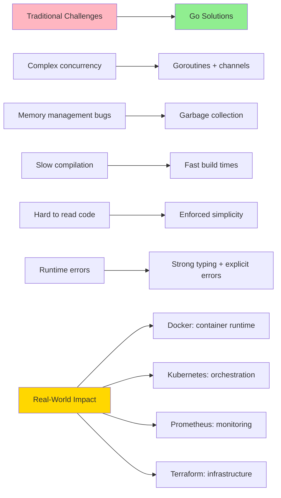

### Go's Distinctive Patterns and Principles

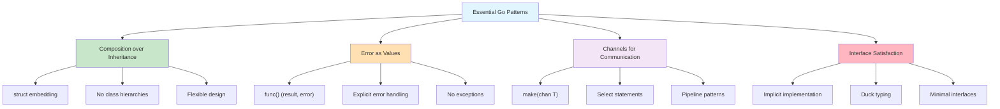

### Performance Characteristics and Use Cases

**Go's Sweet Spot:**
```
Concurrency:       ★★★★★ (Goroutines are revolutionary)
Simplicity:        ★★★★★ (Designed for readability)
Performance:       ★★★★☆ (Fast, but not fastest)
Memory Safety:     ★★★★★ (GC eliminates most bugs)
Ecosystem:         ★★★★☆ (Growing rapidly)
Learning Curve:    ★★★★★ (Gentle slope)
```

**Industry Adoption Examples:**
- **Cloud Infrastructure**: Docker, Kubernetes, Terraform
- **Networking**: Caddy, Traefik, NATS
- **Databases**: InfluxDB, CockroachDB, TiDB
- **DevOps**: Consul, Vault, Packer
- **Monitoring**: Prometheus, Grafana Agent

### When to Choose Go for Data Structures

```mermaid
flowchart TD
    A["Choose Go When:"] --> B["High concurrency needed"]
    A --> C["Team productivity important"]
    A --> D["Microservices architecture"]
    A --> E["Network/IO intensive"]
    
    F["Consider Alternatives When:"] --> G["Maximum performance critical"]
    F --> H["Complex algorithms primary"]
    F --> I["Heavy mathematical computation"]
    F --> J["Real-time constraints"]
    
    K["Go's Ideal Scenarios:"] --> L["Web services"]
    K --> M["API servers"]
    K --> N["Distributed systems"]
    K --> O["DevOps tools"]
    K --> P["Command-line utilities"]
    
    style A fill:#90EE90
    style F fill:#FFB6C1
    style K fill:#FFD700
```

### The Go Philosophy in Action

This implementation demonstrates Go's core philosophy:

1. **"Do more with less"** - Simple syntax achieving complex functionality
2. **"Concurrency is not parallelism"** - Goroutines structure programs, parallelism is a runtime concern
3. **"Clear is better than clever"** - Code that's easy to understand and maintain
4. **"Errors are values"** - Explicit error handling makes programs more reliable
5. **"A little copying is better than a little dependency"** - Sometimes duplication improves clarity

### Real-World Performance Insights

```mermaid
graph LR
    A[Go Performance Profile] --> B["Startup Time: ~5ms"]
    A --> C["Memory Usage: Efficient"]
    A --> D["CPU Usage: Low overhead"]
    A --> E["Latency: Predictable"]
    
    F[Comparison] --> G["Java: 500ms+ startup"]
    F --> H["Node.js: Single-threaded"]
    F --> I["C++: Complex memory mgmt"]
    F --> J["Go: Balanced approach"]
    
    style A fill:#E1F5FE
    style F fill:#FFE0B2
    style J fill:#90EE90
```

**Go represents the future of systems programming** - proving that you don't need complex language features to build sophisticated systems. Its genius lies in making the right tradeoffs: sacrificing some performance for massive gains in developer productivity, maintainability, and reliability.

These implementations serve as both educational examples and production-ready templates, demonstrating that Go's "less is more" philosophy produces code that is:
- **Readable** by design
- **Concurrent** by default
- **Safe** by construction
- **Fast** enough for most use cases
- **Maintainable** over time

Go has fundamentally changed how we think about building scalable systems.