# C++ Implementation: Maximum Performance with Zero-Overhead Abstractions

## Introduction: C++'s Philosophy of "You Don't Pay for What You Don't Use"

C++ represents the pinnacle of performance-oriented programming, providing uncompromising control over system resources while maintaining elegant high-level abstractions:

```mermaid
graph TD
    A[C++ Core Principles] --> B[Zero-Overhead Abstractions]
    A --> C[Manual Resource Control]
    A --> D[Compile-Time Optimization]
    A --> E[Multiple Paradigms]
    
    B --> B1["High-level code"]
    B --> B2["Optimal assembly output"]
    B --> B3["No runtime penalty"]
    B --> B4["Templates = zero cost"]
    
    C --> C1["Explicit memory management"]
    C --> C2["Deterministic destructors"]
    C --> C3["Stack vs heap control"]
    C --> C4["Custom allocators"]
    
    D --> D1["Template instantiation"]
    D --> D2["Constant folding"]
    D --> D3["Dead code elimination"]
    D --> D4["Inline expansion"]
    
    E --> E1["Procedural programming"]
    E --> E2["Object-oriented"]
    E --> E3["Generic programming"]
    E --> E4["Functional programming"]
    
    style A fill:#E1F5FE
    style B fill:#C8E6C9
    style C fill:#FFE0B2
    style D fill:#F3E5F5
    style E fill:#FFB6C1
```



**Key Insight**: C++ trusts you to make the right decisions. It provides powerful tools but expects you to use them responsibly. This creates opportunities for both exceptional performance and spectacular failures.

### The Performance vs Safety Spectrum


This implementation showcases C++'s ability to create both efficient and expressive data structures while demonstrating the careful resource management that enables maximum performance.

## Core Data Structures: C++'s Memory Management Mastery

### Understanding C++'s Memory Model


### C++'s Unique Advantages for Data Structures


### 1. Dynamic Array Implementation

**Memory Layout and Management Strategy:**


```cpp
#include <iostream>
#include <memory>
#include <algorithm>
#include <stdexcept>
#include <initializer_list>

template<typename T>
class DynamicArray {
private:
    T* data_;
    size_t size_;
    size_t capacity_;

    void deallocate() {
        if (data_) {
            // Properly destroy objects
            for (size_t i = 0; i < size_; ++i) {
                data_[i].~T();
            }
            // Deallocate raw memory
            operator delete(data_);
            data_ = nullptr;
        }
    }

    void reallocate(size_t new_capacity) {
        // Allocate raw memory
        T* new_data = static_cast<T*>(operator new(new_capacity * sizeof(T)));
        
        // Move/copy existing elements
        size_t elements_to_copy = std::min(size_, new_capacity);
        for (size_t i = 0; i < elements_to_copy; ++i) {
            new (new_data + i) T(std::move(data_[i]));
        }
        
        // Clean up old memory
        deallocate();
        
        data_ = new_data;
        capacity_ = new_capacity;
        if (size_ > new_capacity) {
            size_ = new_capacity;
        }
    }

public:
    // Constructor
    explicit DynamicArray(size_t initial_capacity = 8)
        : data_(nullptr), size_(0), capacity_(0) {
        if (initial_capacity > 0) {
            reallocate(initial_capacity);
        }
    }

    // Initializer list constructor
    DynamicArray(std::initializer_list<T> init)
        : data_(nullptr), size_(0), capacity_(0) {
        reallocate(init.size());
        for (const auto& item : init) {
            push_back(item);
        }
    }

    // Copy constructor
    DynamicArray(const DynamicArray& other)
        : data_(nullptr), size_(0), capacity_(0) {
        reallocate(other.capacity_);
        for (size_t i = 0; i < other.size_; ++i) {
            push_back(other.data_[i]);
        }
    }

    // Move constructor
    DynamicArray(DynamicArray&& other) noexcept
        : data_(other.data_), size_(other.size_), capacity_(other.capacity_) {
        other.data_ = nullptr;
        other.size_ = 0;
        other.capacity_ = 0;
    }

    // Copy assignment operator
    DynamicArray& operator=(const DynamicArray& other) {
        if (this != &other) {
            clear();
            reallocate(other.capacity_);
            for (size_t i = 0; i < other.size_; ++i) {
                push_back(other.data_[i]);
            }
        }
        return *this;
    }

    // Move assignment operator
    DynamicArray& operator=(DynamicArray&& other) noexcept {
        if (this != &other) {
            deallocate();
            data_ = other.data_;
            size_ = other.size_;
            capacity_ = other.capacity_;
            other.data_ = nullptr;
            other.size_ = 0;
            other.capacity_ = 0;
        }
        return *this;
    }

    // Destructor
    ~DynamicArray() {
        deallocate();
    }

    // Element access
    T& operator[](size_t index) {
        if (index >= size_) {
            throw std::out_of_range("Index out of bounds");
        }
        return data_[index];
    }

    const T& operator[](size_t index) const {
        if (index >= size_) {
            throw std::out_of_range("Index out of bounds");
        }
        return data_[index];
    }

    T& at(size_t index) {
        return (*this)[index];
    }

    const T& at(size_t index) const {
        return (*this)[index];
    }

    // Capacity methods
    size_t size() const { return size_; }
    size_t capacity() const { return capacity_; }
    bool empty() const { return size_ == 0; }

    // Modifiers
    void push_back(const T& value) {
        if (size_ >= capacity_) {
            size_t new_capacity = capacity_ == 0 ? 1 : capacity_ * 2;
            reallocate(new_capacity);
        }
        new (data_ + size_) T(value);
        ++size_;
    }

    void push_back(T&& value) {
        if (size_ >= capacity_) {
            size_t new_capacity = capacity_ == 0 ? 1 : capacity_ * 2;
            reallocate(new_capacity);
        }
        new (data_ + size_) T(std::move(value));
        ++size_;
    }

    template<typename... Args>
    void emplace_back(Args&&... args) {
        if (size_ >= capacity_) {
            size_t new_capacity = capacity_ == 0 ? 1 : capacity_ * 2;
            reallocate(new_capacity);
        }
        new (data_ + size_) T(std::forward<Args>(args)...);
        ++size_;
    }

    void pop_back() {
        if (size_ == 0) {
            throw std::runtime_error("Cannot pop from empty array");
        }
        --size_;
        data_[size_].~T();
        
        // Shrink if array is 1/4 full to avoid thrashing
        if (size_ > 0 && size_ <= capacity_ / 4) {
            reallocate(capacity_ / 2);
        }
    }

    void insert(size_t index, const T& value) {
        if (index > size_) {
            throw std::out_of_range("Index out of bounds");
        }
        
        if (size_ >= capacity_) {
            size_t new_capacity = capacity_ == 0 ? 1 : capacity_ * 2;
            reallocate(new_capacity);
        }
        
        // Shift elements to the right
        for (size_t i = size_; i > index; --i) {
            new (data_ + i) T(std::move(data_[i - 1]));
            data_[i - 1].~T();
        }
        
        new (data_ + index) T(value);
        ++size_;
    }

    void erase(size_t index) {
        if (index >= size_) {
            throw std::out_of_range("Index out of bounds");
        }
        
        data_[index].~T();
        
        // Shift elements to the left
        for (size_t i = index; i < size_ - 1; ++i) {
            new (data_ + i) T(std::move(data_[i + 1]));
            data_[i + 1].~T();
        }
        
        --size_;
    }

    void clear() {
        for (size_t i = 0; i < size_; ++i) {
            data_[i].~T();
        }
        size_ = 0;
    }

    void reserve(size_t new_capacity) {
        if (new_capacity > capacity_) {
            reallocate(new_capacity);
        }
    }

    void shrink_to_fit() {
        if (size_ < capacity_) {
            reallocate(size_);
        }
    }

    // Iterators
    T* begin() { return data_; }
    const T* begin() const { return data_; }
    T* end() { return data_ + size_; }
    const T* end() const { return data_ + size_; }

    // Memory usage statistics
    struct MemoryStats {
        size_t element_size;
        size_t used_bytes;
        size_t allocated_bytes;
        size_t wasted_bytes;
        double utilization_percent;
    };

    MemoryStats memory_stats() const {
        size_t element_size = sizeof(T);
        size_t used_bytes = size_ * element_size;
        size_t allocated_bytes = capacity_ * element_size;
        size_t wasted_bytes = allocated_bytes - used_bytes;
        double utilization = capacity_ > 0 ? (double)size_ / capacity_ * 100.0 : 0.0;

        return {element_size, used_bytes, allocated_bytes, wasted_bytes, utilization};
    }

    // Debug output
    void print_debug() const {
        std::cout << "DynamicArray{size: " << size_ 
                  << ", capacity: " << capacity_ << ", data: [";
        for (size_t i = 0; i < size_; ++i) {
            if (i > 0) std::cout << ", ";
            std::cout << data_[i];
        }
        std::cout << "]}" << std::endl;
    }
};

// Test function
void test_dynamic_array() {
    std::cout << "Testing Dynamic Array:" << std::endl;
    std::cout << "=====================" << std::endl;
    
    // Test with initializer list
    DynamicArray<int> arr{1, 2, 3, 4, 5};
    arr.print_debug();
    
    // Test push_back
    arr.push_back(6);
    arr.emplace_back(7);
    std::cout << "After push_back and emplace_back: ";
    arr.print_debug();
    
    // Test insertion
    arr.insert(2, 99);
    std::cout << "After insert(2, 99): ";
    arr.print_debug();
    
    // Test removal
    arr.erase(2);
    std::cout << "After erase(2): ";
    arr.print_debug();
    
    // Test memory stats
    auto stats = arr.memory_stats();
    std::cout << "Memory stats:" << std::endl;
    std::cout << "  Element size: " << stats.element_size << " bytes" << std::endl;
    std::cout << "  Used bytes: " << stats.used_bytes << std::endl;
    std::cout << "  Allocated bytes: " << stats.allocated_bytes << std::endl;
    std::cout << "  Utilization: " << stats.utilization_percent << "%" << std::endl;
    
    // Test iteration
    std::cout << "Elements: ";
    for (const auto& elem : arr) {
        std::cout << elem << " ";
    }
    std::cout << std::endl;
}
```

### 2. Hash Map Implementation

**C++ Hash Map Architecture with STL Integration:**


**Hash Function and Collision Resolution:**


```cpp
#include <iostream>
#include <vector>
#include <list>
#include <functional>
#include <memory>

template<typename K, typename V>
class HashMap {
private:
    using KeyValuePair = std::pair<K, V>;
    using Bucket = std::list<KeyValuePair>;
    
    std::vector<Bucket> buckets_;
    size_t size_;
    double load_factor_threshold_;
    std::hash<K> hasher_;

    size_t hash(const K& key) const {
        return hasher_(key) % buckets_.size();
    }

    void rehash() {
        size_t old_bucket_count = buckets_.size();
        size_t new_bucket_count = old_bucket_count * 2;
        
        std::vector<Bucket> old_buckets = std::move(buckets_);
        buckets_ = std::vector<Bucket>(new_bucket_count);
        size_ = 0;
        
        // Rehash all existing elements
        for (auto& bucket : old_buckets) {
            for (auto& pair : bucket) {
                insert_without_rehash(std::move(pair.first), std::move(pair.second));
            }
        }
        
        std::cout << "HashMap rehashed from " << old_bucket_count 
                  << " to " << new_bucket_count << " buckets" << std::endl;
    }

    void insert_without_rehash(K&& key, V&& value) {
        size_t bucket_index = hash(key);
        auto& bucket = buckets_[bucket_index];
        
        // Check if key already exists
        for (auto& pair : bucket) {
            if (pair.first == key) {
                pair.second = std::move(value);
                return;
            }
        }
        
        // Add new key-value pair
        bucket.emplace_back(std::move(key), std::move(value));
        ++size_;
    }

public:
    explicit HashMap(size_t initial_bucket_count = 16, double load_factor_threshold = 0.75)
        : buckets_(initial_bucket_count), size_(0), load_factor_threshold_(load_factor_threshold) {}

    // Copy constructor
    HashMap(const HashMap& other)
        : buckets_(other.buckets_), size_(other.size_), 
          load_factor_threshold_(other.load_factor_threshold_) {}

    // Move constructor
    HashMap(HashMap&& other) noexcept
        : buckets_(std::move(other.buckets_)), size_(other.size_),
          load_factor_threshold_(other.load_factor_threshold_) {
        other.size_ = 0;
    }

    // Assignment operators
    HashMap& operator=(const HashMap& other) {
        if (this != &other) {
            buckets_ = other.buckets_;
            size_ = other.size_;
            load_factor_threshold_ = other.load_factor_threshold_;
        }
        return *this;
    }

    HashMap& operator=(HashMap&& other) noexcept {
        if (this != &other) {
            buckets_ = std::move(other.buckets_);
            size_ = other.size_;
            load_factor_threshold_ = other.load_factor_threshold_;
            other.size_ = 0;
        }
        return *this;
    }

    size_t size() const { return size_; }
    bool empty() const { return size_ == 0; }
    double load_factor() const { 
        return buckets_.empty() ? 0.0 : static_cast<double>(size_) / buckets_.size(); 
    }

    void insert(const K& key, const V& value) {
        if (load_factor() > load_factor_threshold_) {
            rehash();
        }
        
        size_t bucket_index = hash(key);
        auto& bucket = buckets_[bucket_index];
        
        // Check if key already exists
        for (auto& pair : bucket) {
            if (pair.first == key) {
                pair.second = value;
                return;
            }
        }
        
        // Add new key-value pair
        bucket.emplace_back(key, value);
        ++size_;
    }

    void insert(K&& key, V&& value) {
        if (load_factor() > load_factor_threshold_) {
            rehash();
        }
        insert_without_rehash(std::move(key), std::move(value));
    }

    bool find(const K& key, V& value) const {
        size_t bucket_index = hash(key);
        const auto& bucket = buckets_[bucket_index];
        
        for (const auto& pair : bucket) {
            if (pair.first == key) {
                value = pair.second;
                return true;
            }
        }
        return false;
    }

    V* find(const K& key) {
        size_t bucket_index = hash(key);
        auto& bucket = buckets_[bucket_index];
        
        for (auto& pair : bucket) {
            if (pair.first == key) {
                return &pair.second;
            }
        }
        return nullptr;
    }

    const V* find(const K& key) const {
        size_t bucket_index = hash(key);
        const auto& bucket = buckets_[bucket_index];
        
        for (const auto& pair : bucket) {
            if (pair.first == key) {
                return &pair.second;
            }
        }
        return nullptr;
    }

    bool erase(const K& key) {
        size_t bucket_index = hash(key);
        auto& bucket = buckets_[bucket_index];
        
        for (auto it = bucket.begin(); it != bucket.end(); ++it) {
            if (it->first == key) {
                bucket.erase(it);
                --size_;
                return true;
            }
        }
        return false;
    }

    bool contains(const K& key) const {
        return find(key) != nullptr;
    }

    V& operator[](const K& key) {
        V* value_ptr = find(key);
        if (value_ptr) {
            return *value_ptr;
        }
        
        // Insert with default value if key doesn't exist
        insert(key, V{});
        return *find(key);
    }

    void clear() {
        for (auto& bucket : buckets_) {
            bucket.clear();
        }
        size_ = 0;
    }

    // Performance statistics
    struct Stats {
        size_t size;
        size_t bucket_count;
        double load_factor;
        size_t max_bucket_size;
        size_t empty_buckets;
        double average_bucket_size;
    };

    Stats get_stats() const {
        size_t max_bucket_size = 0;
        size_t empty_buckets = 0;
        
        for (const auto& bucket : buckets_) {
            if (bucket.empty()) {
                ++empty_buckets;
            } else {
                max_bucket_size = std::max(max_bucket_size, bucket.size());
            }
        }
        
        double avg_bucket_size = buckets_.empty() ? 0.0 : 
                                static_cast<double>(size_) / buckets_.size();
        
        return {size_, buckets_.size(), load_factor(), max_bucket_size, 
                empty_buckets, avg_bucket_size};
    }

    void print_stats() const {
        auto stats = get_stats();
        std::cout << "HashMap Statistics:" << std::endl;
        std::cout << "  Size: " << stats.size << std::endl;
        std::cout << "  Bucket count: " << stats.bucket_count << std::endl;
        std::cout << "  Load factor: " << stats.load_factor << std::endl;
        std::cout << "  Max bucket size: " << stats.max_bucket_size << std::endl;
        std::cout << "  Empty buckets: " << stats.empty_buckets << std::endl;
        std::cout << "  Average bucket size: " << stats.average_bucket_size << std::endl;
    }

    // Iterator support (simplified)
    class iterator {
    private:
        typename std::vector<Bucket>::iterator bucket_it_;
        typename std::vector<Bucket>::iterator bucket_end_;
        typename Bucket::iterator pair_it_;

        void advance_to_next_valid() {
            while (bucket_it_ != bucket_end_ && pair_it_ == bucket_it_->end()) {
                ++bucket_it_;
                if (bucket_it_ != bucket_end_) {
                    pair_it_ = bucket_it_->begin();
                }
            }
        }

    public:
        iterator(typename std::vector<Bucket>::iterator bucket_it,
                typename std::vector<Bucket>::iterator bucket_end)
            : bucket_it_(bucket_it), bucket_end_(bucket_end) {
            if (bucket_it_ != bucket_end_) {
                pair_it_ = bucket_it_->begin();
                advance_to_next_valid();
            }
        }

        KeyValuePair& operator*() { return *pair_it_; }
        KeyValuePair* operator->() { return &(*pair_it_); }

        iterator& operator++() {
            ++pair_it_;
            advance_to_next_valid();
            return *this;
        }

        bool operator==(const iterator& other) const {
            return bucket_it_ == other.bucket_it_ && 
                   (bucket_it_ == bucket_end_ || pair_it_ == other.pair_it_);
        }

        bool operator!=(const iterator& other) const {
            return !(*this == other);
        }
    };

    iterator begin() {
        return iterator(buckets_.begin(), buckets_.end());
    }

    iterator end() {
        return iterator(buckets_.end(), buckets_.end());
    }
};

void test_hash_map() {
    std::cout << "\n\nTesting Hash Map:" << std::endl;
    std::cout << "=================" << std::endl;
    
    HashMap<std::string, int> map(4);
    
    // Insert items
    std::vector<std::pair<std::string, int>> items = {
        {"apple", 1}, {"banana", 2}, {"cherry", 3}, {"date", 4},
        {"elderberry", 5}, {"fig", 6}, {"grape", 7}
    };
    
    for (const auto& item : items) {
        map.insert(item.first, item.second);
        std::cout << "Inserted " << item.first << ": " << item.second 
                  << " (size: " << map.size() << ")" << std::endl;
    }
    
    // Test operations
    std::cout << "\nTesting operations:" << std::endl;
    
    if (auto value_ptr = map.find("apple")) {
        std::cout << "map.find('apple') = " << *value_ptr << std::endl;
    }
    
    std::cout << "Contains 'banana': " << (map.contains("banana") ? "true" : "false") << std::endl;
    std::cout << "Contains 'orange': " << (map.contains("orange") ? "true" : "false") << std::endl;
    
    // Test update
    map["apple"] = 10;
    std::cout << "After update, map['apple'] = " << map["apple"] << std::endl;
    
    // Test deletion
    if (map.erase("cherry")) {
        std::cout << "Deleted 'cherry'" << std::endl;
    }
    
    // Print statistics
    std::cout << std::endl;
    map.print_stats();
    
    // Test iteration
    std::cout << "\nAll key-value pairs:" << std::endl;
    for (const auto& pair : map) {
        std::cout << "  " << pair.first << ": " << pair.second << std::endl;
    }
}
```

### 3. Binary Search Tree Implementation

**Smart Pointer Management for Tree Structures:**


**Tree Traversal Strategies:**


```cpp
#include <iostream>
#include <memory>
#include <vector>
#include <queue>
#include <algorithm>

template<typename T>
class BinarySearchTree {
private:
    struct Node {
        T value;
        std::unique_ptr<Node> left;
        std::unique_ptr<Node> right;
        
        explicit Node(const T& val) : value(val), left(nullptr), right(nullptr) {}
        explicit Node(T&& val) : value(std::move(val)), left(nullptr), right(nullptr) {}
    };
    
    std::unique_ptr<Node> root_;
    size_t size_;

    bool insert_recursive(std::unique_ptr<Node>& node, const T& value) {
        if (!node) {
            node = std::make_unique<Node>(value);
            return true;
        }
        
        if (value < node->value) {
            return insert_recursive(node->left, value);
        } else if (value > node->value) {
            return insert_recursive(node->right, value);
        }
        return false; // Duplicate, don't insert
    }

    bool insert_recursive(std::unique_ptr<Node>& node, T&& value) {
        if (!node) {
            node = std::make_unique<Node>(std::move(value));
            return true;
        }
        
        if (value < node->value) {
            return insert_recursive(node->left, std::move(value));
        } else if (value > node->value) {
            return insert_recursive(node->right, std::move(value));
        }
        return false; // Duplicate, don't insert
    }

    Node* search_recursive(Node* node, const T& value) const {
        if (!node || node->value == value) {
            return node;
        }
        
        if (value < node->value) {
            return search_recursive(node->left.get(), value);
        } else {
            return search_recursive(node->right.get(), value);
        }
    }

    std::unique_ptr<Node> remove_recursive(std::unique_ptr<Node> node, const T& value, bool& found) {
        if (!node) {
            found = false;
            return nullptr;
        }
        
        if (value < node->value) {
            node->left = remove_recursive(std::move(node->left), value, found);
        } else if (value > node->value) {
            node->right = remove_recursive(std::move(node->right), value, found);
        } else {
            found = true;
            
            // Node to be deleted found
            if (!node->left && !node->right) {
                // No children
                return nullptr;
            } else if (!node->left) {
                // Only right child
                return std::move(node->right);
            } else if (!node->right) {
                // Only left child
                return std::move(node->left);
            } else {
                // Two children: find inorder successor
                Node* successor = find_min(node->right.get());
                node->value = successor->value;
                bool dummy;
                node->right = remove_recursive(std::move(node->right), successor->value, dummy);
            }
        }
        return node;
    }

    Node* find_min(Node* node) const {
        while (node && node->left) {
            node = node->left.get();
        }
        return node;
    }

    Node* find_max(Node* node) const {
        while (node && node->right) {
            node = node->right.get();
        }
        return node;
    }

    size_t height_recursive(Node* node) const {
        if (!node) return 0;
        return 1 + std::max(height_recursive(node->left.get()), 
                           height_recursive(node->right.get()));
    }

    void inorder_recursive(Node* node, std::vector<T>& result) const {
        if (node) {
            inorder_recursive(node->left.get(), result);
            result.push_back(node->value);
            inorder_recursive(node->right.get(), result);
        }
    }

    void preorder_recursive(Node* node, std::vector<T>& result) const {
        if (node) {
            result.push_back(node->value);
            preorder_recursive(node->left.get(), result);
            preorder_recursive(node->right.get(), result);
        }
    }

    void postorder_recursive(Node* node, std::vector<T>& result) const {
        if (node) {
            postorder_recursive(node->left.get(), result);
            postorder_recursive(node->right.get(), result);
            result.push_back(node->value);
        }
    }

public:
    BinarySearchTree() : root_(nullptr), size_(0) {}
    
    // Rule of 5 (custom destructor handled by unique_ptr)
    BinarySearchTree(const BinarySearchTree& other) : root_(nullptr), size_(0) {
        auto values = other.inorder();
        for (const auto& value : values) {
            insert(value);
        }
    }

    BinarySearchTree(BinarySearchTree&& other) noexcept 
        : root_(std::move(other.root_)), size_(other.size_) {
        other.size_ = 0;
    }

    BinarySearchTree& operator=(const BinarySearchTree& other) {
        if (this != &other) {
            clear();
            auto values = other.inorder();
            for (const auto& value : values) {
                insert(value);
            }
        }
        return *this;
    }

    BinarySearchTree& operator=(BinarySearchTree&& other) noexcept {
        if (this != &other) {
            root_ = std::move(other.root_);
            size_ = other.size_;
            other.size_ = 0;
        }
        return *this;
    }

    void insert(const T& value) {
        if (insert_recursive(root_, value)) {
            ++size_;
        }
    }

    void insert(T&& value) {
        if (insert_recursive(root_, std::move(value))) {
            ++size_;
        }
    }

    bool contains(const T& value) const {
        return search_recursive(root_.get(), value) != nullptr;
    }

    bool remove(const T& value) {
        bool found = false;
        root_ = remove_recursive(std::move(root_), value, found);
        if (found) {
            --size_;
        }
        return found;
    }

    size_t size() const { return size_; }
    bool empty() const { return size_ == 0; }

    const T* find_min() const {
        Node* min_node = find_min(root_.get());
        return min_node ? &min_node->value : nullptr;
    }

    const T* find_max() const {
        Node* max_node = find_max(root_.get());
        return max_node ? &max_node->value : nullptr;
    }

    size_t height() const {
        return root_ ? height_recursive(root_.get()) - 1 : 0;
    }

    std::vector<T> inorder() const {
        std::vector<T> result;
        inorder_recursive(root_.get(), result);
        return result;
    }

    std::vector<T> preorder() const {
        std::vector<T> result;
        preorder_recursive(root_.get(), result);
        return result;
    }

    std::vector<T> postorder() const {
        std::vector<T> result;
        postorder_recursive(root_.get(), result);
        return result;
    }

    std::vector<T> level_order() const {
        std::vector<T> result;
        if (!root_) return result;

        std::queue<Node*> queue;
        queue.push(root_.get());

        while (!queue.empty()) {
            Node* current = queue.front();
            queue.pop();
            result.push_back(current->value);

            if (current->left) queue.push(current->left.get());
            if (current->right) queue.push(current->right.get());
        }

        return result;
    }

    void clear() {
        root_.reset();
        size_ = 0;
    }

    void print_tree() const {
        if (!root_) {
            std::cout << "Tree is empty" << std::endl;
            return;
        }
        print_tree_recursive(root_.get(), "", false);
    }

private:
    void print_tree_recursive(Node* node, std::string prefix, bool is_left) const {
        if (!node) return;

        std::cout << prefix;
        std::cout << (is_left ? "├── " : "└── ");
        std::cout << node->value << std::endl;

        if (node->left || node->right) {
            if (node->left) {
                print_tree_recursive(node->left.get(), prefix + (is_left ? "│   " : "    "), true);
            }
            if (node->right) {
                print_tree_recursive(node->right.get(), prefix + (is_left ? "│   " : "    "), false);
            }
        }
    }
};

void test_binary_search_tree() {
    std::cout << "\n\nTesting Binary Search Tree:" << std::endl;
    std::cout << "===========================" << std::endl;
    
    BinarySearchTree<int> bst;
    
    // Insert values
    std::vector<int> values = {50, 30, 70, 20, 40, 60, 80, 10, 25, 35, 45};
    for (int value : values) {
        bst.insert(value);
    }
    
    std::cout << "Inserted values: ";
    for (int value : values) {
        std::cout << value << " ";
    }
    std::cout << std::endl;
    
    std::cout << "Tree size: " << bst.size() << std::endl;
    std::cout << "Tree height: " << bst.height() << std::endl;
    
    // Test search
    std::cout << "\nSearch tests:" << std::endl;
    std::cout << "Contains 25: " << (bst.contains(25) ? "true" : "false") << std::endl;
    std::cout << "Contains 99: " << (bst.contains(99) ? "true" : "false") << std::endl;
    
    // Test traversals
    std::cout << "\nTraversals:" << std::endl;
    
    auto inorder_result = bst.inorder();
    std::cout << "In-order (sorted): ";
    for (int value : inorder_result) {
        std::cout << value << " ";
    }
    std::cout << std::endl;
    
    auto preorder_result = bst.preorder();
    std::cout << "Pre-order: ";
    for (int value : preorder_result) {
        std::cout << value << " ";
    }
    std::cout << std::endl;
    
    auto postorder_result = bst.postorder();
    std::cout << "Post-order: ";
    for (int value : postorder_result) {
        std::cout << value << " ";
    }
    std::cout << std::endl;
    
    auto level_order_result = bst.level_order();
    std::cout << "Level-order: ";
    for (int value : level_order_result) {
        std::cout << value << " ";
    }
    std::cout << std::endl;
    
    // Test min/max
    std::cout << "\nMin/Max values:" << std::endl;
    if (auto min_val = bst.find_min()) {
        std::cout << "Min value: " << *min_val << std::endl;
    }
    if (auto max_val = bst.find_max()) {
        std::cout << "Max value: " << *max_val << std::endl;
    }
    
    // Test deletion
    std::cout << "\nDeleting 30..." << std::endl;
    bst.remove(30);
    
    auto after_deletion = bst.inorder();
    std::cout << "After deletion: ";
    for (int value : after_deletion) {
        std::cout << value << " ";
    }
    std::cout << std::endl;
    
    // Print tree structure
    std::cout << "\nTree structure:" << std::endl;
    bst.print_tree();
}
```

## Essential Algorithms: Template-Powered Performance

### C++'s Template System for Algorithms


### Performance Optimization Techniques


### 1. Advanced Sorting Algorithms

**Algorithm Selection Decision Tree:**


```cpp
#include <iostream>
#include <vector>
#include <algorithm>
#include <random>
#include <chrono>
#include <functional>

class SortingAlgorithms {
public:
    // Bubble Sort - O(n²) time, O(1) space
    template<typename T>
    static std::vector<T> bubble_sort(std::vector<T> arr) {
        size_t n = arr.size();
        for (size_t i = 0; i < n; ++i) {
            bool swapped = false;
            for (size_t j = 0; j < n - i - 1; ++j) {
                if (arr[j] > arr[j + 1]) {
                    std::swap(arr[j], arr[j + 1]);
                    swapped = true;
                }
            }
            if (!swapped) break; // Early termination
        }
        return arr;
    }

    // Insertion Sort - O(n²) worst case, O(n) best case, O(1) space
    template<typename T>
    static std::vector<T> insertion_sort(std::vector<T> arr) {
        for (size_t i = 1; i < arr.size(); ++i) {
            T key = std::move(arr[i]);
            int j = static_cast<int>(i) - 1;
            
            while (j >= 0 && arr[j] > key) {
                arr[j + 1] = std::move(arr[j]);
                --j;
            }
            arr[j + 1] = std::move(key);
        }
        return arr;
    }

    // Merge Sort - O(n log n) time, O(n) space
    template<typename T>
    static std::vector<T> merge_sort(std::vector<T> arr) {
        if (arr.size() <= 1) return arr;
        
        size_t mid = arr.size() / 2;
        std::vector<T> left(arr.begin(), arr.begin() + mid);
        std::vector<T> right(arr.begin() + mid, arr.end());
        
        left = merge_sort(std::move(left));
        right = merge_sort(std::move(right));
        
        return merge(std::move(left), std::move(right));
    }

private:
    template<typename T>
    static std::vector<T> merge(std::vector<T> left, std::vector<T> right) {
        std::vector<T> result;
        result.reserve(left.size() + right.size());
        
        size_t i = 0, j = 0;
        while (i < left.size() && j < right.size()) {
            if (left[i] <= right[j]) {
                result.push_back(std::move(left[i++]));
            } else {
                result.push_back(std::move(right[j++]));
            }
        }
        
        while (i < left.size()) {
            result.push_back(std::move(left[i++]));
        }
        while (j < right.size()) {
            result.push_back(std::move(right[j++]));
        }
        
        return result;
    }

public:
    // Quick Sort - O(n log n) average, O(n²) worst case
    template<typename T>
    static std::vector<T> quick_sort(std::vector<T> arr) {
        if (arr.size() <= 1) return arr;
        
        T pivot = arr[arr.size() / 2];
        std::vector<T> less, equal, greater;
        
        for (const auto& elem : arr) {
            if (elem < pivot) {
                less.push_back(elem);
            } else if (elem == pivot) {
                equal.push_back(elem);
            } else {
                greater.push_back(elem);
            }
        }
        
        auto sorted_less = quick_sort(std::move(less));
        auto sorted_greater = quick_sort(std::move(greater));
        
        // Combine results
        std::vector<T> result;
        result.reserve(arr.size());
        result.insert(result.end(), sorted_less.begin(), sorted_less.end());
        result.insert(result.end(), equal.begin(), equal.end());
        result.insert(result.end(), sorted_greater.begin(), sorted_greater.end());
        
        return result;
    }

    // Heap Sort - O(n log n) time, O(1) space
    template<typename T>
    static std::vector<T> heap_sort(std::vector<T> arr) {
        if (arr.empty()) return arr;
        
        // Build max heap
        for (int i = static_cast<int>(arr.size()) / 2 - 1; i >= 0; --i) {
            heapify(arr, arr.size(), i);
        }
        
        // Extract elements from heap one by one
        for (size_t i = arr.size() - 1; i > 0; --i) {
            std::swap(arr[0], arr[i]);
            heapify(arr, i, 0);
        }
        
        return arr;
    }

private:
    template<typename T>
    static void heapify(std::vector<T>& arr, size_t n, size_t i) {
        size_t largest = i;
        size_t left = 2 * i + 1;
        size_t right = 2 * i + 2;
        
        if (left < n && arr[left] > arr[largest]) {
            largest = left;
        }
        
        if (right < n && arr[right] > arr[largest]) {
            largest = right;
        }
        
        if (largest != i) {
            std::swap(arr[i], arr[largest]);
            heapify(arr, n, largest);
        }
    }

public:
    // Counting Sort - O(n + k) time, O(k) space (for integers)
    static std::vector<int> counting_sort(const std::vector<int>& arr) {
        if (arr.empty()) return {};
        
        int max_val = *std::max_element(arr.begin(), arr.end());
        int min_val = *std::min_element(arr.begin(), arr.end());
        int range = max_val - min_val + 1;
        
        std::vector<int> count(range, 0);
        
        // Count occurrences
        for (int num : arr) {
            count[num - min_val]++;
        }
        
        // Build result
        std::vector<int> result;
        result.reserve(arr.size());
        for (int i = 0; i < range; ++i) {
            for (int j = 0; j < count[i]; ++j) {
                result.push_back(i + min_val);
            }
        }
        
        return result;
    }

    // Radix Sort - O(d * (n + k)) time where d is number of digits
    static std::vector<int> radix_sort(std::vector<int> arr) {
        if (arr.empty()) return arr;
        
        int max_val = *std::max_element(arr.begin(), arr.end());
        
        // Do counting sort for every digit
        for (int exp = 1; max_val / exp > 0; exp *= 10) {
            counting_sort_by_digit(arr, exp);
        }
        
        return arr;
    }

private:
    static void counting_sort_by_digit(std::vector<int>& arr, int exp) {
        std::vector<int> output(arr.size());
        std::vector<int> count(10, 0);
        
        // Store count of occurrences
        for (int num : arr) {
            count[(num / exp) % 10]++;
        }
        
        // Change count[i] to actual position
        for (int i = 1; i < 10; ++i) {
            count[i] += count[i - 1];
        }
        
        // Build output array
        for (int i = static_cast<int>(arr.size()) - 1; i >= 0; --i) {
            output[count[(arr[i] / exp) % 10] - 1] = arr[i];
            count[(arr[i] / exp) % 10]--;
        }
        
        // Copy output array to arr
        arr = std::move(output);
    }

public:
    // Benchmark helper
    template<typename T>
    static double benchmark_sort(const std::string& name, 
                                std::function<std::vector<T>(std::vector<T>)> sort_func,
                                const std::vector<T>& data) {
        auto start = std::chrono::high_resolution_clock::now();
        auto result = sort_func(data);
        auto end = std::chrono::high_resolution_clock::now();
        
        auto duration = std::chrono::duration_cast<std::chrono::microseconds>(end - start);
        return duration.count() / 1000.0; // Convert to milliseconds
    }
};

void test_sorting_algorithms() {
    std::cout << "\n\nTesting Sorting Algorithms:" << std::endl;
    std::cout << "===========================" << std::endl;
    
    // Test correctness
    std::vector<int> test_data = {64, 34, 25, 12, 22, 11, 90, 5};
    std::vector<int> expected = test_data;
    std::sort(expected.begin(), expected.end());
    
    std::cout << "Original: ";
    for (int val : test_data) std::cout << val << " ";
    std::cout << std::endl;
    
    std::cout << "Expected: ";
    for (int val : expected) std::cout << val << " ";
    std::cout << std::endl << std::endl;
    
    // Test all algorithms
    struct Algorithm {
        std::string name;
        std::function<std::vector<int>(std::vector<int>)> func;
    };
    
    std::vector<Algorithm> algorithms = {
        {"Bubble Sort", SortingAlgorithms::bubble_sort<int>},
        {"Insertion Sort", SortingAlgorithms::insertion_sort<int>},
        {"Merge Sort", SortingAlgorithms::merge_sort<int>},
        {"Quick Sort", SortingAlgorithms::quick_sort<int>},
        {"Heap Sort", SortingAlgorithms::heap_sort<int>},
        {"STL Sort", [](std::vector<int> arr) { 
            std::sort(arr.begin(), arr.end()); 
            return arr; 
        }}
    };
    
    for (const auto& algo : algorithms) {
        auto result = algo.func(test_data);
        bool correct = (result == expected);
        std::cout << algo.name << ": ";
        for (int val : result) std::cout << val << " ";
        std::cout << (correct ? "✓" : "✗") << std::endl;
    }
    
    // Test integer-specific algorithms
    auto counting_result = SortingAlgorithms::counting_sort(test_data);
    auto radix_result = SortingAlgorithms::radix_sort(test_data);
    
    std::cout << "Counting Sort: ";
    for (int val : counting_result) std::cout << val << " ";
    std::cout << (counting_result == expected ? "✓" : "✗") << std::endl;
    
    std::cout << "Radix Sort: ";
    for (int val : radix_result) std::cout << val << " ";
    std::cout << (radix_result == expected ? "✓" : "✗") << std::endl;
    
    // Performance benchmark
    std::cout << "\n\nPerformance Benchmark:" << std::endl;
    std::cout << "======================" << std::endl;
    
    std::vector<int> sizes = {1000, 5000, 10000};
    
    for (int size : sizes) {
        std::cout << "\nArray size: " << size << std::endl;
        std::cout << std::string(20, '-') << std::endl;
        
        // Generate random data
        std::vector<int> random_data(size);
        std::random_device rd;
        std::mt19937 gen(rd());
        std::uniform_int_distribution<> dis(1, 1000);
        
        for (int& val : random_data) {
            val = dis(gen);
        }
        
        // Benchmark algorithms (skip slower ones for large datasets)
        std::vector<Algorithm> benchmark_algos;
        if (size <= 5000) {
            benchmark_algos.push_back({"Bubble", SortingAlgorithms::bubble_sort<int>});
            benchmark_algos.push_back({"Insertion", SortingAlgorithms::insertion_sort<int>});
        }
        benchmark_algos.insert(benchmark_algos.end(), {
            {"Merge", SortingAlgorithms::merge_sort<int>},
            {"Quick", SortingAlgorithms::quick_sort<int>},
            {"Heap", SortingAlgorithms::heap_sort<int>},
            {"STL", [](std::vector<int> arr) { 
                std::sort(arr.begin(), arr.end()); 
                return arr; 
            }}
        });
        
        for (const auto& algo : benchmark_algos) {
            double time_ms = SortingAlgorithms::benchmark_sort(algo.name, algo.func, random_data);
            std::cout << algo.name << ": " << time_ms << " ms" << std::endl;
        }
    }
}
```

### 2. Search Algorithms

**C++ Search Algorithm Ecosystem:**


**Advanced Search Techniques:**


```cpp
#include <iostream>
#include <vector>
#include <algorithm>
#include <chrono>

class SearchAlgorithms {
public:
    // Linear Search - O(n) time, O(1) space
    template<typename T>
    static int linear_search(const std::vector<T>& arr, const T& target) {
        for (size_t i = 0; i < arr.size(); ++i) {
            if (arr[i] == target) {
                return static_cast<int>(i);
            }
        }
        return -1;
    }

    // Binary Search - O(log n) time, O(1) space (requires sorted array)
    template<typename T>
    static int binary_search(const std::vector<T>& arr, const T& target) {
        int left = 0;
        int right = static_cast<int>(arr.size()) - 1;
        
        while (left <= right) {
            int mid = left + (right - left) / 2;
            
            if (arr[mid] == target) {
                return mid;
            } else if (arr[mid] < target) {
                left = mid + 1;
            } else {
                right = mid - 1;
            }
        }
        
        return -1;
    }

    // Recursive Binary Search
    template<typename T>
    static int binary_search_recursive(const std::vector<T>& arr, const T& target, int left, int right) {
        if (left > right) {
            return -1;
        }
        
        int mid = left + (right - left) / 2;
        
        if (arr[mid] == target) {
            return mid;
        } else if (arr[mid] < target) {
            return binary_search_recursive(arr, target, mid + 1, right);
        } else {
            return binary_search_recursive(arr, target, left, mid - 1);
        }
    }

    // Find first occurrence in sorted array with duplicates
    template<typename T>
    static int find_first_occurrence(const std::vector<T>& arr, const T& target) {
        int left = 0;
        int right = static_cast<int>(arr.size()) - 1;
        int result = -1;
        
        while (left <= right) {
            int mid = left + (right - left) / 2;
            
            if (arr[mid] == target) {
                result = mid;
                right = mid - 1; // Continue searching left
            } else if (arr[mid] < target) {
                left = mid + 1;
            } else {
                right = mid - 1;
            }
        }
        
        return result;
    }

    // Find last occurrence in sorted array with duplicates
    template<typename T>
    static int find_last_occurrence(const std::vector<T>& arr, const T& target) {
        int left = 0;
        int right = static_cast<int>(arr.size()) - 1;
        int result = -1;
        
        while (left <= right) {
            int mid = left + (right - left) / 2;
            
            if (arr[mid] == target) {
                result = mid;
                left = mid + 1; // Continue searching right
            } else if (arr[mid] < target) {
                left = mid + 1;
            } else {
                right = mid - 1;
            }
        }
        
        return result;
    }

    // Find range of target values [first, last]
    template<typename T>
    static std::pair<int, int> find_range(const std::vector<T>& arr, const T& target) {
        int first = find_first_occurrence(arr, target);
        if (first == -1) {
            return {-1, -1};
        }
        
        int last = find_last_occurrence(arr, target);
        return {first, last};
    }

    // Find insertion position to maintain sorted order
    template<typename T>
    static int search_insert_position(const std::vector<T>& arr, const T& target) {
        int left = 0;
        int right = static_cast<int>(arr.size());
        
        while (left < right) {
            int mid = left + (right - left) / 2;
            
            if (arr[mid] < target) {
                left = mid + 1;
            } else {
                right = mid;
            }
        }
        
        return left;
    }

    // Find peak element (greater than neighbors)
    template<typename T>
    static int find_peak_element(const std::vector<T>& arr) {
        if (arr.empty()) return -1;
        
        int left = 0;
        int right = static_cast<int>(arr.size()) - 1;
        
        while (left < right) {
            int mid = left + (right - left) / 2;
            
            if (arr[mid] < arr[mid + 1]) {
                left = mid + 1; // Peak is on the right
            } else {
                right = mid; // Peak is on the left (or at mid)
            }
        }
        
        return left;
    }

    // Search in rotated sorted array
    template<typename T>
    static int search_rotated_sorted(const std::vector<T>& arr, const T& target) {
        int left = 0;
        int right = static_cast<int>(arr.size()) - 1;
        
        while (left <= right) {
            int mid = left + (right - left) / 2;
            
            if (arr[mid] == target) {
                return mid;
            }
            
            // Determine which half is sorted
            if (arr[left] <= arr[mid]) { // Left half is sorted
                if (arr[left] <= target && target < arr[mid]) {
                    right = mid - 1;
                } else {
                    left = mid + 1;
                }
            } else { // Right half is sorted
                if (arr[mid] < target && target <= arr[right]) {
                    left = mid + 1;
                } else {
                    right = mid - 1;
                }
            }
        }
        
        return -1;
    }

    // Exponential Search - for unbounded/infinite arrays
    template<typename T>
    static int exponential_search(const std::vector<T>& arr, const T& target) {
        if (arr.empty()) return -1;
        if (arr[0] == target) return 0;
        
        // Find range for binary search
        int bound = 1;
        while (bound < arr.size() && arr[bound] < target) {
            bound *= 2;
        }
        
        // Binary search in the found range
        int left = bound / 2;
        int right = std::min(bound, static_cast<int>(arr.size()) - 1);
        
        return binary_search_in_range(arr, target, left, right);
    }

private:
    template<typename T>
    static int binary_search_in_range(const std::vector<T>& arr, const T& target, int left, int right) {
        while (left <= right) {
            int mid = left + (right - left) / 2;
            
            if (arr[mid] == target) {
                return mid;
            } else if (arr[mid] < target) {
                left = mid + 1;
            } else {
                right = mid - 1;
            }
        }
        return -1;
    }

public:
    // Ternary Search - for finding maximum/minimum in unimodal functions
    template<typename T>
    static int ternary_search_max(const std::vector<T>& arr) {
        int left = 0;
        int right = static_cast<int>(arr.size()) - 1;
        
        while (right - left > 2) {
            int mid1 = left + (right - left) / 3;
            int mid2 = right - (right - left) / 3;
            
            if (arr[mid1] < arr[mid2]) {
                left = mid1;
            } else {
                right = mid2;
            }
        }
        
        // Find maximum among remaining elements
        int max_idx = left;
        for (int i = left + 1; i <= right; ++i) {
            if (arr[i] > arr[max_idx]) {
                max_idx = i;
            }
        }
        
        return max_idx;
    }

    // Benchmark helper
    template<typename T>
    static double benchmark_search(const std::string& name,
                                  std::function<int(const std::vector<T>&, const T&)> search_func,
                                  const std::vector<T>& data, const T& target) {
        auto start = std::chrono::high_resolution_clock::now();
        int result = search_func(data, target);
        auto end = std::chrono::high_resolution_clock::now();
        
        auto duration = std::chrono::duration_cast<std::chrono::microseconds>(end - start);
        return duration.count();
    }
};

void test_search_algorithms() {
    std::cout << "\n\nTesting Search Algorithms:" << std::endl;
    std::cout << "==========================" << std::endl;
    
    // Test data
    std::vector<int> unsorted = {64, 34, 25, 12, 22, 11, 90, 5};
    std::vector<int> sorted = {1, 3, 5, 7, 9, 11, 13, 15, 17, 19};
    std::vector<int> duplicates = {1, 2, 2, 2, 3, 4, 4, 5, 5, 5, 5, 6};
    std::vector<int> rotated = {4, 5, 6, 7, 0, 1, 2};
    std::vector<int> peak_test = {1, 2, 1, 3, 5, 6, 4};
    
    std::cout << "Test arrays:" << std::endl;
    std::cout << "Unsorted: "; for (int x : unsorted) std::cout << x << " "; std::cout << std::endl;
    std::cout << "Sorted: "; for (int x : sorted) std::cout << x << " "; std::cout << std::endl;
    std::cout << "Duplicates: "; for (int x : duplicates) std::cout << x << " "; std::cout << std::endl;
    std::cout << "Rotated: "; for (int x : rotated) std::cout << x << " "; std::cout << std::endl;
    
    // Linear search test
    std::cout << "\nLinear Search (works on any array):" << std::endl;
    int target = 22;
    int result = SearchAlgorithms::linear_search(unsorted, target);
    std::cout << "Find " << target << " in unsorted: index " << result << std::endl;
    
    // Binary search test
    std::cout << "\nBinary Search (requires sorted array):" << std::endl;
    target = 11;
    int iter_result = SearchAlgorithms::binary_search(sorted, target);
    int rec_result = SearchAlgorithms::binary_search_recursive(sorted, target, 0, sorted.size() - 1);
    int stl_result = std::lower_bound(sorted.begin(), sorted.end(), target) - sorted.begin();
    stl_result = (stl_result < sorted.size() && sorted[stl_result] == target) ? stl_result : -1;
    
    std::cout << "Find " << target << " in sorted array:" << std::endl;
    std::cout << "  Iterative: index " << iter_result << std::endl;
    std::cout << "  Recursive: index " << rec_result << std::endl;
    std::cout << "  STL: index " << stl_result << std::endl;
    
    // Search with duplicates
    std::cout << "\nSearch in Array with Duplicates:" << std::endl;
    target = 5;
    int first = SearchAlgorithms::find_first_occurrence(duplicates, target);
    int last = SearchAlgorithms::find_last_occurrence(duplicates, target);
    auto range = SearchAlgorithms::find_range(duplicates, target);
    
    std::cout << "Find all occurrences of " << target << ":" << std::endl;
    std::cout << "  First occurrence: index " << first << std::endl;
    std::cout << "  Last occurrence: index " << last << std::endl;
    std::cout << "  Range: [" << range.first << ", " << range.second << "]" << std::endl;
    
    // Insert position
    std::cout << "\nInsert Position:" << std::endl;
    target = 8;
    int insert_pos = SearchAlgorithms::search_insert_position(sorted, target);
    std::cout << "Position to insert " << target << ": index " << insert_pos << std::endl;
    
    // Peak finding
    std::cout << "\nPeak Finding:" << std::endl;
    int peak_idx = SearchAlgorithms::find_peak_element(peak_test);
    std::cout << "Array: "; for (int x : peak_test) std::cout << x << " "; std::cout << std::endl;
    if (peak_idx != -1) {
        std::cout << "Peak element at index " << peak_idx << ": " << peak_test[peak_idx] << std::endl;
    }
    
    // Rotated array search
    std::cout << "\nRotated Array Search:" << std::endl;
    target = 0;
    result = SearchAlgorithms::search_rotated_sorted(rotated, target);
    std::cout << "Find " << target << " in rotated array: index " << result << std::endl;
    
    // Exponential search
    std::cout << "\nExponential Search:" << std::endl;
    target = 15;
    result = SearchAlgorithms::exponential_search(sorted, target);
    std::cout << "Find " << target << " using exponential search: index " << result << std::endl;
    
    // Performance comparison
    std::cout << "\n\nPerformance Comparison:" << std::endl;
    std::cout << "======================" << std::endl;
    
    // Generate large sorted array
    std::vector<int> large_array(100000);
    for (int i = 0; i < large_array.size(); ++i) {
        large_array[i] = i * 2; // Even numbers
    }
    target = 50000;
    
    std::cout << "Array size: " << large_array.size() << std::endl;
    std::cout << "Target: " << target << std::endl;
    
    // Benchmark searches
    auto linear_time = SearchAlgorithms::benchmark_search<int>(
        "Linear", SearchAlgorithms::linear_search<int>, large_array, target);
    
    auto binary_time = SearchAlgorithms::benchmark_search<int>(
        "Binary", SearchAlgorithms::binary_search<int>, large_array, target);
    
    auto exp_time = SearchAlgorithms::benchmark_search<int>(
        "Exponential", SearchAlgorithms::exponential_search<int>, large_array, target);
    
    std::cout << "Linear search: " << linear_time << " μs" << std::endl;
    std::cout << "Binary search: " << binary_time << " μs" << std::endl;
    std::cout << "Exponential search: " << exp_time << " μs" << std::endl;
    
    if (binary_time > 0) {
        std::cout << "Binary vs Linear speedup: " << (linear_time / binary_time) << "x" << std::endl;
    }
}
```

## Main Function and Testing

```cpp
#include <iostream>

int main() {
    std::cout << "C++ Data Structures and Algorithms Implementation" << std::endl;
    std::cout << std::string(50, '=') << std::endl;
    
    try {
        // Run all tests
        test_dynamic_array();
        test_hash_map();
        test_binary_search_tree();
        test_sorting_algorithms();
        test_search_algorithms();
        
        std::cout << "\n\nAll tests completed successfully!" << std::endl;
    } catch (const std::exception& e) {
        std::cerr << "Error: " << e.what() << std::endl;
        return 1;
    }
    
    return 0;
}
```

## Summary: C++'s Dominance in Performance-Critical Systems

### The C++ Performance Advantage Matrix


### Why C++ Dominates Performance-Critical Domains


### C++'s Distinctive Programming Patterns


### Performance Benchmarks and Real-World Impact

**Typical Performance Characteristics:**
```
Memory Allocation:   ★★★★★ (Manual control)
Execution Speed:     ★★★★★ (Native code, optimized)
Memory Efficiency:   ★★★★★ (No GC overhead)
Predictability:      ★★★★★ (Deterministic timing)
Development Speed:   ★★☆☆☆ (Complex, requires expertise)
Memory Safety:       ★★☆☆☆ (Manual management risks)
```

**Industry Performance Examples:**
- **Game Engines**: 60+ FPS with complex physics and rendering
- **HFT Systems**: <100ns latency for trade execution
- **Database Engines**: Millions of queries per second
- **Embedded Systems**: Real-time response in resource-constrained environments

### When C++ is the Right Choice


### The Modern C++ Evolution


### Real-World C++ Success Stories

**Performance-Critical Applications:**
- **Unreal Engine**: Powers AAA games with complex real-time graphics
- **LLVM/Clang**: Self-hosted compiler infrastructure
- **TensorFlow**: ML framework backend for high-performance computing
- **Redis**: In-memory data structure store
- **MongoDB**: Document database with high-performance storage engine

### The C++ Philosophy in Practice

This implementation demonstrates C++'s core philosophy:

1. **"Trust the Programmer"** - Provides powerful tools, expects responsible use
2. **"Zero-Overhead Abstractions"** - High-level features compile to optimal code
3. **"You Don't Pay for What You Don't Use"** - Features have cost only when used
4. **"Value Semantics"** - Objects behave like built-in types
5. **"Generic Programming"** - Templates enable code reuse without performance penalty

### Performance Analysis Framework


**C++ represents the pinnacle of performance-oriented programming** - where every CPU cycle matters, every byte of memory is precious, and predictable performance is non-negotiable. It's the language of choice when failure is not an option and performance cannot be compromised.

These implementations serve as production-ready templates demonstrating that C++ enables developers to:
- **Build the fastest possible software** while maintaining code clarity
- **Control every aspect of program execution** from memory layout to instruction selection  
- **Create libraries and frameworks** that others build upon
- **Push the boundaries** of what's computationally possible

C++ isn't just a programming language - it's the foundation upon which modern computing is built.