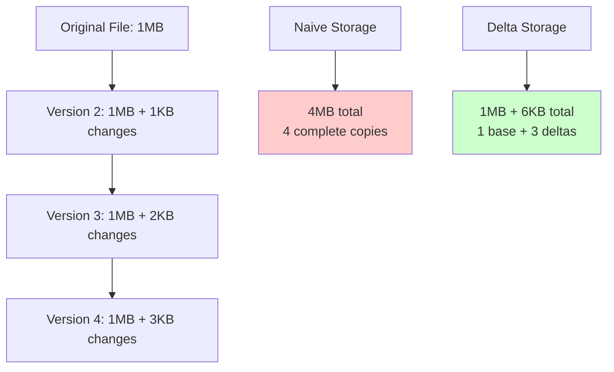
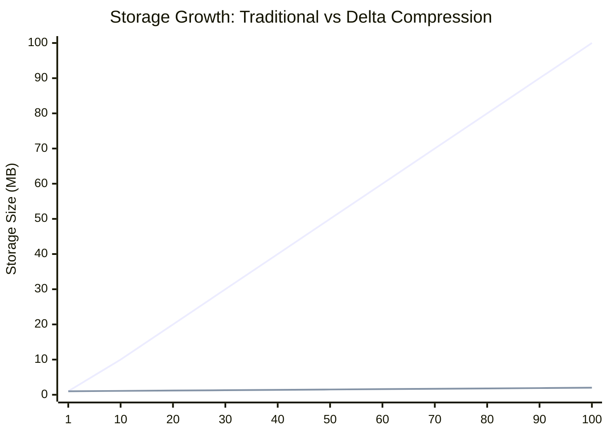
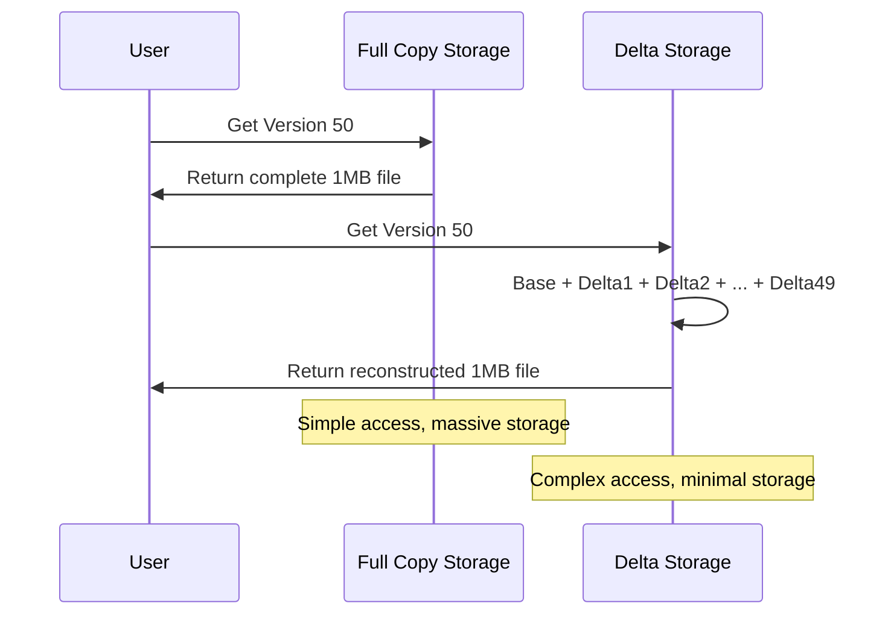

# The Core Problem: The Storage Explosion

## Why Full Versioning is Unsustainable

Imagine you're maintaining a software project with daily commits. Each day, you save the entire codebase - every single file, line by line. After a year, you have 365 complete copies of your project, even though most files barely changed.

This scenario illustrates the fundamental problem that delta compression solves: **storing multiple versions of similar data is incredibly wasteful when using naive full-copy approaches.**

## The Real-World Impact

Consider these scenarios where full versioning creates genuine pain:

### The Document Collaboration Disaster
A legal team works on a 100-page contract. Each revision creates a new 2MB file. After 50 rounds of edits, they have 100MB of storage for documents that differ by perhaps 1-2% per revision. The storage cost explodes while the actual changes remain minimal.

### The Database Backup Nightmare  
A database contains 1TB of customer data. Daily backups create complete copies, consuming 365TB per year. Yet most customer records remain unchanged between backups - you're storing the same data hundreds of times.

### The Software Repository Explosion
A codebase grows to 500MB. With traditional version control that stores complete snapshots, 1000 commits would require 500GB. But in reality, most commits change less than 1% of the files.

### The File Synchronization Problem
Cloud storage services need to sync files across devices. If they transferred complete files for every small change, users would quickly exhaust bandwidth and storage quotas. A single character change in a large document would require transferring the entire file.

## The Storage Mathematics

The inefficiency becomes clear when we examine the math:

**The Wasteful Pattern:**
- File size: 1MB
- Changes per version: 1KB (0.1% of file)
- 100 versions with full copies: 100MB storage
- 100 versions with deltas: 1MB + 99KB ≈ 1.1MB storage
- **Space savings: 99%**

*Red line: Traditional storage grows linearly with versions*  
*Blue line: Delta storage grows minimally with versions*

## The Bandwidth Crisis

Storage isn't the only problem. Network transfer amplifies the waste:

**Traditional Sync:**
- Original file: 1MB download
- Small edit: 1MB download (entire file again)
- Another edit: 1MB download (entire file again)

**Delta Sync:**
- Original file: 1MB download  
- Small edit: 1KB download (just the changes)
- Another edit: 1KB download (just the changes)

This difference between megabyte and kilobyte transfers determines whether applications feel responsive or sluggish.

## The Version Access Problem

Full versioning creates another issue: **version reconstruction becomes trivial but wasteful**, while accessing any specific version requires storing complete copies.

## The Core Challenge

The fundamental problem is choosing between:

1. **Space Efficiency**: Store only changes, save massive amounts of storage
2. **Time Efficiency**: Store complete copies, enable instant access to any version
3. **Network Efficiency**: Transfer only changes, save bandwidth and time

Delta compression solves this by making space and network efficiency primary, while developing clever techniques to minimize the time penalty for version reconstruction.

## Why This Problem Matters

Every system that handles versioned data faces this challenge:

- **Git repositories**: Millions of developers rely on efficient version storage
- **Document systems**: Google Docs, Microsoft Office, collaborative editors
- **Database systems**: Point-in-time recovery, change data capture
- **Backup systems**: Incremental backups, snapshot management
- **Content delivery**: Software updates, media streaming, file synchronization

Without delta compression, these systems would be prohibitively expensive to operate at scale.

The core insight is that **most changes to data are incremental**, making full copies a fundamentally mismatched approach to an incremental problem.