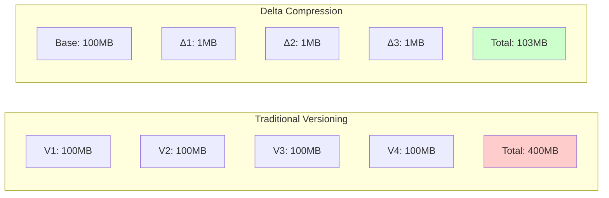
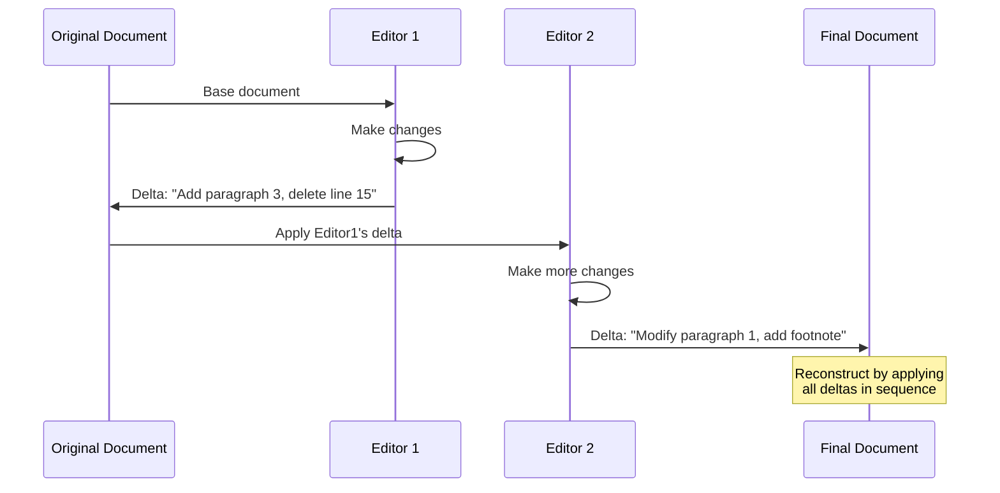
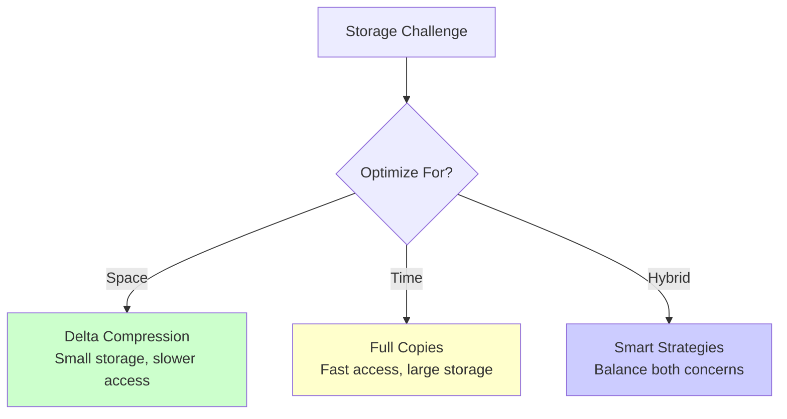

# The Guiding Philosophy: Store the Change, Not the Copy

## The Core Insight

Delta compression operates on a beautifully simple principle: **Why store what hasn't changed?**

Instead of creating complete copies for each version, delta compression takes a fundamentally different approach:
1. Store one complete "base" version
2. For each subsequent version, store only the differences (deltas) 
3. Reconstruct any version by applying the appropriate deltas to the base

This philosophy transforms versioning from a multiplication problem into an addition problem.

## The Document Collaboration Analogy

Think of delta compression like collaborative document editing:

**Traditional Approach**: Each time someone makes an edit, they email you a complete new copy of the entire document. Your inbox fills with nearly identical large files.

**Delta Approach**: Each person sends you only their "track changes" - highlighting what they added, removed, or modified. You can apply these changes to your original document to see the final result.

## The Three Philosophical Pillars

### 1. Incremental Reality
Most real-world changes are incremental. Code commits typically modify 1-5% of files. Document edits change a few paragraphs. Database updates affect specific rows. Delta compression aligns with this natural pattern.

### 2. Redundancy Elimination
Traditional versioning assumes every version needs independent storage. Delta compression recognizes that versions are related and exploits those relationships to eliminate redundant information.

### 3. Temporal Locality
Changes tend to cluster around recent versions. The most recent version is accessed most frequently, so optimizing for recent data makes practical sense.

## Trade-offs and Philosophy

### What We Gain
- **Massive Space Savings**: 90-99% reduction in storage requirements
- **Network Efficiency**: Transfer only changes, not complete files
- **Historical Preservation**: Keep complete version history without storage explosion
- **Bandwidth Optimization**: Critical for mobile and low-bandwidth scenarios

### What We Accept
- **Reconstruction Cost**: Accessing old versions requires applying multiple deltas
- **Complexity**: More sophisticated algorithms and error handling
- **Chain Dependencies**: Corrupted deltas can affect multiple versions
- **CPU Trade-off**: Exchange storage space for computation time

## The Philosophical Question

Delta compression embodies a fundamental trade-off in computer science: **Space versus Time**.

Traditional systems optimize for time (instant access to any version). Delta compression optimizes for space (minimal storage requirements). Modern systems use hybrid approaches to balance both concerns.

## The Compression Philosophy

Delta compression is fundamentally different from general compression (like ZIP):

**General Compression**: Find patterns within a single file
- Input: One file → Output: Smaller version of same file
- Focus: Redundancy within individual data

**Delta Compression**: Find patterns between multiple versions  
- Input: Multiple related files → Output: Base + changes
- Focus: Redundancy across related data

## Implementation Philosophy Spectrum

Delta compression systems exist on a spectrum of philosophical approaches:

### Forward Deltas (Simple Philosophy)
- Base + Delta1 + Delta2 + ... = Latest Version
- Philosophy: "Build up to current state"
- Advantage: Conceptually simple
- Disadvantage: Accessing latest version requires applying all deltas

### Reverse Deltas (Performance Philosophy) 
- Latest - Delta1 - Delta2 - ... = Older Version
- Philosophy: "Work backwards from current state"
- Advantage: Latest version is immediately available
- Disadvantage: Accessing older versions requires more computation

### Hybrid Approaches (Pragmatic Philosophy)
- Combine multiple strategies based on access patterns
- Philosophy: "Optimize for real usage"
- Advantage: Balance multiple concerns
- Disadvantage: Implementation complexity

## The Network Effect Philosophy

Delta compression becomes more valuable as systems scale:

- **Individual files**: Modest savings
- **Large repositories**: Substantial savings  
- **Distributed systems**: Critical for feasibility
- **Global scale**: Difference between possible and impossible

This network effect explains why delta compression is fundamental to systems like Git, which manages millions of repositories worldwide.

## The Future-Proofing Philosophy

Delta compression prepares systems for growth:
- **Data volumes grow**: Storage savings become more critical
- **Network becomes constrained**: Bandwidth efficiency increases in value
- **Global distribution**: Synchronization costs multiply across regions
- **Real-time collaboration**: Instant updates require minimal data transfer

Understanding delta compression means understanding how to build systems that scale gracefully with both data size and user count.