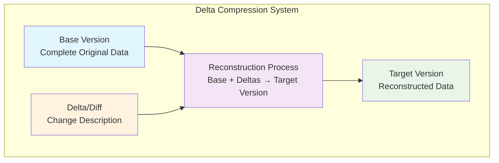
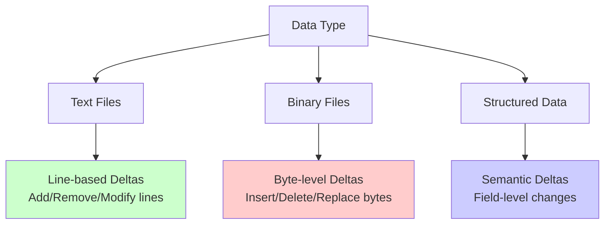
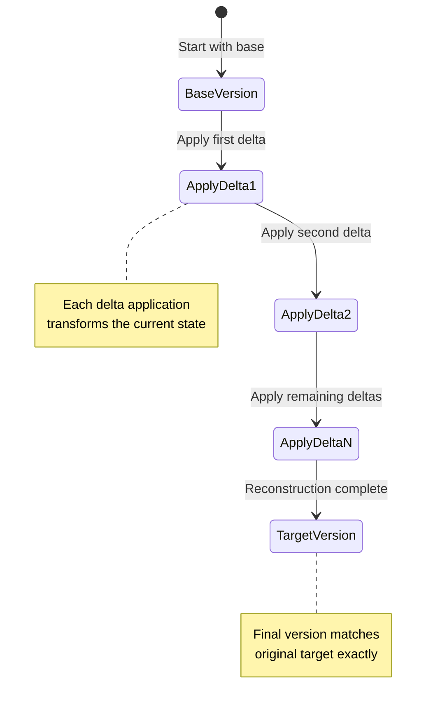
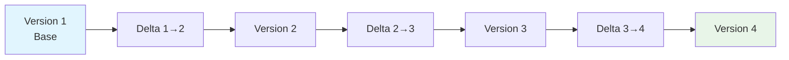
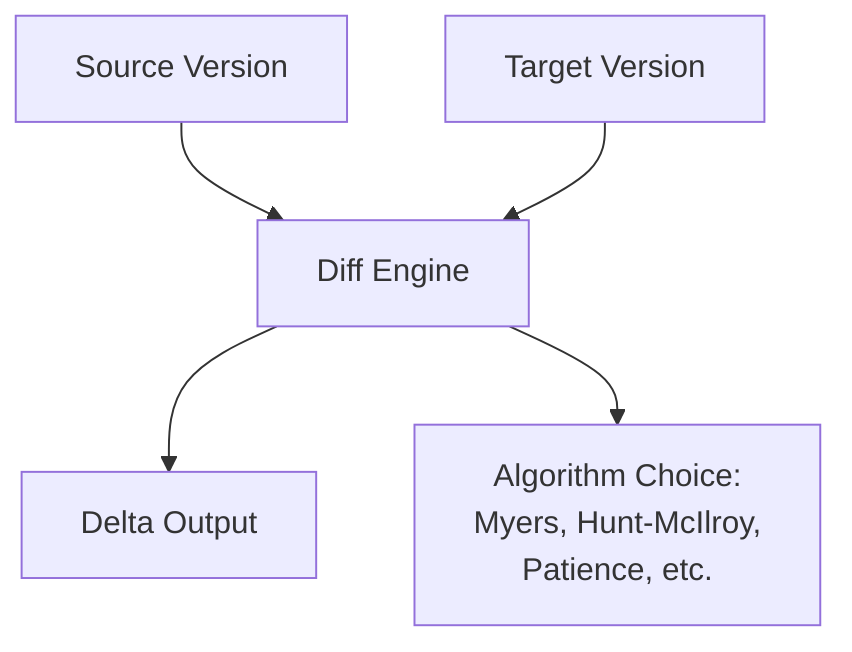
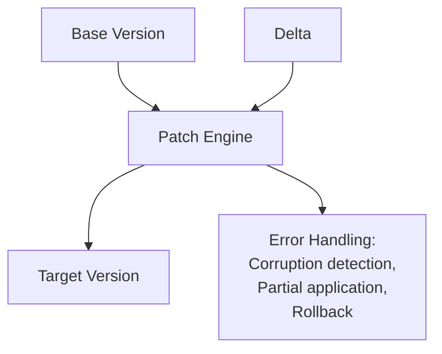
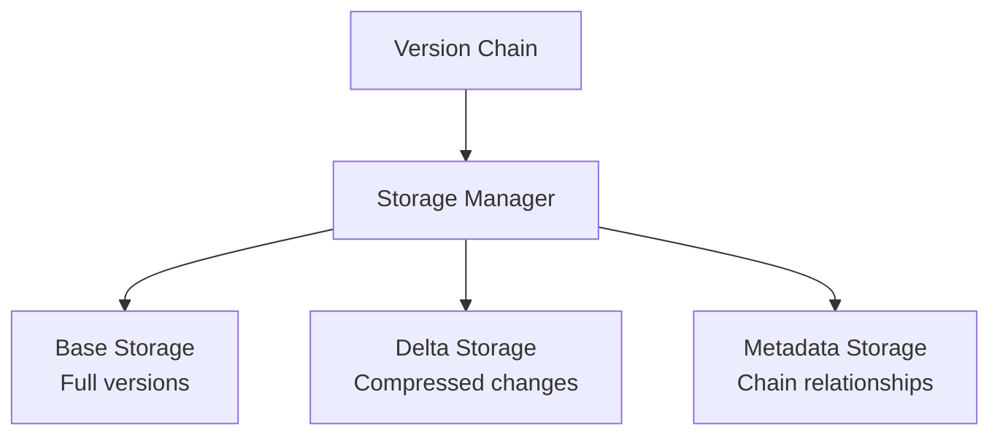
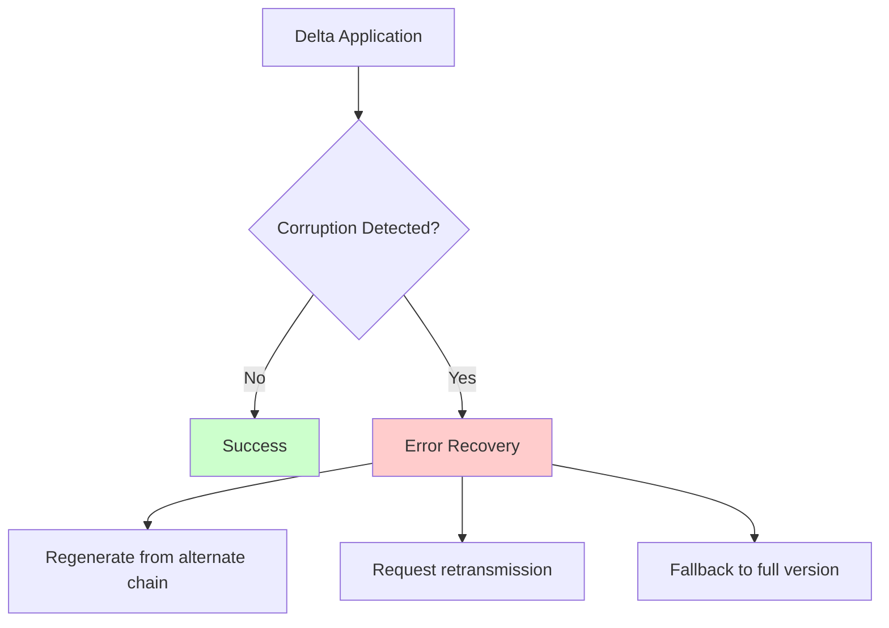
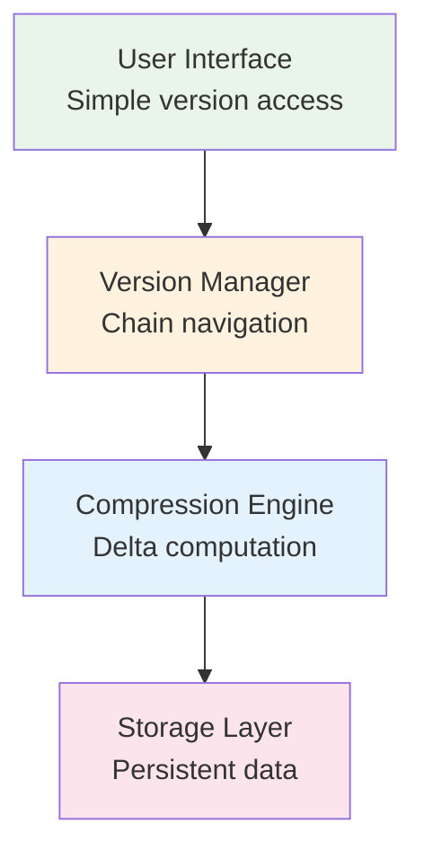

# Key Abstractions: The Building Blocks of Delta Compression

## The Three Core Abstractions

Delta compression systems are built around three fundamental concepts that work together to transform versioning from a storage explosion into an efficient differencing system:



### 1. Base Version
The complete, uncompressed representation of data at a specific point in time. This serves as the foundation for all delta operations.

**Mental Model**: Think of the base version as the "original document" in a collaborative editing session. Everyone starts with this complete version, and all changes reference back to it.

**Key Properties:**
- **Complete**: Contains all information needed to understand the data
- **Self-contained**: Can be used independently without dependencies
- **Reference point**: All deltas are calculated relative to this version

### 2. Delta (Difference)
A compact description of what changed between two versions of data. Deltas capture only the differences, not the unchanged portions.

**Mental Model**: Think of deltas as "editing instructions" - like saying "delete paragraph 3, insert new text at line 15, change word 'cat' to 'dog' in paragraph 5."

**Key Properties:**
- **Compact**: Much smaller than full versions
- **Descriptive**: Captures exact changes made
- **Reversible**: Can often be undone or applied in reverse

### 3. Reconstruction Process
The algorithm that applies deltas to reconstruct target versions from a base version.

**Mental Model**: Think of reconstruction as following a recipe - start with base ingredients (base version) and apply each instruction (delta) in sequence to create the final dish (target version).

## Delta Types and Abstractions

Different types of data require different delta representations:



### Line-Based Deltas (Text)
**Example Delta Format:**
```
@@ -10,3 +10,4 @@
 existing line 9
 existing line 10
-deleted line 11
+new line 11
+additional new line
 existing line 12
```

### Byte-Level Deltas (Binary)
**Example Delta Operations:**
- Insert 5 bytes at position 1024
- Delete 10 bytes starting at position 2048  
- Replace 3 bytes at position 4096 with new data

### Semantic Deltas (Structured)
**Example for JSON:**
```json
{
  "changes": [
    {"op": "replace", "path": "/name", "value": "New Name"},
    {"op": "add", "path": "/tags/-", "value": "new-tag"},
    {"op": "remove", "path": "/deprecated_field"}
  ]
}
```

## The Reconstruction Abstraction

Reconstruction can follow different patterns based on system design:



### Forward Reconstruction
Start with base version, apply deltas in chronological order:
```
Version 1 (base) + Delta(1→2) + Delta(2→3) + Delta(3→4) = Version 4
```

### Reverse Reconstruction  
Start with latest version, apply reverse deltas:
```
Version 4 (latest) - Delta(3→4) - Delta(2→3) - Delta(1→2) = Version 1
```

## The Version Chain Abstraction

Delta compression creates relationships between versions:



**Chain Properties:**
- **Linear dependency**: Each version depends on its predecessors
- **Cumulative changes**: Deltas accumulate to represent total change
- **Break point sensitivity**: Corruption affects all subsequent versions

## Implementation Pattern Abstractions

### The Diff Engine
Responsible for calculating differences between versions:



### The Patch Engine  
Responsible for applying deltas to reconstruct versions:



### The Storage Manager
Handles persistent storage of bases and deltas:



## The Compression Efficiency Abstraction

Different delta algorithms achieve different compression ratios:

### Content-Aware Deltas
- **Text files**: Line-based algorithms excel
- **Binary files**: Byte-level algorithms work better  
- **Structured data**: Semantic algorithms provide best compression

### Context-Sensitive Compression
- **Recent changes**: Short delta chains
- **Distant changes**: Longer delta chains, possibly with intermediate bases
- **Popular versions**: May warrant full storage for performance

## Error Handling Abstractions

Delta systems must handle various failure modes:



**Key Recovery Strategies:**
- **Redundant chains**: Multiple delta paths to same version
- **Periodic full snapshots**: Limit chain length for error containment
- **Checksums**: Detect corruption early in reconstruction process

## The Optimization Abstraction Hierarchy



Each layer optimizes for different concerns:
- **User Interface**: Simplicity and performance
- **Version Manager**: Efficient chain traversal and caching
- **Compression Engine**: Maximum space savings
- **Storage Layer**: Reliability and durability

## Key Design Insights

**Abstraction Separation**: Clean separation between delta calculation, storage, and reconstruction enables independent optimization of each component.

**Version Accessibility**: The chain abstraction means some versions are "closer" (cheaper to access) than others, influencing system design decisions.

**Error Propagation**: The dependency chain means error handling must be designed into the abstraction from the beginning, not added as an afterthought.

Understanding these abstractions provides the foundation for implementing efficient delta compression systems and reasoning about their behavior under various conditions.