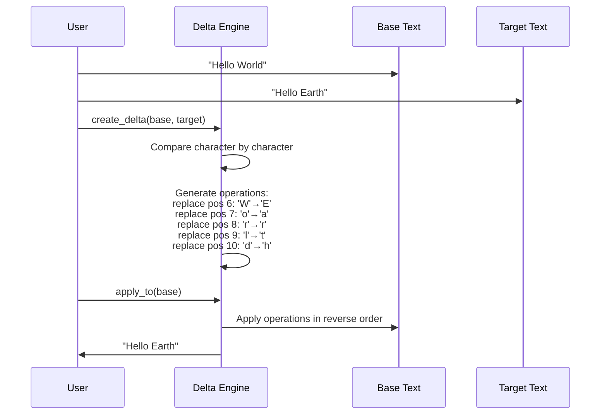
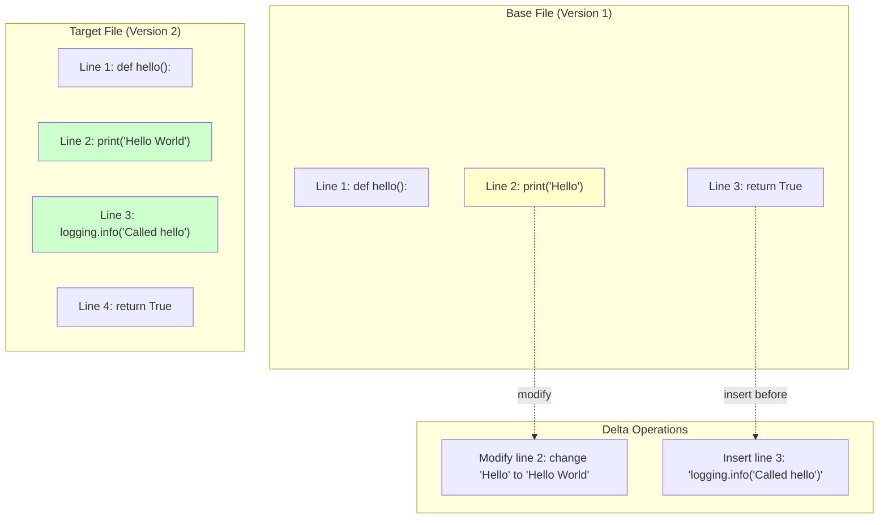
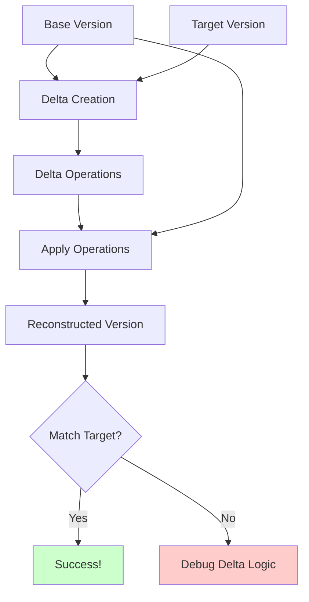

# Getting Started: Your First Delta Compression Implementation

## The Simplest Possible Example

Let's build a minimal delta compression system to understand the core mechanics. We'll start with Python for clarity:

```python
class SimpleDelta:
    def __init__(self):
        self.operations = []
    
    def add_operation(self, op_type, position, data=None):
        """Add a delta operation: insert, delete, or replace"""
        self.operations.append({
            'type': op_type,
            'position': position, 
            'data': data
        })
    
    def apply_to(self, base_text):
        """Apply this delta to base text to get target text"""
        result = list(base_text)  # Convert to list for easier modification
        
        # Sort operations by position (reverse order for proper indexing)
        sorted_ops = sorted(self.operations, key=lambda x: x['position'], reverse=True)
        
        for op in sorted_ops:
            if op['type'] == 'insert':
                result.insert(op['position'], op['data'])
            elif op['type'] == 'delete':
                del result[op['position']]
            elif op['type'] == 'replace':
                result[op['position']] = op['data']
        
        return ''.join(result)

def create_simple_delta(base_text, target_text):
    """Create a very basic delta between two strings"""
    delta = SimpleDelta()
    
    # Simple character-by-character comparison
    base_chars = list(base_text)
    target_chars = list(target_text)
    
    min_len = min(len(base_chars), len(target_chars))
    
    # Handle replacements in existing positions
    for i in range(min_len):
        if base_chars[i] != target_chars[i]:
            delta.add_operation('replace', i, target_chars[i])
    
    # Handle insertions (target is longer)
    if len(target_chars) > len(base_chars):
        for i in range(len(base_chars), len(target_chars)):
            delta.add_operation('insert', i, target_chars[i])
    
    # Handle deletions (target is shorter)  
    elif len(base_chars) > len(target_chars):
        for i in range(len(target_chars), len(base_chars)):
            delta.add_operation('delete', len(target_chars), None)
    
    return delta
```

## Walking Through the Behavior

Let's see this in action with a visual representation:



```python
# Example usage
base = "Hello World"
target = "Hello Earth"

print(f"Base: '{base}'")
print(f"Target: '{target}'")

# Create delta
delta = create_simple_delta(base, target)
print(f"Delta operations: {len(delta.operations)}")

for i, op in enumerate(delta.operations):
    print(f"  {i+1}. {op['type']} at position {op['position']}: {op['data']}")

# Apply delta
result = delta.apply_to(base)
print(f"Result: '{result}'")
print(f"Success: {result == target}")
```

Output:
```
Base: 'Hello World'
Target: 'Hello Earth'
Delta operations: 5
  1. replace at position 6: E
  2. replace at position 7: a
  3. replace at position 8: r
  4. replace at position 9: t
  5. replace at position 10: h
Result: 'Hello Earth'
Success: True
```

## A More Realistic Line-Based Example

Here's a practical implementation for text files that works at the line level:

```python
class LineDelta:
    def __init__(self):
        self.operations = []
    
    def add_insert(self, line_number, content):
        """Insert a line at specified position"""
        self.operations.append({
            'type': 'insert',
            'line': line_number,
            'content': content
        })
    
    def add_delete(self, line_number):
        """Delete line at specified position"""
        self.operations.append({
            'type': 'delete', 
            'line': line_number
        })
    
    def add_modify(self, line_number, new_content):
        """Modify line at specified position"""
        self.operations.append({
            'type': 'modify',
            'line': line_number, 
            'content': new_content
        })
    
    def apply_to(self, base_lines):
        """Apply delta to list of lines"""
        result = base_lines.copy()
        
        # Sort operations by line number (reverse for correct indexing)
        sorted_ops = sorted(self.operations, key=lambda x: x['line'], reverse=True)
        
        for op in sorted_ops:
            if op['type'] == 'insert':
                result.insert(op['line'], op['content'])
            elif op['type'] == 'delete':
                if op['line'] < len(result):
                    del result[op['line']]
            elif op['type'] == 'modify':
                if op['line'] < len(result):
                    result[op['line']] = op['content']
        
        return result

def create_line_delta(base_lines, target_lines):
    """Create a line-based delta using simple longest common subsequence"""
    delta = LineDelta()
    
    # Simple line-by-line comparison (not optimal, but educational)
    base_set = set(enumerate(base_lines))
    target_set = set(enumerate(target_lines))
    
    max_len = max(len(base_lines), len(target_lines))
    
    for i in range(max_len):
        base_line = base_lines[i] if i < len(base_lines) else None
        target_line = target_lines[i] if i < len(target_lines) else None
        
        if base_line is None and target_line is not None:
            # Need to insert
            delta.add_insert(i, target_line)
        elif base_line is not None and target_line is None:
            # Need to delete
            delta.add_delete(i)
        elif base_line != target_line:
            # Need to modify
            delta.add_modify(i, target_line)
    
    return delta
```

## Visual Representation of Line Changes



## Testing the Line-Based Implementation

```python
# Example with code files
base_code = [
    "def hello():",
    "    print('Hello')",
    "    return True"
]

target_code = [
    "def hello():", 
    "    print('Hello World')",
    "    logging.info('Called hello')",
    "    return True"
]

print("Base code:")
for i, line in enumerate(base_code):
    print(f"  {i+1}: {line}")

print("\nTarget code:")
for i, line in enumerate(target_code):
    print(f"  {i+1}: {line}")

# Create and apply delta
delta = create_line_delta(base_code, target_code)
result = delta.apply_to(base_code)

print(f"\nDelta has {len(delta.operations)} operations:")
for op in delta.operations:
    if op['type'] == 'modify':
        print(f"  Modify line {op['line']}: '{op['content']}'")
    elif op['type'] == 'insert':
        print(f"  Insert at line {op['line']}: '{op['content']}'")
    elif op['type'] == 'delete':
        print(f"  Delete line {op['line']}")

print(f"\nReconstruction successful: {result == target_code}")
```

## What Just Happened?



1. **Delta Creation**: We compared base and target versions to identify differences
2. **Operation Generation**: We created a list of atomic operations (insert, delete, modify)
3. **Application**: We applied operations in the correct order to reconstruct the target
4. **Verification**: We confirmed the reconstruction exactly matches the target

## Key Insights

**Position Sensitivity**: Operations must be applied in reverse order to maintain correct line/character positions as the text changes.

**Operation Granularity**: Character-level deltas are more precise but create larger delta files. Line-level deltas are more efficient for text files but less precise.

**Reconstruction Accuracy**: A properly implemented delta system guarantees bit-for-bit reconstruction of the target version.

## Performance Characteristics

```python
import time

def benchmark_delta_vs_full_copy():
    # Create large base text
    base_text = "Hello World\n" * 10000  # ~120KB
    target_text = base_text.replace("World", "Earth")  # Small change
    
    # Measure full copy
    start = time.time()
    full_copy = target_text  # Simulate storing complete file
    full_copy_time = time.time() - start
    full_copy_size = len(target_text.encode())
    
    # Measure delta
    start = time.time()
    delta = create_simple_delta(base_text, target_text)
    delta_time = time.time() - start
    delta_size = len(str(delta.operations).encode())  # Rough estimate
    
    print(f"Full copy: {full_copy_size} bytes, {full_copy_time:.6f}s")
    print(f"Delta: {delta_size} bytes, {delta_time:.6f}s")
    print(f"Space savings: {(1 - delta_size/full_copy_size)*100:.1f}%")
```

This simple implementation demonstrates the core principles. Production systems use much more sophisticated algorithms (like Myers' diff algorithm) for optimal performance and space efficiency.