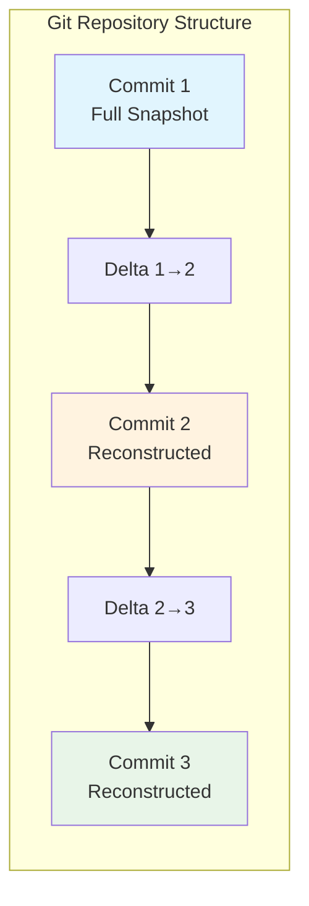
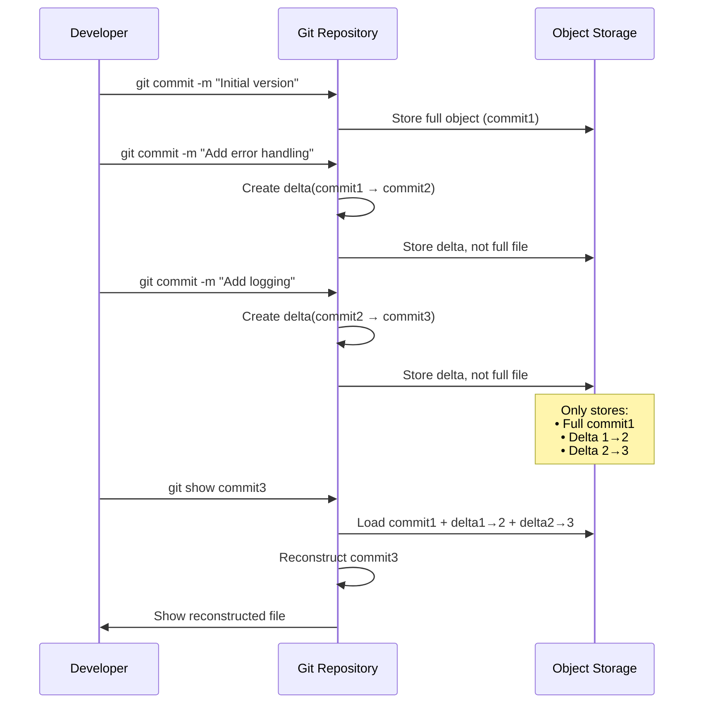

# Simulating Git Deltas: Understanding Version Control Magic

## The Git Delta Model

Git doesn't store complete files for each commit. Instead, it uses a sophisticated delta compression system that makes massive repositories feasible. Let's simulate how Git creates and applies deltas.



## Building a Git-Like Delta System

```python
import hashlib
import time
import zlib
from typing import List, Dict, Optional

class GitDelta:
    """Simplified Git-style delta implementation"""
    
    def __init__(self):
        self.source_size = 0
        self.target_size = 0
        self.operations = []
    
    def add_copy(self, source_offset: int, size: int):
        """Copy bytes from source at offset"""
        self.operations.append({
            'type': 'copy',
            'source_offset': source_offset,
            'size': size
        })
    
    def add_insert(self, data: bytes):
        """Insert new data"""
        self.operations.append({
            'type': 'insert', 
            'data': data
        })
    
    def apply_to(self, source: bytes) -> bytes:
        """Apply delta to source to get target"""
        result = bytearray()
        
        for op in self.operations:
            if op['type'] == 'copy':
                start = op['source_offset']
                end = start + op['size']
                result.extend(source[start:end])
            elif op['type'] == 'insert':
                result.extend(op['data'])
        
        return bytes(result)
    
    def serialize(self) -> bytes:
        """Serialize delta for storage (simplified)"""
        # In real Git, this uses a compact binary format
        import pickle
        return pickle.dumps({
            'source_size': self.source_size,
            'target_size': self.target_size,
            'operations': self.operations
        })
    
    @classmethod
    def deserialize(cls, data: bytes) -> 'GitDelta':
        """Deserialize delta from storage"""
        import pickle
        obj_data = pickle.loads(data)
        
        delta = cls()
        delta.source_size = obj_data['source_size']
        delta.target_size = obj_data['target_size'] 
        delta.operations = obj_data['operations']
        return delta

def create_git_style_delta(source: bytes, target: bytes) -> GitDelta:
    """
    Create a Git-style delta using a sliding window approach.
    This is a simplified version of Git's actual algorithm.
    """
    delta = GitDelta()
    delta.source_size = len(source)
    delta.target_size = len(target)
    
    # Simple implementation: find common substrings
    target_pos = 0
    
    while target_pos < len(target):
        # Look for the longest match in source
        best_match_offset = -1
        best_match_size = 0
        
        # Search for matches (simplified - real Git uses rolling hash)
        for source_pos in range(len(source)):
            match_size = 0
            while (target_pos + match_size < len(target) and 
                   source_pos + match_size < len(source) and
                   target[target_pos + match_size] == source[source_pos + match_size]):
                match_size += 1
            
            if match_size > best_match_size and match_size >= 4:  # Minimum match size
                best_match_offset = source_pos
                best_match_size = match_size
        
        if best_match_size > 0:
            # Found a good match - use copy operation
            delta.add_copy(best_match_offset, best_match_size)
            target_pos += best_match_size
        else:
            # No match found - insert the byte
            delta.add_insert(target[target_pos:target_pos+1])
            target_pos += 1
    
    return delta
```

## Real Git Delta Example

Let's simulate how Git handles a realistic code change:

```python
def simulate_git_commit_sequence():
    """Simulate a sequence of Git commits with delta compression"""
    
    # Initial file (Commit 1)
    commit1_content = """def calculate_sum(numbers):
    total = 0
    for num in numbers:
        total += num
    return total

def main():
    data = [1, 2, 3, 4, 5]
    result = calculate_sum(data)
    print(f"Sum: {result}")

if __name__ == "__main__":
    main()
""".encode()

    # Modified file (Commit 2) - add error handling
    commit2_content = """def calculate_sum(numbers):
    if not numbers:
        return 0
    
    total = 0
    for num in numbers:
        if not isinstance(num, (int, float)):
            raise TypeError("All numbers must be numeric")
        total += num
    return total

def main():
    data = [1, 2, 3, 4, 5]
    result = calculate_sum(data)
    print(f"Sum: {result}")

if __name__ == "__main__":
    main()
""".encode()

    # Modified file (Commit 3) - add logging
    commit3_content = """import logging

def calculate_sum(numbers):
    logging.info(f"Calculating sum of {len(numbers)} numbers")
    if not numbers:
        return 0
    
    total = 0
    for num in numbers:
        if not isinstance(num, (int, float)):
            raise TypeError("All numbers must be numeric")
        total += num
    
    logging.info(f"Sum calculated: {total}")
    return total

def main():
    logging.basicConfig(level=logging.INFO)
    data = [1, 2, 3, 4, 5]
    result = calculate_sum(data)
    print(f"Sum: {result}")

if __name__ == "__main__":
    main()
""".encode()

    return commit1_content, commit2_content, commit3_content

# Create the commit sequence
commit1, commit2, commit3 = simulate_git_commit_sequence()

print("=== Git Delta Simulation ===")
print(f"Commit 1 size: {len(commit1)} bytes")
print(f"Commit 2 size: {len(commit2)} bytes") 
print(f"Commit 3 size: {len(commit3)} bytes")
print()

# Create deltas
delta_1_to_2 = create_git_style_delta(commit1, commit2)
delta_2_to_3 = create_git_style_delta(commit2, commit3)

print("=== Delta Analysis ===")
print(f"Delta 1→2 operations: {len(delta_1_to_2.operations)}")
print(f"Delta 2→3 operations: {len(delta_2_to_3.operations)}")

# Show delta operations for commit 1→2
print("\nDelta 1→2 operations:")
for i, op in enumerate(delta_1_to_2.operations[:5]):  # Show first 5
    if op['type'] == 'copy':
        print(f"  {i+1}. Copy {op['size']} bytes from offset {op['source_offset']}")
    else:
        data_preview = op['data'][:20] + b'...' if len(op['data']) > 20 else op['data']
        print(f"  {i+1}. Insert: {data_preview}")

# Test reconstruction
reconstructed_2 = delta_1_to_2.apply_to(commit1)
reconstructed_3 = delta_2_to_3.apply_to(commit2)

print(f"\nReconstruction test:")
print(f"Commit 1→2 reconstruction: {'✓' if reconstructed_2 == commit2 else '✗'}")
print(f"Commit 2→3 reconstruction: {'✓' if reconstructed_3 == commit3 else '✗'}")
```

## Delta Chain Visualization



## Storage Efficiency Analysis

```python
def analyze_storage_efficiency():
    """Compare traditional vs delta storage"""
    commit1, commit2, commit3 = simulate_git_commit_sequence()
    
    # Traditional storage (full copies)
    traditional_storage = len(commit1) + len(commit2) + len(commit3)
    
    # Delta storage
    delta_1_to_2 = create_git_style_delta(commit1, commit2)
    delta_2_to_3 = create_git_style_delta(commit2, commit3)
    
    delta_1_to_2_serialized = delta_1_to_2.serialize()
    delta_2_to_3_serialized = delta_2_to_3.serialize()
    
    delta_storage = len(commit1) + len(delta_1_to_2_serialized) + len(delta_2_to_3_serialized)
    
    print("=== Storage Efficiency Analysis ===")
    print(f"Traditional storage: {traditional_storage} bytes")
    print(f"Delta storage: {delta_storage} bytes")
    print(f"Space savings: {(1 - delta_storage/traditional_storage)*100:.1f}%")
    
    print(f"\nBreakdown:")
    print(f"  Full commit1: {len(commit1)} bytes")
    print(f"  Full commit2: {len(commit2)} bytes")
    print(f"  Full commit3: {len(commit3)} bytes")
    print(f"  Delta 1→2: {len(delta_1_to_2_serialized)} bytes")
    print(f"  Delta 2→3: {len(delta_2_to_3_serialized)} bytes")

analyze_storage_efficiency()
```

## Git's Pack File Simulation

Git stores deltas in "pack files" for maximum efficiency:

```python
class GitPackFile:
    """Simplified Git pack file implementation"""
    
    def __init__(self):
        self.objects = {}  # object_id -> (type, data)
        self.deltas = {}   # object_id -> (base_id, delta)
    
    def add_full_object(self, object_id: str, content: bytes):
        """Add a full object (no delta)"""
        self.objects[object_id] = ('full', content)
    
    def add_delta_object(self, object_id: str, base_id: str, delta: GitDelta):
        """Add an object as delta from base"""
        self.deltas[object_id] = (base_id, delta)
    
    def get_object(self, object_id: str) -> bytes:
        """Retrieve an object, reconstructing if necessary"""
        if object_id in self.objects:
            obj_type, data = self.objects[object_id]
            return data
        
        if object_id in self.deltas:
            base_id, delta = self.deltas[object_id]
            base_data = self.get_object(base_id)  # Recursive reconstruction
            return delta.apply_to(base_data)
        
        raise KeyError(f"Object {object_id} not found")
    
    def get_storage_stats(self):
        """Get pack file storage statistics"""
        full_size = sum(len(data) for _, data in self.objects.values())
        delta_size = sum(len(delta.serialize()) for _, delta in self.deltas.values())
        
        return {
            'full_objects': len(self.objects),
            'delta_objects': len(self.deltas),
            'full_size': full_size,
            'delta_size': delta_size,
            'total_size': full_size + delta_size
        }

# Simulate Git pack file usage
def simulate_git_pack():
    pack = GitPackFile()
    
    commit1, commit2, commit3 = simulate_git_commit_sequence()
    
    # Add objects to pack file
    pack.add_full_object("commit1", commit1)
    
    delta_1_to_2 = create_git_style_delta(commit1, commit2)
    pack.add_delta_object("commit2", "commit1", delta_1_to_2)
    
    delta_2_to_3 = create_git_style_delta(commit2, commit3)
    pack.add_delta_object("commit3", "commit2", delta_2_to_3)
    
    # Test reconstruction
    reconstructed_commit2 = pack.get_object("commit2")
    reconstructed_commit3 = pack.get_object("commit3")
    
    print("=== Git Pack File Simulation ===")
    print(f"Commit2 reconstruction: {'✓' if reconstructed_commit2 == commit2 else '✗'}")
    print(f"Commit3 reconstruction: {'✓' if reconstructed_commit3 == commit3 else '✗'}")
    
    stats = pack.get_storage_stats()
    print(f"\nPack file stats:")
    print(f"  Full objects: {stats['full_objects']}")
    print(f"  Delta objects: {stats['delta_objects']}")
    print(f"  Total size: {stats['total_size']} bytes")
    print(f"  Storage efficiency: {(1 - stats['total_size']/(len(commit1) + len(commit2) + len(commit3)))*100:.1f}% savings")

simulate_git_pack()
```

## Key Insights

**Chain Reconstruction**: Git reconstructs objects by following delta chains, which can be deep in large repositories.

**Storage Optimization**: Git chooses delta bases intelligently, sometimes using reverse deltas (storing latest version in full, deltas to reach older versions).

**Pack File Efficiency**: Git's pack files achieve 50-90% storage savings in typical repositories.

**Access Patterns**: Recent commits are optimized for fast access, while older commits may require longer reconstruction chains.

This simulation demonstrates why Git can efficiently store massive code repositories with millions of commits - the magic is in sophisticated delta compression that stores only what actually changed between versions.