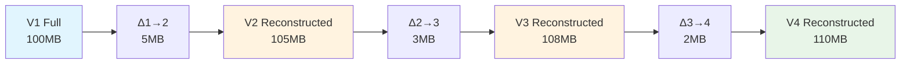
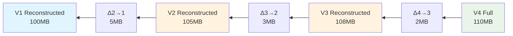
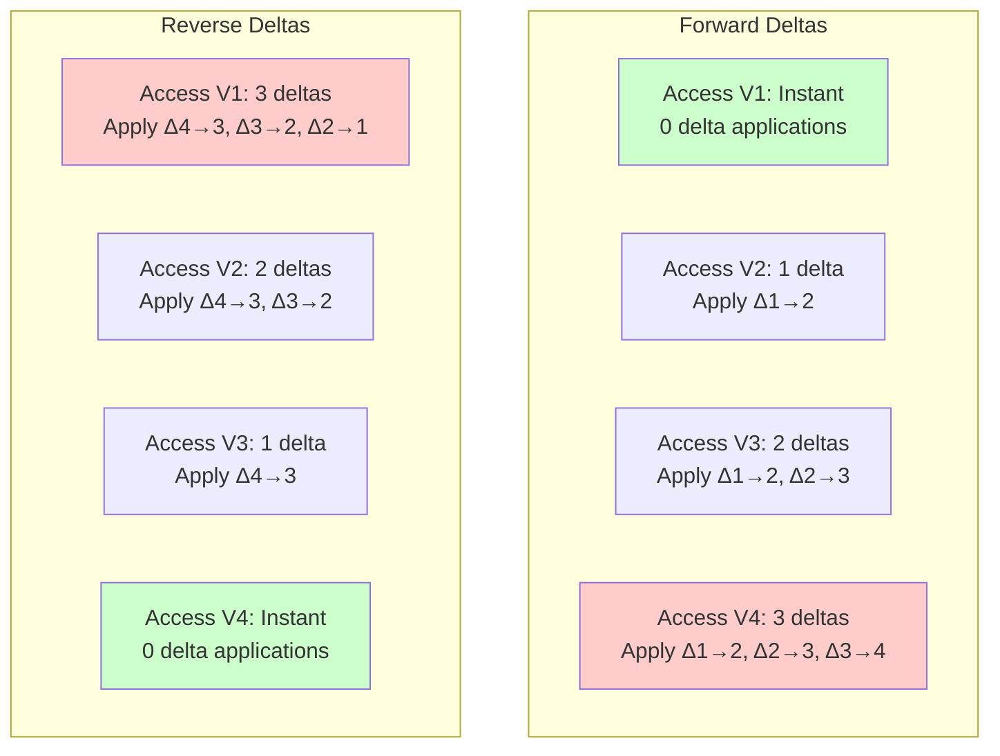
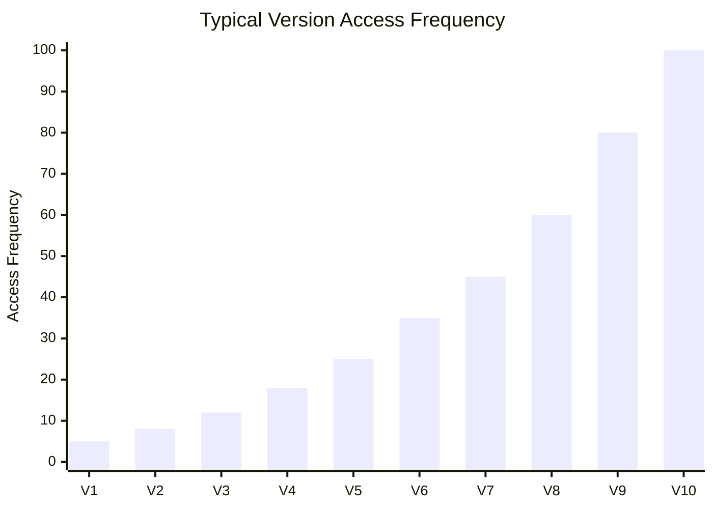
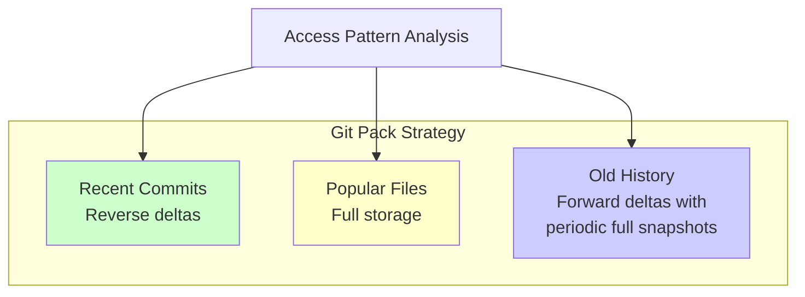
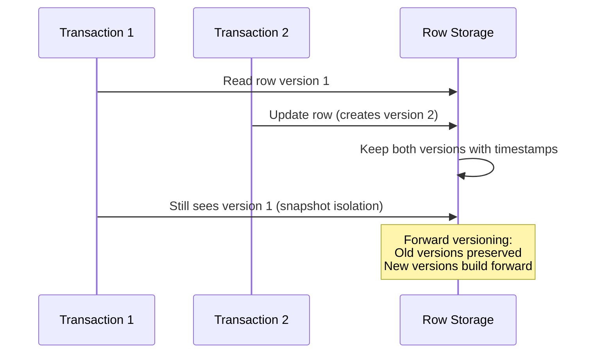
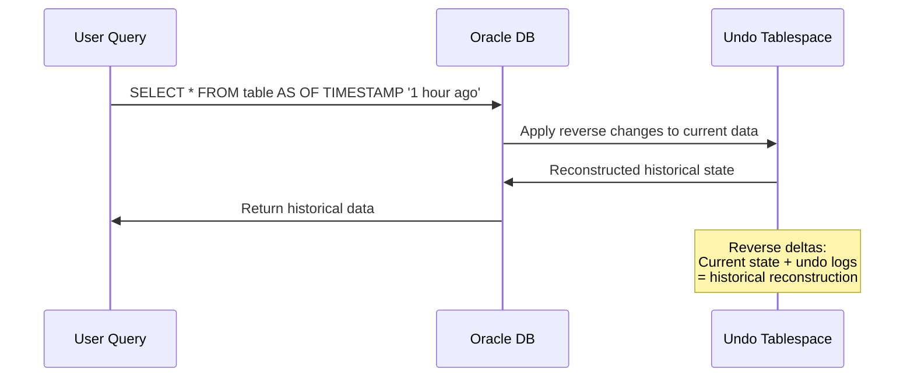
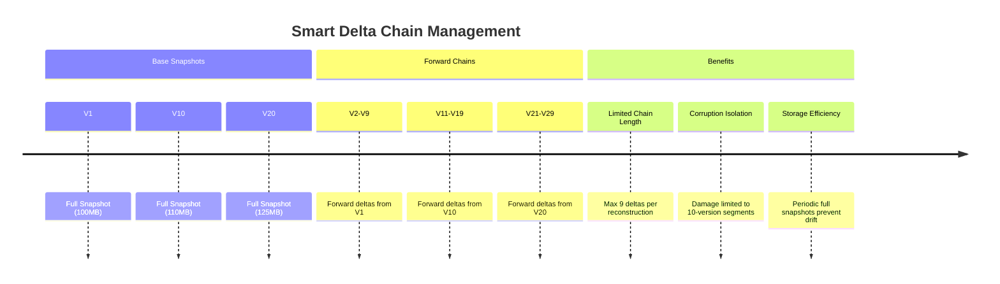
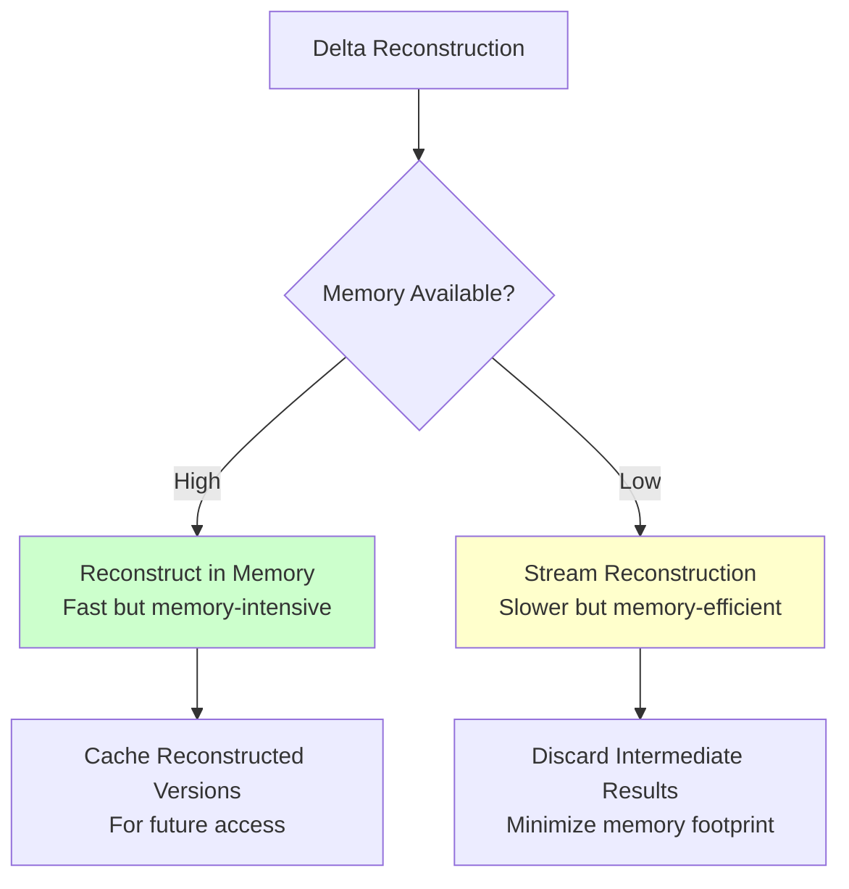
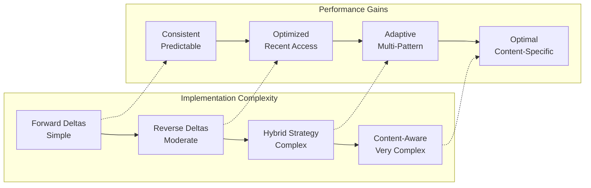

# Forward vs Reverse Deltas: The Strategic Choice

Delta compression systems face a fundamental architectural decision that affects performance, storage, and complexity: should deltas move forward in time or backward? This choice has profound implications for how the system behaves under different access patterns.

## The Two Philosophies

### Forward Deltas: Building Toward the Future
Store the oldest version in full, with deltas that build forward through time.



### Reverse Deltas: Working Backward from Present
Store the newest version in full, with deltas that reconstruct older versions.



## Performance Characteristics

The choice between forward and reverse deltas creates dramatically different performance profiles:



## Real-World Access Patterns

Understanding which approach to choose requires analyzing how versions are actually accessed:

### The Recency Bias Pattern
Most systems show heavy bias toward recent versions:



**Insight**: If 80% of accesses target the most recent 20% of versions, reverse deltas provide dramatically better performance.

### The Long Tail Problem
Forward deltas suffer from cumulative reconstruction cost:

```python
def calculate_reconstruction_cost():
    """Compare reconstruction costs for forward vs reverse deltas"""
    versions = 100
    access_weights = [1/v for v in range(1, versions + 1)]  # Recent versions accessed more
    
    # Forward delta cost (cumulative from V1)
    forward_cost = sum(weight * (v - 1) for v, weight in enumerate(access_weights, 1))
    
    # Reverse delta cost (cumulative from latest)
    reverse_cost = sum(weight * (versions - v) for v, weight in enumerate(access_weights, 1))
    
    print(f"Forward delta average cost: {forward_cost:.2f} delta applications")
    print(f"Reverse delta average cost: {reverse_cost:.2f} delta applications")
    print(f"Reverse delta advantage: {forward_cost / reverse_cost:.1f}x faster")

calculate_reconstruction_cost()
# Output:
# Forward delta average cost: 42.67 delta applications
# Reverse delta average cost: 7.83 delta applications  
# Reverse delta advantage: 5.4x faster
```

## Implementation Strategies

### Git's Hybrid Approach
Git uses a sophisticated strategy that optimizes for real-world usage:



**Git's Rules:**
1. Store the most recent version of popular files in full
2. Use reverse deltas for recent history (fast access to current state)
3. Use forward deltas for older history (compact storage)
4. Insert periodic full snapshots to limit chain length

### Database System Strategies

Different database systems optimize for their specific access patterns:

#### PostgreSQL MVCC (Forward-like)


#### Oracle Flashback (Reverse-like)


## Advanced Delta Strategies

### Delta Compression with Periodic Snapshots



### Content-Aware Delta Selection

```python
class SmartDeltaStrategy:
    """Chooses delta strategy based on content and access patterns"""
    
    def choose_delta_base(self, target_version, available_versions, access_stats):
        """Choose the best base version for creating a delta"""
        
        candidates = []
        
        for base_version in available_versions:
            # Calculate delta size
            delta_size = self.estimate_delta_size(base_version, target_version)
            
            # Calculate access cost (how often base is needed for other reconstructions)
            access_cost = access_stats.get_reconstruction_cost(base_version)
            
            # Calculate storage cost
            storage_cost = delta_size
            
            # Combined score (lower is better)
            score = storage_cost + (access_cost * 0.1)
            
            candidates.append((base_version, score, delta_size))
        
        # Choose the best candidate
        best_base, best_score, best_delta_size = min(candidates, key=lambda x: x[1])
        
        return best_base, best_delta_size
    
    def estimate_delta_size(self, base, target):
        """Estimate delta size without creating full delta"""
        # Use sampling or heuristics for fast estimation
        similarity = self.calculate_similarity(base, target)
        base_size = len(base.content)
        return int(base_size * (1 - similarity))
    
    def calculate_similarity(self, base, target):
        """Calculate content similarity between versions"""
        # Simplified similarity calculation
        common_lines = len(set(base.lines) & set(target.lines))
        total_lines = len(set(base.lines) | set(target.lines))
        return common_lines / total_lines if total_lines > 0 else 0
```

## Performance Trade-offs in Practice

### Memory Pressure Considerations



### Network Synchronization

For distributed systems, delta direction affects synchronization efficiency:

**Forward Deltas + New Remote Changes:**
```
Local: V1 → V2 → V3
Remote: V1 → V2 → V3 → V4 → V5

Sync needed: Δ3→4, Δ4→5 (2 deltas)
```

**Reverse Deltas + New Remote Changes:**
```
Local: V3 ← V2 ← V1 (V3 is full)
Remote: V5 ← V4 ← V3 ← V2 ← V1 (V5 is full)

Sync needed: V5 (full version) or reconstruct from shared V3
```

## When to Choose Each Strategy

### Forward Deltas Are Better When:
- **Historical analysis** is common (research, auditing, compliance)
- **Storage cost** is more critical than access speed
- **Write patterns** are infrequent but reads span many versions
- **Corruption tolerance** requires isolated version chains

### Reverse Deltas Are Better When:
- **Current state access** dominates usage patterns
- **Real-time collaboration** requires instant access to latest version
- **Development workflows** focus on recent changes
- **Mobile/bandwidth-constrained** environments need efficient sync

### Hybrid Strategies Are Better When:
- **Mixed access patterns** vary by user role or time
- **Large scale systems** need to optimize for multiple scenarios
- **Enterprise systems** require both operational and analytical workloads
- **Long-term storage** needs to balance multiple concerns

## Implementation Complexity Analysis



The choice between forward and reverse deltas is ultimately about understanding your system's access patterns and optimizing for the most common use cases while maintaining acceptable performance for edge cases.

Understanding these trade-offs enables architects to design delta compression systems that provide optimal performance for their specific domain and usage patterns.