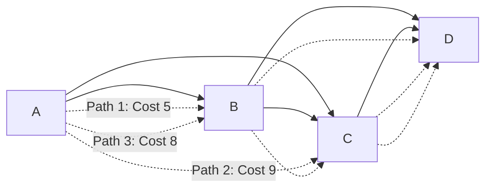
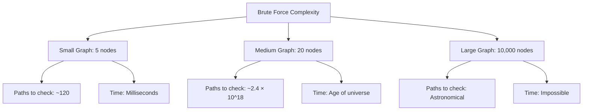
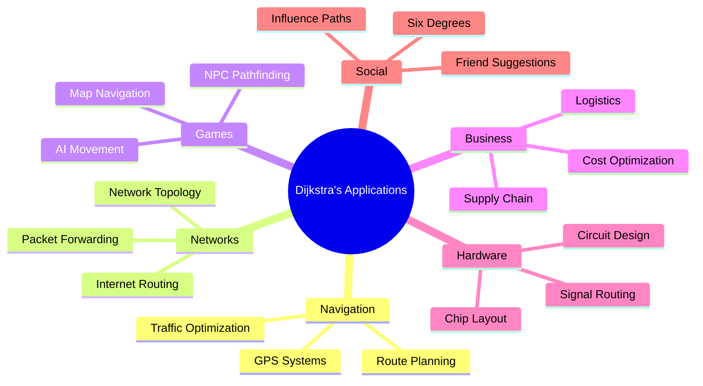

# The Core Problem: Finding the Shortest Path

## What Problem Are We Solving?

Imagine you're building a GPS navigation system. You have a map represented as a **weighted graph**:
- **Nodes** represent locations (cities, intersections, landmarks)
- **Edges** represent roads or connections between locations
- **Weights** represent the "cost" of traversing each edge (distance, time, fuel consumption, etc.)

Your challenge: **Given a starting location, find the shortest path to every other reachable location.**

## Why Is This Hard?

### The Naive Approach: Try Everything

You might think: "Just try all possible paths and pick the shortest one." This is called **brute force enumeration**.



```
Starting from A, to reach D:
Path 1: A → B → D (cost: 3 + 2 = 5)
Path 2: A → C → D (cost: 8 + 1 = 9)
Path 3: A → B → C → D (cost: 3 + 4 + 1 = 8)
```

This works for tiny graphs, but consider a real-world scenario:
- A city with 10,000 intersections
- Each intersection connects to an average of 4 others
- The number of possible paths grows **exponentially**



In the worst case, with `n` nodes, you might need to examine `n!` (n factorial) different paths. For a modest city with 20 intersections, that's `20! = 2,432,902,008,176,640,000` possible paths to check. Your GPS would take longer than the age of the universe to find a route to the grocery store.

### The Real-World Complexity

Real navigation systems deal with:
- **Millions of nodes** (every street intersection)
- **Dynamic weights** (traffic conditions change constantly)
- **Multiple constraints** (avoiding tolls, preferring highways, etc.)
- **Real-time requirements** (users expect results in milliseconds)

The brute force approach simply doesn't scale.

## Enter Dijkstra's Algorithm

Dijkstra's algorithm solves this problem efficiently by being **greedy but correct**. Instead of exploring all possible paths, it makes a smart choice at each step:

> "Always explore the closest unvisited node next."


This simple rule, combined with a clever data structure (priority queue), reduces the time complexity from exponential to **O((V + E) log V)** where V is the number of nodes and E is the number of edges.

```mermaid
graph TD
    A[Algorithm Comparison] --> B[Brute Force]
    A --> C[Dijkstra's]
    
    B --> B1[Time: O\(n!\)]
    B --> B2[Space: O\(n\)]
    B --> B3[Practical: No]
    
    C --> C1[Time: O\(\(V + E\) log V\)]
    C --> C2[Space: O\(V\)]
    C --> C3[Practical: Yes]
    
    B1 --> D[For 20 nodes: 10^18 operations]
    C1 --> E[For 20 nodes: ~400 operations]
```

## The Key Insight

The breakthrough insight is this: **If you know the shortest path to node A, and you're considering the shortest path to node B through A, you only need to consider the path that goes through A at the shortest distance you've already computed.**

In other words, once you've found the shortest path to a node, you never need to reconsider it. This is called the **optimal substructure property**.

## Real-World Applications

Dijkstra's algorithm isn't just for GPS systems. It's used everywhere shortest paths matter:



- **Network routing**: Finding the fastest route for internet packets
- **Social networks**: Calculating degrees of separation between users
- **Game AI**: Pathfinding for NPCs in video games
- **Supply chain**: Optimizing shipping routes and costs
- **Circuit design**: Finding shortest electrical paths in microchips

The algorithm has become a fundamental building block of modern computing infrastructure.

## What Makes It Elegant

Dijkstra's algorithm is beloved by computer scientists because it demonstrates several key principles:

1. **Greedy algorithms can be optimal**: Not all greedy approaches work, but this one provably does
2. **The right data structure matters**: Using a priority queue turns an O(V²) algorithm into O((V + E) log V)
3. **Mathematical elegance**: The algorithm's correctness can be proven with a simple invariant

In the next section, we'll explore the guiding philosophy that makes this algorithm work so well.