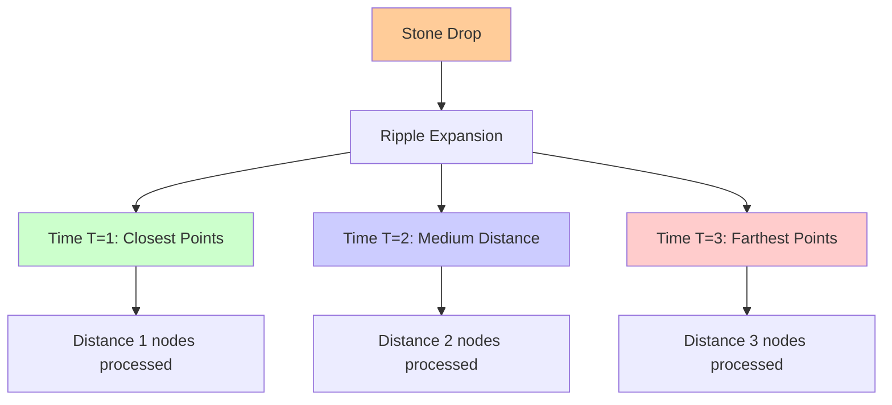
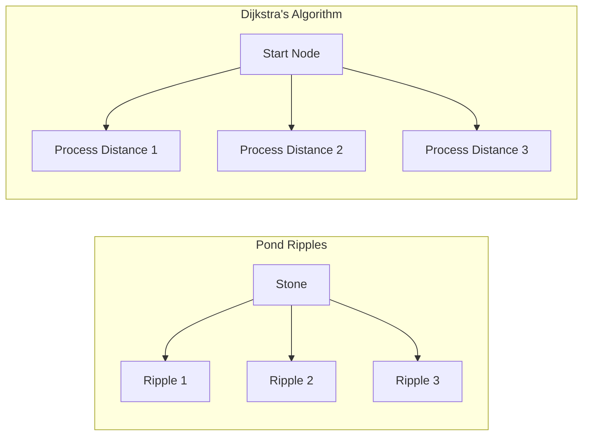
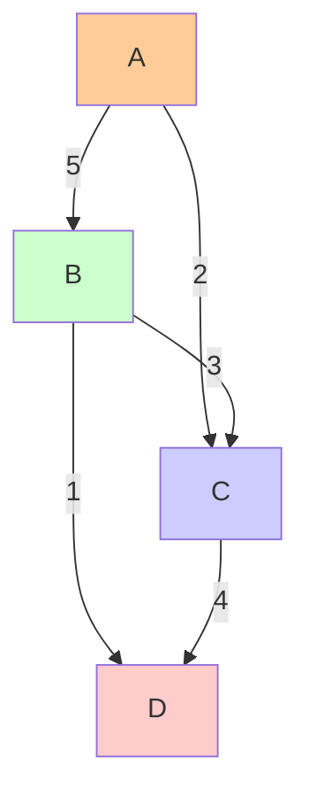

# The Guiding Philosophy: Greedy Optimality

## The Central Principle

Dijkstra's algorithm operates on a deceptively simple principle:

> **"Always process the closest unvisited node next."**

This is a **greedy algorithm** – it makes the locally optimal choice at each step. But unlike many greedy algorithms, this one is **globally optimal**. Let's understand why.

## The Intuition: Ripples in a Pond

Imagine dropping a stone into a still pond. The ripples spread outward in perfect circles, reaching the closest points first, then gradually expanding to more distant shores.



Dijkstra's algorithm works similarly:
- Your starting node is the stone
- The "distance" is like the ripple spreading outward
- You process nodes in the order the ripple would reach them
- Once a ripple reaches a point, you know it took the shortest possible path to get there



## The Greedy Choice

At each step, the algorithm asks: **"Of all the nodes I haven't fully explored yet, which one can I reach with the shortest total distance?"**

This node becomes the next one to process. Why? Because any other path to this node would have to go through a node that's farther away, making it necessarily longer.

### A Simple Example



```
    A ----5---- B
    |          /|
    2        3/ |1
    |        /  |
    C ----4---- D
```

Starting from A:
1. **Distance to A = 0** (starting point)
2. **Process A**: Update distances to B (5) and C (2)
3. **Choose C (distance 2)**: It's closer than B (distance 5)
4. **Process C**: Check if A→C→D (2+4=6) is better than current best to D
5. **Choose B (distance 5)**: Update distance to D if A→B→D (5+1=6) is better

```mermaid
gantt
    title Dijkstra's Algorithm Execution
    dateFormat X
    axisFormat %s
    
    section Node Processing
    Process A (dist=0)    :active, 0, 1
    Process C (dist=2)    :active, 1, 2
    Process B (dist=5)    :active, 2, 3
    Process D (dist=6)    :active, 3, 4
    
    section Distance Updates
    Update B to 5, C to 2 :milestone, 1, 0
    Update D to 6        :milestone, 2, 0
    Check D via B (still 6) :milestone, 3, 0
```



The greedy choice ensures we always process nodes in order of their final shortest distance.

## Why Greedy Works Here

### The Optimal Substructure Property

The key insight is **optimal substructure**: if the shortest path from A to C goes through B, then the portion from A to B must also be the shortest path from A to B.

In mathematical terms: If A→B→C is the shortest path from A to C, then A→B is the shortest path from A to B.

### The Invariant

Dijkstra's algorithm maintains this invariant:

> **"All processed nodes have their final shortest distance computed correctly."**

When we process a node, we're guaranteed that no future discoveries will find a shorter path to it. This is because:
1. We've already considered all paths through closer nodes
2. Any path through a farther node would necessarily be longer

## The Three-Step Dance

The algorithm follows a rhythmic pattern:

1. **Select**: Choose the unvisited node with the smallest tentative distance
2. **Relax**: Update distances to all neighbors if we found a shorter path
3. **Mark**: Mark this node as visited (processed)

This dance continues until all reachable nodes are processed.

### The Relaxation Process

"Relaxation" is the process of asking: **"Did I just find a shorter path to this neighbor?"**

```
If distance[current] + weight(current, neighbor) < distance[neighbor]:
    distance[neighbor] = distance[current] + weight(current, neighbor)
    previous[neighbor] = current
```

It's called "relaxation" because we're "relaxing" our previous assumption about the shortest distance – we found something better.

## The Priority Queue: The Engine of Efficiency

The algorithm's efficiency comes from using a **priority queue** (min-heap) to always find the closest unvisited node quickly.

Without a priority queue:
- Finding the minimum distance: O(V) time
- Total time complexity: O(V²)

With a priority queue:
- Finding the minimum distance: O(log V) time
- Total time complexity: O((V + E) log V)

For large graphs, this difference is dramatic. In a graph with 1 million nodes, O(V²) means 1 trillion operations, while O(V log V) means about 20 million operations.

## The Mathematical Elegance

### Proof of Correctness

The algorithm's correctness can be proven by induction:

**Base case**: The starting node has distance 0, which is correct.

**Inductive step**: Assume all processed nodes have correct shortest distances. When we process the next closest node u:
- Any path to u through an unvisited node v would have distance ≥ distance[u] + positive_weight
- Since distance[v] ≥ distance[u] (u is the closest unvisited), any such path is longer
- Therefore, distance[u] is indeed the shortest distance to u

### The Guarantee

When Dijkstra's algorithm finishes, you have:
- The shortest distance from the source to every reachable node
- The actual shortest path (if you track predecessors)
- A guarantee that no shorter path exists

## Why This Philosophy Matters

Understanding the greedy philosophy helps you:
1. **Debug implementations**: When the algorithm fails, check if you're always choosing the closest node
2. **Optimize performance**: The priority queue choice directly impacts runtime
3. **Adapt to variants**: Understanding the core principle helps you implement A*, bidirectional search, etc.
4. **Recognize limitations**: The philosophy breaks down with negative weights

The greedy approach succeeds here because shortest paths have optimal substructure and the graph weights are non-negative. This combination makes the locally optimal choice globally optimal.

Next, we'll explore the key abstractions that make this philosophy concrete in code.