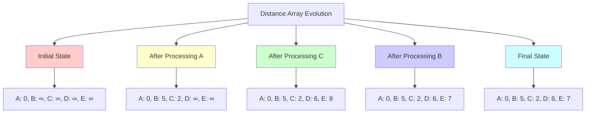
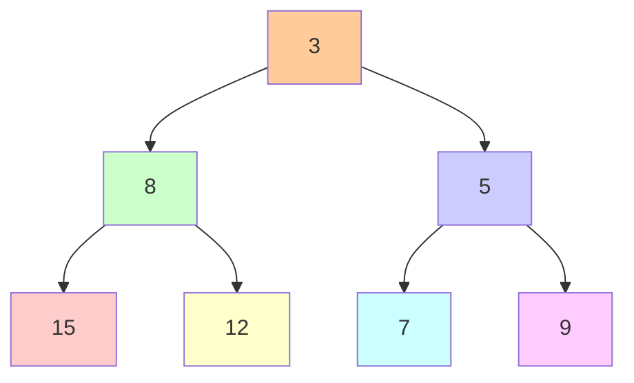
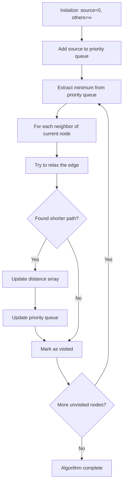

# Key Abstractions: The Building Blocks

## The Three Pillars

Dijkstra's algorithm is built on three fundamental abstractions:

```mermaid
graph TD
    A[Dijkstra's Algorithm] --> B[Distance Array]
    A --> C[Priority Queue]
    A --> D[Relaxation Process]
    
    B --> B1[Tracks shortest distances]
    B --> B2[Updates as we discover better paths]
    B --> B3[Final when node is processed]
    
    C --> C1[Selects closest unvisited node]
    C --> C2[Maintains heap property]
    C --> C3[Efficient O\(log V\) operations]
    
    D --> D1[Compares path lengths]
    D --> D2[Updates if shorter path found]
    D --> D3[Propagates improvements]
    
    style A fill:#ffcc99
    style B fill:#ccffcc
    style C fill:#ccccff
    style D fill:#ffcccc
```

1. **Distance Array**: The tentative shortest distances from source to all nodes
2. **Priority Queue**: The efficient selector of the next node to process
3. **Relaxation**: The process of updating distances when better paths are found

Let's explore each one through the lens of our road trip analogy.

## The Distance Array: Your Journey Logbook

### The Concept

Think of the distance array as a **logbook** you keep during a road trip. For each city, you write down the shortest distance you've discovered so far to reach it from your starting point.

```
distance[source] = 0           // You start here
distance[all_others] = ∞       // Unknown distances
```

### The Evolution

As you explore, your logbook entries get updated with better information:



```
Initial:     [A: 0, B: ∞, C: ∞, D: ∞, E: ∞]
After A:     [A: 0, B: 5, C: 2, D: ∞, E: ∞]
After C:     [A: 0, B: 5, C: 2, D: 6, E: 8]
After B:     [A: 0, B: 5, C: 2, D: 6, E: 7]
Final:       [A: 0, B: 5, C: 2, D: 6, E: 7]
```

### The Invariant

The distance array maintains a crucial invariant:

> **"For processed nodes, the distance is final and optimal. For unprocessed nodes, the distance is the best estimate so far."**

This dual nature is what makes the algorithm work – processed nodes never need updates, while unprocessed nodes are candidates for improvement.

## The Priority Queue: Your Smart GPS Assistant

### The Concept

The priority queue is like a **smart GPS assistant** that always knows which unvisited city you can reach most quickly from your current position.

```
Traditional approach:
"Let me check all unvisited cities... A is 15 miles away, B is 3 miles, C is 8 miles..."

Priority queue approach:
"The closest unvisited city is B at 3 miles. Go there next."
```

### The Data Structure

Under the hood, it's typically implemented as a **min-heap**:



```
         3
       /   \
      8     5
     / \   / \
    15  12 7  9
```

The smallest element (3) is always at the root, accessible in O(1) time.

```mermaid
graph LR
    A[Min-Heap Properties] --> B[Parent ≤ Children]
    A --> C[Complete Binary Tree]
    A --> D[Efficient Operations]
    
    B --> B1[Root is minimum]
    B --> B2[Heap order maintained]
    
    C --> C1[Filled level by level]
    C --> C2[Array representation]
    
    D --> D1[Insert: O\(log n\)]
    D --> D2[Extract-min: O\(log n\)]
    D --> D3[Peek-min: O\(1\)]
```

### The Operations

The priority queue supports these key operations:

```
insert(node, distance)     // Add a new node with its distance
extract_min()             // Remove and return the closest node
decrease_key(node, dist)  // Update a node's distance to a smaller value
```

In our road trip analogy:
- **insert**: "I discovered a new city at distance X"
- **extract_min**: "What's the closest city I haven't visited?"
- **decrease_key**: "I found a shorter route to this city"

## Relaxation: The Path Improvement Process

### The Concept

Relaxation is the process of asking: **"Did I just discover a shorter path to this neighbor?"**

Think of it as updating your road trip logbook when you find a better route:

```
Current state: "I thought the shortest path to Denver was 500 miles"
New discovery: "Wait, going through Chicago gets me there in 450 miles!"
Relaxation: "Update Denver to 450 miles, note that I go through Chicago"
```

### The Mathematical Form

```
function relax(current, neighbor, weight):
    new_distance = distance[current] + weight(current, neighbor)
    if new_distance < distance[neighbor]:
        distance[neighbor] = new_distance
        previous[neighbor] = current
        update_priority_queue(neighbor, new_distance)
```

### The Terminology

It's called "relaxation" because we're **relaxing our previous assumption** about the shortest distance. We had a constraint ("shortest path to B is 10"), and we're loosening it ("actually, shortest path to B is 7").

## The Interplay: How They Work Together

### The Algorithm Flow



### The Dance

1. **Priority Queue** says: "Process node B next (distance 5)"
2. **Distance Array** confirms: "B is at distance 5, and it's not visited yet"
3. **Relaxation** checks: "Can I reach B's neighbors more quickly through B?"
4. **Distance Array** updates: "Yes! C is now reachable at distance 7 instead of 8"
5. **Priority Queue** updates: "C's priority is now 7"

## The Predecessor Array: Remembering the Journey

### The Concept

While not always mentioned, the **predecessor array** is crucial for reconstructing the actual shortest path:

```
previous[node] = the node that led to the shortest path to 'node'
```

### The Reconstruction

To find the actual shortest path from A to E:

```
path = []
current = E
while current != null:
    path.append(current)
    current = previous[current]
path.reverse()
// Result: [A, C, D, E]
```

## Memory Patterns: How to Think About Implementation

### The State Machine

Think of each node as having three states:
- **Undiscovered**: Not yet encountered (distance = ∞)
- **Discovered**: Found but not yet processed (in priority queue)
- **Processed**: Final shortest distance computed (visited)

### The Data Structure Choices

```
Distance Array:    Usually a simple array or hash map
Priority Queue:    Binary heap, Fibonacci heap, or balanced BST
Predecessor Array: Array or hash map for path reconstruction
Visited Set:       Boolean array or hash set
```

### The Trade-offs

- **Array vs HashMap**: Arrays are faster for dense node IDs, HashMaps for sparse ones
- **Binary Heap vs Fibonacci Heap**: Binary heaps are simpler, Fibonacci heaps have better theoretical complexity
- **Explicit vs Implicit Graph**: Sometimes the graph exists only conceptually

## The Analogy: Planning Your Road Trip

Imagine you're planning a road trip from your hometown to visit all major cities:

1. **Distance Array**: Your notebook with "best known distance to each city"
2. **Priority Queue**: Your smart assistant who always knows the closest unvisited city
3. **Relaxation**: The process of updating your notebook when you find shorter routes
4. **Predecessor Array**: Your breadcrumb trail showing how you got to each city

At each step, you ask: "What's the closest city I haven't visited yet?" Your assistant (priority queue) tells you, you go there (process the node), and then you check if this city offers shorter routes to its neighbors (relaxation).

## Why These Abstractions Matter

Understanding these abstractions helps you:

1. **Debug**: When the algorithm fails, check which abstraction isn't working correctly
2. **Optimize**: Choose the right data structure for your use case
3. **Adapt**: Modify the algorithm for different scenarios (A*, bidirectional search, etc.)
4. **Understand variants**: Many graph algorithms use similar abstractions

The beauty of Dijkstra's algorithm is how these three simple abstractions combine to solve a complex problem efficiently and elegantly.

Next, we'll see how to implement these abstractions in practice with a concrete example.