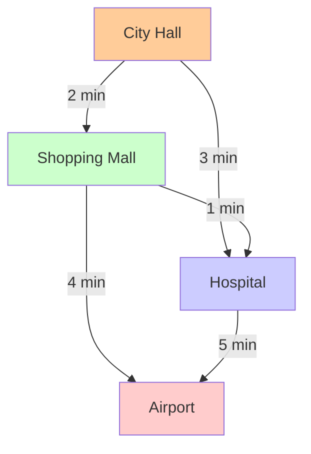
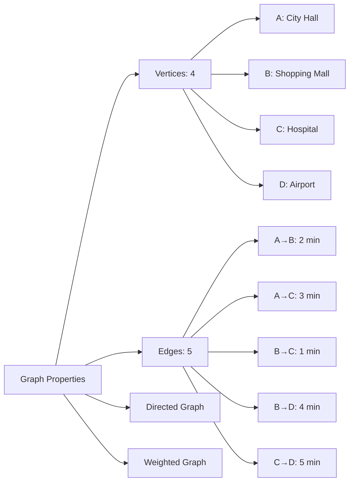
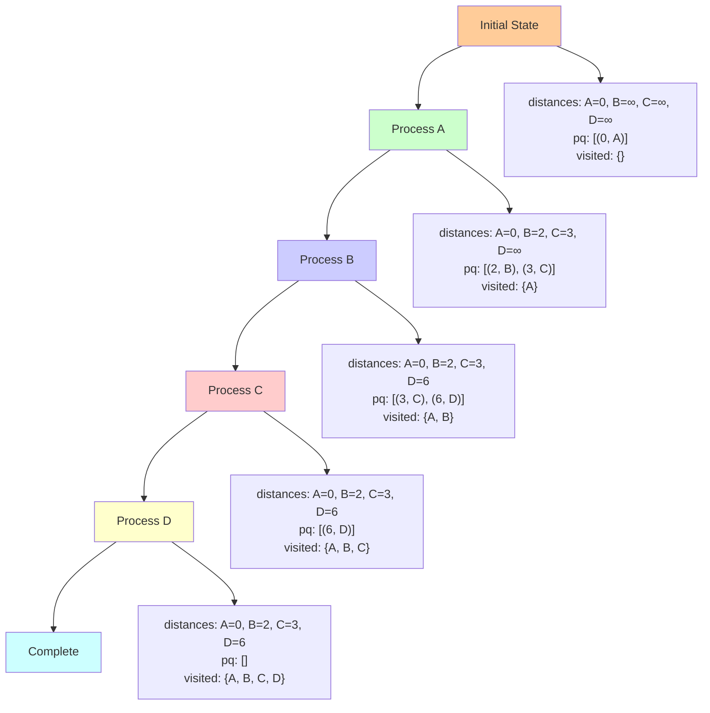
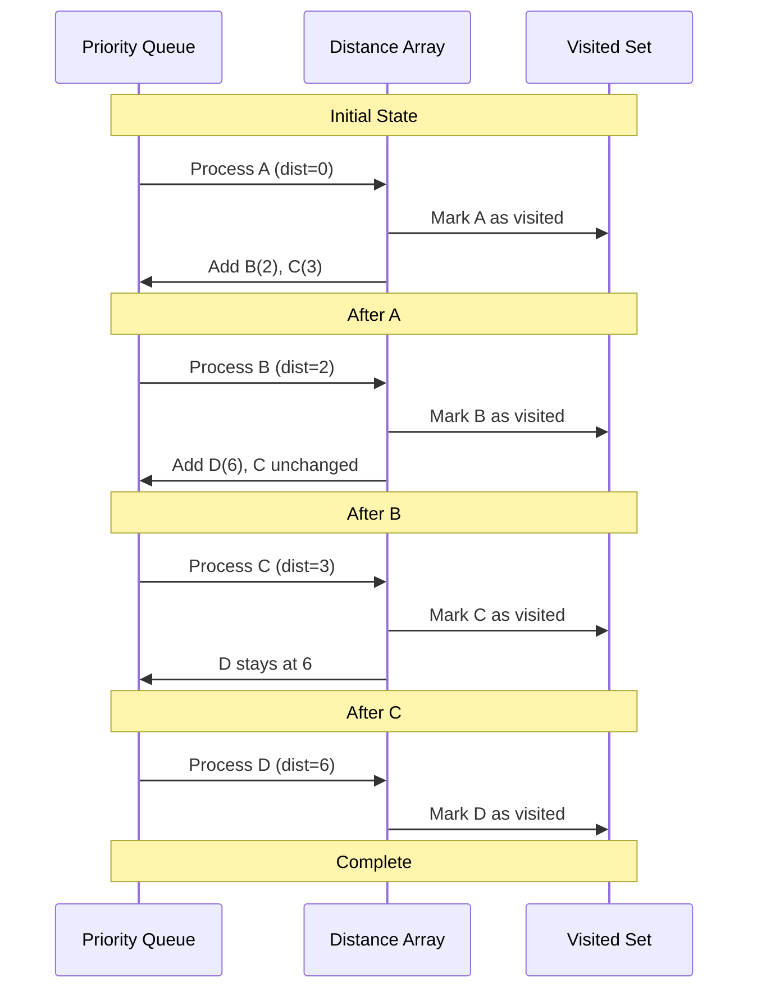

# Implementing Dijkstra: A Route Finder

## The Challenge: Building a City Route Finder

Let's build a practical route finder for a small city. We'll implement Dijkstra's algorithm step by step, showing how each abstraction works in practice.

## The Setup: Our City Map



```
       2
   A -----> B
   |       /|
   |3    1/ |4
   |     /  |
   v   /    v
   C -----> D
       5
```

This represents:
- **A**: City Hall (our starting point)
- **B**: Shopping Mall
- **C**: Hospital
- **D**: Airport

Edge weights represent travel time in minutes.



## Step 1: Graph Representation

First, let's represent our city map as an adjacency list:

```python
# Graph representation: adjacency list
graph = {
    'A': [('B', 2), ('C', 3)],
    'B': [('C', 1), ('D', 4)],
    'C': [('D', 5)],
    'D': []
}
```

## Step 2: Initialize Data Structures

```python
import heapq
from collections import defaultdict

def dijkstra(graph, start):
    # Distance array: best known distance to each node
    distances = defaultdict(lambda: float('inf'))
    distances[start] = 0
    
    # Predecessor array: to reconstruct paths
    previous = {}
    
    # Priority queue: (distance, node)
    pq = [(0, start)]
    
    # Visited set: processed nodes
    visited = set()
    
    return distances, previous, pq, visited
```

## Step 3: The Main Algorithm Loop

```python
def dijkstra(graph, start):
    distances = defaultdict(lambda: float('inf'))
    distances[start] = 0
    previous = {}
    pq = [(0, start)]
    visited = set()
    
    while pq:
        # Extract the closest unvisited node
        current_distance, current = heapq.heappop(pq)
        
        # Skip if we've already processed this node
        if current in visited:
            continue
            
        # Mark as visited
        visited.add(current)
        
        # Process all neighbors
        for neighbor, weight in graph.get(current, []):
            if neighbor in visited:
                continue
                
            # Calculate new distance through current node
            new_distance = current_distance + weight
            
            # Relaxation: update if we found a shorter path
            if new_distance < distances[neighbor]:
                distances[neighbor] = new_distance
                previous[neighbor] = current
                heapq.heappush(pq, (new_distance, neighbor))
    
    return distances, previous
```

## Step 4: Path Reconstruction

```python
def reconstruct_path(previous, start, end):
    path = []
    current = end
    
    while current is not None:
        path.append(current)
        current = previous.get(current)
    
    path.reverse()
    
    # Check if path exists
    if path[0] != start:
        return None
    
    return path
```

## Step 5: Complete Implementation

```python
import heapq
from collections import defaultdict

def dijkstra_with_path(graph, start):
    """
    Find shortest paths from start to all other nodes.
    Returns distances and previous nodes for path reconstruction.
    """
    distances = defaultdict(lambda: float('inf'))
    distances[start] = 0
    previous = {}
    pq = [(0, start)]
    visited = set()
    
    while pq:
        current_distance, current = heapq.heappop(pq)
        
        if current in visited:
            continue
            
        visited.add(current)
        
        for neighbor, weight in graph.get(current, []):
            if neighbor in visited:
                continue
                
            new_distance = current_distance + weight
            
            if new_distance < distances[neighbor]:
                distances[neighbor] = new_distance
                previous[neighbor] = current
                heapq.heappush(pq, (new_distance, neighbor))
    
    return dict(distances), previous

def get_shortest_path(graph, start, end):
    """Get the shortest path between two nodes."""
    distances, previous = dijkstra_with_path(graph, start)
    
    if distances[end] == float('inf'):
        return None, float('inf')
    
    # Reconstruct path
    path = []
    current = end
    while current is not None:
        path.append(current)
        current = previous.get(current)
    
    path.reverse()
    return path, distances[end]

# Test our implementation
if __name__ == "__main__":
    # Our city map
    graph = {
        'A': [('B', 2), ('C', 3)],
        'B': [('C', 1), ('D', 4)],
        'C': [('D', 5)],
        'D': []
    }
    
    # Find shortest paths from City Hall (A)
    distances, previous = dijkstra_with_path(graph, 'A')
    
    print("Shortest distances from A:")
    for node, distance in distances.items():
        print(f"  A -> {node}: {distance} minutes")
    
    print("\nShortest paths:")
    for destination in ['B', 'C', 'D']:
        path, distance = get_shortest_path(graph, 'A', destination)
        print(f"  A -> {destination}: {' -> '.join(path)} (distance: {distance})")
```

## Step 6: Execution Trace

Let's trace through the algorithm step by step:



### Initial State
```
distances = {'A': 0, 'B': ∞, 'C': ∞, 'D': ∞}
pq = [(0, 'A')]
visited = {}
```

### Step 1: Process A
```
current = 'A' (distance 0)
visited = {'A'}
Check neighbors: B(2), C(3)
Update: distances['B'] = 2, distances['C'] = 3
pq = [(2, 'B'), (3, 'C')]
```

### Step 2: Process B
```
current = 'B' (distance 2)
visited = {'A', 'B'}
Check neighbors: C(1), D(4)
Update: distances['C'] = min(3, 2+1) = 3, distances['D'] = 2+4 = 6
pq = [(3, 'C'), (6, 'D')]
```

### Step 3: Process C
```
current = 'C' (distance 3)
visited = {'A', 'B', 'C'}
Check neighbors: D(5)
Update: distances['D'] = min(6, 3+5) = 6
pq = [(6, 'D')]
```

### Step 4: Process D
```
current = 'D' (distance 6)
visited = {'A', 'B', 'C', 'D'}
No neighbors to process
pq = []
```



### Final Result
```
Shortest distances from A:
  A -> A: 0 minutes
  A -> B: 2 minutes
  A -> C: 3 minutes
  A -> D: 6 minutes

Shortest paths:
  A -> B: A -> B (distance: 2)
  A -> C: A -> B -> C (distance: 3)
  A -> D: A -> B -> D (distance: 6)
```

## Key Insights from the Implementation

### The Priority Queue Magic
Notice how the priority queue automatically gives us the closest unvisited node. This is what makes the algorithm efficient – we don't need to search through all nodes to find the minimum.

### The Relaxation Process
The line `if new_distance < distances[neighbor]:` is the heart of relaxation. We're constantly asking: "Did I find a better path?"

### Handling Duplicates
The `if current in visited: continue` check handles the fact that we might insert the same node multiple times into the priority queue with different distances. We only process each node once.

## Performance Analysis

For our simple city map:
- **Nodes (V)**: 4
- **Edges (E)**: 5
- **Time complexity**: O((V + E) log V) = O(9 log 4) ≈ O(18)
- **Space complexity**: O(V) for the distance array and priority queue

## Extending the Implementation

### Adding More Features

```python
def dijkstra_verbose(graph, start):
    """Version with detailed logging for educational purposes."""
    distances = defaultdict(lambda: float('inf'))
    distances[start] = 0
    previous = {}
    pq = [(0, start)]
    visited = set()
    step = 0
    
    print(f"Starting from {start}")
    print(f"Initial distances: {dict(distances)}")
    
    while pq:
        step += 1
        current_distance, current = heapq.heappop(pq)
        
        if current in visited:
            continue
            
        visited.add(current)
        print(f"\nStep {step}: Processing {current} (distance {current_distance})")
        
        for neighbor, weight in graph.get(current, []):
            if neighbor in visited:
                continue
                
            new_distance = current_distance + weight
            old_distance = distances[neighbor]
            
            if new_distance < old_distance:
                distances[neighbor] = new_distance
                previous[neighbor] = current
                heapq.heappush(pq, (new_distance, neighbor))
                print(f"  Updated {neighbor}: {old_distance} -> {new_distance}")
            else:
                print(f"  {neighbor}: {new_distance} >= {old_distance} (no update)")
    
    return dict(distances), previous
```

### Handling Edge Cases

```python
def robust_dijkstra(graph, start):
    """Robust version with error handling."""
    if start not in graph:
        raise ValueError(f"Start node {start} not found in graph")
    
    # Check for negative weights
    for node, edges in graph.items():
        for neighbor, weight in edges:
            if weight < 0:
                raise ValueError(f"Negative weight found: {node} -> {neighbor} ({weight})")
    
    # Rest of implementation...
```

## Common Pitfalls and Solutions

### Pitfall 1: Forgetting to Check if Already Visited
```python
# Wrong: might process the same node multiple times
current_distance, current = heapq.heappop(pq)

# Correct: check if already visited
current_distance, current = heapq.heappop(pq)
if current in visited:
    continue
```

### Pitfall 2: Not Handling Disconnected Graphs
```python
# The algorithm naturally handles this
# Unreachable nodes will have distance = ∞
```

### Pitfall 3: Modifying Priority Queue Keys
```python
# Wrong: trying to decrease key in Python's heapq
# heapq doesn't support decrease_key operation

# Correct: insert new entry, ignore old ones
if new_distance < distances[neighbor]:
    distances[neighbor] = new_distance
    heapq.heappush(pq, (new_distance, neighbor))
```

## Next Steps

Now that you've implemented Dijkstra's algorithm, you can:

1. **Visualize it**: Create a step-by-step animation showing how the algorithm explores the graph
2. **Optimize it**: Implement with different data structures (Fibonacci heap, d-ary heap)
3. **Extend it**: Add support for path queries, multiple sources, or bidirectional search
4. **Apply it**: Use it in real applications like network routing or game pathfinding

The implementation we've built forms the foundation for understanding more advanced graph algorithms and their practical applications.