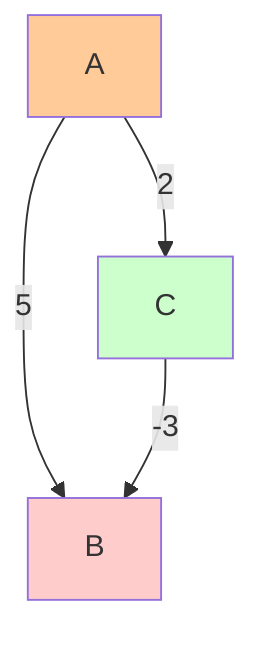
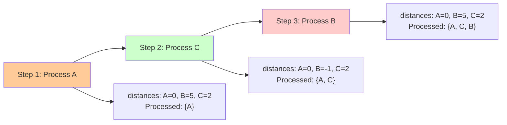
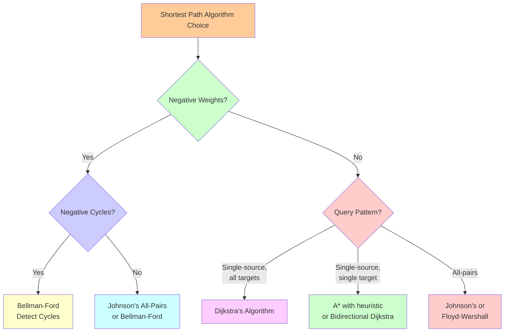

# Deep Dive: Negative Weights and Variants

## The Negative Weight Problem

### Why Dijkstra's Algorithm Fails

Dijkstra's algorithm has one critical limitation: **it cannot handle negative edge weights**. Understanding why reveals deep insights about the algorithm's assumptions and leads us to more advanced variants.

### The Fundamental Issue

Dijkstra's algorithm relies on this invariant: **"Once a node is processed, its shortest distance is final."**

This works because the algorithm assumes that no future path through an unvisited node can be shorter. With negative weights, this assumption breaks down.

### A Concrete Example

Consider this graph with a negative edge:



```
    A ----5---- B
    |          /
    2        -3
    |        /
    C -------
```

Running Dijkstra's from A:



1. **Process A** (distance 0): Update B to 5, C to 2
2. **Process C** (distance 2): Update B to 2 + (-3) = -1
3. **Process B** (distance -1): But we already processed C!

The algorithm would output distance[B] = 5, but the correct answer is -1.

### The Deeper Issue: Greedy Choice Failure

The greedy choice (always process the closest node) fails because:
- A "close" node might lead to a "far" node through a negative edge
- The globally optimal solution requires looking beyond the immediate greedy choice

## Variants and Solutions

### 1. Bellman-Ford Algorithm: Handling Negative Weights

When you need to handle negative weights, use the **Bellman-Ford algorithm**.

#### The Approach

Instead of greedily selecting the closest node, Bellman-Ford:
1. **Relaxes all edges** V-1 times (where V is the number of vertices)
2. **Detects negative cycles** by running one more iteration

#### The Implementation

```python
def bellman_ford(graph, start):
    """
    Handle negative weights and detect negative cycles.
    Returns (distances, has_negative_cycle)
    """
    distances = {node: float('inf') for node in graph}
    distances[start] = 0
    
    # Relax all edges V-1 times
    for _ in range(len(graph) - 1):
        for node in graph:
            for neighbor, weight in graph[node]:
                if distances[node] + weight < distances[neighbor]:
                    distances[neighbor] = distances[node] + weight
    
    # Check for negative cycles
    for node in graph:
        for neighbor, weight in graph[node]:
            if distances[node] + weight < distances[neighbor]:
                return distances, True  # Negative cycle detected
    
    return distances, False

# Example with negative weights
graph = {
    'A': [('B', 5), ('C', 2)],
    'B': [('D', 1)],
    'C': [('B', -3), ('D', 4)],
    'D': []
}

distances, has_cycle = bellman_ford(graph, 'A')
print(f"Distances: {distances}")
print(f"Has negative cycle: {has_cycle}")
```

#### Trade-offs

- **Time complexity**: O(VE) vs Dijkstra's O((V + E) log V)
- **Capability**: Handles negative weights and detects negative cycles
- **Use case**: When negative weights are possible

### 2. A* Algorithm: Directed Search with Heuristics

When you have a **specific target** and domain knowledge, A* can be much faster than Dijkstra's.

#### The Insight

A* uses a **heuristic function** h(n) that estimates the cost from node n to the goal. This guides the search toward the target instead of exploring all directions equally.

#### The Algorithm

```python
import heapq

def a_star(graph, start, goal, heuristic):
    """
    A* algorithm with heuristic function.
    heuristic(node) estimates cost from node to goal.
    """
    # g(n): actual cost from start to n
    g_score = {start: 0}
    
    # f(n) = g(n) + h(n): estimated total cost through n
    f_score = {start: heuristic(start)}
    
    # Priority queue: (f_score, node)
    pq = [(f_score[start], start)]
    visited = set()
    
    while pq:
        current_f, current = heapq.heappop(pq)
        
        if current == goal:
            return g_score[current]
        
        if current in visited:
            continue
            
        visited.add(current)
        
        for neighbor, weight in graph.get(current, []):
            if neighbor in visited:
                continue
                
            tentative_g = g_score[current] + weight
            
            if tentative_g < g_score.get(neighbor, float('inf')):
                g_score[neighbor] = tentative_g
                f_score[neighbor] = tentative_g + heuristic(neighbor)
                heapq.heappush(pq, (f_score[neighbor], neighbor))
    
    return float('inf')  # No path found

# Example: Grid pathfinding with Manhattan distance heuristic
def manhattan_distance(pos1, pos2):
    return abs(pos1[0] - pos2[0]) + abs(pos1[1] - pos2[1])

# Grid graph representation
def grid_neighbors(pos, grid_size):
    x, y = pos
    neighbors = []
    for dx, dy in [(0, 1), (1, 0), (0, -1), (-1, 0)]:
        nx, ny = x + dx, y + dy
        if 0 <= nx < grid_size and 0 <= ny < grid_size:
            neighbors.append(((nx, ny), 1))  # Weight 1 for grid moves
    return neighbors

# Example usage
start = (0, 0)
goal = (4, 4)
grid_size = 5

def heuristic(pos):
    return manhattan_distance(pos, goal)

# Build graph dynamically
graph = {}
for x in range(grid_size):
    for y in range(grid_size):
        graph[(x, y)] = grid_neighbors((x, y), grid_size)

distance = a_star(graph, start, goal, heuristic)
print(f"Shortest distance from {start} to {goal}: {distance}")
```

#### When to Use A*

- **Single target**: You're looking for a path to a specific destination
- **Good heuristic**: You have domain knowledge for estimating remaining cost
- **Large search space**: The heuristic can significantly reduce explored nodes

### 3. Bidirectional Dijkstra: Meeting in the Middle

For single-source single-target queries, **bidirectional search** can be much faster.

#### The Approach

Run Dijkstra's simultaneously from both the source and target until they meet:

```python
def bidirectional_dijkstra(graph, start, end):
    """
    Run Dijkstra's from both ends until they meet.
    """
    # Forward search from start
    forward_dist = {start: 0}
    forward_pq = [(0, start)]
    forward_visited = set()
    
    # Backward search from end (requires reverse graph)
    backward_dist = {end: 0}
    backward_pq = [(0, end)]
    backward_visited = set()
    
    best_distance = float('inf')
    
    while forward_pq or backward_pq:
        # Alternate between forward and backward steps
        if forward_pq:
            best_distance = min(best_distance, 
                              dijkstra_step(graph, forward_pq, forward_dist, 
                                          forward_visited, backward_visited))
        
        if backward_pq:
            best_distance = min(best_distance,
                              dijkstra_step(reverse_graph, backward_pq, 
                                          backward_dist, backward_visited, 
                                          forward_visited))
        
        # Early termination if we've found the shortest path
        if (forward_pq and forward_pq[0][0] + backward_pq[0][0] >= best_distance):
            break
    
    return best_distance

def dijkstra_step(graph, pq, distances, visited, other_visited):
    """Single step of Dijkstra's algorithm."""
    if not pq:
        return float('inf')
    
    current_dist, current = heapq.heappop(pq)
    
    if current in visited:
        return float('inf')
    
    visited.add(current)
    
    # Check if we've met the other search
    if current in other_visited:
        return current_dist + other_distances[current]
    
    # Continue search
    for neighbor, weight in graph.get(current, []):
        if neighbor not in visited:
            new_dist = current_dist + weight
            if new_dist < distances.get(neighbor, float('inf')):
                distances[neighbor] = new_dist
                heapq.heappush(pq, (new_dist, neighbor))
    
    return float('inf')
```

#### Benefits

- **Reduced search space**: O(√V) vs O(V) nodes explored in typical cases
- **Better for sparse graphs**: Especially effective when the graph has low branching factor
- **Practical speedup**: Often 2-10x faster for point-to-point queries

### 4. Johnson's Algorithm: All-Pairs Shortest Paths

When you need shortest paths between **all pairs of nodes**, Johnson's algorithm combines Bellman-Ford and Dijkstra's efficiently.

#### The Approach

1. **Reweight the graph** to eliminate negative weights
2. **Run Dijkstra's** from each node on the reweighted graph
3. **Adjust results** to get original distances

#### The Implementation

```python
def johnson_algorithm(graph):
    """
    All-pairs shortest paths handling negative weights.
    """
    # Step 1: Add auxiliary node connected to all nodes with weight 0
    aux_graph = dict(graph)
    aux_node = 'AUX'
    aux_graph[aux_node] = [(node, 0) for node in graph]
    
    # Step 2: Run Bellman-Ford from auxiliary node
    h, has_negative_cycle = bellman_ford(aux_graph, aux_node)
    
    if has_negative_cycle:
        raise ValueError("Graph contains negative cycle")
    
    # Step 3: Reweight edges
    reweighted_graph = {}
    for node in graph:
        reweighted_graph[node] = []
        for neighbor, weight in graph[node]:
            new_weight = weight + h[node] - h[neighbor]
            reweighted_graph[node].append((neighbor, new_weight))
    
    # Step 4: Run Dijkstra from each node
    all_distances = {}
    for source in graph:
        distances, _ = dijkstra_with_path(reweighted_graph, source)
        # Adjust distances back to original weights
        all_distances[source] = {}
        for target, dist in distances.items():
            if dist != float('inf'):
                all_distances[source][target] = dist + h[target] - h[source]
            else:
                all_distances[source][target] = float('inf')
    
    return all_distances
```

#### When to Use Johnson's

- **All-pairs shortest paths** needed
- **Sparse graphs** with potential negative weights
- **Better than Floyd-Warshall** for sparse graphs (O(V²log V + VE) vs O(V³))

## Mental Models for Choosing Algorithms

### The Decision Tree



```
Do you have negative weights?
├── Yes: Can you have negative cycles?
│   ├── Yes: Use Bellman-Ford (detect cycles)
│   └── No: Use Johnson's (all-pairs) or Bellman-Ford (single-source)
└── No: What's your query pattern?
    ├── Single-source, all targets: Use Dijkstra's
    ├── Single-source, single target: Use A* (with heuristic) or Bidirectional Dijkstra
    └── All-pairs: Use Johnson's or Floyd-Warshall
```

### Performance Characteristics

```mermaid
graph TD
    A[Algorithm Performance Comparison] --> B[Time Complexity]
    A --> C[Space Complexity]
    A --> D[Capabilities]
    
    B --> B1[Dijkstra's: O\(\(V+E\)log V\)]
    B --> B2[Bellman-Ford: O\(VE\)]
    B --> B3[A*: O\(b^d\)]
    B --> B4[Bidirectional: O\(√V\)]
    B --> B5[Johnson's: O\(V²log V + VE\)]
    
    C --> C1[Most: O\(V\)]
    C --> C2[Johnson's: O\(V²\)]
    C --> C3[A*: O\(b^d\)]
    
    D --> D1[Dijkstra's: Non-negative only]
    D --> D2[Bellman-Ford: Handles negatives]
    D --> D3[A*: Requires heuristic]
    D --> D4[Bidirectional: Point-to-point]
    D --> D5[Johnson's: All-pairs]
    
    style A fill:#ffcc99
    style B fill:#ccffcc
    style C fill:#ccccff
    style D fill:#ffcccc
```

| Algorithm | Time Complexity | Space | Negative Weights | Use Case |
|-----------|----------------|-------|------------------|----------|
| Dijkstra's | O((V+E)log V) | O(V) | No | Single-source, non-negative |
| Bellman-Ford | O(VE) | O(V) | Yes | Single-source, negative weights |
| A* | O(b^d) | O(b^d) | No | Single-target with heuristic |
| Bidirectional | O(√V) | O(V) | No | Point-to-point queries |
| Johnson's | O(V²log V + VE) | O(V²) | Yes | All-pairs, sparse graphs |

### The Practical Guide

1. **Start with Dijkstra's** for most applications
2. **Upgrade to A*** when you have a single target and good heuristic
3. **Use Bellman-Ford** only when negative weights are unavoidable
4. **Consider bidirectional search** for point-to-point queries in large graphs
5. **Use Johnson's** for all-pairs shortest paths in sparse graphs

## Advanced Optimizations

### Preprocessing-Based Approaches

For graphs that don't change often, you can preprocess them:

- **Contraction Hierarchies**: Preprocess the graph to enable very fast queries
- **Hub Labels**: Assign labels to nodes for O(1) distance queries
- **Landmark-based methods**: Use landmarks to speed up A*

### Parallel Algorithms

Modern applications often need parallel shortest path algorithms:

- **Δ-stepping**: Parallel version of Dijkstra's
- **Parallel Bellman-Ford**: Distribute edge relaxation across processors
- **GPU implementations**: Leverage massive parallelism for large graphs

## Real-World Considerations

### When Dijkstra's is Not Enough

- **Dynamic graphs**: Weights change frequently (traffic conditions)
- **Large scale**: Millions of nodes require specialized data structures
- **Real-time constraints**: Need sub-millisecond response times
- **Approximate solutions**: Sometimes "good enough" is better than optimal

### The Engineering Trade-offs

- **Correctness vs Speed**: A* might miss optimal paths with poor heuristics
- **Memory vs Time**: Bidirectional search uses more memory but can be faster
- **Preprocessing vs Query time**: Contraction hierarchies are fast but require preprocessing

Understanding these variants and their trade-offs helps you choose the right algorithm for your specific use case. Dijkstra's algorithm remains the foundation, but knowing when and how to extend it makes you a more effective engineer.