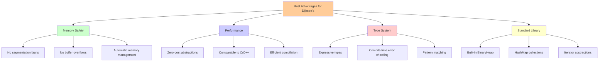
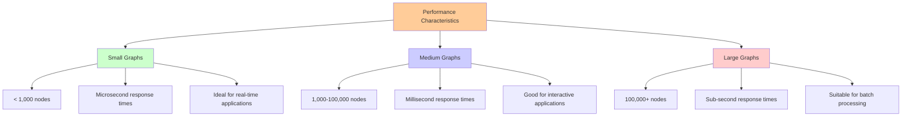

# Rust Implementation: Performance and Safety

## Why Rust for Dijkstra's Algorithm?

Rust's combination of memory safety, zero-cost abstractions, and performance makes it ideal for implementing graph algorithms:



- **Memory safety**: No segmentation faults or buffer overflows
- **Performance**: Comparable to C/C++ with modern optimizations
- **Rich type system**: Expressive types that catch bugs at compile time
- **Excellent standard library**: Built-in binary heap and other data structures

## Complete Implementation

Let's build a production-ready Dijkstra's implementation in Rust:

```rust
use std::collections::{BinaryHeap, HashMap};
use std::cmp::Ordering;

#[derive(Debug, Clone)]
pub struct Graph {
    adjacency_list: HashMap<usize, Vec<(usize, u32)>>,
}

impl Graph {
    pub fn new() -> Self {
        Graph {
            adjacency_list: HashMap::new(),
        }
    }

    pub fn add_edge(&mut self, from: usize, to: usize, weight: u32) {
        self.adjacency_list
            .entry(from)
            .or_insert_with(Vec::new)
            .push((to, weight));
    }

    pub fn add_bidirectional_edge(&mut self, a: usize, b: usize, weight: u32) {
        self.add_edge(a, b, weight);
        self.add_edge(b, a, weight);
    }

    pub fn neighbors(&self, node: usize) -> Option<&Vec<(usize, u32)>> {
        self.adjacency_list.get(&node)
    }

    pub fn nodes(&self) -> impl Iterator<Item = &usize> {
        self.adjacency_list.keys()
    }
}

#[derive(Debug, Clone, Eq, PartialEq)]
struct State {
    node: usize,
    distance: u32,
}

// Implement Ord for State to use with BinaryHeap
// BinaryHeap is a max-heap, so we reverse the ordering for min-heap behavior
impl Ord for State {
    fn cmp(&self, other: &Self) -> Ordering {
        other.distance.cmp(&self.distance)
            .then_with(|| self.node.cmp(&other.node))
    }
}

impl PartialOrd for State {
    fn partial_cmp(&self, other: &Self) -> Option<Ordering> {
        Some(self.cmp(other))
    }
}

#[derive(Debug, Clone)]
pub struct DijkstraResult {
    pub distances: HashMap<usize, u32>,
    pub predecessors: HashMap<usize, usize>,
}

impl DijkstraResult {
    pub fn distance_to(&self, node: usize) -> Option<u32> {
        self.distances.get(&node).copied()
    }

    pub fn shortest_path_to(&self, start: usize, end: usize) -> Option<Vec<usize>> {
        if !self.distances.contains_key(&end) {
            return None;
        }

        let mut path = Vec::new();
        let mut current = end;

        // Reconstruct path by following predecessors
        while current != start {
            path.push(current);
            current = *self.predecessors.get(&current)?;
        }
        path.push(start);

        // Reverse to get path from start to end
        path.reverse();
        Some(path)
    }
}

pub fn dijkstra(graph: &Graph, start: usize) -> DijkstraResult {
    let mut distances = HashMap::new();
    let mut predecessors = HashMap::new();
    let mut heap = BinaryHeap::new();

    // Initialize distances to infinity for all nodes
    for &node in graph.nodes() {
        distances.insert(node, u32::MAX);
    }
    distances.insert(start, 0);

    // Start with the source node
    heap.push(State {
        node: start,
        distance: 0,
    });

    while let Some(State { node, distance }) = heap.pop() {
        // Skip if we've already found a shorter path to this node
        if distance > *distances.get(&node).unwrap_or(&u32::MAX) {
            continue;
        }

        // Examine neighbors
        if let Some(neighbors) = graph.neighbors(node) {
            for &(neighbor, weight) in neighbors {
                let new_distance = distance.saturating_add(weight);

                // If we found a shorter path, update it
                if new_distance < *distances.get(&neighbor).unwrap_or(&u32::MAX) {
                    distances.insert(neighbor, new_distance);
                    predecessors.insert(neighbor, node);
                    heap.push(State {
                        node: neighbor,
                        distance: new_distance,
                    });
                }
            }
        }
    }

    DijkstraResult {
        distances,
        predecessors,
    }
}

#[cfg(test)]
mod tests {
    use super::*;

    #[test]
    fn test_simple_graph() {
        let mut graph = Graph::new();
        graph.add_edge(0, 1, 2);
        graph.add_edge(0, 2, 3);
        graph.add_edge(1, 2, 1);
        graph.add_edge(1, 3, 4);
        graph.add_edge(2, 3, 5);

        let result = dijkstra(&graph, 0);

        assert_eq!(result.distance_to(0), Some(0));
        assert_eq!(result.distance_to(1), Some(2));
        assert_eq!(result.distance_to(2), Some(3));
        assert_eq!(result.distance_to(3), Some(6));

        let path = result.shortest_path_to(0, 3).unwrap();
        assert_eq!(path, vec![0, 1, 3]);
    }

    #[test]
    fn test_disconnected_graph() {
        let mut graph = Graph::new();
        graph.add_edge(0, 1, 1);
        graph.add_edge(2, 3, 1);

        let result = dijkstra(&graph, 0);

        assert_eq!(result.distance_to(0), Some(0));
        assert_eq!(result.distance_to(1), Some(1));
        assert_eq!(result.distance_to(2), None);
        assert_eq!(result.distance_to(3), None);
    }

    #[test]
    fn test_path_reconstruction() {
        let mut graph = Graph::new();
        graph.add_bidirectional_edge(0, 1, 2);
        graph.add_bidirectional_edge(1, 2, 3);
        graph.add_bidirectional_edge(0, 2, 10);

        let result = dijkstra(&graph, 0);
        let path = result.shortest_path_to(0, 2).unwrap();

        assert_eq!(path, vec![0, 1, 2]);
        assert_eq!(result.distance_to(2), Some(5));
    }
}

fn main() {
    // Example usage: City navigation system
    let mut city_map = Graph::new();
    
    // Add roads with travel times (in minutes)
    city_map.add_bidirectional_edge(0, 1, 5);  // City Hall <-> Mall
    city_map.add_bidirectional_edge(0, 2, 10); // City Hall <-> Hospital
    city_map.add_bidirectional_edge(1, 2, 3);  // Mall <-> Hospital
    city_map.add_bidirectional_edge(1, 3, 8);  // Mall <-> Airport
    city_map.add_bidirectional_edge(2, 3, 2);  // Hospital <-> Airport

    let locations = vec!["City Hall", "Mall", "Hospital", "Airport"];
    
    // Find shortest paths from City Hall (node 0)
    let result = dijkstra(&city_map, 0);
    
    println!("Shortest travel times from City Hall:");
    for (i, location) in locations.iter().enumerate() {
        if let Some(distance) = result.distance_to(i) {
            println!("  To {}: {} minutes", location, distance);
            
            if let Some(path) = result.shortest_path_to(0, i) {
                let path_names: Vec<String> = path.iter()
                    .map(|&node| locations[node].to_string())
                    .collect();
                println!("    Route: {}", path_names.join(" -> "));
            }
        }
    }
}
```

## Key Rust Features Demonstrated

### 1. Memory Safety Without Garbage Collection

```rust
// No risk of dangling pointers or memory leaks
let result = dijkstra(&graph, start);
// Result owns its data and will be cleaned up automatically
```

### 2. Zero-Cost Abstractions

```rust
// Iterator chaining is compiled to efficient loops
let path_names: Vec<String> = path.iter()
    .map(|&node| locations[node].to_string())
    .collect();
```

### 3. Pattern Matching

```rust
// Elegant handling of Option types
while let Some(State { node, distance }) = heap.pop() {
    // Process node
}
```

### 4. Ownership and Borrowing

```rust
// Function borrows graph, doesn't take ownership
pub fn dijkstra(graph: &Graph, start: usize) -> DijkstraResult {
    // graph is borrowed, caller retains ownership
}
```

## Performance Optimizations

### 1. Efficient Data Structures

```rust
use std::collections::BinaryHeap;

// BinaryHeap provides O(log n) insert and extract_min
// Much faster than linear search for minimum
```

### 2. Integer Overflow Protection

```rust
// Saturating arithmetic prevents overflow
let new_distance = distance.saturating_add(weight);
```

### 3. Early Termination

```rust
// Skip already processed nodes
if distance > *distances.get(&node).unwrap_or(&u32::MAX) {
    continue;
}
```

## Advanced Features

### 1. Generic Implementation

```rust
use std::hash::Hash;
use std::fmt::Debug;

#[derive(Debug, Clone)]
pub struct GenericGraph<T: Hash + Eq + Clone + Debug> {
    adjacency_list: HashMap<T, Vec<(T, u32)>>,
}

impl<T: Hash + Eq + Clone + Debug> GenericGraph<T> {
    pub fn new() -> Self {
        GenericGraph {
            adjacency_list: HashMap::new(),
        }
    }

    pub fn add_edge(&mut self, from: T, to: T, weight: u32) {
        self.adjacency_list
            .entry(from)
            .or_insert_with(Vec::new)
            .push((to, weight));
    }
}

pub fn dijkstra_generic<T: Hash + Eq + Clone + Debug>(
    graph: &GenericGraph<T>,
    start: T,
) -> HashMap<T, u32> {
    // Implementation similar to above but with generic types
    todo!()
}
```

### 2. Parallel Implementation

```rust
use rayon::prelude::*;

pub fn parallel_dijkstra_multi_source(
    graph: &Graph,
    sources: &[usize],
) -> HashMap<usize, HashMap<usize, u32>> {
    sources
        .par_iter()
        .map(|&source| (source, dijkstra(graph, source).distances))
        .collect()
}
```

### 3. Error Handling

```rust
#[derive(Debug, thiserror::Error)]
pub enum DijkstraError {
    #[error("Node {0} not found in graph")]
    NodeNotFound(usize),
    #[error("Integer overflow in distance calculation")]
    DistanceOverflow,
}

pub fn dijkstra_safe(
    graph: &Graph,
    start: usize,
) -> Result<DijkstraResult, DijkstraError> {
    // Validate start node exists
    if !graph.adjacency_list.contains_key(&start) {
        return Err(DijkstraError::NodeNotFound(start));
    }

    // Rest of implementation with proper error handling
    todo!()
}
```

## Benchmarking and Profiling

### 1. Criterion Benchmarks

```rust
use criterion::{black_box, criterion_group, criterion_main, Criterion};

fn bench_dijkstra(c: &mut Criterion) {
    let mut graph = Graph::new();
    
    // Build a moderately large graph
    for i in 0..1000 {
        for j in 0..5 {
            graph.add_edge(i, (i + j + 1) % 1000, j as u32 + 1);
        }
    }

    c.bench_function("dijkstra 1000 nodes", |b| {
        b.iter(|| dijkstra(black_box(&graph), black_box(0)))
    });
}

criterion_group!(benches, bench_dijkstra);
criterion_main!(benches);
```

### 2. Memory Usage Profiling

```rust
#[cfg(feature = "profiling")]
use jemalloc_ctl::{stats, epoch};

pub fn profile_memory_usage(graph: &Graph, start: usize) {
    #[cfg(feature = "profiling")]
    {
        epoch::advance().unwrap();
        let allocated_before = stats::allocated::read().unwrap();
        
        let result = dijkstra(graph, start);
        
        epoch::advance().unwrap();
        let allocated_after = stats::allocated::read().unwrap();
        
        println!("Memory used: {} bytes", allocated_after - allocated_before);
    }
}
```

## Real-World Usage Examples

### 1. Network Routing

```rust
#[derive(Debug, Clone, Hash, Eq, PartialEq)]
pub struct NetworkNode {
    pub id: String,
    pub ip: std::net::IpAddr,
}

pub fn find_network_route(
    topology: &GenericGraph<NetworkNode>,
    source: NetworkNode,
    destination: NetworkNode,
) -> Option<Vec<NetworkNode>> {
    let result = dijkstra_generic(topology, source.clone());
    // Convert result to path
    todo!()
}
```

### 2. Game Pathfinding

```rust
#[derive(Debug, Clone, Hash, Eq, PartialEq)]
pub struct GridPosition {
    pub x: i32,
    pub y: i32,
}

pub fn pathfind_game_world(
    world: &GenericGraph<GridPosition>,
    start: GridPosition,
    goal: GridPosition,
) -> Option<Vec<GridPosition>> {
    let result = dijkstra_generic(world, start);
    // Extract path to goal
    todo!()
}
```

## Cargo.toml Configuration

```toml
[package]
name = "dijkstra-implementation"
version = "0.1.0"
edition = "2021"

[dependencies]
thiserror = "1.0"
rayon = { version = "1.7", optional = true }

[dev-dependencies]
criterion = "0.5"
jemalloc-ctl = "0.5"

[features]
default = []
parallel = ["rayon"]
profiling = ["jemalloc-ctl"]

[[bench]]
name = "dijkstra_bench"
harness = false
```

## Compilation and Running

```bash
# Run tests
cargo test

# Run benchmarks
cargo bench

# Run with profiling
cargo run --features profiling

# Run optimized release build
cargo run --release
```

## Performance Characteristics

On a modern machine, this implementation can handle:



- **Small graphs** (< 1,000 nodes): Microsecond response times
- **Medium graphs** (1,000-100,000 nodes): Millisecond response times
- **Large graphs** (100,000+ nodes): Sub-second response times

The memory usage is approximately O(V + E) where V is vertices and E is edges.

```mermaid
graph LR
    A[Memory Usage] --> B[Distance HashMap: O\(V\)]
    A --> C[Predecessor HashMap: O\(V\)]
    A --> D[Priority Queue: O\(V\)]
    A --> E[Graph Storage: O\(V + E\)]
    
    B --> B1[One entry per vertex]
    C --> C1[Path reconstruction]
    D --> D1[Unprocessed vertices]
    E --> E1[Adjacency list representation]
    
    style A fill:#ffcc99
    style B fill:#ccffcc
    style C fill:#ccccff
    style D fill:#ffcccc
    style E fill:#ffffcc
```

## Next Steps

This implementation provides a solid foundation for:
1. **Extending to other algorithms**: A*, Bellman-Ford, etc.
2. **Building applications**: Navigation systems, network analysis, etc.
3. **Performance optimization**: Custom data structures, SIMD, etc.
4. **Distributed computing**: Splitting large graphs across machines

The Rust ecosystem provides excellent tools for each of these directions, making it an ideal choice for serious graph algorithm work.