# The Core Problem: Finding Needles in a Distributed Haystack

## The Monolith's Debugging Comfort Zone

In a monolithic application, debugging is like investigating a crime scene in a single room. When something goes wrong, you have:

```mermaid
flowchart TD
    A["User Reports: Checkout is slow"] --> B["🔍 Debug Strategy"]
    B --> C["One Codebase"]
    B --> D["One Log File"]
    B --> E["One Database"]
    B --> F["One Call Stack"]
    
    C --> G["Open IDE"]
    D --> H["Search logs"]
    E --> I["Query database"]
    F --> J["Trace execution"]
    
    G --> K["✅ Add logging"]
    H --> K
    I --> K
    J --> K
    
    K --> L["🎯 Find root cause"]
    
    style L fill:#e8f5e8
```



### The Monolith Debugging Flow


When a user reports "the checkout is slow," you open your IDE, add some logging, and follow the execution path from the HTTP request all the way down to the database query. Simple.

## The Microservice Crime Scene

Now imagine that same checkout process, but scattered across a distributed system:

```mermaid
flowchart TD
    A[User clicks "Buy Now"] --> B[API Gateway]
    B --> C[User Service]
    C --> D[Inventory Service]
    D --> E[Product Service]
    E --> F[Pricing Service]
    F --> G[Payment Service]
    G --> H[Order Service]
    H --> I[Notification Service]
    I --> J[Shipping Service]
    
    C --> K["validate session"]
    D --> L["check stock"]
    E --> M["get details"]
    F --> N["calculate cost"]
    G --> O["process card"]
    H --> P["create order"]
    I --> Q["send email"]
    J --> R["schedule delivery"]
    
    style A fill:#e1f5fe
    style B fill:#f3e5f5
    style G fill:#fff3e0
    style H fill:#e8f5e8
```

When this process takes 8 seconds instead of 2, where do you even start looking?

## The Distributed System Complexity Matrix


## The Distributed Debugging Nightmare

### Problem 1: The Vanishing Request

You know a request entered your system, but you can't see where it went. Each service has its own logs, its own format, its own timestamps. A request might be:


### The Identity Crisis


There's no thread connecting them. You're debugging with a broken magnifying glass.

### Problem 2: The Timing Mystery

Even if you find all the logs, timing becomes a puzzle:


**The Challenge**: Was that 2-second delay real or just clock skew?

### Clock Skew Visualization


You can't tell if delays are real or just timing artifacts.

### Problem 3: The Cascading Failure

When one service fails, it's like a domino effect. The user sees a generic error, but the root cause might be buried five services deep:

```mermaid
flowchart TD
    A[User Request] --> B[API Gateway]
    B --> C[Payment Service]
    C --> D[Inventory Service]
    D --> E["🐌 Slow Database"]
    
    E --> F["⏱️ Inventory Timeout"]
    F --> G["💥 Payment Failure"]
    G --> H["❌ Generic Error"]
    
    I["What User Sees"] --> J["Payment failed"]
    
    K["What Actually Happened"] --> L["Database slowness<br/>↓<br/>Service timeout<br/>↓<br/>Cascading failure"]
    
    style E fill:#ffcdd2
    style F fill:#ffcdd2
    style G fill:#ffcdd2
    style H fill:#ffcdd2
```



### The Failure Attribution Problem


Finding the actual root cause requires detective work across multiple systems.

## The Scale Problem

These problems get exponentially worse with scale:


### The Correlation Challenge


You need a system that can answer questions like:
- "Show me all services this request touched"
- "Which service was the bottleneck?"
- "What happened right before the error?"

## The Human Cost

Without proper distributed tracing, your team spends hours on what should be minutes:


### The Cost Comparison


**Legend**: Blue = With Tracing, Red = Without Tracing

## The Real-World Impact

Consider a real scenario: Your e-commerce platform experiences a 40% increase in checkout failures during Black Friday. 

### Without Distributed Tracing:


### With Distributed Tracing:


**Result**: 5-hour investigation becomes 15-minute resolution.

## The Observability Evolution


## The Solution Preview

Distributed tracing solves this by creating a "fingerprint" for each request that flows through your entire system. Think of it as a GPS tracker for your requests - you can see exactly where each request went, how long it spent in each service, and where problems occurred.

```mermaid
flowchart TD
    subgraph "Before: Distributed Debugging Chaos"
        A1[Request] --> B1[Service A]
        A1 --> C1[Service B]
        A1 --> D1[Service C]
        B1 -.-> E1["🔍 Manual Log Correlation"]
        C1 -.-> E1
        D1 -.-> E1
        E1 --> F1["❌ Hours of Investigation"]
    end
    
    subgraph "After: Distributed Tracing Clarity"
        A2[Request + Trace ID] --> B2[Service A + Span]
        B2 --> C2[Service B + Span]
        C2 --> D2[Service C + Span]
        B2 -.-> E2["📊 Automatic Correlation"]
        C2 -.-> E2
        D2 -.-> E2
        E2 --> F2["✅ Instant Visibility"]
    end
    
    style F1 fill:#ffcdd2
    style F2 fill:#e8f5e8
```



In the next section, we'll explore the guiding philosophy that makes this possible: **context propagation**.

## The Distributed Tracing Value Proposition


---

*The core problem is simple: modern applications span multiple services, but our debugging tools are stuck in the monolith era. Distributed tracing bridges this gap by making the invisible visible.*