# The Guiding Philosophy: Context Propagation

## The Breakthrough Insight

The solution to distributed tracing isn't about building better logs or faster searches. It's about a fundamental shift in how we think about requests in distributed systems.

**Core Principle**: Every request must carry its identity through the entire system, like a passport that gets stamped at every border crossing.

## The Thread of Ariadne

In Greek mythology, Ariadne gave Theseus a ball of thread to navigate the labyrinth and find his way back. In distributed systems, we need the same thing - a thread that connects every step of a request's journey.

```mermaid
flowchart TD
    A["🏛️ Labyrinth Entrance"] --> B["🧵 Thread unrolls"]
    B --> C["🚶 Theseus follows path"]
    C --> D["🐉 Encounters Minotaur"]
    D --> E["🧵 Follows thread back"]
    E --> F["🏛️ Exits safely"]
    
    G["📱 Request enters system"] --> H["🔗 Trace context propagates"]
    H --> I["🔄 Services process request"]
    I --> J["⚠️ Error occurs"]
    J --> K["🔗 Trace context reveals path"]
    K --> L["🎯 Root cause identified"]
    
    style A fill:#f3e5f5
    style G fill:#e3f2fd
    style F fill:#e8f5e8
    style L fill:#e8f5e8
```



This thread is called **context propagation**.

## What Context Propagation Means

### The Simple Version

When Service A calls Service B, it doesn't just send the business data. It also sends:


### The Technical Version

Context propagation is the automatic transmission of trace metadata across service boundaries:


This metadata includes:
- **Trace ID**: The unique identifier for the entire request journey
- **Span ID**: The unique identifier for this specific operation
- **Parent Span ID**: The ID of the operation that called this one
- **Baggage**: Key-value pairs that travel with the request

## The Philosophy in Action

### Before Context Propagation


**Log Output**:
```
[API Gateway] Received request
[API Gateway] Calling user service
[User Service] Validating user
[User Service] Calling inventory service
[Inventory Service] Checking stock
```

### After Context Propagation

```mermaid
sequenceDiagram
    participant A as API Gateway
    participant U as User Service
    participant I as Inventory Service
    
    A->>A: Log: "trace=abc123 span=001"
    A->>U: Call + trace context
    U->>U: Log: "trace=abc123 span=003 parent=002"
    U->>I: Call + trace context
    I->>I: Log: "trace=abc123 span=005 parent=004"
    
    Note over A,I: ✅ Connected story<br/>Complete request journey
```



**Log Output**:
```
[API Gateway] trace=abc123 span=001 Received request
[API Gateway] trace=abc123 span=002 parent=001 Calling user service
[User Service] trace=abc123 span=003 parent=002 Validating user
[User Service] trace=abc123 span=004 parent=003 Calling inventory service
[Inventory Service] trace=abc123 span=005 parent=004 Checking stock
```

Now you can see the complete story.

## The Three Laws of Context Propagation

### Law 1: Context Must Be Preserved

When a service receives a request with trace context, it must:
- Extract the trace information
- Use it for all its internal operations
- Pass it to any downstream services

This is like a relay race - you must pass the baton.

### Law 2: Context Must Be Enhanced

Each service doesn't just pass the context along unchanged. It adds its own span:
- Creates a new span for its work
- Sets the parent span to the incoming span
- Records its own timing and metadata

This is like adding your signature to a document as it passes through departments.

### Law 3: Context Must Be Transported

The trace context must survive network boundaries. This means:
- **HTTP headers** carry trace information
- **Message queue metadata** preserves context
- **Database connections** maintain trace context

## The Implementation Philosophy

### Transparency Over Intrusiveness

Good distributed tracing should be invisible to business logic:

```rust
// Bad: Business logic is polluted with tracing
fn process_order(order: Order, trace_id: String) {
    let span = create_span(trace_id, "process_order");
    
    let user = get_user(order.user_id, trace_id);
    let inventory = check_inventory(order.items, trace_id);
    
    span.finish();
}

// Good: Tracing is transparent
fn process_order(order: Order) {
    let user = get_user(order.user_id);
    let inventory = check_inventory(order.items);
}
```

The tracing infrastructure should handle context propagation automatically.

### Instrumentation by Convention

Instead of manually adding tracing to every function, we instrument at the boundaries:

- **HTTP servers/clients** automatically create spans
- **Database calls** automatically create spans
- **Message producers/consumers** automatically create spans

## The Propagation Mechanisms

### HTTP Headers

The most common mechanism for web services:


**Header Format**:
```
GET /api/users/123
Traceparent: 00-4bf92f3577b34da6a3ce929d0e0e4736-00f067aa0ba902b7-01
Tracestate: vendor1=value1,vendor2=value2
```

### Message Metadata

For asynchronous systems:


**Message Format**:
```json
{
  "message": {
    "user_id": 123,
    "action": "process_order"
  },
  "trace_context": {
    "trace_id": "4bf92f3577b34da6a3ce929d0e0e4736",
    "span_id": "00f067aa0ba902b7",
    "parent_span_id": "a3ce929d0e0e4736"
  }
}
```

### In-Process Context

For calls within the same service:


**Code Example**:
```rust
// Context is stored in thread-local storage
fn handle_request() {
    let trace_ctx = TraceContext::current();
    
    // This automatically inherits the context
    let user = get_user(user_id);
    
    // This also inherits the context
    let inventory = check_inventory(items);
}
```

## The Philosophical Trade-offs

### Performance vs. Observability

Every trace adds overhead:


**Cost Breakdown**:
- **CPU**: Creating and managing spans
- **Memory**: Storing span data
- **Network**: Transmitting trace headers
- **Storage**: Persisting trace data

The philosophy is: **Pay a small tax everywhere to avoid large investigations later.**

### Completeness vs. Practicality

```mermaid
flowchart TD
    A["Tracing Granularity Spectrum"] --> B["Every Function Call"]
    A --> C["Service Boundaries"]
    A --> D["Database Operations"]
    A --> E["External API Calls"]
    A --> F["Critical Business Logic"]
    
    B --> G["🔴 Too Much Overhead"]
    C --> H["🟢 Always Trace"]
    D --> I["🟡 Usually Trace"]
    E --> J["🟢 Always Trace"]
    F --> K["🟡 Selectively Trace"]
    
    style G fill:#ffcdd2
    style H fill:#e8f5e8
    style I fill:#fff3e0
    style J fill:#e8f5e8
    style K fill:#fff3e0
```



In theory, you could trace every function call. In practice, you trace at meaningful boundaries:
- **Service boundaries** (always)
- **Database operations** (usually)
- **External API calls** (always)
- **Critical business logic** (selectively)

### Consistency vs. Flexibility


The ideal is universal standards (like OpenTelemetry), but reality requires:
- **Vendor-specific extensions** for advanced features
- **Custom instrumentation** for unique requirements
- **Legacy system bridges** for gradual adoption

## The Culture Shift

Adopting distributed tracing requires a philosophical shift:


### The Observability Maturity Model


### From "It Works On My Machine" to "It Works In Production"

Local debugging becomes less relevant. Production observability becomes critical.

### From "Logs Are Enough" to "Traces Tell Stories"

Logs capture events. Traces capture journeys.

### From "Debugging After Problems" to "Understanding Before Problems"

Distributed tracing enables proactive performance optimization, not just reactive debugging.

## The Measuring Stick

A good distributed tracing implementation should answer these questions instantly:

```mermaid
flowchart LR
    A["Distributed Tracing System"] --> B["❓ What services did this request touch?"]
    A --> C["⏱️ How long did each service take?"]
    A --> D["❌ Where did the error occur?"]
    A --> E["🛤️ What was the critical path?"]
    A --> F["🐢 Which service was the bottleneck?"]
    
    B --> G["🔍 Service topology"]
    C --> H["📊 Timing breakdown"]
    D --> I["🎯 Error location"]
    E --> J["⚡ Performance path"]
    F --> K["🚨 Bottleneck identification"]
    
    style A fill:#e3f2fd
    style G fill:#e8f5e8
    style H fill:#e8f5e8
    style I fill:#e8f5e8
    style J fill:#e8f5e8
    style K fill:#e8f5e8
```



### The 5-Second Rule


**Legend**: Blue = With Tracing, Red = Without Tracing

If you can't answer these questions in seconds, your context propagation isn't working.

## The Context Propagation Ecosystem


---

*Context propagation is the invisible thread that weaves isolated microservices into a observable, debuggable system. It's not about adding more data - it's about adding the right connections.*