# Key Abstractions: The Building Blocks of Distributed Tracing

## The Three Pillars

Distributed tracing rests on three fundamental abstractions:

1. **Trace**: The complete journey of a request
2. **Span**: A single operation within that journey
3. **Context**: The information that connects spans together

Let's build these concepts from the ground up.

## Trace: The Complete Story

### The Analogy: A Package Delivery

Imagine ordering a package online. The **trace** is the complete story of your package's journey:

```
Order placed → Warehouse → Sorting facility → Truck → Local facility → Delivery truck → Your door
```

Every step is part of the same story, with the same tracking number connecting them all.

### The Technical Definition

A **trace** represents the complete execution path of a request through a distributed system. It has:

- **Trace ID**: A unique identifier (like a tracking number)
- **Root span**: The first operation that started the trace
- **Child spans**: All subsequent operations
- **Duration**: From first span start to last span end

### Trace Visualization

```
Trace ID: abc123
Duration: 2.3 seconds

Timeline:
0ms     |---- API Gateway (50ms) ----|
  20ms    |---- User Service (30ms) ----|
    40ms    |---- Inventory Service (100ms) ----|
      60ms    |---- Product Service (80ms) ----|
        80ms    |---- Database Query (60ms) ----|
  200ms   |---- Payment Service (150ms) ----|
    220ms   |---- Payment Gateway (130ms) ----|
  400ms   |---- Order Service (200ms) ----|
    420ms   |---- Database Insert (180ms) ----|
```

## Span: The Unit of Work

### The Analogy: A Stamp on the Package

Each time your package reaches a new location, it gets stamped. Each **span** is like one of these stamps:

- **Where**: Which facility handled it
- **When**: Timestamp of arrival and departure
- **How long**: Time spent at this facility
- **What happened**: Any special processing

### The Technical Definition

A **span** represents a single operation within a trace. It captures:

- **Span ID**: Unique identifier for this operation
- **Parent Span ID**: Which operation called this one
- **Operation Name**: What this span represents
- **Start Time**: When the operation began
- **Duration**: How long it took
- **Tags**: Key-value metadata
- **Logs**: Timestamped events within the span

### Span Lifecycle

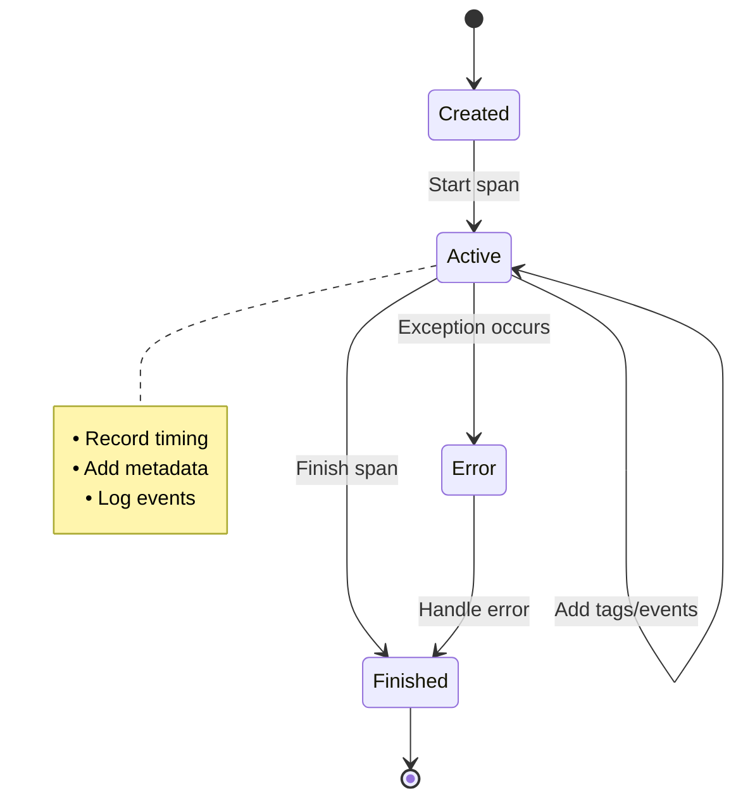

### Span State Transitions

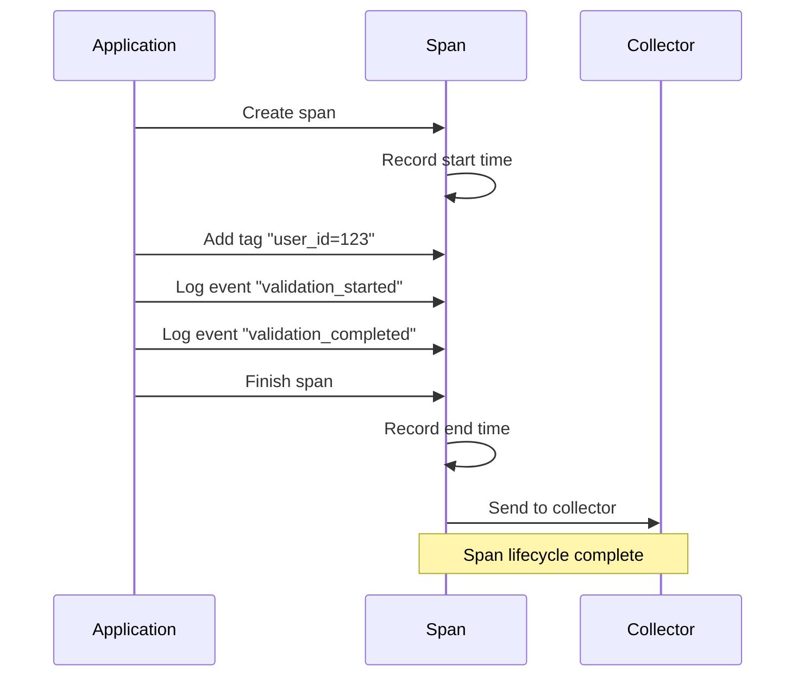

### Span Hierarchy

Spans form a tree structure:

```
Root Span: Handle HTTP Request
├── Child Span: Validate User
│   ├── Child Span: Query User Database
│   └── Child Span: Check User Permissions
├── Child Span: Process Order
│   ├── Child Span: Check Inventory
│   │   └── Child Span: Query Inventory Database
│   └── Child Span: Calculate Price
│       └── Child Span: Apply Discounts
└── Child Span: Create Order
    └── Child Span: Insert Order Database
```

## Context: The Connecting Thread

### The Analogy: The Passport

When you travel internationally, your **passport** contains:
- Your identity (who you are)
- Your journey (stamps from each country)
- Your current location (where you are now)

In distributed tracing, **context** is the passport for your request.

### The Technical Definition

**Context** is the metadata that travels with a request, containing:

- **Trace ID**: Which trace this operation belongs to
- **Span ID**: The current operation
- **Parent Span ID**: The operation that called this one
- **Baggage**: Key-value pairs that travel with the request
- **Trace flags**: Sampling and debugging flags

### Context Propagation in Action

```
HTTP Request Headers:
traceparent: 00-4bf92f3577b34da6a3ce929d0e0e4736-00f067aa0ba902b7-01
             │   │                                 │                │
             │   │                                 │                └─ Flags
             │   │                                 └─ Parent Span ID
             │   └─ Trace ID
             └─ Version
```

## The Relationship Between Abstractions

### The Hierarchy

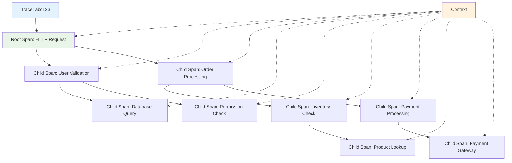

### The Data Flow

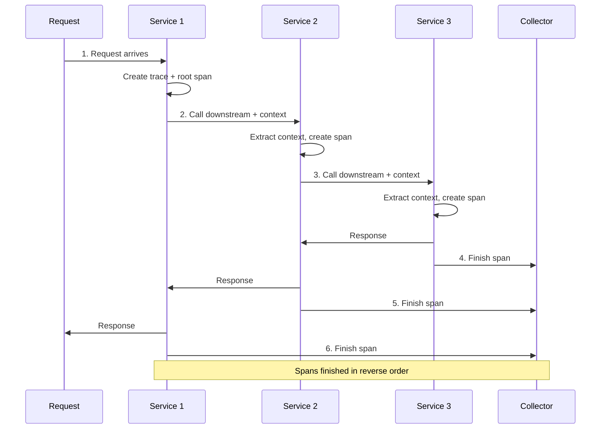

**Flow Steps**:
1. **Request arrives** → New trace created with root span
2. **Service processes** → Context extracted, span created
3. **Service calls downstream** → Context propagated
4. **Downstream service** → New span created with proper parent
5. **Response returns** → Spans finished in reverse order

## Real-World Example: E-commerce Checkout

### The Trace Structure

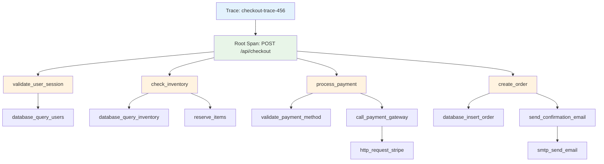

### Timing Waterfall View

```mermaid
gantt
    title E-commerce Checkout Trace Timeline
    dateFormat X
    axisFormat %L ms
    
    section Main Flow
    POST /api/checkout        :active, 0, 2000
    
    section User Validation
    validate_user_session     :active, 50, 200
    database_query_users      :active, 60, 150
    
    section Inventory
    check_inventory           :active, 200, 500
    database_query_inventory  :active, 220, 400
    reserve_items            :active, 400, 490
    
    section Payment
    process_payment          :active, 500, 1500
    validate_payment_method  :active, 520, 600
    call_payment_gateway     :active, 600, 1400
    http_request_stripe      :active, 650, 1350
    
    section Order Creation
    create_order             :active, 1500, 1950
    database_insert_order    :active, 1520, 1700
    send_confirmation_email  :active, 1700, 1900
    smtp_send_email         :active, 1720, 1880
```

### The Context at Each Step

```
# API Gateway
Context: {
  trace_id: "checkout-trace-456",
  span_id: "root-span-001",
  parent_span_id: null
}

# User Service
Context: {
  trace_id: "checkout-trace-456",
  span_id: "validate-span-002",
  parent_span_id: "root-span-001"
}

# Database Query
Context: {
  trace_id: "checkout-trace-456",
  span_id: "db-query-span-003",
  parent_span_id: "validate-span-002"
}
```

## Advanced Concepts

### Baggage: Cross-Service Data

Baggage allows you to pass data across service boundaries:

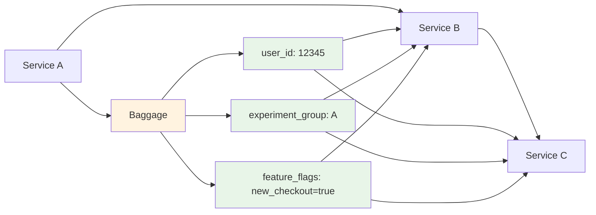

**Context Example**:
```json
{
  "trace_id": "checkout-trace-456",
  "span_id": "payment-span-004",
  "parent_span_id": "root-span-001",
  "baggage": {
    "user_id": "12345",
    "experiment_group": "A",
    "feature_flags": "new_checkout_flow=true"
  }
}
```

### Span Events: Moments in Time

Within a span, you can record specific events:

```mermaid
gantt
    title Span Events Timeline
    dateFormat X
    axisFormat %L ms
    
    section payment_span
    payment_validation_started :milestone, 0, 0
    payment_method_validated   :milestone, 333, 333
    calling_payment_gateway    :milestone, 666, 666
    payment_processed         :milestone, 1111, 1111
    
    section Processing
    Validation    :active, 0, 333
    Gateway Call  :active, 666, 1111
```

**Events Structure**:
```
Span: process_payment
Events:
├── 2024-01-15T10:30:15.123Z: payment_validation_started
├── 2024-01-15T10:30:15.456Z: payment_method_validated
├── 2024-01-15T10:30:15.789Z: calling_payment_gateway
└── 2024-01-15T10:30:16.234Z: payment_processed
```

### Span Links: Connecting Across Traces

Sometimes operations span multiple traces:

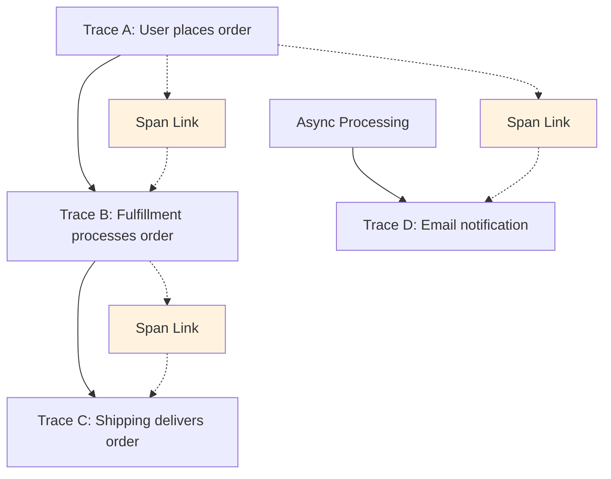

**Link Types**:
- **Causal**: One trace caused another
- **Temporal**: Traces happened at the same time
- **Logical**: Traces are part of the same business process

## The Mental Model

### Think of Traces as Movies

- **Trace**: The complete movie
- **Spans**: Individual scenes
- **Context**: The continuity that connects scenes
- **Tags**: The metadata about each scene
- **Events**: Key moments within a scene

### Think of Spans as Function Calls

```rust
fn handle_request() {          // Root span
    let user = validate_user(); // Child span
    let order = process_order(); // Child span
    save_order(order);          // Child span
}
```

Each function call becomes a span, maintaining the parent-child relationship.

## The Power of These Abstractions

### Question: "Why is checkout slow?"

**Without tracing**: Check all service logs, correlate timestamps, guess at relationships.

**With tracing**: 
1. Find the slow trace
2. Identify the longest span
3. Drill down to the bottleneck
4. Fix the specific issue

### Question: "Which service is failing?"

**Without tracing**: Monitor error rates across all services.

**With tracing**:
1. Filter traces with errors
2. Find the first span with error=true
3. Identify the failing service
4. Get the exact error context

## The Implementation Preview

These abstractions translate directly into code:

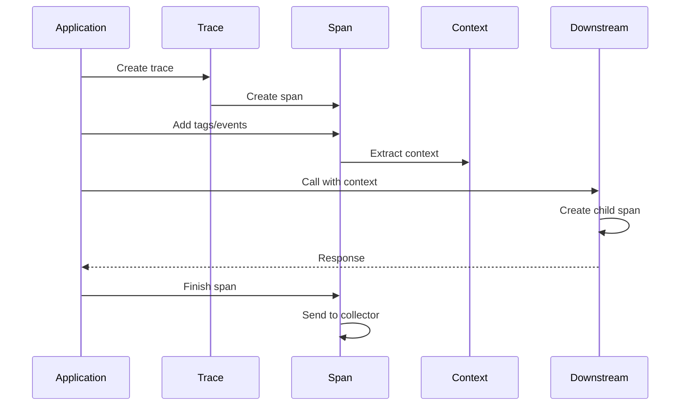

**Code Example**:
```rust
// Creating a trace
let trace = Trace::new("checkout-trace-456");

// Creating a span
let span = trace.create_span("process_payment")
    .with_tag("user_id", "12345")
    .with_tag("payment_method", "credit_card");

// Propagating context
let context = span.context();
downstream_service.call_with_context(context, request);

// Finishing the span
span.finish();
```

### The Abstraction Stack

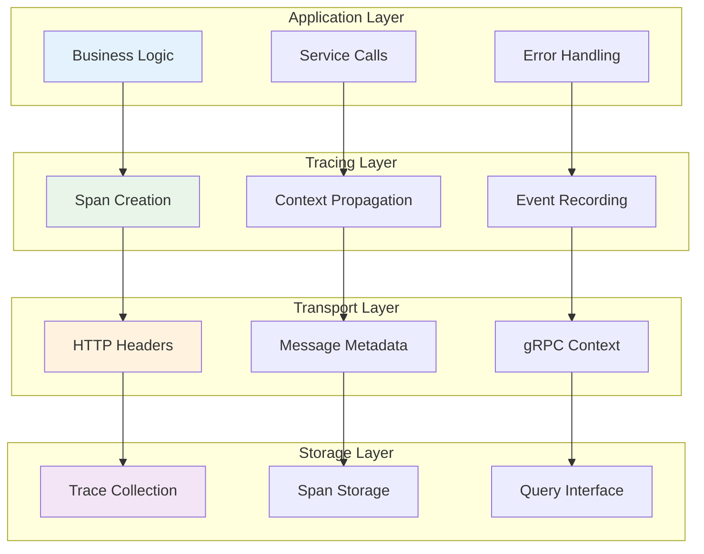

## The Abstraction Design Principles

### 1. Simplicity
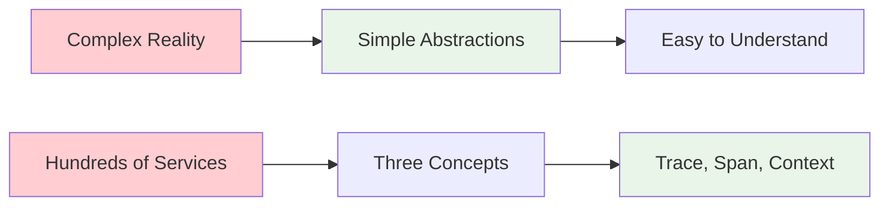

### 2. Composability
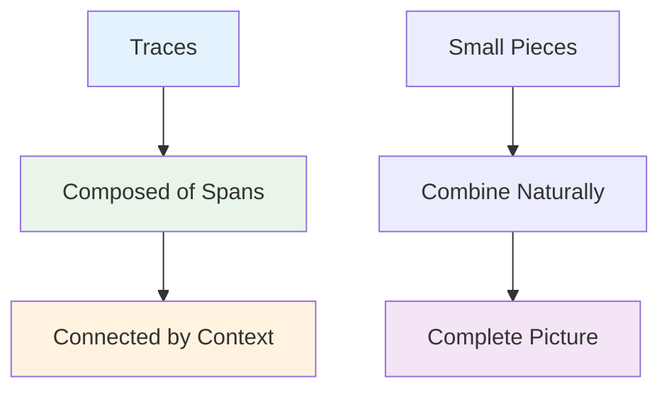

### 3. Universality
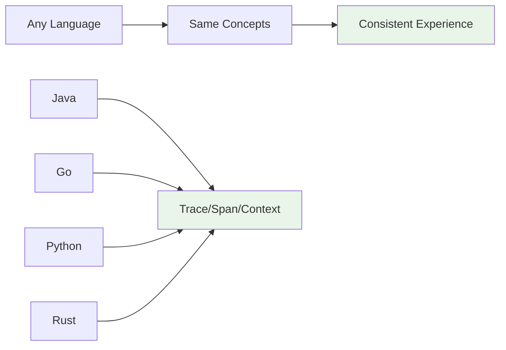

---

*Trace, Span, and Context are the DNA of distributed tracing. Master these three concepts, and you'll understand how to make any distributed system observable.*