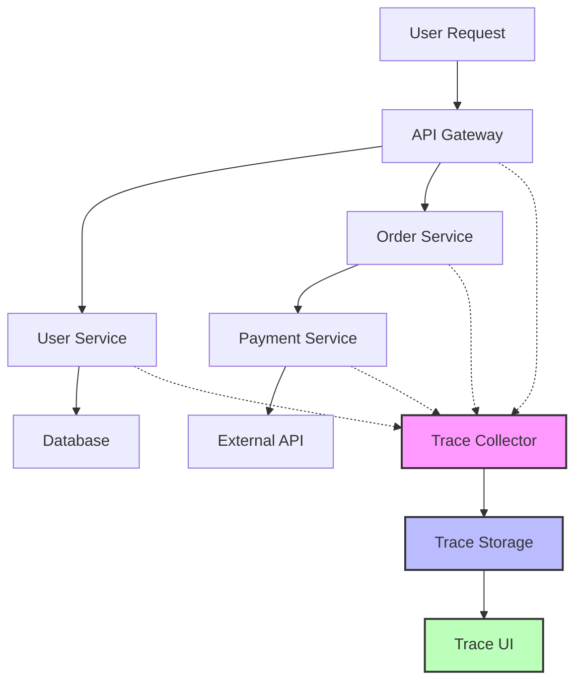

# Implementing Basic Tracing: Your First Distributed Detective

## What We're Building

We'll implement a simple distributed tracing system that tracks requests across multiple services. Our goal is to understand how traces and spans work in practice, not build a production system.

**End Result**: A working tracing system that can show you exactly where your requests go and how long they take.

## The Architecture



## Core Components

### 1. Trace Context

This is the "passport" that travels with each request:

```go
type TraceContext struct {
    TraceID    string            `json:"trace_id"`
    SpanID     string            `json:"span_id"`
    ParentSpanID string          `json:"parent_span_id,omitempty"`
    Baggage    map[string]string `json:"baggage,omitempty"`
    Flags      int               `json:"flags"`
}

func NewTraceContext() *TraceContext {
    return &TraceContext{
        TraceID: generateTraceID(),
        SpanID:  generateSpanID(),
        Baggage: make(map[string]string),
        Flags:   1, // Sampled
    }
}

func (tc *TraceContext) CreateChildSpan() *TraceContext {
    return &TraceContext{
        TraceID:      tc.TraceID,
        SpanID:       generateSpanID(),
        ParentSpanID: tc.SpanID,
        Baggage:      tc.Baggage,
        Flags:        tc.Flags,
    }
}
```

### 2. Span Implementation

A span represents a single operation with timing and metadata:

```go
type Span struct {
    TraceID      string            `json:"trace_id"`
    SpanID       string            `json:"span_id"`
    ParentSpanID string            `json:"parent_span_id,omitempty"`
    OperationName string           `json:"operation_name"`
    StartTime    time.Time         `json:"start_time"`
    EndTime      time.Time         `json:"end_time"`
    Duration     time.Duration     `json:"duration"`
    Tags         map[string]string `json:"tags"`
    Logs         []SpanLog         `json:"logs"`
    ServiceName  string            `json:"service_name"`
    Status       SpanStatus        `json:"status"`
}

type SpanLog struct {
    Timestamp time.Time         `json:"timestamp"`
    Fields    map[string]string `json:"fields"`
}

type SpanStatus struct {
    Code    int    `json:"code"`
    Message string `json:"message"`
}

func NewSpan(operationName string, context *TraceContext) *Span {
    return &Span{
        TraceID:       context.TraceID,
        SpanID:        context.SpanID,
        ParentSpanID:  context.ParentSpanID,
        OperationName: operationName,
        StartTime:     time.Now(),
        Tags:          make(map[string]string),
        Logs:          make([]SpanLog, 0),
        Status:        SpanStatus{Code: 0, Message: "OK"},
    }
}

func (s *Span) SetTag(key, value string) *Span {
    s.Tags[key] = value
    return s
}

func (s *Span) LogKV(fields map[string]string) *Span {
    s.Logs = append(s.Logs, SpanLog{
        Timestamp: time.Now(),
        Fields:    fields,
    })
    return s
}

func (s *Span) Finish() {
    s.EndTime = time.Now()
    s.Duration = s.EndTime.Sub(s.StartTime)
    
    // Send span to collector
    TraceCollector.Collect(s)
}
```

### 3. HTTP Context Propagation

This is how we pass trace context between services:

```go
const (
    TraceParentHeader = "traceparent"
    TraceStateHeader  = "tracestate"
)

// Extract trace context from HTTP headers
func ExtractTraceContext(r *http.Request) *TraceContext {
    traceparent := r.Header.Get(TraceParentHeader)
    if traceparent == "" {
        return NewTraceContext()
    }
    
    // Parse traceparent: 00-{trace_id}-{span_id}-{flags}
    parts := strings.Split(traceparent, "-")
    if len(parts) != 4 {
        return NewTraceContext()
    }
    
    return &TraceContext{
        TraceID:      parts[1],
        SpanID:       parts[2],
        ParentSpanID: parts[2], // This becomes the parent for child spans
        Baggage:      make(map[string]string),
        Flags:        parseFlags(parts[3]),
    }
}

// Inject trace context into HTTP headers
func InjectTraceContext(req *http.Request, context *TraceContext) {
    traceparent := fmt.Sprintf("00-%s-%s-%02x", 
        context.TraceID, 
        context.SpanID, 
        context.Flags)
    
    req.Header.Set(TraceParentHeader, traceparent)
}
```

### 4. Service Instrumentation

Here's how to instrument your services:

```go
// HTTP middleware for automatic tracing
func TracingMiddleware(next http.Handler) http.Handler {
    return http.HandlerFunc(func(w http.ResponseWriter, r *http.Request) {
        // Extract or create trace context
        context := ExtractTraceContext(r)
        
        // Create span for this request
        span := NewSpan(fmt.Sprintf("%s %s", r.Method, r.URL.Path), context)
        span.SetTag("http.method", r.Method)
        span.SetTag("http.url", r.URL.String())
        span.SetTag("service.name", ServiceName)
        
        // Add context to request
        ctx := context.WithValue(r.Context(), "trace_context", context)
        ctx = context.WithValue(ctx, "span", span)
        
        // Wrap response writer to capture status code
        wrapped := &responseWriter{ResponseWriter: w, statusCode: 200}
        
        // Call next handler
        next.ServeHTTP(wrapped, r.WithContext(ctx))
        
        // Finish span
        span.SetTag("http.status_code", fmt.Sprintf("%d", wrapped.statusCode))
        if wrapped.statusCode >= 400 {
            span.Status.Code = 1
            span.Status.Message = "Error"
        }
        span.Finish()
    })
}

type responseWriter struct {
    http.ResponseWriter
    statusCode int
}

func (rw *responseWriter) WriteHeader(code int) {
    rw.statusCode = code
    rw.ResponseWriter.WriteHeader(code)
}
```

## Step-by-Step Implementation

### Step 1: Create the Trace Collector

```go
type Collector struct {
    spans   []Span
    mutex   sync.RWMutex
    storage SpanStorage
}

var TraceCollector = &Collector{
    spans:   make([]Span, 0),
    storage: NewInMemoryStorage(),
}

func (c *Collector) Collect(span *Span) {
    c.mutex.Lock()
    defer c.mutex.Unlock()
    
    c.spans = append(c.spans, *span)
    c.storage.Store(*span)
    
    fmt.Printf("Collected span: %s in trace %s (duration: %v)\n", 
        span.OperationName, span.TraceID, span.Duration)
}

func (c *Collector) GetTrace(traceID string) []Span {
    c.mutex.RLock()
    defer c.mutex.RUnlock()
    
    var traceSpans []Span
    for _, span := range c.spans {
        if span.TraceID == traceID {
            traceSpans = append(traceSpans, span)
        }
    }
    
    return traceSpans
}
```

### Step 2: Create a Simple Service

```go
package main

import (
    "encoding/json"
    "fmt"
    "log"
    "net/http"
    "time"
)

const ServiceName = "user-service"

type User struct {
    ID   string `json:"id"`
    Name string `json:"name"`
}

func getUserHandler(w http.ResponseWriter, r *http.Request) {
    // Get trace context from middleware
    span := r.Context().Value("span").(*Span)
    context := r.Context().Value("trace_context").(*TraceContext)
    
    // Log the start of processing
    span.LogKV(map[string]string{
        "event": "processing_started",
        "user_id": r.URL.Query().Get("id"),
    })
    
    // Simulate database call
    dbSpan := NewSpan("database_query", context.CreateChildSpan())
    dbSpan.SetTag("db.type", "postgres")
    dbSpan.SetTag("db.statement", "SELECT * FROM users WHERE id = $1")
    
    // Simulate DB work
    time.Sleep(50 * time.Millisecond)
    
    dbSpan.Finish()
    
    // Create response
    user := User{
        ID:   r.URL.Query().Get("id"),
        Name: "John Doe",
    }
    
    span.LogKV(map[string]string{
        "event": "user_found",
        "user_name": user.Name,
    })
    
    w.Header().Set("Content-Type", "application/json")
    json.NewEncoder(w).Encode(user)
}

func main() {
    mux := http.NewServeMux()
    mux.HandleFunc("/users", getUserHandler)
    
    // Apply tracing middleware
    handler := TracingMiddleware(mux)
    
    fmt.Printf("User service starting on :8081\n")
    log.Fatal(http.ListenAndServe(":8081", handler))
}
```

### Step 3: Create the API Gateway

```go
package main

import (
    "fmt"
    "io"
    "log"
    "net/http"
    "time"
)

const ServiceName = "api-gateway"

func proxyHandler(w http.ResponseWriter, r *http.Request) {
    span := r.Context().Value("span").(*Span)
    context := r.Context().Value("trace_context").(*TraceContext)
    
    // Create span for upstream call
    upstreamSpan := NewSpan("call_user_service", context.CreateChildSpan())
    upstreamSpan.SetTag("upstream.service", "user-service")
    upstreamSpan.SetTag("upstream.url", "http://localhost:8081/users")
    
    // Create upstream request
    req, _ := http.NewRequest("GET", "http://localhost:8081/users?id=123", nil)
    
    // Inject trace context
    InjectTraceContext(req, upstreamSpan.Context())
    
    // Make request
    client := &http.Client{Timeout: 5 * time.Second}
    resp, err := client.Do(req)
    
    if err != nil {
        upstreamSpan.Status.Code = 1
        upstreamSpan.Status.Message = err.Error()
        upstreamSpan.Finish()
        
        http.Error(w, err.Error(), http.StatusInternalServerError)
        return
    }
    defer resp.Body.Close()
    
    upstreamSpan.SetTag("upstream.status_code", fmt.Sprintf("%d", resp.StatusCode))
    upstreamSpan.Finish()
    
    // Copy response
    w.Header().Set("Content-Type", "application/json")
    w.WriteHeader(resp.StatusCode)
    io.Copy(w, resp.Body)
}

func main() {
    mux := http.NewServeMux()
    mux.HandleFunc("/api/users", proxyHandler)
    
    handler := TracingMiddleware(mux)
    
    fmt.Printf("API Gateway starting on :8080\n")
    log.Fatal(http.ListenAndServe(":8080", handler))
}
```

### Step 4: Create a Simple Trace Viewer

```go
package main

import (
    "encoding/json"
    "fmt"
    "html/template"
    "log"
    "net/http"
    "sort"
    "strings"
)

const traceViewerHTML = `
<!DOCTYPE html>
<html>
<head>
    <title>Trace Viewer</title>
    <style>
        body { font-family: Arial, sans-serif; margin: 20px; }
        .trace { border: 1px solid #ccc; margin: 10px 0; padding: 10px; }
        .span { margin: 5px 0; padding: 5px; background: #f0f0f0; }
        .span-info { font-weight: bold; }
        .span-details { font-size: 0.9em; color: #666; }
        .timeline { font-family: monospace; }
    </style>
</head>
<body>
    <h1>Distributed Tracing Viewer</h1>
    {{range .Traces}}
    <div class="trace">
        <h2>Trace: {{.TraceID}}</h2>
        <div class="timeline">
            {{range .Spans}}
            <div class="span">
                <div class="span-info">
                    {{.Indent}}{{.OperationName}} ({{.Duration}})
                </div>
                <div class="span-details">
                    Service: {{.ServiceName}} | 
                    Status: {{.Status.Message}} |
                    Tags: {{range $k, $v := .Tags}}{{$k}}={{$v}} {{end}}
                </div>
            </div>
            {{end}}
        </div>
    </div>
    {{end}}
</body>
</html>
`

type TraceView struct {
    TraceID string
    Spans   []SpanView
}

type SpanView struct {
    Span
    Indent string
}

func traceViewerHandler(w http.ResponseWriter, r *http.Request) {
    traces := buildTraceViews()
    
    tmpl := template.Must(template.New("traces").Parse(traceViewerHTML))
    tmpl.Execute(w, struct{ Traces []TraceView }{traces})
}

func buildTraceViews() []TraceView {
    traceMap := make(map[string][]Span)
    
    // Group spans by trace ID
    for _, span := range TraceCollector.spans {
        traceMap[span.TraceID] = append(traceMap[span.TraceID], span)
    }
    
    var traces []TraceView
    for traceID, spans := range traceMap {
        // Sort spans by start time
        sort.Slice(spans, func(i, j int) bool {
            return spans[i].StartTime.Before(spans[j].StartTime)
        })
        
        // Build hierarchy
        spanViews := make([]SpanView, 0)
        for _, span := range spans {
            indent := strings.Repeat("  ", calculateDepth(span, spans))
            spanViews = append(spanViews, SpanView{
                Span:   span,
                Indent: indent,
            })
        }
        
        traces = append(traces, TraceView{
            TraceID: traceID,
            Spans:   spanViews,
        })
    }
    
    return traces
}

func calculateDepth(span Span, allSpans []Span) int {
    if span.ParentSpanID == "" {
        return 0
    }
    
    for _, s := range allSpans {
        if s.SpanID == span.ParentSpanID {
            return calculateDepth(s, allSpans) + 1
        }
    }
    
    return 0
}

func main() {
    http.HandleFunc("/", traceViewerHandler)
    
    fmt.Printf("Trace viewer starting on :8082\n")
    log.Fatal(http.ListenAndServe(":8082", nil))
}
```

## Running the Example

### Terminal 1: Start the User Service
```bash
go run user-service.go
```

### Terminal 2: Start the API Gateway
```bash
go run api-gateway.go
```

### Terminal 3: Start the Trace Viewer
```bash
go run trace-viewer.go
```

### Terminal 4: Make a Request
```bash
curl http://localhost:8080/api/users
```

### View the Traces
Open http://localhost:8082 in your browser to see the distributed trace!

## What You'll See

```mermaid
gantt
    title Distributed Trace Timeline
    dateFormat X
    axisFormat %Lms
    
    section API Gateway
    HTTP Request    :a1, 0, 200
    Call User Service :a2, 20, 180
    
    section User Service
    Process Request :b1, 30, 170
    Database Query  :b2, 50, 100
    
    section Response
    Return to Client :c1, 180, 200
```

The trace will show:
- **Root Span**: `GET /api/users` (API Gateway)
- **Child Span**: `call_user_service` (API Gateway → User Service)
- **Child Span**: `GET /users` (User Service)
- **Child Span**: `database_query` (User Service → Database)

## Key Insights

### 1. **Automatic Context Propagation**
The trace context flows automatically through HTTP headers without manual intervention in business logic.

### 2. **Parent-Child Relationships**
Each span knows its parent, creating a clear hierarchy of operations.

### 3. **Timing Precision**
You can see exactly where time is spent in your distributed system.

### 4. **Service Boundaries**
Each service creates its own spans, but they're all connected by the trace context.

## Next Steps

This basic implementation shows the fundamentals. In production, you'd use:

- **OpenTelemetry** for standardized instrumentation
- **Jaeger or Zipkin** for trace collection and visualization
- **Automatic instrumentation** for frameworks and libraries
- **Sampling strategies** to manage overhead
- **Distributed storage** for trace data

But now you understand exactly how distributed tracing works under the hood!

---

*This implementation demonstrates the core concepts of distributed tracing: context propagation, span hierarchy, and cross-service observability. Every production tracing system builds on these same principles.*