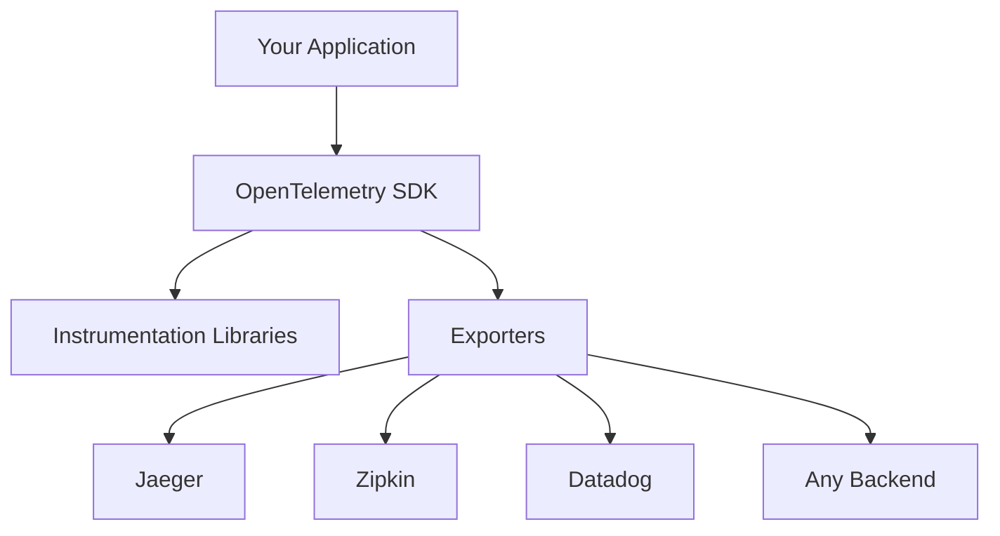

# OpenTelemetry Basics: Instrumenting Your First Service

## What is OpenTelemetry?

OpenTelemetry (OTel) is the industry standard for observability. Think of it as the "USB-C" of distributed tracing - a universal standard that works everywhere.

**The Promise**: Write your tracing code once, send it to any backend (Jaeger, Zipkin, Datadog, etc.).

## The OpenTelemetry Stack

### The Components



- **SDK**: Core tracing functionality
- **Instrumentation**: Automatic tracing for common libraries
- **Exporters**: Send traces to different backends

### The Mental Model

OpenTelemetry is like a universal translator:
- Your app speaks "business logic"
- OpenTelemetry speaks "tracing"
- Backends speak "vendor-specific formats"

## Setting Up Your First Traced Service

### Prerequisites

```bash
# Install Jaeger for visualization
docker run -d --name jaeger \
  -p 16686:16686 \
  -p 14268:14268 \
  jaegertracing/all-in-one:latest
```

### Creating a Simple Web Service

Let's create a basic e-commerce service with three endpoints:

```rust
// Cargo.toml
[dependencies]
tokio = { version = "1", features = ["full"] }
axum = "0.6"
opentelemetry = "0.18"
opentelemetry-jaeger = "0.17"
tracing = "0.1"
tracing-opentelemetry = "0.18"
tracing-subscriber = "0.3"
uuid = { version = "1.0", features = ["v4"] }
```

```rust
// src/main.rs
use axum::{
    extract::Path,
    http::StatusCode,
    response::Json,
    routing::get,
    Router,
};
use opentelemetry::global;
use opentelemetry_jaeger;
use std::collections::HashMap;
use tracing::{info, instrument};
use tracing_subscriber::layer::SubscriberExt;
use uuid::Uuid;

#[derive(serde::Serialize)]
struct Product {
    id: String,
    name: String,
    price: f64,
    stock: u32,
}

#[derive(serde::Serialize)]
struct Order {
    id: String,
    product_id: String,
    quantity: u32,
    total_price: f64,
}

#[tokio::main]
async fn main() {
    // Initialize tracing
    init_tracing();
    
    // Build the application
    let app = Router::new()
        .route("/products", get(get_products))
        .route("/products/:id", get(get_product))
        .route("/orders/:product_id/:quantity", get(create_order));
    
    // Run the server
    println!("Server running on http://localhost:3000");
    println!("View traces at http://localhost:16686");
    
    axum::Server::bind(&"0.0.0.0:3000".parse().unwrap())
        .serve(app.into_make_service())
        .await
        .unwrap();
}

fn init_tracing() {
    // Create a Jaeger exporter
    let tracer = opentelemetry_jaeger::new_pipeline()
        .with_service_name("e-commerce-service")
        .install_simple()
        .expect("Failed to install tracer");
    
    // Create a tracing layer with the tracer
    let opentelemetry_layer = tracing_opentelemetry::layer().with_tracer(tracer);
    
    // Create a subscriber with the OpenTelemetry layer
    let subscriber = tracing_subscriber::Registry::default()
        .with(opentelemetry_layer)
        .with(tracing_subscriber::fmt::layer());
    
    // Set the subscriber as the global default
    tracing::subscriber::set_global_default(subscriber)
        .expect("Failed to set subscriber");
}

#[instrument]
async fn get_products() -> Json<Vec<Product>> {
    info!("Fetching all products");
    
    // Simulate database query
    let products = fetch_products_from_database().await;
    
    Json(products)
}

#[instrument]
async fn get_product(Path(id): Path<String>) -> Result<Json<Product>, StatusCode> {
    info!("Fetching product with ID: {}", id);
    
    // Simulate database query
    let product = fetch_product_from_database(&id).await;
    
    match product {
        Some(p) => Ok(Json(p)),
        None => Err(StatusCode::NOT_FOUND),
    }
}

#[instrument]
async fn create_order(
    Path((product_id, quantity)): Path<(String, u32)>
) -> Result<Json<Order>, StatusCode> {
    info!("Creating order for product {} with quantity {}", product_id, quantity);
    
    // Check if product exists
    let product = fetch_product_from_database(&product_id).await;
    let product = match product {
        Some(p) => p,
        None => return Err(StatusCode::NOT_FOUND),
    };
    
    // Check stock
    if product.stock < quantity {
        return Err(StatusCode::BAD_REQUEST);
    }
    
    // Calculate total price
    let total_price = calculate_price(&product, quantity).await;
    
    // Create order
    let order = create_order_in_database(&product_id, quantity, total_price).await;
    
    Ok(Json(order))
}

#[instrument]
async fn fetch_products_from_database() -> Vec<Product> {
    info!("Querying products table");
    
    // Simulate database latency
    tokio::time::sleep(tokio::time::Duration::from_millis(50)).await;
    
    vec![
        Product {
            id: "1".to_string(),
            name: "Laptop".to_string(),
            price: 999.99,
            stock: 10,
        },
        Product {
            id: "2".to_string(),
            name: "Mouse".to_string(),
            price: 29.99,
            stock: 50,
        },
        Product {
            id: "3".to_string(),
            name: "Keyboard".to_string(),
            price: 79.99,
            stock: 25,
        },
    ]
}

#[instrument]
async fn fetch_product_from_database(id: &str) -> Option<Product> {
    info!("Querying product with ID: {}", id);
    
    // Simulate database latency
    tokio::time::sleep(tokio::time::Duration::from_millis(30)).await;
    
    let products = fetch_products_from_database().await;
    products.into_iter().find(|p| p.id == id)
}

#[instrument]
async fn calculate_price(product: &Product, quantity: u32) -> f64 {
    info!("Calculating price for {} units of {}", quantity, product.name);
    
    // Simulate complex pricing logic
    tokio::time::sleep(tokio::time::Duration::from_millis(20)).await;
    
    let base_price = product.price * quantity as f64;
    
    // Apply bulk discount
    let discount = if quantity >= 10 { 0.1 } else { 0.0 };
    
    base_price * (1.0 - discount)
}

#[instrument]
async fn create_order_in_database(
    product_id: &str,
    quantity: u32,
    total_price: f64,
) -> Order {
    info!("Inserting order into database");
    
    // Simulate database insert
    tokio::time::sleep(tokio::time::Duration::from_millis(40)).await;
    
    Order {
        id: Uuid::new_v4().to_string(),
        product_id: product_id.to_string(),
        quantity,
        total_price,
    }
}
```

## Running and Testing

### Start the Service

```bash
cargo run
```

### Test the Endpoints

```bash
# Get all products
curl http://localhost:3000/products

# Get specific product
curl http://localhost:3000/products/1

# Create an order
curl http://localhost:3000/orders/1/2
```

### View the Traces

1. Open http://localhost:16686 in your browser
2. Select "e-commerce-service" from the service dropdown
3. Click "Find Traces"
4. Click on any trace to see the details

## Understanding the Generated Traces

### Trace Structure

When you call `GET /orders/1/2`, you'll see a trace like:

```
Root Span: create_order (150ms)
├── Child Span: fetch_product_from_database (30ms)
│   └── Child Span: fetch_products_from_database (50ms)
├── Child Span: calculate_price (20ms)
└── Child Span: create_order_in_database (40ms)
```

### Span Details

Each span contains:
- **Operation Name**: The function name
- **Duration**: How long it took
- **Tags**: Key-value metadata
- **Logs**: Structured log events

## Key OpenTelemetry Concepts in Action

### Automatic Instrumentation

The `#[instrument]` macro automatically:
- Creates a span for each function
- Sets the span name to the function name
- Captures function parameters as tags
- Handles span start/finish timing

### Manual Instrumentation

For more control, you can create spans manually:

```rust
use tracing::{info, instrument, Span};

async fn complex_operation() {
    let span = tracing::info_span!("complex_operation");
    let _enter = span.enter();
    
    // Add custom tags
    span.record("user_id", &123);
    span.record("operation_type", &"batch_process");
    
    // Record events
    info!("Starting batch processing");
    
    // Simulate work
    tokio::time::sleep(tokio::time::Duration::from_millis(100)).await;
    
    info!("Batch processing complete");
}
```

### Context Propagation

OpenTelemetry handles context propagation automatically:
- HTTP headers are parsed for trace context
- New spans automatically become children of the current span
- Context is preserved across `await` boundaries

## Adding More Observability

### Custom Tags

```rust
#[instrument(fields(user_id = %user_id, order_type = "express"))]
async fn process_express_order(user_id: u64, items: Vec<Item>) {
    // Function implementation
}
```

### Error Handling

```rust
#[instrument(err)]
async fn risky_operation() -> Result<String, Box<dyn std::error::Error>> {
    // If this returns an error, it will be recorded in the span
    Ok("Success".to_string())
}
```

### Custom Metrics

```rust
use tracing::{info, instrument};

#[instrument]
async fn process_order() {
    // Record custom metrics
    info!(
        order_count = 1,
        order_value = 99.99,
        "Order processed successfully"
    );
}
```

## Best Practices

### 1. Instrument at Service Boundaries

Always instrument:
- HTTP handlers
- Database queries
- External API calls
- Message queue operations

### 2. Use Meaningful Span Names

```rust
// Good
#[instrument(name = "fetch_user_profile")]
async fn get_user(id: u64) -> User { ... }

// Bad
#[instrument(name = "db_query")]
async fn query(sql: &str) -> Vec<Row> { ... }
```

### 3. Add Contextual Information

```rust
#[instrument(fields(user_id = %user_id, action = "purchase"))]
async fn process_payment(user_id: u64, amount: f64) {
    // Implementation
}
```

### 4. Don't Over-Instrument

Avoid instrumenting:
- Pure functions without side effects
- Simple getters/setters
- Trivial operations

## Common Patterns

### Database Operations

```rust
#[instrument(fields(table = "users", operation = "select"))]
async fn fetch_user(id: u64) -> Option<User> {
    // Database query
}
```

### External API Calls

```rust
#[instrument(fields(service = "payment_gateway", endpoint = "/charge"))]
async fn charge_credit_card(amount: f64) -> Result<PaymentResult, Error> {
    // API call
}
```

### Background Jobs

```rust
#[instrument(fields(job_type = "email_batch", batch_size = batch.len()))]
async fn process_email_batch(batch: Vec<Email>) {
    // Job processing
}
```

## Troubleshooting

### Common Issues

1. **No traces appearing**: Check if Jaeger is running and accessible
2. **Spans not connected**: Ensure you're using `#[instrument]` on all functions
3. **Missing context**: Verify that HTTP headers are being propagated

### Debugging Tips

```rust
// Add more detailed logging
#[instrument(level = "debug", fields(important_field = %value))]
async fn debug_function(value: String) {
    tracing::debug!("Processing value: {}", value);
}
```

## What's Next?

This basic setup gives you:
- ✅ Automatic span creation
- ✅ Context propagation
- ✅ Jaeger integration
- ✅ Performance insights

In the next section, we'll explore sampling strategies to handle high-volume production systems.

---

*OpenTelemetry turns your application into a glass box. Every function call, every database query, every API call becomes visible and measurable.*