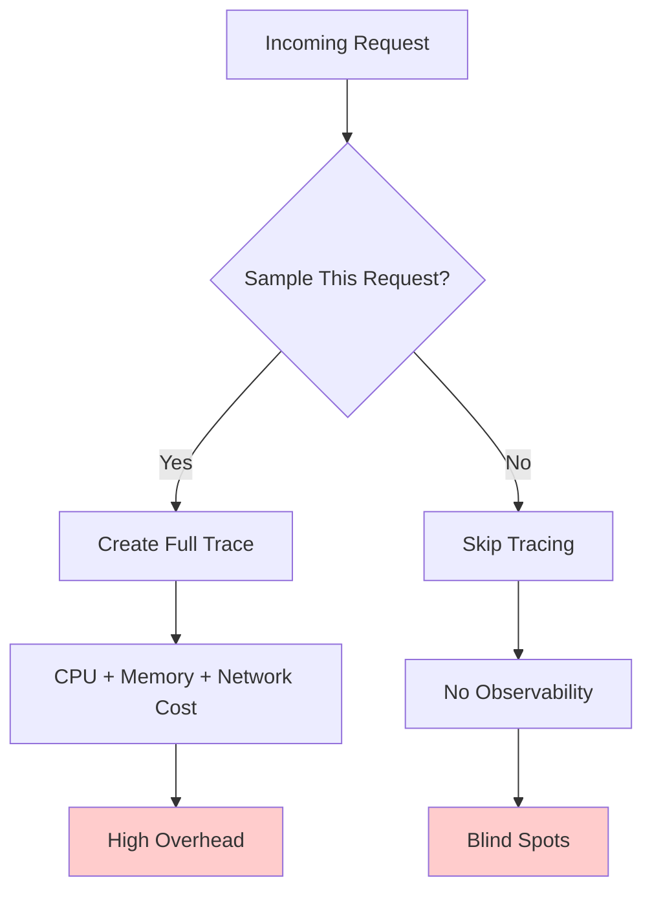
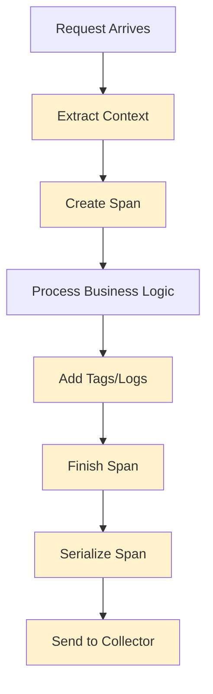
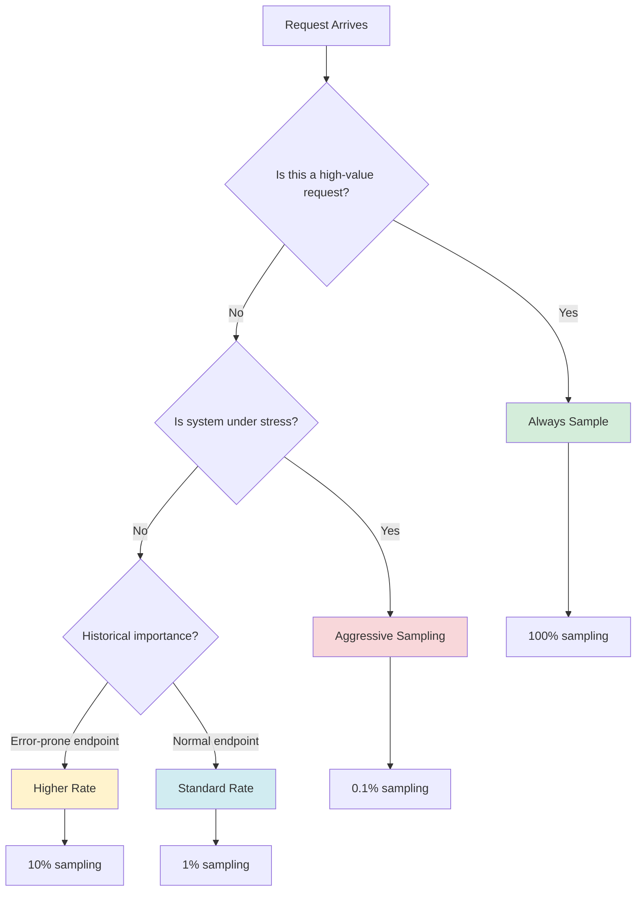
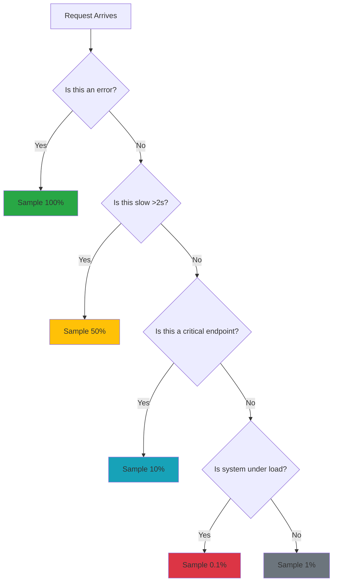

# Sampling and Performance: The Art of Selective Observation

## The Fundamental Trade-off

Distributed tracing gives you incredible visibility, but it comes with a cost. Every trace you collect requires:

- **CPU cycles** to create and manage spans
- **Memory** to store span data before transmission
- **Network bandwidth** to send traces to collectors
- **Storage space** to persist trace data
- **Query resources** to analyze traces

The challenge: How do you get the observability you need without crushing your system's performance?

**Answer**: Smart sampling strategies.

## The Sampling Dilemma



## Sampling Strategies

### 1. Head-Based Sampling (Decided at Request Start)

#### Probabilistic Sampling
The simplest approach: sample a fixed percentage of requests.

```go
type ProbabilisticSampler struct {
    rate float64
}

func NewProbabilisticSampler(rate float64) *ProbabilisticSampler {
    return &ProbabilisticSampler{rate: rate}
}

func (s *ProbabilisticSampler) ShouldSample(traceID string) bool {
    // Convert trace ID to number and check if it falls within rate
    hash := hashTraceID(traceID)
    return (hash % 100) < int(s.rate * 100)
}

// Usage: Sample 10% of requests
sampler := NewProbabilisticSampler(0.1)
if sampler.ShouldSample(traceID) {
    // Create and collect spans
}
```

**Pros**: Simple, predictable overhead
**Cons**: Might miss important errors, doesn't adapt to conditions

#### Rate-Limited Sampling
Ensure you never exceed a certain number of traces per second.

```go
type RateLimitedSampler struct {
    maxTracesPerSecond int
    currentWindow      int64
    tracesInWindow     int
    mutex              sync.Mutex
}

func (s *RateLimitedSampler) ShouldSample(traceID string) bool {
    s.mutex.Lock()
    defer s.mutex.Unlock()
    
    currentWindow := time.Now().Unix()
    
    // Reset counter if we're in a new window
    if currentWindow != s.currentWindow {
        s.currentWindow = currentWindow
        s.tracesInWindow = 0
    }
    
    // Check if we're under the limit
    if s.tracesInWindow < s.maxTracesPerSecond {
        s.tracesInWindow++
        return true
    }
    
    return false
}
```

**Pros**: Bounded resource usage
**Cons**: Might reject important traces during high traffic

### 2. Tail-Based Sampling (Decided After Request Completion)

This is where it gets interesting. You collect basic information about all requests, then decide what to keep based on what actually happened.

```go
type TailBasedSampler struct {
    bufferSize     int
    flushInterval  time.Duration
    traceBuffer    map[string]*TraceDecision
    mutex          sync.RWMutex
}

type TraceDecision struct {
    spans       []Span
    hasError    bool
    duration    time.Duration
    isInteresting bool
}

func (s *TailBasedSampler) CollectSpan(span Span) {
    s.mutex.Lock()
    defer s.mutex.Unlock()
    
    traceID := span.TraceID
    
    decision, exists := s.traceBuffer[traceID]
    if !exists {
        decision = &TraceDecision{
            spans: make([]Span, 0),
        }
        s.traceBuffer[traceID] = decision
    }
    
    decision.spans = append(decision.spans, span)
    
    // Update decision criteria
    if span.Status.Code != 0 {
        decision.hasError = true
    }
    
    if span.Duration > 5*time.Second {
        decision.isInteresting = true
    }
}

func (s *TailBasedSampler) ShouldKeepTrace(traceID string) bool {
    s.mutex.RLock()
    defer s.mutex.RUnlock()
    
    decision, exists := s.traceBuffer[traceID]
    if !exists {
        return false
    }
    
    // Always keep traces with errors
    if decision.hasError {
        return true
    }
    
    // Keep slow traces
    if decision.isInteresting {
        return true
    }
    
    // Sample 1% of normal traces
    return hashTraceID(traceID) % 100 < 1
}
```

**Pros**: Keeps all errors and slow requests, intelligent sampling
**Cons**: Requires buffering, more complex, delayed decisions

### 3. Adaptive Sampling

The most sophisticated approach: adjust sampling rates based on current conditions.

```go
type AdaptiveSampler struct {
    targetTPS      int // Target traces per second
    currentRate    float64
    windowSize     time.Duration
    measurements   []Measurement
    mutex          sync.RWMutex
}

type Measurement struct {
    timestamp  time.Time
    actualTPS  int
    sampledTPS int
}

func (s *AdaptiveSampler) adjustSamplingRate() {
    s.mutex.Lock()
    defer s.mutex.Unlock()
    
    if len(s.measurements) < 2 {
        return
    }
    
    latest := s.measurements[len(s.measurements)-1]
    
    // If we're collecting too many traces, decrease rate
    if latest.sampledTPS > s.targetTPS {
        s.currentRate *= 0.9
    }
    
    // If we're collecting too few traces, increase rate
    if latest.sampledTPS < s.targetTPS {
        s.currentRate *= 1.1
    }
    
    // Keep rate within bounds
    if s.currentRate > 1.0 {
        s.currentRate = 1.0
    }
    if s.currentRate < 0.001 {
        s.currentRate = 0.001
    }
}

func (s *AdaptiveSampler) ShouldSample(traceID string) bool {
    s.mutex.RLock()
    rate := s.currentRate
    s.mutex.RUnlock()
    
    return (hashTraceID(traceID) % 1000) < int(rate * 1000)
}
```

**Pros**: Automatically adapts to traffic patterns
**Cons**: Complex to implement and tune

## Performance Impact Analysis

### CPU Overhead



**Baseline Performance** (No tracing): 100%
**With Basic Tracing**: 95-98%
**With Heavy Instrumentation**: 80-90%

### Memory Overhead

```go
// Memory usage per span (approximate)
type SpanMemoryFootprint struct {
    TraceID       string            // ~32 bytes
    SpanID        string            // ~16 bytes
    ParentSpanID  string            // ~16 bytes
    OperationName string            // ~50 bytes average
    Tags          map[string]string // ~200 bytes average
    Logs          []SpanLog         // ~500 bytes average
    Timestamps    [2]time.Time      // ~24 bytes
    
    // Total: ~838 bytes per span
}
```

**Memory per trace**: 838 bytes × average spans per trace
**For 10,000 RPS with 5 spans per trace**: ~40MB/second

### Network Overhead

```go
// Network bandwidth calculation
func calculateNetworkOverhead(rps int, spansPerTrace int, avgSpanSize int) int {
    bytesPerSecond := rps * spansPerTrace * avgSpanSize
    return bytesPerSecond // bytes/second
}

// Example: 1000 RPS, 5 spans/trace, 1KB/span = 5MB/second
```

## Sampling Decision Framework



## Advanced Sampling Techniques

### 1. Stratified Sampling

Different sampling rates for different types of requests:

```go
type StratifiedSampler struct {
    rules []SamplingRule
}

type SamplingRule struct {
    condition func(request *http.Request) bool
    rate      float64
}

func NewStratifiedSampler() *StratifiedSampler {
    return &StratifiedSampler{
        rules: []SamplingRule{
            // Always sample errors
            {
                condition: func(r *http.Request) bool {
                    return r.Header.Get("Expected-Error") != ""
                },
                rate: 1.0,
            },
            // Heavy sampling for payment endpoints
            {
                condition: func(r *http.Request) bool {
                    return strings.Contains(r.URL.Path, "/payment")
                },
                rate: 0.5,
            },
            // Light sampling for health checks
            {
                condition: func(r *http.Request) bool {
                    return r.URL.Path == "/health"
                },
                rate: 0.001,
            },
            // Default rate for everything else
            {
                condition: func(r *http.Request) bool { return true },
                rate: 0.1,
            },
        },
    }
}

func (s *StratifiedSampler) ShouldSample(request *http.Request, traceID string) bool {
    for _, rule := range s.rules {
        if rule.condition(request) {
            return (hashTraceID(traceID) % 1000) < int(rule.rate * 1000)
        }
    }
    return false
}
```

### 2. Priority-Based Sampling

Keep traces that matter most:

```go
type PriorityBasedSampler struct {
    highPriorityRate   float64
    mediumPriorityRate float64
    lowPriorityRate    float64
}

func (s *PriorityBasedSampler) GetPriority(span Span) Priority {
    // High priority: errors, slow requests, important users
    if span.Status.Code != 0 {
        return HighPriority
    }
    
    if span.Duration > 2*time.Second {
        return HighPriority
    }
    
    if span.Tags["user.tier"] == "premium" {
        return HighPriority
    }
    
    // Medium priority: authentication, payments
    if strings.Contains(span.OperationName, "auth") {
        return MediumPriority
    }
    
    if strings.Contains(span.OperationName, "payment") {
        return MediumPriority
    }
    
    return LowPriority
}
```

### 3. Reservoir Sampling

Keep a representative sample even when you don't know the total volume:

```go
type ReservoirSampler struct {
    reservoir []string // Store trace IDs
    size      int
    seen      int
    mutex     sync.Mutex
}

func (s *ReservoirSampler) ShouldSample(traceID string) bool {
    s.mutex.Lock()
    defer s.mutex.Unlock()
    
    s.seen++
    
    if len(s.reservoir) < s.size {
        s.reservoir = append(s.reservoir, traceID)
        return true
    }
    
    // Replace random item with probability k/n
    j := rand.Intn(s.seen)
    if j < s.size {
        s.reservoir[j] = traceID
        return true
    }
    
    return false
}
```

## Performance Optimization Techniques

### 1. Batch Span Transmission

```go
type BatchingCollector struct {
    spans       []Span
    batchSize   int
    flushTimer  *time.Timer
    mutex       sync.Mutex
}

func (c *BatchingCollector) Collect(span Span) {
    c.mutex.Lock()
    defer c.mutex.Unlock()
    
    c.spans = append(c.spans, span)
    
    if len(c.spans) >= c.batchSize {
        c.flush()
    }
}

func (c *BatchingCollector) flush() {
    if len(c.spans) == 0 {
        return
    }
    
    // Send batch to collector
    go c.sendBatch(c.spans)
    
    // Reset buffer
    c.spans = make([]Span, 0, c.batchSize)
}
```

### 2. Async Span Processing

```go
type AsyncCollector struct {
    spanChan chan Span
    workers  int
}

func NewAsyncCollector(workers int) *AsyncCollector {
    c := &AsyncCollector{
        spanChan: make(chan Span, 1000),
        workers:  workers,
    }
    
    // Start worker goroutines
    for i := 0; i < workers; i++ {
        go c.worker()
    }
    
    return c
}

func (c *AsyncCollector) Collect(span Span) {
    select {
    case c.spanChan <- span:
        // Span queued successfully
    default:
        // Channel full, drop span
        // This prevents blocking the main request
    }
}

func (c *AsyncCollector) worker() {
    for span := range c.spanChan {
        // Process span asynchronously
        c.processSpan(span)
    }
}
```

### 3. Memory Pool for Spans

```go
type SpanPool struct {
    pool sync.Pool
}

func NewSpanPool() *SpanPool {
    return &SpanPool{
        pool: sync.Pool{
            New: func() interface{} {
                return &Span{
                    Tags: make(map[string]string),
                    Logs: make([]SpanLog, 0),
                }
            },
        },
    }
}

func (p *SpanPool) Get() *Span {
    return p.pool.Get().(*Span)
}

func (p *SpanPool) Put(span *Span) {
    // Reset span
    span.TraceID = ""
    span.SpanID = ""
    span.ParentSpanID = ""
    span.OperationName = ""
    span.Tags = make(map[string]string)
    span.Logs = span.Logs[:0]
    
    p.pool.Put(span)
}
```

## Real-World Sampling Configuration

### Netflix's Approach
- **99.9% sampling** for error traces
- **10% sampling** for slow traces (>2s)
- **1% sampling** for normal traces
- **0.1% sampling** for health checks

### Uber's Strategy
- **Adaptive sampling** based on service importance
- **Per-operation sampling** rates
- **Emergency sampling** during incidents

### Google's Method
- **Probabilistic sampling** with service-specific rates
- **Debug sampling** for development
- **Production sampling** optimized for cost

## The Sampling Decision Tree



## Monitoring Your Sampling

You need to monitor your sampling strategy itself:

```go
type SamplingMetrics struct {
    totalRequests    int64
    sampledRequests  int64
    droppedSpans     int64
    bufferOverflows  int64
}

func (m *SamplingMetrics) RecordSample(sampled bool) {
    atomic.AddInt64(&m.totalRequests, 1)
    if sampled {
        atomic.AddInt64(&m.sampledRequests, 1)
    }
}

func (m *SamplingMetrics) GetSamplingRate() float64 {
    total := atomic.LoadInt64(&m.totalRequests)
    sampled := atomic.LoadInt64(&m.sampledRequests)
    
    if total == 0 {
        return 0
    }
    
    return float64(sampled) / float64(total)
}
```

## The Bottom Line

Sampling is not just a technical decision—it's a business decision:

- **Higher sampling rates** = Better observability, Higher costs
- **Lower sampling rates** = Lower costs, Potential blind spots
- **Smart sampling** = Optimal balance, Requires investment in tooling

The key is to sample intelligently: keep what matters, discard what doesn't, and adjust based on conditions.

---

*Sampling is the art of selective observation. The goal isn't to see everything—it's to see what matters, when it matters, without breaking the bank.*