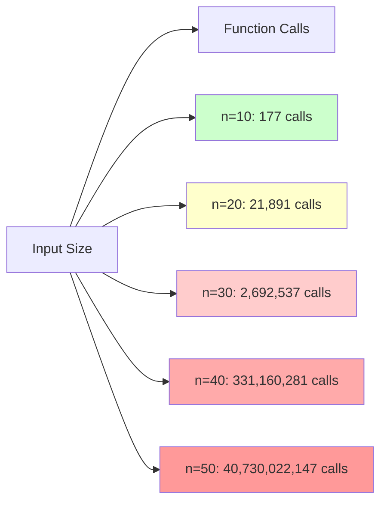
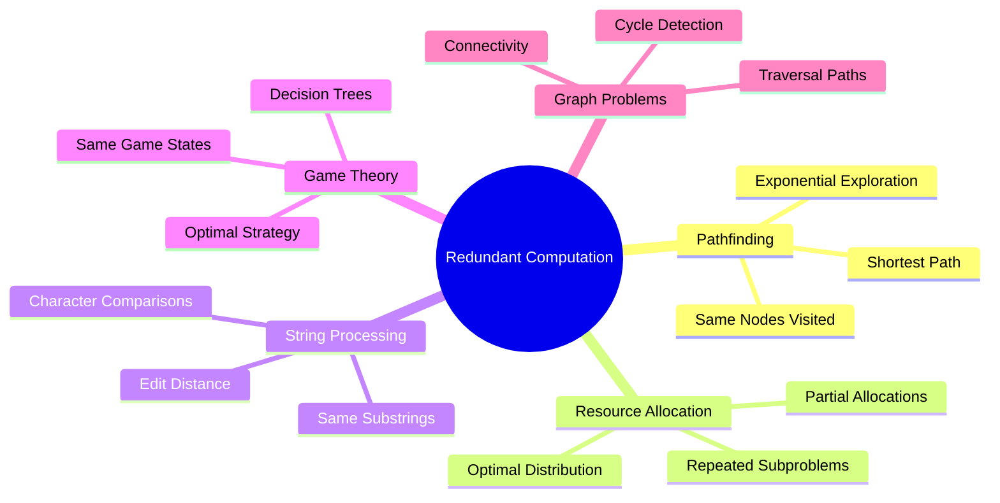
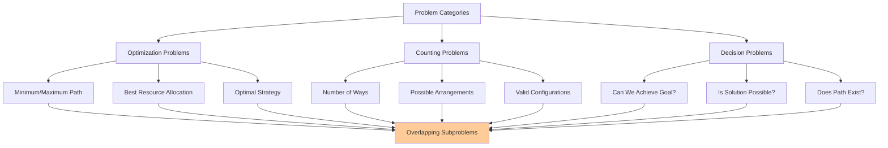

# The Core Problem: Redundant Computation in Recursive Solutions

Imagine you're tasked with calculating the 45th Fibonacci number. You write the classic recursive solution:

```rust
fn fibonacci(n: u32) -> u64 {
    if n <= 1 {
        n as u64
    } else {
        fibonacci(n - 1) + fibonacci(n - 2)
    }
}
```

This looks elegant and mathematically correct. But when you run `fibonacci(45)`, something strange happens: your computer starts working... and working... and working. What should be a simple calculation takes several seconds.

**What's really happening here?**

The recursive solution is performing an astronomical amount of redundant work. To calculate `fibonacci(45)`, it must first calculate `fibonacci(44)` and `fibonacci(43)`. But to calculate `fibonacci(44)`, it needs `fibonacci(43)` and `fibonacci(42)`. Notice that `fibonacci(43)` is computed twice.

```mermaid
graph TD
    A[fibonacci(5)] --> B[fibonacci(4)]
    A --> C[fibonacci(3)]
    
    B --> D[fibonacci(3)]
    B --> E[fibonacci(2)]
    
    C --> F[fibonacci(2)]
    C --> G[fibonacci(1)]
    
    D --> H[fibonacci(2)]
    D --> I[fibonacci(1)]
    
    E --> J[fibonacci(1)]
    E --> K[fibonacci(0)]
    
    F --> L[fibonacci(1)]
    F --> M[fibonacci(0)]
    
    H --> N[fibonacci(1)]
    H --> O[fibonacci(0)]
    
    style D fill:#ffcc99
    style C fill:#ffcc99
    style F fill:#ccffcc
    style H fill:#ccffcc
    style E fill:#ccccff
```

This redundancy explodes exponentially. `fibonacci(43)` is computed thousands of times, `fibonacci(42)` is computed tens of thousands of times, and so on. The total number of function calls grows exponentially with n, making the algorithm O(2^n) - utterly impractical for anything beyond tiny inputs.



## The Universal Pattern

This problem isn't unique to Fibonacci. It appears everywhere in computer science:



- **Pathfinding**: "What's the shortest path from A to B?" Often involves exploring the same intermediate nodes repeatedly
- **Resource allocation**: "How do I optimally distribute limited resources?" Subproblems about partial allocations recur constantly
- **String processing**: "What's the edit distance between two strings?" Comparing the same substrings over and over
- **Game theory**: "What's the optimal strategy from this position?" The same game states are analyzed repeatedly



The fundamental issue is that **recursive solutions naturally model the problem structure, but they don't remember what they've already computed**.

## The Real-World Analogy

Think of this like researching a family tree. You want to know about your great-great-grandmother's siblings. Using the naive recursive approach is like:

1. Calling your grandmother to ask about her grandmother's siblings
2. Your grandmother calls her mother to ask about her grandmother's siblings
3. Your great-grandmother calls her mother to ask about her mother's siblings
4. And so on...

But here's the problem: your great-grandmother might have multiple children asking her the same question. She'll research the same information repeatedly, calling her mother multiple times with identical questions.

A smarter approach? Write down the answers the first time you research them. When the same question comes up again, just look at your notes.

## The Computational Cost

This redundancy isn't just inefficient - it's catastrophic. Problems that should take milliseconds take hours. Solutions that should handle inputs in the thousands choke on inputs in the tens.

```mermaid
graph LR
    A[Fibonacci Performance] --> B[Naive Recursive]
    A --> C[With Memoization]
    
    B --> B1[f(30): 1.3 seconds]
    B --> B2[f(40): 2.8 minutes]
    B --> B3[f(50): 24 hours]
    
    C --> C1[f(30): 0.001 seconds]
    C --> C2[f(40): 0.001 seconds]
    C --> C3[f(50): 0.001 seconds]
    
    style B1 fill:#ffcccc
    style B2 fill:#ff9999
    style B3 fill:#ff6666
    style C1 fill:#ccffcc
    style C2 fill:#ccffcc
    style C3 fill:#ccffcc
```

The exponential explosion means that adding just one more unit to your input can double the computation time. This creates a sharp cliff where your algorithm works fine for small inputs but becomes completely unusable for realistic problem sizes.

```mermaid
graph TD
    A[Algorithm Efficiency Cliff] --> B[Exponential Growth]
    A --> C[Linear Growth]
    
    B --> B1[O(2^n) - Catastrophic]
    B --> B2[Every +1 input doubles time]
    B --> B3[n=40: Hours]
    B --> B4[n=50: Days]
    
    C --> C1[O(n) - Manageable]
    C --> C2[Linear time increase]
    C --> C3[n=1000: Milliseconds]
    C --> C4[n=1000000: Seconds]
    
    style B1 fill:#ffcccc
    style B2 fill:#ffcccc
    style B3 fill:#ffcccc
    style B4 fill:#ffcccc
    style C1 fill:#ccffcc
    style C2 fill:#ccffcc
    style C3 fill:#ccffcc
    style C4 fill:#ccffcc
```

## The Promise of Dynamic Programming

Dynamic programming solves this by introducing a simple but powerful concept: **remember what you've already computed**. Instead of recalculating the same subproblems repeatedly, you store the results and reuse them.

This transforms exponential algorithms into polynomial ones - often turning O(2^n) into O(n) or O(n^2). The difference is night and day: problems that were computationally impossible become trivial.

The next section will explore how this simple idea - remembering previous results - forms the philosophical foundation of dynamic programming.