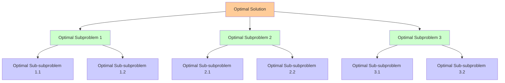
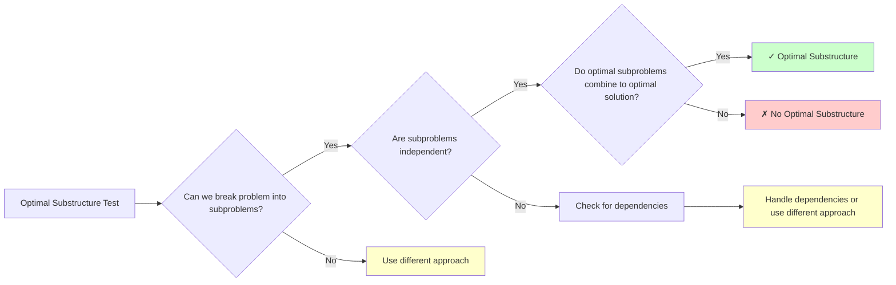

# The Guiding Philosophy: Optimal Substructure and Overlapping Subproblems

Dynamic programming rests on two fundamental principles that, when present together, create the perfect conditions for dramatic algorithmic improvement. Understanding these principles is crucial because they determine whether DP can be applied to a problem.

## Principle 1: Optimal Substructure

**The optimal solution to a problem contains optimal solutions to its subproblems.**

Think of this like building a house. If you want to build the best possible house, you need the best possible foundation, the best possible walls, and the best possible roof. You can't build an optimal house from suboptimal components.



In algorithmic terms, this means:
- The solution to the main problem depends on solutions to smaller problems
- If you solve each smaller problem optimally, combining them gives you the optimal solution to the main problem
- There's no "crosstalk" where solving one subproblem optimally makes another subproblem impossible to solve optimally



### Example: Shortest Path
Finding the shortest path from A to D through intermediate points B and C demonstrates optimal substructure:
- If the shortest A→D path goes A→B→C→D
- Then B→C must be the shortest path from B to C
- And C→D must be the shortest path from C to D

If there were a shorter path from B to C, you could substitute it and get a shorter overall path, contradicting the assumption that A→B→C→D was optimal.

### Counter-example: Longest Simple Path
Finding the longest simple path (no repeated vertices) does NOT have optimal substructure:
- The longest path from A to D might go A→B→C→D
- But the longest path from B to D might be B→E→F→D
- You can't combine these because they might share vertices, violating the "simple path" constraint

## Principle 2: Overlapping Subproblems

**The recursive solution contains the same subproblems multiple times.**

This is where the efficiency gain comes from. If every subproblem appeared only once, there would be no redundant computation to eliminate. But when subproblems recur, memoization transforms exponential algorithms into polynomial ones.

### The Fibonacci Example Revisited

```mermaid
graph TD
    A[fibonacci(5)] --> B[fibonacci(4)]
    A --> C[fibonacci(3)]
    
    B --> D[fibonacci(3)]
    B --> E[fibonacci(2)]
    
    C --> F[fibonacci(2)]
    C --> G[fibonacci(1)]
    
    D --> H[fibonacci(2)]
    D --> I[fibonacci(1)]
    
    E --> J[fibonacci(1)]
    E --> K[fibonacci(0)]
    
    F --> L[fibonacci(1)]
    F --> M[fibonacci(0)]
    
    H --> N[fibonacci(1)]
    H --> O[fibonacci(0)]
    
    P[Overlapping Subproblems] --> Q[fibonacci(3): Called 2 times]
    P --> R[fibonacci(2): Called 3 times]
    P --> S[fibonacci(1): Called 5 times]
    P --> T[fibonacci(0): Called 3 times]
    
    style D fill:#ffcc99
    style C fill:#ffcc99
    style F fill:#ccffcc
    style E fill:#ccffcc
    style H fill:#ccccff
    style Q fill:#ffcc99
    style R fill:#ccffcc
    style S fill:#ccccff
    style T fill:#ffffcc
```

```
fibonacci(5) calls:
├── fibonacci(4)
│   ├── fibonacci(3)
│   │   ├── fibonacci(2)
│   │   │   ├── fibonacci(1)
│   │   │   └── fibonacci(0)
│   │   └── fibonacci(1)
│   └── fibonacci(2)  ← Same as above!
│       ├── fibonacci(1)
│       └── fibonacci(0)
└── fibonacci(3)  ← Same as above!
    ├── fibonacci(2)
    │   ├── fibonacci(1)
    │   └── fibonacci(0)
    └── fibonacci(1)
```

Notice how `fibonacci(3)`, `fibonacci(2)`, `fibonacci(1)`, and `fibonacci(0)` are computed multiple times. The larger the input, the more redundant these computations become.

```mermaid
graph LR
    A[Subproblem Frequency] --> B[fibonacci(0): 3 times]
    A --> C[fibonacci(1): 5 times]
    A --> D[fibonacci(2): 3 times]
    A --> E[fibonacci(3): 2 times]
    
    F[Complexity Analysis] --> G[Each subproblem: O(1) work]
    F --> H[Total unique subproblems: n+1]
    F --> I[With memoization: O(n)]
    F --> J[Without memoization: O(2^n)]
    
    style B fill:#ccffcc
    style C fill:#ffffcc
    style D fill:#ffcccc
    style E fill:#ccccff
    style I fill:#ccffcc
    style J fill:#ffcccc
```

## The DP Philosophy in Practice

Dynamic programming's core insight is **trading space for time**. Instead of recomputing the same subproblems repeatedly, you:

1. **Solve each subproblem once**
2. **Store the result** (usually in a table or cache)
3. **Look up the result** when needed again

This transforms the time complexity from exponential to polynomial, typically at the cost of polynomial space complexity.

### The Memoization Approach (Top-Down)
Start with the recursive solution and add a cache:

```rust
use std::collections::HashMap;

fn fibonacci_memo(n: u32, memo: &mut HashMap<u32, u64>) -> u64 {
    if let Some(&result) = memo.get(&n) {
        return result;
    }
    
    let result = if n <= 1 {
        n as u64
    } else {
        fibonacci_memo(n - 1, memo) + fibonacci_memo(n - 2, memo)
    };
    
    memo.insert(n, result);
    result
}
```

### The Tabulation Approach (Bottom-Up)
Build the solution from the ground up:

```rust
fn fibonacci_tabulation(n: u32) -> u64 {
    if n <= 1 {
        return n as u64;
    }
    
    let mut dp = vec![0; (n + 1) as usize];
    dp[0] = 0;
    dp[1] = 1;
    
    for i in 2..=n {
        dp[i as usize] = dp[(i - 1) as usize] + dp[(i - 2) as usize];
    }
    
    dp[n as usize]
}
```

## The Design Trade-offs

Dynamic programming isn't free. It comes with trade-offs that shape when and how to use it:

### Space vs. Time
- **Benefit**: Dramatic time complexity improvements (often exponential to polynomial)
- **Cost**: Additional space complexity to store subproblem results
- **Decision**: Usually worth it, but consider memory constraints for very large problem spaces

### Simplicity vs. Efficiency
- **Benefit**: Massive performance gains
- **Cost**: Code becomes more complex, harder to understand than naive recursion
- **Decision**: Essential for problems where naive recursion is too slow

### Flexibility vs. Optimization
- **Top-down (memoization)**: More flexible, easier to implement, handles only needed subproblems
- **Bottom-up (tabulation)**: More efficient, better cache behavior, requires solving all subproblems

## When DP Doesn't Apply

Not every problem benefits from dynamic programming. DP is ineffective when:

1. **No optimal substructure**: The optimal solution doesn't decompose into optimal subproblems
2. **No overlapping subproblems**: Each subproblem appears only once (divide-and-conquer is better)
3. **Exponential state space**: Too many possible subproblems to store efficiently
4. **Greedy works**: Sometimes a greedy approach is simpler and equally optimal

## The Mental Model

Think of dynamic programming as **intelligent laziness**. Instead of working hard repeatedly on the same problems, you work smart by remembering what you've already figured out.

It's like having a personal assistant who:
- Keeps detailed notes on everything you've researched
- Instantly provides previous results when you ask the same question
- Ensures you never waste time on duplicate work

The next section will explore the key abstractions that make this philosophy concrete and actionable.