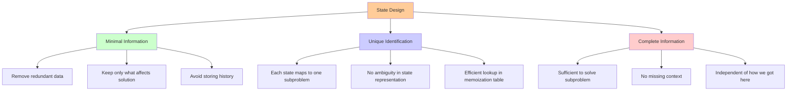

# Key Abstractions: State, Transitions, and the Memoization Table

Dynamic programming transforms abstract problems into concrete solutions through three fundamental abstractions. Understanding these abstractions is like learning the grammar of a new language - once you grasp them, you can express complex algorithmic ideas clearly and efficiently.

## Abstraction 1: State

**State represents the minimal information needed to solve a subproblem.**

Think of state as the "address" of a subproblem - it uniquely identifies what you're trying to compute. Just as every house has a unique address, every subproblem has a unique state.



### The Staircase Analogy
Imagine climbing a staircase where you can take 1 or 2 steps at a time. How many ways can you reach the top?

- **State**: Your current position (which step you're on)
- **Subproblem**: "How many ways can I reach the top from step i?"
- **Base cases**: 
  - Step 0: 1 way (you're already there)
  - Step 1: 1 way (take one step)

The state captures everything you need to know to solve the remaining problem. From step 5, you don't care how you got there - only that you're there and need to figure out how to reach the top.

### More Complex State Examples

```mermaid
graph TD
    A[State Examples] --> B[Knapsack Problem]
    A --> C[Edit Distance]
    A --> D[Grid Path]
    
    B --> B1[State: (item_index, remaining_weight)]
    B --> B2[Meaning: Max value from items onwards]
    B --> B3[Dimensions: n × W]
    
    C --> C1[State: (i, j) - string positions]
    C --> C2[Meaning: Min cost to transform A[0..i] to B[0..j]]
    C --> C3[Dimensions: m × n]
    
    D --> D1[State: (row, col)]
    D --> D2[Meaning: Paths from position to destination]
    D --> D3[Dimensions: rows × cols]
    
    style A fill:#ffcc99
    style B fill:#ccffcc
    style C fill:#ccccff
    style D fill:#ffcccc
```

**Knapsack Problem**: Given items with weights and values, maximize value within weight limit W
- **State**: `(item_index, remaining_weight)`
- **Meaning**: "What's the maximum value I can get from items `item_index` onwards with `remaining_weight` capacity?"

**Edit Distance**: Find minimum operations to transform string A into string B
- **State**: `(i, j)` where i is position in string A, j is position in string B
- **Meaning**: "What's the minimum cost to transform A[0..i] into B[0..j]?"

**Grid Path**: Count paths from top-left to bottom-right, moving only right or down
- **State**: `(row, col)`
- **Meaning**: "How many paths exist from position (row, col) to the destination?"

## Abstraction 2: Recurrence Relation

**The recurrence relation defines how the solution to a state depends on solutions to other states.**

This is the mathematical heart of dynamic programming. It expresses the optimal substructure property as a precise formula.

### The Staircase Recurrence
```
ways(n) = ways(n-1) + ways(n-2)
```

**Why this works**: To reach step n, you must come from either step n-1 (taking 1 step) or step n-2 (taking 2 steps). The total ways is the sum of ways to reach each predecessor.

### The Pattern Recognition
Most DP recurrences follow this pattern:
```
dp[state] = combine(dp[next_state₁], dp[next_state₂], ..., dp[next_stateₖ])
```

```mermaid
graph TD
    A[Recurrence Pattern] --> B[Counting Problems]
    A --> C[Optimization Problems]
    A --> D[Feasibility Problems]
    
    B --> B1[Combine: Sum]
    B --> B2[Example: ways(n) = ways(n-1) + ways(n-2)]
    B --> B3[Result: Number of paths/ways]
    
    C --> C1[Combine: Min/Max]
    C --> C2[Example: min_cost(n) = min(cost1, cost2, cost3)]
    C --> C3[Result: Optimal value]
    
    D --> D1[Combine: Boolean OR]
    D --> D2[Example: can_reach(n) = can_reach(n-1) OR can_reach(n-2)]
    D --> D3[Result: True/False]
    
    E[Common Patterns] --> F[Linear: dp[i] depends on dp[i-1], dp[i-2], ...]
    E --> G[Grid: dp[i][j] depends on dp[i-1][j], dp[i][j-1]]
    E --> H[Interval: dp[i][j] depends on dp[i][k], dp[k+1][j]]
    
    style A fill:#ffcc99
    style B fill:#ccffcc
    style C fill:#ccccff
    style D fill:#ffcccc
    style E fill:#ffffcc
```

Where `combine` is typically:
- **Sum**: For counting problems (number of ways, number of paths)
- **Min/Max**: For optimization problems (shortest path, maximum value)
- **Boolean OR**: For feasibility problems (can we achieve this goal?)

### Real-World Example: Coin Change
**Problem**: Given coins of denominations [1, 3, 4], find minimum coins to make amount n.

**State**: `amount` (how much money we need to make)
**Recurrence**: 
```
min_coins(amount) = 1 + min(
    min_coins(amount - 1),   // Use a 1-coin
    min_coins(amount - 3),   // Use a 3-coin
    min_coins(amount - 4)    // Use a 4-coin
)
```

The "+1" accounts for the coin we just used, and we take the minimum over all valid coin choices.

## Abstraction 3: The Memoization Table

**The memoization table stores computed results to avoid redundant calculation.**

Think of it as a smart cache that remembers every answer you've computed. The table's structure mirrors the state space - each possible state has a corresponding entry.

### Table Design Principles

**1. Indexing**: The table must be indexable by state
```rust
// For 1D state (like Fibonacci)
let mut memo: Vec<Option<u64>> = vec![None; n + 1];

// For 2D state (like grid paths)
let mut memo: Vec<Vec<Option<u64>>> = vec![vec![None; cols]; rows];

// For complex state (use HashMap)
use std::collections::HashMap;
let mut memo: HashMap<(usize, usize), u64> = HashMap::new();
```

**2. Initialization**: Mark uncomputed states clearly
```rust
// Using Option<T> for clarity
let mut memo: Vec<Option<u64>> = vec![None; n + 1];

// Using sentinel values (be careful with edge cases)
let mut memo: Vec<i32> = vec![-1; n + 1];
```

**3. Access Pattern**: Check before compute, store after compute
```rust
fn solve(state: usize, memo: &mut Vec<Option<u64>>) -> u64 {
    // Check if already computed
    if let Some(result) = memo[state] {
        return result;
    }
    
    // Compute the result
    let result = /* ... recurrence relation ... */;
    
    // Store and return
    memo[state] = Some(result);
    result
}
```

## Putting It All Together: The DP Template

Here's the universal template for dynamic programming solutions:

```rust
use std::collections::HashMap;

fn dp_solve(/* problem parameters */) -> /* result type */ {
    // 1. Initialize memoization table
    let mut memo = HashMap::new();
    
    // 2. Define the recursive function
    fn solve(state: /* state type */, memo: &mut HashMap</* state type */, /* result type */>) -> /* result type */ {
        // 3. Base cases
        if /* base case condition */ {
            return /* base case result */;
        }
        
        // 4. Check memoization table
        if let Some(result) = memo.get(&state) {
            return *result;
        }
        
        // 5. Compute using recurrence relation
        let result = /* combine results from subproblems */;
        
        // 6. Store in memoization table
        memo.insert(state, result);
        result
    }
    
    // 7. Call the recursive function with initial state
    solve(/* initial state */, &mut memo)
}
```

## State Design Guidelines

Designing the right state is often the hardest part of dynamic programming. Here are key guidelines:

### 1. Minimality
Include only information that affects the solution to remaining subproblems.

**Bad**: `(current_item, remaining_weight, items_taken_so_far)`
**Good**: `(current_item, remaining_weight)`

The specific items taken so far don't matter - only the current position and remaining capacity.

### 2. Completeness
Include all information needed to solve the subproblem independently.

**Bad**: `(i)` for edit distance (missing information about position in second string)
**Good**: `(i, j)` for edit distance (positions in both strings)

### 3. Discreteness
State space should be finite and enumerable.

**Bad**: Using floating-point numbers as state (infinite precision issues)
**Good**: Using integers or discrete categories

## The Mental Model: A Smart Notebook

Imagine you're a researcher working on a complex problem. You have a smart notebook that:

1. **Organizes by topic** (state): Each page is dedicated to a specific subproblem
2. **Shows dependencies** (recurrence): Each page explains how its answer depends on other pages
3. **Remembers everything** (memoization): Once you write an answer, you never need to recompute it

When you need to solve a new problem, you:
1. Check if you've already solved it (look in the notebook)
2. If not, break it down into simpler problems (follow the recurrence)
3. Solve the simpler problems (recursively, using the notebook)
4. Combine their solutions and write down the answer

This notebook transforms your exponential research time into linear time, because you never waste effort on duplicate work.

The next section will show you how to apply these abstractions to transform the inefficient recursive Fibonacci into an efficient dynamic programming solution.