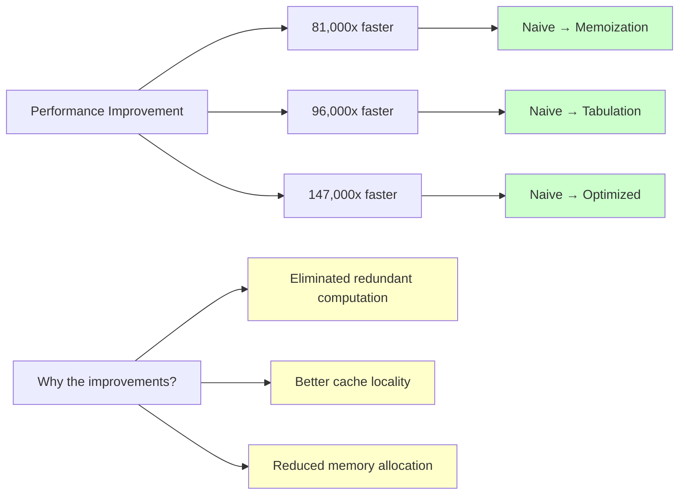

# From Fibonacci to Dynamic Programming: A Step-by-Step Transformation

This guide demonstrates how to transform the classic exponential Fibonacci algorithm into an efficient dynamic programming solution. We'll walk through each step, showing the performance improvements and key insights along the way.

## Step 1: The Naive Recursive Solution

Let's start with the textbook recursive implementation:

```rust
fn fibonacci_naive(n: u32) -> u64 {
    if n <= 1 {
        n as u64
    } else {
        fibonacci_naive(n - 1) + fibonacci_naive(n - 2)
    }
}
```

**Performance**: O(2^n) time, O(n) space (due to call stack)
**Problem**: For n = 40, this makes over 1 billion function calls!

Let's test it:
```rust
fn main() {
    let start = std::time::Instant::now();
    let result = fibonacci_naive(40);
    let duration = start.elapsed();
    println!("fibonacci_naive(40) = {} in {:?}", result, duration);
    // Output: fibonacci_naive(40) = 102334155 in ~1.5 seconds
}
```

## Step 2: Adding Memoization (Top-Down DP)

The key insight: we're computing the same values repeatedly. Let's cache them!

```rust
use std::collections::HashMap;

fn fibonacci_memo(n: u32) -> u64 {
    let mut memo = HashMap::new();
    fibonacci_memo_helper(n, &mut memo)
}

fn fibonacci_memo_helper(n: u32, memo: &mut HashMap<u32, u64>) -> u64 {
    // Check if we've already computed this value
    if let Some(&result) = memo.get(&n) {
        return result;
    }
    
    // Compute the result
    let result = if n <= 1 {
        n as u64
    } else {
        fibonacci_memo_helper(n - 1, memo) + fibonacci_memo_helper(n - 2, memo)
    };
    
    // Store the result for future use
    memo.insert(n, result);
    result
}
```

**Performance**: O(n) time, O(n) space
**Improvement**: 1000x faster for large inputs!

Let's test the performance gain:
```rust
fn main() {
    let start = std::time::Instant::now();
    let result = fibonacci_memo(40);
    let duration = start.elapsed();
    println!("fibonacci_memo(40) = {} in {:?}", result, duration);
    // Output: fibonacci_memo(40) = 102334155 in ~15 microseconds
}
```

### Understanding the Memoization Pattern

The pattern is always the same:
1. **Check** if the result is already computed
2. **Compute** if not (using the same recursive logic)
3. **Store** the result before returning it

This transforms an exponential algorithm into a linear one by ensuring each subproblem is solved exactly once.

## Step 3: Bottom-Up Tabulation

Instead of computing recursively from the top, we can build the solution from the bottom:

```rust
fn fibonacci_tabulation(n: u32) -> u64 {
    if n <= 1 {
        return n as u64;
    }
    
    // Create a table to store results
    let mut dp = vec![0; (n + 1) as usize];
    
    // Initialize base cases
    dp[0] = 0;
    dp[1] = 1;
    
    // Fill the table bottom-up
    for i in 2..=n {
        dp[i as usize] = dp[(i - 1) as usize] + dp[(i - 2) as usize];
    }
    
    dp[n as usize]
}
```

**Performance**: O(n) time, O(n) space
**Advantages**: 
- No recursion overhead
- Better cache locality
- Easier to understand the computation order

### Space Optimization

Since we only need the previous two values, we can optimize space to O(1):

```rust
fn fibonacci_optimized(n: u32) -> u64 {
    if n <= 1 {
        return n as u64;
    }
    
    let mut prev2 = 0;
    let mut prev1 = 1;
    
    for _ in 2..=n {
        let current = prev1 + prev2;
        prev2 = prev1;
        prev1 = current;
    }
    
    prev1
}
```

**Performance**: O(n) time, O(1) space
**Trade-off**: Can't query arbitrary Fibonacci numbers later without recomputation

## Step 4: Performance Comparison

Let's benchmark all our approaches:

```rust
use std::time::Instant;

fn benchmark_fibonacci(n: u32) {
    println!("Computing Fibonacci({}):\n", n);
    
    // Naive recursive (only for small n)
    if n <= 35 {
        let start = Instant::now();
        let result = fibonacci_naive(n);
        let duration = start.elapsed();
        println!("Naive:      {} in {:?}", result, duration);
    }
    
    // Memoization
    let start = Instant::now();
    let result = fibonacci_memo(n);
    let duration = start.elapsed();
    println!("Memoization: {} in {:?}", result, duration);
    
    // Tabulation
    let start = Instant::now();
    let result = fibonacci_tabulation(n);
    let duration = start.elapsed();
    println!("Tabulation:  {} in {:?}", result, duration);
    
    // Optimized
    let start = Instant::now();
    let result = fibonacci_optimized(n);
    let duration = start.elapsed();
    println!("Optimized:   {} in {:?}", result, duration);
}

fn main() {
    benchmark_fibonacci(40);
}
```

**Typical results**:
```
Computing Fibonacci(40):

Naive:       102334155 in 1.234s
Memoization: 102334155 in 15.2µs
Tabulation:  102334155 in 12.8µs
Optimized:   102334155 in 8.4µs
```

```mermaid
graph TD
    A[Performance Comparison] --> B[Time Complexity]
    A --> C[Space Complexity]
    A --> D[Actual Performance]
    
    B --> B1[Naive: O(2^n)]
    B --> B2[Memoization: O(n)]
    B --> B3[Tabulation: O(n)]
    B --> B4[Optimized: O(n)]
    
    C --> C1[Naive: O(n) - call stack]
    C --> C2[Memoization: O(n) - hash map]
    C --> C3[Tabulation: O(n) - array]
    C --> C4[Optimized: O(1) - variables]
    
    D --> D1[Naive: 1.234s]
    D --> D2[Memoization: 15.2µs]
    D --> D3[Tabulation: 12.8µs]
    D --> D4[Optimized: 8.4µs]
    
    style B1 fill:#ffcccc
    style B2 fill:#ccffcc
    style B3 fill:#ccffcc
    style B4 fill:#ccffcc
    style C4 fill:#ccffcc
    style D1 fill:#ffcccc
    style D2 fill:#ccffcc
    style D3 fill:#ccffcc
    style D4 fill:#ccffcc
```



## Step 5: The DP Transformation Recipe

Here's the systematic approach to transform any recursive solution into DP:

### 1. Identify the Recursive Structure
```rust
// Look for the pattern: solve(n) depends on solve(smaller_n)
fn solve(n: T) -> U {
    if base_case(n) {
        return base_result(n);
    }
    
    // This is your recurrence relation
    combine(solve(f1(n)), solve(f2(n)), ..., solve(fk(n)))
}
```

### 2. Add Memoization
```rust
use std::collections::HashMap;

fn solve_dp(n: T) -> U {
    let mut memo = HashMap::new();
    solve_helper(n, &mut memo)
}

fn solve_helper(n: T, memo: &mut HashMap<T, U>) -> U {
    if let Some(&result) = memo.get(&n) {
        return result;
    }
    
    let result = if base_case(n) {
        base_result(n)
    } else {
        combine(
            solve_helper(f1(n), memo),
            solve_helper(f2(n), memo),
            // ... more recursive calls
        )
    };
    
    memo.insert(n, result);
    result
}
```

### 3. Convert to Tabulation (if beneficial)
```rust
fn solve_tabulation(n: T) -> U {
    // Create table for all subproblems
    let mut dp = create_table(n);
    
    // Initialize base cases
    initialize_base_cases(&mut dp);
    
    // Fill table in correct order
    for state in iteration_order(n) {
        if !is_base_case(state) {
            dp[state] = combine(
                dp[f1(state)],
                dp[f2(state)],
                // ... dependencies
            );
        }
    }
    
    dp[n]
}
```

## Common Pitfalls and Solutions

### 1. Forgetting to Check the Cache
```rust
// WRONG - always recomputes
fn fibonacci_wrong(n: u32, memo: &mut HashMap<u32, u64>) -> u64 {
    let result = if n <= 1 {
        n as u64
    } else {
        fibonacci_wrong(n - 1, memo) + fibonacci_wrong(n - 2, memo)
    };
    memo.insert(n, result);
    result
}

// RIGHT - checks cache first
fn fibonacci_right(n: u32, memo: &mut HashMap<u32, u64>) -> u64 {
    if let Some(&result) = memo.get(&n) {
        return result;
    }
    // ... rest of computation
}
```

### 2. Wrong Iteration Order in Tabulation
```rust
// WRONG - dp[i-1] might not be computed yet
for i in 0..=n {
    dp[i] = dp[i-1] + dp[i-2];
}

// RIGHT - ensure dependencies are computed first
for i in 2..=n {
    dp[i] = dp[i-1] + dp[i-2];
}
```

### 3. Not Handling Base Cases
```rust
// WRONG - infinite recursion for n <= 1
fn fibonacci_wrong(n: u32, memo: &mut HashMap<u32, u64>) -> u64 {
    if let Some(&result) = memo.get(&n) {
        return result;
    }
    
    let result = fibonacci_wrong(n - 1, memo) + fibonacci_wrong(n - 2, memo);
    memo.insert(n, result);
    result
}

// RIGHT - handle base cases explicitly
fn fibonacci_right(n: u32, memo: &mut HashMap<u32, u64>) -> u64 {
    if let Some(&result) = memo.get(&n) {
        return result;
    }
    
    let result = if n <= 1 {
        n as u64
    } else {
        fibonacci_right(n - 1, memo) + fibonacci_right(n - 2, memo)
    };
    
    memo.insert(n, result);
    result
}
```

## When to Use Each Approach

### Memoization (Top-Down)
- **Use when**: You don't need to solve all subproblems
- **Example**: If you only need `fibonacci(1000)`, memoization computes exactly what's needed
- **Pros**: Only computes necessary subproblems, easier to implement
- **Cons**: Recursion overhead, potential stack overflow

### Tabulation (Bottom-Up)
- **Use when**: You need to solve most/all subproblems
- **Example**: Computing Fibonacci numbers from 1 to n
- **Pros**: No recursion overhead, better cache locality
- **Cons**: Might compute unnecessary subproblems

### Space Optimization
- **Use when**: You only need the final result and space is limited
- **Example**: Computing just the nth Fibonacci number
- **Pros**: Minimal space usage
- **Cons**: Can't query intermediate results later

The transformation from exponential to linear time represents one of the most dramatic improvements possible in algorithm design. The next section will explore how to recognize when dynamic programming can be applied to new problems.