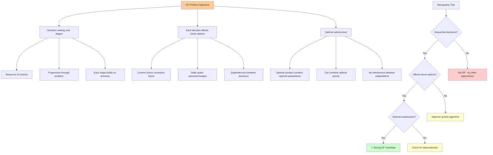

# Recognizing Dynamic Programming Problems: The Art of Pattern Recognition

The most challenging aspect of dynamic programming isn't implementing the solution - it's recognizing when DP applies and how to structure the problem. This guide develops your intuition for spotting DP opportunities and designing effective solutions.

## The DP Problem Signature

Dynamic programming problems have a distinctive "signature" - a set of characteristics that appear consistently across different domains. Learning to recognize this signature is like developing pattern recognition for a new language.



### The Three-Part Signature

1. **Decision-making over stages**: The problem involves making a sequence of decisions
2. **Each decision affects future options**: Current choices constrain or influence later possibilities  
3. **Optimal substructure**: The best overall solution incorporates best solutions to subproblems

### Example: The Coin Change Problem

**Problem**: Given coins of different denominations, what's the minimum number of coins needed to make a target amount?

**DP Signature Analysis**:
- **Stages**: For each amount from 0 to target
- **Decisions**: Which coin to use at each stage
- **Future impact**: Using a coin reduces the remaining amount we need to make
- **Optimal substructure**: The optimal solution for amount n uses the optimal solution for amount n-coin_value

## Pattern 1: Counting Problems

**Question pattern**: "How many ways can we...?"

These problems typically involve counting distinct paths, arrangements, or combinations.

```mermaid
graph TD
    A[Counting Problems] --> B[Staircase Problem]
    A --> C[Grid Paths]
    A --> D[Subset Sum Count]
    
    B --> B1[State: current_step]
    B --> B2[Recurrence: ways(n) = ways(n-1) + ways(n-2)]
    B --> B3[Base: ways(0)=1, ways(1)=1]
    
    C --> C1[State: (row, col)]
    C --> C2[Recurrence: paths(r,c) = paths(r-1,c) + paths(r,c-1)]
    C --> C3[Base: paths(0,0)=1]
    
    D --> D1[State: (index, remaining_sum)]
    D --> D2[Recurrence: count(i,s) = count(i-1,s) + count(i-1,s-arr[i])]
    D --> D3[Base: count(n,0)=1]
    
    E[Recognition Signals] --> F[Keywords: how many ways]
    E --> G[Recurrence: Addition]
    E --> H[Base cases: Usually 1]
    
    style A fill:#ffcc99
    style E fill:#ccffcc
    style F fill:#ccccff
    style G fill:#ccccff
    style H fill:#ccccff
```

### Classic Examples

**Staircase Problem**: How many ways to climb n stairs taking 1 or 2 steps at a time?
```
State: current_step
Recurrence: ways(n) = ways(n-1) + ways(n-2)
```

**Grid Paths**: How many paths from top-left to bottom-right moving only right/down?
```
State: (row, col)
Recurrence: paths(r,c) = paths(r-1,c) + paths(r,c-1)
```

**Subset Sum Count**: How many subsets sum to target value?
```
State: (index, remaining_sum)
Recurrence: count(i,s) = count(i-1,s) + count(i-1,s-arr[i])
```

### Recognition Signals
- Keywords: "how many ways", "number of paths", "count arrangements"
- Recurrence combines results by **addition**
- Base cases typically return 1 (one way to achieve the base condition)

## Pattern 2: Optimization Problems

**Question pattern**: "What's the maximum/minimum...?"

These problems seek the optimal value among all possible solutions.

### Classic Examples

**Knapsack Problem**: Maximum value within weight constraint
```
State: (item_index, remaining_weight)
Recurrence: max_value(i,w) = max(
    max_value(i-1, w),                    // skip item i
    value[i] + max_value(i-1, w-weight[i]) // take item i
)
```

**Maximum Subarray Sum**: Find contiguous subarray with largest sum
```
State: current_index
Recurrence: max_ending_here(i) = max(
    arr[i],                           // start new subarray
    arr[i] + max_ending_here(i-1)     // extend previous subarray
)
```

**Edit Distance**: Minimum operations to transform string A to string B
```
State: (i, j) - positions in strings A and B
Recurrence: edit_dist(i,j) = min(
    1 + edit_dist(i-1, j),     // delete from A
    1 + edit_dist(i, j-1),     // insert into A
    cost + edit_dist(i-1, j-1) // substitute (cost = 0 if A[i] == B[j])
)
```

### Recognition Signals
- Keywords: "maximum", "minimum", "optimal", "best"
- Recurrence combines results with **min/max**
- Often involves resource constraints or cost optimization

## Pattern 3: Feasibility Problems

**Question pattern**: "Is it possible to...?"

These problems determine whether a goal can be achieved.

### Classic Examples

**Subset Sum**: Can we select elements that sum to target?
```
State: (index, remaining_sum)
Recurrence: can_sum(i,s) = can_sum(i-1,s) || can_sum(i-1,s-arr[i])
```

**Word Break**: Can string be segmented into dictionary words?
```
State: starting_index
Recurrence: word_break(i) = any(
    word_break(i + len(word)) for word in dict if s[i:i+len(word)] == word
)
```

### Recognition Signals
- Keywords: "can we", "is it possible", "exists"
- Recurrence combines results with **logical OR**
- Base cases typically return true/false

## The State Design Process

Designing the right state representation is often the hardest part. Here's a systematic approach:

```mermaid
graph TD
    A[State Design Process] --> B[Step 1: Identify What Changes]
    A --> C[Step 2: Determine What Affects Future Decisions]
    A --> D[Step 3: Check for Minimal Representation]
    A --> E[Step 4: Verify Completeness]
    
    B --> B1[What information changes as we make decisions?]
    B --> B2[Variables that progress through problem]
    B --> B3[Parameters that get consumed/modified]
    
    C --> C1[What info needed for optimal future choices?]
    C --> C2[Dependencies between decisions]
    C --> C3[Context required for subproblems]
    
    D --> D1[Can we represent state with less info?]
    D --> D2[Remove redundant or derivable data]
    D --> D3[Avoid storing unnecessary history]
    
    E --> E1[Contains all info needed for subproblem?]
    E --> E2[Can solve independently of how we got here?]
    E --> E3[No missing context that affects solution?]
    
    F[Common Mistakes] --> G[Too much information - inefficient]
    F --> H[Too little information - incomplete]
    F --> I[Wrong level of abstraction]
    
    style A fill:#ffcc99
    style F fill:#ffcccc
    style G fill:#ffcccc
    style H fill:#ffcccc
    style I fill:#ffcccc
```



### Step 1: Identify What Changes
**Question**: What information changes as we make decisions?

**Example**: In knapsack, we progress through items and consume weight capacity.
**State candidates**: `(current_item, remaining_weight)`

### Step 2: Determine What Affects Future Decisions
**Question**: What information do we need to make optimal future choices?

**Example**: In knapsack, we need to know which items we haven't considered yet and how much weight capacity remains.
**State refinement**: `(current_item, remaining_weight)` is sufficient

### Step 3: Check for Minimal Representation
**Question**: Can we represent the state with less information?

**Example**: In Fibonacci, we only need the current position, not the entire sequence so far.
**State optimization**: `n` instead of `(n, previous_values)`

### Step 4: Verify Completeness
**Question**: Does the state contain all information needed to solve the subproblem independently?

**Example**: In edit distance, we need positions in both strings.
**State validation**: `(i, j)` is complete; `(i)` alone is insufficient

## Advanced Pattern Recognition

### Multi-dimensional State Spaces

Some problems require complex state representations:

**Longest Common Subsequence**: Find longest subsequence common to two strings
```
State: (i, j) - positions in both strings
Recurrence: lcs(i,j) = 
    if A[i] == B[j]: 1 + lcs(i-1, j-1)
    else: max(lcs(i-1, j), lcs(i, j-1))
```

**Stock Trading with Cooldown**: Maximum profit with cooldown period
```
State: (day, holding_stock, cooldown_status)
Recurrence: Complex transitions based on current state
```

### Interval/Range Problems

**Matrix Chain Multiplication**: Optimal parenthesization of matrix multiplication
```
State: (i, j) - range of matrices to multiply
Recurrence: min_cost(i,j) = min(
    min_cost(i,k) + min_cost(k+1,j) + cost(i,k,j)
    for k in range(i, j)
)
```

### Bitmask DP

**Traveling Salesman Problem**: Shortest route visiting all cities
```
State: (current_city, visited_cities_bitmask)
Recurrence: Explore unvisited cities from current position
```

## When DP Doesn't Apply

Learning when NOT to use DP is equally important:

### Greedy Algorithms Suffice
**Problem**: Activity selection (choose maximum non-overlapping activities)
**Why not DP**: Greedy choice (earliest end time) always leads to optimal solution
**Signal**: Local optimal choices don't affect global optimality

### Divide and Conquer is Better
**Problem**: Finding maximum element in array
**Why not DP**: No overlapping subproblems - each element examined once
**Signal**: Subproblems are independent with no reuse

### Exponential State Space
**Problem**: General game tree search
**Why not DP**: Too many possible game states to store efficiently
**Signal**: State space grows exponentially with problem size

## The Problem-Solving Workflow

Here's a systematic approach to tackle potential DP problems:

### Phase 1: Problem Analysis
1. **Identify the decision structure**: What choices do we make at each step?
2. **Check for optimal substructure**: Do optimal solutions contain optimal subsolutions?
3. **Look for overlapping subproblems**: Do the same subproblems appear multiple times?

### Phase 2: State Design
1. **List changing variables**: What changes as we make decisions?
2. **Determine dependencies**: What information affects future choices?
3. **Minimize state space**: Can we represent the state more compactly?

### Phase 3: Recurrence Formulation
1. **Define base cases**: What are the simplest subproblems?
2. **Express transitions**: How does the solution depend on subproblems?
3. **Verify correctness**: Does the recurrence capture the problem logic?

### Phase 4: Implementation Choice
1. **Memoization**: Top-down, computes only needed subproblems
2. **Tabulation**: Bottom-up, computes all subproblems systematically
3. **Space optimization**: Reduce memory usage if only recent results are needed

## Diagnostic Questions

When encountering a new problem, ask these questions:

### Structure Questions
- Are we making a sequence of decisions?
- Does each decision affect future options?
- Are we optimizing over these decisions?

### Subproblem Questions
- Can we break the problem into smaller similar problems?
- Do these smaller problems overlap?
- Can we solve the problem if we knew the answers to smaller problems?

### Efficiency Questions
- Does the naive recursive solution repeat work?
- Is the number of distinct subproblems polynomial?
- Would storing subproblem results help?

## Practice Problem Categories

To build pattern recognition skills, practice problems in these categories:

### Linear DP
- Fibonacci variants, climbing stairs, house robber
- Focus on 1D state spaces and simple recurrences

### 2D Grid DP
- Grid paths, minimum path sum, unique paths
- Focus on 2D state spaces and boundary conditions

### Knapsack Variants
- 0/1 knapsack, unbounded knapsack, partition problems
- Focus on constraint satisfaction and resource optimization

### String DP
- Edit distance, longest common subsequence, palindrome problems
- Focus on multi-string state spaces and character matching

### Interval DP
- Matrix chain multiplication, burst balloons, palindrome partitioning
- Focus on range-based state spaces and optimal splitting

Mastering these patterns will develop your intuition for recognizing when and how to apply dynamic programming to new problems. The key is building a mental library of common structures and solution approaches.