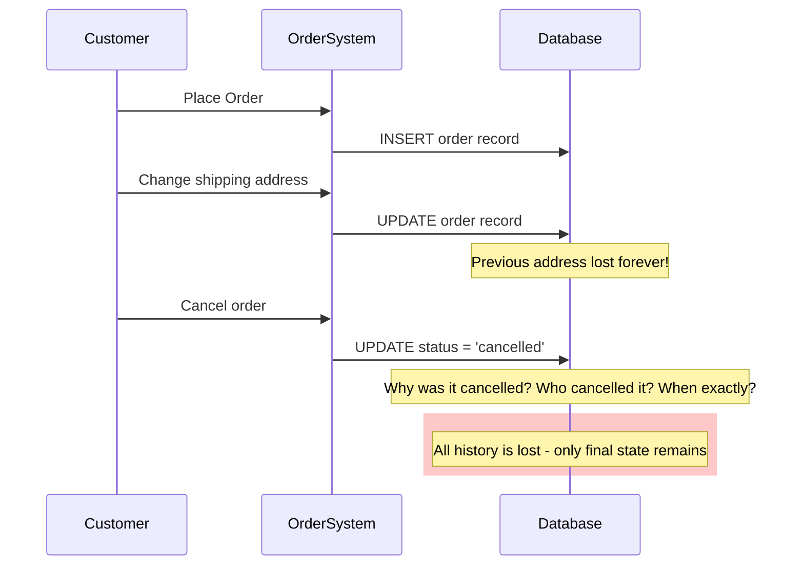
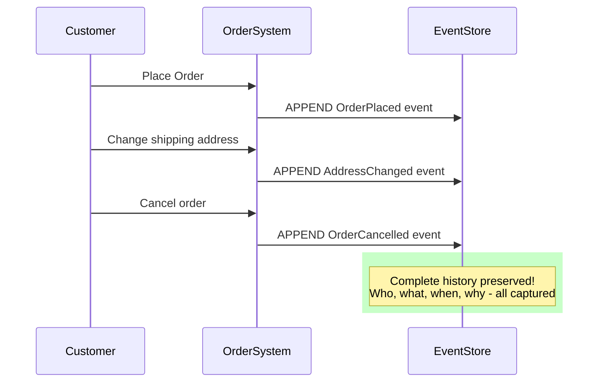

# The Core Problem: Losing the Story Behind the Data

## The CRUD Amnesia

In traditional CRUD (Create, Read, Update, Delete) systems, we only store the current state of our data. Imagine your bank account: you see your current balance, but the history—every deposit, withdrawal, transfer—that led to this balance is gone forever.

This creates fundamental problems:

### 1. Lost Business Intelligence
When a customer's order status changes from "pending" to "cancelled," we lose crucial information:
- *Why* was it cancelled?
- *When* exactly did it happen?
- *Who* initiated the cancellation?
- What was the sequence of events leading to this decision?

### 2. Audit Trail Nightmares
Compliance and debugging become impossible when you can't reconstruct what happened. Traditional systems often bolt-on audit logs as an afterthought, but these are disconnected from the core business logic.

### 3. Data Corruption Without Recovery
In CRUD systems, an UPDATE operation is destructive. Once you've overwritten data, the previous state is gone. If the update was incorrect or malicious, you've lost your source of truth forever.

### 4. Concurrent Modification Chaos
Two users editing the same record simultaneously creates a "last writer wins" scenario. The earlier changes are silently discarded, and there's no way to reconcile or even detect this loss.

## The Root Cause: State-Centric Thinking

Traditional systems focus on *what the data looks like now* rather than *how it got that way*. This is like judging a movie by its final frame—you miss the entire story that led to that moment.

Consider an e-commerce order:

```
CRUD Approach:
Order { id: 123, status: "shipped", total: 99.99, items: [...] }
```

But this tells us nothing about the journey:
- Was it initially placed for a different amount?
- Were items added or removed?
- How many times was the shipping address changed?
- What payment attempts failed before success?

## The Real World Doesn't Work This Way

In the physical world, events are immutable facts:
- A package was shipped at 2:30 PM
- A payment was received on Tuesday
- An item was returned with reason "defective"

These are historical facts that cannot be "updated" or "deleted"—they happened. Our data systems should reflect this immutable nature of reality.



## The Promise of a Better Way

What if instead of storing the final state, we stored every meaningful event that occurred? What if our database was less like a snapshot and more like a detailed journal?



This is the core insight of Event Sourcing: capture the story, not just the ending.

## The Mental Shift: From Nouns to Verbs

Traditional systems think in terms of **entities and their current state**:
- "An order with status 'shipped'"
- "A user with email 'john@example.com'"
- "An account with balance $1,500"

Event Sourcing thinks in terms of **actions and their consequences**:
- "An order was placed, then items were added, then payment was processed, then it was shipped"
- "A user registered, then changed their email twice, then verified their account"
- "An account was opened with $1,000, then $300 was deposited, then $200 was withdrawn"

This shift from nouns to verbs, from states to events, fundamentally changes how we model and understand our systems.