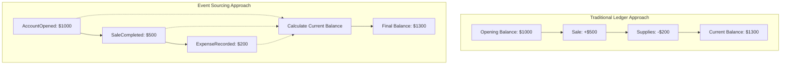
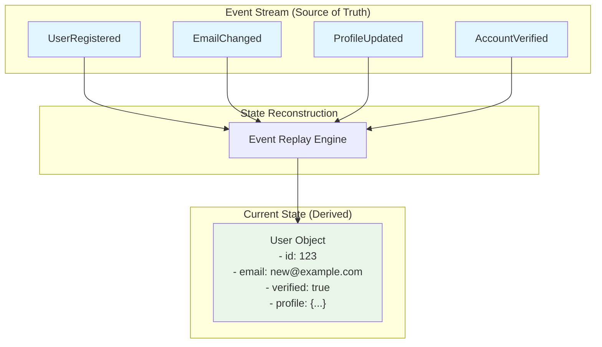
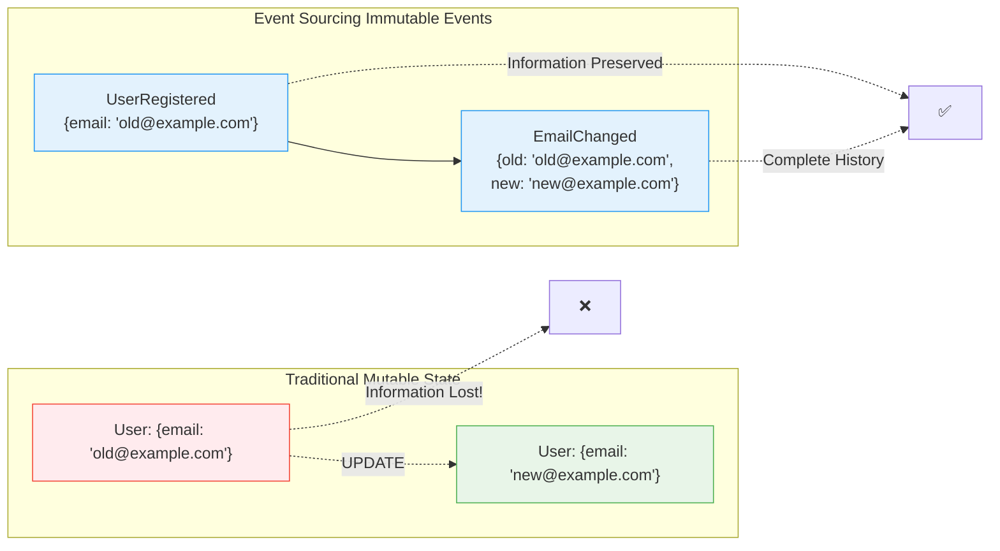

# The Guiding Philosophy: Events as the Source of Truth

## The Fundamental Shift

Event Sourcing represents a philosophical shift from storing *what is* to storing *what happened*. Instead of maintaining the current state of your application, you maintain the complete history of every change as a sequence of immutable events.

Think of it this way: rather than taking a single photograph of your life today, you're keeping a detailed diary of every significant moment. The "current you" can be reconstructed by reading through all the diary entries.

## Core Principles

### 1. Events Are Immutable Facts
Once an event has occurred, it becomes a historical fact that cannot be changed:

```
✅ Correct: "OrderPlaced" event with timestamp 2024-01-15T10:30:00Z
❌ Wrong: Updating an order's placement time
```

If you need to "correct" something, you add a new event (like `OrderCorrected`) rather than modifying the original.

### 2. Current State Is Derived, Not Stored
The application's current state is calculated by replaying all relevant events:

```
Events: [OrderPlaced, ItemAdded, ItemAdded, ItemRemoved, OrderShipped]
Current State: Order with 2 items, status "shipped"
```

This is like calculating your bank balance by adding up all deposits and subtracting all withdrawals from the beginning of time.

### 3. The Event Stream Is the Single Source of Truth
Your event store becomes the authoritative record of everything that has happened. Traditional databases become "views" or "projections" derived from this event stream.

## The Mental Model: A Business Journal

Imagine running a traditional business with a paper ledger. You never erase entries—you only add new ones. To know your current cash position, you'd add up all the credits and subtract all the debits from the beginning.



Event Sourcing applies this time-tested accounting principle to software:

### Traditional Ledger
```
Date       | Description      | Credit | Debit | Balance
2024-01-01 | Opening Balance  |        |       | $1000
2024-01-02 | Sale             | $500   |       | $1500
2024-01-03 | Supplies         |        | $200  | $1300
```

### Event-Sourced System
```
Event: AccountOpened    | Amount: $1000 | Timestamp: 2024-01-01
Event: SaleCompleted    | Amount: $500  | Timestamp: 2024-01-02
Event: ExpenseRecorded  | Amount: $200  | Timestamp: 2024-01-03
```

## Why This Philosophy Matters

### 1. Perfect Audit Trail
Every change is recorded with full context—who, what, when, and why. No external audit log needed.

### 2. Time Travel Debugging
Need to see what your application state was at 3:47 PM last Tuesday? Just replay events up to that timestamp.

### 3. Business Intelligence Goldmine
Your event stream becomes a rich source of business analytics. You can answer questions like:
- How do customer behaviors change seasonally?
- What sequence of events typically leads to cancellations?
- Which features are most/least used?

### 4. Natural Scalability
Different parts of your system can maintain their own projections optimized for their specific needs.

## The Trade-offs

This philosophy isn't without costs:

- **Storage**: You're keeping more data (every event vs. just current state)
- **Complexity**: Reading requires event replay instead of simple queries
- **Eventual Consistency**: Projections may lag behind the event stream

But for many systems, these trade-offs are worth the benefits of having a complete, immutable history of your application's evolution.

## The Event-First Mindset

Once you embrace this philosophy, you start thinking differently about your domain:
- Instead of "updating a user's email," you "record that the user changed their email"
- Instead of "deleting an order," you "record that the order was cancelled"
- Instead of "modifying inventory," you "record that items were consumed or restocked"

This event-first mindset often leads to richer, more accurate domain models that better reflect the real-world processes they represent.

## The Flow of Truth: How Events Become State



The key insight: **state is always derivative**. Events are the fundamental truth, and state is just a convenient snapshot calculated from those events.

## Immutability: The Foundation of Trust

Once an event is recorded, it becomes an immutable historical fact. This immutability provides several guarantees:



- **Auditability**: Every change is tracked with full context
- **Reproducibility**: System state at any point in time can be recreated
- **Debuggability**: Issues can be traced back to their root cause
- **Compliance**: Regulatory requirements for data retention are naturally satisfied