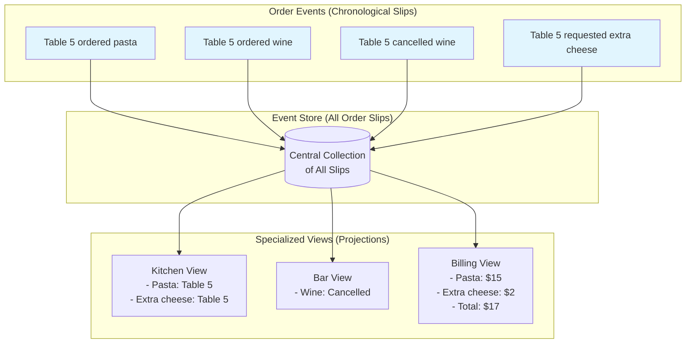
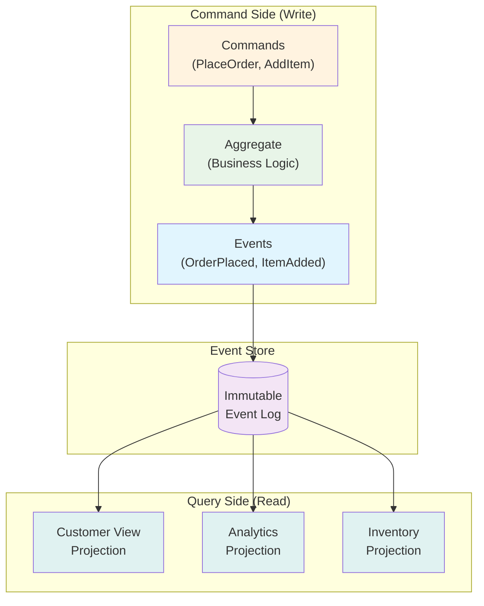

# Key Abstractions: The Building Blocks of Event Sourcing

## The Event: The Atomic Unit of Change

An **Event** represents a single, immutable fact about something that happened in your domain. Events are past tense—they describe what occurred, not what should happen.

### Anatomy of an Event
```json
{
  "eventType": "OrderPlaced",
  "aggregateId": "order-123",
  "timestamp": "2024-01-15T10:30:00Z",
  "version": 1,
  "data": {
    "customerId": "customer-456",
    "items": [
      {"productId": "product-789", "quantity": 2, "price": 29.99}
    ],
    "totalAmount": 59.98
  }
}
```

### Event Naming Conventions
Events should be named with past-tense verbs that clearly indicate what happened:
- ✅ `OrderPlaced`, `PaymentProcessed`, `ItemShipped`
- ❌ `PlaceOrder`, `ProcessPayment`, `ShipItem`

## The Event Stream: The Entity's Life Story

An **Event Stream** is an ordered sequence of events for a specific entity (usually called an "aggregate" in Domain-Driven Design). Each stream represents the complete history of changes to that entity.

### Bank Account Example
```
Account Stream (account-789):
1. AccountOpened        { balance: $1000 }
2. DepositMade         { amount: $500 }
3. WithdrawalMade      { amount: $200 }
4. InterestCredited    { amount: $5.50 }

Current Balance = $1000 + $500 - $200 + $5.50 = $1,305.50
```

The stream acts like a ledger—each entry builds upon the previous ones to create the current state.

## Projections: Optimized Views of Reality

A **Projection** (also called a "read model") is a view of the data optimized for specific queries. Projections are built by processing events from one or more streams.

### The Power of Multiple Projections
From the same event stream, you can create different projections for different needs:

**Order Events Stream:**
```
OrderPlaced → ItemAdded → PaymentProcessed → OrderShipped
```

**Customer Service Projection:**
```sql
Orders Table:
| order_id | customer_id | status   | total  | created_at |
| order-1  | cust-456    | shipped  | $59.98 | 2024-01-15 |
```

**Analytics Projection:**
```sql
Daily Sales Table:
| date       | total_orders | total_revenue |
| 2024-01-15 | 42          | $2,847.32     |
```

**Inventory Projection:**
```sql
Product Stock Table:
| product_id  | reserved | available |
| product-789 | 2        | 48        |
```

## The Event Store: The System of Record

The **Event Store** is a specialized database designed to append and read events efficiently. Unlike traditional databases optimized for CRUD operations, event stores are optimized for:

- **Appending**: Adding new events to streams
- **Reading**: Retrieving events from streams in order
- **Subscriptions**: Notifying projections when new events arrive

### Key Characteristics
1. **Append-Only**: Events are never updated or deleted
2. **Ordering**: Events within a stream maintain strict ordering
3. **Atomic Writes**: Multiple events can be written atomically
4. **Optimistic Concurrency**: Prevents concurrent modifications to the same stream

## Aggregate: The Consistency Boundary

An **Aggregate** is a domain concept that represents a cluster of related objects that must remain consistent. In event sourcing, aggregates:

1. **Receive Commands**: Business operations that might result in events
2. **Validate Business Rules**: Ensure the command is valid given current state
3. **Emit Events**: Produce events that represent the changes
4. **Maintain State**: Reconstruct their current state from their event stream

### Shopping Cart Aggregate Example
```rust
pub struct ShoppingCart {
    id: String,
    customer_id: String,
    items: Vec<CartItem>,
    status: CartStatus,
}

impl ShoppingCart {
    pub fn add_item(&mut self, product_id: String, quantity: u32) -> Result<Vec<Event>, Error> {
        // Validate business rules
        if self.status == CartStatus::CheckedOut {
            return Err(Error::CartAlreadyCheckedOut);
        }
        
        // Emit event
        Ok(vec![Event::ItemAdded { product_id, quantity }])
    }
}
```

## Command vs Event: The Intent vs The Fact

Understanding the distinction between commands and events is crucial:

### Commands (Intent)
- Represent a request to do something
- Can be rejected
- Present tense: `PlaceOrder`, `AddItem`, `ProcessPayment`

### Events (Facts)
- Represent something that actually happened
- Cannot be rejected (they already occurred)
- Past tense: `OrderPlaced`, `ItemAdded`, `PaymentProcessed`

```
Command: "Please add this item to the cart"
↓ (validation & business logic)
Event: "Item was added to the cart"
```

## The Analogy: A Restaurant Order System

Imagine a restaurant where every action is recorded on separate slips of paper:



- **Events**: Order slips that go to the kitchen ("Table 5 ordered pasta", "Table 5 ordered wine")
- **Event Stream**: All slips for Table 5, in chronological order
- **Projections**: 
  - Kitchen view: What needs to be cooked
  - Bar view: What drinks to prepare
  - Billing view: What to charge the customer
- **Event Store**: The collection of all order slips from all tables
- **Aggregate**: Table 5's complete order state

The beauty is that each department (kitchen, bar, billing) can maintain its own optimized view of the data, but they all derive from the same source of truth—the chronological order slips.

This restaurant never "updates" an order slip—if something changes, they write a new slip ("Table 5 cancelled the wine"). This creates a complete audit trail and allows any department to reconstruct exactly what happened with any order.

## The Event Sourcing Architecture

